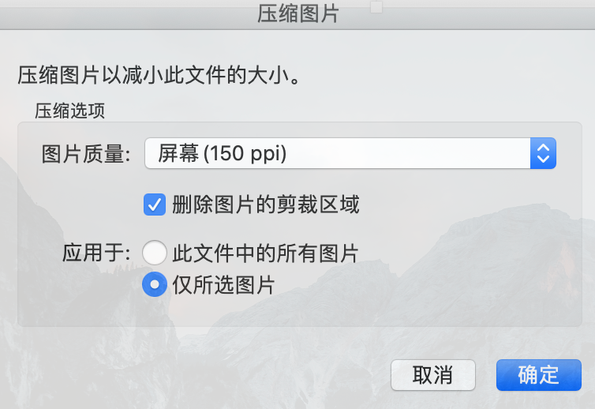
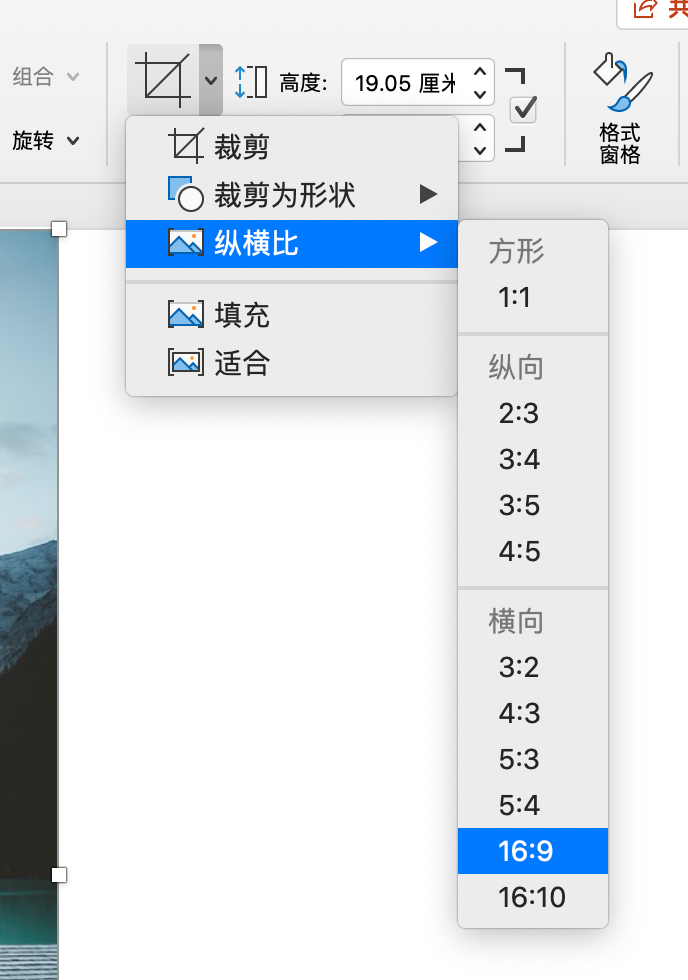
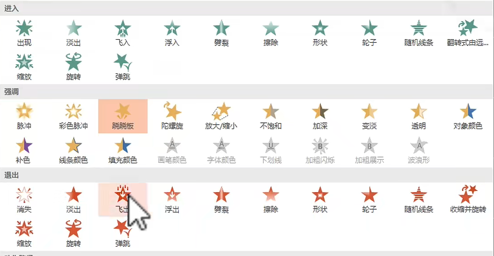

## PPT教程

> B站：https://www.bilibili.com/video/BV1xf4y157Db?p=2

### 1 形状

> 按住 **shift** 再点击形状

* 画成标准形态：按住 **shift** 再点击形状，可以直接生成标准形态（圆、正方形）

### 2 图片压缩

> 图片格式-压缩图片

* 插入超清图片，可以在菜单栏：**图片格式-压缩图片**，这样可以保证PPT的**内存大小**
* 

### 3 图片裁剪

#### 3.1 图片尺寸不对

> 图片格式-裁剪

* 如果要转换为16:9，可以直接选择
* 

#### 3.2 提取目标

> 图片格式-删除背景

* 
* 标记要保留和删除的区域，类似于PS处理

### 4 动画

> 动画，选择 进入、强调、退出

* 选取一个模块，然后选择动画
* 设置动画时间

  