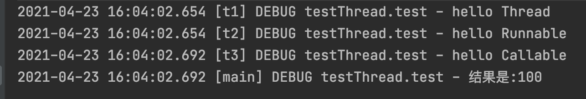

# 并发编程

## 一、配置环境

1. 新建maven项目

2. `pom.xml`

	```xml
	<?xml version="1.0" encoding="UTF-8"?>
	<project xmlns="http://maven.apache.org/POM/4.0.0"
	         xmlns:xsi="http://www.w3.org/2001/XMLSchema-instance"
	         xsi:schemaLocation="http://maven.apache.org/POM/4.0.0 http://maven.apache.org/xsd/maven-4.0.0.xsd">
	    <modelVersion>4.0.0</modelVersion>
	
	    <groupId>org.example</groupId>
	    <artifactId>ConcurrentProgramming</artifactId>
	    <version>1.0-SNAPSHOT</version>
	
	    <properties>
	        <maven.compiler.source>8</maven.compiler.source>
	        <maven.compiler.target>8</maven.compiler.target>
	    </properties>
	
	    <dependencies>
	        <dependency>
	            <groupId>org.projectlombok</groupId>
	            <artifactId>lombok</artifactId>
	            <version>1.18.12</version>
	        </dependency>
	        <dependency>
	            <groupId>ch.qos.logback</groupId>
	            <artifactId>logback-classic</artifactId>
	            <version>1.2.3</version>
	        </dependency>
	    </dependencies>
	
	</project>
	```

3. `logback.xml`

	```xml
	<?xml version="1.0" encoding="UTF-8"?>
	<configuration debug="false">
	    <!--定义日志文件的存储地址 勿在 LogBack 的配置中使用相对路径 -->
	    <property name="LOG_HOME" value="/Users/nihaopeng/个人/Git/JavaWeb/ConcurrentProgramming" />
	    <!-- 控制台输出 -->
	    <appender name="STDOUT"
	              class="ch.qos.logback.core.ConsoleAppender">
	        <encoder
	                class="ch.qos.logback.classic.encoder.PatternLayoutEncoder">
	            <!--格式化输出：%d表示日期，%thread表示线程名，%-5level：级别从左显示5个字符宽度%msg：日志消息，%n是换行符 -->
	            <pattern>%d{yyyy-MM-dd HH:mm:ss.SSS} [%thread] %-5level %logger{50} - %msg%n</pattern>
	        </encoder>
	    </appender>
	    <!-- 按照每天生成日志文件 -->
	    <appender name="FILE"
	              class="ch.qos.logback.core.rolling.RollingFileAppender">
	        <rollingPolicy
	                class="ch.qos.logback.core.rolling.TimeBasedRollingPolicy">
            <!--日志文件输出的文件名 -->
	            <FileNamePattern>${LOG_HOME}/TestWeb.log.%d{yyyy-MM-dd}.log</FileNamePattern>
	            <!--日志文件保留天数 -->
	            <MaxHistory>30</MaxHistory>
	        </rollingPolicy>
	        <encoder
	                class="ch.qos.logback.classic.encoder.PatternLayoutEncoder">
	            <!--格式化输出：%d表示日期，%thread表示线程名，%-5level：级别从左显示5个字符宽度%msg：日志消息，%n是换行符 -->
	            <pattern>%d{yyyy-MM-dd HH:mm:ss.SSS} [%thread] %-5level %logger{50} - %msg%n</pattern>
	        </encoder>
	        <!--日志文件最大的大小 -->
	        <triggeringPolicy
	                class="ch.qos.logback.core.rolling.SizeBasedTriggeringPolicy">
	            <MaxFileSize>10MB</MaxFileSize>
	        </triggeringPolicy>
	    </appender>
	
	    <!-- 日志输出级别 -->
	    <root level="DEBUG">
	        <appender-ref ref="STDOUT" />
	    </root>
	</configuration>
	```
	
	

## 二、基础

> 进程：
>
> * 程序由指令和数据组成，但这些指令要运行，数据要读写，就必须将指令加载至 CPU，数据加载至内存。在 指令运行过程中还需要用到磁盘、网络等设备。进程就是用来加载指令、管理内存、管理 IO 的 
> * 当一个程序被运行，从磁盘加载这个程序的代码至内存，这时就开启了一个进程。 
> * 进程就可以视为程序的一个实例。大部分程序可以同时运行多个实例进程（例如记事本、画图、浏览器 等），也有的程序只能启动一个实例进程（例如网易云音乐、360 安全卫士等）
>
> 线程：
>
> * 一个进程之内可以分为一到多个线程。 
> * 一个线程就是一个指令流，将指令流中的一条条指令以一定的顺序交给 CPU 执行 
> * Java 中，线程作为最小调度单位，进程作为资源分配的最小单位。 在 windows 中进程是不活动的，只是作 为线程的容器

### 2.1 三种实现多线程方式

**Thread**

1. 不能多次调用Thread中的start()方法，否则会抛出IllegalThreadStateException异常。
2. 启动线程的方法不是run()方法而是start方法，如果调用的是run()方法就是同步的，并不能异步执行。
3. 执行start()方法的顺序不代表线程启动的顺序，即并不是说，越早调用某个线程的start()方法，它就能越早的执行其中的run()方法。

**Runnable**

1. Thread类中定义了多种方法可以被派生类使用或重写，但是只有run()方法必须被重写的，在run()方法中实现啊这个线程的主要功能,这就是Runnable接口所需实现的方法
2. 通过继承Thread的实现方法与实现Runnable接口的效果相同，并且Java只能是单继承、多实现，如果一个类中已经继承其他所需的类，那实现一个接口是必须的。

**Callable**

Callable接口是属于Executor，对比与Runnable接口功能的**区别**是:

1. Callable可以在任务结束后提供一个返回值，Runnable没有这个功能
2. Callable中的call()方法可以抛出异常，而Runnable的run()方法不能抛出异常
3. 运行Callable可以拿到一个Future对象，Future独享表示异步计算的结果，它提供了检查计算是否完成的方法。由于线程属于异步计算模型，因此无法从别的线程中得到函数的返回值，在这种情况下，就可以使用Future来监视目标线程调用call()方法的情况，放调用Future的get()方法以获取结果时，当前线程就会阻塞，知道call()方法结束返回结果。

`test.java`

```java
package testThread;

import org.slf4j.LoggerFactory;

import java.util.concurrent.ExecutionException;
import java.util.concurrent.FutureTask;
import ch.qos.logback.classic.Logger;

public class test {
    private final static Logger log = (Logger) LoggerFactory.getLogger(test.class);

    public static void main(String[] args) throws ExecutionException, InterruptedException {
        // 方式一：Thread
        Thread task1 = new Thread("t1") {
            @Override
            public void run() {
                log.debug("hello Thread");
            }
        };
        task1.start();

        // 方式二：Runnable
        Runnable task2 = new Runnable() {
            @Override
            public void run() {
                log.debug("hello Runnable");
            }
        };
        Thread t = new Thread(task2, "t2");
        t.start();

        // 方式三：Callable
        FutureTask<Integer> task3 = new FutureTask<>(() -> {
            log.debug("hello Callable");
            return 100;
        });
        Thread t3 = new Thread(task3, "t3");
        t3.start();
        Integer result = task3.get();
        log.debug("结果是:{}", result);
    }
}
```



