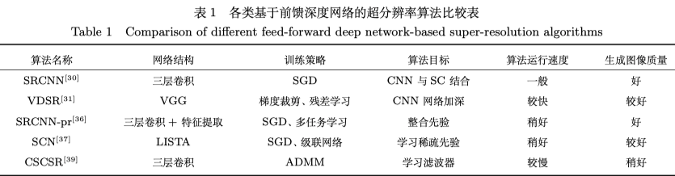
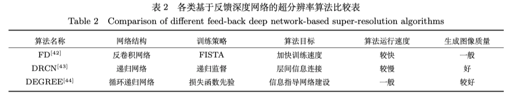
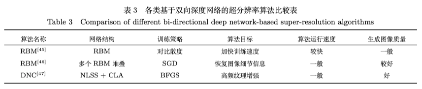

# Super Resolution

论文汇总[https://github.com/ChaofWang/Awesome-Super-Resolution#non-dl-based-approach]

## 1 名词

* 传统方法：
	* 基于重建的方法（配准+重建）：对图像的获取过程建立观测模型, 然后通过求解观测模型的逆问题来实现超分辨率重建
	* 基于浅层学习的方法（特征提取+搜索模型+重建）：通过学习获得高分辨率图像与低分辨率图像之间的映射关系, 用于指导高分辨率图像的重建
* **SRCNN**(Super resolution using convolution neural network)：基于卷积神经网络的超分
* **VDSR**(Very deep convolution for SR)：基于极深网络的方法
* **SRCNN-Pr**(SR-CNN with Prior)：基于整合先验的卷积神经网络方法
* **SCN**(Sparse coding based network)：基于稀疏编码网络的方法
* **CSCSR**(Convolutional sparse coding super resolution)：基于卷积稀疏编码的方法
* **SCSR**(Sparse coding based super resolution)：基于稀疏编码的超分辨率


## 2 基于卷积神经网络的SR方法（SRCNN）

```latex
@article{dong2015image,
  title={Image super-resolution using deep convolutional networks},
  author={Dong, Chao and Loy, Chen Change and He, Kaiming and Tang, Xiaoou},
  journal={IEEE transactions on pattern analysis and machine intelligence},
  volume={38},
  number={2},
  pages={295--307},
  year={2015},
  publisher={IEEE}
}
```

* 网络分成：图像块提取、非线性映射和图像重建三个阶段，实现从LR到HR的端到端学习
* 此方法表面：深度神经网络端到端的联合优化优于浅层学习方法的独立优化
* 缺点：
	* 加深网络层数的同时并未获得更好的效果
	* 不适用多尺度放大
	* 训练收敛速度慢
	* 图像块上下文依赖


## 3 基于极深网络的SR方法（VDSR）

```tex
@inproceedings{kim2016accurate,
  title={Accurate image super-resolution using very deep convolutional networks},
  author={Kim, Jiwon and Kwon Lee, Jung and Mu Lee, Kyoung},
  booktitle={Proceedings of the IEEE conference on computer vision and pattern recognition},
  pages={1646--1654},
  year={2016}
}
```

* 主要思想：将阶数较少的滤波器多次级联，充分利用LR和HR较大图像区域的上下文信息，获得LR和HR之间的相关性。
* 采用残差训练的方法训练，对LR和HR图像间的残差进行训练，并采用较高学习率加快收敛
* 结构：
	* SRCNN只有三个卷积层，每层滤波器数量较多且尺度较大（窄宽型结构）
	* VDSR有二十个卷积层，每层卷积层滤波器数量多，尺寸小，保持一致性（细长型结构，能增加图像局部感受野）
		* 局部感受野：可构成相邻层神经元的上下文信息关联（VDSR采用多个3*3滤波器）
		* 采用较高学习率，并用可调梯度裁剪策略调整梯度信息，避免梯度消失和梯度爆炸问题
		* 多尺度权值共享，通过同一个网络处理不同尺度的图像放大问题
* 优点：
	* 克服了SRCNN上下文信息缺乏关联、单一尺度放大、收敛速度慢
	* 通过权值共享实现了参数更少、性能更佳的图像多尺度放大


## 4 基于整合先验知识的卷积神经网络SR方法（SRCNN-Pr）

```tex
@article{liang2016incorporating,
  title={Incorporating image priors with deep convolutional neural networks for image super-resolution},
  author={Liang, Yudong and Wang, Jinjun and Zhou, Sanping and Gong, Yihong and Zheng, Nanning},
  journal={Neurocomputing},
  volume={194},
  pages={340--347},
  year={2016},
  publisher={Elsevier}
}
```

* 主要思想：
	* 首先，通过不同尺度的SRCNN网络进行图像的结构相似性学习
	* 然后，在SRCNN的末端连接一个特征提取层（sobel算子），得到图像的梯度信息
	* 最后，采用信息融合的策略得到重建图像。在损失函数中添加了重建图像的梯度信息与目标HR图像的梯度信息一致的约束条件，充分利用图像的边缘信息。
* 训练过程：先输入LR图像，通过放大因子为2、3、4的网络，实现多尺度放大，再与第二个卷积层实现权值共享，缓解了多任务放大的参数量过多的问题


## 5 基于稀疏编码网络的SR方法（SCN）

```tex
@inproceedings{wang2015deep,
  title={Deep networks for image super-resolution with sparse prior},
  author={Wang, Zhaowen and Liu, Ding and Yang, Jianchao and Han, Wei and Huang, Thomas},
  booktitle={Proceedings of the IEEE international conference on computer vision},
  pages={370--378},
  year={2015}
}
```

* 主要思想：
	* 借鉴基于稀疏表示超分重建的思想，将稀疏表示、映射、稀疏重建三个独立优化的模块纳入一个稀疏网络中
		* 稀疏编码网络先通过特征提取层得到图像的稀疏先验信息
		* 然后通过基于学习的迭代收缩和阈值算法建立一个前馈神经网络SCN
		* 最后采用级联网络完成图像放大，提升PSNR
	* 网络的训练，相当于对三个模块协同优化，得到全局最优解


## 6 基于卷积稀疏编码的SR方法（CSCSR）

```tex
@inproceedings{gu2015convolutional,
  title={Convolutional sparse coding for image super-resolution},
  author={Gu, Shuhang and Zuo, Wangmeng and Xie, Qi and Meng, Deyu and Feng, Xiangchu and Zhang, Lei},
  booktitle={Proceedings of the IEEE International Conference on Computer Vision},
  pages={1823--1831},
  year={2015}
}
```

* 主要思想：
	* 首先进行LR滤波器、特征映射和HR滤波器的独立学习
		* LR分为模糊成分和残差成分，分别提取低频和高频信息，以获得稀疏特征映射
			* 模糊成分采用双三次插值放大
			* 残差成分分解到多个特征映射
	* 然后，在特征表示部分，考虑到相邻图像块重叠区域的像素相同，将图像分解为不重叠的图像块
	* 最后，将特征映射和HR滤波器联合学习




## 7 基于快速反卷积的SR方法（FD）

```tex
@inproceedings{krishnan2009fast,
  title={Fast image deconvolution using hyper-Laplacian priors},
  author={Krishnan, Dilip and Fergus, Rob},
  booktitle={Advances in neural information processing systems},
  pages={1033--1041},
  year={2009}
}
```

* 主要思想：由初始上采样、梯度先验计算和快速反卷积三个阶段组成
	* 首先，采用双三次插值法初始化低分辨率图到合适的分辨率
	* 然后，由快速反卷积估计恢复到高分辨率图像
	* 最后，经傅里叶逆变换得到重建图像


## 8 基于深度递归网络的SR方法（DRCN）

```tex
@inproceedings{kim2016deeply,
  title={Deeply-recursive convolutional network for image super-resolution},
  author={Kim, Jiwon and Kwon Lee, Jung and Mu Lee, Kyoung},
  booktitle={Proceedings of the IEEE conference on computer vision and pattern recognition},
  pages={1637--1645},
  year={2016}
}
```

* 主要思想：
	* 首先，在极深网络的各层建立预测信息的监督层
	* 然后，将各层的预测信息通过跳跃连接到重建层
	* 最后，在重建层完成图像重建
* 该方案表明了递归网络与跳跃连接相结合的方法可实现图像层间信息反馈及上下文信息关联


## 9 基于深度边缘知道反馈残差网络的SR方法（DEGREE）

* 主要思想：
	* 将低分辨率图像边缘作为先验信息，并为特征映射学习提供指导
	* 然后，为避免忽略不同频带间的固有性质（高频边缘和纹理细节信息）
		* 通过递归残差网络将图像信号分解为边缘、纹理等多个成分，分别作为不同的频率子带，各部分独立重建
	* 最后，不同频带信息组合得到最终的重建图像
* 网络结构：
	* LR边缘提取层
	* 递归残差网络
	* HR边缘预测层
	* 残差子带融合层
* 训练策略：
	* 使用分类连接克服了SRCNN等方法收敛速度慢的缺点
	* 损失函数分为三种：边缘损失、重建损失和总损失
* 该方案表明嵌入先验信息到深度网络可以知道边缘特征重建




## 10 基于受限玻尔兹曼机的SR方法

```tex
@inproceedings{gao2013restricted,
  title={Restricted Boltzmann machine approach to couple dictionary training for image super-resolution},
  author={Gao, Junbin and Guo, Yi and Yin, Ming},
  booktitle={2013 IEEE International Conference on Image Processing},
  pages={499--503},
  year={2013},
  organization={IEEE}
}
```

* 主要思想：
	* 采用稀疏编码的方式，在字典中预先学习稀疏先验，再进行字典学习
	* 在RBM编码中，图像块作为字典的成分
	* 训练过程中，采用对比散度算法加快训练


## 11 基于堆协同局部自编码的SR方法

```tex
@inproceedings{cui2014deep,
  title={Deep network cascade for image super-resolution},
  author={Cui, Zhen and Chang, Hong and Shan, Shiguang and Zhong, Bineng and Chen, Xilin},
  booktitle={European Conference on Computer Vision},
  pages={49--64},
  year={2014},
  organization={Springer}
}
```

* 主要思想：
	* 通过将多个相同网络结构级联，实现图像的逐级放大
	* 采用多尺度非局部相似检索和协同自编码器构成，用于解决误差传递和相邻块之间的兼容性问题




