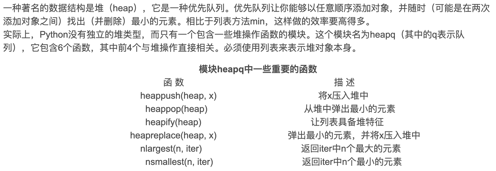

# Python-Api

## 1 Heapq



* **取数组中前多少最大值的方法**

	```
	heapq.nlargest(k, nums)
	```

## 2 Counter

* **计算数组中每个数字的频率**

	```python
	from collections import Counter
	count = Counter(nums)   
	print(count)		# Counter({1: 3, 2: 2, 3: 1})
	return heapq.nlargest(k, count.keys(), key=count.get)   # count.get指取value比较
	```

* 计算但是数字在数组中出现的频率

	```python 
	print(nums.count(n))
	```

	

## 3 bisect

* **在数组中插入数字的位置**
	* 存在就有左右两种索引位置

```python
i = bisect.bisect_left(nums, target)
if i == len(nums) or nums[i] != target: return [-1, -1]
j = bisect.bisect_right(nums, target)
return [i, j-1]
```

