# python学习笔记

```python
print("XXXX %06d" % 100)		# 6位显示整数，不足前面补0
print("XXXX %.2f" % 3.145)	# 小数点后保留2位	if / elif / else
```


## 1. 中文编码

​	Python中默认的编码格式是 ASCII 格式，在没修改编码格式时无法正确打印汉字，所以在读取中文时会报错。

```python
# -*- coding: UTF-8 -*-
```

​	**注意** ：python3 源码文件默认使用utf-8编码，可以正常指定中文。


## 2. 基础语法

### 2.1. 脚本式编程

#### 2.1.1. 运行脚本

​	通过脚本参数调用解释器开始执行脚本，直到脚本执行完毕。

```python
$ python test.py
```

#### 2.1.2. 标识符

* 在python中，标识符由**字母**、**数字**、**下划线**组成。
* 可以包括**英文**、**数字**、以及**下划线**，但是，<u>**不能由数字开头**</u>。
* 标识符区分大小写。

 -	**单下划线**开头代表不能直接访问的类属性，需通过类提供的接口进行访问。
 -	**双下划线**代表类的私有成员，以双下划线开头和结尾的 **__foo__** 代表 Python 里特殊方法专用的标识。

#### 2.1.3. 引号

* 三引号可以由多行组成，编写多行文本的快捷语法，常用于文档字符串，在文件的特定地点，被当做注释。

#### 2.1.4. 注释

* 单行注释时，以**#**开头。
* 多行注释使用三个单引号(''')或三个双引号(""")。

```python
'''
这是多行注释，使用单引号。
这是多行注释，使用单引号。
这是多行注释，使用单引号。
'''
```

#### 2.1.5.print输出

* print输出默认是换行的，如果不需要换行则在变量末尾加上**，**（逗号）。

```python
#换行输出
print(x)

#不换行输出
print(x,)			#python2
print(x,end=" ")	#python3
```


### 2.2. 数字类型

* **int**：表示为长整型，没有python2中的Long。
* **bool**：布尔型，true。
* **float**：浮点数，如1.23, 3E-2。
* **complex**：复数（1+2j）。


### 2.3. 字符串（String）

* 使用三引号('''或""")可以指定一个多行字符串。

* 反斜杠\可以用来转义，使用r可以让反斜杠不发生转义。如：

  ```python
   r"this is a line with \n"
  ```

   则**\n**会显示，并不是换行。

* Python 中的字符串有两种索引方式，从左往右以 0 开始，从右往左以 -1 开始。

* 字符串的截取的语法格式如下：**变量[头下标:尾下标:步长]**

```python
str='Runoob'
 
print(str)                 # 输出字符串
print(str[0:-1])           # 输出第一个到倒数第二个的所有字符
print(str[0])              # 输出字符串第一个字符
print(str[2:5])            # 输出从第三个开始到第五个的字符
print(str[2:])             # 输出从第三个开始的后的所有字符
print(str * 2)             # 输出字符串两次
print(str + '你好')        # 连接字符串
 
print('hello\nrunoob')      # 使用反斜杠(\)+n转义特殊字符
print(r'hello\nrunoob')     # 在字符串前面添加一个 r，表示原始字符串，不会发生转义
```


### 2.4. 模块导入

* 将整个模块(somemodule)导入，格式为： **import somemodule**
* 从某个模块中导入某个函数,格式为： **from somemodule import somefunction**
* 将某个模块中的全部函数导入，格式为： **from somemodule import \***


## 3. 基本数据类型

### 3.1. 变量声明、赋值

* Python 中的变量不需要声明。每个变量在使用前都必须赋值，变量赋值以后该变量才会被创建。

```python
counter = 100          # 整型变量
miles   = 1000.0       # 浮点型变量
name    = "runoob"     # 字符串
 
print (counter)
print (miles)
print (name)
```

* 多变量赋值

```python
a=b=c=1
a,b,c = 1, 2,"runoob"
```


### 3.2. 标准数据类型

* **不可变数据**：Number , String , Tuple 。
* **可变数据**：List , Dictionary , Set 。

#### 3.2.1. 数值运算

- 数值的除法包含两个运算符：**/** 返回一个浮点数，**//** 返回一个整数。
- 在混合计算时，Python会把整型转换成为浮点数。

#### 3.2.2. Number（数字）

* Python3 支持 **int、float、bool、complex（复数）**。
* 在Python 3里，只有一种整数类型 int，表示为长整型，没有 python2 中的 Long。

```python
>>> a, b, c, d = 20, 5.5, True, 4+3j
>>> print(type(a), type(b), type(c), type(d))
<class 'int'> <class 'float'> <class 'bool'> <class 'complex'>

>>>a = 111
>>> isinstance(a, int)
True
>>>
```

isinstance 和 type 的区别在于：

​	(1)   type()不会认为子类是一种父类类型。

​	(2)   isinstance()会认为子类是一种父类类型。

#### 3.2.3. String（字符串）

* Python中的字符串用单引号 **'** 或双引号 **"** 括起来，同时使用反斜杠 **\** 转义特殊字符。

* 字符串的截取的语法格式如下：（索引值以 **0** 为开始值，**-1** 为从末尾的开始位置。）

  ```python
  变量[头下标:尾下标]
  ```

* 加号 **+** 是字符串的连接符， 星号 ***** 表示复制当前字符串，紧跟的数字为复制的次数。实例如下：

  ```python
  str = 'Runoob'
   
  print (str)          # 输出字符串
  print (str[0:-1])    # 输出第一个到倒数第二个的所有字符
  print (str[0])       # 输出字符串第一个字符
  print (str[2:5])     # 输出从第三个开始到第五个的字符
  print (str[2:])      # 输出从第三个开始的后的所有字符
  print (str * 2)      # 输出字符串两次
  print (str + "TEST") # 连接字符串
  ```

* Python 使用反斜杠(\)转义特殊字符，如果你不想让反斜杠发生转义，可以在字符串前面添加一个 r，表示原始字符串：

  ```python
  >>> print('Ru\noob')
  Ru
  oob
  >>> print(r'Ru\noob')
  Ru\noob
  ```

* **注意，Python 没有单独的字符类型，一个字符就是长度为1的字符串。**

#### 3.2.4. List（列表）

* 列表中元素的类型可以不相同，支持 **数字** 、**字符串**甚至 **列表**。

* 列表截取的语法格式如下：

  ```python
  变量[头下标:尾下标]
  ```

  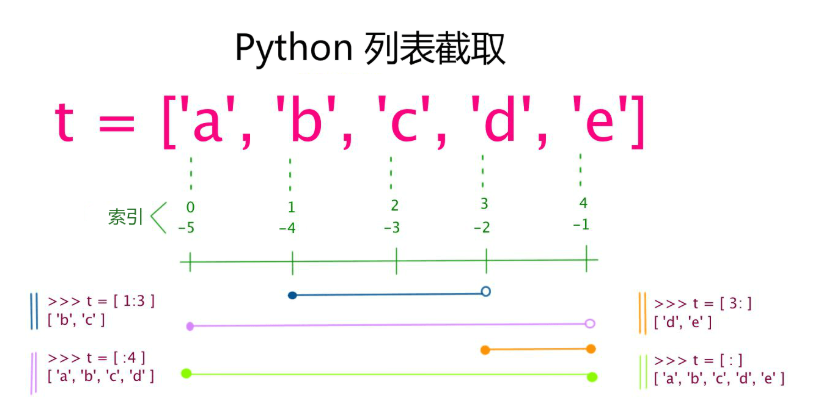

  加号 **+** 是列表连接运算符，星号 ***** 是重复操作。如下实例：

  ```python
  list = [ 'abcd', 786 , 2.23, 'runoob', 70.2 ]
  tinylist = [123, 'runoob']
   
  print (list)            # 输出完整列表
  print (list[0])         # 输出列表第一个元素
  print (list[1:3])       # 从第二个开始输出到第三个元素
  print (list[2:])        # 输出从第三个元素开始的所有元素
  print (tinylist * 2)    # 输出两次列表
  print (list + tinylist) # 连接列表
  ```

* 列表中的元素可以改变：

  ```python
  >>>a = [1, 2, 3, 4, 5, 6]
  >>> a[0] = 9
  >>> a[2:5] = [13, 14, 15]
  >>> a
  [9, 2, 13, 14, 15, 6]
  >>> a[2:5] = []  		 # 将对应的元素值设置为 [] 
  >>> a
  [9, 2, 6]
  ```

* Python 列表截取可以接收第三个参数，参数作用是截取的步长。

  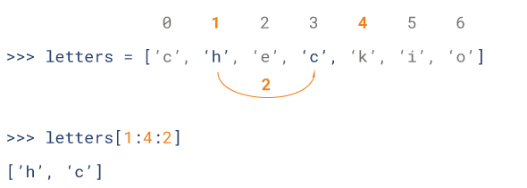

#### 3.2.5. Tuple（元组）

* 元组写在小括号 **()** 里，元素之间用逗号隔开。

  ```python
  tuple = ( 'abcd', 786 , 2.23, 'runoob', 70.2  )
  tinytuple = (123, 'runoob')
   
  print (tuple)             # 输出完整元组
  print (tuple[0])          # 输出元组的第一个元素
  print (tuple[1:3])        # 输出从第二个元素开始到第三个元素
  print (tuple[2:])         # 输出从第三个元素开始的所有元素
  print (tinytuple * 2)     # 输出两次元组
  print (tuple + tinytuple) # 连接元组
  ```

* 元组与字符串类似，可以被索引且下标索引从0开始，-1 为从末尾开始的位置。也可以进行截取。

* 虽然tuple的元素不可改变，但它可以包含可变的对象，比如list列表。

* 构造包含 0 个或 1 个元素的元组比较特殊，所以有一些额外的语法规则：

  ```python
  tup1 = ()    # 空元组
  tup2 = (20,) # 一个元素，需要在元素后添加逗号
  ```

#### 3.2.6. Set（集合）

* 可以使用大括号 **{ }** 或者 **set()** 函数创建集合。

  创建一个空集合必须用 **set()** 而不是 **{ }**，因为 **{ }** 是用来创建一个空字典。

  ```
  parame = {value01,value02,...}
  或者
  set(value)
  ```

  ```python
  student = {'Tom', 'Jim', 'Mary', 'Tom', 'Jack', 'Rose'}
   
  print(student)   # 输出集合，重复的元素被自动去掉
   
  # 成员测试
  if 'Rose' in student :
      print('Rose 在集合中')
  else :
      print('Rose 不在集合中')
   
  # set可以进行集合运算
  a = set('abracadabra')
  b = set('alacazam')
   
  print(a)
  print(a - b)     # a 和 b 的差集
  print(a | b)     # a 和 b 的并集
  print(a & b)     # a 和 b 的交集
  print(a ^ b)     # a 和 b 中不同时存在的元素
  ```

#### 3.2.7. Dictionary（字典）

* 字典是一种映射类型，字典用 **{ }** 标识，它是一个无序的 **键(key) : 值(value)** 的集合。

* **键**必须使用**不可变类型**，同一个字典中，键必须是唯一的。

  ```python
  dict = {}
  dict['one'] = "1 - 菜鸟教程"
  dict[2]     = "2 - 菜鸟工具"
   
  tinydict = {'name': 'runoob','code':1, 'site': 'www.runoob.com'}
   
   
  print (dict['one'])       # 输出键为 'one' 的值
  print (dict[2])           # 输出键为 2 的值
  print (tinydict)          # 输出完整的字典
  print (tinydict.keys())   # 输出所有键
  print (tinydict.values()) # 输出所有值
  ```

* 构造函数 dict() 可以直接从键值对序列中构建字典如下：

  ```python
  >>>dict([('Runoob', 1), ('Google', 2), ('Taobao', 3)])
  {'Taobao': 3, 'Runoob': 1, 'Google': 2}
   
  >>> {x: x**2 for x in (2, 4, 6)}
  {2: 4, 4: 16, 6: 36}
   
  >>> dict(Runoob=1, Google=2, Taobao=3)
  {'Runoob': 1, 'Google': 2, 'Taobao': 3}
  ```


### 3.3. 数据类型转换

​	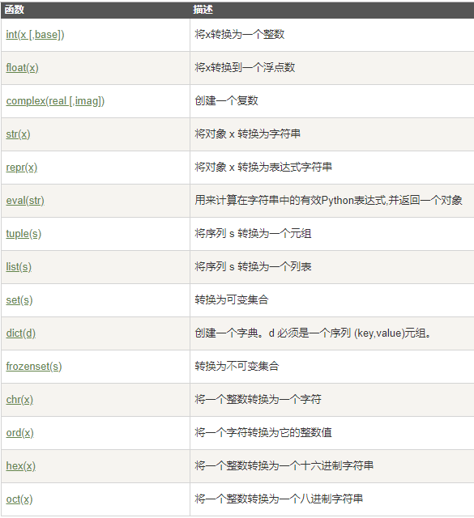


## 4. 解释器、注释

* Python 的编程模式分为两种：**交互式**，**脚本式**。

* 交互式编程，需要我们打开 cmd 窗口（命令提示符窗口），在窗口中键入`python`,回车，这样就进入了交互式编程。

* 脚本式编程，就是我们先把 python 语句写好，保存在后缀为 .py 的文件里，然后从外部调用这个文件。它也可以使用 cmd 窗口进行调用，**与交互式编程不同的是，不要在cmd窗口内输入python加回车来进入交互模式**

  ```python
  """
  这是多行注释，用三个双引号
  这是多行注释，用三个双引号 
  这是多行注释，用三个双引号
  """
  print("Hello, World!") 
  ```


## 5. 运算符

### 5.1. 算术运算符

```python
a = b ** n      #b的n次方
c = b // n      #整除，向下取整
```

### 5.2. 比较运算符

* 返回的是**布尔值**

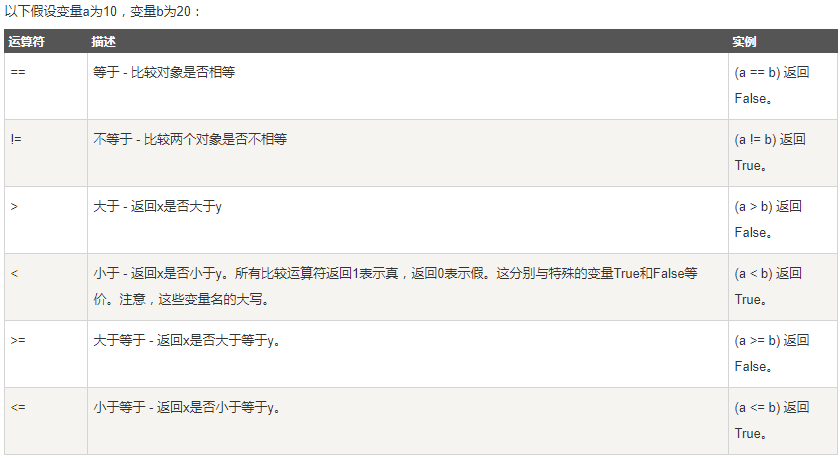

### 5.3. 赋值运算符

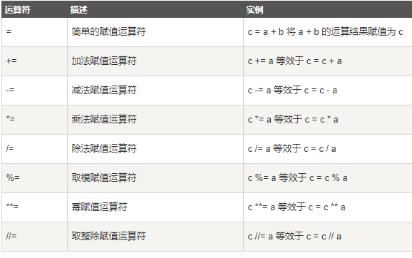

### 5.3. 位运算符

* 将数字看做二进制进行计算，假设a = 60 ,b = 13。

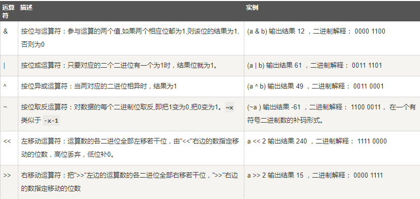

### 5.4. 逻辑运算符

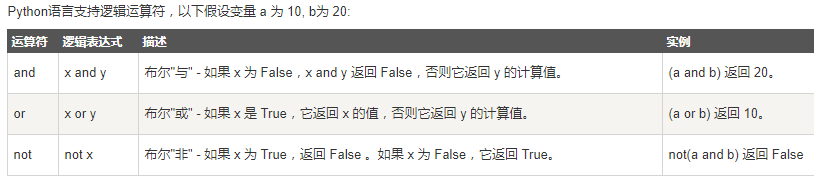

### 5.5. 成员运算符

* Python还支持成员运算符，测试实例中包含了一系列的成员，包括**字符串，列表或元组**。

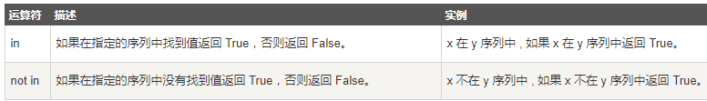

### 5.6. 身份运算符

* 身份运算符用于比较两个对象的**存储单元**

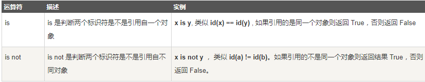

### 5.7. 运算符优先级

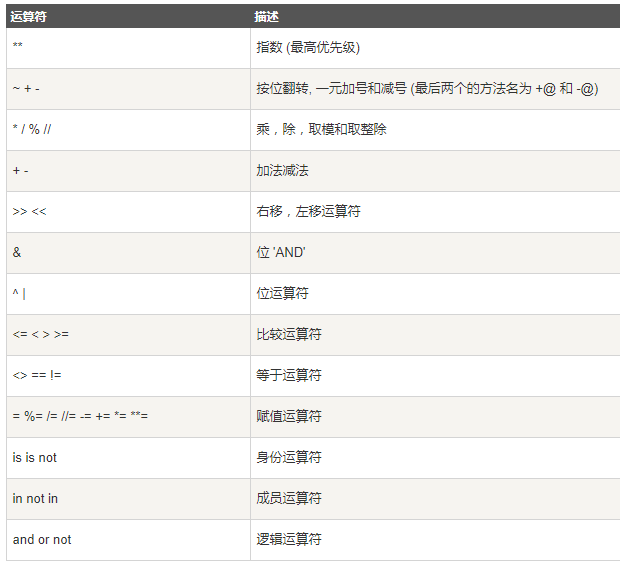


## 6. 数字（Number）

* Python 数字数据类型用于存储数值。
* 数据类型是**不允许**改变的,这就意味着如果改变数字数据类型的值，将**重新分配**内存空间。
  * **整型(Int)** - 通常被称为是整型或整数，是正或负整数，不带小数点。Python3 整型是没有限制大小的，可以当作 Long 类型使用，所以 Python3 没有 Python2 的 Long 类型。
  * **浮点型(float)** - 浮点型由整数部分与小数部分组成，浮点型也可以使用科学计数法表示（2.5e2 = 2.5 x 102 = 250）。
  * **复数( (complex))** - 复数由实数部分和虚数部分构成，可以用a + bj,或者complex(a,b)表示， 复数的实部a和虚部b都是**浮点型**。

```python 
>>> number = 0xA0F # 十六进制
>>> number
2575

>>> number=0o37 # 八进制
>>> number
31
```

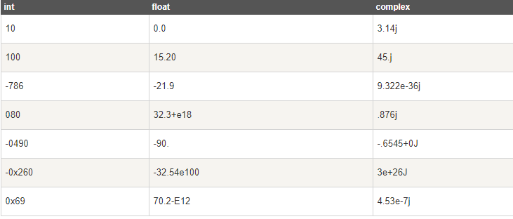

### 6.1. 数字类型转换

* **int(x)** 将x转换为一个整数。
* **float(x)** 将x转换到一个浮点数。
* **complex(x)** 将x转换到一个复数，实数部分为 x，虚数部分为 0。
* **complex(x, y)** 将 x 和 y 转换到一个复数，实数部分为 x，虚数部分为 y。x 和 y 是数字表达式。
* 在整数除法中，除法 **/** 总是返回一个浮点数，如果只想得到整数的结果，丢弃可能的分数部分，可以使用运算符 **//** 。

### 6.2. 数学函数


### 6.3. 随机数函数

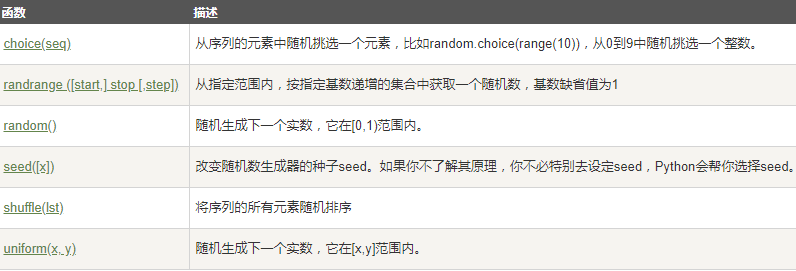

* 随机数函数中缺少 **randint,sample**

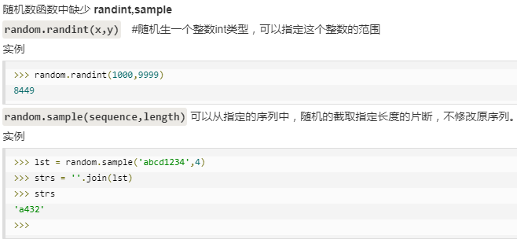

### 6.4. 三角函数

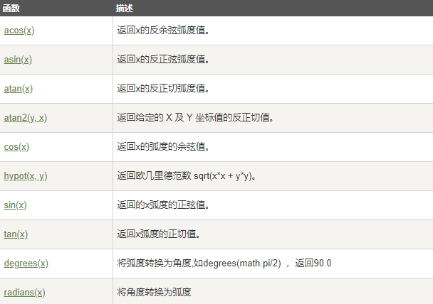

* **4舍6入5看齐,奇进偶不进（round用法）**

### 6.5. 整数比较

* Python中一切都是对象，对象比较可以用 **==** 或者 **is**。
* **==** 比较的是两个对象的内容是否相等，默认会调用对象的 **__eq__()** 方法。
* **is** 比较的是两个对象的 id 是否相等，也就是是否是同一个对象，是否指向同一个内存地址。


## 7. 字符串

* Python 不支持单字符类型，单字符在 Python 中也是作为一个字符串使用。

* 可以截取字符串的一部分与其他字段拼接。

  ```python
  var1 =  'hello world'
  print("新字符串：", var[:6] + 'nihaopeng')
  ```

### 7.1. 转义字符

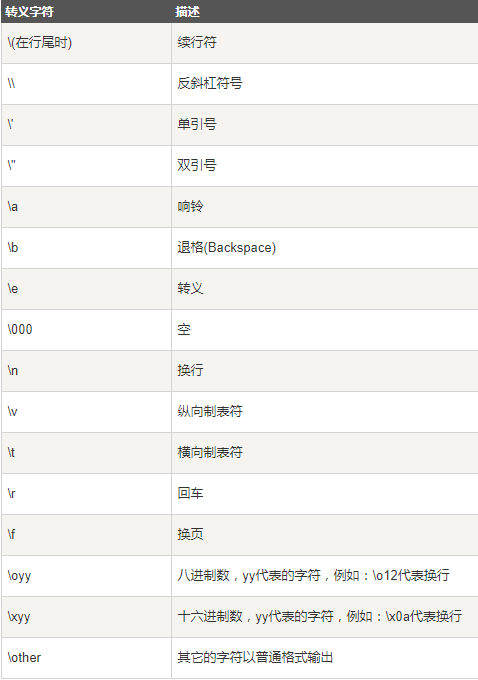

### 7.2. 字符串运算符

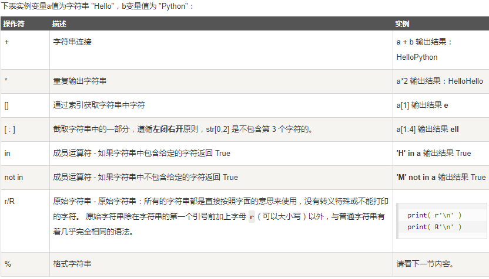

### 7.3. 字符串格式化

```python
print("I'm %s" % 'nihaopeng')

>>> num=18.7254
>>> print("the price  is  %.2f" %num)
the price  is  18.73
```

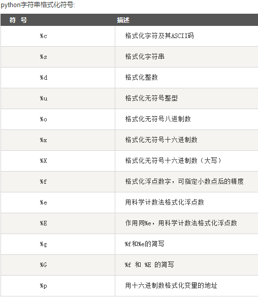

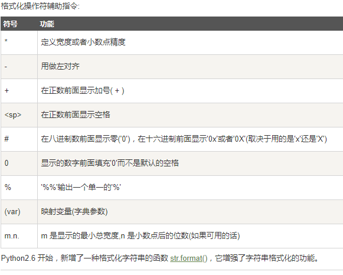

### 7.4. 三引号

* python三引号允许一个字符串跨多行，字符串中可以包含换行符、制表符以及其他特殊字符。

```python
para_str = """这是一个多行字符串的实例
多行字符串可以使用制表符
TAB ( \t )。
也可以使用换行符 [ \n ]。
"""
print (para_str)
```

* 在Python2中，普通字符串是以8位ASCII码进行存储的，而Unicode字符串则存储为16位unicode字符串，这样能够表示更多的字符集。使用的语法是在字符串前面加上前缀 **u**。
* 在Python3中，所有的字符串都是Unicode字符串。

### 7.5. 内建函数

http://www.runoob.com/python3/python3-string.html

```python
a = 'Iron man'

a.capitalize()						#首字符大写
a.center(width,fillchar)			
#返回一个指定宽度的字符串，fillchar为填充字符	
a.count(str, beg= 0,end=len(string))
#返回 str 在 string 里面出现的次数，如果 beg 或者 end 指定则返回指定范围内 str 出现的次数
```


## 8. list（列表）

* 列表是最常用的Python数据类型，它可以作为一个方括号内的逗号分隔值出现。

  ```python
  list1 = ['Google', 'Runoob', 1997, 2000];	
  print ("list1[0]: ", list1[0])
  ```

* 你可以对列表的数据项进行修改或更新，你也可以使用append()方法来添加列表项。

* 可以使用 del 语句来删除列表的的元素。

  ```python
  list = ['Google', 'Runoob', 1997, 2000]
   
  print ("原始列表 : ", list)
  del list[2]
  print ("删除第三个元素 : ", list)
  ```

### 8.1. 列表脚本操作符

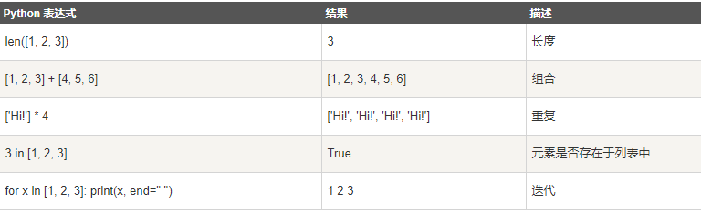

### 8.2. 列表函数&方法

* **len**：长度	**max,min**：最值	**list(seq)**：将字符串/元组转化为列表

* 方法：

  ```python
  list.append(obj)		#在列表末尾添加新的对象
  list.count(obj)			#统计某个元素在列表中出现的次数
  list.extend(seq)		#在列表末尾追加另一序列的多个值
  list.index(obj)			#找某一值的索引位置
  list.insert(index,obj)	#将对象插入列表
  list.pop(index=-1)		#移除列表中的一个元素（默认最后一个），并返回值
  list.remove(obj)		#移除列表中某个值的第一个匹配项
  list.reverse()			#反向列表中元素
  list.sort(key=None , reverse = False)
  #对原列表进行排序
  #reverse = True 降序， reverse = False 升序（默认）
  #key -- 主要是用来进行比较的元素，只有一个参数，当索引a是序列的时候
  list.clear()			#清空
  list.copy()				#复制
  ```

### 8.3. 笔记

* python 创建二维列表，将需要的参数写入 cols 和 rows 即可

  ```python
  list_2d = [[0 for col in range(cols)] for row in range(rows)]
  
  >>> list_2d = [ [0 for i in range(5)] for i in range(5)]
  >>> list_2d[0].append(3)
  >>> list_2d[0].append(5)
  >>> list_2d[2].append(7)
  >>> list_2d
  [[0, 0, 0, 0, 0, 3, 5], [0, 0, 0, 0, 0], [0, 0, 0, 0, 0, 7], [0, 0, 0, 0, 0], [0, 0, 0, 0, 0]]
  ```

* 列表复制时如果用**=**，改变一个列表，相同索引值的会一起改变

* 空列表可以简单地通过两个中括号进行表示([])- 一里面什么东西都没有，但是，如果想创建一个占用十个元素空间，却不包括任何有用内容的列表，可以类似于下面的方法，用某一个具体的值代替。

  ```python
  list_empty = [None]*10
  ```


## 9. tuple（元组）

* 元组与列表类似，不同点在于元组的元素**不能修改**

* 元组使用（），列表使用【】。

* 元组中只有一个元素时，必须加逗号。

  ```python
  >>>tup1 = (50)
  >>> type(tup1)     # 不加逗号，类型为整型
  <class 'int'>
   
  >>> tup1 = (50,)
  >>> type(tup1)     # 加上逗号，类型为元组
  <class 'tuple'>
  ```

### 9.1. 内置函数

```python
len(tuple)			#长度
max(tuple)			# max
min(tuple)
tuple(seq)			#将列表转化为元组
```

* tuple的陷阱：当你定义一个tuple时，在定义的时候，tuple的元素就必须被确定下来。


## 10. dictionary（字典）

* 字典是一种可变容器模型，可以存储**任意类型对象**。
* 每个键值对用：分割，每队之间用，分割，用{}包括。
* 键必须唯一，值则不必。
* 键可以取任何数据类型，但键必须是不可变的，如字符串、数字或者元组。

```python
dict1 = {'a': 456 , 98 : 123}
```

### 10.1. 访问字典值

```python
dict = {'Name' : 123 , 'Age' : 456 , 'Class' : 789}
print("dict['Name']", dict['Name'])
dict['Age'] = 8
```

### 10.2. 删除字典元素

```python
dict = {'Name': 'Runoob', 'Age': 7, 'Class': 'First'}

del dict['Name']		#删除键Name
dict.clear()			#清空字典
del dict				#删除字典
```

* 字典值可以是任何的python 对象
* 字典键不能出现两次，若创建时有2个相同的键，会记住后一个，且键必须不可变。

### 10.3. 内置函数

* len(dict)	计算字典元素个数，即键的总数
* str(dict)         输出字典，以字符串表示
* type(variable)     返回输入的变量类型

### 10.4. 内置方法

```python
radiansdict.clear()
#删除所有元素
radiansdict.copy()
#返回一个字典的浅复制
radiansdict.fromkeys()
#创建一个新字典，以序列seq中元素做字典的键，val为字典所有键对应的初始值
radiansdict.get(key, default=None)
#返回指定键的值，如果值不在字典中返回default值
radiansdict.items()
#以列表返回可遍历的(键, 值) 元组数组
radiansdict.keys()
#返回一个迭代器，可以使用 list() 来转换为列表
radiansdict.setdefault(key, default=None)
#和get()类似, 但如果键不存在于字典中，将会添加键并将值设为default
radiansdict.update(dict2)
#把字典dict2的键/值对更新到dict里
radiansdict.values()
#返回一个迭代器，可以使用 list() 来转换为列表
pop(key[,default])
#删除字典给定键 key 所对应的值，返回值为被删除的值。key值必须给出。 否则，返回default值。
popitem()
#随机返回并删除字典中的一对键和值(一般删除末尾对)。
```


## 11. set（集合）

* set是一个无序的**不重复**元素序列。
* 使用{}或者set()函数创建集合。创建空集合必须用set函数。

```python
>>>basket = {'apple', 'orange', 'apple', 'pear', 'orange', 'banana'}
>>> print(basket)                      # 这里演示的是去重功能
{'orange', 'banana', 'pear', 'apple'}
>>> 'orange' in basket                 # 快速判断元素是否在集合内
True
>>> 'crabgrass' in basket
False
 
 # 下面展示两个集合间的运算.
>>> a = set('abracadabra')
>>> b = set('alacazam')
>>> a                                  
{'a', 'r', 'b', 'c', 'd'}
>>> a - b                         # 集合a中包含而集合b中不包含的元素
{'r', 'd', 'b'}
>>> a | b                         # 集合a或b中包含的所有元素
{'a', 'c', 'r', 'd', 'b', 'm', 'z', 'l'}
>>> a & b                         # 集合a和b中都包含了的元素
{'a', 'c'}
>>> a ^ b                         # 不同时包含于a和b的元素
{'r', 'd', 'b', 'm', 'z', 'l'}
```

### 11.1. 基本操作

#### 11.1.1. 添加、删除元素

```python
s.add()
s.update()

s.remove(x)
s.discard( x )
s.pop() 	#随机删除集合中的一个元素
```

#### 11.1.2. 内置方法

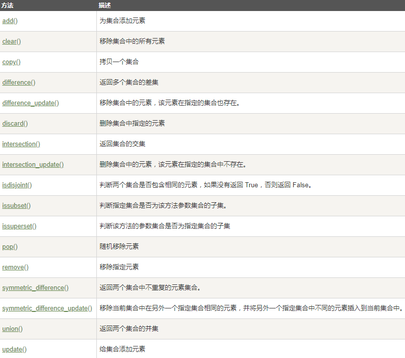

