# C++笔记

* 头文件： **#include<stdio.h>**，C++中等价写法**cstdio**
* 对浮点型而言，不要使用float，一般都使用double
* ASCII码：0（48），A（65），a（97）
* 单引号：字符常量，双引号：字符串常量

|  类型  |     存储     |          取值           |
| :----: | :----------: | :---------------------: |
|  int   | 32bit(4字节) |         2^31-1          |
|  long  |    64bit     |         2^63-1          |
| float  |    32bit     |  2^128(6-7位有效精度)   |
| Double |    64bit     | 2^1024(15-16位有效精度) |
|  Char  |     8bit     |                         |
|  Bool  |              |                         |

## 1 常用函数

* **fabs(double x)**：取绝对值
* **floor(double x)  ceil(double x)**：向下、向上取整
* **pow(double r, double p)**：取幂
* **sqrt(double x)**：取算数平方根
* **log(double x)**：取以自然对数为底的对数
* **round(double x)**：将x四舍五入


## 2 顺序容器

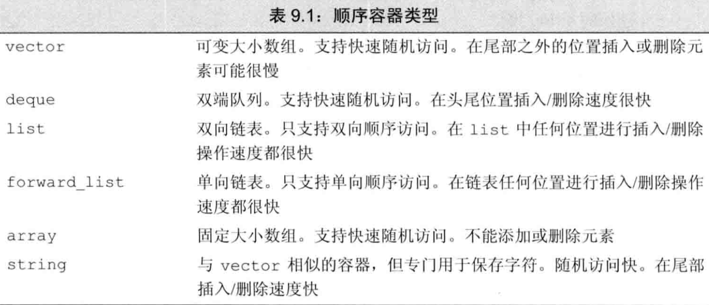

### （1）Vector容器


### （2）deque容器


### （3）list容器

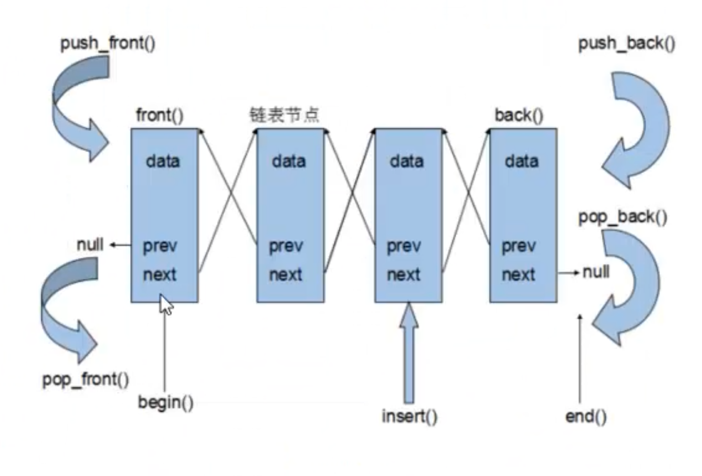

### （4）string容器

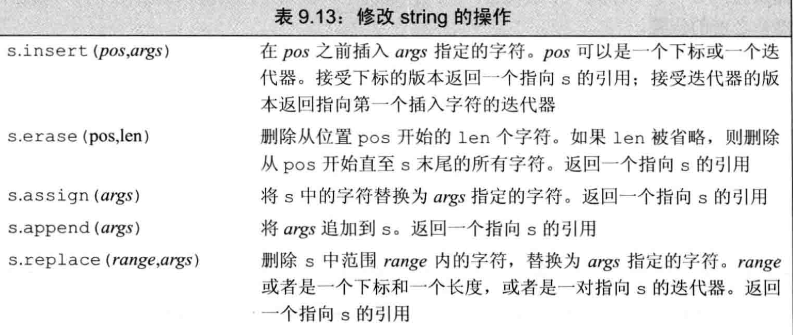

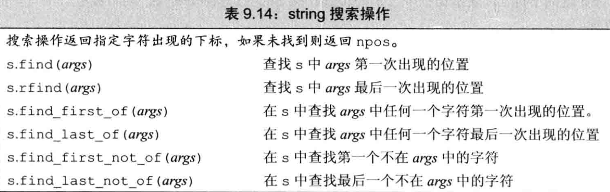

### （5）容器使用时机

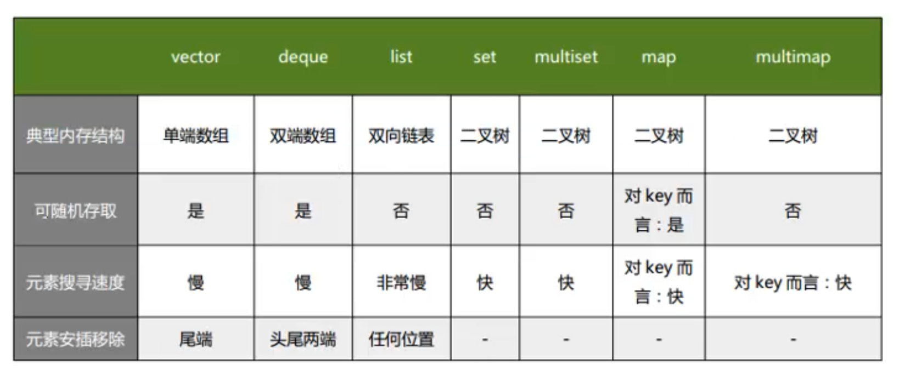


## 3 关联容器

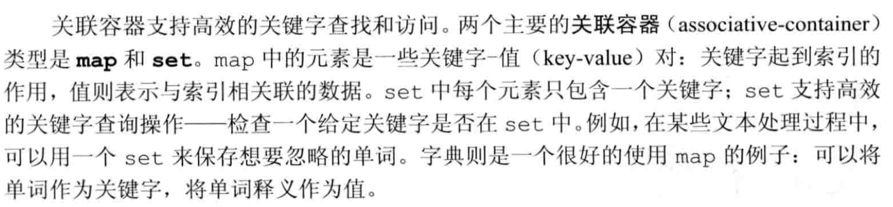

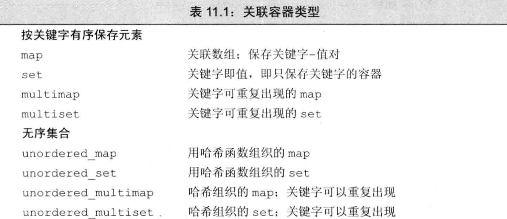

### （1）pair类型

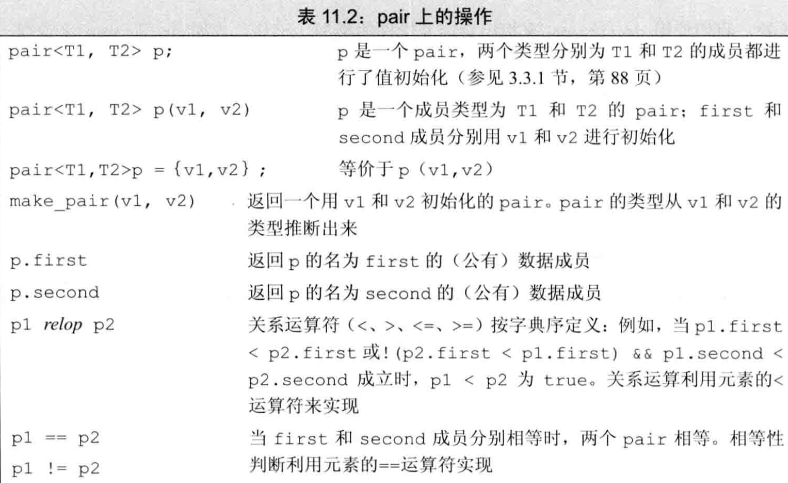


### （2）无序容器

* 无序关联容器不是使用比较运算符来组织元素，而是使用一个**哈希函数**和关键字类型的**==**运算符
* 无序容器在存储上组织为一组桶，每个桶保留0个或多个元素，使用一个哈希函数将元素映射到桶
* 无序容器不能直接定义关键字类型为自定义类的无序容器，需要提供hash模板（类似于vector里面用到的自定义比较操作）


## 4 IO库

* istream：输入流类型，提供输入条件
* ostream：输出流类型，提供输出条件

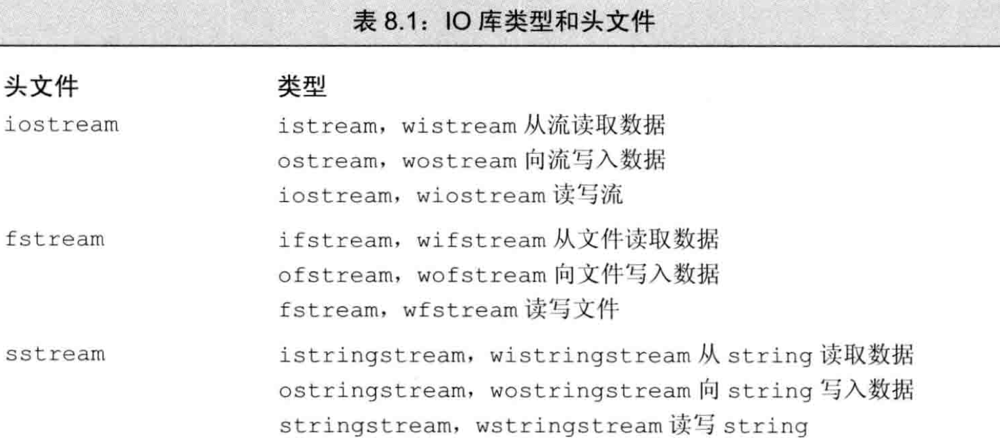

* IO对象无拷贝和赋值


## 5 泛型算法

### （1）Accumulate

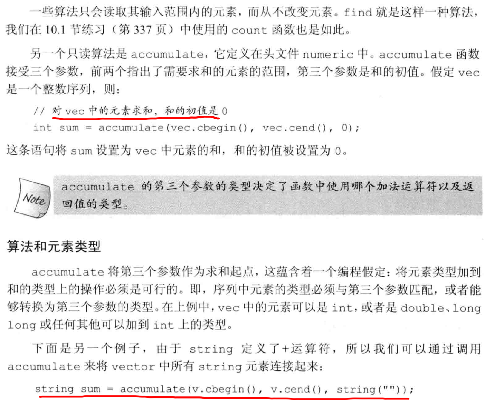

### （2）Equal

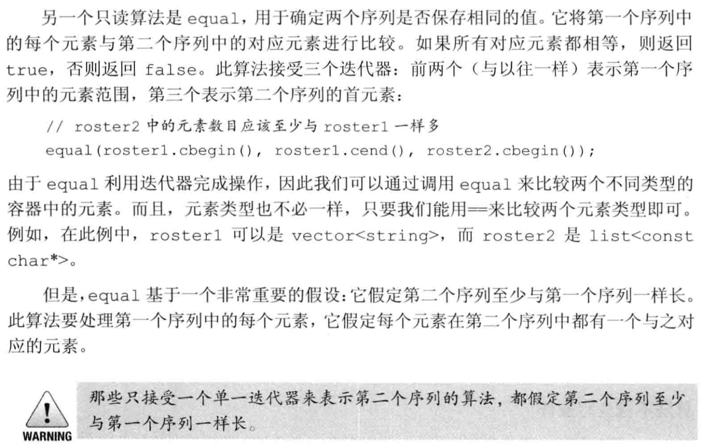

### （3）Copy

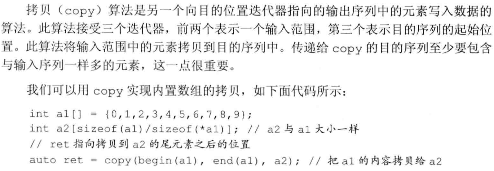

### （4）Unique

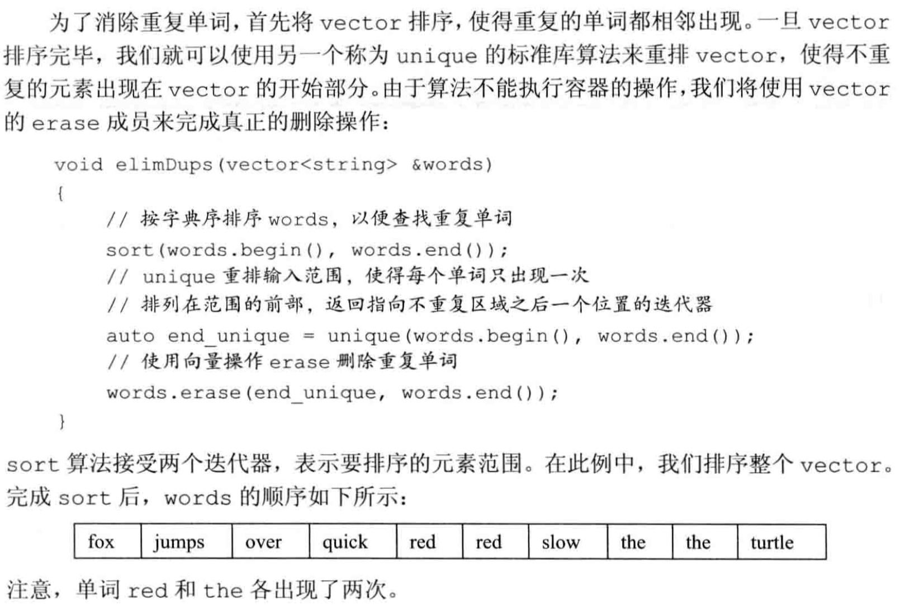

### （5）Lambda表达式

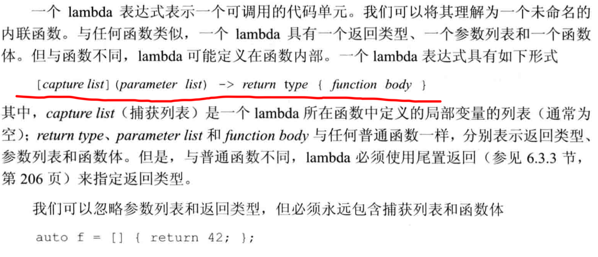

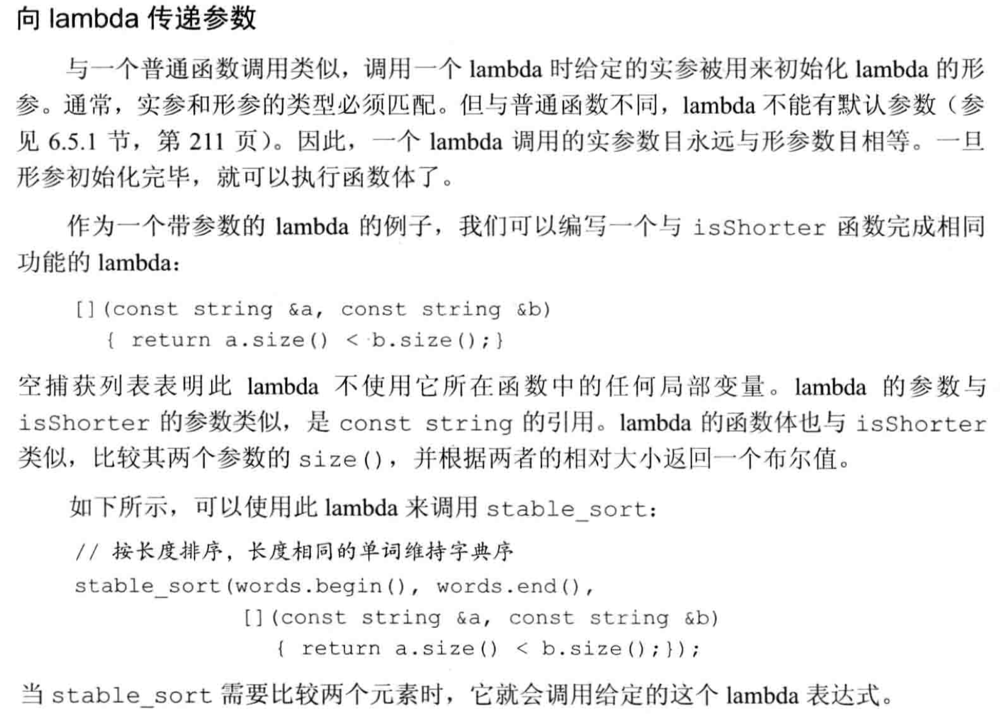


## 6 动态内存

* 除了静态内存和栈内存，每个程序还拥有一个内存池，这部分称为自由空间或者**堆**
* 两种智能指针的区别在于管理底层指针的方式：**shared_pt**r允许多个指针指向同一个对象，**unique_ptr**则独占所指向的对象

### Shared_ptr

```c++
// 初始化
shared_ptr<string> p1;
shared_ptr<vector<int>> p2;

// 内置函数
p.unique()		// 是否是唯一指向当前值的智能指针，true/false
p.use_count() 
```

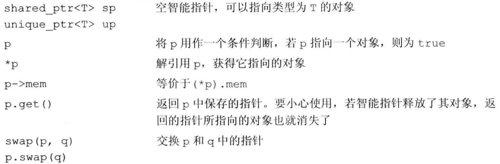

#### make_shared函数

* 调用函数在动态内存中分配一个对象并初始化，返回指向此对象的**shared_ptr**

```c++
shared_ptr<int> p = make_shared<int>(42);
shared_ptr<string> p2 = make_shared<string>(10,'9');
shared_ptr<int> p3 = make_shared<int>();
auto p4 = make_shared<vector<string>>();
```

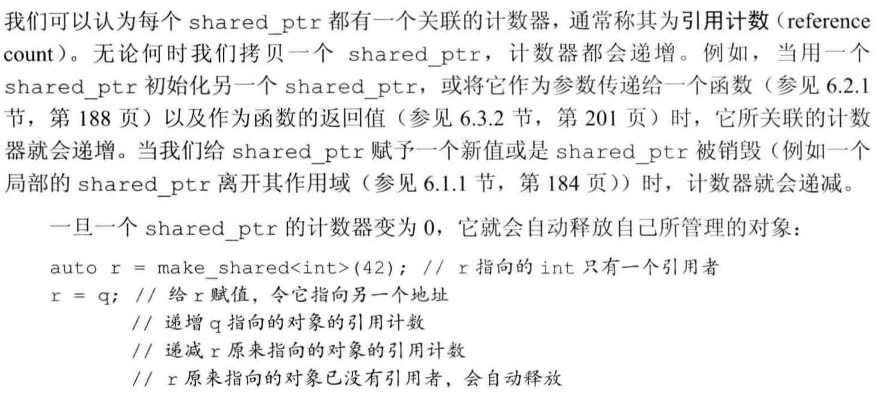

