# Deep-Learning（花书）笔记

## 1. 线性代数

### 范数

* 范数是将向量映射到非负值的函数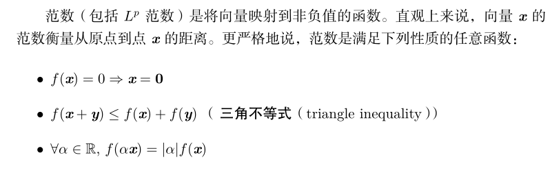
* p=2时，$L^2$范数称为欧几里得范数，表示从原点出发到向量$x$确定的点的欧几里得距离
* 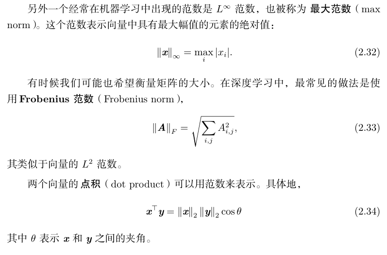

### 特征分解

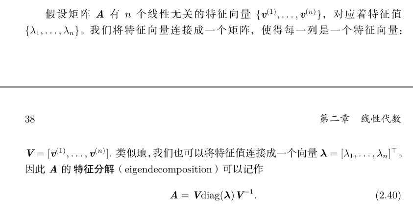

### 奇异值分解

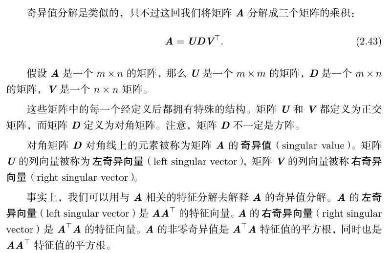

### 迹运算

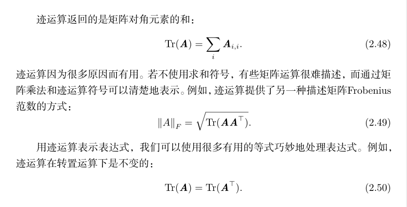

### 主成分分析（PCA）

* 使用$L^2$范数，在空间中有m个点，我们希望对这些点进行有损压缩。有损压缩表示我们使用更少的内存，但损失一些精度去存储这些点，希望损失的精度尽可能少。
* 为了使编码问题简单一些，PCA限制D的列向量彼此**正交**

## 2. 信息论基础

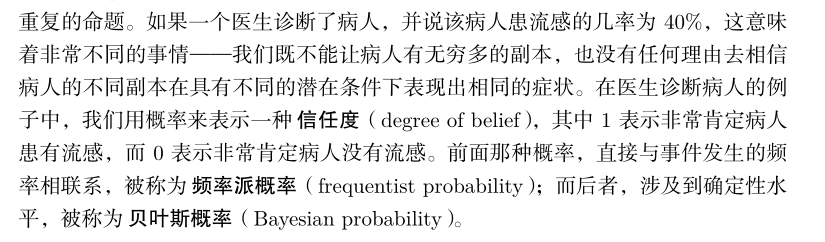

### Bernoulli分布

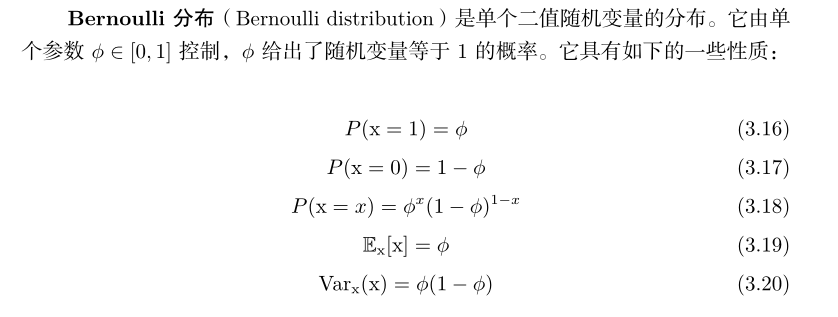

### Multinoulli分布

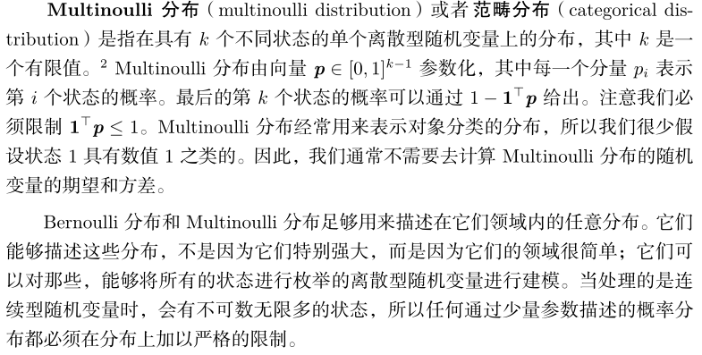

### 高斯分布

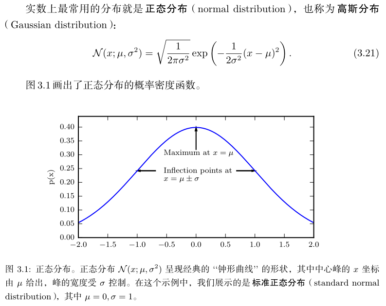

### 指数分布和Laplace分布

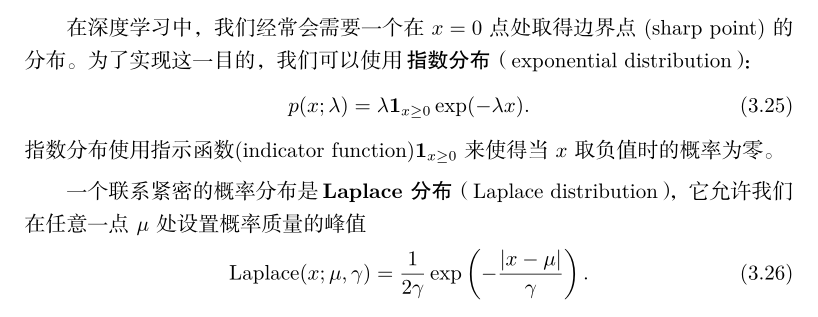

### Dirac分布和经验分布

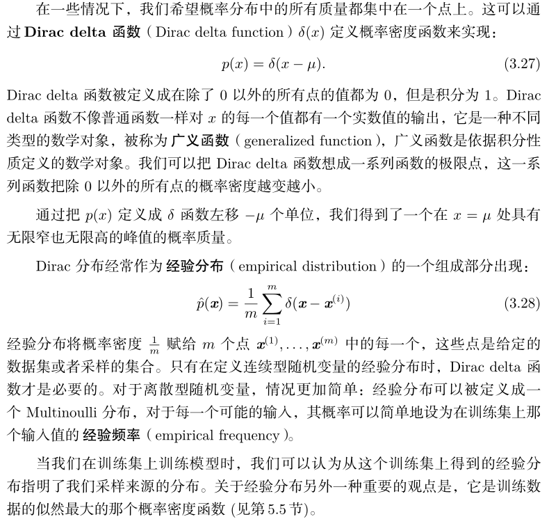

## 3. SVM

*  一个重要创新点在于：核技巧
* 不输出概率，只输出类别

