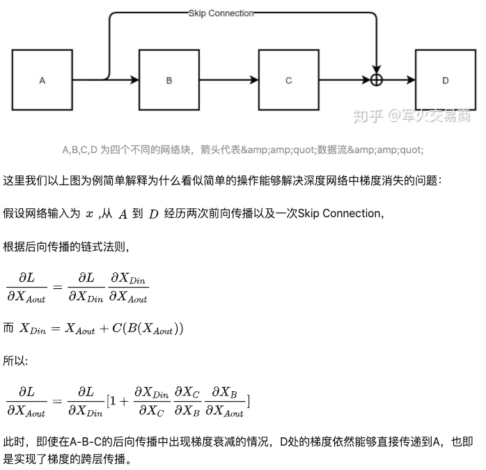

# Machine Learning

## 基础

1. 常见优化器（优化函数有哪些，比较他们的优缺点）
2. 生成模型和判别模型的区别
3. 最小二乘法在什么条件下与极大似然估计等价
4. 池化的类型，除了最大和平均池化还有哪些
5. 反向传播的原理
6. 给出feature map和卷积核尺寸，求参数量
7. BN和LN的区别，以及BN一般怎么用，LSTM中有没有用BN
8. numpy写个batch norm 层
9. 解决梯度爆炸和梯度消失的方案？原因？
10. 过拟合原因？解决？
11. L1和l2正则化的区别，特点
12. softmax和sigmod的区别
13. TensorFlow和pytorch的区别，习惯用哪个？

## 模型

1. 为什么ResNet可以很深

1. 什么是roi pooling，怎么实现的
2. 什么是roi align，怎么实现的
3. 详细说下rpn的工作过程
4. yolo系列介绍一下
5. faster rcnn损失函数构成
6. yolov3中anchor尺寸设置
7. 目标跟踪里匈牙利算法的流程
8. 手写检测中iou计算
9. focal loss

## 朴素贝叶斯

1. 朴素贝叶斯思想
2. 贝叶斯公式

## LR

1. LR梯度公式及代码
2. 交叉熵损失为什么有log项
3. 大规模LR参数稀疏解怎么求
4. 为什么lr用的sigmoid函数

## SVM

1. 介绍SVM模型

2. SVM训练完得到的模型是什么

	​		一般人都会认为得到的模型是那个超平面，即y=w1x1 + ... + wnxn。但是如果是带核函数的模型，怎么进行预测。因为核函数是计算两个样本之间的高维内积的，因此只有超平面和另一个待预测样本的话就不知道怎么做预测了。。。

	​		后来面试官说得到的模型其实是支持向量，预测时将待预测样本与支持向量计算距离。

3. SVM为什么自带泛化性（结构风险最小化）

4. SVM对偶化的条件是什么，具体说明每一条，并回答为什么满足该条件就可以对偶化

5. SVM与其他模型相比，在面对样本不均衡问题是更优还是更劣

6. 松弛变量的理解

## Xbg/Bgdt

1. xgb和gbdt最主要的区别是什么？
2. 介绍XGB模型
3. 树模型xgb与lgb区别

## 决策树

1. 决策树怎么选择特征。信息增益和信息增益比的区别。
2. 