# JavaWeb

```xml
    <dependencies>
      	<!--单元测试-->
        <dependency>
            <groupId>junit</groupId>
            <artifactId>junit</artifactId>
            <version>4.12</version>
        </dependency>
      	<!--Servlet+JSP-->
        <dependency>
            <groupId>javax.servlet</groupId>
            <artifactId>servlet-api</artifactId>
            <version>2.5</version>
        </dependency>
        <dependency>
            <groupId>javax.servlet.jsp</groupId>
            <artifactId>javax.servlet.jsp-api</artifactId>
            <version>2.3.3</version>
        </dependency>
        <!--JSTL表达式依赖-->
        <dependency>
            <groupId>javax.servlet.jsp.jstl</groupId>
            <artifactId>jstl-api</artifactId>
            <version>1.2</version>
        </dependency>
        <dependency>
            <groupId>javax.servlet</groupId>
            <artifactId>jstl</artifactId>
            <version>1.2</version>
        </dependency>
        <!--standard标签库-->
        <dependency>
            <groupId>taglibs</groupId>
            <artifactId>standard</artifactId>
            <version>1.0.6</version>
        </dependency>
        <!--MySQL-->
        <dependency>
            <groupId>mysql</groupId>
            <artifactId>mysql-connector-java</artifactId>
            <version>5.1.49</version>
        </dependency>
    </dependencies>

    <build>
        <plugins>
            <plugin>
                <groupId>org.apache.maven.plugins</groupId>
                <artifactId>maven-compiler-plugin</artifactId>
                <configuration>
                    <source>12</source>
                    <target>12</target>
                </configuration>
            </plugin>
        </plugins>
    </build>
```

```xml
<?xml version="1.0" encoding="UTF-8"?>
<web-app xmlns="http://xmlns.jcp.org/xml/ns/javaee"
         xmlns:xsi="http://www.w3.org/2001/XMLSchema-instance"
         xsi:schemaLocation="http://xmlns.jcp.org/xml/ns/javaee
                      http://xmlns.jcp.org/xml/ns/javaee/web-app_4_0.xsd"
         version="4.0"
         metadata-complete="true">
</web-app>
```


* web开发

	* 静态web
		* 缺点：
			* 不能动态更新，所有用户看到的都是同一个页面
			* 无法和数据库交互（数据无法持久化）

	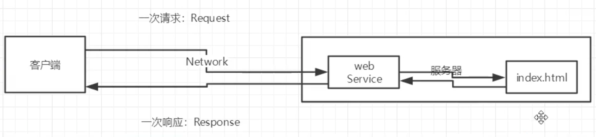

	* 动态web
		* 提供给所有人看的数据始终会发生变化
		* 技术栈：Servlet/JSP，ASP，PHP
		* **缺点**：若服务器动态web资源出现错误，需要重新编写后台程序，重新发布（停机维护）
		* **优点**：
			* 可以动态更新
			* 可以与数据库交互
		* 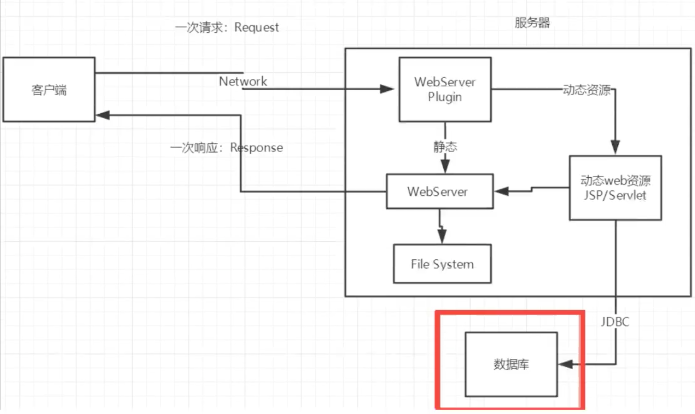
	* 在Java中，动态web资源开发的技术统称为javaweb

* 一个web应用组成

	* html, css, js
	* Jsp, servlet
	* Java
	* jar
	* 配置文件(Properties)


## 1. 技术讲解

* **ASP**

	* 微软，维护成本高

	* 在html中嵌入了VB的脚本，ASP+COM

	* ASP开发中，基本一个页面

	* ```html
		<h1>
		  <h1>
		    <h1>
		      <%
		         System.out.println("hello")
		      %>
		      <h1>
		```

* **PHP**

	* 速度快，功能强大，跨平台，代码简单（70%， WP）
	* 无法承载**大访问量**的情况下（局限性）

* **JSP/Servlet**

	* sun公司主推的B/S架构（B/S：浏览和服务器，C/S：客户端和服务器）
	* 基于Java，语法像ASP
	* 可以承载三高（高并发、高可用、高性能）问题


## 2. web服务器

* 服务器是一种被动的操作，用来处理用户的一些请求和给用户一些相应信息
* **IIS**：
	* 微软；ASP；Windows中自带
* **Tomcat**：
	* Tomcat是Apache 软件基金会（Apache Software Foundation）的Jakarta 项目中的一个核心项目，由Apache、Sun 和其他一些公司及个人共同开发而成。由于有了Sun 的参与和支持，最新的Servlet 和JSP 规范总是能在Tomcat 中得到体现，Tomcat 5支持最新的Servlet 2.4 和JSP 2.0 规范。因为Tomcat 技术先进、性能稳定，而且免费，因而深受Java 爱好者的喜爱并得到了部分软件开发商的认可，成为目前比较流行的Web 应用服务器。


## 3. Tomcat

* [官网](https://tomcat.apache.org)下载tar.gz，解压后改名Tomcat放到资源库

	* ```shell
		cd /Library/Tomcat/bin 
		sudo chmod 755 *.sh
		sudo sh ./startup.sh
		sh ./shutdown.sh
		# http://localhost:8080 注意端口号要写
		```

	* 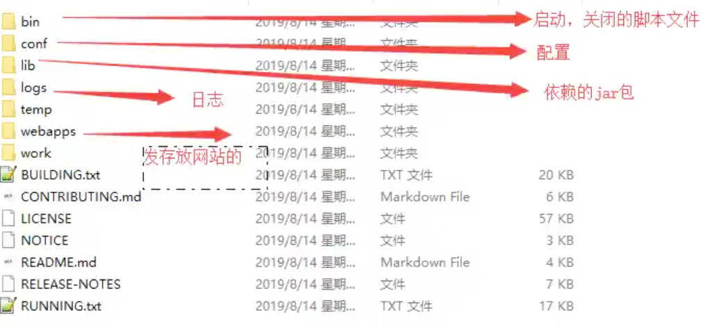

* 配置

	* 核心配置文件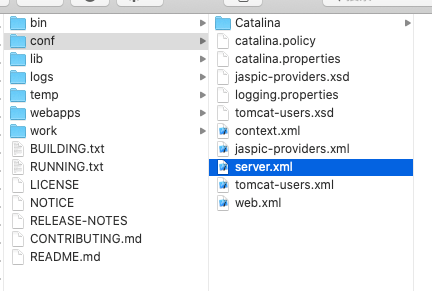

	* 可以配置启动的端口号、主机名称

		* **默认端口**

			* Tomcat：8080
			* MySQL：3306
			* http：80
			* Https：443

		* ```xml
			    <Connector port="8081" protocol="HTTP/1.1"
			               connectionTimeout="20000"
			               redirectPort="8443" />
			```

		* ```xml
			      <Host name="localhost"  appBase="webapps"
			            unpackWARs="true" autoDeploy="true">
			```

* **聊聊网站是如何进行访问的**

	* 输入域名，检查本机的hosts配置文件下有没有这个域名的映射（/etc/hosts）
		* 有，则直接返回对应的IP地址，这个地址中有我们需要的web程序，可以直接访问
		* 无，去DNS服务器找
		* 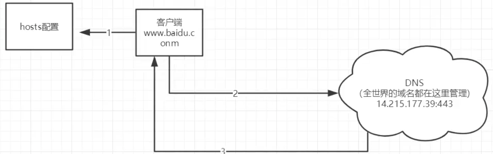

* 网站发布

	* 将自己写的网站，放到服务器（Tomcat）中指定的web应用的文件夹下，就可以访问了

	* 网站应该有的结构

		```shell
		--webapps:
				-ROOT
				-komrebi
						-WEB-INF
								-classes
								-lib
								-web.xml
						-index.html		默认的首页
						-static
								-css
								-js
								-img
		```

	* localhost:8081/docs


## 4. HTTP

* **http**（超文本传输协议）是一个简单的请求-响应**协议**，它通常运行在TCP之上。它指定了客户端可能发送给服务器什么样的消息以及得到什么样的响应。请求和响应消息的头以**ASCII码**形式给出；而消息内容则具有一个类似MIME的格式。

* **变化**

	* HTTP/1.0：客户端与web服务器连接后，只能获得一个web资源，断开连接
	* HTTP/1.1：客户端与web服务器连接后，可以获得多个web资源

* **请求**

	* 客户端--发请求--服务器

	* 百度

	* 请求行

		* 请求方式：GET
		* GET：请求能够携带的参数比较少，大小有限制，会在浏览器的URL地址栏显示数据内容，不安全，但是高效
		* POST：请求能够携带的参数没有限制，大小没有限制，安全，但不高效

		```Java
		Request URL: https://www.baidu.com/		// 请求地址
		Request Method: GET										// get方法/post方法
		Status Code: 200 OK										// 状态码：200，404则是代表找不到资源
		Remote Address: 39.156.66.14:443
		Referrer Policy: strict-origin-when-cross-origin
		```

	* 消息头：

	* ```Java
		Accept: text/html											// 告诉浏览器所支持的数据类型
		Accept-Encoding: gzip, deflate, br		// 支持哪种编码格式  GBK UTF-8 GB2312 ISO8859-1
		Accept-Language: zh-CN,zh;q=0.9,en;q=0.8 // 告诉浏览器它的语言环境
		Connection: keep-alive								// 告诉浏览器，请求完成是断开还是保持连接
		```

* **响应**

	* 服务器--响应--客户端

	* 百度

		```Java
		Cache-Control: private								// 缓存控制
		Connection: keep-alive								// 连接
		Content-Encoding: gzip								// 编码
		Content-Type: text/html								// 类型
		```

* **当浏览器中地址栏输入地址并回车，到页面展示回来，经历了什么**？


## 5. Maven

* 在Javaweb开发中，需要导入很多jar包，自动帮我导入和配置这个jar包，Maven是**项目架构管理工具**

* 核心思想：**约定大于配置**

	* 有约束，不要去违反

* Maven会规定如何编写Java，[官网](http://maven.apache.org)

* [Mac配置Maven](https://blog.csdn.net/winstonlau/article/details/95605557)

	* M2_HOME：Maven目录下的bin目录

	* MAVEN_HOME：Maven目录

	* 修改镜像settings.xml

		```xml
		    <mirror>
		      <id>nexus-aliyun</id>
		      <mirrorOf>*,!jeecg,!jeecg-snapshots</mirrorOf>
		      <name>Nexus aliyun</name>
		      <url>http://maven.aliyun.com/nexus/content/groups/public</url> 
		    </mirror>
		```

* 建立一个仓库

	```xml
	<localRepository>/Library/Maven/maven-repo</localRepository>
	```

	

## 6. IDEA使用Maven

### 6.1 使用模板创建

* 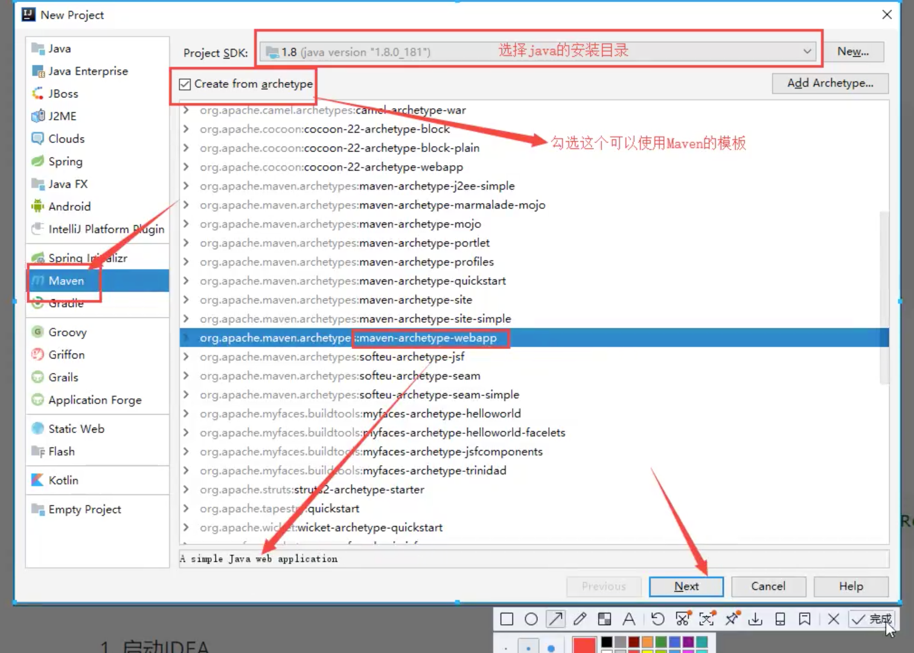
* 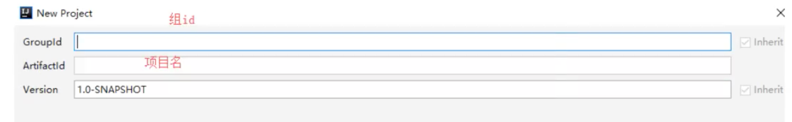
* 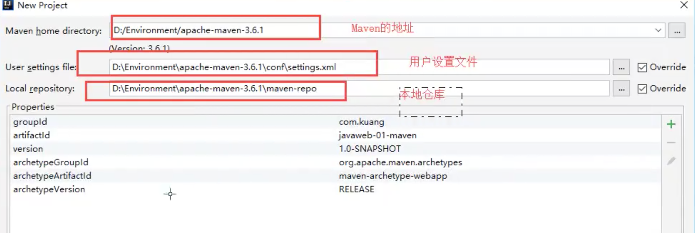

### 6.2 Maven创建普通Maven项目

* 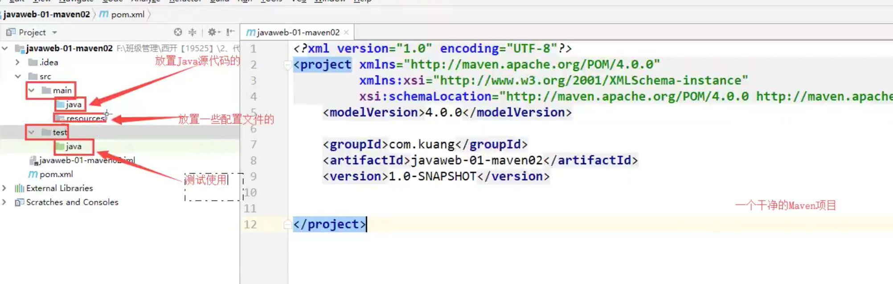

* 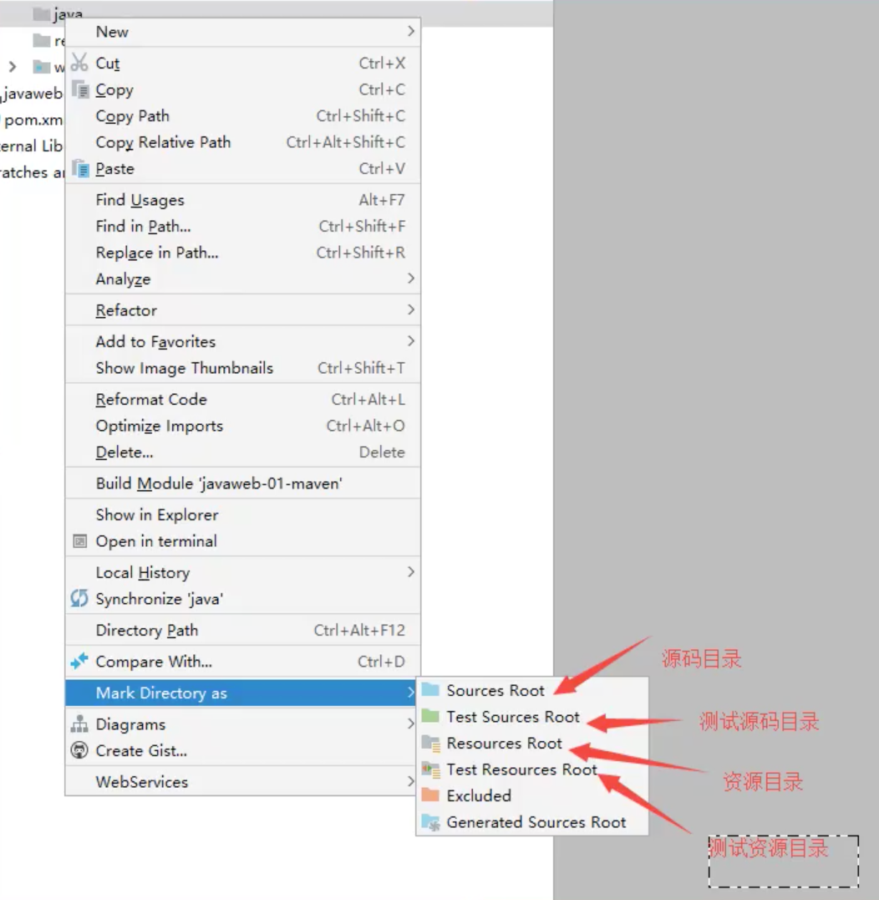


### 6.3 IDEA中配置Tomcat

* 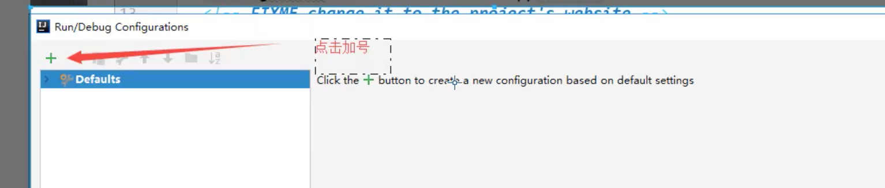
* 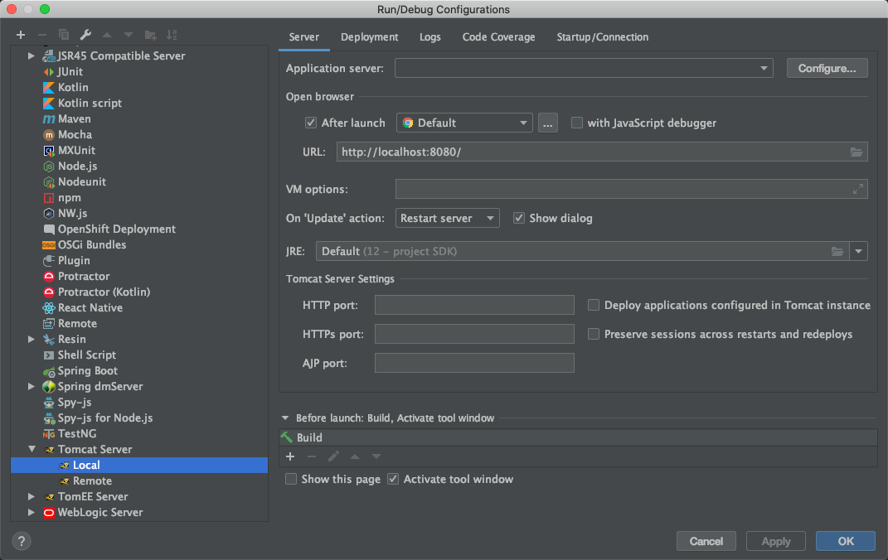
* **解决警告问题：我们访问一个网站，需要指定一个文件夹的名字**
* 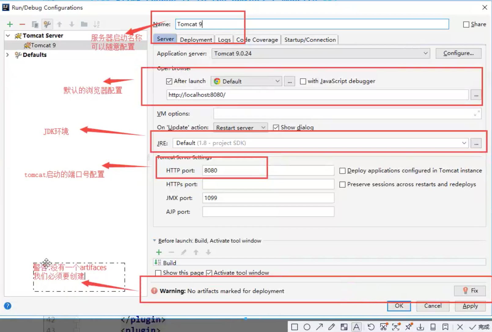
* 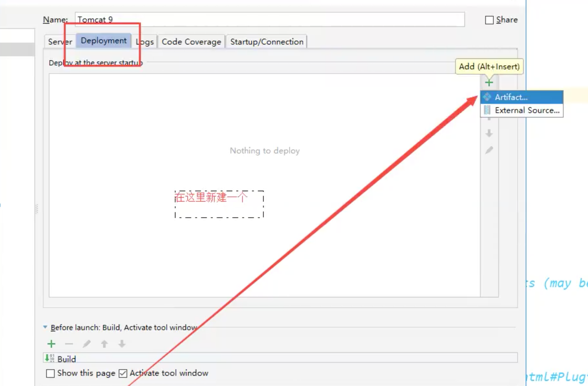
* 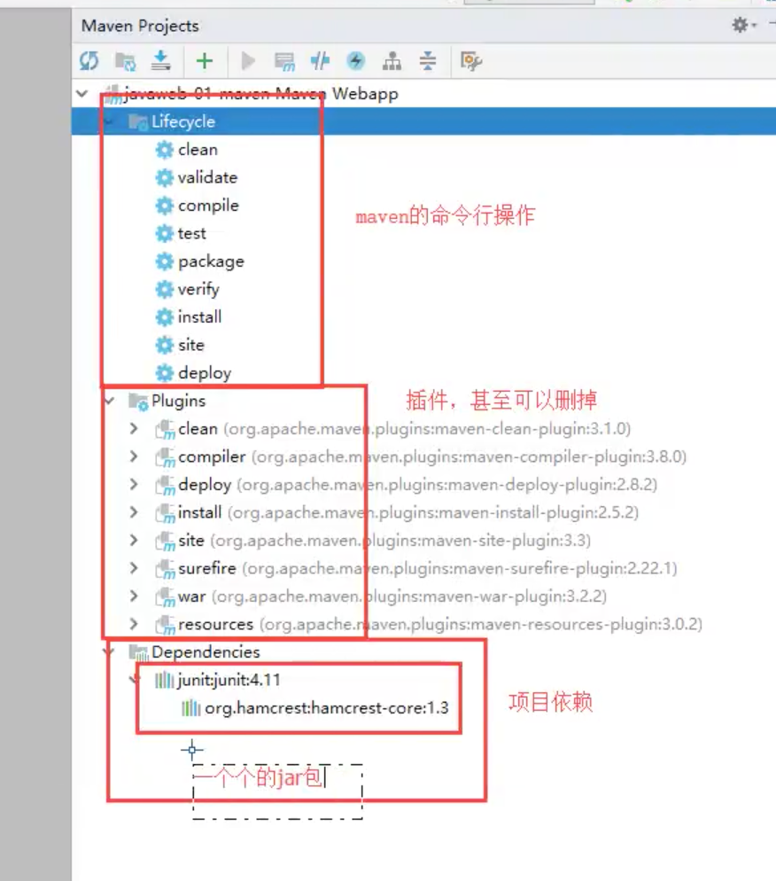

### 6.4 pom文件

* pom.xml是Maven的核心配置文件

* Maven由于**约定大于配置**，我们之后可能遇到我们写的配置文件(读取资源文件)，无法被导出或者生效的问题

	```xml
	<!--在build中配置resources,来防止我们资源导出失败的问题-->
	    <build>
	        <resources>
	            <resource>
	                <directory>src/main/resources</directory>
	                <excludes>
	                    <exclude>**/*.properties</exclude>
	                    <exclude>**/*.xml</exclude>
	                </excludes>
	                <filtering>false</filtering>
	            </resource>
	            <resource>
	                <directory>src/main/java</directory>
	                <includes>
	                    <include>**/*.properties</include>
	                    <include>**/*.xml</include>
	                </includes>
	                <filtering>false</filtering>
	            </resource>
	        </resources>
	    </build>
	```


### 6.5 Maven仓库使用

* [网站](https://mvnrepository.com/)
* 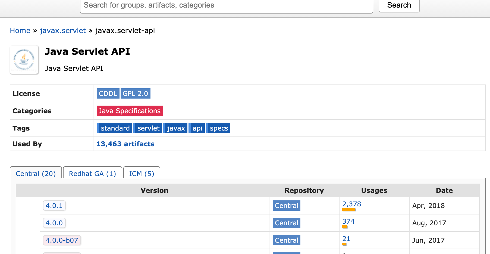


* 替换为webapp4.0版本，和Tomcat保持一致

```xml
<?xml version="1.0" encoding="UTF-8"?>
<web-app xmlns="http://xmlns.jcp.org/xml/ns/javaee"
         xmlns:xsi="http://www.w3.org/2001/XMLSchema-instance"
         xsi:schemaLocation="http://xmlns.jcp.org/xml/ns/javaee
                      http://xmlns.jcp.org/xml/ns/javaee/web-app_4_0.xsd"
         version="4.0"
         metadata-complete="true">
</web-app>
```

### 6.6 用Java写函数映射到网站

* Java实现函数，继承Servlet接口

```Java
import javax.servlet.ServletException;
import javax.servlet.http.HttpServlet;
import javax.servlet.http.HttpServletRequest;
import javax.servlet.http.HttpServletResponse;
import java.io.IOException;
import java.io.PrintWriter;

public class HelloServlet extends HttpServlet {
    @Override
    protected void doGet(HttpServletRequest req, HttpServletResponse response) throws ServletException, IOException {
        // 响应的类型：html
        response.setContentType("text/html");
        // 获取响应的输出流
        PrintWriter out = response.getWriter();
        out.println("<html>");
        out.println("<head>");
        out.println("<title>Hello World!</title>");
        out.println("</head>");
        out.println("<body>");
        out.println("<h1>Hello World!</h1>");
        out.println("</body>");
        out.println("</html>");
    }

    @Override
    protected void doPost(HttpServletRequest req, HttpServletResponse resp) throws ServletException, IOException {
        doGet(req, resp);
    }
}
```

* 配置web.xml文件

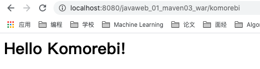

```xml
<?xml version="1.0" encoding="UTF-8"?>
<web-app xmlns="http://xmlns.jcp.org/xml/ns/javaee"
         xmlns:xsi="http://www.w3.org/2001/XMLSchema-instance"
         xsi:schemaLocation="http://xmlns.jcp.org/xml/ns/javaee
                      http://xmlns.jcp.org/xml/ns/javaee/web-app_4_0.xsd"
         version="4.0"
         metadata-complete="true">

    <!--web.xml中是配置web的核心应用-->
    <!--注册Servlet-->
    <servlet>
        <servlet-name>helloServlet</servlet-name>
        <servlet-class>com.komorebi.HelloServlet</servlet-class>
    </servlet>
    <!--一个Servlet对应一个Mapping-->
    <servlet-mapping>
        <servlet-name>helloServlet</servlet-name>
        <!--请求路径-->
        <url-pattern>/komorebi</url-pattern>
    </servlet-mapping>
</web-app>
```

* 重写一个header.html

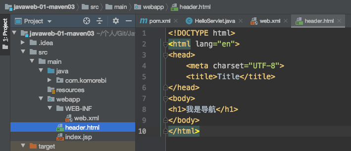

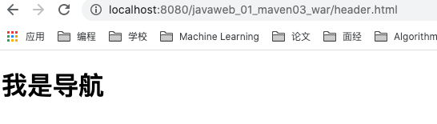


## 7. Servlet

* Servlet是开发**动态web**的一门技术，有两个默认的实现类：HttpServlet，GenericServlet
* Sun在这些API中提供了一个接口：Servlet，如果想开发一个Servlet程序，只需要2个步骤
	* 编写一个类，实现Servlet接口
	* 把开发好的Java类部署到web服务器中

### 7.1 基本构建

* 构建一个普通的Maven项目，删除src目录，以后就在里面建立Module；这个空的工程就是主工程

* 关于Maven父子工程的理解

	*  父项目中会有

		```xml
		<modules>
		        <module>servlet-01</module>
		</modules>
		```

	* 父项目中的Java子项目可以直接使用

* **Maven环境优化**

	* 修改web.xml
	* 将Maven的结构搭建完整
	* 编写Servlet程序
	* 编写Servlet的映射：我们写的是java程序，但是要通过浏览器访问，而浏览器需要连接web服务器，所以需要在web服务中注册写的servlet，还需要一个浏览器访问的路径
	* 配置Tomcat：注意配置路径
	* 测试

* 原理：

	* 是由web服务器调用，web服务器在收到浏览器请求之后，会产生2个对象（请求和响应）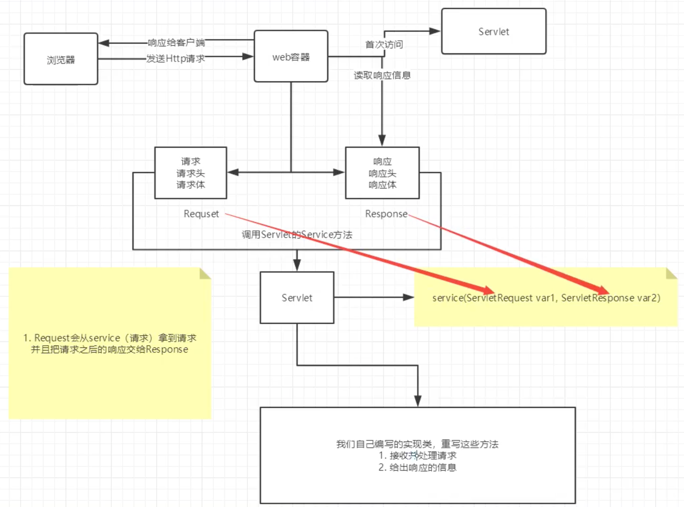

	* **Mapping问题**

		* 一个请求可以指定一个映射路径

			```xml
			<servlet-mapping>
			    <servlet-name>hello</servlet-name>
			    <url-pattern>/hello</url-pattern>
			</servlet-mapping>
			```

		* 一个Servlet可以指定多个映射路径

			```xml
			<servlet-mapping>
			    <servlet-name>hello</servlet-name>
			    <url-pattern>/hello</url-pattern>
			</servlet-mapping>
			<servlet-mapping>
			    <servlet-name>hello</servlet-name>
			    <url-pattern>/hello1</url-pattern>
			</servlet-mapping>
			<servlet-mapping>
			    <servlet-name>hello</servlet-name>
			    <url-pattern>/hello2</url-pattern>
			</servlet-mapping>
			```

		* 一个Servlet可以指定通用映射路径

			```xml
					<servlet-mapping>
			        <servlet-name>hello</servlet-name>
			        <url-pattern>/hello/*</url-pattern>
			  	</servlet-mapping>
			```

		* 指定一些前缀或者后缀等，如果是***.komorebi**则前面不能加**/**

		* **优先级**：指定了固定的映射路径优先级最高，如果找不到就会走默认的处理机制

* **ServletContext**

	* web容器在启动的时候，会为每个web程序创建一个对应的ServletContext对象，它代表了当前的web应用

		* **共享数据**

			```Java
			public class HelloServlet extends HttpServlet {
			    @Override
			    protected void doGet(HttpServletRequest req, HttpServletResponse resp) throws ServletException, IOException {
			        System.out.println("hello");
			
			        ServletContext context = this.getServletContext();
			        String username = "komorebi";
			        context.setAttribute("username", username);
			    }
			}
			```

			```java
			public class GetServlet extends HttpServlet {
			    @Override
			    protected void doGet(HttpServletRequest req, HttpServletResponse resp) throws ServletException, IOException {
			        ServletContext context = this.getServletContext();
			        String username = (String)context.getAttribute("username");
			
			        resp.setContentType("text/html");
			        resp.setCharacterEncoding("utf-8");
			        resp.getWriter().print(username);
			    }
			}
			```

		* **获取初始化参数**
		
		  ```xml
		  <!--配置一些web应用初始化参数-->
		  <context-param>
		      <param-name>url</param-name>
		      <param-value>jdbc:mysql://localhost:3306/mybatis</param-value>
		  </context-param>
		  <servlet>
		      <servlet-name>gp</servlet-name>
		      <servlet-class>com.komorebi.servlet.ServletDemo03</servlet-class>
		  </servlet>
		  <servlet-mapping>
		      <servlet-name>gp</servlet-name>
		      <url-pattern>/gp</url-pattern>
		  </servlet-mapping>
		  ```
		
		  ```Java
		  public class ServletDemo03 extends HttpServlet {
		      @Override
		      protected void doGet(HttpServletRequest req, HttpServletResponse resp) throws ServletException, IOException {
		          ServletContext context = this.getServletContext();
		  
		          String url = context.getInitParameter("url");
		          resp.getWriter().print(url);
		      }
		  }
		  ```
		
		* **请求转发**
		
			```Java
			protected void doGet(HttpServletRequest req, HttpServletResponse resp) throws ServletException, IOException {
			    System.out.println("in ServletDemo04");
			    ServletContext context = this.getServletContext();
			    RequestDispatcher requestDispatcher = context.getRequestDispatcher("/gp");      // 转发的请求路径
			    requestDispatcher.forward(req, resp);                  // 调用forward实现请求转发
			    // context.getRequestDispatcher("/gp").forward(req, resp);
			}
			```
		
		* **读取资源文件**(如果在Java中，就需要pom配置)
		
			* 在Java目录下新建properties
			* 在resources目录下新建properties
		
			都会被打包到classes，俗称类路径
		
			```Java
			protected void doGet(HttpServletRequest req, HttpServletResponse resp) throws ServletException, IOException {
			    InputStream is = this.getServletContext().getResourceAsStream("/WEB-INF/classes/db.properties");
			    Properties properties = new Properties();
			    properties.load(is);
			    String username = properties.getProperty("username");
			    String pwd = properties.getProperty("passward");
			
			    resp.getWriter().print(username + " " + pwd);
			}
			```
		
			* 思路：需要一个文件流

### 7.2 HttpServletResponse

* web服务器接收到客户端的HTTP请求，会针对这个请求，分别创建一个代表请求的HttpServletRequest对象和代表响应的HttpServletResponse对象

	* 如果要获取客户端请求过来的参数，找HttpServletRequest
	* 如果要给客户端响应一些信息，找HttpServletResponse

* 简单分类：

	* 负责向浏览器发送数据的方法：

		```Java
		ServletOutputStream getOutputStream() throws IOException;
		PrintWriter getWriter() throws IOException;
		```
		
	* 负责向浏览器发送响应头的方法：
	
		```Java
		void setCharacterEncoding(String var1);
		void setContentLength(int var1);
		void setContentLengthLong(long var1);
		void setContentType(String var1);
		```
	
	* 响应的状态码
	
* 常见应用

	* 向浏览器输出消息

	* **下载文件**

		* 要获取下载文件的路径

		* 下载的文件名

		* 设置让浏览器支持下载所需的东西

		* 获取下载文件的输入流

		* 创建缓冲区

		* 获取OutputStream对象

		* 将FileOutputStream流写入到buffer缓冲区

		* 使用OutputStream将缓冲区中的数据输出到客户端

		* ```Java
			public class FileServlet extends HttpServlet {
			    @Override
			    protected void doGet(HttpServletRequest req, HttpServletResponse resp) throws ServletException, IOException {
			        //1 要获取下载文件的路径
			        String realPath = this.getServletContext().getRealPath("/WEB-INF/classes/dog.jpg");
			        System.out.println("路径： " + realPath);
			        //2 下载的文件名
			        String fileName = realPath.substring(realPath.lastIndexOf("/") + 1);
			        System.out.println("filename: " + fileName);
			        //3 设置让浏览器支持下载所需的东西，encode是为了中文文件名
			        resp.setHeader("Content-Disposition", "attachment;filename=" + URLEncoder.encode(fileName, "UTF-8"));
			        //4 获取下载文件的输入流
			        FileInputStream in = new FileInputStream(realPath);
			        //5 创建缓冲区
			        int len = 0;
			        byte[] buffer = new byte[1024];
			        //6 获取OutputStream对象
			        ServletOutputStream out = resp.getOutputStream();
			        //7 将FileOutputStream流写入到buffer缓冲区
			        while ((len = in.read(buffer)) > 0) {
			            out.write(buffer, 0, len);
			        }
			        in.close();
			        out.close();
			    }
			}
			```

	* **验证码功能**

		* 后端实现，用到Java的图片类，生成一个图片

	* **实现重定向**

		* 一个web资源B收到客户端A请求后，B会通知A去访问另一个web资源C，这个过程叫做重定向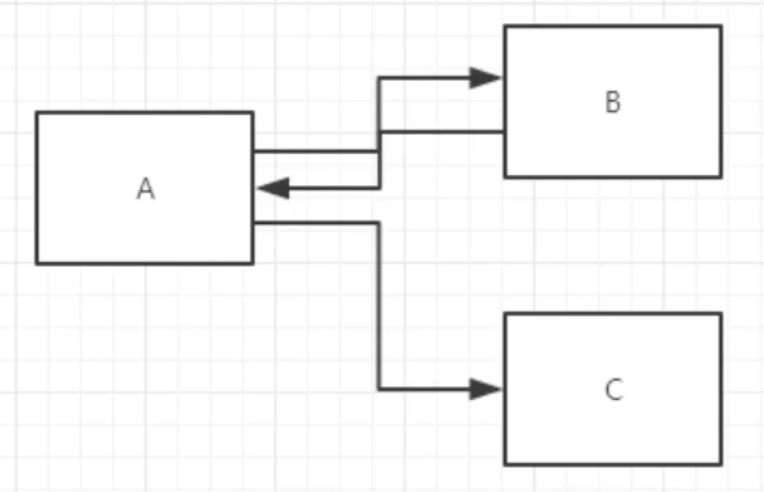

		* ```java
			void sendRedirect(String var1) throws IOException;
			```

		* 面试题，**重定向和转发的区别**：

			* 同：页面都会实现跳转
			* 不同：请求转发的时候，URL不会变化；重定向的时候，URL会变化；重定向302，转发307

### 7.3 HttpServletRequest

* 代表客户端的请求，用户通过HTTP协议访问服务器，HTTP请求中的所有信息会被封装到HttpServletRequest，通过方法获得客户端的所有信息

* 应用场景

	* **获取前端传递的参数，并请求转发**

		* ```Java
			public class LoginServlet extends HttpServlet {
			    @Override
			    protected void doGet(HttpServletRequest req, HttpServletResponse resp) throws ServletException, IOException {
			        req.setCharacterEncoding("utf-8");
			        resp.setCharacterEncoding("utf-8");
			
			        String username = req.getParameter("username");
			        String password = req.getParameter("password");
			        String[] hobbies = req.getParameterValues("hobby");
			
			        // 后台接受中文乱码问题
			        System.out.println(username + ": " + password);
			        System.out.println(Arrays.toString(hobbies));
			
			        // 通过请求转发，这里的/代表当前的web应用
			        req.getRequestDispatcher("/success.jsp").forward(req, resp);
			    }
			}
			```


## 8. Cookie、Session

* **会话**：用户打开一个浏览器，点击了很多超链接，访问多个web资源，关闭浏览器，这个过程可以称为会话
* **有状态会话**：
	* 发票：是学校给你的（cookie）
	* 学校登记：学校标记你来过了（session）
	* 一个网站怎么证明你来过

### 8.1 保存会话的两种技术

* **cookie**：客户端技术，通过请求和响应
* **session**：服务端技术，可以保存用户的会话信息，可以把信息或者数据放在Session中

### 8.2 Cookie

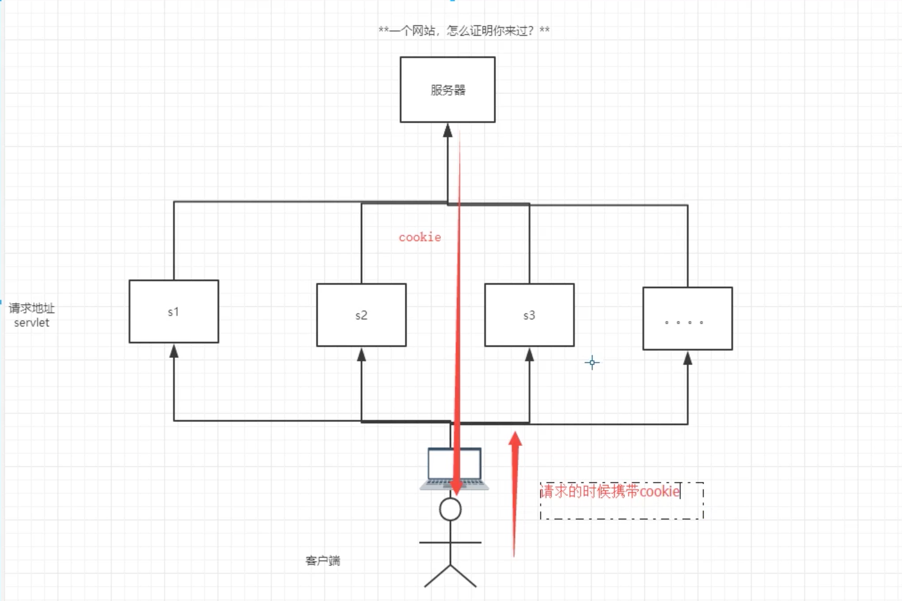

* 从请求中拿到cookie信息

* 服务器响应给客户端cookie

	```Java
	Cookie[] cookies = req.getCookies();       // Cookie，服务器端从客户端获取
	cookie.getName();													 // 获得Cookie中的key
	cookie.getValue();												 // 获得Cookie中的value
	new Cookie("lastLoginTime", System.currentTimeMillis() + "");			// 新建一个Cookie
	cookie.setMaxAge(24*60*60);     					 // cookie有效期为1天
	resp.addCookie(cookie);										 // 添加响应给客户端
	```

* 一个网站cookie是否存在上限

	* 一个cookie只能保存一个信息
	* 一个web站点可以给浏览器发送多个cookie，最多存放20个cookie
	* cookie大小限制4kb
	* 300个cookie为浏览器上限

* 删除cookie

	* 不设置有效期，关闭浏览器，自动失效
	* 设置有效期时间为0 

* 编码+解码

	```Java
	URLEncoder.encode("程序", "utf-8")
	URLDecoder.decode(cookie.getValue(), "utf-8");
	```


### 8.3 Session(重点)

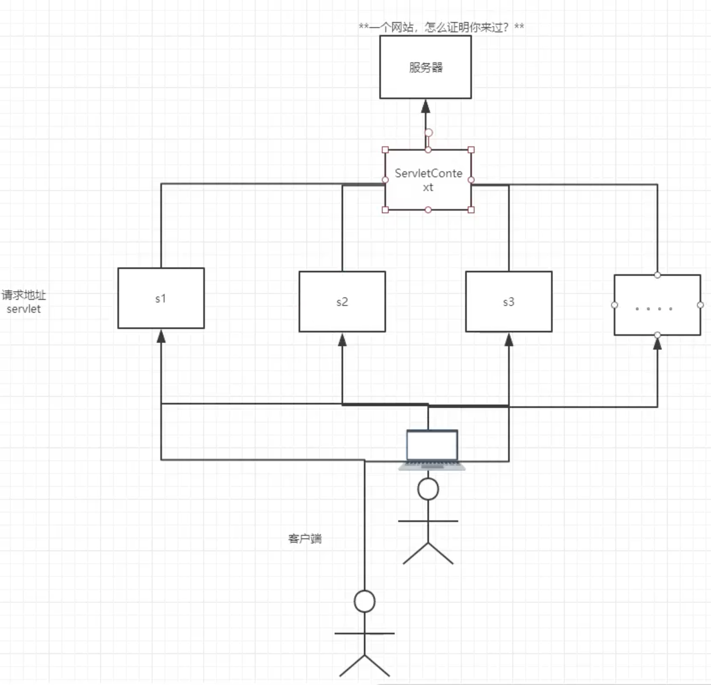

* 服务器会给每一个用户（浏览器）创建一个Session对象

* 一个Session独占一个浏览器，只要浏览器没有关闭，这个Session就存在

* 用户登录之后，整个网站它都可以访问 -->**保存用户的信息**

* **Session和Cookie的区别**

	* Cookie是把用户的数据写给用户的浏览器，浏览器保存（可以保存多个）
	* Session是把用户的数据写到用户独占的Session中，服务器端保存（保存重要的信息，减少服务器资源的浪费）
	* Session对象由服务器创建

* 使用场景：

	* 保存一个登录用户的信息
	* 购物车信息
	* 在整个网站中经常会使用的数据，我们将它保存在Session中

* 使用：

	```Java
	HttpSession session = req.getSession();									// 得到Session
	session.setAttribute("name", new Person("程序", 1));		// 设置Session
	Person person = (Person) session.getAttribute("name");	// 获取Session信息
	session.removeAttribute("name");												// 删除Session信息
	session.invalidate();																		// 手动注销Session
	```

* Session自动过期

	```xml
	<!--设置Session默认的失效时间-->
	<session-config>
	    <!--15分钟后Session自动失效-->
	    <session-timeout>15</session-timeout>
	</session-config>
	```

	

## 9. JSP

* JSP：Java Server Pages，Java服务器端页面，和Servlet一样用于开发动态web技术
* 特点
	* 类似于Html
	* 区别：
		* HTML只给用户提供静态数据
		* JSP页面中可以嵌入Java代码，为用户提供动态数据

### 9.1 原理

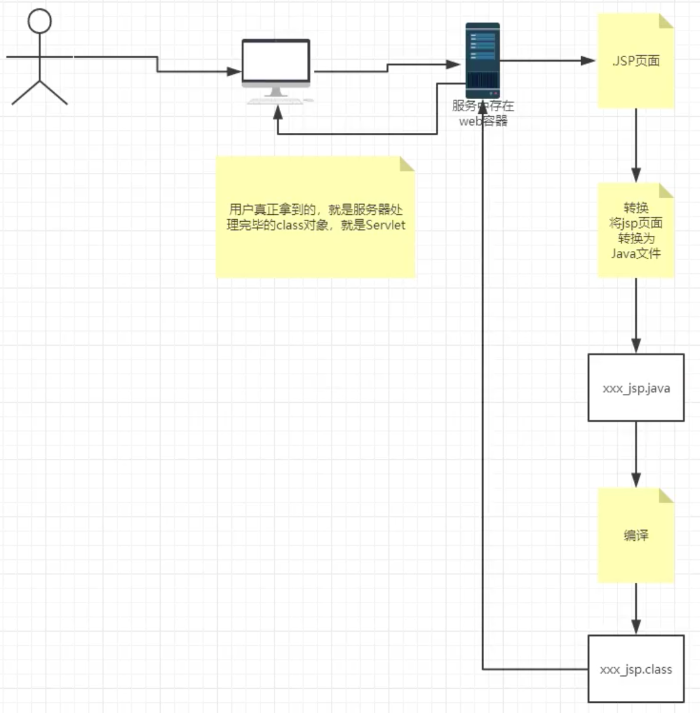

* 执行

	* 代码层面没有问题 

	* 服务器内部工作（Tomcat中有一个work目录，IDEA使用Tomcat会在IDEA的Tomcat中生成一个work目录）

	* **浏览器向服务器发送请求，不管访问什么资源，其实都是在访问Servlet**

	* JSP最终也会被转换成为一个Java类，**JSP本质上就是一个Servlet**

		```Java
		public void _jspInit() {}				// 初始化
		
		protected void _jspDestroy() {} // 销毁
		
		public abstract void _jspService(HttpServletRequest request, HttpServletResponse response) // JSPService
		```

		* 1 判断请求

		* 2 内置了一些对象

			```java
			final javax.servlet.jsp.PageContext pageContext;		// 页面上下文
			javax.servlet.http.HttpSession session = null;      // session
			final javax.servlet.ServletContext application;     // applicationContext
			final javax.servlet.ServletConfig config;           // config
			javax.servlet.jsp.JspWriter out = null;             // out
			final java.lang.Object page = this;								  // page:当前页
			HttpServletRequest request
			HttpServletResponse response
			```

		* 输出页面前增加的代码

			```Java
			response.setContentType("text/html");
			pageContext = _jspxFactory.getPageContext(this, request, response, null, true, 8192, true);
			_jspx_page_context = pageContext;
			application = pageContext.getServletContext();
			config = pageContext.getServletConfig();
			session = pageContext.getSession();
			out = pageContext.getOut();
			_jspx_out = out;
			```

		* 以上的对象可以在JSP页面中直接使用

			* Java代码，原封不动输出
			* HTML代码，转换为 out.write("<html>\r\n"); 这样的格式输出到前端

### 9.2 基础语法

* JSP**表达式**

	```jsp
	<%--JSP表达式作用：用来将程序的输出，输出到客户端--%>
	<%= new java.util.Date()%>
	```

* JSP**脚本片段**

	```jsp
	<%--  JSP脚本片段  --%>
	<%
	  int sum = 0;
	  for (int i = 0; i < 100; i++) {
	    sum += i;
	  }
	  out.println("<h1>Sum=" + sum + "</h1>");
	%>
	```

* **嵌入HTML代码**

	```jsp
	<%--  在代码中嵌入HTML元素--%>
	  <%
	    for (int i = 0; i < 5; i++) {
	  %>
	  <h1>hello, komorebi <%= i%> </h1>
	  <%
	    }
	  %>
	```

* JSP**声明**

	```jsp
	  <%!
	    static {
	      System.out.println("loading servlet");
	    }
	    private int globalVar = 0;
	    public void komorebi(){
	      System.out.println("进入了方法komorebi");
	    }
	  %>
	```

	* 会被编译到JSP生成的Java类的类中！其他的就会被生成到_jspService方法中
	* JSP的注释不会在客户端显示，HTML会显示

###  9.3 JSP指令

* 定制错误页面

	* 在jsp文件中定制

		```jsp
		<%@ page errorPage="error/500.jsp" %>
		```

	* 在web.xml中定制

		```xml
		<error-page>
		    <error-code>404</error-code>
		    <location>/error/404.jsp</location>
		</error-page>
		<error-page>
		    <error-code>500</error-code>
		    <location>/error/500.jsp</location>
		</error-page>
		```

* 定制网页头部和底部

	```jsp
	方法一，会将两个页面合二为一
	<body>
	    <%@include file="common/header.jsp"%>
	    <h1>网页主体</h1>
	    <%@include file="common/footer.jsp"%>
	</body>
	
	方法二，拼接页面，本质上还是三个页面，主要用这个
	<jsp:include page="/common/header.jsp"/>
			<h1>网页主体</h1>
	<jsp:include page="/common/footer.jsp"/>
	```

### 9.4 九大内置对象

* PageContext：存东西

	```Java
	pageContext.setAttribute("name1", "komorebi_1");        // 保存的数据只在一个页面中有效
	request.setAttribute("name2", "komorebi_2");            // 保存的数据只在一次请求中有效，请求转发会携带（新闻）
	session.setAttribute("name3", "komorebi_3");            // 保存的数据在一次会话中有效，直到关闭浏览器（购物车）
	application.setAttribute("name4", "komorebi_4");        // 在服务器中有效，直到关闭服务器（聊天数据）
	```

* Request：存东西

* Response

* Session：存东西

* Application  (ServletContext)：存东西

* config  (ServletConfig)

* out

* page

* exception

### 9.5 JSP 标签、JSTL标签、EL表达式

```xml
<!--    JSTL表达式依赖    -->
<!-- https://mvnrepository.com/artifact/javax.servlet.jsp.jstl/jstl-api -->
<dependency>
    <groupId>javax.servlet.jsp.jstl</groupId>
    <artifactId>jstl-api</artifactId>
    <version>1.2</version>
</dependency>
<!--    standard标签库    -->
<!-- https://mvnrepository.com/artifact/taglibs/standard -->
<dependency>
    <groupId>taglibs</groupId>
    <artifactId>standard</artifactId>
    <version>1.1.2</version>
</dependency>
<!-- https://mvnrepository.com/artifact/org.apache.taglibs/taglibs-standard-impl -->
<dependency>
    <groupId>org.apache.taglibs</groupId>
    <artifactId>taglibs-standard-impl</artifactId>
    <version>1.2.5</version>
</dependency>
```

* EL表达式   ${}

	* **获取数据**
	* **执行运算**
	* **获取web开发常用对象**
	* 调用Java方法

* JSP标签

	```jsp
	<%--
	http://localhost:8080/jsptag.jsp?name=komorebi&age=12
	--%>
	<jsp:forward page="/jsptag2.jsp">
	    <jsp:param name="name" value="komorebi"/>
	    <jsp:param name="age" value="12"/>
	</jsp:forward>
	```

* **JSTL表达式**

	* **JSTL标签库的使用就是为了弥补HTML标签的不足**；自定义了许多标签，可以供我们使用，标签的功能和Java代码一样！

	* **核心标签**（掌握部分）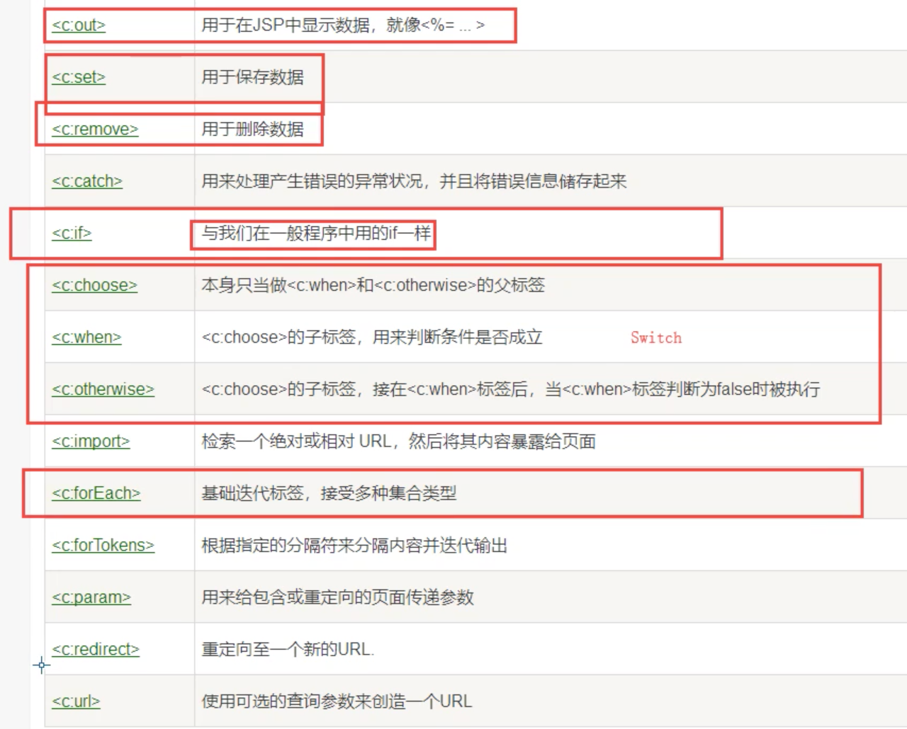

		* 使用步骤

		```jsp
		<%@ taglib prefix="c" uri="http://java.sun.com/jsp/jstl/core" %>
		```

		* 使用其中的方法

			* **c: if**

				```jsp
				<%--判断如果提交的用户名是管理员则登录成功--%>
				<c:if test="${param.username=='admin'}" var="isAdmin">
				    <c:out value="欢迎"/>
				</c:if>
				
				<%--自闭合标签--%>
				<c:out value="${isAdmin}"/>
				```

			* **c: when**

				```jsp
				<%--定义一个变量score，值为86--%>
				<c:set var="score" value="86"/>
				
				<c:choose>
				    <c:when test="${score>=90}">
				        你的成绩为优
				    </c:when>
				    <c:when test="${score<90}">
				        你的成绩为良
				    </c:when>
				</c:choose>
				```

			* **c: forEach**

			```jsp
			<%--
			var：每一次遍历出来的对象;
			items：要遍历的对象;
			begin,end：开始，结束
			step：步长
			--%>
			<%
			    ArrayList<String> people = new ArrayList<>();
			    people.add(0, "a");
			    people.add(1, "b");
			    people.add(2, "c");
			    people.add(3, "d");
			    request.setAttribute("list", people);
			%>
			
			<c:forEach var="people" items="${list}">
			    <c:out value="${people}"/> <br>
			</c:forEach>
			
			<c:forEach var="people" items="${list}" begin="1" end="3" step="1">
					<c:out value="${people}"/> <br>
			</c:forEach>
			```

	* **格式化标签**

	* **SQL标签**

	* **XML标签**

### 9.6 JavaBean

* 实体类，有特定写法
	* 必须有无参构造
	* 属性必须私有化
	* 必须有对应的set/get方法
	* 一般用来和数据库的字段做映射
* ORM：对象关系映射
	* 表-->类
	* 字段-->属性
	* 行记录-->对象

```jsp
<%--
    People people = new People();
    people.setAddress();
    people.setId();
    people.setAge();
    people.setName();
--%>
<jsp:useBean id="people" class="com.komorebi.pojo.People" scope="page"/>

<jsp:setProperty name="people" property="address" value="西安"/>
<jsp:setProperty name="people" property="id" value="1"/>
<jsp:setProperty name="people" property="age" value="18"/>
<jsp:setProperty name="people" property="name" value="cx"/>

姓名：<jsp:getProperty name="people" property="name"/>
ID：<jsp:getProperty name="people" property="id"/>
年龄：<jsp:getProperty name="people" property="age"/>
地址：<jsp:getProperty name="people" property="address"/>
```


## 10. MVC

* 早些年用户直接访问控制层，控制层就可以直接操作数据库

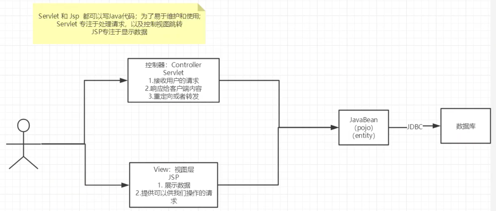

* Model View Controller，模型、视图、控制器  

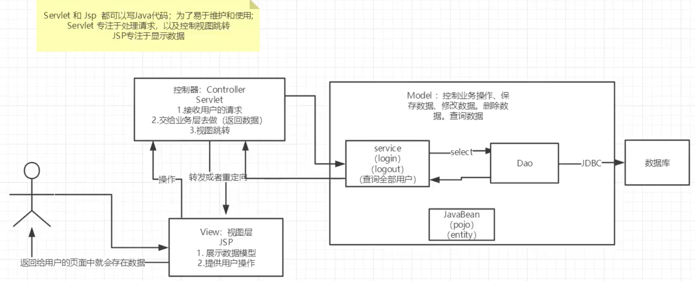

* model：

	* 业务处理：业务逻辑（Service）
	* 数据持久层：CRUD（Dao）

* View：

	* 展示数据
	* 提供链接发起Service请求（a, form, img...）

* Controller：

	* 接收用户的请求：（req：请求参数、Session信息）

	* 交给业务层处理相应的代码

	* 控制视图的跳转

		```jsp
		登录--->接收用户的登录请求--->处理用户的请求（获取用户登录的参数，username，password）--->交给业务层处理登录业务（判断用户名密码是否正确：事务）--->数据库
		```


## 11. Filter（重点）

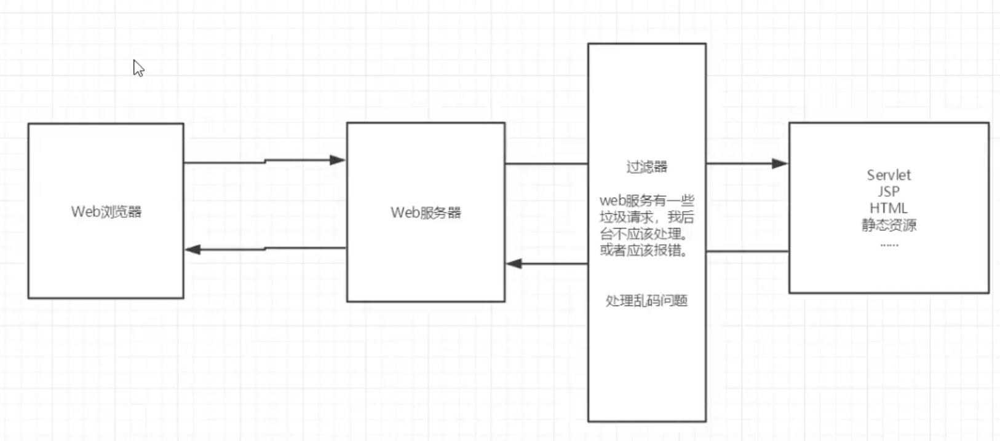

过滤器：用来**过滤网站的数据**

* 处理中文乱码

* 登录验证 

* 开发步骤

	* 导包

	* 编写过滤器，重写3个方法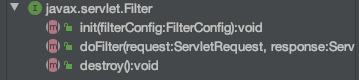

		* 过滤器中的所有代码，在过滤特定请求的时候都会执行
		* 必须让过滤器继续同行

	* ```java
		public class CharacterEncodingFilter implements Filter {
		    // 初始化
		    @Override
		    public void init(FilterConfig filterConfig) throws ServletException {
		        System.out.println("Already go");
		    }
		
		    @Override
		    public void doFilter(ServletRequest request, ServletResponse response, FilterChain chain) throws IOException, ServletException {
		        request.setCharacterEncoding("utf-8");
		        response.setCharacterEncoding("utf-8");
		        response.setContentType("text/html;charset=UTF-8");
		
		        System.out.println("CharacterEncodingFilter 执行前...");
		        chain.doFilter(request, response);          // 让我们的请求继续走，如不写，程序到这里就被拦截停止
		        System.out.println("CharacterEncodingFilter 执行后...");
		    }
		
		    // 销毁，web服务器关闭的时候，会被销毁
		    @Override
		    public void destroy() {
		        System.out.println("Game Over");
		    }
		}
		```

	* 配置filter过滤器，在web.xml中

		```xml
		<!--注册过滤器-->
		<filter>
		    <filter-name>CharacterEncodingFilter</filter-name>
		    <filter-class>com.komorebi.filter.CharacterEncodingFilter</filter-class>
		</filter>
		<filter-mapping>
		    <filter-name>CharacterEncodingFilter</filter-name>
		    <!--只要是Servlet的任何请求，都要过滤-->
		    <url-pattern>/servlet/*</url-pattern>
		</filter-mapping>
		```

* 用户登录

	* 登录后，向Session中放入用户的数据
	* 进入主页的时候判断用户是否已经登录；要求：在过滤器中实现

	```Java
	HttpServletRequest request = (HttpServletRequest) req;
	HttpServletResponse response = (HttpServletResponse) resp;
	
	if (request.getSession().getAttribute(constant.USER_SESSION) == null) {
	    response.sendRedirect("/error.jsp");
	}
	
	chain.doFilter(request, response);
	```


## 12. 监听器

实现一个监听器的接口；（有N种）

* 编写一个监听器
* 重写方法
* 配置web.xml

```xml
<!--注册监听器-->
<listener>
 		 <listener-class>com.komorebi.listener.OnlineCountListener</listener-class>
</listener>
```

```java
public class OnlineCountListener implements HttpSessionListener {
    // 创建Session监听，一旦创建一个Session，就会触发一次这个事件
    @Override
    public void sessionCreated(HttpSessionEvent se) {
        ServletContext ctx = se.getSession().getServletContext();
        Integer onlineCount = (Integer) ctx.getAttribute("OnlineCount");
        if (onlineCount == null){
            onlineCount = new Integer(1);
        } else {
            int count = onlineCount.intValue();
            onlineCount = new Integer(count++);
        }

        ctx.setAttribute("OnlineCount", onlineCount);
    }

    // 销毁Session监听
    @Override
    public void sessionDestroyed(HttpSessionEvent se) {
        ServletContext ctx = se.getSession().getServletContext();
        Integer onlineCount = (Integer) ctx.getAttribute("OnlineCount");
        if (onlineCount == null){
            onlineCount = new Integer(0);
        } else {
            int count = onlineCount.intValue();
            onlineCount = new Integer(count--);
        }

        ctx.setAttribute("OnlineCount", onlineCount);
    }
}
```


## 13. JDBC

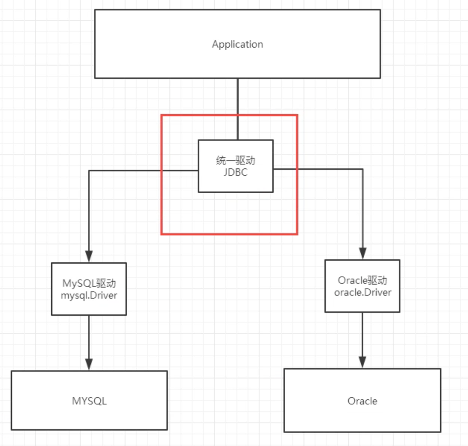

* 需要Jar包

	* Java.sql
	* Javax.sql
	* Mysql-connecter-java   连接驱动

* 环境搭建

	* IDEA添加数据库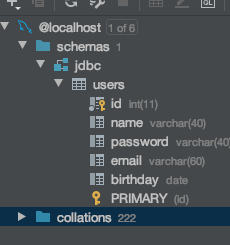

	* **固定步骤**

		* ```Java
			public class TestJdbc {
			    public static void main(String[] args) throws ClassNotFoundException, SQLException {
			        // 配置信息
			        String url = "jdbc:mysql://localhost:3306/jdbc?useUnicode=true&characterEncoding=utf8&autoReconnect=true&failOverReadOnly=false";
			        String username = "root";
			        String password = "123456";
			
			        // 1 加载驱动
			        Class.forName("com.mysql.jdbc.Driver");
			
			        // 2 连接数据库
			        Connection connection = DriverManager.getConnection(url, username, password);
			
			        // 3 向数据库发送SQL的对象statement
			        Statement statement = connection.createStatement();
			
			        // 4 编写SQL
			        String sql = "select * from users";
			
			        // 5 执行查询SQL，返回一个结果集
			        ResultSet resultSet = statement.executeQuery(sql);
			
			        while (resultSet.next()){
			            System.out.println("id: " + resultSet.getObject("id"));
			            System.out.println("name: " + resultSet.getObject("name"));
			            System.out.println("password: " + resultSet.getObject("password"));
			            System.out.println("email: " + resultSet.getObject("email"));
			            System.out.println("birthday: " + resultSet.getObject("birthday"));
			            System.out.println("-------------------------------------------------------");
			        }
			
			        // 6 关闭连接，释放资源(先开后关)
			        resultSet.close();
			        statement.close();
			        connection.close();
			    }
			}
			```

		* ```java 
			public class TestJdbc2 {
			    public static void main(String[] args) throws SQLException, ClassNotFoundException {
			        // 配置信息
			        String url = "jdbc:mysql://localhost:3306/jdbc?useUnicode=true&characterEncoding=utf8&autoReconnect=true&failOverReadOnly=false";
			        String username = "root";
			        String password = "123456";
			
			        // 1 加载驱动
			        Class.forName("com.mysql.jdbc.Driver");
			
			        // 2 连接数据库
			        Connection connection = DriverManager.getConnection(url, username, password);
			
			        // 3 编写SQL
			        String sql = "insert into users(id, name, password, email, birthday) values (?,?,?,?,?)";
			
			        // 4 预编译
			        PreparedStatement preparedStatement = connection.prepareStatement(sql);
			        preparedStatement.setInt(1, 4);
			        preparedStatement.setString(2, "cx4");
			        preparedStatement.setString(3, "123456");
			        preparedStatement.setString(4, "a@qq.com");
			        preparedStatement.setDate(5, new Date(new java.util.Date().getTime()));
			
			        // 5 执行SQL
			        int i = preparedStatement.executeUpdate();
			        if (i > 0) {
			            System.out.println("插入成功");
			        }
			
			        // 6 关闭连接，释放资源(先开后关)
			        preparedStatement.close();
			        connection.close();
			    }
			}
			```

* 事务

	* 要么都成功，要么都失败

	* ACID原则：保证数据的安全

		```java
		开启事务
		事务提交	commit()
		事务回滚  rollback()
		关闭事务
		```

* Junit单元测试：@Test注解只在方法上有效，只要加了就可以直接运行

```java 
public class TestJdbc3 {

    @Test
    public void test(){
        // 配置信息
        String url = "jdbc:mysql://localhost:3306/jdbc?useUnicode=true&characterEncoding=utf8&autoReconnect=true&failOverReadOnly=false";
        String username = "root";
        String password = "123456";

        Connection connection = null;

        // 1 加载驱动
        try {
            Class.forName("com.mysql.jdbc.Driver");

        // 2 连接数据库
        connection = DriverManager.getConnection(url, username, password);

        // 3 通知数据库开启事务,false是开启
        connection.setAutoCommit(false);
        String sql1 = "update account set money = money+100 where name = 'A'";
        connection.prepareStatement(sql1).executeUpdate();

        // 制造错误
        int i = 1 / 0;

        String sql2 = "update account set money = money-100 where name = 'B'";
        connection.prepareStatement(sql2).executeUpdate();

        connection.commit();
        System.out.println("提交成功");

        } catch (Exception e) {
            // 如果出现异常，就通知数据库回滚事务
            try {
                connection.rollback();
                System.out.println("Error");
            } catch (SQLException ex) {
                ex.printStackTrace();
            }
        } finally {
            // 4 关闭
            try {
                connection.close();
            } catch (SQLException ex) {
                ex.printStackTrace();
            }
        }
    }
}
```


## 14. SMBMS

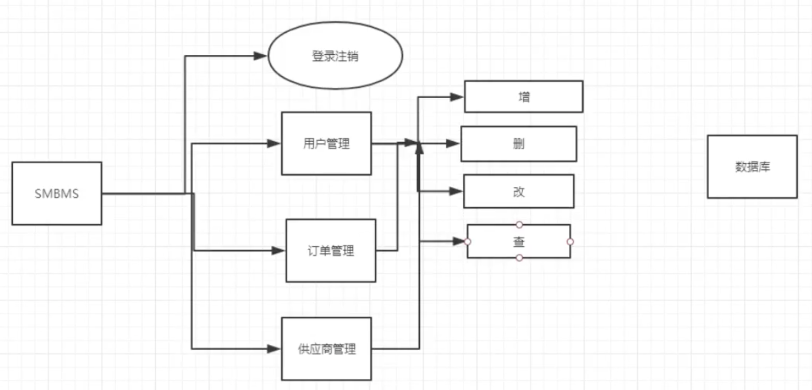

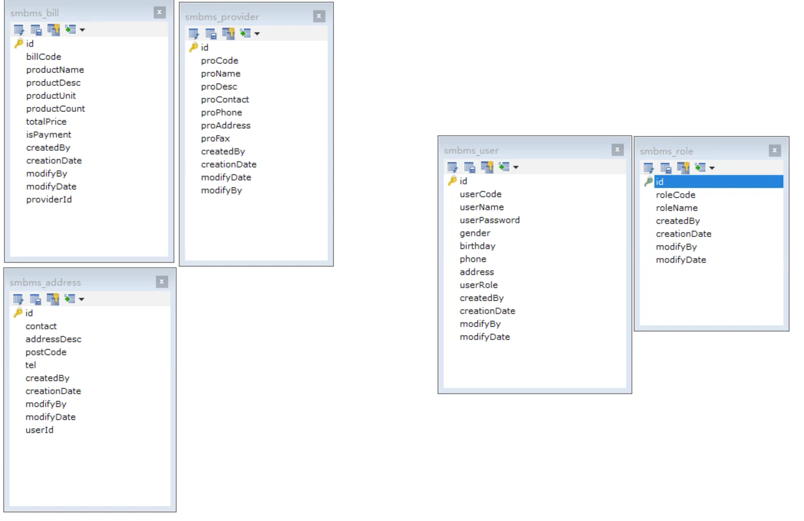

### 14.1 项目搭建

* 1 使用Maven搭建项目，模板-->java/resources-->pom.xml（删除）-->web.xml（改版本）

* 2 配置Tomcat，测试项目是否可以运行

* 3 导入项目中所用到的依赖（jar包）：JSP Servlet MySQL 

* 4 创新项目包结构

	* pojo：实体类
	* dao：操作数据库
	* service：业务
	* servlet：接口
	* filter：过滤器
	* util：工具

* 5 编写实体类：ORM映射：表--类映射

* 6 编写基础公共类

	* (1) 数据库配置文件

		```properties
		driver=com.mysql.jdbc.Driver
		url=jdbc:mysql://localhost:3306?useUnicode=true&characterEncoding=utf-8
		username=root
		password=123456
		```

	* (2) 读取db.properties，编写查询和增删改查公共类

		```Java
		package com.komorebi.dao;
		
		import java.io.IOException;
		import java.io.InputStream;
		import java.sql.*;
		import java.util.Properties;
		
		// 操作数据库的公共类
		public class BaseDao {
		    private static String driver;
		    private static String url;
		    private static String username;
		    private static String password;
		
		    // 静态代码块：类加载的时候就会初始化
		    static {
		        Properties properties = new Properties();
		        // 通过类加载器读取相应的资源
		        InputStream is = BaseDao.class.getClassLoader().getResourceAsStream("db.properties");
		
		        try {
		            properties.load(is);
		        } catch (IOException e) {
		            e.printStackTrace();
		        }
		
		        driver = properties.getProperty("driver");
		        url = properties.getProperty("url");
		        username = properties.getProperty("username");
		        password = properties.getProperty("password");
		    }
		
		    // 获取数据库的连接
		    public static Connection getConnection(){
		        Connection connection = null;
		        try {
		            Class.forName(driver);
		            connection = DriverManager.getConnection(url, username, password);
		        } catch (Exception e) {
		            e.printStackTrace();
		        }
		        return connection;
		    }
		
		    // 编写查询公共类
		    public static ResultSet execute(Connection connection, String sql, Object[] params, ResultSet resultSet, PreparedStatement preparedStatement) throws SQLException {
		        // 预编译的SQL，在后面直接执行就可以
		        preparedStatement = connection.prepareStatement(sql);
		        for (int i = 0; i < params.length; i++) {
		            // setObject占位符从1开始，数组从0开始
		            preparedStatement.setObject(i+1, params[i]);
		        }
		        resultSet = preparedStatement.executeQuery();
		        return resultSet;
		    }
		
		    // 编写增删改公共类
		    public static int execute(Connection connection, String sql, Object[] params, PreparedStatement preparedStatement) throws SQLException {
		        preparedStatement = connection.prepareStatement(sql);
		        for (int i = 0; i < params.length; i++) {
		            // setObject占位符从1开始，数组从0开始
		            preparedStatement.setObject(i+1, params[i]);
		        }
		        int updateRows = preparedStatement.executeUpdate();
		        return updateRows;
		    }
		
		    // 关闭连接，释放资源
		    public static boolean closeResource(Connection connection, PreparedStatement preparedStatement, ResultSet resultSet){
		        boolean flag = true;
		
		        if (resultSet != null) {
		            try {
		                resultSet.close();
		                // GC回收
		                resultSet = null;
		            } catch (SQLException e) {
		                e.printStackTrace();
		                flag = false;
		            }
		        }
		
		        if (preparedStatement != null) {
		            try {
		                preparedStatement.close();
		                // GC回收
		                preparedStatement = null;
		            } catch (SQLException e) {
		                e.printStackTrace();
		                flag = false;
		            }
		        }
		
		        if (connection != null) {
		            try {
		                connection.close();
		                // GC回收
		                connection = null;
		            } catch (SQLException e) {
		                e.printStackTrace();
		                flag = false;
		            }
		        }
		        return flag;
		    }
		}
		```

	* (3) 编写字符编码过滤器及在web.xml中的Filter映射

* 7 导入静态资源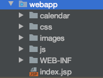

### 14.2 登录功能实现

 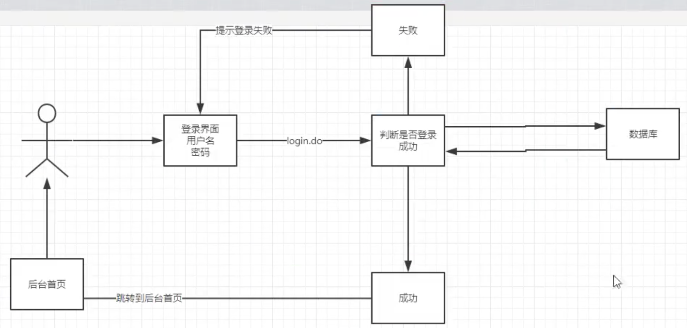

* 步骤：

	* 1 编写前端页面

	* 2 设置欢迎页面

	* 3 编写dao层登录用户的接口

		```Java
		// 得到要登录的用户
		public User getLoginUser(Connection connection, String userCode) throws SQLException;
		```

	* 4 编写dao接口的实现类

		```Java
		public class UserDaoImpl implements UserDao{
		    public User getLoginUser(Connection connection, String userCode) throws SQLException {
		        PreparedStatement pstm = null;
		        ResultSet rs = null;
		        User user = null;
		
		        if (connection != null) {
		            String sql = "select * from smbms_user where userCode=?";
		            Object[] params = {userCode};
		
		                rs = BaseDao.execute(connection, pstm, rs, sql, params);
		
		            if (rs.next()){
		                user = new User();
		                user.setId(rs.getInt("id"));
		                user.setUserCode(rs.getString("userCode"));
		                user.setUserName(rs.getString("userName"));
		                user.setUserPassword(rs.getString("userPassword"));
		                user.setGender(rs.getInt("gender"));
		                user.setBirthday(rs.getDate("birthday"));
		                user.setPhone(rs.getString("phone"));
		                user.setAddress(rs.getString("address"));
		                user.setUserRole(rs.getInt("userRole"));
		                user.setCreatedBy(rs.getInt("createdBy"));
		                user.setCreationDate(rs.getTimestamp("creationDate"));
		                user.setModifyBy(rs.getInt("modifyBy"));
		                user.setModifyDate(rs.getTimestamp("modifyDate"));
		            }
		            BaseDao.closeResource(null, pstm, rs);
		        }
		        return user;
		    }
		}
		```

	* 5 业务层接口

		```java 
		// 用户登录
		    public User login(String userCode, String password);
		```

	* 6 业务层实现类

		```java
		public class UserServiceImpl implements UserService {
		    // 业务层都会调用dao层，所有要引入Dao层
		    private UserDao userDao;
		    public UserServiceImpl(){
		        userDao = new UserDaoImpl();
		    }
		
		    @Override
		    public User login(String userCode, String password) {
		        Connection connection = null;
		        User user = null;
		
		        try {
		            connection = BaseDao.getConnection();
		            // 通过业务层调用对应的具体的数据库操作
		            user = userDao.getLoginUser(connection, userCode);
		        } catch (SQLException e) {
		            e.printStackTrace();
		        } finally {
		            BaseDao.closeResource(connection, null, null);
		        }
		        return user;
		    }
		}
		```

	* 7 编写Servlet

		```java
		public class LoginServlet extends HttpServlet {
		    // Servlet:控制层调用业务层代码
		
		    @Override
		    protected void doGet(HttpServletRequest req, HttpServletResponse resp) throws ServletException, IOException {
		        System.out.println("LoginServlet-start");
		        // 获取用户名和密码
		        String userCode = req.getParameter("userCode");
		        String userPassword = req.getParameter("userPassword");
		
		        // 和数据库中的密码对比,调用业务层
		        UserServiceImpl userService = new UserServiceImpl();
		        User user = userService.login(userCode, userPassword);      // 这里已经把登录的人查出来了
		
		        if (user != null) {
		            // 将用户的信息放到Session中
		            req.getSession().setAttribute(Constants.USER_SESSION, user);
		            // 跳转到内部网页
		            resp.sendRedirect("jsp/frame.jsp");
		        } else {
		            // 转发回登录页面，顺带提示用户名或者密码错误
		            req.setAttribute("error", "用户名或者密码错误");
		            req.getRequestDispatcher("login.jsp").forward(req, resp);
		        }
		    }
		
		    @Override
		    protected void doPost(HttpServletRequest req, HttpServletResponse resp) throws ServletException, IOException {
		        doGet(req, resp);
		    }
		}
		```

	* 8 注册Servlet

		```jsp
		    <!--Servlet-->
		    <servlet>
		        <servlet-name>LoginServlet</servlet-name>
		        <servlet-class>com.komorebi.servlet.user.LoginServlet</servlet-class>
		    </servlet>
		    <servlet-mapping>
		        <servlet-name>LoginServlet</servlet-name>
		        <url-pattern>/login.do</url-pattern>
		    </servlet-mapping>
		```

	* 9 测试访问，确保以上功能成功

	* 10 优化，注销功能

		* 移除Session，返回登录页面

			```java
			public class LogoutServlet extends HttpServlet {
			    @Override
			    protected void doGet(HttpServletRequest req, HttpServletResponse resp) throws ServletException, IOException {
			        // 移除用户的Session
			        req.getSession().removeAttribute(Constants.USER_SESSION);
			        resp.sendRedirect("/login.jsp");
			    }
			
			    @Override
			    protected void doPost(HttpServletRequest req, HttpServletResponse resp) throws ServletException, IOException {
			        doGet(req, resp);
			    }
			}
			```

		* 注册xml

			```xml
			    <servlet>
			        <servlet-name>LogoutServlet</servlet-name>
			        <servlet-class>com.komorebi.servlet.user.LogoutServlet</servlet-class>
			    </servlet>
			    <servlet-mapping>
			        <servlet-name>LogoutServlet</servlet-name>
			        <url-pattern>/logout.do</url-pattern>
			    </servlet-mapping>
			```

	* 11 登录拦截优化

		* 编写Filter

			```Java
			public class SysFilter implements Filter {
			    @Override
			    public void init(FilterConfig filterConfig) throws ServletException {
			
			    }
			
			    @Override
			    public void doFilter(ServletRequest req, ServletResponse resp, FilterChain chain) throws IOException, ServletException {
			        HttpServletRequest request = (HttpServletRequest) req;
			        HttpServletResponse response = (HttpServletResponse) resp;
			
			        User user = (User) request.getSession().getAttribute(Constants.USER_SESSION);
			
			        if (user == null) {
			            response.sendRedirect("/smbms/error.jsp");
			        }else {
			            chain.doFilter(req, resp);
			        }
			    }
			
			    @Override
			    public void destroy() {
			
			    }
			}
			```

		* 注册Filter

			```xml
			    <!--登录拦截过滤器-->
			    <filter>
			        <filter-name>SysFilter</filter-name>
			        <filter-class>com.komorebi.filter.SysFilter</filter-class>
			    </filter>
			    <filter-mapping>
			        <filter-name>SysFilter</filter-name>
			        <url-pattern>/jsp/*</url-pattern>
			    </filter-mapping>
			```

### 14.3 密码修改

* 1 导入前端素材

* 2 建议从底层往上写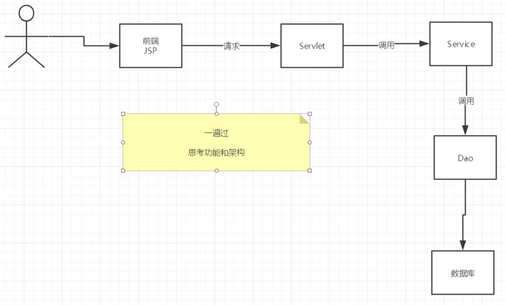

* 3 UserDao接口

	```java 
	// 修改当前密码
	public int updatePwd(Connection connection, int id, int password) throws SQLException;
	```

* 4 UserDao接口实现类

	```java
	// 修改当前用户密码
	    @Override
	    public int updatePwd(Connection connection, int id, int password) throws SQLException {
	        PreparedStatement pstm = null;
	        int execute = 0;
	
	        if (connection != null) {
	            Object params[] = {password, id};
	
	            String sql = "update smbms_user set userPassword = ? where id = ?";
	
	            execute = BaseDao.execute(connection, pstm, sql, params);
	
	            BaseDao.closeResource(null, pstm, null);
	        }
	        return execute;
	    }
	```

* 5 UserService接口

	```java
	// 根据用户ID修改密码
	    public boolean updatePwd(int id, int password);
	```

* 6 UserService接口实现类

	```java
	// 根据用户ID修改密码
	    @Override
	    public boolean updatePwd(int id, int password) {
	        Connection connection = null;
	        boolean flag = false;
	
	        connection = BaseDao.getConnection();
	
	        try {
	            if (userDao.updatePwd(connection, id, password) > 0) {
	                flag = true;
	            }
	        } catch (SQLException e) {
	            e.printStackTrace();
	        } finally {
	            BaseDao.closeResource(connection, null,null);
	        }
	        return flag;
	    }
	```

* 7 UserServlet类实现以及Servlet配置映射

	```Java
	// 修改密码savepwd
	    public void updatePwd(HttpServletRequest req, HttpServletResponse resp){
	        // 从Session里面拿ID
	        User o = (User) req.getSession().getAttribute(Constants.USER_SESSION);
	
	        String newpassword = req.getParameter("newpassword");
	
	        boolean flag = false;
	
	        if (o != null && !StringUtils.isNullOrEmpty(newpassword)){
	            UserServiceImpl userService = new UserServiceImpl();
	            flag = userService.updatePwd(o.getId(), newpassword);
	            if (flag){
	                req.setAttribute("massage", "修改成功，请退出，使用新密码登录");
	                // 密码修改成功，移除当前Session
	                req.getSession().removeAttribute(Constants.USER_SESSION);
	            } else {
	                req.setAttribute("massage", "修改失败");
	            }
	        } else {
	            req.setAttribute("massage", "修改失败");
	        }
	        try {
	            req.getRequestDispatcher("pwdmodify.jsp").forward(req, resp);
	        } catch (ServletException e) {
	            e.printStackTrace();
	        } catch (IOException e) {
	            e.printStackTrace();
	        }
	    }
	```

* 8 优化密码验证Ajax

	* Fastjson：

		```xml
		    <!--fastjson-->
		    <dependency>
		      <groupId>com.alibaba</groupId>
		      <artifactId>fastjson</artifactId>
		      <version>1.2.74</version>
		    </dependency>
		```

	* 后台代码修改

		```Java
		    // 验证旧密码，Session中有密码
		    public void pwdmodify(HttpServletRequest req, HttpServletResponse resp){
		        // 从Session里面拿ID
		        User o = (User) req.getSession().getAttribute(Constants.USER_SESSION);
		        String oldpassword = req.getParameter("oldpassword");
		
		        // 万能Map:结果集
		        Map<String, String> resultMap = new HashMap<String, String>();
		        if (o == null) { // Session过期
		            resultMap.put("result", "sessionerror");
		        } else if (StringUtils.isNullOrEmpty(oldpassword)){ // 输入的旧密码为空
		            resultMap.put("result", "error");
		        } else {
		            String userPassword = o.getUserPassword();      // Session中用户的密码
		            if (oldpassword.equals(userPassword)){
		                resultMap.put("result", "true");
		            } else {
		                resultMap.put("result", "false");
		            }
		        }
		
		        try {
		            resp.setContentType("application/json");
		            PrintWriter writer = resp.getWriter();
		            // JSONArray 阿里的工具类
		            writer.write(JSONArray.toJSONString(resultMap));
		            writer.flush();
		            writer.close();
		        } catch (IOException e) {
		            e.printStackTrace();
		        }
		    }
		```

### 14.4 用户管理

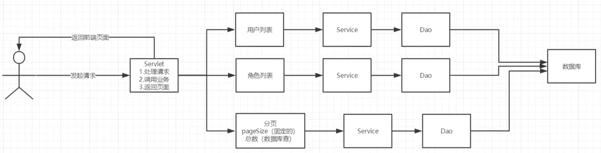

* 1 导入分页的工具类

* 2 用户列表页面导入

	* Userlist.jsp  
	* Rollpage.jsp

* 3 获取用户数量

	* UserDao

	* UserDaoImpl

		```java
		    // 根据用户名或者角色查询用户总数
		    @Override
		    public int getUserCount(Connection connection, String username, int userRole) throws SQLException {
		        PreparedStatement pstm = null;
		        ResultSet rs = null;
		        int count = 0;
		
		        if (connection != null){
		            StringBuffer sql = new StringBuffer();
		            sql.append("select count(1) as count from smbms_user u, smbms_role r where u.userRole = r.id");
		            ArrayList<Object> list = new ArrayList<Object>();// 存放我们的参数
		
		            if (!StringUtils.isNullOrEmpty(username)){
		                sql.append("and u.userName like ?");
		                list.add("%" + username + "%"); // index: 0
		            }
		            if (userRole > 0){
		                sql.append("and u.userRole = ?");
		                list.add(userRole);
		            }
		
		            // 怎么把list转换为数组
		            Object[] params = list.toArray();
		
		            System.out.println("UserDaoImpl-->getUserCount:" + sql.toString());
		
		            rs = BaseDao.execute(connection, pstm, rs, sql.toString(), params);
		
		            if (rs.next()){
		                count = rs.getInt("count");         // 从结果集中获取最终的数量
		            }
		            BaseDao.closeResource(null, pstm, rs);
		        }
		        return count;
		    }
		```

	* UserService

	* UserServiceImpl

		```java
		    // 查询记录数
		    @Override
		    public int getUserCount(String username, int userRole) {
		        Connection connection = null;
		        int count = 0;
		        try {
		            connection = BaseDao.getConnection();
		            count = userDao.getUserCount(connection, username, userRole);
		        } catch (SQLException e) {
		            e.printStackTrace();
		        } finally {
		            BaseDao.closeResource(connection, null, null);
		        }
		        return count;
		    }
		```

* 4 用户列表

	* UserDao

	* UserDaoImpl

		```java
		// 通过条件查询userList
		    @Override
		    public List<User> getUserList(Connection connection, String userName, int userRole, int currentPageNo, int pageSize) throws SQLException {
		        PreparedStatement pstm = null;
		        ResultSet rs = null;
		        List<User> userList = new ArrayList<User>();
		        if(connection != null){
		            StringBuffer sql = new StringBuffer();
		            sql.append("select u.*,r.roleName as userRoleName from smbms_user u,smbms_role r where u.userRole = r.id");
		            List<Object> list = new ArrayList<Object>();
		            if(!StringUtils.isNullOrEmpty(userName)){
		                sql.append(" and u.userName like ?");
		                list.add("%"+userName+"%");
		            }
		            if(userRole > 0){
		                sql.append(" and u.userRole = ?");
		                list.add(userRole);
		            }
		            sql.append(" order by creationDate DESC limit ?,?");
		            currentPageNo = (currentPageNo - 1) * pageSize;
		            list.add(currentPageNo);
		            list.add(pageSize);
		
		            Object[] params = list.toArray();
		            System.out.println("sql ----> " + sql.toString());
		            rs = BaseDao.execute(connection, pstm, rs, sql.toString(), params);
		            while(rs.next()){
		                User _user = new User();
		                _user.setId(rs.getInt("id"));
		                _user.setUserCode(rs.getString("userCode"));
		                _user.setUserName(rs.getString("userName"));
		                _user.setGender(rs.getInt("gender"));
		                _user.setBirthday(rs.getDate("birthday"));
		                _user.setPhone(rs.getString("phone"));
		                _user.setUserRole(rs.getInt("userRole"));
		                _user.setUserRoleName(rs.getString("userRoleName"));
		                userList.add(_user);
		            }
		            BaseDao.closeResource(null, pstm, rs);
		        }
		        return userList;
		    }
		```

	* UserService

	* UserServiceImpl

		```java
		    @Override
		    public List<User> getUserList(String queryUserName, int queryUserRole, int currentPageNo, int pageSize) {
		        Connection connection = null;
		        List<User> userList = null;
		        System.out.println("queryUserName ---- > " + queryUserName);
		        System.out.println("queryUserRole ---- > " + queryUserRole);
		        System.out.println("currentPageNo ---- > " + currentPageNo);
		        System.out.println("pageSize ---- > " + pageSize);
		        try {
		            connection = BaseDao.getConnection();
		            userList = userDao.getUserList(connection, queryUserName, queryUserRole, currentPageNo, pageSize);
		        } catch (Exception e) {
		            // TODO Auto-generated catch block
		            e.printStackTrace();
		        }finally{
		            BaseDao.closeResource(connection, null, null);
		        }
		        return userList;
		    }
		```

* 5 角色列表

	* 创建RoleDao  RoleDaoImpl RoleService RoleServiceImpl
	
		* RoleDao
	
		* RoleDaoImpl
	
			```java
			// 获取角色列表
			    @Override
			    public List<Role> getRoleList(Connection connection) throws SQLException {
			        PreparedStatement pstm = null;
			        ResultSet resultSet = null;
			        ArrayList<Role> roleList = new ArrayList<>();
			
			        if (connection != null){
			            String sql = "select * from smbms_role";
			            Object[] params = {};
			            resultSet = BaseDao.execute(connection, pstm, resultSet, sql, params);
			
			            while (resultSet.next()){
			                Role _role = new Role();
			                _role.setId(resultSet.getInt("id"));
			                _role.setRoleCode(resultSet.getString("roleCode"));
			                _role.setRoleName(resultSet.getString("roleName"));
			                roleList.add(_role);
			            }
			
			            BaseDao.closeResource(connection, pstm, resultSet);
			        }
			        return roleList;
			    }
			```
	
		* RoleService
	
		* RoleServiceImpl
	
			```java
			    // 获取角色列表
			    @Override
			    public List<Role> getRoleList() {
			        Connection connection = null;
			        List<Role> roleList = null;
			        try {
			            connection = BaseDao.getConnection();
			            roleList = roleDao.getRoleList(connection);
			        } catch (SQLException e) {
			            e.printStackTrace();
			        } finally {
			            BaseDao.closeResource(connection, null, null);
			        }
			        return roleList;
			    }
			```
	
* 6 用户显示的Servlet

	* ```Java
		// query
		    public void query(HttpServletRequest req, HttpServletResponse resp) {
		        // 查询用户列表
		        String queryUserName = req.getParameter("queryname");
		        String temp = req.getParameter("queryUserRole");
		        String pageIndex = req.getParameter("pageIndex");
		        int queryUserRole = 0;
		
		        // 获取用户列表
		        UserServiceImpl userService = new UserServiceImpl();
		        List<User> userList = null;
		        List<Role> roleList = null;
		
		        // 第一次走这个请求，一定是第一页，页面大小固定的
		        int pageSize = 5;
		        int currentPageNo = 1;
		
		        if (queryUserName == null) {
		            queryUserName = "";
		        }
		        if (temp != null && !temp.equals("")){
		            queryUserRole = Integer.parseInt(temp);
		        }
		        if (pageIndex != null){
		            currentPageNo = Integer.parseInt(pageIndex);
		        }
		
		        // 获取用户的总数(分页：上一页和下一页)
		        int totalCount = userService.getUserCount(queryUserName, queryUserRole);
		
		        // 总页数支持
		        PageSupport pageSupport = new PageSupport();
		        pageSupport.setCurrentPageNo(currentPageNo);
		        pageSupport.setPageSize(pageSize);
		        pageSupport.setTotalCount(totalCount);
		
		        int totalPageCount = pageSupport.getTotalPageCount();       // 页数
		
		        // 控制首页和尾页,如果页面要小于1，就显示第一页
		        if (totalPageCount < 1){
		            currentPageNo = 1;
		        } else if (currentPageNo > totalPageCount){
		            currentPageNo = totalPageCount;
		        }
		
		        // 获取用户列表展示
		        userList = userService.getUserList(queryUserName, queryUserRole, currentPageNo, pageSize);
		        req.setAttribute("userList", userList);
		
		        // 获取角色列表展示
		        RoleServiceImpl roleService = new RoleServiceImpl();
		        roleList = roleService.getRoleList();
		        req.setAttribute("roleList", roleList);
		
		        req.setAttribute("totalCount", totalCount);
		        req.setAttribute("currentPageNo", currentPageNo);
		        req.setAttribute("totalPageCount", totalPageCount);
		        req.setAttribute("queryUserName", queryUserName);
		        req.setAttribute("queryUserRole", queryUserRole);
		
		        // 返回前端
		        try {
		            req.getRequestDispatcher("userlist.jsp").forward(req, resp);
		        } catch (ServletException e) {
		            e.printStackTrace();
		        } catch (IOException e) {
		            e.printStackTrace();
		        }
		    }
		```

	* 获取用户前端的数据

	* 判断请求是否需要执行，看参数的值判断

	* 为实现分页

	* 用户列表展示

	* 返回前端


## 15. 文件上传

* 注意事项（调优）
	* 为保证服务器安全，上传文件应该放在外界无法直接访问的目录下，如WEB-INF目录下
	* 为防止文件覆盖，要为上传文件产生一个唯一的文件名
	* 要限制上传文件的最大值
	* 可以限制上传文件的类型，在收到上传文件名时，判断后缀名是否合法
* 导包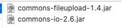
* UUID：生成一段随机的不会重复的数字
* 需要用到的类
	* **ServletFileUpload**负责处理上传的文件数据，并将表单中每个输入项封装成一个**FileItem**对象，在使用ServerFileUpload对象解析请求时需要**DiskFileItemFactory**对象。所以，需要在进行解析工作前构造好**DIskFIleItemFactory**对象，通过**ServletFileUpload**对象的构造方法或setFileItemFactory()方法设置**ServletFileUpload**对象的**fileItemFactory**属性。

* 表单中如果包含一个文件上传输入项的时候，表单的**enctype**属性必须设置为**multipart/form-data**

### 15.1 ServletFileUpload类

* 负责处理上传的文件数据，并将表单中每个输入项封装成一个FileItem对象中。使用其**parseRequest(HttpServletRequest)**方法可以将通过表单中每一个HTML标签提交的数据封装成一个FIleItem对象，然后以list列表的形式返回，使用该方法处理上传文件简单易用。


## 16. 邮件发送

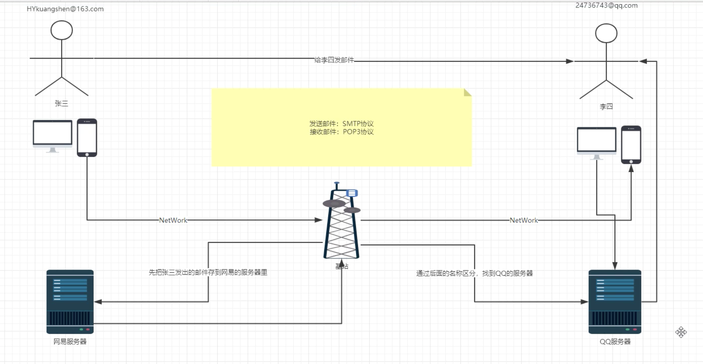

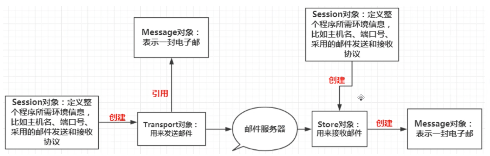

EETBDIXTIBOQXYYA