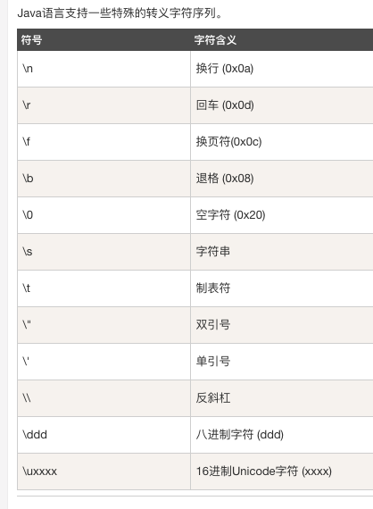
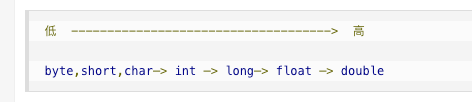
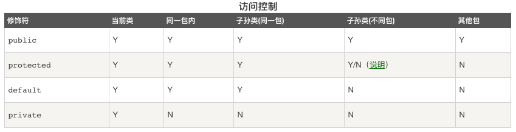
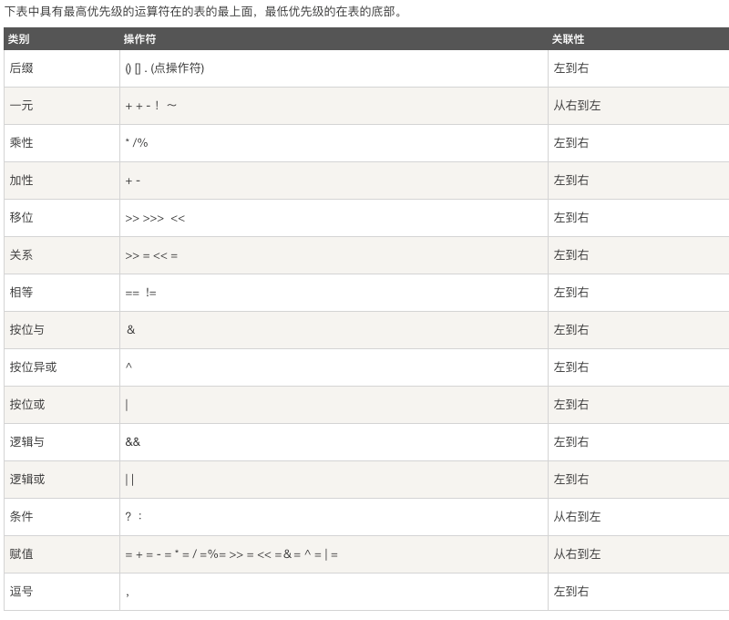
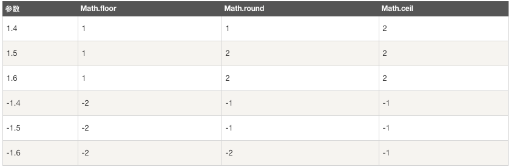

# Java笔记

## 1. 基本数据类型

### 转义字符序列




### 自动类型转换



* 不能对**boolean**类型进行转换
* 不能把对象类型转化为不相关类的对象
* 把容量大的类型转化为容量小的类型时必须使用强制类型转化
* 转换过程中可能会损失精度
* 浮点数到整数的转换通过**舍弃小数**得到，而不是四舍五入

```Java
char a = "a";
int b = a;
System.out.println(b)

int c = 1;
byte d = (byte)c;							    //强制类型转换
```


### 变量类型


## 2. 修饰符

* default：在同一包内可见，不使用任何修饰符。使用对象：类、接口、变量、方法
* Private：在同一类内可见。使用对象：变量、方法
* Public：对所有类可见。使用对象：类、接口、变量、方法
* Protected：对同一包内的类和所有子类可见。使用对象：变量、方法




## 3. 位运算符

* 定义了位运算符，应用于int, long, short, char, byte
* 作用在所有的位上，按位运算

```java
a = 0011 1100
b = 0000 1101
------------------
a & b = 0000 1100
a | b = 0011 1101
a ^ b = 0011 0001
~a = 1100 0011
```

| 操作符 | 描述                                  |
| ------ | ------------------------------------- |
| &      | 相同位都为1，则结果为1，否则为0       |
| \|     | 相同位都为0，则结果为0，否则为1       |
| ^      | 相对应位值相同，则结果为0，否则为1    |
| ~      | 按位取反                              |
| <<     | 按位左移运算符                        |
| >>     | 按位右移运算符                        |
| >>>    | 按位右移补零操作符，移动得到的空位补0 |


## 4. 逻辑运算符

| 操作符 | 定义   |
| ------ | ------ |
| &&     | 逻辑与 |
| \|\|   | 逻辑或 |
| !      | 逻辑非 |


## 5. 条件运算符

```java
variable x = (expression) ? value if true: value if false
int b,a;
a = 10;
b = (a == 10) ? 20 : 30;
```


## 6. 运算符优先级




## 7. switch语句

* switch语句的变量类型：Byte, short, int, char, string
* 可以有多个case语句，每个case后面跟一个要比较的值和冒号
* case语句中的值的数据类型必须与变量相同
* 当变量的值与case语句的值相等时，那么case之后的语句开始执行，**直到break出现才会跳出**
* 遇到break语句时，程序跳转到后面的执行
* switch语句可以包含一个default分支，**default在没有符合的case语句情况下执行**


## 8. Math中的floor,round和ceil方法比较

* **floor()**表示返回小于等于给定参数的最大整数
* **ceil()**表示返回大于等于给定参数的最大整数
* **round()**表示四舍五入，算法为**Math.floor(x+0.5)**



