# Mybatis

## 1 简介

* MyBatis 是一款优秀的**持久层**框架：
	* 持久层：完成持久化工作的代码块
	* 持久化就是将程序的数据在持久状态和瞬时状态转化的过程
	* 内存：**断电即失**
	* 数据库(JDBC)：io文件持久化
	* 生活：冷藏
* 它支持自定义 SQL、存储过程以及高级映射。
* MyBatis 免除了几乎所有的 JDBC 代码以及设置参数和获取结果集的工作。
* MyBatis 可以通过简单的 XML 或注解来配置和映射原始类型、接口和 Java POJO（Plain Old Java Objects，普通老式 Java 对象）为数据库中的记录。
* 优点
	* 简单易学
	* 灵活
	* sql和代码的分离，提高了可维护性
	* 提供映射标签，支持对象与数据库的orm字段关系映射
	* 提供对象关系映射标签，支持对象关系组建维护
	* 提供xml标签，支持编写动态sql

## 2 环境配置

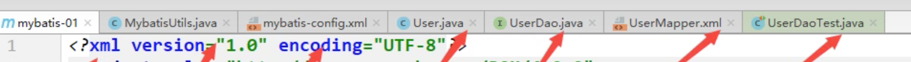

### 2.1 搭建环境

* 1 构造数据库

	```sql
	CREATE TABLE `user`(
		`id` INT(20) NOT NULL,
		`name` VARCHAR(30) DEFAULT NULL,
		`pwd` VARCHAR(30) DEFAULT NULL,
		PRIMARY KEY(`id`)
	)ENGINE=INNODB DEFAULT CHARACTER SET=utf8;
	
	INSERT INTO `user`(`id`, `name`, `pwd`) VALUES
	(1, 'komorebi', '123456'),
	(2, 'zhang_three', '123456'),
	(3, 'li_four', '123456')
	```

* 2 新建项目

	* 新建一个普通Maven项目
	* 删除src目录
	* 导入依赖（**Mysql Mybatis Junit**）

* 3 创建一个模块，空的Maven模块即可

* 4 编写Mybatis的核心配置文件(在子模块resources目录下)

	```xml
	<?xml version="1.0" encoding="UTF-8" ?>
	<!DOCTYPE configuration
	        PUBLIC "-//mybatis.org//DTD Config 3.0//EN"
	        "http://mybatis.org/dtd/mybatis-3-config.dtd">
	<configuration>
	    <environments default="development">
	        <environment id="development">
	            <transactionManager type="JDBC"/>
	            <dataSource type="POOLED">
	                <property name="driver" value="com.mysql.jdbc.Driver"/>
	                <property name="url" value="jdbc:mysql://localhost:3306/mybatis?useSSL=true&amp;useUnicode=true&amp;characterEncoding=UTF-8"/>
	                <property name="username" value="root"/>
	                <property name="password" value="123456"/>
	            </dataSource>
	        </environment>
	    </environments>
	    <mappers>
	        <mapper resource="com/komorebi/dao/UserMapper.xml"/>	<!--注意这里是/-->
	    </mappers>
	</configuration>
	```

* 5 编写MybatisUtils工具类

	```java
	// sqlSessionFactory --> sqlSession
	public class MybatisUtils {
	    private static SqlSessionFactory sqlSessionFactory;
	    static {
	        try {
	            // 获取sqlSessionFactory对象
	            String resource = "mybatis-config.xml";
	            InputStream inputStream = Resources.getResourceAsStream(resource);
	            sqlSessionFactory = new SqlSessionFactoryBuilder().build(inputStream);
	        } catch (IOException e) {
	            e.printStackTrace();
	        }
	    }
	
	    // 既然有了SqlSessionFactory，顾名思义，我们可以从中获得 SqlSession 的实例
	    // SqlSession 提供了在数据库执行 SQL 命令所需的所有方法
	    public static SqlSession getSqlSession(){
	        return sqlSessionFactory.openSession();
	    }
	}
	```

### 2.2 编写代码

* 实体类

	```java
	package com.komorebi.pojo;
	
	// 实体类
	public class User {
	    private int id;
	    private String name;
	    private String pwd;
	
	    public User() {}
	
	    public User(int id, String name, String pwd) {
	        this.id = id;
	        this.name = name;
	        this.pwd = pwd;
	    }
	
	    public int getId() {return id;}
	    public void setId(int id) {this.id = id;}
	    public String getName() {return name;}
	    public void setName(String name) {this.name = name;}
	    public String getPwd() {return pwd;}
	    public void setPwd(String pwd) {this.pwd = pwd;}
	
	    @Override
	    public String toString() {
	        return "User{" +
	                "id=" + id +
	                ", name='" + name + '\'' +
	                ", pwd='" + pwd + '\'' +
	                '}';
	    }
	}
	
	```

* Dao接口

	```java
	public interface UserDao {
	    List<User> getUserList();
	}
	```

* 接口实现类（由原来的Impl转换为一个Mapper配置文件）UserMapper.xml

	```xml
	<?xml version="1.0" encoding="UTF-8" ?>
	<!DOCTYPE mapper
	        PUBLIC "-//mybatis.org//DTD Mapper 3.0//EN"
	        "http://mybatis.org/dtd/mybatis-3-mapper.dtd">
	<!--命名空间 绑定一个对应的Mapper接口-->
	<mapper namespace="com.komorebi.dao.UserDao">
	    <!--查询语句-->
	    <select id="getUserList" resultType="com.komorebi.pojo.User">		<!--这里是. 但可以用别名简化-->
	        secect * from mybatis.user
	    </select>
	</mapper>
	```

### 2.3 测试

* org.apache.ibatis.binding.BindingException: Type interface com.komorebi.dao.UserDao is not known to the MapperRegistry.

	* **解决方案**：每一个Mapper.xml都需要在Mybatis核心配置文件中注册

* Caused by: java.io.IOException: Could not find resource com/komorebi/dao/UserMapper.xml

	* **解决方案**：pom.xml中加入build中配置resources,来防止我们资源导出失败的问题，可能只需要加java目录

* ```Java
	public class UserDaoTest {
	    @Test
	    public void test(){
	        // 1 获得SqlSession对象
	        SqlSession sqlSession = MybatisUtils.getSqlSession();
	
	        // 2.1 执行
	        UserDao userDao = sqlSession.getMapper(UserDao.class);
	        List<User> userList = userDao.getUserList();
	
	        for (User user : userList) {
	            System.out.println(user);
	        }
	
	        // 3 关闭SqlSession
	        sqlSession.close();
	    }
	}
	```


## 3 CRUD

### 3.1 namespace

* **namespace中的包名要和mapper接口的包名一致**

* id：对应的namespace中的方法名
* resultType：SQL语句执行的返回值
* parameterType：参数类型

### 3.2 CRUD操作

* 只需要修改**接口**处和接口实现的**xml**
* **增删改需要提交事务**

```java
public interface UserMapper {
    // 查询全部用户
    List<User> getUserList();

    // 根据ID查询用户
    User getUserById(int id);

    // insert一个用户
    int addUser(User user);

    // 修改用户
    int updateUser(User user);

    // 删除一个用户
    int deleteUser(int id);
}
```

```xml
<?xml version="1.0" encoding="UTF-8" ?>
<!DOCTYPE mapper
        PUBLIC "-//mybatis.org//DTD Mapper 3.0//EN"
        "http://mybatis.org/dtd/mybatis-3-mapper.dtd">

<!--命名空间 绑定一个对应的Mapper接口-->
<mapper namespace="com.komorebi.dao.UserMapper">
    <!--查询语句-->
    <select id="getUserList" resultType="com.komorebi.pojo.User">
        select * from mybatis.user;
    </select>

    <!--按指定ID查询语句-->
    <select id="getUserById" parameterType="int" resultType="com.komorebi.pojo.User">
        select * from mybatis.user where id = #{id};
    </select>

    <!--插入一个用户，对象中的属性，可以直接取出-->
    <insert id="addUser" parameterType="com.komorebi.pojo.User">
        insert into mybatis.user(id, name, pwd) values (#{id}, #{name}, #{pwd});
    </insert>

    <!--修改一个用户-->
    <update id="updateUser" parameterType="com.komorebi.pojo.User">
        update mybatis.user set name = #{name}, pwd = #{pwd}  where id = #{id};
    </update>

    <!--删除一个用户-->
    <delete id="deleteUser" parameterType="int">
        delete from mybatis.user where id = #{id};
    </delete>
</mapper>
```

### 3.3 万能map

* 假设实体类或者数据库中**参数太多**，考虑使用Map

```java 
// 用map作为输入
int addUser2(Map<String, Object> map);
```

```xml
<!--万能Map-->
<insert id="addUser2" parameterType="map">
    insert into mybatis.user(id, name, pwd) values (#{userID}, #{userName}, #{userPassword})
</insert>
```

```java
@Test
public void testAddUser2(){
    SqlSession sqlSession = MybatisUtils.getSqlSession();

    UserMapper mapper = sqlSession.getMapper(UserMapper.class);

    Map<String, Object> map = new HashMap<String, Object>();
    map.put("userID", 4);
    map.put("userName", "wang_five");
    map.put("userPassword", "123123");

    mapper.addUser2(map);

    sqlSession.commit();		//提交事务,重点!不写的话不会提交到数据库
    sqlSession.close();
}
```

* **Map传递参数**，直接在sql中取出key即可   parameterType="map"
* **对象传递参数**，直接在sql中取出对象的属性即可    parameterType="com.komorebi.pojo.User"
* 只有一个**基本类型参数**的情况下，可以直接在sql中取到‘
* 多个参数情况下，可以用Map，也可以用**注解**

### 3.4 模糊查询

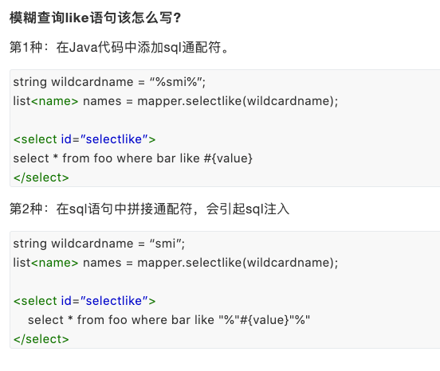

* Java代码执行的时候，传递通配符%%
* 在SQL拼接中使用通配符

```Java
// 模糊查询
List<User> getUserLike(String value);
```

```xml
<!--模糊查询-->
<select id="getUserLike" resultType="com.komorebi.pojo.User">
    select * from mybatis.user where name like #{value};
</select>
```

```java
@Test
public void testGetUserLike(){
    SqlSession sqlSession = MybatisUtils.getSqlSession();

    UserMapper mapper = sqlSession.getMapper(UserMapper.class);
    List<User> userList = mapper.getUserLike("%li%");	// 传递通配符%%
    for (User user : userList) {
        System.out.println(user);
    }
    sqlSession.close();
}
```


## 4 配置解析

### 4.1 核心配置文件


* mybatis-config.xml

### 4.2 环境配置（environments）

* MyBatis 可以配置成适应多种环境

* **尽管可以配置多个环境，但每个 SqlSessionFactory 实例只能选择一种环境。**

* 默认的事务管理器：**JDBC**，连接池：**POOLED**

	```xml
	<environments default="development">
	    <environment id="development">
	        <transactionManager type="JDBC"/>
	        <dataSource type="POOLED">
	            <property name="driver" value="com.mysql.jdbc.Driver"/>
	            <property name="url" value="jdbc:mysql://localhost:3306/mybatis?useSSL=true&amp;useUnicode=true&amp;characterEncoding=UTF-8"/>
	            <property name="username" value="root"/>
	            <property name="password" value="123456"/>
	        </dataSource>
	    </environment>
	</environments>
	```

### 4.3 属性（properties）

* 可以通过properties属性引用配置文件

* 这些属性可以在外部进行配置，并可以进行动态替换。你既可以在典型的 Java 属性文件中配置这些属性，也可以在 properties 元素的子元素中设置

* 1 编写一个配置文件db.properties

	```properties
	driver=com.mysql.jdbc.Driver
	url=jdbc:mysql://localhost:3306/mybatis?useSSL=true&useUnicode=true&characterEncoding=UTF-8
	username=root
	password=123456
	```

* 2 可以直接引入外部配置文件，如果有字段缺失，可以在这里补；两处重复字段，优先外部配置文件

	```xml
	<properties resource="db.properties"/>
	
	<environments default="development">
	    <environment id="development">
	        <transactionManager type="JDBC"/>
	        <dataSource type="POOLED">
	            <property name="driver" value="${driver}"/>
	            <property name="url" value="${url}"/>
	            <property name="username" value="${username}"/>
	            <property name="password" value="${password}"/>
	        </dataSource>
	    </environment>
	</environments>
	```

### 4.4 类型别名（typeAliases）

* 类型别名可为 Java 类型设置一个缩写名字。 它仅用于 XML 配置，意在降低冗余的全限定类名书写

* 可以固定指定；也可以扫描实体类的包，默认别名为这个类的类名，首字母小写

* 第一种可以DIY别名，第二种不行，如要改，需要在实体类上加注解

	```xml
	<!--给实体类起别名-->
	<typeAliases>
	    <typeAlias type="com.komorebi.pojo.User" alias="User"/>
	    <package name="com.komorebi.pojo"/>
	</typeAliases>
	```

	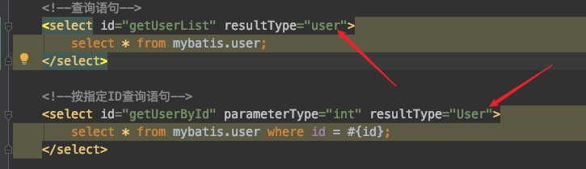

### 4.5 设置（settings）

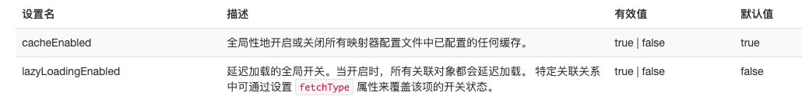

### 4.6 其他

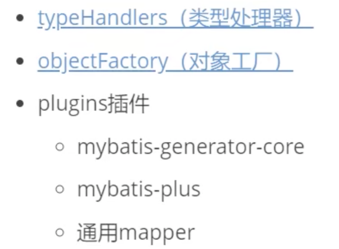

### 4.7 Mapper

MapperRegistry：注册绑定我们的Mapper文件

方式一：

```xml
<mappers>
	<mapper resource="com/komorebi/dao/UserMapper.xml"/>
</mappers>
```

方式二：使用class文件绑定注册

```xml
<!-- 使用映射器接口实现类的完全限定类名 -->
<mappers>
    <mapper class="org.mybatis.builder.AuthorMapper"/>
    <mapper class="org.mybatis.builder.BlogMapper"/>
    <mapper class="org.mybatis.builder.PostMapper"/>
</mappers>
```

* 注意：接口和Mapper配置文件**必须同名**，必须在用一个包下

方式三：使用扫描包进行注入绑定

```xml
<!-- 将包内的映射器接口实现全部注册为映射器 -->
<mappers>
    <package name="org.mybatis.builder"/>
</mappers>
```

* 注意：接口和Mapper配置文件**必须同名**，必须在用一个包下

方式四：完全限定资源定位费（URL）

```xml
<mappers>
 <mapper url="file:///var/mappers/AuthorMapper.xml"/>
</mappers>
```

### 4.8 生命周期和作用域

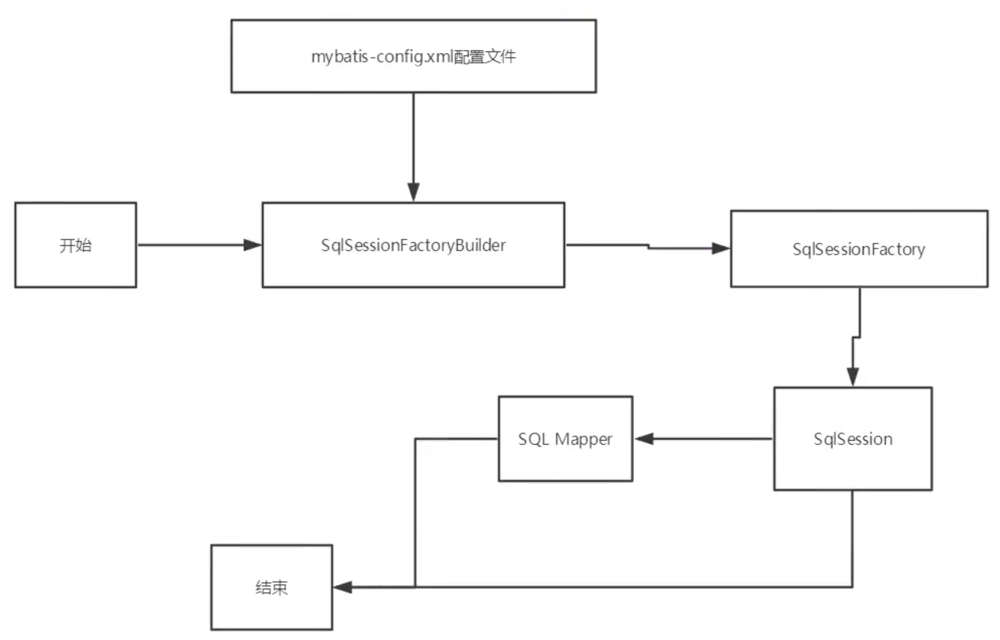

* 错误的使用会导致非常严重的**并发问题**

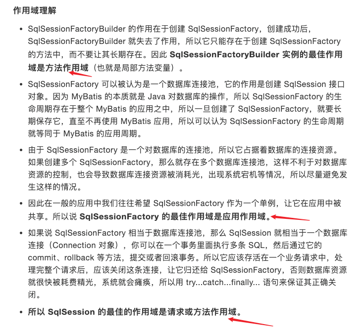

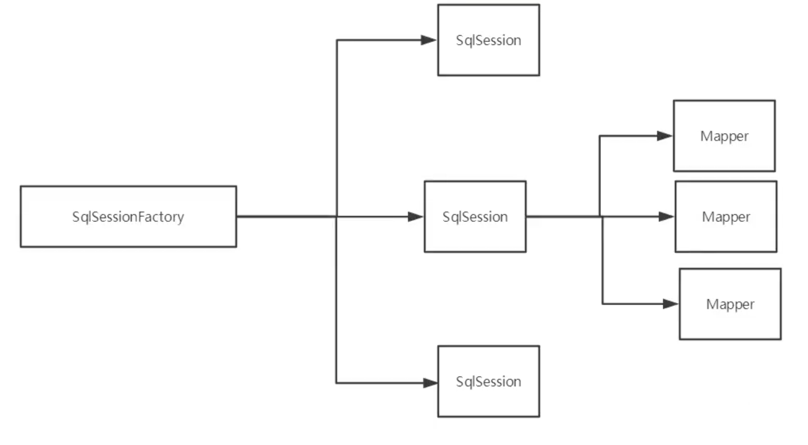

## 5 ResultMap

* 问题：实体类内的属性名和数据库字段名不一致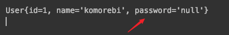

	* ```sql
		select  * from mybatis.user where id = #{id}
		// 类型处理器
		select id, name, pwd from mybatis.user where id = #{id}
		```

* 解决方案：

	* 1 起别名

		```sql
		select id, name, pwd as password from mybatis.user where id = #{id}
		```

	* 2 **ResultMap**

		* 结果集映射

			```xml
			<!--按指定ID查询语句-->
			<resultMap id="UserMap" type="User">
			    <!--column指数据库中的字段，property指实体类中的属性-->
			    <result column="id" property="id" />
			    <result column="name" property="name" />
			    <result column="pwd" property="password" />
			</resultMap>
			<select id="getUserById" parameterType="int" resultMap="UserMap">
			    select * from mybatis.user where id = #{id};
			</select>
			```

		* `resultMap` 元素是 MyBatis 中最重要最强大的元素

		* ResultMap 的**设计思想**：对简单的语句做到零配置，对于复杂一点的语句，只需要描述语句之间的关系就行了。


## 6 日志

### 6.1 日志工厂

```xml
<!--设置-->
<settings>
    <setting name="logImpl" value="STDOUT_LOGGING"/>
</settings>
```

如果一个数据库操作出现了异常，需要排错，日志就是最好的助手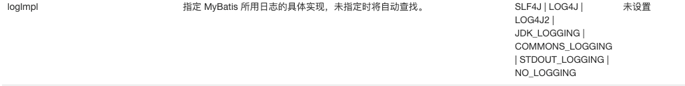

* SLF4J

* **LOG4J**（掌握）

* LOG4J2

* JDK_LOGGING

* COMMONS_LOGGING

* **STDOUT_LOGGING**（掌握）：标准日志输出

	```xml
	<!--设置-->
	<settings>
	    <!--标准的日志工厂实现-->
	    <setting name="logImpl" value="STDOUT_LOGGING"/>
	</settings>
	```

* NO_LOGGING

具体使用哪一个，在设置中设定

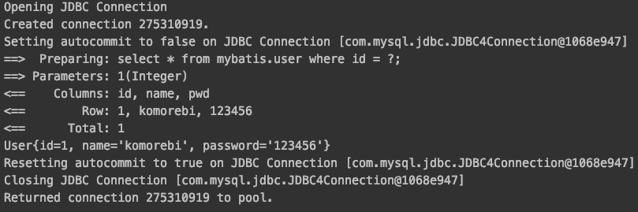

### 6.2 LOG4J

* Log4j是[Apache](https://baike.baidu.com/item/Apache/8512995)的一个开源项目，通过使用Log4j，我们可以控制日志信息输送的目的地是[控制台](https://baike.baidu.com/item/控制台/2438626)、文件、[GUI](https://baike.baidu.com/item/GUI)组件
* 可以控制每一条日志的输出格式
* 通过定义每一条日志信息的级别，我们能够更加细致地控制日志的生成过程
* 通过一个[配置文件](https://baike.baidu.com/item/配置文件/286550)来灵活地进行配置，而不需要修改应用的代码。

* 使用方法：

	* 1 导入LOG4J的包

		```xml
		<!-- https://mvnrepository.com/artifact/log4j/log4j -->
		<dependency>
		    <groupId>log4j</groupId>
		    <artifactId>log4j</artifactId>
		    <version>1.2.17</version>
		</dependency>
		```

	* 2 log4j.properties

		```properties
		#将等级为DEBUG的日志信息输出到console和file这两个目的地，console和file的定义在下面的代码
		log4j.rootLogger=DEBUG,console,file
		
		#控制台输出的相关设置
		log4j.appender.console = org.apache.log4j.ConsoleAppender
		log4j.appender.console.Target = System.out
		log4j.appender.console.Threshold=DEBUG
		log4j.appender.console.layout = org.apache.log4j.PatternLayout
		log4j.appender.console.layout.ConversionPattern=[%]-%m%n
		
		#文件输出的相关设置
		log4j.appender.file = org.apache.log4j.RollingFileAppender
		log4j.appender.file.File=./log/komorebi.log
		log4j.appender.file.MaxFileSize=10mb
		log4j.appender.file.Threshold=DEBUG
		log4j.appender.file.layout=org.apache.log4j.PatternLayout
		log4j.appender.file.layout.ConversionPattern=[%p][%d{yy-MM-dd}][%c]%m%n
		
		#日志输出级别
		log4j.logger.org.mybatis=DEBUG
		log4j.logger.java.sql=DEBUG
		log4j.logger.java.sql.Statement=DEBUG
		log4j.logger.java.sql.ResultSet=DEBUG
		log4j.logger.java.sql.PreparedStatement=DEBUG
		```

	* 3 配置log4j为日志的实现

		```xml
		<!--设置-->
		<settings>
		    <!--LOG4J实现-->
		    <setting name="logImpl" value="LOG4J"/>
		</settings>
		```

	* 4 Log4j的使用，直接测试运行

		* （1）导包

			```Java
			import org.apache.log4j.Logger;
			```

		* （2）日志对象，参数为当前类的class

		  ```java
		  //注意导包：org.apache.log4j.Logger
		  static Logger logger = Logger.getLogger(MyTest.class);
  
		  @Test
  public void selectUser() {
		     logger.info("info：进入selectUser方法");
		     logger.debug("debug：进入selectUser方法");
		     logger.error("error: 进入selectUser方法");
		     SqlSession session = MybatisUtils.getSession();
		     UserMapper mapper = session.getMapper(UserMapper.class);
		     List<User> users = mapper.selectUser();
		     for (User user: users){
		         System.out.println(user);
		    }
		     session.close();
		  }
		  ```
		
		* （3）日志级别：info debug error
		
		* （4）查看.log文件


## 7 分页

### 7.1 使用limit分页

```sql
SELECT * from user limit startIndex, pageSize;
SELECT * from user limit 3; #[0, n]
```

### 7.2 使用mybatis实现分页

* 1 接口

	```java
	// 分页查询
	List<User> getUserByLimit(Map<String, Integer> map);
	```

* 2 Mapper.xml

	```xml
	<!--分页实现查询，结果集映射-->
	<!--resultMap之前写过，属性名和数据库字段名不一致-->
	<select id="getUserByLimit" parameterType="map" resultMap="UserMap"> 
	    select * from mybatis.user limit #{startIndex}, #{pageSize};
	</select>
	```

* 3 测试

	```java
	@Test
	public void testGetUserByLimit(){
	    SqlSession sqlSession = MybatisUtils.getSqlSession();
	
	    UserMapper mapper = sqlSession.getMapper(UserMapper.class);
	
	    HashMap<String, Integer> map = new HashMap<String, Integer>();
	    map.put("startIndex", 1);
	    map.put("pageSize", 2);
	
	    List<User> userList = mapper.getUserByLimit(map);
	    for (User user : userList) {
	        System.out.println(user);
	    }
	
	    sqlSession.close();
	}
	```

### 7.3 使用RowBounds分页

* 1 接口

	```java
	// RowBounds分页
	List<User> getUserByRowBounds();
	```

* 2 Mapper.xml

	```xml
	<!--分页2-->
	<select id="getUserByRowBounds" resultMap="UserMap">
	    select * from mybatis.user;
	</select>
	```

* 3 测试

	```java
	@Test
	public void testGetUserByRowBounds(){
	    SqlSession sqlSession = MybatisUtils.getSqlSession();
	
	    // RowBounds实现
	    RowBounds rowBounds = new RowBounds(1, 2);
	
	    // 通过Java代码层面实现分页
	    List<User> userList = sqlSession.selectList("com.komorebi.dao.UserMapper.getUserByRowBounds", null, rowBounds);
	    for (User user : userList) {
	        System.out.println(user);
	    }
	
	    sqlSession.close();
	}
	```

### 7.4 分页插件

* PageHelper：https://pagehelper.github.io/docs/howtouse/


## 8 使用注解开发

### 8.1 面向接口编程

* **根本原因：解耦，可拓展，提高复用，分层开发中，上层不用管具体的实现，大家都遵守共同的标准，使得开发变得容易，规范性更好。**

### 8.2 使用注解开发

* 底层实现机制：**主要应用反射，动态代理**
* 注解在接口上实现

```java
public interface UserMapper {
    @Select("select * from User")
    List<User> getUsers();
}
```

**Mybatis详细流程**：


### 8.3 注解CRUD

* 可以在工具类创建的时候实现自动提交事务

	* 1 MybatisUtils工具类中添加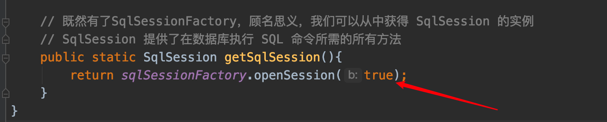

	* 2 接口

		```java
		@Insert("insert into user(id, name, pwd) values (#{id}, #{name}, #{password})")
		int addUser(User user);
		```

	* 3 测试

		```java
		@Test
		public void testAddUser(){
		    SqlSession sqlSession = MybatisUtils.getSqlSession();
		
		    UserMapper mapper = sqlSession.getMapper(UserMapper.class);
		    mapper.addUser(new User(6, "sun_six", "12345678"));
		
		    sqlSession.close();
		}
		```

* CRUD

	```java
	// 方法存在多个参数，所有的参数前面必须加上@Param注解
	@Select("select id, name, pwd as password from User where id = #{id}")
	User getUserByID(@Param("id") int id);
	
	@Insert("insert into user(id, name, pwd) values (#{id}, #{name}, #{password})")
	int addUser(User user);
	
	@Update("update user set name = #{name}, pwd = #{password} where id = #{id}")
	int updateUser(User user);
	
	@Delete("delete from user where id = #{id}")
	int deleteUser(@Param("id") int id);
	```

* **关于@Param注解**

	* **基本类型的参数需要加上**
	* 引用类型不需要加
	* 如果只有一个基本类型的话，可以忽略，但是建议加上
	* 在SQL中引用的就是@Param中设定的属性名


## 9 Lombok

1 优缺点

* 优点
	* 能通过注解的形式自动生成构造器、getter/setter、equals、hashcode、toString等方法
	* 让代码变得简洁，不用过多关注相应的方法
	* 属性做修改时，也简化了维护为这些属性所生成的getter/setter方法
* 缺点
	* 不支持多种参数构造器的重载
	* 虽然省去了手动创建getter/setter方法的麻烦，但大大降低了源码的可读性和完整性，降低了阅读源码的舒适感

2 使用步骤：

* 1 IDEA中安装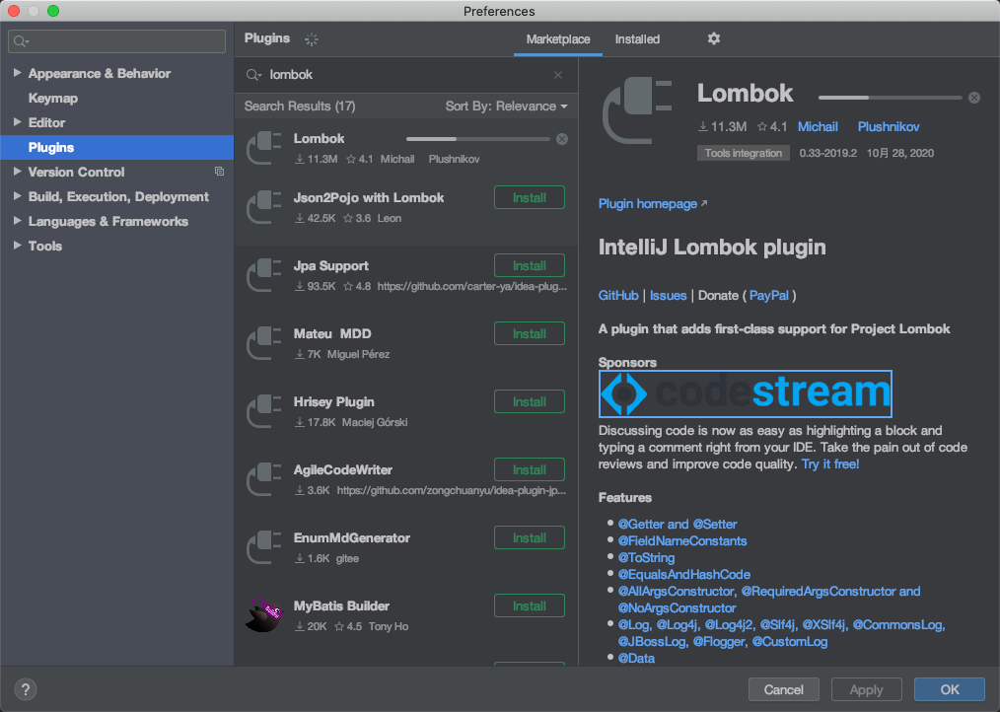

* 2 在项目中导入lombok的jar包

	```xml
	<!-- https://mvnrepository.com/artifact/org.projectlombok/lombok -->
	<dependency>
	    <groupId>org.projectlombok</groupId>
	    <artifactId>lombok</artifactId>
	    <version>1.18.12</version>
	    <scope>provided</scope>
	</dependency>
	```

* ```java
	@Data：无参  get  set  toString hashCode equals
	```

	```java
	@Data
	@NoArgsConstructor
	@AllArgsConstructor
	public class User {
	    private int id;
	    private String name;
	    private String password;
	}
	```

	

## 10 多对一处理

* 多个学生，对应一个老师；对于学生而言，**关联**（多个学生关联一个老师）；对于老师而言，**集合**（一个老师有多个学生）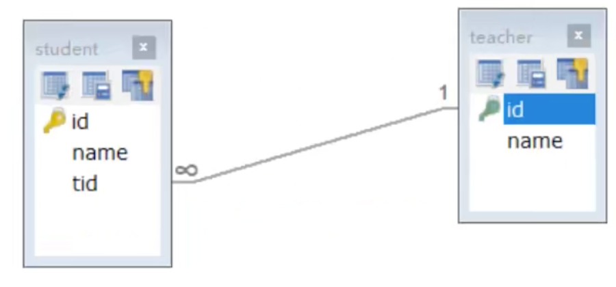

* ```sql
	CREATE TABLE `teacher` (
	  `id` INT(10) NOT NULL,
	  `name` VARCHAR(30) DEFAULT NULL,
	  PRIMARY KEY (`id`)
	) ENGINE=INNODB DEFAULT CHARACTER SET=utf8;
	
	INSERT INTO teacher(`id`, `name`) VALUES (1, '秦老师'); 
	
	CREATE TABLE `student` (
	  `id` INT(10) NOT NULL,
	  `name` VARCHAR(30) DEFAULT NULL,
	  `tid` INT(10) DEFAULT NULL,
	  PRIMARY KEY (`id`),
	  KEY `fktid` (`tid`),
	  CONSTRAINT `fktid` FOREIGN KEY (`tid`) REFERENCES `teacher` (`id`)
	) ENGINE=INNODB DEFAULT CHARACTER SET=utf8;
	
	INSERT INTO `student` (`id`, `name`, `tid`) VALUES ('1', '小明', '1'); 
	INSERT INTO `student` (`id`, `name`, `tid`) VALUES ('2', '小红', '1'); 
	INSERT INTO `student` (`id`, `name`, `tid`) VALUES ('3', '小张', '1'); 
	INSERT INTO `student` (`id`, `name`, `tid`) VALUES ('4', '小李', '1'); 
	INSERT INTO `student` (`id`, `name`, `tid`) VALUES ('5', '小王', '1');
	```

* 测试环境搭建

	* 1 导入lombok

	* 2 新建实体类 Teacher Student

		```java
		@Data
		@NoArgsConstructor
		@AllArgsConstructor
		public class Student {
		    private int id;
		    private String name;
		
		    // 学生需要关联一个老师
		    private Teacher teacher;
		}
		
		@Data
		@NoArgsConstructor
		@AllArgsConstructor
		public class Teacher {
		    private int id;
		    private String name;
		}
		
		```

	* 3 建立 Mapper接口

	* 4 建立Mapper.xml文件

	* 5 测试查询是否成功

### 10.1 按照查询嵌套处理(子查询)

```xml
<select id="getStudent" resultMap="studentTeacher">
    select * from mybatis.student;
</select>
<resultMap id="studentTeacher" type="Student">
    <!--复杂属性需要单独处理，对象：association，集合：collection-->
    <association property="teacher" column="tid" javaType="Teacher" select="getTeacher"/>
</resultMap>
<select id="getTeacher" resultType="Teacher">
    select * from mybatis.teacher where id = #{id};
</select>
```

### 10.2 按照结果嵌套处理(联表查询)

```xml
<!--按照结果嵌套处理-->
<select id="getStudent2" resultMap="studentTeacher2">
    select s.id sid, s.name sname, t.name tname from student s, teacher t where s.tid = t.id;
</select>
<resultMap id="studentTeacher2" type="Student">
    <result property="id" column="sid"/>
    <result property="name" column="sname"/>
    <association property="teacher" javaType="Teacher">
        <result property="name" column="tname"/>
    </association>
</resultMap>
```


## 11 一对多处理

* 新实体类

	```java
	@Data
	@NoArgsConstructor
	@AllArgsConstructor
	public class Student {
	    private int id;
	    private String name;
	    private int tid;
	}
	
	@Data
	@NoArgsConstructor
	@AllArgsConstructor
	public class Teacher {
	    private int id;
	    private String name;
	
	    // 一个老师对应多个学生
	    private List<Student> students;
	}
	```

### 11.1 按照结果嵌套处理（联表查询）

```xml
<!--按结果嵌套查询-->
<select id="getTeacher2" resultMap="TeacherStudent">
    select s.id sid, s.name sname, t.name tname, t.id tid
    from student s, teacher t where s.tid = t.id and t.id = #{id};
</select>
<resultMap id="TeacherStudent" type="Teacher">
    <result property="id" column="tid"/>
    <result property="name" column="tname"/>
    <collection property="students" ofType="Student">			<!--ofType-->
        <result property="id" column="sid"/>
        <result property="name" column="sname"/>
        <result property="tid" column="tid"/>
    </collection>
</resultMap>
```

### 11.2 按照查询嵌套处理(子查询)

```xml
<!--按查询嵌套处理-->
<select id="getTeacher3" resultMap="TeacherStudent2">
    select * from mybatis.teacher where id = #{id};
</select>
<resultMap id="TeacherStudent2" type="Teacher">
    <result property="id" column="id"/>
    <result property="name" column="name"/>
    <collection property="students" column="id" javaType="ArrayList" ofType="Student" select="getStudenByTeacherID"/>
</resultMap>
<select id="getStudenByTeacherID" resultType="Student">
    select * from mybatis.student where tid = #{id};
</select>
```

### 11.3 小结

* 关联：多对一
* 集合：一对多
* javaType   &    ofType
	* javaType用来指定实体类中属性的类型
	* ofType用来指定映射到list或者集合中的pojo类型，泛型中的约束类型
* 注意点
	* 保证SQL的可读性，尽量保证通俗易懂
	* 注意一对多和多对一中，属性名和字段的问题
	* 如果问题不好排查错误，可以使用日志，建议使用Log4j
* 面试
	* MySQL引擎
	* InnoDB底层原理
	* 索引
	* 索引优化


## 12 动态SQL

* 解释：**指根据不同的条件生成不同的SQL语句**

### 12.1 搭建环境

```sql
CREATE TABLE `blog`(
	`id` VARCHAR(50) NOT NULL COMMENT '博客ID',
	`title` VARCHAR(100) NOT NULL COMMENT '博客标题',
	`author` VARCHAR(30) NOT NULL COMMENT '博客作者',
	`create_time` DATETIME DEFAULT NULL COMMENT '创建时间',
	`views` INT(30) NOT NULL COMMENT '浏览量'
) ENGINE=INNODB DEFAULT CHARACTER SET=utf8
```

创建一个基础工程

* 1 导包

* 2 编写配置文件(新增一个IDutils文件用来生成随机ID)

	```java
	public static String getId(){
	    return UUID.randomUUID().toString().replace("-", "");
	}
	```

* 3 编写实体类

	```java
	@Data
	@NoArgsConstructor
	@AllArgsConstructor
	public class Blog {
	    private String id;
	    private String title;
	    private String author;
	    private Date createTime;
	    private int views;
	}
	```

* 4 编写实体类对应Mapper接口和Mapper.xml文件

	```java
	// 插入数据
	int addBlog(Blog blog);
	```

	```xml
	<insert id="addBlog" parameterType="Blog">
	    insert into mybatis.blog(id, title, author, create_time, views)
	    values (#{id}, #{title}, #{author}, #{createTime}, #{views})
	</insert>
	```

### 12.2 if

* **xml**

```xml
<!--选择查询博客 if -->
<select id="queryBlogIF" parameterType="map" resultType="Blog">
    select * from mybatis.blog
    <where>
        <if test="title != null">
            and title = #{title}
        </if>
        <if test="author != null">
            and author = #{author}
        </if>
    </where>
</select>
```

* **test**

```java
@Test
public void testQueryBlogIF(){
    SqlSession sqlSession = MybatisUtils.getSqlSession();

    BlogMapper mapper = sqlSession.getMapper(BlogMapper.class);

    HashMap map = new HashMap();
    map.put("title", "Mybatis");
    map.put("author", "狂神说");
    List<Blog> blogs = mapper.queryBlogIF(map);
    for (Blog blog : blogs) {
        System.out.println(blog);
    }

    sqlSession.close();
}
```

### 12.3 choose (when, otherwise)

```xml
<!--选择查询博客 choose -->
<select id="queryBlogChoose" parameterType="map" resultType="Blog">
    select * from mybatis.blog
    <where>
        <choose>
            <when test="title != null">
                title = #{title}
            </when>
            <when test="author != null">
                and author = #{author}
            </when>
            <otherwise>
                and views = #{views}
            </otherwise>
        </choose>
    </where>
</select>
```

### 12.4 trim (where, set)

* 如果匹配的只是第二个条件，需要用where标签
* *where* 元素只会在子元素返回任何内容的情况下才**插入 “WHERE” 子句**。而且，若子句的开头为 “AND” 或 “OR”，*where* 元素也会将它们去除。

```xml
<!--选择查询博客 if -->
<select id="queryBlogIF" parameterType="map" resultType="Blog">
    select * from mybatis.blog
    <where>
        <if test="title != null">
            and title = #{title}
        </if>
        <if test="author != null">
            and author = #{author}
        </if>
    </where>
</select>
```

* *set* 元素会动态地在**行首插入 SET 关键字**，并会**删掉额外的逗号**（这些逗号是在使用条件语句给列赋值时引入的）。

```xml
<!--更新博客-->
<update id="updateBlog" parameterType="map">
    update mybatis.blog
    <set>
        <if test="title != null">
            title = #{title},
        </if>
        <if test="author != null">
            author = #{author}
        </if>
    </set>
    where id = #{id}
</update>
```

* trim

```xml
<trim prefix="WHERE" prefixOverrides="AND |OR ">
  ...
</trim>

<trim prefix="SET" suffixOverrides=",">
  ...
</trim>
```

* **所谓的动态SQL，本质还是SQL语句，只是我们可以在SQL层面去执行一些逻辑代码**

### 12.5 SQL片段

* 有的时候，会将SQL中的公用片段抽出来
* 注意：
	* 最好基于单表来定义SQL片段，最好就是if判断
	* 不要存在where标签

```xml
<!--SQL片段，抽取公共部分-->
<sql id="if-title-author">
    <if test="title != null">
        title = #{title},
    </if>
    <if test="author != null">
        author = #{author}
    </if>
</sql>
<!--选择查询博客 if -->
<select id="queryBlogIF" parameterType="map" resultType="Blog">
    select * from mybatis.blog
    <where>
        <include refid="if-title-author"></include>
    </where>
</select>
```

### 12.5 foreach

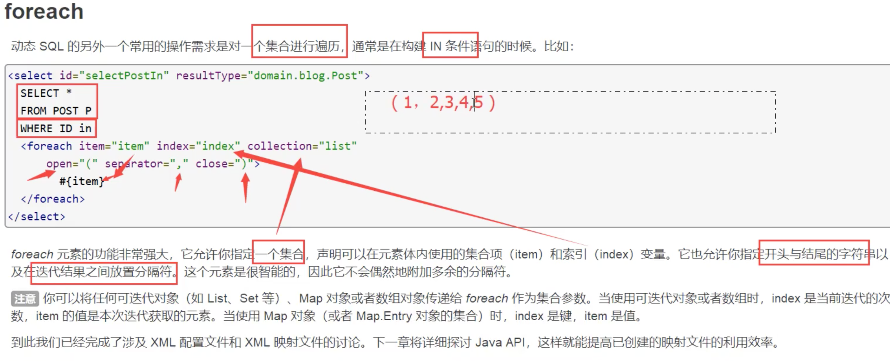

* **Xml**

```xml
<!--查询指定ID列表的博客-->
<select id="queryBlogForEach" parameterType="map" resultType="Blog">
    select * from mybatis.blog
    <where>
        <foreach collection="ids" item="id" open="(" separator="or" close=")">
            id = #{id}
        </foreach>
    </where>
</select>
```

* test

```java
@Test
public void testQueryBlogForEach(){
    SqlSession sqlSession = MybatisUtils.getSqlSession();

    BlogMapper mapper = sqlSession.getMapper(BlogMapper.class);
    HashMap map = new HashMap();
    ArrayList ids = new ArrayList();
    ids.add("14dca7f2846e4ec6909a3abe8344ba0e");
    ids.add("4f558e3362fc410ab5910bbe20324492");
    map.put("ids", ids);
    List<Blog> blogs = mapper.queryBlogForEach(map);
    for (Blog blog : blogs) {
        System.out.println(blog);
    }

    sqlSession.close();
}

// ==>  Preparing: select * from mybatis.blog WHERE ( id = ? or id = ? ) 
```

* **总结：动态SQL就是在拼接SQL语句，只需要保证SQL的正确性，按照SQL的格式，去排列组合即可**


## 13 缓存

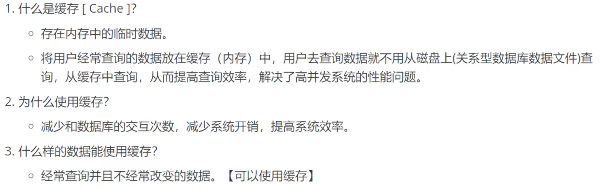

### 13.1 Mybatis缓存

* mybatis包含一个非常强大的查询缓存特性，可以非常方便的定制和配置缓存，缓存可以极大的提升查询效率
* mybatis系统中默认定义了两级缓存：**一级缓存**和**二级缓存**
	* 默认情况下，只有一级缓存开启（SqlSession级别的缓存，也称为本地缓存）
	* 二级缓存需要手动开启和配置，是基于namespace级别的缓存
	* 为了提高拓展性，Mybatis定义了缓存接口Cache，可以通过实现Cache接口来自定义二级缓存

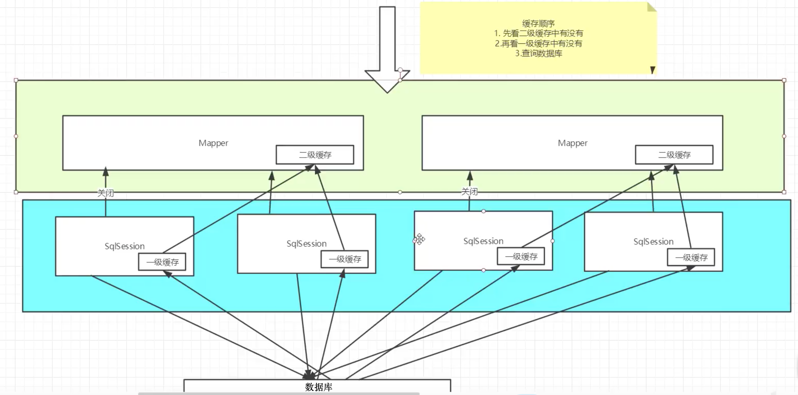

### 13.2 一级缓存

* 一级缓存也叫本地缓存：SqlSession
	* 与数据库同一次会话期间查询到的数据会放在本地缓存中
	* 以后如果需要获取相同的数据，直接从缓存中拿，不需要再去查询数据库
* 测试步骤
	* 1 开启日志
	* 2 测试在一个Session中查询两次相同记录
	* 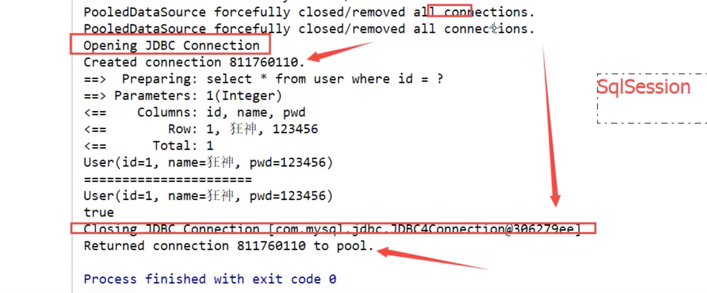
* **缓存失效的情况**
	* 1 增删改操作可能会改变原来的数据，所以必定会刷新缓存
	* 2 查询不同的东西
	* 3 查询不同的Mapper.xml
	* 4 手动清除缓存    sqlSession.clearCache()
* **小结：一级缓存默认开启，只在一次sqlSession中有效，也就是拿到连接到关闭连接这个区间段**

### 13.3 二级缓存

* 二级缓存也叫全局缓存，一级缓存作用域太低了，所以诞生了二级缓存
* 基于namespacea级别的缓存，一个名称空间，对应一个二级缓存
* 工作机制
	* 一个会话查询一条数据，这个数据就会被放在当前会话的一级缓存中
	* 如果当前会话关闭了，这个会话对应的一级缓存就没了；但我们想要的是，会话关闭了，一级缓存中的数据被保存到二级缓存中
	* 新的会话查询信息，就可以从二级缓存中获取内容
	* 不同的mapper查出的数据会放在自己对应的缓存(map)中

**步骤**：

* 1 开启全局缓存

	```xml
	<!--设置-->
	<settings>
	    <!--标准的日志工厂实现-->
	    <setting name="logImpl" value="STDOUT_LOGGING"/>
	    <!--显式开启全局缓存-->
	    <setting name="cacheEnabled" value="true"/>
	</settings>
	```

* 2 在要使用二级缓存的Mapper中开启

	```xml
	<!--在当前mapper中使用二级缓存-->
	<cache
	   eviction="FIFO"
	   flushInterval="60000"
	   size="512"
	   readOnly="true"/>
	```

* 3 测试

	* 需要将实体类序列化

		```java
		Caused by: java.io.NotSerializableException: com.komorebi.pojo.User
		```

* 小结：

	* 只要开启了二级缓存，在同一个Mapper下有效
	* 所有的数据都会先放在一级缓存中
	* 只有当会话提交，或者关闭的时候，才会提交到二级缓存

### 13.4 ehcache

Ehcache是一种广泛使用的开源Java分布式缓存。主要面向通用缓存,Java EE和轻量级容器

* 1 在程序中使用，导包！

	```xml
	<!-- https://mvnrepository.com/artifact/org.mybatis.caches/mybatis-ehcache -->
	<dependency>
	    <groupId>org.mybatis.caches</groupId>
	    <artifactId>mybatis-ehcache</artifactId>
	    <version>1.1.0</version>
	</dependency>
	```

* 2 在Mapper中开启

	```xml
	<cache type="org.mybatis.caches.ehcache.EhcacheCache"/>
	```

* 3 ehcache.xml

	```xml
	<?xml version="1.0" encoding="UTF-8"?>
	<ehcache xmlns:xsi="http://www.w3.org/2001/XMLSchema-instance"
	         xsi:noNamespaceSchemaLocation="http://ehcache.org/ehcache.xsd"
	         updateCheck="false">
	
	    <diskStore path="./tmpdir/Tmp_EhCache"/>
	
	    <defaultCache
	            eternal="false"
	            maxElementsInMemory="10000"
	            overflowToDisk="false"
	            diskPersistent="false"
	            timeToIdleSeconds="1800"
	            timeToLiveSeconds="259200"
	            memoryStoreEvictionPolicy="LRU"/>
	
	    <cache
	            name="cloud_user"
	            eternal="false"
	            maxElementsInMemory="5000"
	            overflowToDisk="false"
	            diskPersistent="false"
	            timeToIdleSeconds="1800"
	            timeToLiveSeconds="1800"
	            memoryStoreEvictionPolicy="LRU"/>
	</ehcache>
	```


### 13.5 一级缓存失效的四种情况

一级缓存是SqlSession级别的缓存，是一直开启的，我们关闭不了它；

一级缓存失效情况：没有使用到当前的一级缓存，效果就是，还需要再向数据库中发起一次查询请求！

1. sqlSession不同
	结论：**每个sqlSession中的缓存相互独立**
2. sqlSession相同，查询条件不同
	结论：**当前缓存中，不存在这个数据**
3. sqlSession相同，两次查询之间执行了增删改操作！
	结论：**因为增删改操作可能会对当前数据产生影响**
4. sqlSession相同，手动清除一级缓存