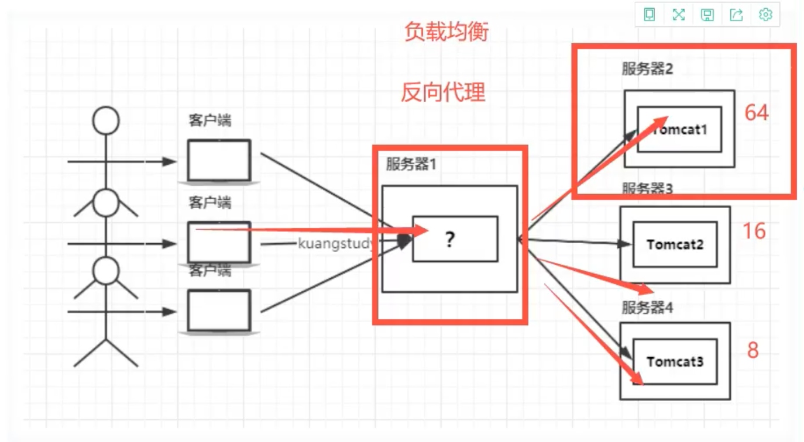

# Nginx

> Nginx是一个高性能的HTTP和反向代理Web服务器，同时也提供了IMAP/POP3/SMTP服务。

**特点**

* 占有内存少
* 并发能力强
* 反向代理：正向代理是代理的客户端（VPN），反向代理是代理的服务端
* 负载均衡
* IPHash：对客户端请求的IP进行Hash操作，然后根据Hash结果将同一个客户端IP的请求分发给同一台服务器进行处理，可以解决Session不共享的问题，一般还是使用Redis进行Session共享
* 动静分离：在软开中，有些请求是需要后台处理的，有些事不需要的（css、html），这些不需要处理的文件是静态文件。让动态网页里的动态页面根据一定规则把不变的资源和经常变的资源区分开来，动静资源做好了拆分以后，尽可以根据静态资源的特点将其做缓存处理，提高资源响应的速度

