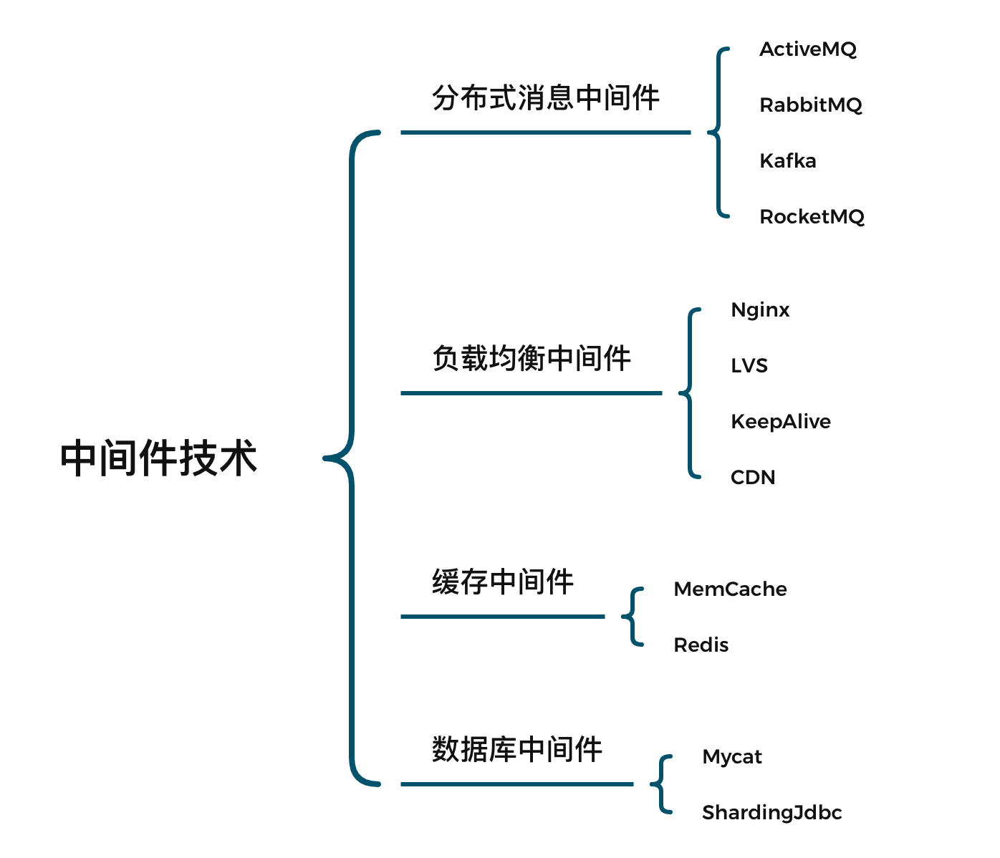
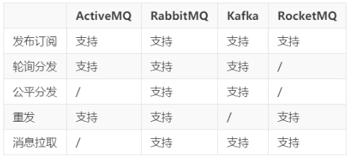
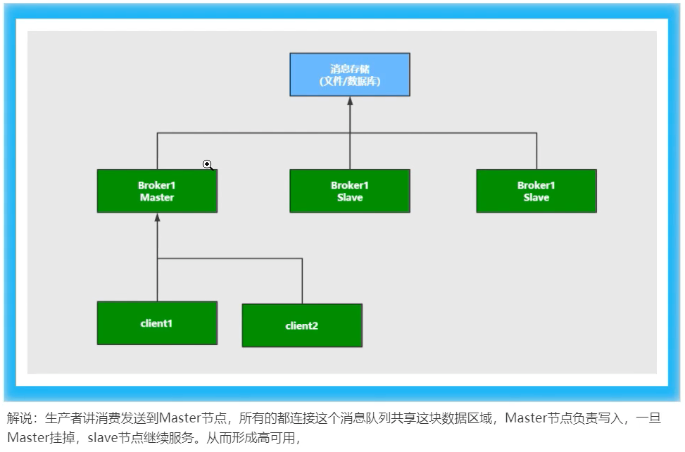
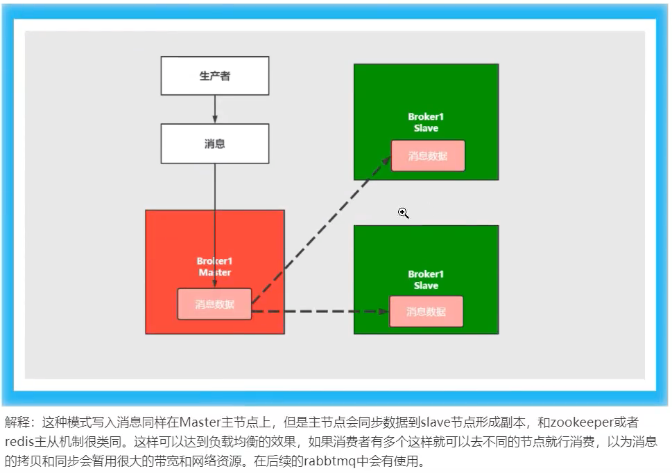
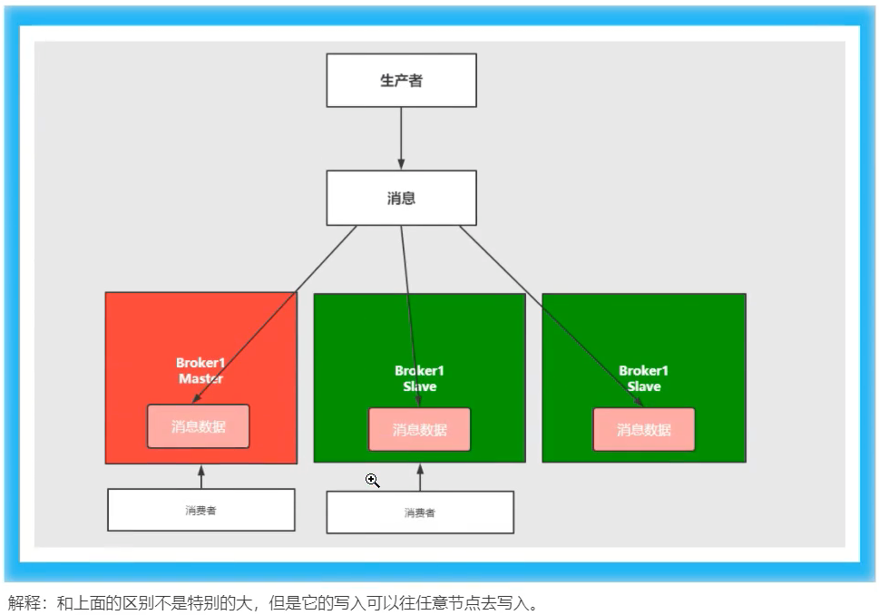
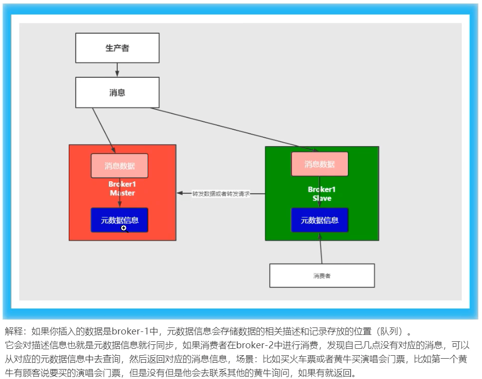

# RabbitMQ

> 中间件是处于操作系统和应用程序之间的软件，也可以说属于操作系统中的一部分。在使用时，往往是一组中间件集成在一起，构成一个平台（包括开发平台和运行平台），但在这组中间件中必须有一个通信中间件，即 中间件=平台+通信，这个定义也限定了只有用于分布式系统中才能称为中间件，还可以把它与支撑软件和实用软件区分开来。

**为什么要用中间件**

​		具体的说，中间件屏蔽了底层操作系统的复杂性，使程序开发人员面对一个简单而统一的开发环境，减少程序设计的复杂性，将注意力集中在自己的业务上，不必再为程序在不同系统软件上的移植而重复工作，从而大大减少了技术上的负担。中间件带给应用系统的，不只是开发的简便、开发周期的缩短，也减少了系统的维护、运行和管理的工作量，还减少了计算机总体费用的投入。



**消息中间件应用场景**

1. 跨系统数据传输
2. 高并发流量削峰
3. 数据的分发和异步处理
4. 大数据分析与传递
5. 分布式事务




## 一、消息队列协议

### 1.1 网络协议的三要素

1. 语法。语法是用户数据与控制信息的结构与格式，以及数据出现的顺序
2. 语义。语义是解释控制信息每个部分的意义。它规定了需要发出何种控制信息，以及完成的动作与做出什么样的响应。
3. 时序。时序是对事件发生顺序的详细说明。

消息中间件采用的不是HTTP协议，而常见的消息中间件协议有：OpenWire、AMQP、MQTT、Kafka、OpenMessage协议

> 为什么消息中间件不直接使用HTTP协议？

1. 因为HTTP请求报文头和响应报文头是比较复杂的，包含了cookie、数据的加密解密、状态码、响应码等附加的功能，但是对于一个消息而言，我们并不需要这么复杂，也没有这个必要性，它其实就是负责数据传递、存储、分发就行，一定要追求的是高性能，所以需要尽量简洁、快速。
2. 大部分情况下HTTP都是短链接（短链接不适合存储，没有持久化功能），在实际的交互过程中，一个请求到响应很有可能会中断，中断以后就不会进行持久化，会造成请求的丢失。这样就不利于消息中间件的业务场景，因为消息中间件可能是一个长期的获取消息的过程，出现问题和故障要对数据或消息进行持久化等，目的是为了保证消息和数据的高可靠和稳健的运行。

### 1.2 AMQP协议

> AMQP（Advanced Message Queuing Protocol）是高级消息队列协议，是一个提供统一消息服务的应用层标准高级消息队列协议，是应用层协议的一个开放标准，为面向消息的中间件设计。基于此协议的客户端与消息中间件可传递消息，并不受客户端/中间件不同产品、不同的开发语言等条件的限制。Erlang中的实现有RabbitMQ等。

**特性**

1. 分布式事务支持
2. 消息的持久化支持
3. 高性能和高可能的消息处理优势。

### 1.3 MQTT协议

> MQTT（Message Queuing Telemetry Transport）消息队列是IBM开放的一个即时通讯协议，物联网系统架构中的重要组成部分。

**特点**

1. 轻量
2. 结构简单
3. 传输快，不支持事务
4. 没有持久化设计

**应用场景**

1. 适用于计算能力有限
2. 低带宽
3. 网络不稳定的场景

### 1.4 OpenMessage协议

> 由阿里、雅虎和滴滴等共同参与创建的分布式消息中间件、流处理等领域的应用开发标准

**特点**

1. 结构简单
2. 解析速度快
3. 支持事务和持久化设计

### 1.5 Kafka协议

> Kafka协议是基于TCP/IP的二进制协议，消息内部通过长度来分割，由一些基本数据类型组成

**特点**

1. 结构简单
2. 解析速度快
3. 无事务支持
4. 有持久化设计


## 二、消息队列高可用和高可靠

### 2.1 高可用机制

> 高可用：指产品在规定的条件和规定的时间内处于可执行规定功能状态的能力。
>
> 当业务量增加时，请求也过大，一台消息中间件服务器会触及硬件极限，一台消息服务器已经无法满足业务的需求，所以消息中间件必须支持集群部署，以达到高可用的目的。

**集群模式-1  Master-salve主从共享数据的部署方式**

缺点：数据只有一份



**集群模式-2 Master-salve主从同步部署方式**



缺点：复制过程会消耗性能

**集群模式-3 多主集群同步部署方式**



**集群模式-4 多主基于转发部署方式**



**集群模式-5 Master-salve与Breoker-cluster组合的方案**


**结论**

1. 消息共享
2. 消息同步
3. 元数据共享

### 2.2 高可靠机制

> 指系统可以无故障的持续运行

如何保证中间件消息的可靠性？可以从两个方面考虑

1. 消息的传输：通过协议来保证系统间数据解析的正确性
2. 消息的存储可靠：通过持久化来保证消息的可靠性


## 三、RabbitMQ安装

> RabbitMQ是一个开源的遵循AMQP协议实现的、基于Erlang语言编写，支持多种客户端。用于在分布式系统中存储消息、转发消息，具有高可用、高可扩行、易用性等特征。

### 3.1 安装

```shell
sudo apt-get install erlang-nox
```

更新源

```shell
sudo apt-get update
```

安装

```shell
sudo apt-get install rabbitmq-server
```

启动、停止、状态rabbitMq命令

```shell
systemctl start rabbitmq-server
systemctl stop rabbitmq-server
systemctl status rabbitmq-server
systemctl enable rabbitmq-server
```

### 3.2 界面

默认没有安装web的客户端插件，需要安装

```shell
rabbitmq-plugins enable rabbitmq_management
```

安装完成，重启RabbitMQ

```shell
systemctl restart rabbitmq-server
```

在浏览器访问`http://47.110.157.73:15672/`

### 3.3 新增用户

```shell
rabbitmqctl add_user komorebi 123456								# 新增
rabbitmqctl set_user_tags komorebi administrator					# 赋予权限
rabbitmqctl change_password komorebi 654321
```

**用户级别**

1. `administrator`：可以登录控制台、查看所有信息、可以对RabbitMQ进行管理
2. `monitoring`：监控者，登录控制台、查看所有信息
3. `policymaker`：策略制定者，登录控制台、指定策略
4. `management`：普通管理员，登录控制台

```
rabbitmqctl.bat set_permissions -p / admin ".*" ".*" ".*"
```

### 3.4 Docker安装RabbitMQ

```dockerfile
docker run -di --name myrabbit -e RABBITMQ_DEFAULT_USER=komorebi -e RABBITMQ_DEFAULT_PASS=123456 -p 15672:15672 -p 5672:5672 -p 25672:25672 -p 61613:61613 -p 1883:1883 rabbitmq:management
```

```dockerfile
docker images
docker ps -a
docker start IDXXX
```

