[TOC]

# SpringCloud

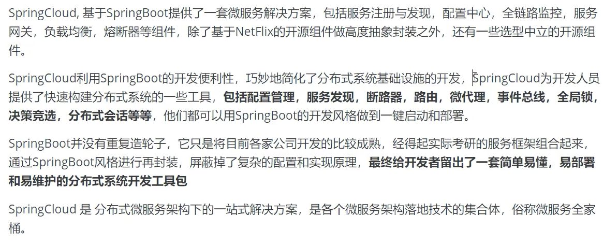

微服务架构4个问题：

* 服务很多，客户端该怎么访问
* 这么多服务，服务之间如何通信
* 这么多服务，如何治理
* 服务挂了怎么办

解决方案：

* Spring Cloud Netflix（一站式解决方案）
	* API网关，zuul组件
	* Feign ---HttpClinet：Http通信方式，同步，阻塞
	* 服务注册发现：Eureka
	* 熔断机制：Hystrix
* Apache Dubbo Zookeeper（半自动，需要整合别人的）
	* API：没有，找第三方组件，或者自己实现
	* Dubbo：RPC通信框架
	* Zookeeper：
	* 没有：借助第三方
* Spring Cloud Alibaba（一站式解决方案）

## 1 常见问题

### 1.1 什么是微服务

* **微服务**：强调的是服务的大小，关注的是某一个点，是具体解决某一个问题并提供落地对应服务的一个服务应用，狭义的看，可以看作是IDEA里面的一个个module
* **微服务架构**：微服务架构是一种架构模式，它提倡将单一应用程序划分成一组小的服务，服务之间互相协调，互相配合，为用户提供最终价值。每个服务运行在其独立的进程中，服务于服务间采用轻量级的通信机制相互协作，每个服务都围绕着具体的业务进行构建，并且能够被独立的部署到生产环境中，另外，应尽量避免统一的，集中式的服务管理机制，对具体的一个服务而言，应根据业务上下文，选择合适的语言、工具对其进行构建
* **微服务化核心**：就是将传统的一站式应用，根据业务拆分成一个一个的服务，彻底的去耦合，每一个微服务提供单个业务功能的服务，一个服务做一件事情，从技术角度看就是一种小而独立的处理过程，类似进程的概念，能够自行单独启动或销毁，拥有自己独立的数据库。

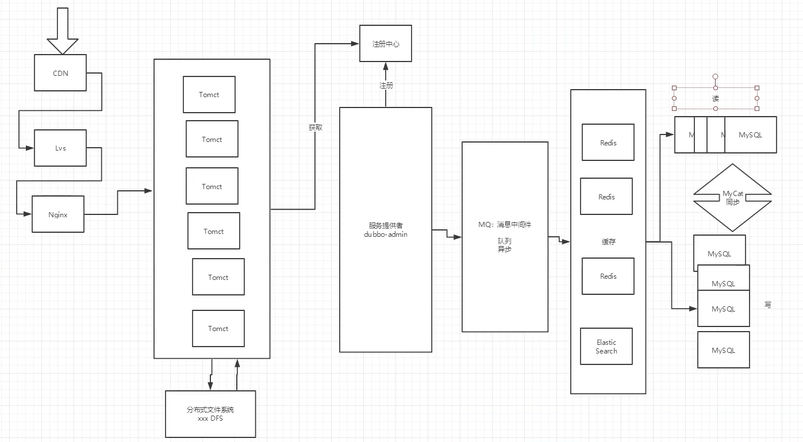

### 1.2 微服务之间是如何独立通讯的

### 1.3 SpringCloud和Dubbo有哪些区别

|              |     Dubbo     |           Spring            |
| :----------: | :-----------: | :-------------------------: |
| 服务注册中心 |   ZooKeeper   | SpringCloud Netfilx Eureka  |
| 服务调用方式 |      RPC      |          REST API           |
|   服务监控   | Dubbo-monitor |      SpringBoot Admin       |
|    断路器    |    不完善     | SpringCloud Netfilx Hystrix |
|   服务网关   |      无       |  SpringCloud Netfilx Zuul   |
|  分布式配置  |      无       |     SpringCloud Config      |
|   服务跟踪   |      无       |     SpringCloud Sleuth      |
|   消息总线   |      无       |       SpringCloud Bus       |
|    数据流    |      无       |     SpringCloud Stream      |
|   批量任务   |      无       |      SpringCloud Task       |

**最大区别：SpringCloud抛弃了Dubbo的RPC通信，采用的是基于HTTP的REST方式**

严格来说，这两种方式各有优劣。从一定程度上来说，后者牺牲了服务调用的性能，但也避免了上面提到的原生RPC带来的问题。而且REST相比RPC更加灵活，服务提供方和调用方的依赖只依靠一纸契约，不存在代码级别的强依赖，这在强调快速演化的微服务环境下，显得更加合适


### 1.4 SpringBoot和SpringCloud，谈谈对他们的理解

* SpringBoot专注于快速方便的开发单个个体微服务
* SpringCloud是关注全局的微服务协调整治治理框架，它将SpringBoot开发的一个个单体微服务整合并管理起来，为各个微服务之间提供：配置管理、服务发现、断路器、路由、微代理、事件总线、全局锁、决策竞选、分布式会话等集成服务
* SpringBoot可以离开SpringCloud独立使用，开发项目，但是SpringCloud离不开SpringBoot，属于依赖关系
* **SpringBoot专注于快速、方便的开发单个个体微服务，SpringCloud关注全局的服务治理框架** 

### 1.5 什么是服务熔断，什么是服务降级

### 1.6 微服务的优缺点分别是什么

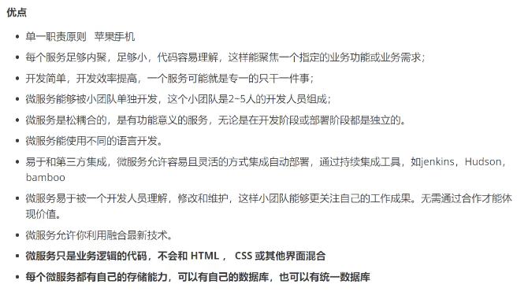


### 1.7 你知道的微服务技术栈有哪些

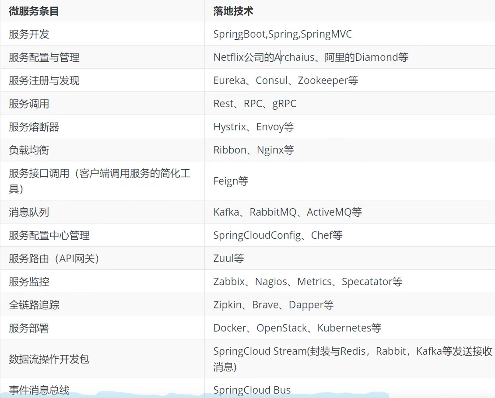

### 1.8 Eureka和Zookeeper都可以提供服务注册与发现的功能，请说说两者的区别

**ZooKeeper保证CP，Eureka保证AP**


## 2 环境搭建

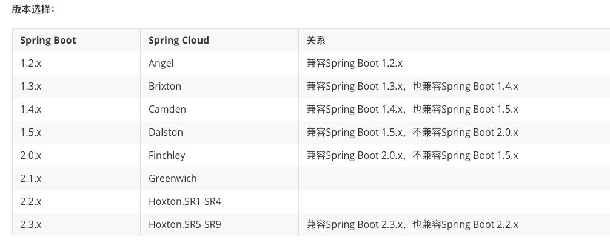

### 2.1 API

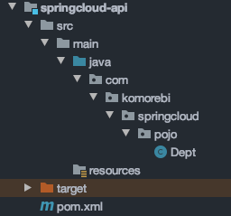

### 2.2 Provider

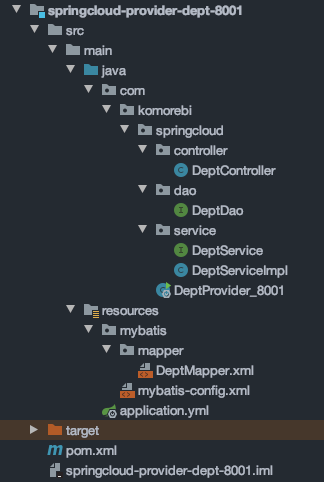

* Provider中写常规的dao-service-controller

* application.yml

	```yml
	server:
	  port: 8001
	
	mybatis:
	  type-aliases-package: com.komorebi.springcloud.pojo
	  config-location: classpath:mybatis/mybatis-config.xml
	  mapper-locations: classpath:mybatis/mapper/*.xml
	
	spring:
	  application:
	    name: springcloud-provider-dept
	  datasource:
	    type: com.alibaba.druid.pool.DruidDataSource
	    driver-class-name: com.mysql.jdbc.Driver
	    url: jdbc:mysql://localhost:3306/db01?useUnicode=true&charcterEncoding=utf-8&useSSL=true
	    username: root
	    password: 123456
	
	```

* dao同时配置mybatis-config.xml和正常的Mapper

### 2.3 Consumer

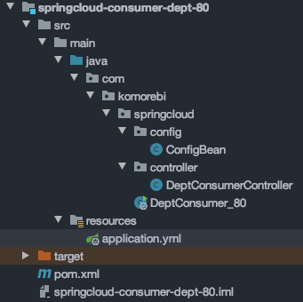

* 类似于远程调用，先配置端口80

* 配置RestTemplate

	```java
	@Configuration
	public class ConfigBean {
	    @Bean
	    public RestTemplate getRestTemplate() {
	        return new RestTemplate();
	    }
	}
	```

* 写Controller

	```java
	@RestController
	public class DeptConsumerController {
	    // 对消费者而言，不应该有service
	    // RestTemplate   供我们自己调用就可以了
	    // (url, 实体：Map, Class<T> responseType)
	    @Autowired
	    private RestTemplate restTemplate;
	
	    private static final String REST_URL_PREFIX = "http://localhost:8001/";
	
	    @RequestMapping("/consumer/dept/add")
	    public boolean add(Dept dept) {
	        return restTemplate.postForObject(REST_URL_PREFIX + "/dept/add", dept, Boolean.class);
	    }
	
	    @RequestMapping("/consumer/dept/get/{id}")
	    public Dept get(@PathVariable("id") Long id) {
	        return restTemplate.getForObject(REST_URL_PREFIX + "/dept/get/" + id, Dept.class);
	    }
	
	    @RequestMapping("/consumer/dept/list")
	    public List<Dept> list() {
	        return restTemplate.getForObject(REST_URL_PREFIX + "/dept/list", List.class);
	    }
	}
	```

	

## 3 Eureka -- 服务注册中心

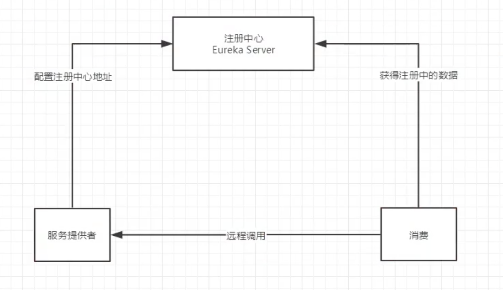

* 遵循AP原则，发音（优瑞卡）
* 是一个基于REST的服务，用于定位服务，以实现云端中间层服务发现和故障转移，服务注册和发现对于微服务来说是非常重要的，有了服务发现与注册，只需要使用服务的标识符，就可以访问到服务，而不需要修改服务调用的配置文件了，功能类似于Dubbo的注册中心，比如zookeeper

### 3.1 Eureka原理

* 基本架构：
	* SpringCloud封装了Netfilx公司开发的Eureka模块来实现服务注册和发现
	* Eureka使用了C-S的架构设计，Eureka作为服务注册功能的服务器，是服务注册中心
	* 而系统中的其他微服务，使用Euraka的客户端连接到EurekaServer并维持心跳连接。这样系统的维护人员就可以通过EurekaServer来监控系统中各个微服务是否正常运行，并执行相关逻辑
* 和Dubbo架构对比
	* 
	* 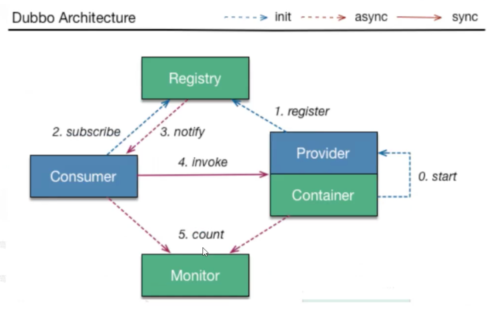
	* Eureka包含两个组件：**EurekaServer**和**EurekaClient**
		* EurekaServer提供服务注册服务，各个节点启动后，会在EurekaServer中进行注册，这样EurekaServer中的服务注册表中将会存储所有可用服务节点的信息，服务节点的信息可以在界面中直观的看到
		* EurekaClient是一个java客户端，用于简化EurekaServer的交互，客户端同时也具备一个内置的， 使用轮询负载算法的负载均衡器。在应用启动后，将会向EurekaServer发送心跳（默认周期为30秒）。如果EurekaServer在多个心跳周期内没有接收到某个节点的心跳，EurekaServer将会从服务注册表中把这个服务节点移除（默认周期为90秒）


### 3.2 Server配置

1. 导包

	```xml
	<!-- Eureka-Server -->
	<dependency>
	    <groupId>org.springframework.cloud</groupId>
	    <artifactId>spring-cloud-starter-eureka-server</artifactId>
	    <version>1.4.6.RELEASE</version>
	</dependency>
	<!--热部署-->
	<dependency>
	    <groupId>org.springframework.boot</groupId>
	    <artifactId>spring-boot-devtools</artifactId>
	</dependency>
	```

2. Server配置文件

	```yml
	server:
	  port: 7001
	eureka:
	  instance:
	    hostname: localhost             # Eureka服务端的实例名称
	  client:
	    register-with-eureka: false     # 表示是否向Eureka注册中心注册自己
	    fetch-registry: false           # 如果为false，则表示自己为注册中心
	    service-url:                    # 监控页面
	      defaultZone: http://${eureka.instance.hostname}:${server.port}/eureka/
	```

3. 主启动类加**@EnableEurekaServer**注解


### 3.3 Provider配置

1. 在8001的module中配置依赖

	```xml
	<!-- Eureka-Client -->
	<dependency>
	    <groupId>org.springframework.cloud</groupId>
	    <artifactId>spring-cloud-starter-eureka</artifactId>
	    <version>1.4.6.RELEASE</version>
	</dependency>
	<!--actuator完善监控信息-->
	<dependency>
	    <groupId>org.springframework.boot</groupId>
	    <artifactId>spring-boot-starter-actuator</artifactId>
	</dependency>
	```

2. Provider配置文件

	```yml
	# Eureka
	eureka:
	  client:
	    service-url:
	      defaultZone: http://localhost:7001/eureka/
	#  instance:    # 修改默认名字
	#    instance-id: springcloud-provider-dept8001
	# 配置Eureka链接的info信息
	info:
	  app.name: komorebi
	  company: komorebi.blog
	```

3. 主启动类加**@EnableEurekaClient**注解
	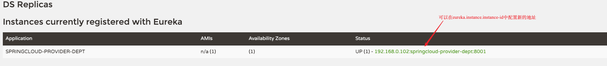

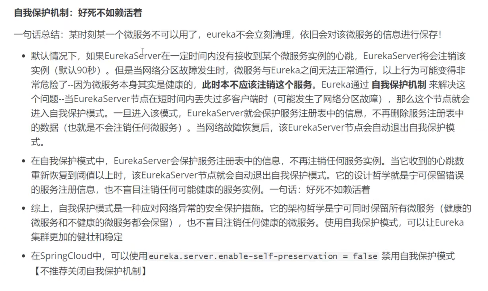

* 若想写discovery

	* 1 自动装配DiscoveryClient client，然后写一个方法

		```java
		// 注册进来的微服务，获取一些信息
		@GetMapping("/dept/discovery")
		public Object discovery(){
		    // 获取微服务列表的清单
		    List<String> services = client.getServices();
		    System.out.println("discovery --> " + services);
		
		    // 得到一个具体的微服务信息
		    List<ServiceInstance> instances = client.getInstances("SPRINGCLOUD-PROVIDER-DEPT");
		    for (ServiceInstance instance : instances) {
		        System.out.println(
		            instance.getHost() + "\t" +
		            instance.getPort() + "\t" +
		            instance.getUri() + "\t" +
		            instance.getServiceId()
		        );
		    }
		    return this.client;
		}
		```

	* 2 主启动类加上**@EnableDiscoveryClient**注解

### 3.4 搭建集群

1. 在写两个Server

2. 配置yml（最好改host域名）

	```yml
	server:
	  port: 7001
	eureka:
	  instance:
	    hostname: localhost             # Eureka服务端的实例名称
	  client:
	    register-with-eureka: false     # 表示是否向Eureka注册中心注册自己
	    fetch-registry: false           # 如果为false，则表示自己为注册中心
	    service-url:                    # 监控页面
	      # 单机
	#      defaultZone: http://${eureka.instance.hostname}:${server.port}/eureka/
	      # 串联
	      defaultZone: http://eureka7002.com:7002/eureka/,http://eureka7003.com:7003/eureka/
	```

3. Provider配置

	```yml
	# Eureka
	eureka:
	  client:
	    service-url:
	      defaultZone: http://eureka7001.com:7001/eureka/,http://eureka7002.com:7002/eureka/,http://eureka7003.com:7003/eureka/
	```

### 3.5 对比Zookeeper

* **CAP原则**
	*  RDBMS（Mysql  Oracle  sqlServer） -->  ACID
	* NoSQL （Redis  MongDB） --> CAP 
	* **ACID**：
		* A（Atomicity）：原子性
		* C（Consistency）：一致性
		* I（Isolation）：隔离性
		* D（Durability）：持久性
	* **CAP**：（三进二）
		* C（Consistency）：强一致性
		* A（Availability）：可用性
		* P（Partition tolerance）：分区容错性
*   一个分布式系统最多只能实现2个点，不能三者兼顾，**ZooKeeper保证CP，Eureka保证AP**
	* 
	* 


## 4 Ribbon -- 负载均衡

### 4.1 Ribbon原理

**是什么**

* SpringCloud Ribbon是基于Netflix Ribbon实现的一套**客户端负载均衡的工具**
* 简单地说，Ribbon主要功能是提供客户端的软件负载均衡算法，将Netflix的中间层服务连接在一起。Ribbon客户端组件提供一系列完整的配置项如：连接超时、重试等。简单地说，就是在配置文件中列出LoadBalancer（简称LB：负载均衡）后面的所有机器，Ribbon会自动帮助你基于某种规则（如简单轮询，随机连接等）去连接这些机器，也很容易使用Ribbon实现自定义的负载均衡算法

**做什么**

* LB，即负载均衡（Load Balance），在微服务或分布式集群中经常用的一种应用
* 负载均衡简单地说**就是将用户的请求平摊到多个服务上**，从而达到系统的HA（高可用）
* 常见的负载均衡软件有个Nginx, Lvs等
* Dubbo、SpringCloud中均给我们提供了负载均衡，**SpringCloud的负载均衡算法可以自定义**
* 负载均衡简单分类：
	* 集中式LB
		* 即在服务的消费方和提供方之间使用独立的LB设施，如Nginx：反向代理服务器，由该设施负责把访问请求通过某种策略转发至服务的提供方
	* 进程式LB
		* 将LB逻辑集成到消费方，消费方从服务注册中心获知有哪些地址可用，然后自己再从这些地址中选出一个合适的服务器
		* **Ribbon属于进程内LB**，它只是一个类库，继承与消费方进程，消费方通过它来获取服务提供方的地址

### 4.2 Consumer配置

1. 在80module中导入依赖

	```xml
	<!-- Ribbon -->
	<dependency>
	    <groupId>org.springframework.cloud</groupId>
	    <artifactId>spring-cloud-starter-ribbon</artifactId>
	    <version>1.4.6.RELEASE</version>
	</dependency>
	<!-- Eureka-Client -->
	<dependency>
	    <groupId>org.springframework.cloud</groupId>
	    <artifactId>spring-cloud-starter-eureka</artifactId>
	    <version>1.4.6.RELEASE</version>
	</dependency>
	```

2. 配置application.yml

	```yml
	#eureka
	eureka:
	  client:
	    register-with-eureka: false   # 表示是否向Eureka注册中心注册自己
	    service-url:
	      defaultZone: http://eureka7001.com:7001/eureka/,http://eureka7002.com:7002/eureka/,http://eureka7003.com:7003/eureka/
	```

3. 主启动类加上**@EnableEurekaClient**注解，还有**@RibbonClient(name = "SPRINGCLOUD-PROVIDER-DEPT")**

4. 在Bean上添加LoadBalanced注解

	```java
	// 配置负载均衡
	@Bean
	@LoadBalanced
	public RestTemplate getRestTemplate() {
	    return new RestTemplate();
	}
	```

5. 修改Controller中的域名变量

	```java
	// private static final String REST_URL_PREFIX = "http://localhost:8001/";
	// Ribbon,这里的地址应该是一个变量，通过服务名来访问
	private static final String REST_URL_PREFIX = "http://SPRINGCLOUD-PROVIDER-DEPT";
	```

### 4.3 自定义Ribbon算法

Ribbon 默认的负载均衡算法为轮询，即轮流访问每一个后端服务。

Ribbon 的负载均衡算法其实都是由一个 IRule 接口提供的，最简单实现自定义负载均衡算法的方法就是在配置类中添加一个 IRule 类型的 Bean。比如，如果我们想要使用随机分配来进行负载均衡，我们就要提供一个如下的 Bean(配置了这个 Bean 以后，Ribbon 就是使用**随机**来进行负载均衡。)

```java
@Bean
public IRule myRule() {
   return new RandomRule();
}
```

RandomRule 类是 IRule 接口的实现类，除此以外我们还有 AvailabilityFilteringRule（会先过滤掉崩溃的服务，对剩下的进行轮询）、RetryRule:（会先按照轮询获取服务，如果服务获取失败，则会在指定的时间内进行重试）等实现类。

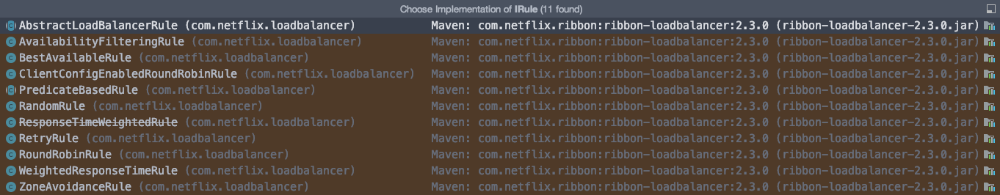

* 一般情况下我们会把 IRule 的 Bean 放在主启动类上一层目录下的包下（防止自动扫描）

	```
	.
	└── com
	    └── komorebi
	        ├── myrule
	        │   └── CustomRule.java
	        └── springcloud
	            ├── DeptConsumer_80.java
	            ├── config
	            │   └── ConfigBean.java
	            └── controller
	                └── DeptConsumerController.java
	```

* 配置

	* 1 CustomRule.java

		```java
		@Configuration
		public class CustomRule {
		   @Bean
		   public IRule myRule() {
		      return new RandomRule();
		   }
		}
		```

	* 2 主启动类加注解，加载自定义Ribbon类

		```java
		@RibbonClient(name = "SPRINGCLOUD-PROVIDER-DEPT", configuration = CustomRule.class)
		```

	* 3 自定义MyRandomRule.java

		```java
		public class MyRandomRule extends AbstractLoadBalancerRule {
		    // 每个服务，访问5次，换下一个服务(3个)
		
		    private int total = 0;  // 被调用的测试
		    private int currentIdx = 0; // 当前提供服务的索引
		
		    //@edu.umd.cs.findbugs.annotations.SuppressWarnings(value = "RCN_REDUNDANT_NULLCHECK_OF_NULL_VALUE")
		    public Server choose(ILoadBalancer lb, Object key) {
		        if (lb == null) {
		            return null;
		        }
		        Server server = null;
		
		        while (server == null) {
		            if (Thread.interrupted()) {
		                return null;
		            }
		            List<Server> upList = lb.getReachableServers(); // 获取存活的服务
		            List<Server> allList = lb.getAllServers();      // 获取全部的服务
		
		            int serverCount = allList.size();
		            if (serverCount == 0) {
		                return null;
		            }
		
		            // int index = chooseRandomInt(serverCount);   // 生成区间随机数
		            // server = upList.get(index);                 // 从活着的服务中随机获取一个
		
		            // ===============自定义部分==============
		
		            server = upList.get(currentIdx);
		            total += 1;
		
		            // 如果调用了五次，那么切换到下一个服务
		            if (total == 5) {
		                currentIdx = (currentIdx + 1) % upList.size();
		                total = 0;
		            }
		
		            // =====================================
		
		            if (server == null) {
		                Thread.yield();
		                continue;
		            }
		
		            if (server.isAlive()) {
		                return (server);
		            }
		
		            server = null;
		            Thread.yield();
		        }
		
		        return server;
		
		    }
		
		    @Override
		    public Server choose(Object key) {
		        return choose(getLoadBalancer(), key);
		    }
		
		    @Override
		    public void initWithNiwsConfig(IClientConfig clientConfig) {
		        // TODO Auto-generated method stub
		
		    }
		}
		```

	* 4 把 IRule 的 Bean 改成 MyRandomRule 的实例即可


## 5 Feign -- 负载均衡

* Feign是**声明式**的web service客户端，它让微服务之间的调用变得更简单了，类似于controller调用service。SpringCloud集成了Ribbon和Eureka，可以使用Feign提供负载均衡的客户端
* feign，主要是社区，大家都习惯于面向接口编程，调用微服务访问有两种方法
	* 微服务名称（Ribbon）
	* 接口和注解（Feign）

**Feign做什么**

* Feign旨在使编写java http客户端变得更容易
* 前面在使用Ribbon + RestTemplate时，利用RestTemplate对Http请求的封装处理，形成了一套模板化的调用方法。但在实际开发中，由于对服务依赖的调用可能不止一处，往往一个接口会被多处调用，所以通常会针对每一个微服务自行封装一些客户端类来包装这些依赖服务的调用。所以，Feign在此基础上做了进一步封装，由他来定义和实现依赖服务接口的定义。==在Feign的实现下，我们只需要创建一个接口并使用注解的方式来配置它（类似于以前Dao接口上标注Mapper注解，现在是一个微服务接口上面标注一个Feign注解）==这样可以完成对服务提供方的接口绑定，简化了使用SpringCloud Ribbon时，自行封装服务调用客户端的开发量

**Feign集成Ribbon**

* 利用Ribbon维护了MicroServiceCloud-Dept的服务列表信息，并且通过轮询实现了客户端的负载均衡，而与Ribbon不同的是，通过Feign只需要定义服务绑定接口且以声明式的方法，优雅且简单的实现了服务调用

**使用步骤：**

1. api-module中导包

	```xml
	<!--feign-->
	<dependency>
	    <groupId>org.springframework.cloud</groupId>
	    <artifactId>spring-cloud-starter-feign</artifactId>
	    <version>1.4.6.RELEASE</version>
	</dependency>
	```

2. 复制80-module，成一个新的module，删除原本的自定义Ribbon算法

3. api-module中新建service包，新建DeptClientService.java，其中 GetMapping 和 PostMapping 中写要访问的服务 url

	```java
	@Component
	@FeignClient(value = "SPRINGCLOUD-PROVIDER-DEPT")
	public interface DeptClientService {
	    @GetMapping("/dept/get/{id}")
	    public Dept queryById(@PathVariable("id")Long id);
	
	    @GetMapping("/dept/list")
	    public List<Dept> queryAll();
	
	    @PostMapping("/dept/add")
	    public boolean addDept(Dept dept);
	}
	```

4. feign-module中修改controller

	```java
	@RestController
	public class DeptConsumerController {
	
	    @Autowired
	    private DeptClientService service = null;
	
	    @RequestMapping("/consumer/dept/add")
	    public boolean add(Dept dept) {
	        return this.service.addDept(dept);
	    }
	
	    @RequestMapping("/consumer/dept/get/{id}")
	    public Dept get(@PathVariable("id") Long id) {
	        return this.service.queryById(id);
	    }
	
	    @RequestMapping("/consumer/dept/list")
	    public List<Dept> list() {
	        return this.service.queryAll();
	    }
	}
	```

5. 主启动类添加注解  **@EnableFeignClients(basePackages = {"com.komorebi.springcloud"})**

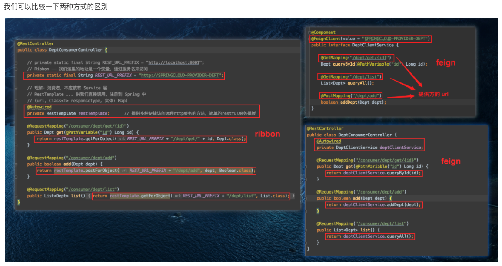


## 6 Hystrix -- 服务熔断、降级

**分布式系统面临的问题**

* 复杂分布式体系结构中的应用程序有很多依赖关系，每个依赖关系在某些时刻将不可避免的失败~

**服务雪崩**

* 多个微服务之间调用的时候，假设A调用B和C，B和C又调用其他的微服务，这就是所谓的**扇出**，如果扇出的链路上某个微服务的调用响应时间过长或者不可用，对A的调用就会占用越来越多的系统资源，从而引起系统崩溃，就叫做**服务雪崩**
* 对于高流量的应用来说，单一的后端依赖可能会导致所有服务器上的所有资源都在几秒钟内饱和。比失败更糟糕的是，这些应用程序还可能导致服务之间的延迟增加，备份队列、线程和其他资源紧张，导致整个系统发生更多的级联故障，这些都表示需要对故障和延迟进行隔离和管理，以便单个依赖关系的失败，不能取消整个应用程序或系统。需要做==弃车保帅==的操作

**服务熔断**

* 服务熔断是对应雪崩效应的一种微服务链路保护机制。指的是服务端调用某一方法时发生异常时，服务端不会把这个异常直接抛给客户端，而是会调用一个备选方法，这样当遇到问题时也能向客户端传递一个 json 数据，避免服务的不可用。
* 当扇出链路的某个微服务不可用或者响应时间太长，会进行服务的降级。==进而熔断该节点微服务的调用，快速返回错误的响应信息==。当检测到该节点微服务调用响应正常后恢复调用链路，在SpringCloud框架里熔断机制通过Hystrix实现
* Hystrix会监控微服务间调用的状况，当失败的调用到一定阈值，缺省是5秒内20次调用失败就会启动熔断机制，熔断机制的注解是**@HystrixCommand**

### 6.1 定义

​		Hystrix是一个用于处理分布式系统的延迟和容错的开源库，在分布式系统里，许多依赖不可避免的会调用失败。比如超时、异常等，Hystrix能保证在一个依赖出问题的情况下，不会导致整体服务失败，避免级联故障，以提高分布式系统的弹性

​		”断路器“本身是一种开关装置，当某个服务单元发生故障之后，**通过断路器的故障监控（类似熔断保险丝），向调用方返回一个服务预期的、可处理的备选响应（FallBack），而不是长时间的等待或者抛出调用方法无法处理的异常，这样就保证了服务调用方的线程不会被长时间不必要的占用**，从而避免了故障在分布式系统中的蔓延，甚至雪崩。	

**功能**

* 服务降级
* 服务熔断
* 服务限流
* 接近实时的监控

### 6.2 服务熔断 -- 服务端

> 服务熔断指的是服务端调用某一方法时发生异常时，服务端不会把这个异常直接抛给客户端，而是会调用一个备选方法，这样当遇到问题时也能向客户端传递一个 json 数据，避免服务的不可用。

1. 复制8001-module，改为springcloud-provider-dept-hystrix-8001

2. 添加Hystrix依赖

	```xml
	<!--hystrix-->
	<dependency>
	    <groupId>org.springframework.cloud</groupId>
	    <artifactId>spring-cloud-starter-hystrix</artifactId>
	    <version>1.4.6.RELEASE</version>
	</dependency>
	```

3. 修改配置文件 application.yml，修改 eureka 的 instance-id

	```yml
	# Eureka
	eureka:
	  client:
	    service-url:
	      defaultZone: http://eureka7001.com:7001/eureka/,http://eureka7002.com:7002/eureka/,http://eureka7003.com:7003/eureka/
	  instance:    # 修改默认名字
	    instance-id: springcloud-provider-dept-hystrix8001
	    prefer-ip-address: true     # 为 true 可以显示客户端 ip
	```

4. 修改DeptController

	```java
	// 提供Restful服务
	@RestController
	public class DeptController {
	    @Autowired
	    private DeptService deptService;
	
	    @GetMapping("/dept/get/{id}")
	    @HystrixCommand(fallbackMethod = "hystrixGet")
	    public Dept get(@PathVariable("id") Long id) {
	        Dept dept = deptService.queryById(id);
	
	        if (dept == null) {
	            throw new RuntimeException("id=>" + id + ". 不存在改用户，或者信息无法查到~");
	        }
	
	        return dept;
	    }
	
	    // 备选方案
	    public Dept hystrixGet(@PathVariable("id") Long id) {
	        return new Dept()
	                .setDeptno(id)
	                .setDname("id=>" + id + "没有对应的信息，null--@Hystrix")
	                .setDb_source("no this database");
	    }
	}
	```

5. 在主启动类上开启 Hystrix 熔断器。使用注解 **@EnableCircuitBreaker**

### 6.3 服务降级 -- 客户端

> 客户端的服务降级指当服务器压力剧增的情况下，根据实际业务情况及流量，对一些服务和页面有策略的不处理或换种简单的方式处理，从而释放服务器资源以保证核心交易正常运作或高效运作。

1. 在 springcloud-api 项目下，创建 DeptClientService 的备选方案类 DeptClientServiceFallbackFactory
			这个类实现 FallbackFactory 接口，是一个创建 Fallback 类实例的接口，主要需要重写其中的 create 方法，返回一个 DeptClientService 实例，我们这里重写 DeptClientService 接口中的方法，这些方法就是 Feign 调用服务端失败后会调用的备选方法（这里为了测试只写了 queryById 方法）。注意这里需要把该类注册成 Spring 中的一个组件（使用注解 `@Component`）

	```java
	// 降级
	@Component
	public class DeptClientServiceFallbackFactory implements FallbackFactory {
	    @Override
	    public DeptClientService create(Throwable throwable) {
	        return new DeptClientService() {
	            @Override
	            public Dept queryById(Long id) {
	                return new Dept()
	                        .setDeptno(id)
	                        .setDname("服务已降级，无法查询")
	                        .setDb_source("服务已降级，无法查询");
	            }
	
	            @Override
	            public List<Dept> queryAll() {
	                return null;
	            }
	
	            @Override
	            public boolean addDept(Dept dept) {
	                return false;
	            }
	        };
	    }
	}
	```

2. 修改 DeptClientService 的 `@FeignClient(value = "SPRINGCLOUD-PROVIDER-DEPT")` 为
	 `@FeignClient(value = "SPRINGCLOUD-PROVIDER-DEPT", fallbackFactory = DeptClientServiceFallbackFactory.class)`

3. 在 springcloud-consumer-dept-feign 项目下，修改 application.xml，添加 feign 的 hystrix 支持

	```yml
	# 开启 feign 的 hystrix 的服务降级
	feign:
	  hystrix:
	    enabled: true
	```

4. 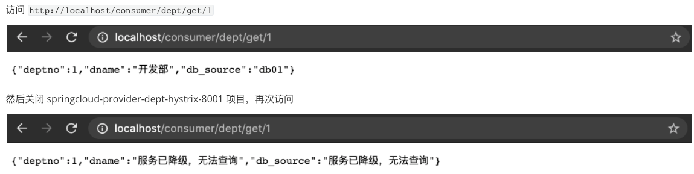

### 6.4 服务监控

1. 在 springcloud 下创建一个子项目 springcloud-consumer-hystrix-dashboard，添加如下依赖

	```xml
	<!--实体类+web-->
	<dependencies>
	    <!--hystrix-->
	    <dependency>
	        <groupId>org.springframework.cloud</groupId>
	        <artifactId>spring-cloud-starter-hystrix</artifactId>
	        <version>1.4.6.RELEASE</version>
	    </dependency>
	    <dependency>
	        <groupId>org.springframework.cloud</groupId>
	        <artifactId>spring-cloud-starter-hystrix-dashboard</artifactId>
	        <version>1.4.6.RELEASE</version>
	    </dependency>
	
	    <!--Ribbon-->
	    <dependency>
	        <groupId>org.springframework.cloud</groupId>
	        <artifactId>spring-cloud-starter-ribbon</artifactId>
	        <version>1.4.6.RELEASE</version>
	    </dependency>
	    <!--Eureka-Client-->
	    <dependency>
	        <groupId>org.springframework.cloud</groupId>
	        <artifactId>spring-cloud-starter-eureka</artifactId>
	        <version>1.4.6.RELEASE</version>
	    </dependency>
	
	    <dependency>
	        <groupId>com.komorebi</groupId>
	        <artifactId>springcloud-api</artifactId>
	        <version>1.0-SNAPSHOT</version>
	    </dependency>
	    <dependency>
	        <groupId>org.springframework.boot</groupId>
	        <artifactId>spring-boot-starter-web</artifactId>
	    </dependency>
	    <dependency>
	        <groupId>org.springframework.boot</groupId>
	        <artifactId>spring-boot-devtools</artifactId>
	    </dependency>
	</dependencies>
	```

2. 添加 resources/application.yml

	```yml
	server:
	  port: 9001
	```

3. 添加一个启动类DeptConsumerDashboard_9001，添加注解 `@EnableHystrixDashboard`

	```java
	@SpringBootApplication
	@EnableHystrixDashboard // 开启 Hystrix 的 dashboard
	public class DeptConsumerDashboard_9001 {
	   public static void main(String[] args) {
	      SpringApplication.run(DeptConsumerDashboard_9001.class, args);
	   }
	}
	```

4. 启动项目后访问 `http://localhost:9001/hystrix`
	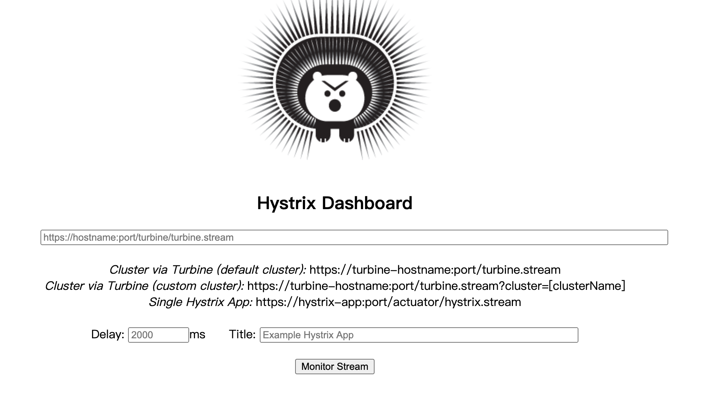

5. 在 springcloud-provider-dept-hystrix-8001 项目下，修改主启动类，添加一个 HystrixMetricsStreamServlet 的 Bean(注意导包Hystrix)

	```java
	// 启动类
	@SpringBootApplication
	@EnableEurekaClient         // 在服务启动后，自动注册到Eureka中
	@EnableDiscoveryClient      // 服务发现
	public class DeptProvider_8001 {
	    public static void main(String[] args) {
	        SpringApplication.run(DeptProvider_8001.class, args);
	    }
	
	    // 增加一个Servlet
	    @Bean
	    public ServletRegistrationBean hystrixMetricsStreamServlet() {
	        ServletRegistrationBean registrationBean = new ServletRegistrationBean(new HystrixMetricsStreamServlet());
	        registrationBean.addUrlMappings("/actuator/hystrix.stream");
	        return registrationBean;
	    }
	}
	```

6. 依次启动 springcloud-eureka-7001、springcloud-provider-dept-hystrix-8001、springcloud-consumer-dept-feign 和 springcloud-consumer-hystrix-dashboard。（只能监控配置过熔断的module）

7. 服务启动后，继续访问 `http://localhost:9001/hystrix`，输入监控页面 url 为 `http://localhost:8001/actuator/hystrix.stream`，Delay 和 Title 随便填。
	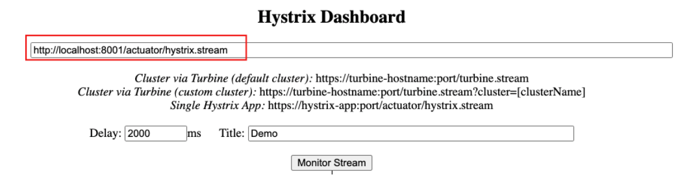

8. 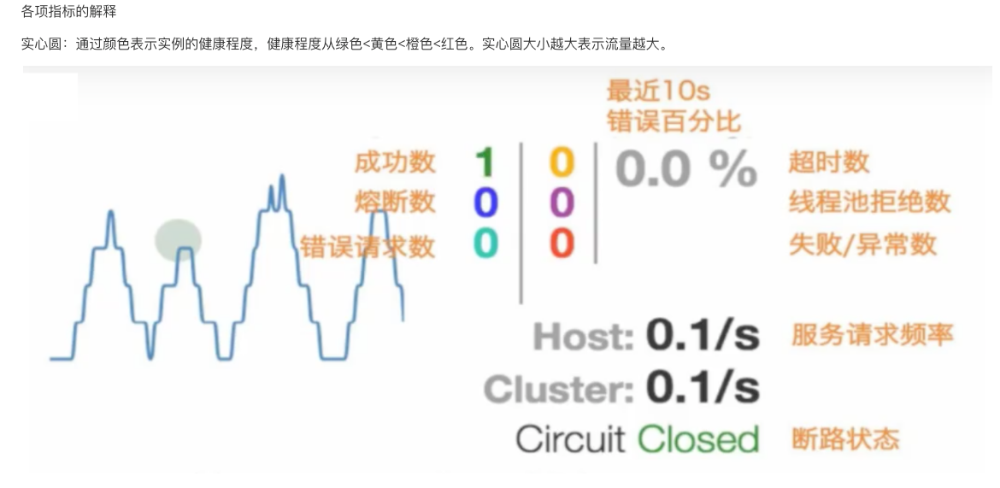

 

## 7 Zuul -- 路由网关

### 7.1 概述

**什么是Zuul**

​		Zuul包含对请求的**路由和过滤**两个最主要的功能

​		路由功能负责将外部请求转发到具体的微服务实例上，是实现外部访问统一入口的基础，而过滤器功能则负责对请求的处理过程进行干预，是实现请求校验、服务聚合等功能的基础。Zuul和Eureka进行整合，将Zuul自身注册为Eureka服务治理下的应用，同时从Eureka中获得其他微服务的消息，也即以后的访问微服务都是通过Zuul跳转后获得。

​		注意：Zuul最终还是会注册进Eureka

​		提供：**代理 + 路由 + 过滤** 三个功能

### 7.2 应用步骤

1. 新建zuul-9527的module，复制dashboard的依赖，并导入zuul依赖

	```xml
	<!--zuul-->
	<dependency>
	    <groupId>org.springframework.cloud</groupId>
	    <artifactId>spring-cloud-starter-zuul</artifactId>
	    <version>1.4.6.RELEASE</version>
	</dependency>
	```

2. 配置application.yml

	```yml
	server:
	  port: 9527
	
	spring:
	  application:
	    name: springcloud-zuul
	
	eureka:
	  client:
	    service-url:
	      defaultZone: http://eureka7001.com:7001/eureka/,http://eureka7002.com:7002/eureka/,http://eureka7003.com:7003/eureka/
	  instance:
	    instance-id: zuul9527.com
	    prefer-ip-address: true
	
	info:
	  app.name: komorebi.blog
	  company.name: komorebi
	
	zuul:
	  routes:
	    mydept.serviceId: springcloud-provider-dept
	    mydept.path: /mydept/**
	  ignored-services: springcloud-provider-dept   # 不能再使用这个路径访问了，如果是 "*" 说明不能用所有的真实项目名（/mydept 是可以的）
	  prefix: /komorebi       # 表示域名前需要加这个前缀（如 localhost:9527/komorebi/mydept/dept/get/1）
	```

3. 主启动类加`@EnableZuulProxy`注解

4. 依次开启 springcloud-eureka-7001、springcloud-provider-dept-hystrix-8001 和 springcloud-zuul-9527。访问 eureka 监控页面可以看到 zuul 和提供方已被注册到 eureka

5. 接下来访问 `http://www.komorebi.com:9527/komorebi/mydept/dept/get/1`


## 8 Config -- 分布式配置中心

### 8.1 概述

**分布式系统面临的问题 -- 配置文件**

​		微服务意味着要将单体应用中的业务拆分成一个个服务，每个服务的粒度相对较小，因此系统中会出现大量的服务，由于每个服务都需要必要的配置信息才能运行。所以一套集中式的，动态的配置管理设施是必不可少的。SpringCloud提供了ConfigServer来解决这个问题，我们每一个微服务自己带着一个application.yml，若服务太多，改起来太麻烦

**SpringCloud Config分布式配置中心**

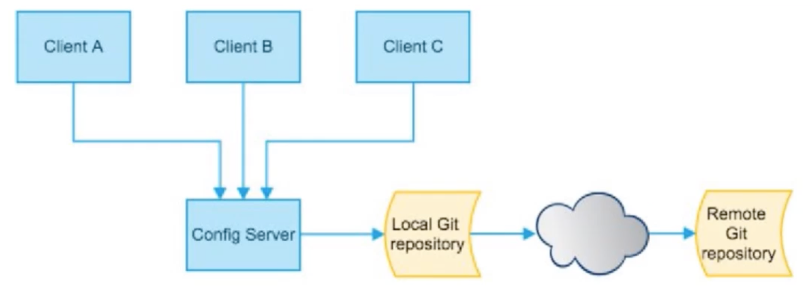

SpringCloud Config为微服务架构中的微服务提供集中化的外部配置支持，配置服务器为**各个不同微服务应用**的所有环节提供了一个**中心化的外部配置**

SpringCloud Config分为**服务端**和**客户端**两部分

* 服务端也称为**分布式配置中心**，是一个独立的微服务应用，用来连接配置服务器并为客户端提供获取配置信息、加密、解密信息等访问接口
* 客户端则是通过指定的配置中心来管理应用资源，以及与业务相关的配置内容，并在启动的时候从配置中心获取和加载配置信息。配置服务器默认采用Git来存储配置信息，这样就有助于对环境配置进行版本管理，并且可以通过Git客户端工具来方便管理和访问内容。

### 8.2 作用

* 集中管理配置文件
* 不同环境、不同配置，动态化的配置更新。分环境部署，如/dev  /test  /prod  /beta  /release
* 运行期间动态调整配置，不再需要再某个服务部署的机器上编写配置文件，服务会向配置中心统一拉取配置自己的信息
* 当配置发生变动时，服务不需要重启，即可感知到配置的变化，并应用新的配置
* 将配置信息以REST接口的形式暴露

### 8.3 服务端

1. GitHub新建一个仓库，传送一份application.yml

	```yml
	spring:
	  profiles:
	    active: dev
	
	---
	spring:
	  profiles: dev
	  application:
	    name: springcloud-config-dev
	
	---
	spring:
	  profiles: test
	  application:
	    name: springcloud-config-test
	```

2. 新建一个config-3344-module，导包

	```xml
	<!--web-->
	<dependency>
	    <groupId>org.springframework.boot</groupId>
	    <artifactId>spring-boot-starter-web</artifactId>
	</dependency>
	<!--config-->
	<dependency>
	    <groupId>org.springframework.cloud</groupId>
	    <artifactId>spring-cloud-config-server</artifactId>
	    <version>2.1.1.RELEASE</version>
	</dependency>
	<!--actuator-->
	<dependency>
	    <groupId>org.springframework.boot</groupId>
	    <artifactId>spring-boot-starter-actuator</artifactId>
	</dependency>
	<!-- Eureka-Client -->
	<dependency>
	    <groupId>org.springframework.cloud</groupId>
	    <artifactId>spring-cloud-starter-eureka</artifactId>
	    <version>1.4.6.RELEASE</version>
	</dependency>
	```

3. 新建application.yml

	```
	server:
	  port: 3344
	spring:
	  application:
	    name: springcloud-config-server
	  cloud:
	    config:
	      server:
	        git:
	          uri: https://github.com/juechen-zzz/springcloud-config-demo.git
	```

4. 主启动类加`@EnableConfigServer`注解

5. 访问http://localhost:3344/application-dev.yml
	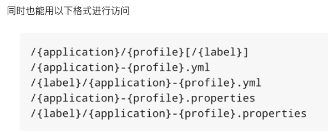

### 8.4 客户端

1. 在之前的 git 项目 springcloud-config-demo 下添加一个文件 config-client.yml

	```yml
	spring:
	  profiles:
	    active: dev
	
	---
	
	server:
	  port: 8201
	
	spring:
	  profiles: dev
	  application:
	    name: springcloud-provider-dept
	
	# eureka 配置，服务注册到哪里
	eureka:
	  client:
	    service-url:
	      defaultZone: http://eureka7001.com:7001/eureka/
	
	---
	
	server:
	  port: 8202
	
	spring:
	  profiles: test
	  application:
	    name: springcloud-provider-dept
	
	# eureka 配置，服务注册到哪里
	eureka:
	  client:
	    service-url:
	      defaultZone: http://eureka7001.com:7001/eureka/
	```

2. 在 springcloud 项目下创建子项目 springcloud-config-client-8201，在 pom.xml 添加如下依赖（注意这里 config 的依赖和服务端是不一样的）

	```xml
	<!--web-->
	<dependency>
	    <groupId>org.springframework.boot</groupId>
	    <artifactId>spring-boot-starter-web</artifactId>
	</dependency>
	<!--cloud-config-->
	<dependency>
	    <groupId>org.springframework.cloud</groupId>
	    <artifactId>spring-cloud-starter-config</artifactId>
	    <version>2.1.1.RELEASE</version>
	</dependency>
	<!--actuator-->
	<dependency>
	    <groupId>org.springframework.boot</groupId>
	    <artifactId>spring-boot-starter-actuator</artifactId>
	</dependency>
	```

3. 创建两个配置文件 resources/bootstrap.yml 和 resources/application.yml 
	bootstrap.yml 是系统级别的配置，application.yml 是应用级别的配置，客户端获取服务端配置信息一定要写在 bootstrap.yml 中。

	```yml
	# 系统级别的配置
	spring:
	  cloud:
	    config:
	      name: config-client   # 需要从 git 上读取的资源名称，不要后缀
	      profile: dev          # 选择哪一个环境
	      label: master         # 选择哪一个分支
	      uri: http://localhost:3344    # 服务端的 uri
	```

	```yml
	# 用户级别的配置
	spring:
	  application:
	    name: springcloud-config-client-8201
	```

4. 测试。我们写一个 controller 类

	```java
	@RestController
	public class ConfigClientController {
	    @Value("${spring.application.name}")
	    private String applicationName;
	    @Value("${eureka.client.service-url.defaultZone}")
	    private String eurekaServer;
	    @Value("${server.port}")
	    private String port;
	
	    @RequestMapping("/config")
	    public String getConfig() {
	        return "applicationName: " + applicationName + "\t" +
	                "eurekaServer: " + eurekaServer + "\t" +
	                "port: " + port;
	    }
	}
	```

5. 先启动 springcloud-config-server-3344，再启动 springcloud-config-client-8201，

	1. 我们先访问 `http://localhost:3344/config-client-dev.yml`，可以看到能获取 git 仓库的信息。
	2. 然后访问 `http://localhost:8201/config`，可以看到客户端也获取到了信息

