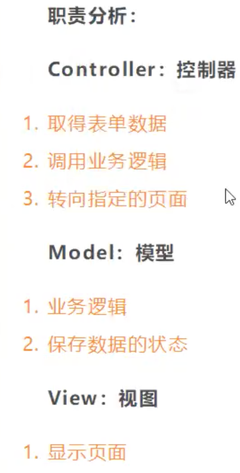
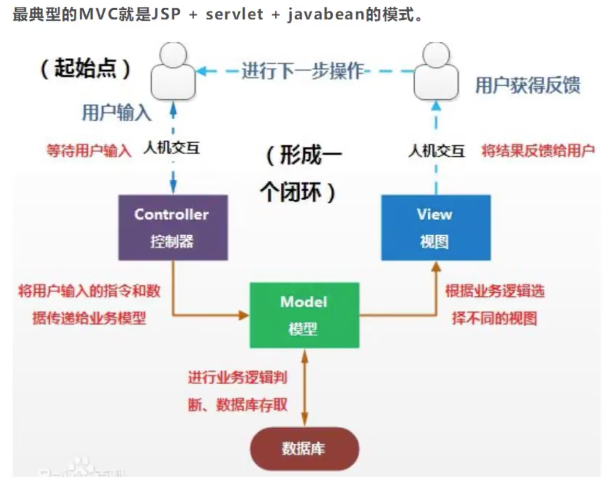
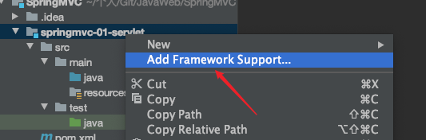

# SpringMVC

* **MVC**：模型（**model**：dao和service层）、视图（**view**：jsp）、控制器（**controller**：servlet）的简写，是一种软件设计规范
	* Model：数据模型，提供要展示的数据，因此包含数据和行为，可以认为是领域模型或JavaBean组件（包含数据和行为），不过现在一般都分离开来：Value Object(数据Dao)和服务层(行为Service)。也就是模型提供了数据查询和模型数据的状态更新等功能，包括数据和业务。
	* View：负责进行模型的展示，一般就是我们见到的用户界面，客户想看到的东西
	* Controller：接收用户请求，委托给模型进行处理（状态改变），处理完毕后把返回的模型数据返回给视图，由视图负责展示，也就是说控制器做了调度员的工作
* 将业务逻辑、数据、显示分离的方法来组织代码
* MVC主要作用是**降低了视图与业务逻辑间的双向耦合**
* MVC不是一种设计模式，是一种**架构模式**，不同的MVC存在差异



## 1 servlet环境搭建

* 父工程pom.xml

	```xml
	<dependencies>
	    <!--junit-->
	    <dependency>
	        <groupId>junit</groupId>
	        <artifactId>junit</artifactId>
	        <version>4.12</version>
	    </dependency>
	    <!--spring-webmvc -->
	    <dependency>
	        <groupId>org.springframework</groupId>
	        <artifactId>spring-webmvc</artifactId>
	        <version>5.3.1</version>
	    </dependency>
	    <!--Servlet+JSP+JSTL-->
	    <dependency>
	        <groupId>javax.servlet</groupId>
	        <artifactId>servlet-api</artifactId>
	        <version>2.5</version>
	    </dependency>
	    <dependency>
	        <groupId>javax.servlet.jsp</groupId>
	        <artifactId>jsp-api</artifactId>
	        <version>2.2</version>
	    </dependency>
	    <dependency>
	        <groupId>javax.servlet</groupId>
	        <artifactId>jstl</artifactId>
	        <version>1.2</version>
	    </dependency>
	</dependencies>
	```

* 添加框架支持
	

* 1 新建一个类，实现Servlet接口

	```java
	public class HelloServlet extends HttpServlet {
	    @Override
	    protected void doGet(HttpServletRequest req, HttpServletResponse resp) throws ServletException, IOException {
	        // 1 获取前端参数
	        String method = req.getParameter("method");
	        if (method.equals("add")){
	            req.getSession().setAttribute("msg", "执行了add方法");
	        }
	        if (method.equals("delete")){
	            req.getSession().setAttribute("msg", "执行了delete方法");
	        }
	
	        // 2 调用业务层
	
	        // 3 视图转发或重定向
	        req.getRequestDispatcher("/WEB-INF/jsp/test.jsp").forward(req, resp);
	    }
	
	    @Override
	    protected void doPost(HttpServletRequest req, HttpServletResponse resp) throws ServletException, IOException {
	        doGet(req, resp);
	    }
	}
	```

* 2 在WEB-INF下新建jsp文件夹，新建test.jsp

	```xml
	<%@ page contentType="text/html;charset=UTF-8" language="java" %>
	<html>
	<head>
	    <title>Title</title>
	</head>
	<body>
	${msg}
	</body>
	</html>
	```

* 3 新建form.jsp表单

	```xml
	<%@ page contentType="text/html;charset=UTF-8" language="java" %>
	<html>
	<head>
	    <title>Title</title>
	</head>
	<body>
	
	<form action="/hello" method="post">
	    <input type="test" name="method">
	    <input type="submit">
	</form>
	
	</body>
	</html>
	```

* 4 Web.xml注册servlet

	```xml
	<?xml version="1.0" encoding="UTF-8"?>
	<web-app xmlns="http://xmlns.jcp.org/xml/ns/javaee"
	         xmlns:xsi="http://www.w3.org/2001/XMLSchema-instance"
	         xsi:schemaLocation="http://xmlns.jcp.org/xml/ns/javaee http://xmlns.jcp.org/xml/ns/javaee/web-app_4_0.xsd"
	         version="4.0">
	    
	    <servlet>
	        <servlet-name>hello</servlet-name>
	        <servlet-class>com.komorebi.servlet.HelloServlet</servlet-class>
	    </servlet>
	    <servlet-mapping>
	        <servlet-name>hello</servlet-name>
	        <url-pattern>/hello</url-pattern>
	    </servlet-mapping>
	
	<!--    <session-config>-->
	<!--        <session-timeout>15</session-timeout>-->
	<!--    </session-config>-->
	
	<!--    <welcome-file-list>-->
	<!--        <welcome-file>index.jsp</welcome-file>-->
	<!--    </welcome-file-list>-->
	</web-app>
	```

* 5 配置Tomcat，测试


## 2 SpringMVC特性

* 轻量级，简单易学
* 高效，基于请求响应的MVC框架
* 与Spring兼容性好
* 约定大于配置
* 功能强大：RESTful、数据验证、格式化、本地化、主题
* **以请求为驱动，围绕一个中心Servlet分派请求及提供其他功能，DispatchServlet是一个实际的Servlet**


* **步骤**

	* 1 web.xml

		```xml
		<?xml version="1.0" encoding="UTF-8"?>
		<web-app xmlns="http://xmlns.jcp.org/xml/ns/javaee"
		         xmlns:xsi="http://www.w3.org/2001/XMLSchema-instance"
		         xsi:schemaLocation="http://xmlns.jcp.org/xml/ns/javaee http://xmlns.jcp.org/xml/ns/javaee/web-app_4_0.xsd"
		         version="4.0">
		    <!--1 注册DispatcherServlet-->
		    <servlet>
		        <servlet-name>springmvc</servlet-name>
		        <servlet-class>org.springframework.web.servlet.DispatcherServlet</servlet-class>
		        <!--关联一个springmvc的配置文件：[servlet-name]-servlet.xml-->
		        <init-param>
		            <param-name>contextConfigLocation</param-name>
		            <param-value>classpath:springmvc-servlet.xml</param-value>
		        </init-param>
		        <!--启动级别-1-->
		        <load-on-startup>1</load-on-startup>
		    </servlet>
		
		    <!-- / 匹配所有的请求：(不包括.jsp) -->
		    <!-- /* 匹配所有的请求：(包括.jsp) -->
		    <servlet-mapping>
		        <servlet-name>springmvc</servlet-name>
		        <url-pattern>/</url-pattern>
		    </servlet-mapping>
		</web-app>
		```

	* 2 springmvc-servlet.xml

		```xml
		<?xml version="1.0" encoding="UTF-8"?>
		<beans xmlns="http://www.springframework.org/schema/beans"
		       xmlns:xsi="http://www.w3.org/2001/XMLSchema-instance"
		       xsi:schemaLocation="http://www.springframework.org/schema/beans
		       http://www.springframework.org/schema/beans/spring-beans.xsd">
		
		    <!--处理器映射器-->
		    <bean class="org.springframework.web.servlet.handler.BeanNameUrlHandlerMapping"/>
		    <!--处理器适配器-->
		    <bean class="org.springframework.web.servlet.mvc.SimpleControllerHandlerAdapter"/>
		
		    <!--添加视图解析器-->
		    <bean class="org.springframework.web.servlet.view.InternalResourceViewResolver" id="InternalResourceViewResolver">
		        <!--前缀-->
		        <property name="prefix" value="/WEB-INF/jsp/"/>
		        <!--后缀-->
		        <property name="suffix" value=".jsp"/>
		    </bean>
		
		    <!--Handler-->
		    <bean id="/hello" class="com.komorebi.controller.HelloController"/>
		</beans>
		```

	* 3 helloController.java

		```java
		public class HelloController implements Controller {
		    public ModelAndView handleRequest(HttpServletRequest httpServletRequest, HttpServletResponse httpServletResponse) throws Exception {
		        // ModelAndView  模型和视图
		        ModelAndView mv = new ModelAndView();
		
		        // 封装对象，放在ModelAndView中
		        mv.addObject("msg", "HelloSpringMVC!");
		
		        // 封装要跳转的视图，放在ModelAndView中
		        mv.setViewName("hello");    // ：/WEB-INF/jsp/hello.jsp
		        return mv;
		    }
		}
		```

	* 4 配置Tomcat，测试

	* 

### 2.1 执行原理


1. DispatcherServlet表示前置控制器，是整个SpringMVC的控制中心。用户发出请求，DispatcherServlet接收请求并拦截请求
2. HanderMapping为处理器映射。DispatcherServlet调用HanderMapping，HanderMapping根据请求url查找Handler
3. HandlerExecution表示具体Handler。其主要作用是根据url查找控制器，如上url被查找控制器为：hello
4. HandlerExecution将解析后的信息传递给DispatcherServlet，如解析控制器映射等
5. HandlerAdapter表示处理器适配器，其按照特定的规则去执行Handler
6. Handler让具体的Controller执行
7. Controller将具体的执行信息返回给HandlerAdapter，如ModelAndView
8. HandlerAdapter将视图逻辑名或模型传递给DispatcherServlet
9. DispatcherServlet调用视图解析器（ViewResolver）来解析HandlerAdapter传递的逻辑视图名
10. 视图解析器将解析的逻辑视图名传给DispatcherServlet
11. DispatcherServlet根据视图解析器解析出的视图结果，调用具体的视图
12. 最终视图呈现给用户


## 3 注解开发SpringMVC

步骤：

1. 配置web.xml（同上）

	```xml
	<?xml version="1.0" encoding="UTF-8"?>
	<web-app xmlns="http://xmlns.jcp.org/xml/ns/javaee"
	         xmlns:xsi="http://www.w3.org/2001/XMLSchema-instance"
	         xsi:schemaLocation="http://xmlns.jcp.org/xml/ns/javaee http://xmlns.jcp.org/xml/ns/javaee/web-app_4_0.xsd"
	         version="4.0">
	
	    <!--1 注册DispatcherServlet-->
	    <servlet>
	        <servlet-name>springmvc</servlet-name>
	        <servlet-class>org.springframework.web.servlet.DispatcherServlet</servlet-class>
	        <!--关联一个springmvc的配置文件：[servlet-name]-servlet.xml-->
	        <init-param>
	            <param-name>contextConfigLocation</param-name>
	            <param-value>classpath:springmvc-servlet.xml</param-value>
	        </init-param>
	        <!--启动级别-1-->
	        <load-on-startup>1</load-on-startup>
	    </servlet>
	
	    <!-- / 匹配所有的请求：(不包括.jsp) -->
	    <!-- /* 匹配所有的请求：(包括.jsp) -->
	    <servlet-mapping>
	        <servlet-name>springmvc</servlet-name>
	        <url-pattern>/</url-pattern>
	    </servlet-mapping>
	</web-app>
	```

2. 配置springmvc-servlet.xml

	```xml
	<?xml version="1.0" encoding="UTF-8"?>
	<beans xmlns="http://www.springframework.org/schema/beans"
	       xmlns:xsi="http://www.w3.org/2001/XMLSchema-instance"
	       xmlns:context="http://www.springframework.org/schema/context"
	       xmlns:mvc="http://www.springframework.org/schema/mvc"
	       xsi:schemaLocation="http://www.springframework.org/schema/beans
	       http://www.springframework.org/schema/beans/spring-beans.xsd
	       http://www.springframework.org/schema/context
	       http://www.springframework.org/schema/context/spring-context.xsd
	       http://www.springframework.org/schema/mvc
	       http://www.springframework.org/schema/mvc/spring-mvc.xsd">
	
	    <!--自动扫描包，让指定包下的注解生效，由IOC容器统一管理-->
	    <context:component-scan base-package="com.komorebi.controller"/>
	
	    <!--让Spring MVC不处理静态资源-->
	    <mvc:default-servlet-handler/>
	
	    <!--
	    支持MVC注解驱动
	        在Spring中一般采用@RequestMapping注解完成映射关系
	        要想使@RequestMapping注解生效
	        必须向上下文中注册DefaultAnnotationHandlerMapping和一个AnnotationMethodHandlerAdapter实例
	        这两个实例分别在类级别和方法级别处理
	        而annotation-driven配置帮助我们自动完成上述两个实例的注入
	    -->
	    <mvc:annotation-driven/>
	
	    <!--添加视图解析器-->
	    <bean class="org.springframework.web.servlet.view.InternalResourceViewResolver" id="InternalResourceViewResolver">
	        <!--前缀-->
	        <property name="prefix" value="/WEB-INF/jsp/"/>
	        <!--后缀-->
	        <property name="suffix" value=".jsp"/>
	    </bean>
	
	</beans>
	```

3. 创建Controller

	```java
	@Controller
	public class HelloController {
	
	    @RequestMapping("/hello")           // 真实访问地址   Localhost:8080/nhp/hello
	    public String hello(Model model){
	        // 封装数据
	        model.addAttribute("message", "Hello, SpringMVC Annotation!");
	        return "hello";         // 会被视图解析器处理, /WEB-INF/jsp/hello.jsp
	    }
	}
	```

4. 注册Tomcat，测试