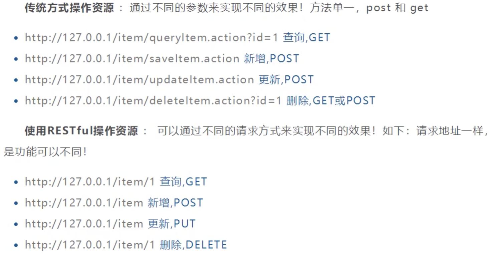
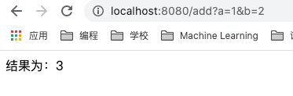
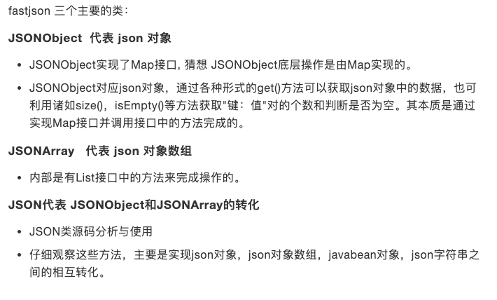

# SpringMVC

* **MVC**：模型（**model**：dao和service层）、视图（**view**：jsp）、控制器（**controller**：servlet）的简写，是一种软件设计规范
	* Model：数据模型，提供要展示的数据，因此包含数据和行为，可以认为是领域模型或JavaBean组件（包含数据和行为），不过现在一般都分离开来：Value Object(数据Dao)和服务层(行为Service)。也就是模型提供了数据查询和模型数据的状态更新等功能，包括数据和业务。
	* View：负责进行模型的展示，一般就是我们见到的用户界面，客户想看到的东西
	* Controller：接收用户请求，委托给模型进行处理（状态改变），处理完毕后把返回的模型数据返回给视图，由视图负责展示，也就是说控制器做了调度员的工作
* 将业务逻辑、数据、显示分离的方法来组织代码
* MVC主要作用是**降低了视图与业务逻辑间的双向耦合**
* MVC不是一种设计模式，是一种**架构模式**，不同的MVC存在差异


## 1 servlet环境搭建

* 父工程pom.xml

	```xml
	<dependencies>
	    <!--junit-->
	    <dependency>
	        <groupId>junit</groupId>
	        <artifactId>junit</artifactId>
	        <version>4.12</version>
	    </dependency>
	    <!--spring-webmvc -->
	    <dependency>
	        <groupId>org.springframework</groupId>
	        <artifactId>spring-webmvc</artifactId>
	        <version>5.3.1</version>
	    </dependency>
	    <!--Servlet+JSP+JSTL-->
	    <dependency>
	        <groupId>javax.servlet</groupId>
	        <artifactId>servlet-api</artifactId>
	        <version>2.5</version>
	    </dependency>
	    <dependency>
	        <groupId>javax.servlet.jsp</groupId>
	        <artifactId>jsp-api</artifactId>
	        <version>2.2</version>
	    </dependency>
	    <dependency>
	        <groupId>javax.servlet</groupId>
	        <artifactId>jstl</artifactId>
	        <version>1.2</version>
	    </dependency>
	</dependencies>
	```

* 添加框架支持
	

* 1 新建一个类，实现Servlet接口

	```java
	public class HelloServlet extends HttpServlet {
	    @Override
	    protected void doGet(HttpServletRequest req, HttpServletResponse resp) throws ServletException, IOException {
	        // 1 获取前端参数
	        String method = req.getParameter("method");
	        if (method.equals("add")){
	            req.getSession().setAttribute("msg", "执行了add方法");
	        }
	        if (method.equals("delete")){
	            req.getSession().setAttribute("msg", "执行了delete方法");
	        }
	
	        // 2 调用业务层
	
	        // 3 视图转发或重定向
	        req.getRequestDispatcher("/WEB-INF/jsp/test.jsp").forward(req, resp);
	    }
	
	    @Override
	    protected void doPost(HttpServletRequest req, HttpServletResponse resp) throws ServletException, IOException {
	        doGet(req, resp);
	    }
	}
	```

* 2 在WEB-INF下新建jsp文件夹，新建test.jsp

	```xml
	<%@ page contentType="text/html;charset=UTF-8" language="java" %>
	<html>
	<head>
	    <title>Title</title>
	</head>
	<body>
	${msg}
	</body>
	</html>
	```

* 3 新建form.jsp表单

	```xml
	<%@ page contentType="text/html;charset=UTF-8" language="java" %>
	<html>
	<head>
	    <title>Title</title>
	</head>
	<body>
	
	<form action="/hello" method="post">
	    <input type="test" name="method">
	    <input type="submit">
	</form>
	
	</body>
	</html>
	```

* 4 Web.xml注册servlet

	```xml
	<?xml version="1.0" encoding="UTF-8"?>
	<web-app xmlns="http://xmlns.jcp.org/xml/ns/javaee"
	         xmlns:xsi="http://www.w3.org/2001/XMLSchema-instance"
	         xsi:schemaLocation="http://xmlns.jcp.org/xml/ns/javaee http://xmlns.jcp.org/xml/ns/javaee/web-app_4_0.xsd"
	         version="4.0">
	    
	    <servlet>
	        <servlet-name>hello</servlet-name>
	        <servlet-class>com.komorebi.servlet.HelloServlet</servlet-class>
	    </servlet>
	    <servlet-mapping>
	        <servlet-name>hello</servlet-name>
	        <url-pattern>/hello</url-pattern>
	    </servlet-mapping>
	
	<!--    <session-config>-->
	<!--        <session-timeout>15</session-timeout>-->
	<!--    </session-config>-->
	
	<!--    <welcome-file-list>-->
	<!--        <welcome-file>index.jsp</welcome-file>-->
	<!--    </welcome-file-list>-->
	</web-app>
	```

* 5 配置Tomcat，测试


## 2 SpringMVC特性

* 轻量级，简单易学
* 高效，基于请求响应的MVC框架
* 与Spring兼容性好
* 约定大于配置
* 功能强大：RESTful、数据验证、格式化、本地化、主题
* **以请求为驱动，围绕一个中心Servlet分派请求及提供其他功能，DispatchServlet是一个实际的Servlet**


* **步骤**

	* 1 web.xml

		```xml
		<?xml version="1.0" encoding="UTF-8"?>
		<web-app xmlns="http://xmlns.jcp.org/xml/ns/javaee"
		         xmlns:xsi="http://www.w3.org/2001/XMLSchema-instance"
		         xsi:schemaLocation="http://xmlns.jcp.org/xml/ns/javaee http://xmlns.jcp.org/xml/ns/javaee/web-app_4_0.xsd"
		         version="4.0">
		    <!--1 注册DispatcherServlet-->
		    <servlet>
		        <servlet-name>springmvc</servlet-name>
		        <servlet-class>org.springframework.web.servlet.DispatcherServlet</servlet-class>
		        <!--关联一个springmvc的配置文件：[servlet-name]-servlet.xml-->
		        <init-param>
		            <param-name>contextConfigLocation</param-name>
		            <param-value>classpath:springmvc-servlet.xml</param-value>
		        </init-param>
		        <!--启动级别-1-->
		        <load-on-startup>1</load-on-startup>
		    </servlet>
		
		    <!-- / 匹配所有的请求：(不包括.jsp) -->
		    <!-- /* 匹配所有的请求：(包括.jsp) -->
		    <servlet-mapping>
		        <servlet-name>springmvc</servlet-name>
		        <url-pattern>/</url-pattern>
		    </servlet-mapping>
		</web-app>
		```

	* 2 springmvc-servlet.xml

		```xml
		<?xml version="1.0" encoding="UTF-8"?>
		<beans xmlns="http://www.springframework.org/schema/beans"
		       xmlns:xsi="http://www.w3.org/2001/XMLSchema-instance"
		       xsi:schemaLocation="http://www.springframework.org/schema/beans
		       http://www.springframework.org/schema/beans/spring-beans.xsd">
		
		    <!--处理器映射器-->
		    <bean class="org.springframework.web.servlet.handler.BeanNameUrlHandlerMapping"/>
		    <!--处理器适配器-->
		    <bean class="org.springframework.web.servlet.mvc.SimpleControllerHandlerAdapter"/>
		
		    <!--添加视图解析器-->
		    <bean class="org.springframework.web.servlet.view.InternalResourceViewResolver" id="InternalResourceViewResolver">
		        <!--前缀-->
		        <property name="prefix" value="/WEB-INF/jsp/"/>
		        <!--后缀-->
		        <property name="suffix" value=".jsp"/>
		    </bean>
		
		    <!--Handler-->
		    <bean id="/hello" class="com.komorebi.controller.HelloController"/>
		</beans>
		```

	* 3 helloController.java

		```java
		public class HelloController implements Controller {
		    public ModelAndView handleRequest(HttpServletRequest httpServletRequest, HttpServletResponse httpServletResponse) throws Exception {
		        // ModelAndView  模型和视图
		        ModelAndView mv = new ModelAndView();
		
		        // 封装对象，放在ModelAndView中
		        mv.addObject("msg", "HelloSpringMVC!");
		
		        // 封装要跳转的视图，放在ModelAndView中
		        mv.setViewName("hello");    // ：/WEB-INF/jsp/hello.jsp
		        return mv;
		    }
		}
		```

	* 4 配置Tomcat，测试

	* 

### 2.1 执行原理


1. DispatcherServlet表示前置控制器，是整个SpringMVC的控制中心。用户发出请求，DispatcherServlet接收请求并拦截请求
2. HanderMapping为处理器映射。DispatcherServlet调用HanderMapping，HanderMapping根据请求url查找Handler
3. HandlerExecution表示具体Handler。其主要作用是根据url查找控制器，如上url被查找控制器为：hello
4. HandlerExecution将解析后的信息传递给DispatcherServlet，如解析控制器映射等
5. HandlerAdapter表示处理器适配器，其按照特定的规则去执行Handler
6. Handler让具体的Controller执行
7. Controller将具体的执行信息返回给HandlerAdapter，如ModelAndView
8. HandlerAdapter将视图逻辑名或模型传递给DispatcherServlet
9. DispatcherServlet调用视图解析器（ViewResolver）来解析HandlerAdapter传递的逻辑视图名
10. 视图解析器将解析的逻辑视图名传给DispatcherServlet
11. DispatcherServlet根据视图解析器解析出的视图结果，调用具体的视图
12. 最终视图呈现给用户


## 3 注解开发SpringMVC

步骤：

1. 配置web.xml（同上）

  ```xml
  <?xml version="1.0" encoding="UTF-8"?>
  <web-app xmlns="http://xmlns.jcp.org/xml/ns/javaee"
           xmlns:xsi="http://www.w3.org/2001/XMLSchema-instance"
           xsi:schemaLocation="http://xmlns.jcp.org/xml/ns/javaee http://xmlns.jcp.org/xml/ns/javaee/web-app_4_0.xsd"
           version="4.0">
  
      <!--1 注册DispatcherServlet-->
      <servlet>
          <servlet-name>springmvc</servlet-name>
          <servlet-class>org.springframework.web.servlet.DispatcherServlet</servlet-class>
          <!--关联一个springmvc的配置文件：[servlet-name]-servlet.xml-->
          <init-param>
              <param-name>contextConfigLocation</param-name>
              <param-value>classpath:springmvc-servlet.xml</param-value>
          </init-param>
          <!--启动级别-1-->
          <load-on-startup>1</load-on-startup>
      </servlet>
  
      <!-- / 匹配所有的请求：(不包括.jsp) -->
      <!-- /* 匹配所有的请求：(包括.jsp) -->
      <servlet-mapping>
          <servlet-name>springmvc</servlet-name>
          <url-pattern>/</url-pattern>
      </servlet-mapping>
      
      <!--2 SpringMVC的乱码配置-->
      <filter>
          <filter-name>encoding</filter-name>
          <filter-class>org.springframework.web.filter.CharacterEncodingFilter</filter-class>
          <init-param>
              <param-name>encoding</param-name>
              <param-value>utf-8</param-value>
          </init-param>
      </filter>
      <filter-mapping>
          <filter-name>encoding</filter-name>
          <url-pattern>/*</url-pattern>
      </filter-mapping>
  </web-app>
  ```

2. 配置springmvc-servlet.xml

  ```xml
  <?xml version="1.0" encoding="UTF-8"?>
  <beans xmlns="http://www.springframework.org/schema/beans"
         xmlns:xsi="http://www.w3.org/2001/XMLSchema-instance"
         xmlns:context="http://www.springframework.org/schema/context"
         xmlns:mvc="http://www.springframework.org/schema/mvc"
         xsi:schemaLocation="http://www.springframework.org/schema/beans
         http://www.springframework.org/schema/beans/spring-beans.xsd
         http://www.springframework.org/schema/context
         https://www.springframework.org/schema/context/spring-context.xsd
         http://www.springframework.org/schema/mvc
         https://www.springframework.org/schema/mvc/spring-mvc.xsd">
  
      <!--自动扫描包，让指定包下的注解生效，由IOC容器统一管理-->
      <context:component-scan base-package="com.komorebi.controller"/>
  
      <!--让Spring MVC不处理静态资源-->
      <mvc:default-servlet-handler/>
  
      <!--
      支持MVC注解驱动
          在Spring中一般采用@RequestMapping注解完成映射关系
          要想使@RequestMapping注解生效
          必须向上下文中注册DefaultAnnotationHandlerMapping和一个AnnotationMethodHandlerAdapter实例
          这两个实例分别在类级别和方法级别处理
          而annotation-driven配置帮助我们自动完成上述两个实例的注入
      -->
      <mvc:annotation-driven>
          <mvc:message-converters register-defaults="true">
              <bean class="org.springframework.http.converter.StringHttpMessageConverter">
                  <constructor-arg value="UTF-8"/>
              </bean>
              <bean class="org.springframework.http.converter.json.MappingJackson2HttpMessageConverter">
                  <property name="objectMapper">
                      <bean class="org.springframework.http.converter.json.Jackson2ObjectMapperFactoryBean">
                          <property name="failOnEmptyBeans" value="false"/>
                      </bean>
                  </property>
              </bean>
          </mvc:message-converters>
      </mvc:annotation-driven>
  
      <!--添加视图解析器-->
      <bean class="org.springframework.web.servlet.view.InternalResourceViewResolver" id="InternalResourceViewResolver">
          <!--前缀-->
          <property name="prefix" value="/WEB-INF/jsp/"/>
          <!--后缀-->
          <property name="suffix" value=".jsp"/>
      </bean>
  
  </beans>
  ```

3. 创建Controller

	```java
	@Controller								// 代表这个类会被Spring接管
	public class HelloController {
	
	    @RequestMapping("/hello")           // 真实访问地址   Localhost:8080/nhp/hello
	    public String hello(Model model){
	        // 封装数据
	        model.addAttribute("message", "Hello, SpringMVC Annotation!");
	        return "hello";         		// 会被视图解析器处理, /WEB-INF/jsp/hello.jsp
	    }
	}
	```

4. 注册Tomcat，测试


## 4 Controller及RestFul风格

控制器Controller：

* 控制器负责提供访问应用程序的行为，通常通过接口定义或注解两种方法实现
* 控制器负责解析用户的请求并将其转换为一个模型
* 在Spring MVC中一个控制器类可以包含多个方法
* 在Spring MVC中，对于Controller的配置方法有很多种

### 4.1 RestFul风格

**概念**：

​		Restful就是一个资源定位及资源操作的风格。不是协议也不是标准，只是一种风格。基于这种风格设计的软件可以更简洁，更有层次，更易于实现缓存等机制。

**功能**：

* 资源：互联网所有的事物都可以被抽象为资源
* 资源操作：使用Post、Delete、Put、Get，使用不同方法对资源进行操作
* 分别对应增、删、改、查



* 原来的controller

```java
@Controller
public class RestFulController {
    @RequestMapping("/add")
    public String test1(int a, int b, Model model){
        int res = a + b;
        model.addAttribute("message", "结果为：" + res);
        return "test";
    }
}
```



### 4.2 RestFul测试

1. 新建一个类，使用**@PathVariable**注解，让方法参数的值对应一个URL模板变量上

	```java
	@Controller
	public class RestFulController {
	    // 原来:      http://localhost:8080/add?a=2&b=3
	    // RestFul:  http://localhost:8080/add/2/3
	
	    @RequestMapping("/add/{a}/{b}")
	    public String test1(@PathVariable int a, @PathVariable int b, Model model){
	        int res = a + b;
	        model.addAttribute("message", "结果为：" + res);
	        return "test";
	    }
	}
	```

2. 使用Method属性指定请求类型
	用于约束请求的类型，可以收窄请求范围。指定请求谓词的类型如GET、POST、HEAD、OPTIONS、PUT、PATCH、DELETE、TRACE等，默认是GET方式

	```java
	@RequestMapping(value = "/add/{a}/{b}", method = {RequestMethod.GET})
	
	// 组合注解
	@GetMapping			// 扮演一个@@RequestMapping(method = {RequestMethod.GET})的快捷方式
	@PostMapping
	@PutMapping
	@DeleteMapping
	@PatchMapping
	```

3. 特点：安全


## 5 结果跳转方式

### 5.1 ModelAndView

设置ModelAndView对象，根据View的名称，和视图解析器跳到指定的页面

页面：**[视图解析器前缀] + viewName + [视图解析器后缀]**

```xml
<!-- 视图解析器 -->
<bean class="org.springframework.web.servlet.view.InternalResourceViewResolver"
     id="internalResourceViewResolver">
   <!-- 前缀 -->
   <property name="prefix" value="/WEB-INF/jsp/" />
   <!-- 后缀 -->
   <property name="suffix" value=".jsp" />
</bean>
```

对应的controller

```java
public class ControllerTest1 implements Controller {
   public ModelAndView handleRequest(HttpServletRequest httpServletRequest, HttpServletResponse httpServletResponse) throws Exception {
       //返回一个模型视图对象
       ModelAndView mv = new ModelAndView();
       mv.addObject("msg","ControllerTest1");
       mv.setViewName("test");
       return mv;
  }
}
```

### 5.2 ServletAPI

通过设置ServletAPI , 不需要视图解析器 .

1、通过HttpServletResponse进行输出

2、通过HttpServletResponse实现重定向

3、通过HttpServletResponse实现转发

```java
@Controller
public class ResultGo {

   @RequestMapping("/result/t1")
   public void test1(HttpServletRequest req, HttpServletResponse rsp) throws IOException {
       rsp.getWriter().println("Hello,Spring BY servlet API");
  }

   @RequestMapping("/result/t2")
   public void test2(HttpServletRequest req, HttpServletResponse rsp) throws IOException {
       rsp.sendRedirect("/index.jsp");
  }

   @RequestMapping("/result/t3")
   public void test3(HttpServletRequest req, HttpServletResponse rsp) throws Exception {
       //转发
       req.setAttribute("msg","/result/t3");
       req.getRequestDispatcher("/WEB-INF/jsp/test.jsp").forward(req,rsp);
  }
}
```

### 5.3 SpringMVC

**通过SpringMVC来实现转发和重定向 - 无需视图解析器；**

测试前，需要将视图解析器注释掉

```java
@Controller
public class ResultSpringMVC {
   @RequestMapping("/rsm/t1")
   public String test1(){
       //转发
       return "/index.jsp";			// 全路径。从WEB-INF开始写
  }

   @RequestMapping("/rsm/t2")
   public String test2(){
       //转发二
       return "forward:/index.jsp";
  }

   @RequestMapping("/rsm/t3")
   public String test3(){
       //重定向
       return "redirect:/index.jsp";
  }
}
```

**通过SpringMVC来实现转发和重定向 - 有视图解析器；**

重定向 , 不需要视图解析器 , 本质就是重新请求一个新地方嘛 , 所以注意路径问题.

可以重定向到另外一个请求实现 .

```java
@Controller
public class ResultSpringMVC2 {
   @RequestMapping("/rsm2/t1")
   public String test1(){
       //转发
       return "test";
  }

   @RequestMapping("/rsm2/t2")
   public String test2(){
       //重定向
       return "redirect:/index.jsp";		// 重定向不能访问WEB-INF下的内容
       //return "redirect:hello.do"; //hello.do为另一个请求/
  }
}
```

### 5.4 数据处理

**1、提交的域名称和处理方法的参数名一致或者不一致**

提交数据 : http://localhost:8080/user/t1?name=komorebi

处理方法

```java
@Controller
public class ControllerUserTest05 {
    // localhost:8080/user/t1?name=xxx
    @GetMapping("/user/t1")
    public String test1(@RequestParam("name") String name1, Model model){
        // 1 接收前端参数
        System.out.println("get : " + name1);

        // 2 将返回的结果传递给前端
        model.addAttribute("message", name1);

        // 3 跳转视图
        return "test";
    }
}
```

**2、提交的是一个对象**

要求提交的表单域和对象的属性名一致  , 参数使用对象即可

```java
// localhost:8080/user/t2?id=1&name=xxx&age=18
@GetMapping("/user/t2")
public String test2(User user){
    System.out.println(user);
    return "test";
}
```

* 如果使用对象，前端传递的参数名和对象名必须一致，否则就是NULL

### 5.5 数据显示到前端

**第一种 : 通过ModelAndView**

```java
public class ControllerTest1 implements Controller {
   public ModelAndView handleRequest(HttpServletRequest httpServletRequest, HttpServletResponse httpServletResponse) throws Exception {
       //返回一个模型视图对象
       ModelAndView mv = new ModelAndView();
       mv.addObject("msg","ControllerTest1");
       mv.setViewName("test");
       return mv;
  }
}
```

**第二种 : 通过ModelMap**

```java
@RequestMapping("/hello")
public String hello(@RequestParam("username") String name, ModelMap model){
   //封装要显示到视图中的数据
   //相当于req.setAttribute("name",name);
   model.addAttribute("name",name);
   System.out.println(name);
   return "hello";
}
```

**第三种 : 通过Model**

```java
@RequestMapping("/ct2/hello")
public String hello(@RequestParam("username") String name, Model model){
   //封装要显示到视图中的数据
   //相当于req.setAttribute("name",name);
   model.addAttribute("msg",name);
   System.out.println(name);
   return "test";
}
```

* **对比**
	* Model 只有寥寥几个方法只适合用于储存数据，简化了新手对于Model对象的操作和理解；
	* ModelMap 继承了 LinkedMap ，除了实现了自身的一些方法，同样的继承 LinkedMap 的方法和特性；
	* ModelAndView 可以在储存数据的同时，可以进行设置返回的逻辑视图，进行控制展示层的跳转。

### 5.6 乱码问题

1、我们可以在首页编写一个提交的表单form.jsp

```jsp
<form action="/e/t1" method="post">
 <input type="text" name="name">
 <input type="submit">
</form>
```

2、后台编写对应的处理类

```java
@Controller
public class ControllerEncodingTest06 {
    @RequestMapping("/e/t1")
    public String test1(String name, Model model){
        model.addAttribute("message",name);              	//获取表单提交的值
        return "test";                                      //跳转到test页面显示输入的值
    }
}
```

**解决方案**：

乱码问题通过过滤器解决 , 而SpringMVC给我们提供了一个过滤器 , 可以在web.xml中配置 

```java
<filter>
   <filter-name>encoding</filter-name>
   <filter-class>org.springframework.web.filter.CharacterEncodingFilter</filter-class>
   <init-param>
       <param-name>encoding</param-name>
       <param-value>utf-8</param-value>
   </init-param>
</filter>
<filter-mapping>
   <filter-name>encoding</filter-name>
   <url-pattern>/*</url-pattern>
</filter-mapping>
```

* 有些极端情况下.这个过滤器对get的支持不好 .

	* 处理方法 1 : 修改tomcat配置文件 ：设置编码！

		```xml
		<!--Tomcat/conf/server.xml-->
		<Connector URIEncoding="utf-8" port="8080" protocol="HTTP/1.1"
		          connectionTimeout="20000"
		          redirectPort="8443" />
		```

	* 处理方法 2：自定义过滤器，然后在web.xml中配置这个过滤器即可！

		```java
		package com.kuang.filter;
		
		import javax.servlet.*;
		import javax.servlet.http.HttpServletRequest;
		import javax.servlet.http.HttpServletRequestWrapper;
		import javax.servlet.http.HttpServletResponse;
		import java.io.IOException;
		import java.io.UnsupportedEncodingException;
		import java.util.Map;
		
		/**
		* 解决get和post请求 全部乱码的过滤器
		*/
		public class GenericEncodingFilter implements Filter {
		
		   @Override
		   public void destroy() {
		  }
		
		   @Override
		   public void doFilter(ServletRequest request, ServletResponse response, FilterChain chain) throws IOException, ServletException {
		       //处理response的字符编码
		       HttpServletResponse myResponse=(HttpServletResponse) response;
		       myResponse.setContentType("text/html;charset=UTF-8");
		
		       // 转型为与协议相关对象
		       HttpServletRequest httpServletRequest = (HttpServletRequest) request;
		       // 对request包装增强
		       HttpServletRequest myrequest = new MyRequest(httpServletRequest);
		       chain.doFilter(myrequest, response);
		  }
		
		   @Override
		   public void init(FilterConfig filterConfig) throws ServletException {
		  }
		
		}
		
		//自定义request对象，HttpServletRequest的包装类
		class MyRequest extends HttpServletRequestWrapper {
		
		   private HttpServletRequest request;
		   //是否编码的标记
		   private boolean hasEncode;
		   //定义一个可以传入HttpServletRequest对象的构造函数，以便对其进行装饰
		   public MyRequest(HttpServletRequest request) {
		       super(request);// super必须写
		       this.request = request;
		  }
		
		   // 对需要增强方法 进行覆盖
		   @Override
		   public Map getParameterMap() {
		       // 先获得请求方式
		       String method = request.getMethod();
		       if (method.equalsIgnoreCase("post")) {
		           // post请求
		           try {
		               // 处理post乱码
		               request.setCharacterEncoding("utf-8");
		               return request.getParameterMap();
		          } catch (UnsupportedEncodingException e) {
		               e.printStackTrace();
		          }
		      } else if (method.equalsIgnoreCase("get")) {
		           // get请求
		           Map<String, String[]> parameterMap = request.getParameterMap();
		           if (!hasEncode) { // 确保get手动编码逻辑只运行一次
		               for (String parameterName : parameterMap.keySet()) {
		                   String[] values = parameterMap.get(parameterName);
		                   if (values != null) {
		                       for (int i = 0; i < values.length; i++) {
		                           try {
		                               // 处理get乱码
		                               values[i] = new String(values[i]
		                                      .getBytes("ISO-8859-1"), "utf-8");
		                          } catch (UnsupportedEncodingException e) {
		                               e.printStackTrace();
		                          }
		                      }
		                  }
		              }
		               hasEncode = true;
		          }
		           return parameterMap;
		      }
		       return super.getParameterMap();
		  }
		
		   //取一个值
		   @Override
		   public String getParameter(String name) {
		       Map<String, String[]> parameterMap = getParameterMap();
		       String[] values = parameterMap.get(name);
		       if (values == null) {
		           return null;
		      }
		       return values[0]; // 取回参数的第一个值
		  }
		
		   //取所有值
		   @Override
		   public String[] getParameterValues(String name) {
		       Map<String, String[]> parameterMap = getParameterMap();
		       String[] values = parameterMap.get(name);
		       return values;
		  }
		}
		```

		```xml
		<filter>
			<filter-name>encoding</filter-name>
			<filter-class>com.komorebi.filter.GenericEncodingFilter</filter-class>
		</filter>
		<filter-mapping>
			<filter-name>encoding</filter-name>
			<url-pattern>/*</url-pattern>
		</filter-mapping>
		```

		

## 6 JSON

**JSON 和 JavaScript 对象互转**

要实现从JSON字符串转换为JavaScript 对象，使用 JSON.parse() 方法：

```javascript
var obj = JSON.parse('{"a": "Hello", "b": "World"}');
//结果是 {a: 'Hello', b: 'World'}
```

要实现从JavaScript 对象转换为JSON字符串，使用 JSON.stringify() 方法：

```javascript
var json = JSON.stringify({a: 'Hello', b: 'World'});
//结果是 '{"a": "Hello", "b": "World"}'
```

### 6.1 Jackson

* 1 导包

	```xml
	<!--jackson-core-->
	<dependency>
	   <groupId>com.fasterxml.jackson.core</groupId>
	   <artifactId>jackson-databind</artifactId>
	   <version>2.10.0</version>
	</dependency>
	```

* 2 web.xml

* 3 springmvc-servlet.xml

* 4 User.java

* 5 UserController.java

	```java
	@Controller
	public class UserController {
	    @RequestMapping(value = "/j1", produces = "application/json;charset=utf-8")		// 乱码问题
	    @ResponseBody           // 不走视图解析器，直接返回一个字符串
	    public String json1() throws JsonProcessingException {
	        // jsakson, ObjectMapper
	        ObjectMapper mapper = new ObjectMapper();
	
	        User user = new User("komorebi1", 18, "man");
	
	        String s = mapper.writeValueAsString(user);
	        return s;
	    }
	}
	```

	​       在类上直接使用 **@RestController** ，这样子，里面所有的方法都只会返回 json 字符串了，不用再每一个都添加@ResponseBody ！我们在前后端分离开发中，一般都使用 @RestController ，十分便捷！

	```java
	@RestController
	public class UserController {
	    @RequestMapping("/j1")
	//    @ResponseBody           // 不走视图解析器，直接返回一个字符串
	    public String json1() throws JsonProcessingException {
	        // jsakson, ObjectMapper
	        ObjectMapper mapper = new ObjectMapper();
	
	        User user = new User("komorebi1", 18, "man");
	
	        String s = mapper.writeValueAsString(user);
	        return s;
	    }
	    
	    @RequestMapping("/j2")
	    public String json2() throws JsonProcessingException{
	        ObjectMapper mapper = new ObjectMapper();
	
	        List<User> userList = new ArrayList<User>();
	
	        User user1 = new User("komorebi1", 18, "man");
	        User user2 = new User("komorebi2", 18, "man");
	        User user3 = new User("komorebi3", 18, "man");
	        User user4 = new User("komorebi4", 18, "man");
	
	        userList.add(user1);
	        userList.add(user2);
	        userList.add(user3);
	        userList.add(user4);
	
	        String s = mapper.writeValueAsString(userList);
	        return s;
	    }
	}
	```

* 对于输出时间的情况，可以抽象为工具类

	```java
	package com.komorebi.utils;
	
	import com.fasterxml.jackson.core.JsonProcessingException;
	import com.fasterxml.jackson.databind.ObjectMapper;
	import com.fasterxml.jackson.databind.SerializationFeature;
	
	import java.text.SimpleDateFormat;
	
	public class JsonUtils {
	    public static String getJson(Object object) {
	        return getJson(object,"yyyy-MM-dd HH:mm:ss");
	    }
	
	    public static String getJson(Object object, String dateFormat) {
	        ObjectMapper mapper = new ObjectMapper();
	        //不使用时间差的方式
	        mapper.configure(SerializationFeature.WRITE_DATES_AS_TIMESTAMPS, false);
	        //自定义日期格式对象
	        SimpleDateFormat sdf = new SimpleDateFormat(dateFormat);
	        //指定日期格式
	        mapper.setDateFormat(sdf);
	        try {
	            return mapper.writeValueAsString(object);
	        } catch (JsonProcessingException e) {
	            e.printStackTrace();
	        }
	        return null;
	    }
	}
	```

	```java
	@RequestMapping("/j4")
	public String json5() throws JsonProcessingException {
	   Date date = new Date();
	   String json = JsonUtils.getJson(date);
	   return json;
	}
	```

### 6.2 FastJson

fastjson.jar是阿里开发的一款专门用于Java开发的包，可以方便的实现json对象与JavaBean对象的转换，实现JavaBean对象与json字符串的转换，实现json对象与json字符串的转换。实现json的转换方法很多，最后的实现结果都是一样的。

* 1 导包

	```xml
	<!--fastjson-->
	<dependency>
	    <groupId>com.alibaba</groupId>
	    <artifactId>fastjson</artifactId>
	    <version>1.2.75</version>
	</dependency>
	```

* 2 测试

	```java
	@RequestMapping("/j5")
	public String json5(){
	    //创建一个对象
	    User user1 = new User("K1号", 30, "男");
	    User user2 = new User("K2号", 30, "男");
	    User user3 = new User("K3号", 30, "男");
	    User user4 = new User("K4号", 30, "男");
	    List<User> list = new ArrayList<User>();
	    list.add(user1);
	    list.add(user2);
	    list.add(user3);
	    list.add(user4);
	
	    System.out.println("*******Java对象 转 JSON字符串*******");
	    String str1 = JSON.toJSONString(list);
	    System.out.println("JSON.toJSONString(list)==>" + str1);
	    String str2 = JSON.toJSONString(user1);
	    System.out.println("JSON.toJSONString(user1)==>" + str2);
	
	    System.out.println("\n****** JSON字符串 转 Java对象*******");
	    User jp_user1 = JSON.parseObject(str2, User.class);
	    System.out.println("JSON.parseObject(str2,User.class)==>" + jp_user1);
	
	    System.out.println("\n****** Java对象 转 JSON对象 ******");
	    JSONObject jsonObject1 = (JSONObject) JSON.toJSON(user2);
	    System.out.println("(JSONObject) JSON.toJSON(user2)==>" + jsonObject1.getString("name"));
	
	    System.out.println("\n****** JSON对象 转 Java对象 ******");
	    User to_java_user = JSON.toJavaObject(jsonObject1, User.class);
	    System.out.println("JSON.toJavaObject(jsonObject1, User.class)==>" + to_java_user);
	    return str1;
	}
	```

	

