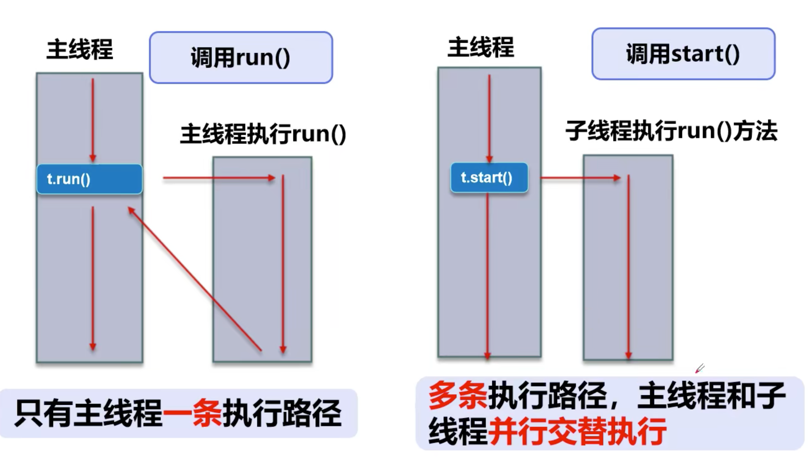
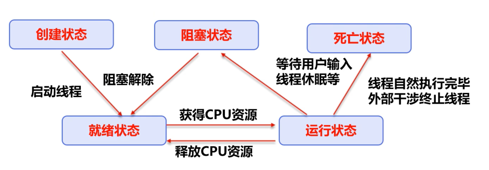
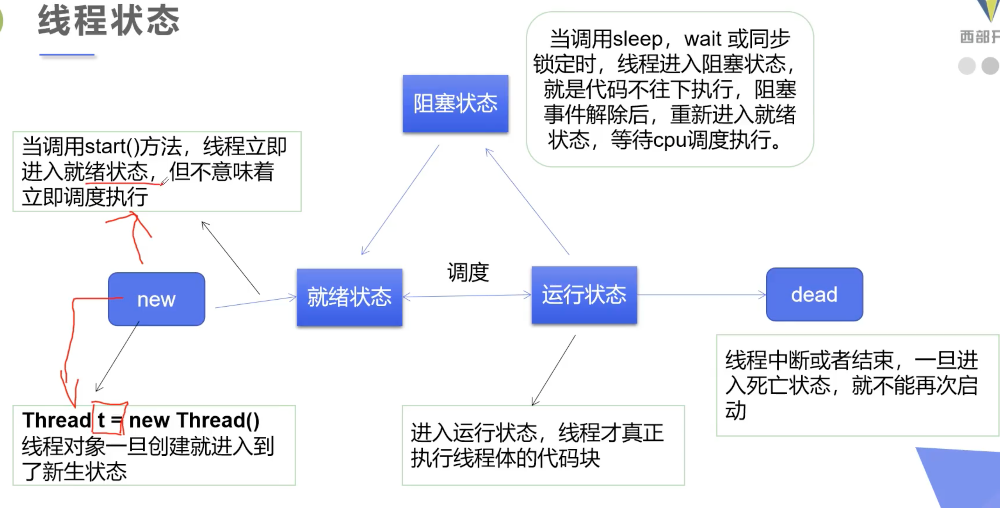
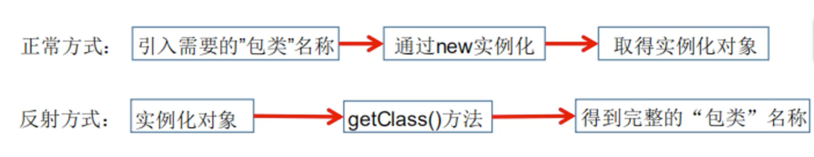
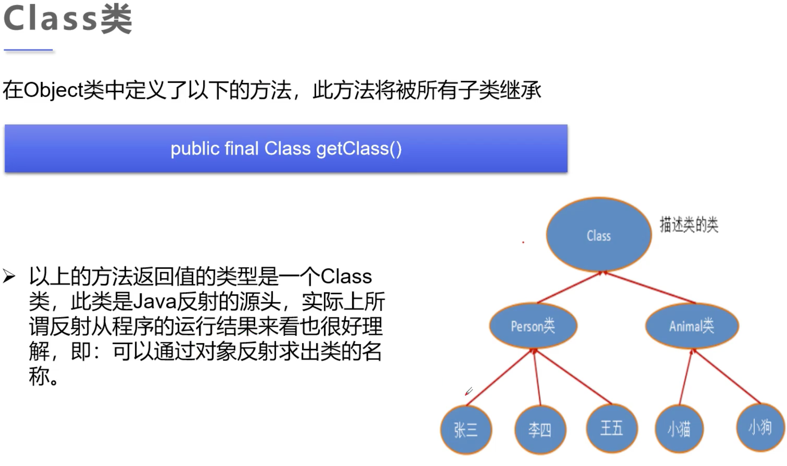
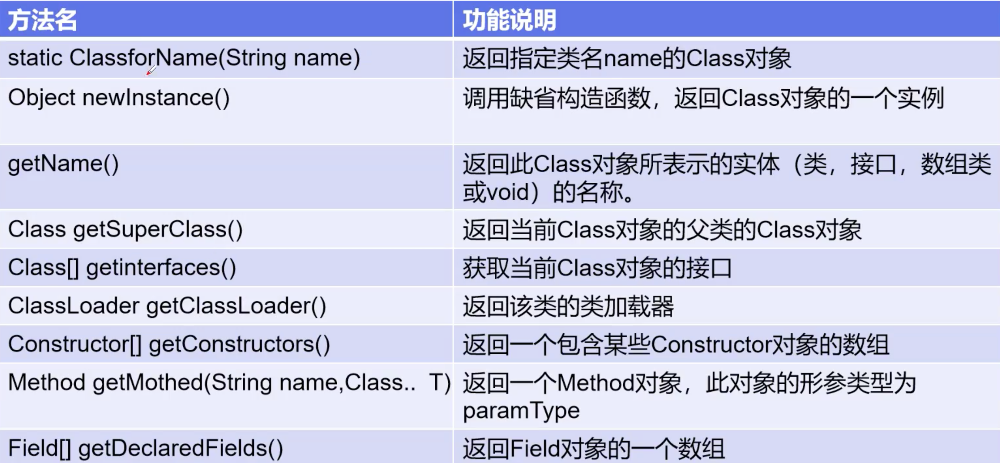

# Java基础

* JVM：虚拟机，让Java具备可移植性，在不同平台上可以运行
	* JavaSE：标准版（桌面程序，控制台开发）
	* JavaMe：微缩版
	* JavaEE：企业版（web端，服务器开发）
* 名词：
	* JDK（Java Development Kit）
	* JRE（Java Runtime Environment）
	* JVM（Java Virtual Machine）


## 1 多线程（java.thread）



* 进程和线程

	* 进程是执行程序的一次执行过程，是一个动态的概念，是系统资源分配的单位
	* 一个进程中可以存着多个线程，一个进程至少存在一个线程，线程是CPU调度和执行的单位

* 三种创建方式

	* 1 继承Thread类

		* 自定义线程类**继承Thread类**

		* 重写**run()**方法

		* 创建线程对象，调用**start()**方法启动线程

		* ```Java
			public class StartThread1 extends Thread {
			    // 线程入口点
			    @Override
			    public void run(){
			        // 线程体
			        for (int i = 0; i < 20; i++) {
			            System.out.println("I am listening " + i);
			        }
			    }
			}
			```

	* 2 实现Runnable接口

		* 定义MyRunnable类实现**Runnable**接口

		* 实现**run()**方法

		* 创建线程对象，调用**start()**方法启动线程

		* ```Java
			public class StartThread3 implements Runnable{
			    @Override
			    public void run(){
			        for (int i = 0; i < 20; i++) {
			            System.out.println("I am watching " + i);
			        }
			    }
			}
			```

	* 3 实现Callable接口

		* 实现Callable接口，需要返回值类型
		* 重写call，需要抛出异常
		* 创建目标对象
		* 创建执行任务 ExecutorService ser = Executors.newFixedThreadPool(1);
		* 提交执行：Future<Boolean> result1 = ser.submit(1);
		* 获取结果：boolean r1 = result1.get();
		* 关闭服务：ser.shutdownNow();


## 2 lambda

* lambda只有在一行代码的情况下可以简化括号

* 原因
	* 避免匿名内部类过多
	* 简化代码 
* 函数式接口的定义：
	* 任何接口，如果只包含唯一一个抽象方法，那就是一个**函数式接口**
	* 对于函数式接口，可以通过lambda表达式来创建该接口的对象

```java
/*
    推导lambda表达式
 */
public class TestLambda1 {
    // 3 静态内部类
    static class Like2 implements ILike{
        @Override
        public void lambda() {
            System.out.println("I love 静态内部类");
        }
    }
    public static void main(String[] args) {
        // 4 局部内部类
        class Like3 implements ILike{
            @Override
            public void lambda() {
                System.out.println("I love 局部内部类");
            }
        }
				
      	ILike like = null;
      
        like = new Like();
        like.lambda();

        like = new Like2();
        like.lambda();

        like = new Like3();
        like.lambda();

        // 5 匿名内部类，没有类的名称，必须借助接口或者父类
        like = new ILike() {
            @Override
            public void lambda() {
                System.out.println("I love 匿名内部类");
            }
        };
        like.lambda();

        // 6 lambda
        like = ()->{ System.out.println("I love lambda"); };
        like.lambda();
    }
}

// 1 定义一个函数式接口
interface ILike{
    void lambda();
}

// 2 实现类
class Like implements ILike{
    @Override
    public void lambda() {
        System.out.println("I love 类");
    }
}
```


## 3 线程的五大状态





* 线程的停止(Stop)

	* 建议线程正常停止，利用次数设置
	* 建议使用标志位
	* 不用stop和destroy等废弃的方法

* 线程的休眠(Sleep)

	* sleep指定当前线程阻塞的毫秒数
	* 存在异常InterruptedException
	* **每个对象都要一个锁，sleep不会释放锁**

* 线程的礼让(Yield)

	* 让当前正在执行的线程暂停，但不阻塞
	* 将线程从运行状态转为就绪状态
	* **让cpu重新调度，礼让不一定成功**！ 

* 线程的合并(join)

	* join合并线程，待此线程执行完成后，再执行其他线程，其他线程阻塞
	* 可以想象为**插队**

* 线程状态观测

	* New：尚未启动的线程处于此状态
	* Runnable：在Java虚拟机中执行的线程处于此状态
	* Blocked：被阻塞等待监视器锁定的线程处于此状态
	* Waiting：正在等待另一个线程执行特定动作的线程处于此状态
	* Timed_waiting：正在等待另一个线程执行动作达到指定等待时间的线程处于此状态
	* Terminated：已退出的线程处于此状态

* 线程优先级：

	* Java提供一个线程调度器来监控程序中启动后进入就绪状态的所有线程，线程调度器按照优先级觉得应该调度哪个线程来进行

	* 优先级用数字表示，范围从**1~10**

		* ```java 
			Thread.MIN_PRIORITY = 1;
			```

	* 改变或者获取优先级

		* ```java 
			getPriority()		setPriority(int xxx)	
			```

	* **优先级即使设定好，最后执行的情况依旧取决于CPU**，改的只是**概率**

* 守护线程(daemon)

	* 线程分为用户线程和守护线程
	* 虚拟机必须确保用户线程执行完毕
	* 虚拟机不用等待守护线程执行完毕
	* 如：后台记录日志，垃圾回收

* **并发**：同一个对象被多个线程同时操作 


## 4 线程同步

* **队列+锁**(synchronized)才能解决同步的安全性

* 同一进程的多个线程共享同一块存储空间，为保证数据在方法中被访问时的正确性，在访问时加入锁机制

	* 一个线程有锁会导致其他所有需要此锁的线程被挂起
	* 在多线程竞争下，加锁、释放锁会导致比较多的上下文切换和调度延时，引起性能问题
	* 如果一个优先级高的线程等待一个优先级低的线程释放锁，会导致**优先级倒置**，引起性能问题

* 同步方法：

	* 通过private关键字来保证数据对象只能被方法访问，所以只需要针对方法提出一套机制(**synchronized**)，它包括两种用法：synchronized方法和synchronized块

	```java 
	public synchronized void method(int args) {}
	```

	* Synchronized方法控制对“对象”的访问，每个对象对应一把锁，每个synchronized方法都必须获得调用该方法的对象的锁才能执行，否则线程会阻塞，方法一旦执行，就独占该锁，直到该方法返回才释放锁，后面被阻塞的线程才能获得这个锁，继续执行
	* 缺点：若将一个大的方法申明为synchronized将会影响效率 

* **死锁**：

	* 产生的四个必要条件：
		* 1 互斥条件：一个资源每次只能被一个进程使用
		* 2 请求与保持条件：一个进程因请求资源而阻塞时，对已获得的资源保持不放
		* 3 不剥夺条件：进程已获得的资源，在未使用完之前，不能强行剥夺
		* 4 循环等待条件：若干进程之间形成一种头尾相接的循环等待资源关系

* **Lock**(锁)

	* 从JDK5.0开始的线程同步机制--通过**显式定义同步锁对象**来实现同步，同步锁使用Lock对象充当
	* Java.util.concurrent.locks.Lock接口是控制多个线程对共享资源进行访问的工具。锁提供了对共享资源的独占访问，每次只能有一个线程对Lock对象加锁，线程开始访问共享资源之前应先获得Lock对象
	* ReentrantLock（可重入锁）类实现了Lock，拥有与synchronized相同的并发性和内存语义，在实现线程安全的控制中，比较常用的是ReentrantLock，可以显式加锁、释放锁

* synchronized和Lock的**对比**

	* Lock是**显式锁**（手动开启和关闭），synchronized是**隐式锁**，出了作用域就自动释放
	* Lock只有代码块锁，synchronized有代码块锁和方法锁
	* 使用Lock锁，JVM将花费较少的时间来调度线程，性能更好，并且具有更好的拓展性（提供更多的子类）
	* 优先级
		* Lock > 同步代码块（已经进入了方法体，分配了相应资源） > 同步方法（在方法体之外）
	
* 线程协作(生产者消费者问题)

	* 管程法：利用缓冲区解决
	* 信号灯法：标志位解决

* **线程池**：

	* 背景：经常创建和销毁、使用量特别大的资源，比如并发情况下的线程，对性能影响很大
	* 思路：提前创建好多个线程，放入线程池中，使用时直接获取，使用完放回池中，可以避免频繁创建销毁、实现重复利用
	* 优点：
		* 提高响应速度（减少创建新线程的时间）
		* 降低资源消耗（重复利用线程池中线程，不需要每次都创建）
		* 便于线程管理
			* corePoolSize：核心池的大小
			* maximumPoolSize：最大线程数
			* keepAliveTime：线程没有任务时最多保持多久时间后会终止
	* **ExecutorService**：真正的线程池接口，常见子类ThreadPoolExecutor
		* void execute(Runnable command)：执行任务/命令，没有返回值，一般用来执行Runnable
		* <T>Future<T> submit(Callable<T> task)：执行任务，有返回值，一般用来执行Callable
		* void shutdown()：关闭连接池
	* **Executors**：工具类、线程池的工厂类，用于创建并返回不同类型的线程池 


## 4 注解

* Annotation的作用：
	* 不是程序本身，可以对程序作出解释
	* 可以被其他程序读取
	* 以“**@注释名**”存在，可以添加一些参数值
	* 可以附加在package, class, method, field上面，相当于给他们添加了额外的辅助信息，可以通过**反射机制**编程实现对这些元数据的访问

### 4.1 内置注解

* **@Override**
	* 定义在java.lang.Override中，此注释只适用于修饰方法，表示一个方法声明打算重写超类中的另一个方法声明
* **@Deprecated**
	* 定义在java.lang.Deprecated中，此注释可以用于修饰方法，表示不鼓励使用
* **@SuppressWarnings**
	* 定义在java.lang.SuppressWarnings中，用来抑制编译时的警告信息
	* 与前两个注释有所不同，需要添加一个参数才能正确使用，参数都是定义好的
		* @SuppressWarnings("all")
		* @SuppressWarnings("unchecked")
		* @SuppressWarnings(value = {"unchecked", "deprecation"})

### 4.2 元注解

* 元注解的作用：负责注解其他注解，Java定义了4个标准的meta-annotation类型来提供对其他annotation类型作说明
* 这些类型和所支持的类在java.lang.annotation包中可以找到（**@Target**, **@Retention**, **@Documented**, **@Inherited**）
	* @Target：用于描述注解的使用范围
	* @Retention：表示需要在什么级别保存该注释信息，用于描述注解的生命周期（SOURCE < CLASS < **RUNTIME**）
	* @Document：说明该注解被包含在javadoc中
	* @Inherited：说明子类可以继承父类中的该注解

### 4.3 自定义注解

* 使用@interface自定义注解时，自动继承java.lang.annotation.Annotation接口
* 分析
	* @interface声明一个注解，格式为：public @interface 注解名{定义内容}
	* 其中的每一个方法实际上声明了一个**配置参数**，方法的名称就是参数的名称
	* 返回值类型就是参数的类型（返回值只能是**基本类型**，Class, String, enum）
	* 可以通过default来声明参数的默认值
	* 如果只有一个参数成员，一般参数名为value
	* 注解元素必须要有值，我们定义注解元素时，经常使用空字符串，0作为默认值


## 5 反射

* **静态语言和动态语言**
	* 动态语言是一类在**运行**时可以改变其**结构**的语言：例如新的函数、对象、甚至代码可以被引进，已有的函数可以被删除或是其他结构上的变化，即在运行时可以根据某些条件改变自身结构（Object-C、C#、JavaScript、PHP、Python）
	* 静态语言是运行时结构不可变的（Java、C、C++），Java具有一定的动态性，可以利用**反射机制**获得类似动态语言的特性
* Reflection是Java被视为动态语言的关键，反射机制允许程序在执行期借助于Reflection API取得任何类的**内部信息**，并能**直接操作**任意对象的内部属性及方法

```java
Class c = Class.forName("java.lang.String")
```

* 加载完类之后，在**堆内存的方法区**就产生了一个Class类型的对象（**一个类只有一个Class对象**），这个对象就包含了完整的类的结构信息。可以通过这个对象看到类的结构，这个对象就像一面镜子，透过这个镜子看到类的结构。所以被称之为反射



* **应用**
	* 在运行时判断一个对象所属的类
	* 在运行时构造任意一个类的对象
	* 在运行时判断任意一个类具有的成员变量和方法
	* 在运行时获取**泛型**信息
	* 在运行时调用任意一个对象的成员变量和方法
	* 在运行时处理**注解**
	* 生成**动态代理**
* **优缺点**
	* 优点：可以实现动态创建对象和编译，体现出很大的灵活性
	* 缺点：对**性能**有影响，使用反射基本上是一种解释机制，可以告诉JVM希望它做什么并满足我们的要求，这类操作总是**慢于**直接执行相同的操作



* **Class类**

	* 对象照镜子后可以得到的信息：某个类的属性、方法和构造器、某个类实现了哪些接口。对于每个类而言，JRE都为其保留了**一个不变的Class类型的对象**。一个Class对象包含了特定某个结构的有关信息

		* Class本身也是一个**类**，Class对象只能由系统建立对象
		* 一个加载的类在JVM中**只会有一个**Class实例
		* 一个Class对象对应的是一个加载到**JVM中的一个class文件**
		* 每个类的实例都会记得自己是由哪个Class实例所生成
		* 通过Class可以完整的得到一个类中的所有被加载的结构
		* Class类是Reflection的根源，针对任何想动态加载、运行的类，唯有先获得相应的Class对象

	* 

	* **获取Class类实例**

		* ```java
			Class c = Person.class	
			```

		* ```java
			Class c = person.getClass()
			```

		* ```java
			Class c = Class.forname("demo01.Person")
			```

		* 内置基本数据类型可以直接类名.Type

		* ClassLoader

	* **哪些类型有Class对象**

		* class：外部类，成员（成员内部类，静态内部类），局部内部类，匿名内部类
		* interface：接口
		* []：数组
		* Enum：枚举
		* Annotation：注解@interface
		* Primitive type：基本数据类型
		* void

	* **类的加载与ClassLoader的理解**

		* **加载**：将class文件字节码内容加载到内存中，并将这些静态数据转换成方法区的运行时数据结构，然后生成一个代表这个类的java.lang.Class对象
		* **链接**：将Java类的二进制代码合并到JVM的运行状态之中的过程
			* 验证：确保加载的类信息符合JVM规范，没有安全方面的问题
			* 准备：正式为类变量（static）分配内存并设置类变量默认初始值的阶段，这些内存都将在方法区中进行分配
			* 解析：虚拟机常量池内的符号引用（常量名）替换为直接引用（地址）的过程
		* **初始化**：
			* 执行类构造器<clinit>()方法的过程。
			* 当初始化一个类的时候，如果发现其父类还没有进行初始化，则需要先触发其父类的初始化
			* 虚拟机会保证一个类的<clinit>()方法在多线程环境中被正确加锁和同步

	* **什么时候会发生类初始化**

		* 主动引用（一定会发生初始化）
			* 当虚拟机启动，先初始化main方法所在的类
			* new一个类的对象
			* 调用类的静态成员（除了final常量）和静态方法
			* 使用Java.lang.reflect包的方法对类进行反射调用
			* 当初始化一个类，如果其父类没有被初始化，则先初始化父类
		* 被动引用（不会发生）
			* 当访问一个静态域时，只有真正声明这个域的类才会被初始化。如：当通过子类引用父类的静态变量，不会导致子类初始化
			* 通过数组定义类引用，不会触发此类的初始化
			* 引用常量不会触发类的初始化
		
	* **类加载器**：用来把类装载进内存的
	
		* 引导类加载器：用C++编写的，是JVM自带的类加载器，**负责Java平台核心库**，用来装载核心类库，该加载器无法直接获取
		* 扩展类加载器：负责jre/lib.ext目录下的jar包或-D java.ext.dirs指定目录下的jar包装入工作库
		* 系统类加载器：负责java -classpath或者-D java.class.path所指的目录下的类与jar包装入工作，是最常用的加载器
	
	* **Class对象的作用**
	
		* 创建类的对象：调用Class对象的newInstance()方法
	
			* 1类必须有一个无参的构造器
			* 2）类的构造器的访问权限需要足够
	
		* 如果没有无参构造器，只要在操作的时候明确调用类中的构造器，并将参数传递进去，可以实例化操作
	
			* 1）通过Class类的getDeclaredConstructor(Class ... parameterTypes)取得本类的指定形参类型的构造器
	
			* 2）向构造器的形参中传递一个对象数组进去，里面包含了构造器所需的各个参数
	
			* 3）通过Constructor实例化对象
	
			* ```java
				// 通过反射动态创建对象
				public class Test07 {
				    public static void main(String[] args) throws ClassNotFoundException, IllegalAccessException, InstantiationException, NoSuchMethodException, InvocationTargetException, NoSuchFieldException {
				        // 获得class对象
				        Class c1 = Class.forName("reflection.User");
				
				        // 通过构造器创建对象
				        Constructor constructor = c1.getDeclaredConstructor(String.class, int.class, int.class);
				        User user2 = (User)constructor.newInstance("CX", 1, 18);
				        System.out.println(user2);
				
				        // 通过反射调用普通方法
				        Method setName = c1.getDeclaredMethod("setName", String.class);
				        setName.invoke(user2, "xxx");                   // invoke:激活(对象，方法的值)
				        System.out.println(user2.getName());
				
				        // 通过反射操作属性，不能直接操作私有属性，需要关闭程序的安全检测
				        Field name = c1.getDeclaredField("name");
				        name.setAccessible(true);                              // 关闭权限检测
				        name.set(user2, "cx");
				        System.out.println(user2);
				    }
				}
				```
	
* **反射注解操作**：reflection.Test10.java


