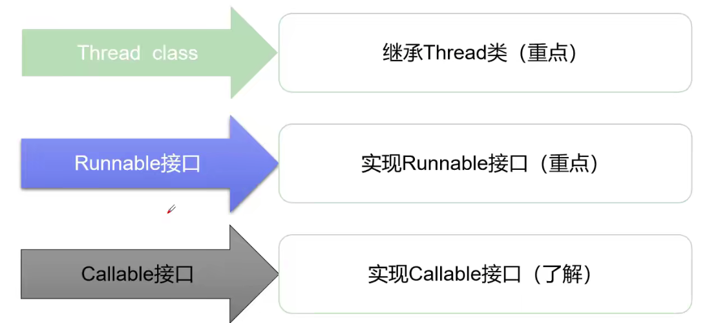
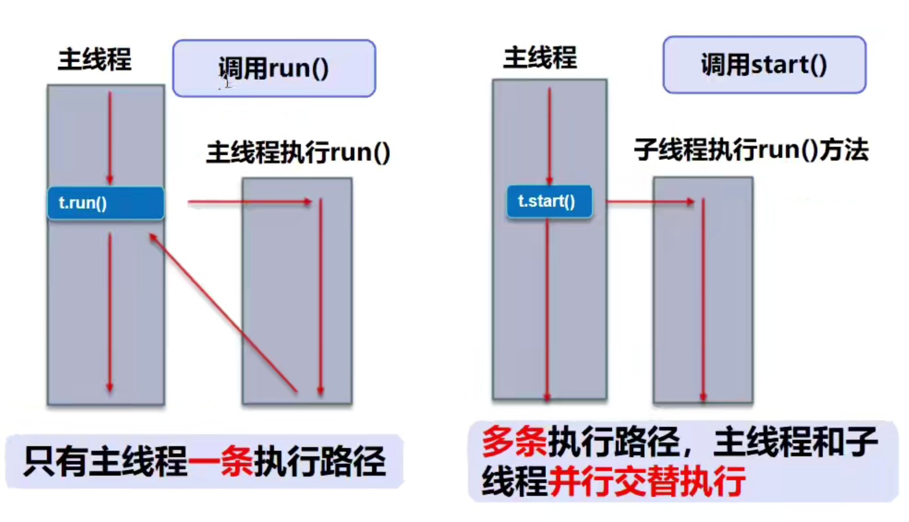
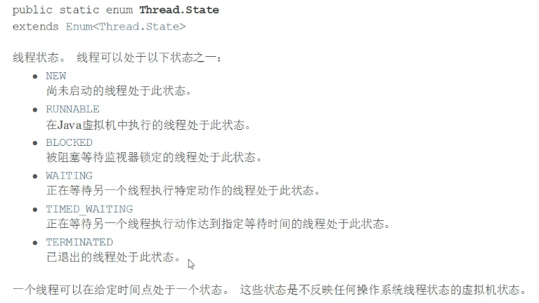

[TOC]

# 多线程并发编程

## 1 线程创建



### 1.1 Thread

> **静态代理**:
>
> ```java
> new Thread(() -> System.out.println('123')).start();
> new WeddingCompany(new You()).HappyMarry();
> ```

#### 1.1.1 创建方法

1. 新建一个类`TestThread1`继承`Thread`类
2. 重写`run`方法
3. 新建一个`TestThread1`对象，调用`start`方法执行

```java
package thread;

/**
 * @description: Thread创建线程
 * @author: Komorebi
 * @time: 2021/9/22 10:29
 */
public class TestThread1 extends Thread {
    @Override
    public void run() {
        System.out.println("测试Thread方式创建线程");
    }

    public static void main(String[] args) {
        TestThread1 t1 = new TestThread1();
        t1.start();
    }
}
```

#### 1.1.2 start和run的区别



* `start()`：启动一个新线程，在新的线程运行`run`方法中的代码，只能调用一次
* `run()`：新线程启动后会调用的方法，可以重复调用
* **直接调用 `run `是在主线程中执行了` run`，没有启动新的线程；而使用` start `是启动新的线程，通过新的线程间接执行` run `中的代码**

#### 1.1.3 练习：多线程下载图片

> 先下载commons-io包，添加到项目中，右键add as library，否则FileUtils会报错

```java
package thread;

import org.apache.commons.io.FileUtils;

import java.io.File;
import java.io.IOException;
import java.net.URL;

/**
 * @description: 练习Thread实现多线程同步下载图片
 * @author: Komorebi
 * @time: 2021/9/22 10:53
 */
public class TestThread2 extends Thread {
    private String url;
    private String name;

    public TestThread2(String url, String name) {
        this.url = url;
        this.name = name;
    }

    @Override
    public void run() {
        WebDownLoader webDownLoader = new WebDownLoader();
        webDownLoader.downloader(url, name);
        System.out.println("下载的文件名为：" + name);
    }

    public static void main(String[] args) {
        TestThread2 t1 = new TestThread2("http://static.komorebi.top/image-14.jpg", "test1.jpg");
        TestThread2 t2 = new TestThread2("http://static.komorebi.top/image-14.jpg", "test2.jpg");
        TestThread2 t3 = new TestThread2("http://static.komorebi.top/image-14.jpg", "test3.jpg");

        t1.start();
        t2.start();
        t3.start();
    }
}

class WebDownLoader {
    // 下载方法
    public void downloader(String url, String name) {
        try {
            FileUtils.copyURLToFile(new URL(url), new File(name));
        } catch (IOException e) {
            e.printStackTrace();
            System.out.println("IO异常，downloader方法出现问题");
        }
    }
}
```

### 1.2 Runnable

#### 1.2.1 创建方法

1. 新建一个类`TestThread3`实现`Runnable`接口
2. 重写`run`方法
3. 新建一个`TestThread3`对象，**通过线程对象来开启线程**，调用`start`方法执行

```java
package thread;

/**
 * @description: Runnable接口创建线程
 * @author: Komorebi
 * @time: 2021/9/27 10:18
 */
public class TestThread3 implements Runnable {
    @Override
    public void run() {
        System.out.println("测试Runnable接口创建线程");
    }

    public static void main(String[] args) {
        TestThread3 t1 = new TestThread3();

        // 创建线程对象，通过线程对象来开启线程，代理
        Thread t = new Thread(t1);
        t.start();
    }
}
```

#### 1.2.2 练习：模拟多用户买票

```java
package thread;

/**
 * @description: 模拟多用户买票场景
 * @author: Komorebi
 * @time: 2021/9/27 10:35
 */
public class TestThread4 implements Runnable {
    private int ticketNums = 10;

    @Override
    public void run() {
        while (true) {
            if (ticketNums <= 0) {
                break;
            }

            // 模拟延时
            try {
                Thread.sleep(200);
            } catch (InterruptedException e) {
                e.printStackTrace();
            }

            System.out.println(Thread.currentThread().getName() + "-->" + ticketNums--);
        }
    }

    public static void main(String[] args) {
        TestThread4 ticket = new TestThread4();

        new Thread(ticket, "用户A").start();
        new Thread(ticket, "用户B").start();
        new Thread(ticket, "用户C").start();
    }
}
```

**问题：会出现-1，多个线程操作同一个资源，数据紊乱，线程不安全**

#### 1.2.3 练习：龟兔赛跑

```java
package thread;

/**
 * @description: 模拟龟兔赛跑
 * @author: Komorebi
 * @time: 2021/10/7 10:26
 */
public class Race implements Runnable{
    private static String winner;

    @Override
    public void run() {
        for (int i = 0; i <= 100; i++) {
            if (Thread.currentThread().getName().equals("兔子") && (i + 1) % 10 == 0) {
                try {
                    Thread.sleep(2);
                } catch (InterruptedException e) {
                    e.printStackTrace();
                }
            }
            // 判断比赛是否结束，如果结束了，就停止程序
            boolean flag = gameOver(i);
            if (flag) {
                break;
            }
            System.out.println(Thread.currentThread().getName() + "跑了" + i + "步");
        }
    }

    // 判断是否完成比赛
    private boolean gameOver(int steps) {
        // 判断是否有胜利者
        if (winner != null) {
            return true;
        }
        if (steps >= 100) {
            winner = Thread.currentThread().getName();
            System.out.println("winner is " + winner);
            return true;
        }
        return false;
    }

    public static void main(String[] args) {
        Race race = new Race();
        new Thread(race, "兔子").start();
        new Thread(race, "乌龟").start();
    }
}
```

### 1.3 Callable

> * 可以定义返回值
> * 可以抛出异常

#### 1.3.1 创建方法

1. 实现`Callable`接口，需要返回值类型
2. 重写`call`方法，需要抛出异常
3. 创建目标对象
4. 创建执行服务：`ExecutorService ser = Executors.newFixedThreadPool(1);`
5. 提交执行：`Future<Boolean> result1 = ser.submit(t1);`
6. 获取结果：`boolean r1 = result1.get();`
7. 关闭服务：`ser.shutdownNow();`

#### 1.3.2 练习：多线程下载图片

```java
package thread;

import java.util.concurrent.*;

/**
 * @description: Callable接口创建线程
 * @author: Komorebi
 * @time: 2021/10/7 10:49
 */
public class TestThread5 implements Callable<Boolean> {
    private String url;
    private String name;

    public TestThread5(String url, String name) {
        this.url = url;
        this.name = name;
    }

    @Override
    public Boolean call() throws Exception {
        WebDownLoader webDownLoader = new WebDownLoader();
        webDownLoader.downloader(url, name);
        System.out.println("下载的文件名为：" + name);
        return true;
    }

    public static void main(String[] args) throws ExecutionException, InterruptedException {
        TestThread5 t1 = new TestThread5("http://static.komorebi.top/image-14.jpg", "test1.jpg");
        TestThread5 t2 = new TestThread5("http://static.komorebi.top/image-14.jpg", "test2.jpg");
        TestThread5 t3 = new TestThread5("http://static.komorebi.top/image-14.jpg", "test3.jpg");

        // 创建执行服务
        ExecutorService ser = Executors.newFixedThreadPool(3);

        // 提交执行
        Future<Boolean> r1 = ser.submit(t1);
        Future<Boolean> r2 = ser.submit(t2);
        Future<Boolean> r3 = ser.submit(t3);

        // 获取结果
        boolean rs1 = r1.get();
        boolean rs2 = r2.get();
        boolean rs3 = r3.get();

        // 关闭服务
        ser.shutdownNow();
    }
}
```


## 2 Lambda

> **使用前提**：必须是函数式接口，即接口中只有一个函数

### 2.1 lambda表达式推导

* 函数式接口 -> 实现类 -> 静态内部类 -> 局部内部类 -> 匿名内部类 -> Lambda

```java
package thread;

/**
 * @description: 推导Lambda表达式
 * @author: Komorebi
 * @time: 2021/10/8 09:19
 */
public class LambdaTest {
    // 3 静态内部类
    static class Like2 implements ILike {
        @Override
        public void lambda() {
            System.out.println("I Like Lambda2");
        }
    }
    public static void main(String[] args) {
        ILike like = new Like();        // 测试2
        like.lambda();

        like = new Like2();             // 测试3
        like.lambda();

        // 4 局部内部类
        class Like3 implements ILike {
            @Override
            public void lambda() {
                System.out.println("I Like Lambda3");
            }
        }

        like = new Like3();             // 测试4
        like.lambda();

        // 5 匿名内部类：没有类的名称，必须借助接口或者父类
        like = new ILike() {
            @Override
            public void lambda() {
                System.out.println("I Like Lambda4");
            }
        };
        like.lambda();

        // 6 用lambda简化
        like = () -> {
            System.out.println("I Like Lambda5");
        };
        like.lambda();
    }
}

// 1 定义一个函数式接口
interface ILike {
    void lambda();
}

// 2 实现类
class Like implements ILike {
    @Override
    public void lambda() {
        System.out.println("I Like Lambda");
    }
}
```


## 3 线程状态 




|             方法              |                    说明                    |
| :---------------------------: | :----------------------------------------: |
| setPriority(int newPriority)  |              更改线程的优先级              |
| static void sleep(long mills) |  在指定的毫秒数内让当前正在执行的线程休眠  |
|          void join()          |               等待该线程终止               |
|      static void yield()      | 暂停当前正在执行的线程对象，并执行其他线程 |
|       void interrupt()        |           中断线程（不推荐使用）           |
|       boolean isAlive()       |          测试线程是否处于活动状态          |

### 3.1 线程停止

> 1. 建议线程正常停止：利用次数，不建议死循环
> 2. 建议使用标志位：设置一个标志位
> 3. 不要使用stop或者destroy等过时或JDK不建议使用的方法

```java
package thread.status;

/**
 * @description: 测试stop方法
 * @author: Komorebi
 * @time: 2021/10/8 09:59
 */
public class TestStop implements Runnable{
    // 1 设置一个标志位
    private boolean flag = true;

    @Override
    public void run() {
        int i = 0;
        while (flag) {
            System.out.println("Thread is running -> " + i++);
        }
    }

    // 2 设置一个公开的方法停止线程，转换标志位
    public void stop() {
        this.flag = false;
    }

    public static void main(String[] args) {
        TestStop testStop = new TestStop();

        new Thread(testStop).start();

        for (int i = 0; i < 1000; i++) {
            System.out.println("main -> " + i);
            if (i == 900) {
                testStop.stop();       // 调用stop方法切换标志位，让线程停止
                System.out.println("Thread stopped");
            }
        }
    }
}
```

### 3.2 线程休眠_sleep

> 1. sleep指定当前线程阻塞的毫秒数
> 2. sleep存在异常InterruptedException
> 3. sleep时间达到后线程进入就绪状态
> 4. sleep可以模拟网络延时、倒计时等
> 5. **每一个对象都有一个锁，sleep不会释放锁**

* 模拟网络延时

```java
package thread.status;

import thread.create.TestThread4;

/**
 * @description: sleep模拟网络延时
 * @author: Komorebi
 * @time: 2021/10/9 09:40
 */
public class TestSleep implements Runnable {
    private int ticketNums = 10;

    @Override
    public void run() {
        while (true) {
            if (ticketNums <= 0) {
                break;
            }

            // 模拟延时
            try {
                Thread.sleep(1000);
            } catch (InterruptedException e) {
                e.printStackTrace();
            }

            System.out.println(Thread.currentThread().getName() + "-->" + ticketNums--);
        }
    }

    public static void main(String[] args) {
        TestThread4 ticket = new TestThread4();

        new Thread(ticket, "用户A").start();
        new Thread(ticket, "用户B").start();
        new Thread(ticket, "用户C").start();
    }
}
```

* 模拟倒计时

```java
package thread.status;

import java.text.SimpleDateFormat;
import java.util.Date;

/**
 * @description: sleep模拟倒计时
 * @author: Komorebi
 * @time: 2021/10/9 09:43
 */
public class TestSleep2 {
    public static void tenDown() {
        // 打印当前系统时间
        Date startTime = new Date(System.currentTimeMillis()); // 获取系统当前时间
        int num = 10;

        while (true) {
            try {
                Thread.sleep(1000);
                System.out.println(new SimpleDateFormat("HH:mm:ss").format(startTime) + " -> " + num--);
                startTime = new Date(System.currentTimeMillis());
                if (num == 0) {
                    break;
                }
            } catch (InterruptedException e) {
                e.printStackTrace();
            }
        }
    }

    public static void main(String[] args) {
        tenDown();
    }
}
```

### 3.3 线程礼让_yield

> 1. 礼让线程，让当前正在执行的线程暂停，但不阻塞
> 2. 将线程从运行状态转换为就绪状态
> 3. 让CPU重新调度，**礼让不一定成功**

```java
package thread.status;

/**
 * @description: yield测试礼让线程
 * @author: Komorebi
 * @time: 2021/10/9 10:42
 */
public class TestYield {
    public static void main(String[] args) {
        MyYield myYield = new MyYield();

        new Thread(myYield, "a").start();
        new Thread(myYield, "b").start();
    }
}

class MyYield implements Runnable {
    @Override
    public void run() {
        System.out.println("Thread start: " + Thread.currentThread().getName());
        Thread.yield();
        System.out.println("Thread end: " + Thread.currentThread().getName());
    }
}
```

### 3.4 线程强制执行_join

> 1. join合并线程，待此线程执行完成后，再执行其他线程
> 2. 可以想象成插队

```java
package thread.status;

/**
 * @description: join测试强制执行线程
 * @author: Komorebi
 * @time: 2021/10/9 11:02
 */
public class TestJoin implements Runnable {
    @Override
    public void run() {
        for (int i = 0; i < 1000; i++) {
            System.out.println("join..." + i);
        }
    }

    public static void main(String[] args) throws InterruptedException {
        TestJoin testJoin = new TestJoin();
        Thread thread = new Thread(testJoin);
        thread.start();

        for (int i = 0; i < 500; i++) {
            if (i == 200) {
                thread.join();
            }
            System.out.println("main..." + i);
        }
    }
}
```

### 3.5 观察测试线程状态

```java
package thread.status;

/**
 * @description: 观察测试线程状态
 * @author: Komorebi
 * @time: 2021/10/9 11:11
 */
public class TestStatus {
    public static void main(String[] args) throws InterruptedException {
        Thread thread = new Thread(() -> {
            for (int i = 0; i < 3; i++) {
                try {
                    Thread.sleep(1000);
                } catch (InterruptedException e) {
                    e.printStackTrace();
                }
            }
            System.out.println("Over");
        });

        // 观察状态
        Thread.State state = thread.getState();
        System.out.println(state);      // NEW

        // 观察启动后
        thread.start();
        state = thread.getState();
        System.out.println(state);      // RUNNABLE

        while (state != Thread.State.TERMINATED) {      // 只要线程不终止，就一直输出状态
            Thread.sleep(100);
            state = thread.getState();
            System.out.println(state);
        }
    }
}
```

### 3.6 线程优先级

> **优先级低只是意味着获得调度的概率低.并不是优先级低就不会被调用了.这都是看CPU的调度**
>
> 1. Java提供一个线程调度器来监控程序中**启动后进入就绪状态**的所有线程，线程调度器按照优先级决定应该调度哪个线程来执行
> 2. 线程的优先级用数字表示，范围从1-10
> 	1. Thread.MIN_PRIORITY = 1;
> 	2. Thread.MAX_PRIORITY = 10;
> 	3. Thread.NORM_PRIORITY = 5;
> 3. 使用以下方式改变或获取优先级
> 	1. getPriority()
> 	2. setPriority()

```java
package thread.status;

/**
 * @description: 测试线程优先级
 * @author: Komorebi
 * @time: 2021/10/9 11:23
 */
public class TestPriority {
    public static void main(String[] args) {
        // 主线程默认优先级
        System.out.println(Thread.currentThread().getName() + "-->" + Thread.currentThread().getPriority());

        MyPriority myPriority = new MyPriority();

        Thread t1 = new Thread(myPriority);
        Thread t2 = new Thread(myPriority);
        Thread t3 = new Thread(myPriority);

        // 先设置优先级，再启动
        t1.start();;

        t2.setPriority(1);
        t2.start();

        t3.setPriority(Thread.MAX_PRIORITY);
        t3.start();
    }
}

class MyPriority implements Runnable {
    @Override
    public void run() {
        System.out.println(Thread.currentThread().getName() + "-->" + Thread.currentThread().getPriority());
    }
}
```

### 3.7 守护(daemon)线程

> 1. 线程分为**用户线程**和**守护线程**
> 2. 虚拟机必须确保**用户线程（main）**执行完毕
> 3. 虚拟机不用等待**守护线程（gc）**执行完毕
> 4. 如：后台记录操作日志、监控内存和垃圾回收等

```java
package thread.status;

/**
 * @description: 测试守护线程
 * @author: Komorebi
 * @time: 2021/10/9 15:56
 */
public class TestDaemon {
    public static void main(String[] args) {
        God god = new God();
        You you = new You();

        Thread thread = new Thread(god);
        thread.setDaemon(true);     // 默认是false，表示是用户线程，正常的线程都是用户线程

        thread.start();             // 上帝守护线程启动

        new Thread(you).start();    // 你，用户线程启动
    }
}

// God
class God implements Runnable {
    @Override
    public void run() {
        while (true) {
            System.out.println("God bless you");
        }
    }
}

// You
class You implements Runnable {
    @Override
    public void run() {
        for (int i = 0; i < 30000; i++) {
            System.out.println("Living");
        }
        System.out.println("Game Over!");
    }
}
```


## 4 线程同步

> 多个线程操作同一个资源，并发问题

### 4.1 不安全案例

* 卖票超卖问题

```java
package thread.synchronization;

/**
 * @description: 不安全的买票案例
 * @author: Komorebi
 * @time: 2021/10/18 14:39
 */
public class UnsafeBuyTicket {
    public static void main(String[] args) {
        BuyTicket station = new BuyTicket();

        new Thread(station, "A").start();
        new Thread(station, "B").start();
        new Thread(station, "C").start();
    }
}

class BuyTicket implements Runnable {
    int ticketNums = 10;
    boolean flag = true;        // 外部停止方式

    @Override
    public void run() {
        while (flag) {
            buy();
        }
    }

//    private void buy() {
    private synchronized void buy() {
        // 判断是否有票
        if (ticketNums <= 0) {
            flag = false;
            return;
        }

        try {
            Thread.sleep(100);
        } catch (InterruptedException e) {
            e.printStackTrace();
        }
        System.out.println(Thread.currentThread().getName() + "-->" + ticketNums--);
    }
}
```

### 4.2 同步方法

> * 由于我们可以通过private关键字来保证数据对象只能被方法访问，所以我们只需要针对方法提出一套机制，这套机制就是synchronized关键字，它包括两种用法：`synchronized`方法和`synchronized`块.
> 	* 同步方法：`public synchronized void method(int args){}`
> * `synchronized`方法控制对“对象”的访问，每个对象对应一把锁，每个`synchronized`方法都必须获得调用该方法的对象的锁才能执行，否则线程会阻塞，方法一旦执行，就独占该锁，直到该方法返回才释放锁，后面被阻塞的线程才能获得这个锁，继续执行
> 	* 缺陷：若将一个大的方法申明为synchronized将会影响效率

同步块：synchronized （Obj）{}

* Obj称之为同步监视器
	* Obj可以是任何对象，但是推荐使用共享资源作为同步监视器
	* 同步方法中无需指定同步监视器，因为同步方法的同步监视器就是this，就是这个对象本身，或者是class
	* 同步监视器的执行过程
		1. 第一个线程访问，锁定同步监视器，执行其中代码.
		2. 第二个线程访问，发现同步监视器被锁定，无法访问.
		3. 第一个线程访问完毕，解锁同步监视器，
		4. 第二个线程访问，发现同步监视器没有锁，然后锁定并访问

```java
package thread.synchronization;

/**
 * @description: 不安全的取钱案例
 * @author: Komorebi
 * @time: 2021/10/18 16:41
 */
public class UnsafeBank {
    public static void main(String[] args) {
        Account account = new Account(100, "结婚基金");

        Drawing you = new Drawing(account, 50, "你");
        Drawing girlFriend = new Drawing(account, 100, "girlFriend");

        you.start();
        girlFriend.start();
    }
}

class Account {
    int money;
    String name;

    public Account(int money, String name) {
        this.money = money;
        this.name = name;
    }
}

class Drawing extends Thread {
    Account account;
    int drawingMoney;
    int nowMoney;

    public Drawing(Account account, int drawingMoney, String name) {
        super(name);
        this.account = account;
        this.drawingMoney = drawingMoney;
    }

    @Override
    public void run() {
        // 锁的对象就是变化的量，默认是this
        synchronized (account) {
            if (account.money - drawingMoney < 0) {
                System.out.println(Thread.currentThread().getName() + "钱不够");
                return;
            }

            try {
                Thread.sleep(1000);
            } catch (InterruptedException e) {
                e.printStackTrace();
            }

            account.money = account.money - drawingMoney;
            nowMoney = nowMoney + drawingMoney;

            System.out.println(account.name + "余额为：" + account.money);
            System.out.println(this.getName() + "手里的钱：" + nowMoney);
        }
    }
}
```

* 线程不安全的集合（CopyOnWriteArrayList可以达到一样效果）

```java
package thread.synchronization;

import java.util.ArrayList;
import java.util.List;

/**
 * @description: 线程不安全的集合案例
 * @author: Komorebi
 * @time: 2021/10/18 16:57
 */
public class UnsafeList {
    public static void main(String[] args) {
        List<String> list = new ArrayList<>();

        for (int i = 0; i < 1000; i++) {
            new Thread(() -> {
               synchronized (list) {
                   list.add(Thread.currentThread().getName());
               }
            }).start();
        }

        System.out.println(list.size());
    }
}
```

