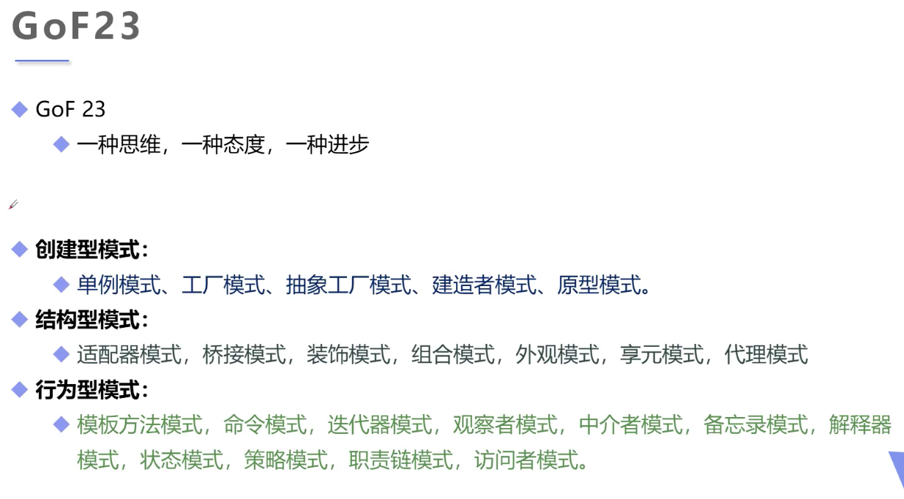
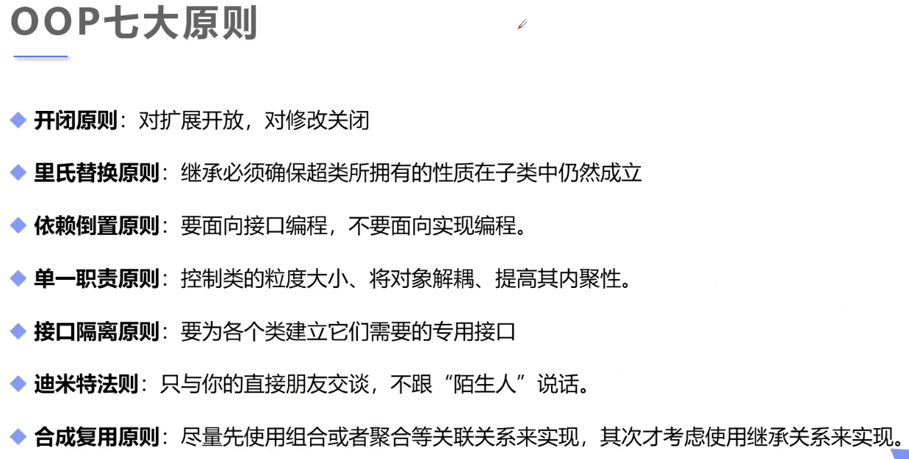

# 23种设计模式





## 1 单例模式

* **饿汉式**

	```java
	public class Hungry{
		private Hungry(){}
	    
	    private final static Hungry HUNGRY = new Hungry();
    
	    public static Hungry getInstance(){
	        return HUNGRY
	    }
	}
	```
	
* **DCL懒汉式**

	```Java
	 public class LaztMan{
	     private LazyMan(){}
	     
	     private static LazyMan lazyMan;
	     
	     public LazyMan getInstance(){
	         if (lazyMan == null){
	             lazyMan = new LazyMan();
	         }
	         return lazyMan;
	     }
	 }
	```

* **单例不安全，因为反射**

