# Latex笔记

## IEEE模板

* **bare_conf.tex：conference**
* **bare_jrnl.tex： journal**
* **bare_jrnl_comsoc.tex：IEEE Communications Society journal**
* **bare_conf_compsoc.tex： IEEE Computer Society conference**
* **bare_jrnl_compsoc.tex：IEEE Computer Society journal**
* **bare_jrnl_transmag.tex： IEEE Transaction on Magnetics paper**

## 建立文档

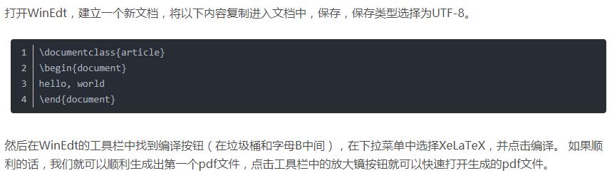

## 标题、作者和注释

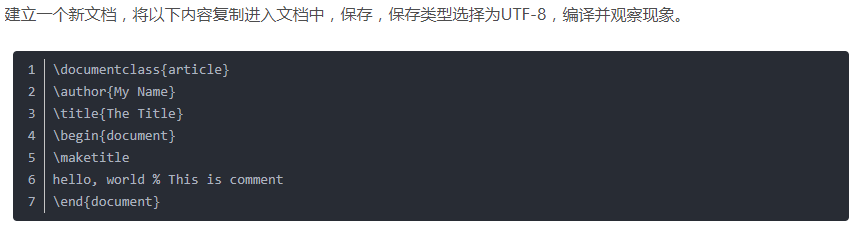

## 章节和段落

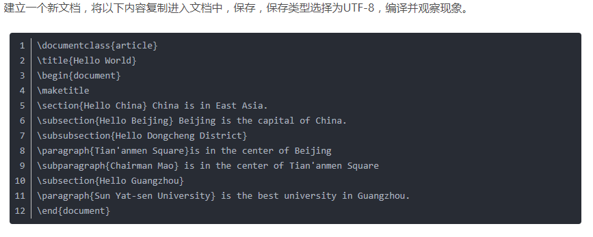

## 脚注

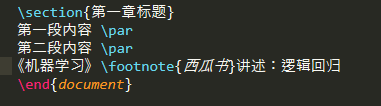

## 换字体、引用

* 以下例子为换成**楷体**

## 加入目录

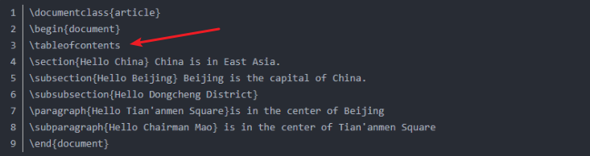

## 换行

* 就是在要换行的地方加 **\par**，或者**空一行**

## 插入图片

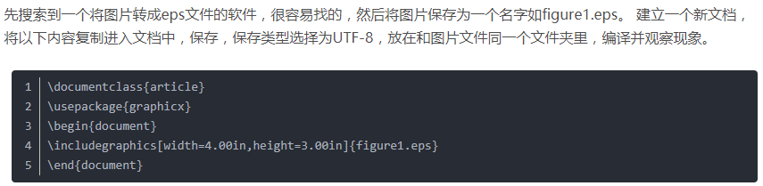

* 最开始要引入包，**usepackage{graphicx}**
* 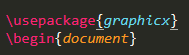
* 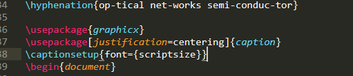
* 

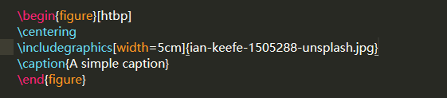

## 简单表格

* 表格名字写上面，**caption**
* **hline**指水平线
* 每两个数据之间用**&**隔开

## 有序列表

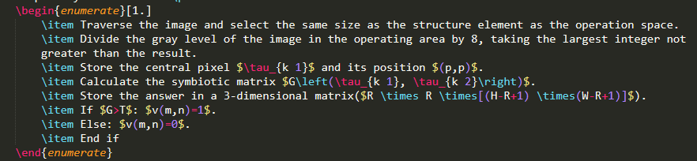

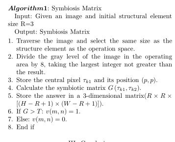

## 公式

* 行内公式
  * 当需要进行一个行内的公式的时候，比如说**sin**
  * 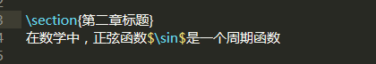
* 行间公式
  * 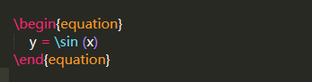

## 交叉引用

* 在caption后加上**\label{}**，指明名称
* 在需要引用的位置写**\ref{名称}**
* **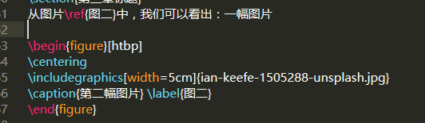**

## 结尾

google

