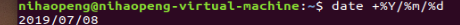
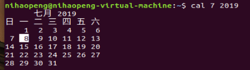
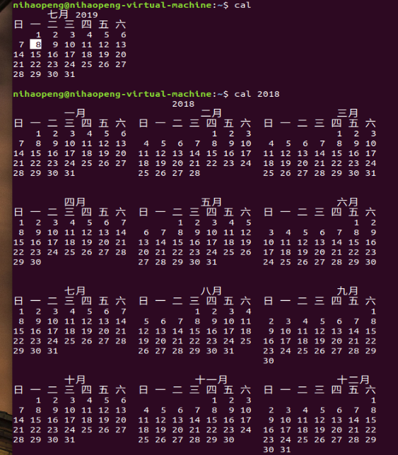
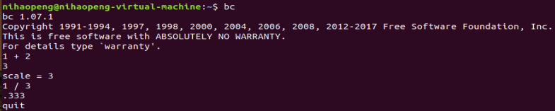

# Linux命令行

* 退出命令行：**exit**

* 显示日期和时间：**date**

* 显示日历的命令：**cal [month] [year]**

* 简单计算器：**bc**		退出计算器：**quit**

* tab具有命令补全与文件补齐的功能，避免打错命令或者文件名
  * 接在一串命令的第一个字段后面，则为**命令补全**
  * 接在一串命令的第二个字段后面，则为**文件补齐**
* 中断目前程序： **ctrl + C**
* 上下翻页：shift + 上/下
* 求助：
  * 命令 + —help
  * man + 命令

## 文件权限（ls -al）

* 第一栏代表文件的**类型和权限**
  * 第一个字符代表这个文件是**目录、文件或者链接文件**等
    * [d]则为目录
    * [-]则为文件
    * [l]则表示为链接文件（link file）
    * [b]则表示为设备文件里面的可供存储的周边设备（可按块随机读写的设备）
    * [c]则代表设备文件里面的串行端口设备，例如键盘、鼠标
  * 接下来的字符中，以三个为一组，且均为[rwx]的三个参数的组合，代表：**可读、可写、可执行**，这三个权限的位置不会改变，若无这一权限，会用[-]表示
    * 第一组是文件拥有者可具备的权限
    * 第二组为加入此用户组账号的权限
    * 第三组为非本人且并没有加入本用户组的其他账号的权限
* 第二栏表示有多少文件名链接到此节点（node）
* 第三栏表示这个文件的**拥有者账号**
* 第四栏表示这个文件的**所属用户组**
* 第五栏表示这个文件的**容量大小**，默认单位为Bytes
* 第六栏表示这个文件的**创建日期或是最近的修改日期**

## 修改文件属性与权限（P157）

* **chgrp**：修改文件所属用户组（change group）
* **chown**：修改文件拥有者
* **chmod**：修改文件的权限，SUID、SGID、SBIT等的特性
  * 文件基本权限有9个：owner、group、others，每种对应的read、write、execute
  * 权限数字对照表：r, 4; w, 2; x, 1，即[-rwxrwx—]对应为770
  * 符号类型修改文件权限

