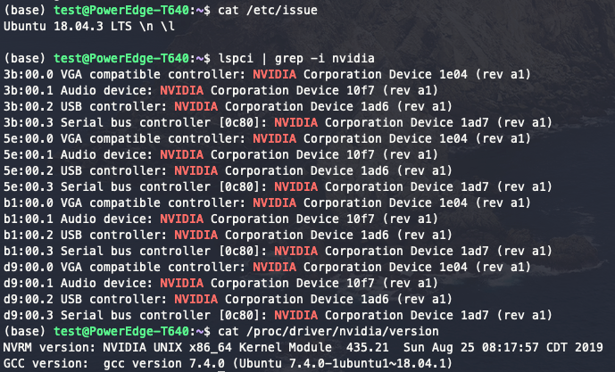
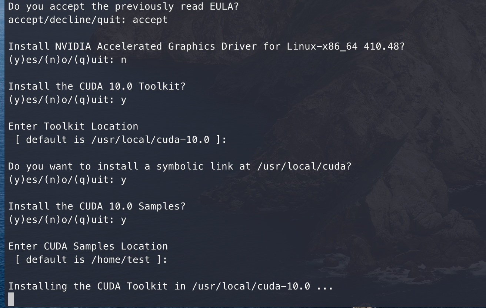

### Linux安装CUDA10.0

#### 查看设备信息

* 查看操作系统

```shell
cat /etc/issue
```

* 查看显卡

```shell
nvidia-smi
```

* 查看显卡驱动

```shell
cat /proc/driver/nvidia/version
```

* 查看CUDA版本

```shell
cat /usr/local/cuda/version.txt
```

* 查看CUDNN版本

```shell
cat /usr/local/cuda/include/cudnn.h | grep CUDNN_MAJOR -A 2
```




### 安装CUDA

* 下载地址 https://developer.nvidia.com/cuda-toolkit-archive
* 
* 多版本CUDA的转换

```shell
# 删除旧版本的软连接
sudo rm -rf cuda
# 建立新版本的软连接，前面的路径是需要的版本的cuda的安装路径
sudo ln -s /usr/local/cuda-9.1 /usr/local/cuda  
```

* 安装

	* **sudo sh cuda-123123.run**
	* 
	* 环境变量：**vim ~/.bashrc**

	```shell
	export PATH=/usr/local/cuda/bin${PATH:+:${PATH}}
	export LD_LIBRARY_PATH=/usr/local/cuda/lib64${LD_LIBRARY_PATH:+:${LD_LIBRARY_PATH}}
	export CUDA_HOME=/usr/local/cuda
	```

	* **source ~/.bashrc**

### 安装CUDNN

* 下载地址 https://developer.nvidia.com/rdp/cudnn-archive

* 解压cudnn-10.0-linux-x64-v7.5.0.56.tgz：tar -xzvf  cudnn-10.0-linux-x64-v7.5.0.56.tgz

	```shell
	tar -xzvf  cudnn-10.0-linux-x64-v7.5.0.56.tgz
	```

	* ```shell
		    $ sudo cp cuda/include/cudnn.h /usr/local/cuda/include
		    $ sudo cp cuda/lib64/libcudnn* /usr/local/cuda/lib64
		    $ sudo chmod a+r /usr/local/cuda/include/cudnn.h /usr/local/cuda/lib64/libcudnn*
		```

* 验证

```shell
cat /usr/local/cuda/include/cudnn.h | grep CUDNN_MAJOR -A 2
```

