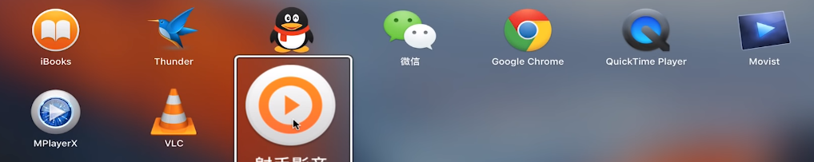

# Mac os

* 最下面的白框叫docker栏，存放常用软件
* mac的最大化窗口实际上是重新开了一个桌面并用这个窗口填充，可以通过四指操作将其切换桌面
* 左上角的x并不是真正的完全关闭，而是保留了软件启动所必须的文件，在图标上右键**退出**就能真正的关闭这个软件
* mac中的**复制**只是完全复制一个相同的副本，**拷贝**才和windows中的复制是一样的

## 触摸板手势

 logo—系统偏好设置—触摸板

* 三指：拖动窗口或者文件
* 四指上划：打开后台
* 四指左右滑动：快速切换桌面
* 五指合拢：打开目录（类似于开始菜单）**launchpad**

## launchpad

* 长按类似于手机卸载软件
* 拖动可以将两个软件合并到一个文件夹中

## Dock

* 打开一个软件时，会在dock栏中显示，可以**右键**选择是否显示，何时显示

## Finder

* 类似于**我的电脑**
* 个人收藏里面的桌面、下载、应用程序都是常规
* 用来改变文件呈现形式
* 标记：
  * 将每种颜色标记右键可以重命名
  * 找到自己想标记的文件夹或者文件，右键标记
  * 可以将自己的文件夹高效的进行管理和分类

## 快捷键

* option = alt
* command = ctrl
* **复制**：command + C   **粘贴**： command + V    **剪切**：command + option + V
* **撤销**：command + Z 
* **取消撤销**：command + shift + Z
* **全选**：command + A
* **截取整个屏幕**： command + shift + 3
* **截取部分屏幕**： command + shift + 4
* **删除文件**： command + delete
* **关闭**：command + W            **退出**：command + Q
* **新建**： command + N
* **最小化窗口**： command + M
* **退格**：fn + delete
* **显示隐藏文件**：command + shift + .

##  iCloud

* 系统偏好设置-图标-输入ID-选择自己想同步的资料

## App Store

* 软件安装包后缀名：dmg  pkg  zip  tar
* 
* 

## 自带软件

* 选中pdf--预览--可以编辑
* 浏览器：
  * 谷歌
  * 自带
* 视频播放软件
* unarchiver（压缩文件软件）
  * 只能解压缩，压缩操作则依旧是原来的zip
* Tuxera
  * NTFS硬盘格式属于微软
  * 格式化硬盘为MS-DOS(FAT)格式
* iStat Menus
  * 状态栏显示温度、上网速度等
* cleanMyMac 3
* Moom
  * 分屏，需要常驻后台才行 

电影：复联4  

书：活着

队：火箭