[TOC]


# MySQL笔记

* 安装教程：https://www.cnblogs.com/myxq666/p/7787744.html
* 配置Navicat：https://www.cnblogs.com/shenlaiyaoshi/p/8687105.html
	* 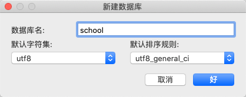
	* 每一个操作，实际上对应一个SQL
	* 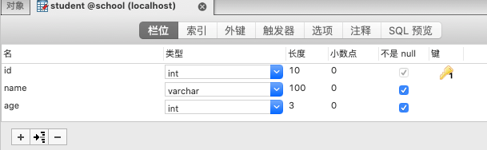

* SQL = **Structured Query Language**
* 数据库作为一种专门管理数据的软件，应用程序不需要自己管理数据，而是通过数据库软件提供的接口来读写数据
* 数据库模型：
  * 层次模型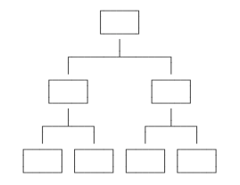
  * 网状模型
  * 关系模型：将数据看作是一个二维表格，任何数据都可以通过行号+列号来唯一确定


* 数据库分类
  
  * 关系型数据库（SQL）：
    * MySQL, Oracle, Sql Server, DB2, SQLlite
  * 非关系型数据库（NoSQL）：
  	* Redis, MongoDB
  * 商用数据库：Oracle, SQL Server, DB2
  * 开源数据库：MySQL, PostgreSQL
  * 桌面数据库：以微软[Access](https://products.office.com/access)为代表，适合桌面应用程序使用
  * 以[Sqlite](https://sqlite.org/)为代表，适合手机应用和桌面程序
  
* 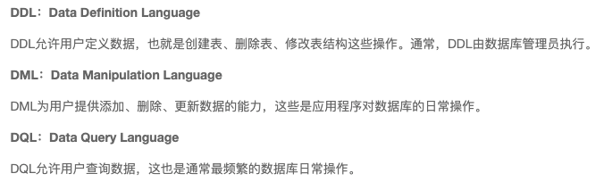

	* DCL: Data Control Language

* **DBMS**：数据库管理软件，科学有效的管理我们的数据，维护和获取数据

	

## 一、基本操作

### 1.1 连接数据库

* 命令行指令：

  ```sql
  (base)  mysql -u root -p					--连接数据库
  exit;										--退出连接
  
  select version();							--查看MySQL版本
  show databases;								--查询所有的数据库
  use school;									--切换数据库
  show tables;								--查看所有的表
  describe student;							--显示表中的所有信息
  
  create database school;						--创建一个数据库
  
  SHOW CREATE DATABASE school					--查看创建数据库的语句
  SHOW CREATE TABLE student					--查看创建表的语句
  
  DESC student								--显示表的结构
  ```

* 创建表并添加数据

	```sql
	CREATE TABLE users(
			id INT PRIMARY KEY,
	        `name` VARCHAR(40),
	        `password` VARCHAR(40),
	        email VARCHAR(60),
	        birthday DATE
	);
	
	INSERT INTO users(id, `name`, `password`, email, birthday)
	VALUES(1, 'cx', '123456', 'a@qq.com', '2000-01-01');
	```


## 二、操作数据库

操作数据库-->操作数据库中的表-->操作数据库中的数据

### 2.1 数据库增删改查

* MYSQL关键字不区分大小写

* **创建**数据库

	```sql
	CREATE DATABASE [IF NOT EXISTS] school;
	```

* **删除**数据库

	```sql
	DROP DATABASE [IF EXISTS] school;
	```

* **使用**数据库

	```sql
	USE `school`;
	```

* **查看**数据库

	```sql
	SHOW databases;
	```

### 2.2 数据库数据类型

* 数值

	|   tinyint   |    十分小的数据    |    1个字节     |
	| :---------: | :----------------: | :------------: |
	|  smallint   |     较小的数据     |    2个字节     |
	|  mediumint  |   中等大小的数据   |    3个字节     |
	|   **int**   |      标准整数      |    4个字节     |
	|   bigint    |     较大的数据     |    8个字节     |
	|    float    |       浮点数       |    4个字节     |
	|   double    |       浮点数       |    8个字节     |
	| **decimal** | 字符串形式的浮点数 | 金融计算时使用 |

* 字符串

	| char        | 固定大小字符串 | 0-255   |
	| ----------- | -------------- | ------- |
	| **varchar** | 可变字符串     | 0-65535 |
	| tinytext    | 微型文本       | 2^8-1   |
	| **text**    | 文本串         | 2^16-1  |

* 时间日期

	* java.util.Date

		| date          | 日期格式     | YYYY-MM-DD             |
		| ------------- | ------------ | ---------------------- |
		| time          | 时间格式     | HH: MM: SS             |
		| **datetime**  | 日期时间格式 | YYYY-MM-DD HH: MM: SS  |
		| **timestamp** | 时间戳       | 1970.1.1带现在的毫秒数 |
		| year          | 年份         |                        |

* NULL：不要使用NULL进行运算

### 2.3 数据库字段属性（重点）

* 每个表必须存在的字段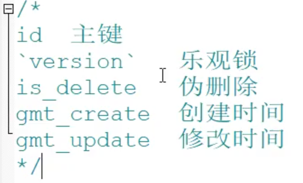

* **Unsigned（无符号）**:
	* 无符号的整数
	* 不能声明为负数
* **Zerofill（零填充）**：
	* 0填充的
	* 不足的位数用0填充    int(3)    5 --> 005
* **自增**：
	* 自动在上一条记录的基础上+1
	* 通常用来设计**唯一的主键 index**，必须是整数类型
	* 可以自定义设计主键自增的起始值和步长
* **非空**：
	* 假设设置为not null，如果不给赋值，就会报错
	* NULL，如果不填写值，默认就是NULL
* 默认：
	* 设置默认的值
	* Sex，默认值为男，如果不指定该列的值，则会有默认的值

### 2.4 创建表

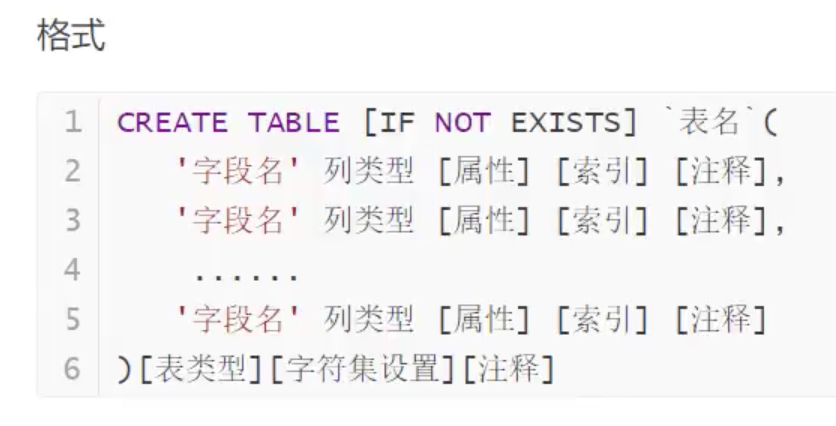

```sql
CREATE TABLE IF NOT EXISTS `student`(
	`id` INT(4) NOT NULL AUTO_INCREMENT COMMENT '学号',
	`name` VARCHAR(30) NOT NULL DEFAULT '姓名' COMMENT '姓名', 
	`pwd` VARCHAR(20) NOT NULL DEFAULT '123456' COMMENT '密码',
	`sex` VARCHAR(2) NOT NULL DEFAULT '女' COMMENT '性别',
	`birthday` DATETIME DEFAULT NULL COMMENT '出生日期',
	`address` VARCHAR(100) DEFAULT NULL COMMENT '家庭住址',
	`email` VARCHAR(50) DEFAULT NULL COMMENT '邮箱',
	PRIMARY KEY(`id`)
)ENGINE=INNODB DEFAULT CHARACTER SET=utf8
```

* **查看创建数据库和表的语句**

	```sql
	SHOW CREATE DATABASE school
	SHOW CREATE TABLE student
	
	--显示表的结构
	DESC student				
	```

### 2.5 数据表的类型

* INNODB：默认使用，安全性高，支持事务处理，多表多用户操作
* MYISAM：早年使用，节约空间，速度较快

|              | MYISAM | INNODB        |
| ------------ | ------ | ------------- |
| 事务支持     | 不支持 | 支持          |
| 数据行锁定   | 不支持 | 支持          |
| 外键约束     | 不支持 | 支持          |
| 全文索引     | 支持   | 不支持        |
| 表空间的大小 | 较小   | 较大，约为2倍 |

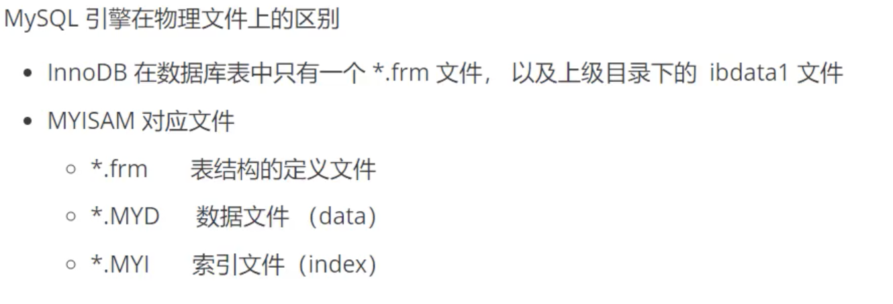

* DELETE删除的问题，重启数据库，现象
	* InnoDB  自增列会从1开始（存在内存中的，断电即失）
	* MYISAM  继续从上一个自增量开始（存在文件中，不会丢失）

### 2.6 数据表修改与删除

* **change**用来字段重命名，不能修改字段类型和约束
* **modify**不用来字段重命名，只能修改字段类型和约束

```sql
--修改表名		ALTER TABLE 旧表名 RENAME AS 新表名
ALTER TABLE teacher RENAME AS teacher1
--增加表的字段   ALTER TABLE 表名 ADD 字段名 列属性
ALTER TABLE teacher ADD age INT(11)

--修改表的字段（重命名，修改约束）
--ALTER TABLE 表名 MODIFY 字段名 列属性[]
ALTER TABLE teacher MODIFY age VARCHAR(11)    --修改约束（只修改列属性）
--ALTER TABLE 表名 CHANGE 旧名字 新名字 列属性[]
ALTER TABLE teacher CHANGE age age1 INT(1)	  --字段重命名

--删除表的字段
ALTER TABLE teacher DROP age

--删除表
DROP TABLE IF EXISTS teacher
```

* 注意点
	* `` 字段名，使用
	* 注释--
	* SQL关键字不敏感
	* 所有的符号用英文


## 三、MySQL数据管理

### 3.1 外键（了解）


* 物理外键，数据库级别的外键，**不建议使用**

* **法一**

```sql
--学生表的 gradeid 字段要去引用年级表的 gradeid
--定义外键key
--给这个外键添加约束（执行引用） references 引用
CREATE TABLE IF NOT EXISTS `student`(
	`id` INT(4) NOT NULL AUTO_INCREMENT COMMENT '学号',
	`name` VARCHAR(30) NOT NULL DEFAULT '姓名' COMMENT '姓名',
	`gradeid` INT(10) NOT NULL COMMENT '年纪',
	PRIMARY KEY(`id`),
    KEY `FK_gradeid` (`gradeid`),
    CONSTRAINT `FK_gradeid` FOREIGN KEY(`gradeid`) REFERENCES `grade`(`gradeid`)
)ENGINE=INNODB DEFAULT CHARACTER SET=utf8
```

* **法二**

```SQL
--先正常创建表
ALTER TABLE `student` 
ADD CONSTRAINT `FK_gradeid` FOREIGN KEY(`gradeid`) REFERENCES `grade`(`gradeid`);
```

### 3.2 DML语言（熟记）

* DML语言：数据存储，数据管理
	* insert
	* update
	* delete

#### 3.2.1 添加 INSERT

* 数据和字段必须一一对应
	* 字段和字段直接用英文逗号隔开
	* 字段可以省略，但必须和所有的字段**一一对应**
	* 可以同时插入多条数据，VALUES后的值要用**逗号**隔开

```sql
--INSERT INTO 表名(字段1, 字段2, 字段3) VALUES('值1'), ('值2'), ('值3')
INSERT INTO `teacher`(`gradeid`) VALUES('大一')

INSERT INTO `student`(`name`, `pwd`, `sex`) VALUES ('李四', 123, '男'),('王五', 123, '男')
```

#### 3.2.2 修改 UPDATE

```sql
--UPDATE 表名 SET column_name=value WHERE [字段名=X] 
UPDATE `student` SET `name`= 'ABC' WHERE id = 1;

--修改多个属性
UPDATE `student` SET `name`= 'ABC', `email` = '123456@qq.com' WHERE id = 1;

--多个条件下设置，并且value是一个变量
UPDATE `student` SET `birthday`= CURRENT_TIME WHERE `name`='ABC3' AND `sex`='男';
```

* 条件：where子句 运算符 id等于、大于某个值，在某个区间内修改
	* Column_name是数据库的列，尽量带``
	* 条件：筛选的条件，如果没指定，则会修改所有
	* value，是一个具体的值，也可以是一个变量
	* 多个设置的属性之间用逗号隔开

|      操作符      |  含义  |   范围   |  结果  |
| :--------------: | :----: | :------: | :----: |
|        =         |  等于  |   5=6    | false  |
|     <> 或 !=     | 不等于 |   5<>6   |  true  |
|        >         |  大于  |          |        |
|        <         |  小于  |          |        |
|        >=        |        |          |        |
|        <=        |        |          |        |
| between  A and B |  包含  | 闭合区间 | [A, B] |
|       AND        |   与   |          |        |
|        OR        |   或   |          |        |

#### 3.2.3 删除 

* DELETE

```sql
--删除指定数据
DELETE FROM `student` WHERE `name`='ABC3' AND `sex`='男';
```

* TRUNCATE：完全清空一张表，表的结构和索引结构不会变

```sql
TRUNCATE `student`
```

* 区别
	* TRUNCATE会**重置自增列**，计数器会归零
	* TRUNCATE不会影响事务

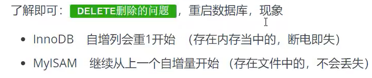


## 四、 DQL查询数据（最重点）

### 4.1 DQL

* data query language：数据查询语言
* 所有的查询操作都用它
* 数据库中最核心的语言，使用频率最高

### 4.2 select - 指定查询字段

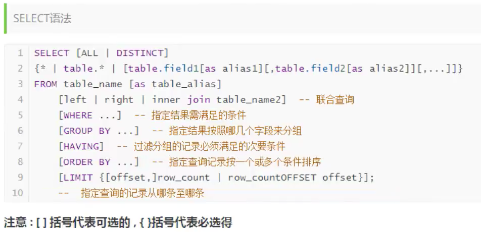

```SQL
SELECT 字段 FROM 表
SELECT * from student

-- 取别名，给字段，也可以给表起
SELECT `studentno` AS 学号, `studentname` AS 姓名 FROM `student`

--函数 Concat
SELECT CONCAT('姓名：', `studentname`) FROM `student`
```

### 4.3 distinct - 去重

* 去除select查询出来的结果中重复的数据，只显示一条

```SQL
SELECT * FROM result;
SELECT studentno from result;		-- 发现重复数据（同一个人参加多门考试）

SELECT DISTINCT studentno from result; 		-- 去重
```

* 数据库的列（表达式）

```SQL
SELECT VERSION()
SELECT 100*3-1 AS 计算结果;							 --计算表达式
SELECT @@auto_increment_increment;				    --查询自增的步长

--学员的考试成绩+1分查看
SELECT studentno, studentresult+1 AS 提分后 FROM result;
```

* 数据库中的表达式：**文本值，列，Null，函数，计算表达式，系统变量...** 

### 4.4 where - 条件

作用：检索数据中符合条件的值  and  or  not

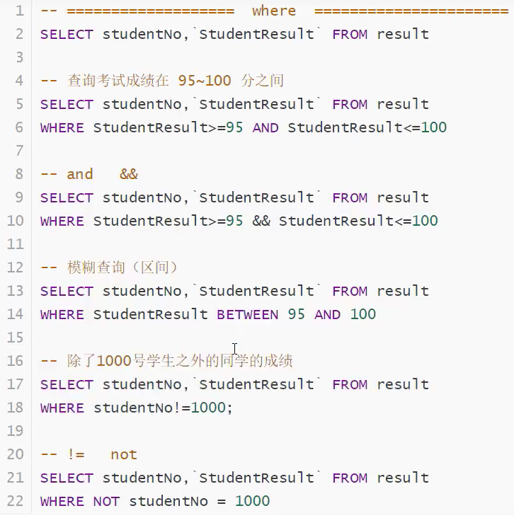

### 4.5 like - 模糊查询

|   运算符    |       语法        |                 描述                  |
| :---------: | :---------------: | :-----------------------------------: |
|   IS NULL   |     a is null     |      如果操作符为null，结果为真       |
| IS NOT NULL |                   |                                       |
| BETWEEN AND | a between b and c |       若a在b和c之间，则结果为真       |
|  **LIKE**   |     a like b      | SQL匹配，如果a能够匹配到b，则结果为真 |
|   **IN**    | a in (a1, a2, a3) |     假设a在这个范围里，那结果为真     |

```sql
-- like结合 
	--(1) % （代表0到任意个字符）
    --(2) _ （一个字符）
SELECT studentno, studentname from student 
where studentname like '刘%'

-- In 具体的一个或者多个值，%在这里没用
select studentno, studentname from student
where studentno in (1000, 1100);
```

### 4.6 join - 联表查询

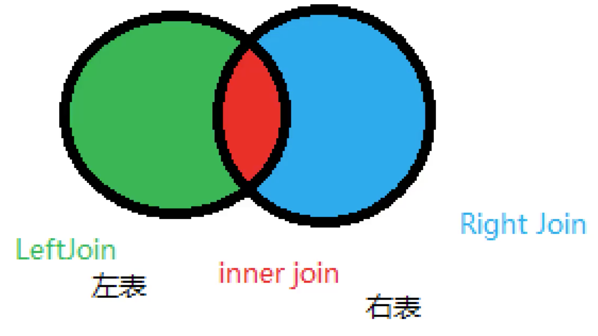

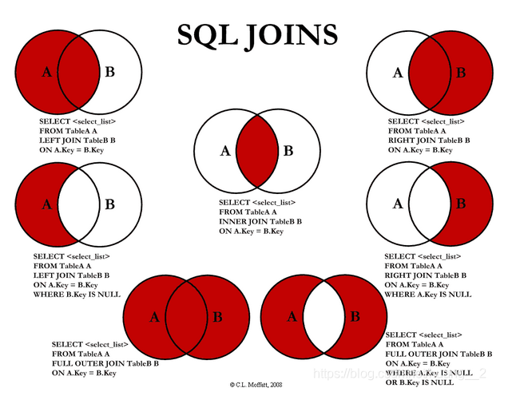

```sql
-- Inner join
SELECT s.studentno, studentname, subjectno, studentresult
FROM student AS s INNER JOIN result AS r
ON s.studentno = r.studentno;

-- 3张表
SELECT s.studentno, studentname, subjectname, studentresult
FROM student s 
RIGHT JOIN result r
ON r.studentno = s.studentno
INNER JOIN subject sub
ON r.subjectno = sub.subjectno
```

| 操作       | 描述                                               |
| ---------- | -------------------------------------------------- |
| Inner join | 如果表中至少有一个匹配，就返回行                   |
| Left join  | 即使右表中没有匹配，也会从左表中返回所有查询到的行 |
| Right join | 即使左表中没有匹配，也会从右表中返回所有查询到的行 |

* join on 连接查询     where  等值查询，join on用在多表，查完的结果是一张表，再用where筛选

### 4.7 自连接

* 自己的表和自己的表连接，**核心：一张表拆成两张一样的表即可**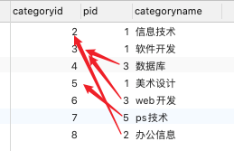

父类（顶级ID）：

| categoryid | categoryName |
| ---------- | ------------ |
| 2          | 信息技术     |
| 3          | 软件设计     |
| 5          | 美术设计     |

子类：

| categoryid | categoryName | pid  |
| ---------- | ------------ | ---- |
| 4          | 数据库       | 3    |
| 8          | 办公信息     | 2    |
| 6          | web开发      | 3    |
| 7          | ps技术       | 5    |

操作：查询父类对应的子类关系

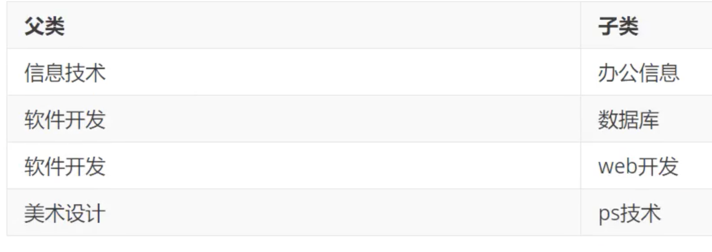

```sql
SELECT a.categoryname as 'father', b.categoryname as 'son'
FROM category AS a, category AS b
WHERE a.categoryid = b.pid;
```

### 4.8 limit - 分页和排序

分页：`limit `

排序：`order by`

* 升序ASC，降序DESC

```sql
select s.StudentNo, StudentName, SubjectName, StudentResult
from student s
inner join result r
on s.StudentNo = r.StudentNo
inner join subject sub
on sub.SubjectNo = r.SubjectNo
where SubjectName = '课程' and StudentResult>=80
order by StudentResult desc
limit 0,10;
```

### 4.9 子查询和嵌套查询

where（值是计算出来的）

本质：在where语句中嵌套一个子查询语句

```sql
select StudentNo, r.SubjectNo, StudentResult
from result r
inner join subject sub
on r.SubjectNo=sub.SubjectNo
where SubjectName = '课程'
order by StudentResult desc

select StudentNo, r.SubjectNo, StudentResult
from result r
where StudentNo = (select SubjectNo from subject where SubjectName = '课程')
```

### 4.10 groub by - 分组查询

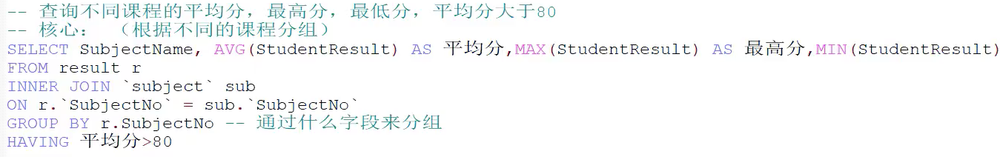


## 五、MySQL函数

### 5.1 常用函数

```sql
-- 数学
select ABC(-8)					-- 绝对值
select CEILING(9.4)				-- 向上取整
select FLOOR(9.4)				-- 向下取整
select RAND()					-- 返回一个0-1之间的随机数
select SIGN(0)					-- 判断一个数的符号

-- 字符串
select CHAR_LENGTH('一句话')	  -- 字符串长度
select CONCAT('I', "AM")		-- 拼接字符串
select INSERT('I am hero', 1, 2, "zhangsan")    -- 从某个位置替换某个长度的子串
select LOWER('AA')				-- 转小写
select UPPER('aa')				-- 转大写
select INSTR('ABCD', 'B')	    -- 返回第一次出现子串的位置
select REPLACE('abcd', 'b', 'e')-- 替换
select SUBSTR('abcd', 1, 2)		-- 返回指定的子字符串
select REVERSE('abcd')				-- 反转

-- 时间
select current_date();			-- 获取当前日期
select curdate()				-- 获取当前日期
select now()					-- 获取当前时间
select year(now())				-- 获取（year mouth day hour minute second），直接替换

-- 系统
select system_user()
select user()
select version()
```

### 5.2 聚合函数

| 函数名称 |                             描述                             |
| :------: | :----------------------------------------------------------: |
| count()  | select count(studentname) from student，统计表中数据，**只有指定列才会忽略null** |
|  sum()   |       select sum(StudentResult) as ‘总和’ from result        |
|  avg()   |                                                              |
|  max()   |                                                              |
|  min()   |                                                              |


