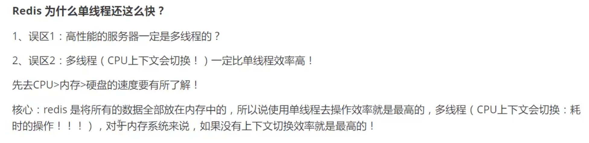
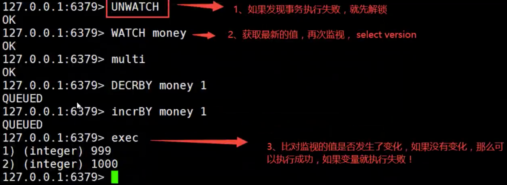

# Redis笔记

## 一、Nosql

### 1.1 概述

1. 单机MySQL的年代
	

	* 问题一：数据量如果太大，一个机器放不下
	* 问题二：数据的索引（300万），一个机器内存也放不下
	* 问题三：访问量（读写混合），一个服务器承受不了

2. Memcached（缓存） + MySQL + 垂直拆分（读写分离）

	* 问题：网站80%的情况都在读，每次都要去查询数据库就十分的麻烦！所以希望能减轻数据的压力，可以使用缓存来保证效率！
	* 
	* 发展过程：优化数据结构和索引-->文件缓存（IO）-->Memcached

3. 分库分表 + 水平拆分 + MySQL集群
	本质：数据库读写  
	MyISAM：表锁，十分影响效率，高并发下会出现严重的锁问题
	转战INNODB：行锁

	

4. 如今
	MySQL等关系型数据库不够用，数据量很多，变化很快

	MySQL有的使用它来存储一些比较大的文件，博客、图片！数据库表很大，效率就低了

	研究一种数据库来专门处理这种数据

### 1.2 什么是NoSQL

Not only SQL （不仅仅是SQL），泛指非关系型数据库，Redis是发展最快的，所以必须学

* 很多的数据类型（用户的个人信息、社交网络、地理位置），这些数据类型的存储不需要一个固定的格式
* 不需要多余的操作就可以横向扩展（类似Map<String, Object>）

### 1.3 特点

* 方便拓展（数据之间没有关系，很好拓展）

* 大数据量高性能（Redis一秒读8万次，读取11万，NoSQL的缓存记录级，是一种细粒度的缓存，性能比较高）

* 数据类型是多样型的！（不需要事先设计数据库，随取随用）

* 传统RDBMS和NoSQL

	```
	传统RDBMS
	- 结构化组织
	- SQL
	- 数据和关系都存在单独的表中
	- 数据定义语言
	- 严格的一致性
	- 基础的事务
	
	NoSQL
	- 不仅仅是数据
	- 没有固定的查询语言
	- 键值对存储，列存储，文档存储，图形数据库
	- 最终一致性
	- CAP定理 和 BASE（异地多活）
	- 高性能，高可用，高可扩
	```


### 1.4 NoSQL四大类型


* **KV键值对**
	* 新浪：**Redis**
	* 美团：Redis + Tair
	* 阿里、百度：Redis + memecache
* **文档型数据库（bson格式 和json一样）**
	* **MongoDB**
		* 一种基于分布式文件存储的数据库，C++编写，主要用来处理大量的文档
		* 介于关系型数据库和非关系型数据库中间的产品
		* 是非关系型数据库中功能最丰富，最像关系型数据库的
	* ConthDB
* **列存储数据库**
	* **HBase**
	* 分布式文件系统
* **图关系数据库**
	* 并非存图形，放的是关系，比如：朋友圈社交网络，广告推荐！ 
	* **Neo4j** , InfoGrid


## 二、Redis

### 2.1 概述

 Remote Dictionary Server（远程字典服务），可基于内存亦可持久化的日志型、Key-Value数据库，并提供多种语言的API

* 内存存储、持久化，内存中断电即失去
* 效率高，可用于高速缓存
* 发布订阅系统
* 地图信息分析
* 计时器、计数器（浏览器）
* 特性：
	* **单线程**：Redis基于内存操作，CPU不是性能瓶颈，瓶颈是根据机器的内存和网络带宽，既然可以使用单线程，就用单线程 
	* 多样的数据类型
	* 持久化
	* 集群
	* 事务
* 

### 2.2 基本指令

```java
// 安装
brew install redis
// 启动
//方式一：使用brew帮助我们启动软件
brew services start redis
//方式二
redis-server /usr/local/etc/redis.conf
// 连接
redis-cli -h 127.0.0.1 -p 6379
// 测试
cd /usr/local/bin
redis-benchmark -h localhost -p 6379 -c 100 -n 100000
```


* Redis默认有16个数据库，默认使用第0个，使用select切换数据库

	```bash
	# 切换数据库
	127.0.0.1:6379> select 3
	OK
	127.0.0.1:6379[3]> dbsize
	(integer) 0
	# 设置值
	127.0.0.1:6379[3]> set name komorebi
	OK
	127.0.0.1:6379[3]> dbsize
	(integer) 1
	127.0.0.1:6379[3]> get name
	"komorebi"
	```

* 查看所有的key

	```bash
	127.0.0.1:6379[3]> keys *
	1) "name"
	```

* 清空当前库

	```bash
	127.0.0.1:6379[3]> flushdb		# 清空全部，flushall
	OK
	```

* 其他操作

	```bash
	127.0.0.1:6379> keys *
	1) "age"
	2) "name"
	# 查看数据类型
	127.0.0.1:6379> type name
	string
	# 判定是否存在
	127.0.0.1:6379> exists name
	(integer) 1
	# 移除
	127.0.0.1:6379> move name 1
	(integer) 1
	# 设置过期时间，现在是10秒，ttl查看剩余时间
	127.0.0.1:6379> expire name 10
	(integer) 1
	127.0.0.1:6379> ttl name
	(integer) 5
	```

	


## 三、五大数据类型

### 3.1 String

* 使用场景：除了字符串还可以是数字
	* 计数器
	* 统计多单位的数量
	* 粉丝数
	* 对象缓存存储

|   操作   |               指令                |                           含义                            |
| :------: | :-------------------------------: | :-------------------------------------------------------: |
|   set    |         set name komorebi         |                        设置字符串                         |
|   get    |         get name komorebi         |                         取字符串                          |
|  append  |        append name "hello"        |                        字符串拼接                         |
|  strlen  |            strlen name            |                        字符串长度                         |
|   incr   |            incur views            |                           自增                            |
|   decr   |            decr views             |                           自减                            |
|  incrby  |          incrby views 10          |                     自增（指定步长）                      |
|  decrby  |          decrby views 10          |                     自减（指定步长）                      |
| getrange |         getrange name 0 3         |               substring (闭区间，-1指最后)                |
| setrange |        setrange name 1 xx         |        修改字符串(指定开始的索引和替换后的字符串)         |
|  setex   |       setex key 30 "hello"        |              set with expire (设置过期时间)               |
|  setnx   |        setnx name komorebi        |             set if  not exist (不存在再设置)              |
|   mset   |      mset k1 v1 k2 v2 k3 v3       |                        批量设置值                         |
|   mget   |           mget k1 k2 k3           |                        批量获取值                         |
|  msetnx  |                                   |             批量设置，原子性操作（类似事务）              |
| set对象  | set user:1 {name:komorebi, age:3} | mset user:1:name komorebi user:1:age 3<br />user:{id}:key |
|  getset  |        getset db komorebi         |                        先get再set                         |

### 3.2 List

* 所有的list命令都使用l开头

|   操作    |                 指令                  |                       含义                        |
| :-------: | :-----------------------------------: | :-----------------------------------------------: |
|   lpush   |           lpush mylist one            |                向队列左侧中放入值                 |
|  lrange   |          lrange mylist 0 -1           |                  取值（闭区间）                   |
|   rpush   |           rpush mylist four           |                向队列右侧中放入值                 |
|   lpop    |              lpop mylist              |                  从队列左侧移除                   |
|   rpop    |              rpop mylist              |                  从队列右侧移除                   |
|  lindex   |            lindex mylist 0            |                通过下标获取一个值                 |
|   llen    |              llen mylist              |                   得到队列长度                    |
|   lrem    |          lrem mylist 2 three          |            移除指定的值(移除2个three)             |
|   ltrim   |           ltrim mylist 1 2            |                  截取（闭区间）                   |
| rpoplpush |     rpoplpush mylist myotherlist      | 移除mylist最后一个元素，并添加到myotherlist的左侧 |
|   lset    |          lset mylist 0 item           |           更新list（必须首先存在list）            |
|  linsert  | linsert mylist before "world" "other" |           在world前插入other，可改after           |

### 3.3 Set

* set中的值不能重复，无序不重复集合

|    操作     |            指令             |              含义              |
| :---------: | :-------------------------: | :----------------------------: |
|    sadd     |     sadd myset "hello"      |         向set中添加值          |
|  smembers   |       smembers myset        |      查看set中的所有元素       |
|  sismember  |    sismember myset hello    | 查看hello是否为set中的一个元素 |
|    scard    |         scard myset         |       查看set元素的个数        |
| srandmember |      srandmember myset      |    从set中随机取出一个元素     |
|    srem     |      srem myset hello       |         删除指定的元素         |
|    spop     |         spop myset          |          随机删除元素          |
|    smove    | smove myset myset2 komorebi |         移动指定的元素         |
|    sdiff    |     sdiff myset1 myset2     |     差集（1中有，2中没有）     |
|   sinter    |    sinter myset1 myset2     |              交集              |
|   sunion    |    sunion myset1 myset2     |              并集              |

### 3.4 Hash

* Map集合，key-Map，这时候这个value是一个Map集合

|  操作   |                  指令                   |               含义               |
| :-----: | :-------------------------------------: | :------------------------------: |
|  hset   |       hset myhash field1 komorebi       |      设置hash，myhash是key       |
|  hget   |           hget myhash field1            |  取myhash中的value里面的field1   |
|  hmset  | hmset myhash field1 hello field2 hello2 |          设置多个field           |
|  hmget  |       hmget myhash field1 field2        |      取myhash中的多个field       |
| hgetall |             hgetall myhash              |     取出myhash中的所有field      |
|  hdel   |           hdel myhash field1            |       删除myhash中的field1       |
|  hlen   |               hlen myhash               |         查看myhash的长度         |
| hexists |          hexists myhash field1          |    查看myhash中是否存在field1    |
|  hkeys  |              hkeys myhash               |         只获取所有field          |
|  hvals  |              hvals myhash               |         只获取所有value          |
| hincrby |         hincrby myhash field3 5         |           指定步长增长           |
| hsetnx  |         hsetnx myhash field4 5          | set if  not exist (不存在再设置) |

### 3.5 Zset

* 有序集合，在set的基础上增加了一个值

|       操作       |                      指令                      |             含义             |
| :--------------: | :--------------------------------------------: | :--------------------------: |
|       zadd       |               zadd myzset 1 one                |      往set中添加一个值       |
|      zrange      |               zrange myzset 0 -1               |       查看里面的所有值       |
|  zrangebyscore   |  zrangebyscore myzset -inf +inf (withscores)   |             排序             |
| zrevrangebyscore | zrevrangebyscore myzset +inf -inf (withscores) |         排序（逆序）         |
|       zrem       |                zrem myzset one                 |         移除一个元素         |
|      zcard       |                  zcard myzset                  |         获取元素个数         |
|      zcount      |               zcount myzset 1 2                | 获取指定区间内的元素(闭区间) |


## 四、三种特殊数据类型

### 4.1 geospatial

* 地理位置，有效经度-180 -- +180，有效维度-85 -- +85
* 底层用zset实现，zset的指令也可以用 

|       操作        |                             指令                             |                      含义                      |
| :---------------: | :----------------------------------------------------------: | :--------------------------------------------: |
|      geoadd       |           geoadd china:city 31.23 121.47 shanghai            |       添加地理位置（key-(维度精度名称)）       |
|      geopos       |                  geopos china:city beijing                   |       从key中返回所有给定位置元素的位置        |
|      geodist      |          geodist china:city beijing shanghai （km）          |           返回两个给定位置之间的距离           |
|     georadius     | georadius china:city 116.40 39.90 1100 km （withdist / withcoord） |   以给定的经纬度为中心，找出某一半径内的元素   |
| georadiusbymember |         georadiusbymember china:city beijing 1100 km         | georadiusbymember 的中心点由给定的位置元素决定 |
|      geohash      |                  geohash china:city beijing                  |        返回一个或多个元素的geohash表示         |

### 4.2 hyperloglog

* 基数（不重复的元素）
* hyperloglog 基数统计的算法（一个人访问一个网站多次，也还是算一个人）
* 优点：占用的内存固定，2^64不同的基数的集合，只需要12KB的内存

|  操作   |              指令               |   含义   |
| :-----: | :-----------------------------: | :------: |
|  pfadd  | pfadd mykey a b c d e f g h i j | 添加元素 |
| pfcount |          pfcount mykey          |   计数   |
| pfmerge |   pfmerge mykey3 mykey mykey2   |   融合   |

### 4.3 bitmaps

* 位存储，用来统计用户信息（活跃与否、登录状态、打卡）

|   操作   |      指令       |       含义        |
| :------: | :-------------: | :---------------: |
|  setbit  | setbit sign 3 1 | 添加（索引+状态） |
|  getbit  |  getbit sign 0  |       查看        |
| bitcount |  bitcount sign  |       统计        |


## 五、事务

### 5.1 基础指令

* Redis单条命令是**保持原子性**的，但是事务**不保证原子性**

* 事务本质：一组命令的集合（一次性、顺序性、排他性）

* 步骤：

	```bash
	127.0.0.1:6379> multi
	OK
	127.0.0.1:6379> set k1 v1
	QUEUED
	127.0.0.1:6379> set k2 v2
	QUEUED
	127.0.0.1:6379> set k3 v3
	QUEUED
	127.0.0.1:6379> exec
	1) OK
	2) OK
	3) OK
	```

	* 开启事务（**multi**）
	* 命令入队（）
	* 执行事务（**exec**）

* 放弃事务：**discard**

* 编译型异常（**代码有问题，命令有错**），事务中的所有命令都不执行

* 运行时异常（**1 / 0 这种**），事务队列中存在语法问题，那么执行命令的时候，其他命令是可以正常执行的

### 5.2 实现乐观锁

乐观锁：认为什么时候都不会出问题，所以不会上锁。更新数据的时候判断一下是否有人改动过数据

悲观锁：无论做什么都会加锁

* 乐观锁步骤：

	* 获取version

	* 更新的时候比较version

	* ```bash
		# 正常执行
		127.0.0.1:6379> set money 100
		OK
		127.0.0.1:6379> set out 0
		OK
		127.0.0.1:6379> watch money
		OK
		127.0.0.1:6379> multi
		OK
		127.0.0.1:6379> decrby money 20
		QUEUED
		127.0.0.1:6379> incrby out 20
		QUEUED
		127.0.0.1:6379> exec
		1) (integer) 80
		2) (integer) 20
		```

	* ```bash
		# 多线程修改值，使用watch可以当做Redis的乐观锁
		127.0.0.1:6379> watch money
		OK
		127.0.0.1:6379> multi
		OK
		127.0.0.1:6379> decrby money 10
		QUEUED
		127.0.0.1:6379> incrby out 10
		QUEUED
		127.0.0.1:6379> exec
		(nil)
		# unwatch
		```

	* 


## 六、Jedis

要使用Java来操作Redis

* Jedis是官方推荐的java连接开发工具，使用Java操作Redis中间件

步骤：

1. 导入依赖

	```xml
	<!--Jedis-->
	<dependency>
	    <groupId>redis.clients</groupId>
	    <artifactId>jedis</artifactId>
	    <version>3.2.0</version>
	</dependency>
	<!--fastjson-->
	<dependency>
	    <groupId>com.alibaba</groupId>
	    <artifactId>fastjson</artifactId>
	    <version>1.2.75</version>
	</dependency>
	```

2. 测试:

	* 连接数据库

		```java
		public class TestPing {
		    public static void main(String[] args) {
		        // 1 new一个Jedis对象
		        Jedis jedis = new Jedis("127.0.0.1", 6379);
		
		        // Jedis的所有命令就是常规指令
		        System.out.println(jedis.ping());
		    }
		}
		```

3. ```java
	public class TestKey {
	    public static void main(String[] args) {
	        Jedis jedis = new Jedis("127.0.0.1", 6379);
	
	        System.out.println("清空数据："+jedis.flushDB());
	        System.out.println("判断某个键是否存在："+jedis.exists("username"));
	        System.out.println("新增<'username','kuangshen'>的键值对："+jedis.set("username", "kuangshen"));
	        System.out.println("新增<'password','password'>的键值对："+jedis.set("password", "password"));
	        System.out.print("系统中所有的键如下：");
	        Set<String> keys = jedis.keys("*");
	        System.out.println(keys);
	        System.out.println("删除键password:"+jedis.del("password"));
	        System.out.println("判断键password是否存在："+jedis.exists("password"));
	        System.out.println("查看键username所存储的值的类型："+jedis.type("username"));
	        System.out.println("随机返回key空间的一个："+jedis.randomKey());
	        System.out.println("重命名key："+jedis.rename("username","name"));
	        System.out.println("取出改后的name："+jedis.get("name"));
	        System.out.println("按索引查询："+jedis.select(0));
	        System.out.println("删除当前选择数据库中的所有key："+jedis.flushDB());
	        System.out.println("返回当前数据库中key的数目："+jedis.dbSize());
	        System.out.println("删除所有数据库中的所有key："+jedis.flushAll());
	    }
	}
	```


## 七、SpringBoot整合

* 在SpringBoot2.x后，jedis被替换为了lettuce
* jedis：采用直连，多个线程操作，是不安全的，如果想要避免不安全，使用jedis pool连接池
* lettuce：采用netty，实例可以在多个线程中共享，不存在线程不安全的情况，可以减少线程数据，更像NIO模式

```java
@Configuration(proxyBeanMethods = false)
@ConditionalOnClass(RedisOperations.class)
@EnableConfigurationProperties(RedisProperties.class)
@Import({ LettuceConnectionConfiguration.class, JedisConnectionConfiguration.class })
public class RedisAutoConfiguration {
	// 默认的RedisTemplate，没有过多的设置，对象都是需要序列化
    // 两个泛型都是object，后面需要强制转换<String, Object>
	@Bean
	@ConditionalOnMissingBean(name = "redisTemplate")
	@ConditionalOnSingleCandidate(RedisConnectionFactory.class)
	public RedisTemplate<Object, Object> redisTemplate(RedisConnectionFactory redisConnectionFactory) {
		RedisTemplate<Object, Object> template = new RedisTemplate<>();
		template.setConnectionFactory(redisConnectionFactory);
		return template;
	}

	@Bean
	@ConditionalOnMissingBean   // 由于String是最常使用的类型，所以单独提出来一个bean
	@ConditionalOnSingleCandidate(RedisConnectionFactory.class)
	public StringRedisTemplate stringRedisTemplate(RedisConnectionFactory redisConnectionFactory) {
		StringRedisTemplate template = new StringRedisTemplate();
		template.setConnectionFactory(redisConnectionFactory);
		return template;
	}

}
```

### 7.1 测试

1. 导入依赖

2. 配置连接

3. 测试

	```java
	@SpringBootTest
	class Redis02SpringbootApplicationTests {
	    @Autowired
	    private RedisTemplate redisTemplate;
	
	    @Test
	    void contextLoads() {
	        // redisTemplate
	        // opsForValue  操作字符串，类似String
	        // opsForList   操作List，类似List...
	        // 常用的方法可以直接通过template操作，比如事务
	
	        // 获取连接
	//        RedisConnection connection = redisTemplate.getConnectionFactory().getConnection();
	//        connection.flushDb();
	
	        redisTemplate.opsForValue().set("mykey", "komorebi");
	        System.out.println(redisTemplate.opsForValue().get("mykey"));
	    }
	
	    @Test
	    public void test() throws JsonProcessingException {
	        // 真实开发用json传送对象，注意必须序列化(或者实体类实现序列化接口)
	        //public class User implements Serializable
	        User user = new User("komorebi", 18);
	        String jsonUser = new ObjectMapper().writeValueAsString(user);
	        redisTemplate.opsForValue().set("user", jsonUser);
	        System.out.println(redisTemplate.opsForValue().get("user"));
	    }
	}
	```

4. RedisTemplate模板

	```java
	@Configuration
	public class RedisConfig {
	
	  @Bean
	  @SuppressWarnings("all")
	  public RedisTemplate<String, Object> redisTemplate(RedisConnectionFactory factory) {
	      RedisTemplate<String, Object> template = new RedisTemplate<String, Object>();
	      template.setConnectionFactory(factory);
	
	      // Json序列化配置
	      Jackson2JsonRedisSerializer jackson2JsonRedisSerializer = new Jackson2JsonRedisSerializer(Object.class);
	      ObjectMapper om = new ObjectMapper();
	      om.setVisibility(PropertyAccessor.ALL, JsonAutoDetect.Visibility.ANY);
	      om.enableDefaultTyping(ObjectMapper.DefaultTyping.NON_FINAL);
	      jackson2JsonRedisSerializer.setObjectMapper(om);
	      // String序列化
	      StringRedisSerializer stringRedisSerializer = new StringRedisSerializer();
	
	      // key采用String的序列化方式
	      template.setKeySerializer(stringRedisSerializer);
	      // hash的key也采用String的序列化方式
	      template.setHashKeySerializer(stringRedisSerializer);
	      // value序列化方式采用jackson
	      template.setValueSerializer(jackson2JsonRedisSerializer);
	      // hash的value序列化方式采用jackson
	      template.setHashValueSerializer(jackson2JsonRedisSerializer);
	      template.afterPropertiesSet();
	
	      return template;
	  }
	}
	```

	

