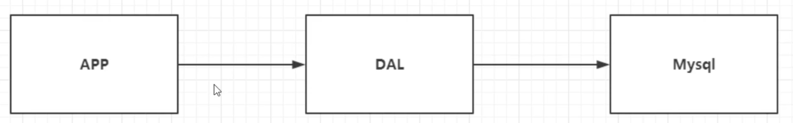
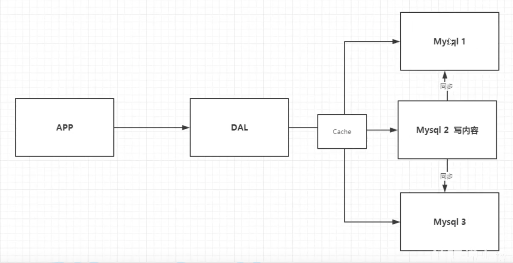
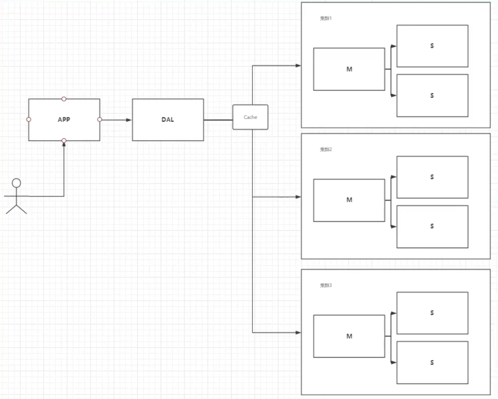
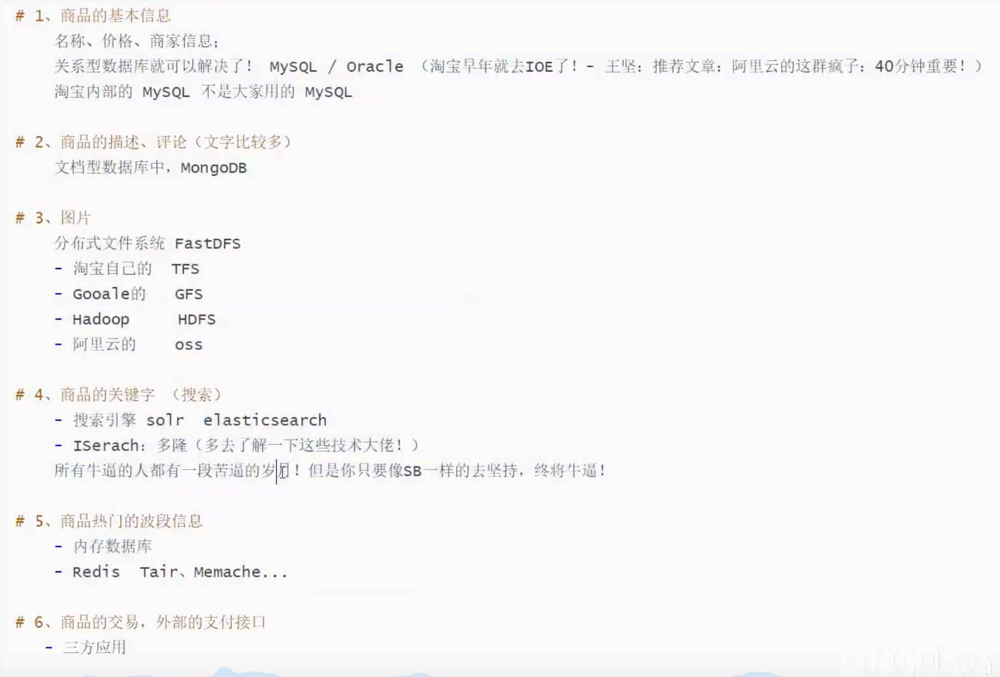
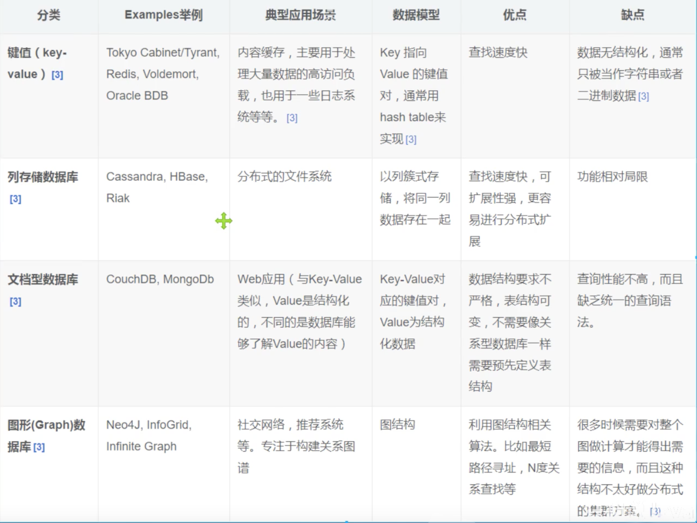
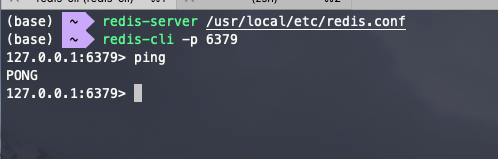
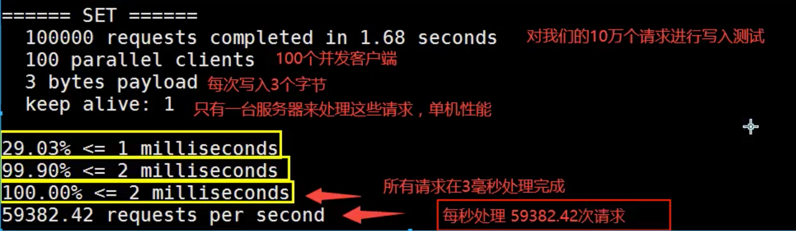

# Redis笔记

## 一、Nosql

### 1.1 概述

1. 单机MySQL的年代
	

	* 问题一：数据量如果太大，一个机器放不下
	* 问题二：数据的索引（300万），一个机器内存也放不下
	* 问题三：访问量（读写混合），一个服务器承受不了

2. Memcached（缓存） + MySQL + 垂直拆分（读写分离）

	* 问题：网站80%的情况都在读，每次都要去查询数据库就十分的麻烦！所以希望能减轻数据的压力，可以使用缓存来保证效率！
	* 
	* 发展过程：优化数据结构和索引-->文件缓存（IO）-->Memcached

3. 分库分表 + 水平拆分 + MySQL集群
	本质：数据库读写  
	MyISAM：表锁，十分影响效率，高并发下会出现严重的锁问题
	转战INNODB：行锁

	

4. 如今
	MySQL等关系型数据库不够用，数据量很多，变化很快

	MySQL有的使用它来存储一些比较大的文件，博客、图片！数据库表很大，效率就低了

	研究一种数据库来专门处理这种数据

### 1.2 什么是NoSQL

Not only SQL （不仅仅是SQL），泛指非关系型数据库，Redis是发展最快的，所以必须学

* 很多的数据类型（用户的个人信息、社交网络、地理位置），这些数据类型的存储不需要一个固定的格式
* 不需要多余的操作就可以横向扩展（类似Map<String, Object>）

### 1.3 特点

* 方便拓展（数据之间没有关系，很好拓展）

* 大数据量高性能（Redis一秒读8万次，读取11万，NoSQL的缓存记录级，是一种细粒度的缓存，性能比较高）

* 数据类型是多样型的！（不需要事先设计数据库，随取随用）

* 传统RDBMS和NoSQL

	```
	传统RDBMS
	- 结构化组织
	- SQL
	- 数据和关系都存在单独的表中
	- 数据定义语言
	- 严格的一致性
	- 基础的事务
	
	NoSQL
	- 不仅仅是数据
	- 没有固定的查询语言
	- 键值对存储，列存储，文档存储，图形数据库
	- 最终一致性
	- CAP定理 和 BASE（异地多活）
	- 高性能，高可用，高可扩
	```



### 1.4 NoSQL四大类型



* **KV键值对**
	* 新浪：**Redis**
	* 美团：Redis + Tair
	* 阿里、百度：Redis + memecache
* **文档型数据库（bson格式 和json一样）**
	* **MongoDB**
		* 一种基于分布式文件存储的数据库，C++编写，主要用来处理大量的文档
		* 介于关系型数据库和非关系型数据库中间的产品
		* 是非关系型数据库中功能最丰富，最像关系型数据库的
	* ConthDB
* **列存储数据库**
	* **HBase**
	* 分布式文件系统
* **图关系数据库**
	* 并非存图形，放的是关系，比如：朋友圈社交网络，广告推荐！ 
	* **Neo4j** , InfoGrid


## 二、Redis

### 2.1 概述

 Remote Dictionary Server（远程字典服务），可基于内存亦可持久化的日志型、Key-Value数据库，并提供多种语言的API

* 内存存储、持久化，内存中断电即失去
* 效率高，可用于高速缓存
* 发布订阅系统
* 地图信息分析
* 计时器、计数器（浏览器）
* 特性：
	* 多样的数据类型
	* 持久化
	* 集群
	* 事务

### 2.2 基本指令

```java
// 安装
brew install redis
// 启动
//方式一：使用brew帮助我们启动软件
brew services start redis
//方式二
redis-server /usr/local/etc/redis.conf
redis-server
// 关闭
shutdown
// 连接
redis-cli -h 127.0.0.1 -p 6379
// 测试
cd /usr/local/bin
redis-benchmark -h localhost -p 6379 -c 100 -n 100000
```






