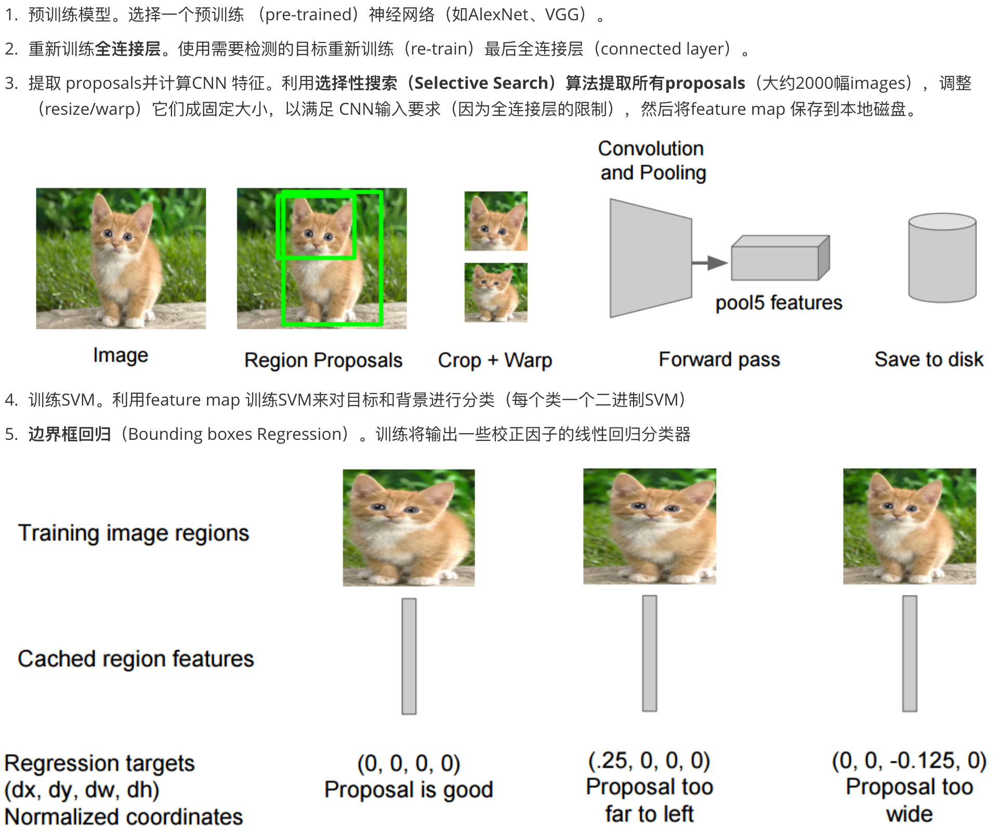
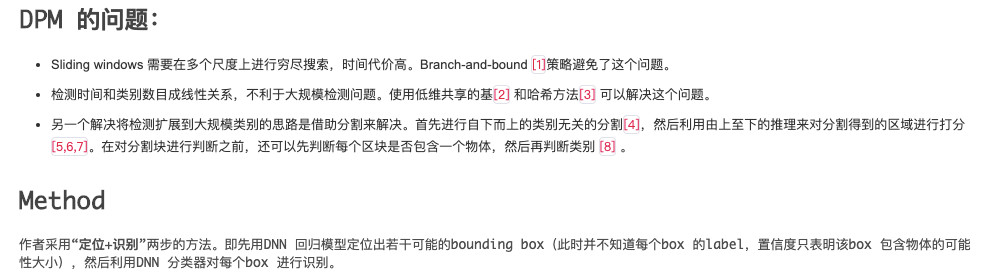
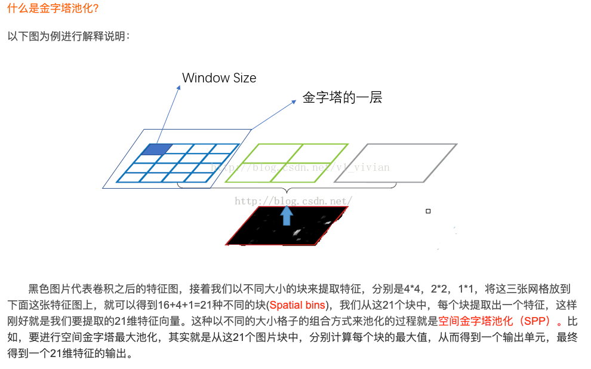
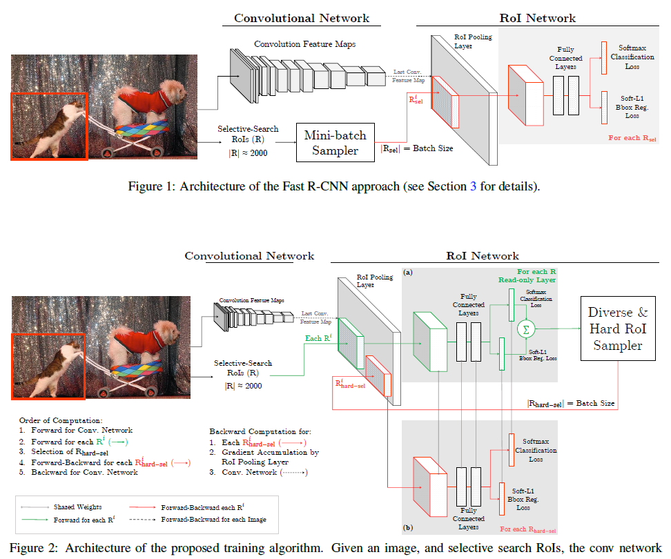

# Deep learning object detection

## 1 R-CNN

* 使用CNN（ConvNet）对 region proposals 计算 feature vectors。**从经验驱动特征（SIFT、HOG）到数据驱动特征（CNN feature map）**，提高特征对样本的表示能力。
* 采用大样本下（ILSVRC/ImageNet）有监督预训练和小样本（PASCAL）微调（fine-tuning）的方法解决小样本难以训练甚至过拟合等问题。
* 方案：

## 2 OverFeat

* 基于类似CNN架构的滑动窗口检测器

## 3 MultiBox

* 优点
	* 将物体检测问题定义为输出为多个bounding box 的回归问题。每个bounding box 同时输出坐标和置信度，使得模型更加紧凑和高效
	* 利用DNN 同时学习数据的表示和bounding box 检测器
	* 在无类别监督的条件下训练box 检测器，使得该方法的计算复杂度几乎不受物体类别的影响，因此适合于大规模物体检测问题。该方法还可以推广到未知的类别。
* Deformable Part Model (DPM)

## 4 **SPP-Net**

* Spatial Pyramid Pooling
* 解决了输入图片尺寸可以不固定的问题，在全连接层之前加上一层SPP layer
	* 1）SPP能够生成固定长度的输出，而与输入大小无关
	* 2）SPP使用多层空间分档
	* 3）由于输入比例尺的灵活性，SPP可以合并以可变比例尺提取的要素
* 方案：
	* 首先通过**选择性搜索**，对待检测的图片进行搜索出2000个候选窗口。这一步和R-CNN一样。
	*  特征提取阶段。这一步就是和R-CNN最大的区别了，这一步骤的具体操作如下：把整张待检测的图片，输入CNN中，进行一次性特征提取，得到feature maps，然后在feature maps中找到各个候选框的区域，再对各个候选框采用金字塔空间池化，提取出固定长度的特征向量。而R-CNN输入的是每个候选框，然后在进入CNN，因为SPP-Net只需要一次对整张图片进行特征提取，速度会大大提升。
	* 最后一步也是和R-CNN一样，采用**SVM**算法进行特征向量分类识别。

## 5 Fast R-CNN

1. 只对整幅图像进行一次特征提取，避免R-CNN中的**冗余特征提取**
2. 用RoI pooling层替换最后一层的max pooling层，同时引入建议框数据，提取相应建议框特征
3. Fast R-CNN网络末尾**采用并行的不同的全连接层，可同时输出分类结果和窗口回归结果**，实现了end-to-end的多任务训练【建议框提取除外】，也不需要额外的特征存储空间【R-CNN中的特征需要保持到本地，来供SVM和Bounding-box regression进行训练】
4. **采用SVD对Fast R-CNN网络末尾并行的全连接层进行分解**，减少计算复杂度，加快检测速度。

## 6 Faster R-CNN

[知乎讲解--一文读懂Faster-RCNN](#https://zhuanlan.zhihu.com/p/31426458)

## 7 OHEM

* 动机：因为检测数据集始终包含大量的简单示例和少量的困难示例
* 网络一般是将目标检测训练简化为图像分类，带来的新挑战：训练集的特点是，带注释的对象数量与背景实例（图像区域不属于任何感兴趣的对象类别）数量之间存在巨大的不平衡。
* 核心：对简单样本和一些小数量样本进行抑制
* OHEM算法基于Fast R-CNN算法进行改进，作者认为Fast R-CNN算法中创造mini-batch用来进行SGD算法，并不具有高效和最优的状态，而OHEM可以取得lower training loss，和higher mAP。

