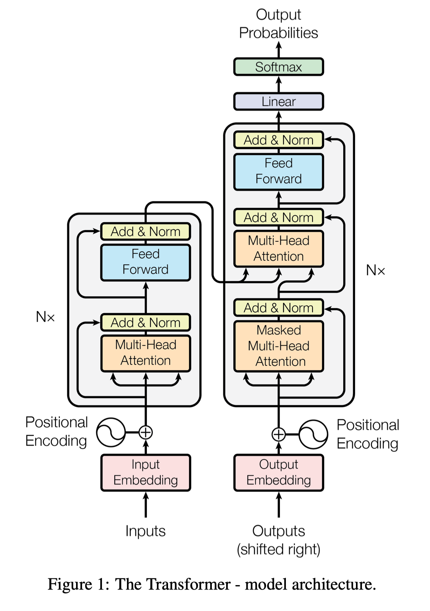
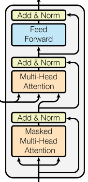
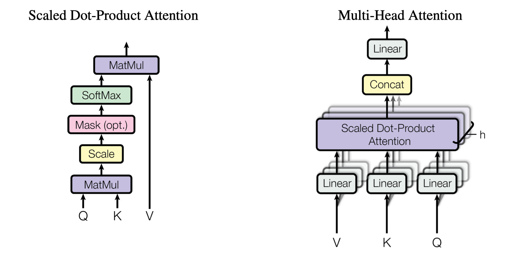
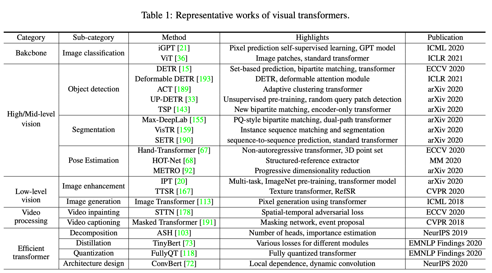

# 01 Attention Is All You Need

> Vaswani A, Shazeer N, Parmar N, et al. Attention is all you need[J]. arXiv preprint arXiv:1706.03762, 2017.

**顺序计算的基本约束**：

​		递归模型通常沿输入和输出序列的符号位置考虑计算。将位置与计算时间中的步骤对齐，根据先前的隐藏状态$h_{t-1}$和位置t的输入生成一系列隐藏状态$h_t$。这种固有的顺序性质阻止了训练示例内的并行化，这在较长的序列长度上变得至关重要，因为内存限制限制了示例之间的批处理。

​		注意机制已成为各种任务中引人注目的序列建模和转导模型不可或缺的一部分，从而允许对依赖项进行建模，而无需考虑它们在输入或输出序列中的距离。

​		在这项工作中，提出了一种==Transformer==（**一种避免重复发生的模型体系结构，而是完全依赖于注意力机制来绘制输入和输出之间的全局依存关系**）。

## 1 背景

​		减少顺序计算的目标也构成了一些模型的基础，它们全部使用卷积神经网络作为基本构件，**并行计算**所有输入和输出的隐藏表示。在这些模型中，关联来自两个任意输入或输出位置的信号所需的操作数在位置之间的距离中增加，对于ConvS2S线性增长，而对于ByteNet则呈对数增长。这使得学习远处位置之间的依存关系变得更加困难。在Transformer中，此操作被**减少为恒定的操作次数**，尽管由于平均注意力加权位置而导致有效分辨率降低的代价，这是我们用第3.2节中所述的多头注意力抵消的效果。

​		自我注意，有时也称为内部关注，是一种与单个序列的不同位置相关的注意力机制，目的是计算序列的表示形式。

​		端到端存储网络基于递归注意机制，而不是序列对齐的递归，并且已被证明在简单语言问答和语言建模任务中表现良好。

​		Transformer是第一个转导模型，完全不依赖序列对齐的RNN或卷积，完全依靠自我注意力来计算其输入和输出的表示形式。

## 2 模型结构

### 2.1 编码器-解码器结构

​		编码器将符号表示形式$（x_1，...，x_n）$的输入序列映射到连续表示形式$（z_1，...，z_n）$的序列。给定z，则解码器然后一次生成一个元素的符号的输出序列$（y_1，...，y_m）$。模型的每一步都是**自回归的**，在生成下一个时，会将先前生成的符号用作附加输入。

### 2.2 Transformer总体架构

​		对编码器和解码器使用**堆叠式自注意力层**和逐点，全连接层，分别如图1的左半部分和右半部分所示。

#### 2.2.1 编码器

​		编码器由**N = 6**个相同的层堆叠组成。**每层都有两个子层**。

* 第一个是**多头自我注意机制**，第二个是简单的**位置完全连接的前馈网络**。
* 在两个子层中的每个子层周围采用残余连接，然后进行层归一化。也就是说，每个子层的输出是$LayerNorm(x + Sublayer(x))$，其中$Sublayer(x)$是由子层本身实现的功能。为了促进这些残余连接，模型中的所有子层以及嵌入层都将产生尺寸为$d_{model} = 512$的输出。

#### 2.2.2 解码器

​		解码器还由**N = 6**个相同的层堆叠组成。

* 除了每个编码器层中的两个子层之外，解码器还插入第三子层，该**第三子层对编码器堆栈的输出执行多头关注**。
* 与编码器类似，在每个子层周围采用残余连接，然后进行层归一化。我们还修改了解码器堆栈中的自我注意子层，以防止位置出现在后续位置。这种掩盖，加上输出嵌入被一个位置偏移的事实，确保了对位置i的预测只能依赖于小于i位置的已知输出。

### 2.3 注意力机制

​		注意力机制可以描述为**将查询和一组键值对映射到输出**，其中查询，键，值和输出都是向量。将输出计算为值的加权总和，其中分配给每个值的权重是通过查询与相应键的兼容性函数来计算的。

#### 2.3.1 Scaled Dot-Product Attention

​		**点乘积注意**：输入由维数为$d_k$的查询和键以及维数为$d_v$的值组成。我们用所有键计算查询的点积，将每个键除以$\sqrt{d_k}$，然后应用softmax函数获得值的权重。

​		实际上，在一组查询上同时计算注意力函数，将它们打包在一起形成矩阵Q。键和值也打包在一起形成矩阵K和V。我们将输出矩阵计算为：

​																								$Attention(Q,K,V) = softmax(\frac{QK^T}{$\sqrt{d_k}})V$

​		两个最常用的注意力功能**是加性注意力和点积注意力**。**点积注意与我们的算法相同**，只是比例因子为$\frac{1}{\sqrt{d_k}}$。**加法注意力**使用具有​单个隐藏层的前馈网络来计算兼容性函数。尽管两者在理论上的复杂度相似，但由于可以使用高度优化的矩阵乘法代码来实现，因此点积的注意力在实践中要快得多，并且空间效率更高。

​		尽管对于较小的$d_k$值，这两种机制的表现相似，但是**加性注意的效果优于点积的注意**，而对于较大的$d_k$值则不会缩放。我们怀疑对于较大的d$d_k$，点积的大小会增大，从而将softmax函数推入梯度极小的区域。为了抵消这种影响，我们将点积按$\frac{1}{\sqrt{d_k}}$缩放。 

#### 2.3.2 Multi-Head Attention

​		除了用$d_{model}$维的键、值和查询执行单个注意功能外，我们发现将查询，键和值分别以$d_k$，$d_k$和$d_v$维学习的线性投影线性投影时间是有益的。然后，在查询，键和值的这些预测的版本中的每一个上，我们并行执行关注功能，从而产生$d_v$维输出值。将它们连接起来并再次投影，得到最终值。

​		多头注意力使模型可以共同关注来自不同位置的不同表示子空间的信息。对于一个注意力集中的头部，平均会抑制这种情况。

​																					$MultiHead(Q,K,V) = Concat(head_1,...,head_h)W^O$

​																						$where\quad head_i = Attention(QW_i^Q,KW_i^K,VW_I^V)$

​		在这项工作中，我们采用h = 8个平行注意层或头部。对于这些中的每一个，我们使用$d_k = d_v = d_{model}/ h =64$。由于每个头部的尺寸减小，因此总的计算成本类似于具有全尺寸的单头注意力的计算成本。

## 3 后续transformer

