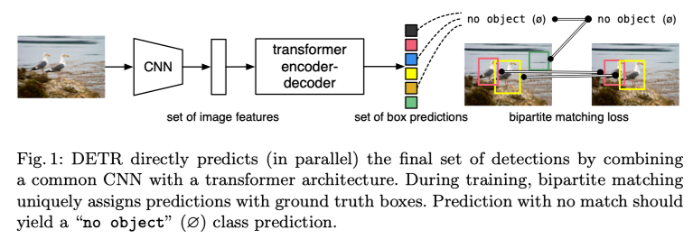

# End-to-End Object Detection with Transformers笔记

> Carion N, Massa F, Synnaeve G, et al. End-to-end object detection with transformers[C]//European Conference on Computer Vision. Springer, Cham, 2020: 213-229.

* 提出了一种**将目标检测视为直接集预测问题**的新方法。我们的方法简化了检测流程，有效地消除了对许多手工设计的组件（例如非最大抑制程序或锚点生成）的需求，这些组件明确地编码了我们对任务的先验知识。
* 新框架的主要成分称为DEtection TRANSformer或DETR，是基于集合的全局损耗，它通过二分匹配和变压器编码器-解码器体系结构来强制进行唯一的预测。给定一小部分学习过的对象查询，DETR会考虑对象与全局图像上下文之间的关系，以直接并行并行输出最终的预测集。与许多其他现代检测器不同，新模型在概念上很简单，并且不需要专门的库。 
* DETR与具有挑战性的COCO对象检测数据集上成熟且高度优化的Faster RCNN基线相媲美，证明了准确性和运行时性能。此外，可以很容易地将DETR概括为以统一的方式产生全景分割。

## 1 Introduction

* 文章将目标检测视为**直接设置的预测问题**，从而简化了培训流程。采用基于transformer的编解码器架构，这是一种用于序列预测的流行架构。transformer的自注意力机制可以显式地建模序列中元素之间的所有成对交互，因此这些体系结构特别适合于集合预测的特定约束，例如**删除重复的预测**。
* DETR可**一次预测所有对象**，并通过设置损失函数进行端到端训练，该函数执行预测对象与地面真实对象之间的二分匹配。 DETR通过删除多个手工设计的组件来简化检测baseline，这些组件对先验知识进行编码，例如空间锚点或非最大抑制。
* DETR的**主要特征**是双向匹配损耗和具有（非自回归）并行解码器的transformer的结合
* ==更准确地说，DETR证明了在大型物体上的显着更好的性能，这一结果很可能是由于变压器的非本地计算而实现的。但是，它在小物体上的性能较低==。

