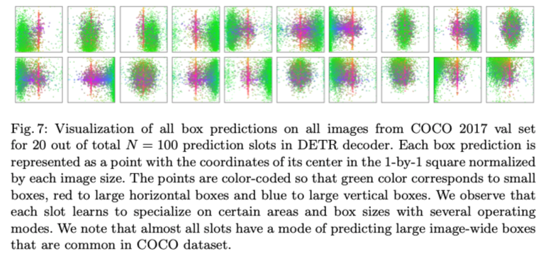
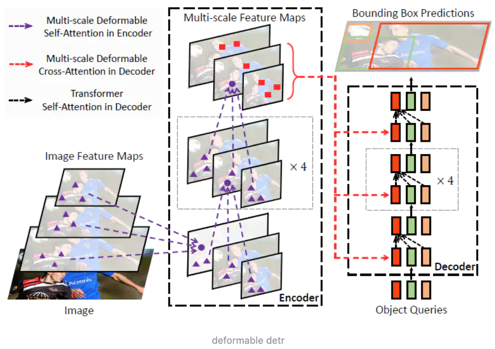

# Deformable DETR: Deformable transformers for end-to-end object detection

> Zhu X, Su W, Lu L, et al. Deformable DETR: Deformable Transformers for End-to-End Object Detection[J]. arXiv preprint arXiv:2010.04159, 2020.

### 1 Abstract

​		这篇文章主要针对的是**DETR收敛速度较慢**以**及空间分辨率因计算资源受限**问题，提出使用==deformable cnn的方式以临近区域采样计算attention取代transformer中全局的self-attention==，提升了收敛速度并获得超于DETR的检测性能，尤其是**小目标**上。

### 2 Introduction

DETR是第一个完全端到端的目标检测器。但是，**DETR存在问题**：

1. 需要较长的训练周期才能收敛；
2. 在小目标上的检测性能较差。主要是因为小目标需要大分辨率，而大分辨率带来DETR难以接受的计算复杂度。

PS：其实DETR文章中的Figure7可以发现，queries具有一定的位置识别功能，也就是说类似于yolo中统计获得anchors尺寸，detr训练过程中实现了目标可能存在位置的统计与分配，显然收敛时间更长，另外全局的attention遍历消耗较大，而detr中需要两次该计算（一次encoder中的self-attention，一次decoder中的cross-attention

* Deformable convolution可以有效地利用稀疏局部位置。dcn一方面能通过改变感受野平衡不同尺寸的目标，且仅计算局部位置信息能提升计算速度，但其缺少刻画元素之间关系的能力。
* 本文将dcn 和 transformer结合，提出了deformable DETR，能够获得较快的收敛速度以及更好的检测性能。其核心是**使用deformable attention 模块取代transformers attention 模块**，如图1所示，对于关键点的特征使用期邻近较小集合内的元素进行相关性刻画。

* 本文还提出了两种提升检测性能的策略：迭代标定框细化策略和两阶段deformable DETR。

### 3 Related work

​		注意力机制。Transformers同时使用了==自注意力机制和互注意力机制==。最初的transformers时间消耗较大且需要的空间存储也较大导致很难推广。目前对其的改进分为三类：

1. 使用预先定义的稀疏的key上注意力模式。其**主要思路**就是降低key的个数，比如fixed local window和网格状key点等；
2. 学习数据依赖型稀疏注意力模式。典型做法包括对key值进行聚类等
3. 探索self-attention本身具有的低秩特性。

* 另外一些变形的卷积操作，比如deformable和dynamic cnn都可以视为一种self-attention机制，只是其没有显式刻画元素之间的关系。
* 本文提出的deformable attention 模块思想源于deformable cnn，属于第二类，即由数据驱动获得对应的keys，（其实也不完全正确，因为deformable cnn也是提前限制了keys的大概范围，所以也有点类似第1种）。deformable attention模块仅从特征图中queries的邻域内预测固定数量的采样点计算attention。
* 目标检测中的多尺度问题。一般来说都是采用多尺度特征解决该问题，比如FPN网络等，本文提出的多尺度deformable attention模块能够自主的**通过注意力机制聚合多尺度特征图**，而不需要特征金字塔网络。

### 4 Transformers和DETR回顾

**Transformers的多头注意力机制**

* 每个head单独刻画queries和keys之间的注意力加权，然后通过权重线性加权获得最终的输出
* $\text { MultiHeadAttn }\left(z_{q}, x\right)=\sum_{m=1}^{M} W_{m}\left[\sum_{k \in \Omega_{k}} A_{m q k} \cdot W_{m}^{\prime} x_{k}\right]$

**DETR改进**

* DETR是建立在transformer 编解码结构上的一个框架，他首先利用匈牙利算法获得预测与gt的最佳匹配，然后再匹配基础上进行loss约束。
* 给定一张backbone提取的特征图， DETR利用标准的transformer的编解码器将其转换为若干queries的特征集合，然后在该特征基础上使用一个3层的前馈网络和一个线性层分别进行box的回归和类别的估计。

### 5 Deformable attention module

$\operatorname{DeformAttn}\left(z_{q}, \boldsymbol{p}_{q}, \boldsymbol{x}\right)=\sum_{m=1}^{M} \boldsymbol{W}_{m}\left[\sum_{k=1}^{K} A_{m q k} \cdot \boldsymbol{W}_{m}^{\prime} \boldsymbol{x}\left(\boldsymbol{p}_{q}+\Delta \boldsymbol{p}_{m q k}\right)\right]$

**deformAttn和self-attention的不同点**：

- self attention是全局特征作为key值， 而deformAttn是在每个query附近自主学习K个key值
- self attention中的权重是key和queries对的关系刻画，比如内积等，而deformAttn则是直接由线性层获得。

​       deformAttn位置选择和deformable cnn的不同点：deformable cnn是在正常的cnn kernel点上分别预测偏移量，而deformAttn则是在当前一个点上直接预测多个偏移量。

**多尺度的Deformable attention模块**

$\operatorname{MSDeformAttn}\left(z_{q}, \hat{p}_{q},\left\{x^{l}\right\}_{l=1}^{L}\right)=\sum_{m=1}^{M} W_{m}\left[\sum_{l=1}^{L} \sum_{k=1}^{K} A_{m l q k} \cdot W_{m}^{\prime} x^{l}\left(\phi_{l}\left(\hat{p}_{q}\right)+\Delta p_{m l q k}\right)\right]$

**Deformable Transformer Encoder**

* 通过可形变注意力模块，作者直接将其替换transformer注意力模块，每个encoder的输入输出都是相同分辨率的多尺度特征图，这里分辨率是指相同尺度下不同encoder的输入。多尺度的特征图直接来自ResNet的最后3个stage，而没有使用FPN，因为**多尺度可形变注意力模块本身能够融合交换不同scale的信息**

* 对于query像素位置，除了position信息外，还融合了该query所在的level

**可行变transformer解码器**

* 在解码器中除了self-attention还有cross-attention。因为deformable attention作用在卷积层上，因此这里只有cross-attention可以被替代，而self-attention则保持不变。对于每一个object query，由线性层和sigmoid学习出其对应的参考点的2d归一化坐标，然后即可以使用deformable attention操作。
* 另外deformable DETR又把DETR拉回了相对坐标回归的路子，预测box时回归的是相对于参考点的距离，能够加快收敛。

**Deformable DETR的其他改进和变种**

* **Iterative Bounding Box Refinement** 针对于多个decoder，每个decoder的输入是前一层的decoder的输出
*  **两阶段deformable DETR**： DETR中的queries是随机初始化的，而两阶段方式则是由Deformable DETR的变种生成初始的候选queries。在第一阶段，移除Deformable DETR中的decoder模块，仅使用encoder模块，每个像素位置都作为queries，直接预测box，然后选择score最大的box作为候选位置。其实第一阶段就有点类似于无锚框单阶段检测思路。

