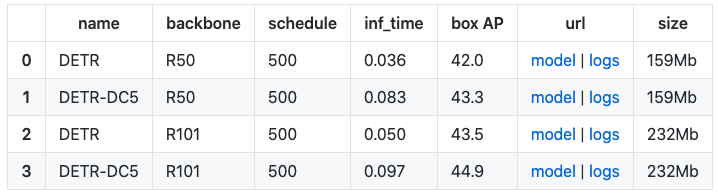
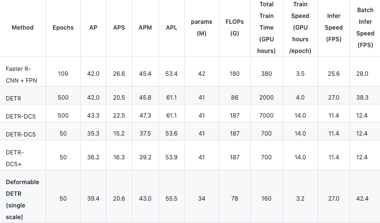
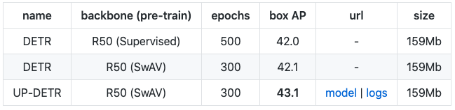
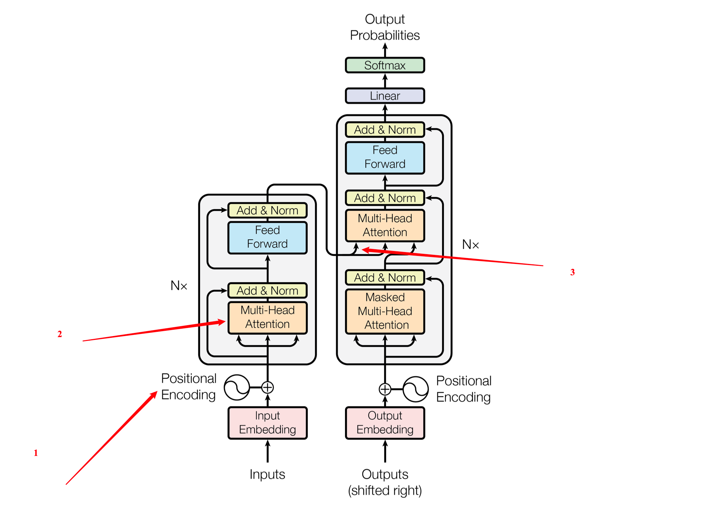

# 基于Transformer实现红外小目标检测

## 一、论文

### 1.1 Attention Is All You Need

> Vaswani A, Shazeer N, Parmar N, et al. Attention is all you need[J]. arXiv preprint arXiv:1706.03762, 2017.

* **提出Transformer的文章**，主要针对的是自然语言处理问题，主要是为了了解Transformer的基础结构
* Transformer是一种避免重复发生的模型体系结构，而是完全依赖于注意力机制来绘制输入和输出之间的全局依存关系

### 1.2 End-to-End Object Detection with Transformers

> Carion N, Massa F, Synnaeve G, et al. End-to-end object detection with transformers[C]//European Conference on Computer Vision. Springer, Cham, 2020: 213-229.

GitHub：https://github.com/facebookresearch/detr（**代码调通**）

* **第一次用Transformer实现目标检测，后续的代码主要都是基于这套代码修改的**
* 可以和Faster-RCNN这种经典模型在mAP上一较高下
* 更准确地说，DETR证明了在大型物体上的显着更好的性能，这一结果很可能是由于Transformer的非本地计算而实现的。但是，**它在小物体上的性能较低**。

**在coco上的指标**

### 1.3 Deformable DETR: Deformable transformers for end-to-end object detection

> Zhu X, Su W, Lu L, et al. Deformable DETR: Deformable Transformers for End-to-End Object Detection[J]. arXiv preprint arXiv:2010.04159, 2020.

GitHub：https://github.com/fundamentalvision/Deformable-DETR（**代码调通**）

* 主要针对的是**DETR收敛速度较慢**以**及空间分辨率因计算资源受限**问题，提出使用deformable cnn的方式以临近区域采样计算attention取代transformer中全局的self-attention。
* 提升了收敛速度并获得超于DETR的检测性能，尤其是**小目标**上。

**在coco上的指标**

### 1.4 UP-DETR- Unsupervised Pre-training for Object Detection with Transformers

> Dai Z, Cai B, Lin Y, et al. UP-DETR: Unsupervised Pre-training for Object Detection with Transformers[J]. arXiv preprint arXiv:2011.09094, 2020.

GitHub：https://github.com/dddzg/up-detr（**代码调通**）

* 将一种名为随机查询补丁检测的新颖借口引入到用于目标检测的预训练转换器中。 
* UP-DETR继承自DETR，具有相同的ResNet-50主干网，相同的Transformer编码器，解码器和相同的代码库。借助无人监督的预训练CNN，整个UP-DETR模型不需要任何人工注释。

**在coco上的指标**

### 1.5 End-to-End Object Detection with Adaptive Clustering Transformer

> Zheng M, Gao P, Wang X, et al. End-to-End Object Detection with Adaptive Clustering Transformer[J]. arXiv preprint arXiv:2011.09315, 2020.

**代码未开源**

* 使用Transformer进行端到端对象检测（DETR）建议使用Transformer执行对象检测，并通过Faster-RCNN之类的两阶段对象检测实现可比的性能。但是，DETR需要算力要求高并且要求高分辨率空间输入。
* 为了**降低高分辨率输入**的计算成本，已提出了一种新型Transformer，称为自适应聚类Transformer（ACT）。 

### 1.6 Rethinking Transformer-based Set Prediction for Object Detection

> Sun Z, Cao S, Yang Y, et al. Rethinking Transformer-based Set Prediction for Object Detection[J]. arXiv preprint arXiv:2011.10881, 2020.

**代码未开源**

* 揭示了导致DETR缓慢收敛的几个因素，主要是**匈牙利损失和Transformer交叉注意机制的问题**。
* 为了克服这些问题，我们提出了两种解决方案，即
	* TSP-FCOS（带有FCOS的基于Transformer的集合预测）
	* TSP-RCNN（带有RCNN的基于Transformer的集合预测）

## 二、实验改进方案

### 2.1 改进方案

**上图是Transformer的基础结构，目前改进Transformer的思路**

1. 在（1）位置处的位置编码处，原始的是RGB通道三通道编码，拟改进为：

* 红外序列图作为**黑白图像**是第一维通道编码
* 结合**共生滤波**，转化为256*256的共生矩阵，这样可以融合图像的低秩性，作为第二维通道编码
* 尽量尝试结合原始序列，利用序列的顺序，**插入一些关于tokens在序列中相对或绝对位置**的信息

2. 在（2）位置处的多头注意力机制，采用DETR的方案，其自注意力机制可以显式地建模序列中元素之间的所有成对交互，因此这些体系结构特别适合于集合预测的特定约束，例如**删除重复的预测**。

3. 在（3）位置处的相加操作，考虑把原来的矩阵相加位置也加到Feed Forward后，以类似于**多级残差形式**的结构

