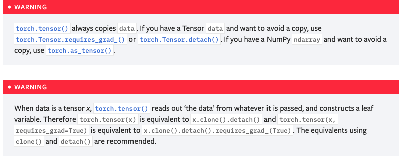
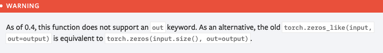
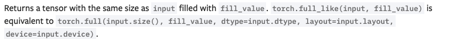

## torch.tensor

```shell
torch.tensor(data, dtype=None, device=None, requires_grad=False, pin_memory=False) → Tensor	
```

```python
>>> torch.tensor([[0.1, 1.2], [2.2, 3.1], [4.9, 5.2]])
tensor([[ 0.1000,  1.2000],
        [ 2.2000,  3.1000],
        [ 4.9000,  5.2000]])

>>> torch.tensor([0, 1])  # Type inference on data
tensor([ 0,  1])

>>> torch.tensor([[0.11111, 0.222222, 0.3333333]], dtype=torch.float64, device=torch.device('cuda:0'))
tensor([[ 0.1111,  0.2222,  0.3333]], dtype=torch.float64, device='cuda:0')
```

* data: 类似于数组，张量的初始数据。可以是列表，元组，NumPy ndarray，标量和其他类型。
* dtype: 返回张量的所需数据类型。默认值：如果为None，则从数据推断数据类型。
* device：返回张量的所需设备。默认值：如果为None，则使用当前设备作为默认张量类型。
	* 对于CPU张量类型，设备将是CPU；
	* 对于CUDA张量类型，设备将是当前CUDA
* require_grad：是否需要梯度，默认为false
* pin_memory：如果设置，返回的张量将分配到固定的内存中，仅适用于CPU张量。




## torch.as_tensor

```shell
torch.as_tensor(data, dtype=None, device=None) → Tensor
```

```python
>>> a = numpy.array([1, 2, 3])
>>> t = torch.as_tensor(a)
>>> t
tensor([ 1,  2,  3])
>>> t[0] = -1
>>> a
array([-1,  2,  3])

>>> a = numpy.array([1, 2, 3])
>>> t = torch.as_tensor(a, device=torch.device('cuda'))
>>> t
tensor([ 1,  2,  3])
>>> t[0] = -1
>>> a
array([1,  2,  3])
```

​		将数据转换为torch.Tensor。如果数据已经是具有相同dtype和设备的Tensor，则不会执行任何复制，否则，如果数据Tensor具有require_grad = True，则将返回新的Tensor，并保留计算图。同样，如果数据是相应dtype的ndarray，而设备是cpu，则不会执行任何复制。

​		**和torch.tensor的区别**在于：torch.tensor是复制数据新建张量，torch.as_tensor是转换为张量，张量改变原数组也会变（默认情况下）

* data: 类似于数组，张量的初始数据。可以是列表，元组，NumPy ndarray，标量和其他类型。
* dtype: 返回张量的所需数据类型。默认值：如果为None，则从数据推断数据类型。
* device：返回张量的所需设备。默认值：如果为None，则使用当前设备作为默认张量类型。
	* 对于CPU张量类型，设备将是CPU；
	* 对于CUDA张量类型，设备将是当前CUDA


## torch.from_numpy

```shell
torch.from_numpy(ndarray) → Tensor
```

从numpy.ndarray转化为Tensor，**共享存储空间**，张量改变，数组也会改变


## torch.zeros

```shell
torch.zeros(*size, out=None, dtype=None, layout=torch.strided, device=None, requires_grad=False) → Tensor
torch.zeros_like(input, dtype=None, layout=None, device=None, requires_grad=False, memory_format=torch.preserve_format) → Tensor
```

```Python
>>> torch.zeros(2, 3)
tensor([[ 0.,  0.,  0.],
        [ 0.,  0.,  0.]])

>>> torch.zeros(5)
tensor([ 0.,  0.,  0.,  0.,  0.])

>>> input = torch.empty(2, 3)
>>> torch.zeros_like(input)
tensor([[ 0.,  0.,  0.],
        [ 0.,  0.,  0.]])
```

* Size：一组整数序列，定义输出的shape，可以是一个变量或者是一个列表




## torch.ones

```shell
torch.ones(*size, out=None, dtype=None, layout=torch.strided, device=None, requires_grad=False) → Tensor
torch.ones_like(input, dtype=None, layout=None, device=None, requires_grad=False, memory_format=torch.preserve_format) → Tensor
```

用法同上


## torch.empty

```shell
torch.empty(*size, out=None, dtype=None, layout=torch.strided, device=None, requires_grad=False, pin_memory=False) → Tensor
torch.empty_like(input, dtype=None, layout=None, device=None, requires_grad=False, memory_format=torch.preserve_format) → Tensor
```

空阵，先占内存（默认数随机）


## torch.full

```
torch.full(size, fill_value, out=None, dtype=None, layout=torch.strided, device=None, requires_grad=False) → Tensor
torch.full_like()
```




## torch.arange

```shell
torch.arange(start=0, end, step=1, out=None, dtype=None, layout=torch.strided, device=None, requires_grad=False) → Tensor
```

返回一个一维张量（**size：(end-start)/step         values: [start, end)** ）

```python
>>> torch.arange(5)
tensor([ 0,  1,  2,  3,  4])
>>> torch.arange(1, 4)
tensor([ 1,  2,  3])
>>> torch.arange(1, 2.5, 0.5)
tensor([ 1.0000,  1.5000,  2.0000])
```


## torch.range

```shell
torch.range(start=0, end, step=1, out=None, dtype=None, layout=torch.strided, device=None, requires_grad=False) → Tensor
```

返回一个一维张量（**size：(end-start)/step+1         values: [start, end]** ）

```python
>>> torch.range(1, 4)
tensor([ 1.,  2.,  3.,  4.])
>>> torch.range(1, 4, 0.5)
tensor([ 1.0000,  1.5000,  2.0000,  2.5000,  3.0000,  3.5000,  4.0000])
```


## torch.linspace

```shell
torch.linspace(start, end, steps=100, out=None, dtype=None, layout=torch.strided, device=None, requires_grad=False) → Tensor
```

返回一个一维张量（**size：step         values: [start, end]** ）

```python
>>> torch.linspace(3, 10, steps=5)
tensor([  3.0000,   4.7500,   6.5000,   8.2500,  10.0000])
>>> torch.linspace(-10, 10, steps=5)
tensor([-10.,  -5.,   0.,   5.,  10.])
>>> torch.linspace(start=-10, end=10, steps=5)
tensor([-10.,  -5.,   0.,   5.,  10.])
>>> torch.linspace(start=-10, end=10, steps=1)
tensor([-10.])
```


## torch.logspace

```shell
torch.logspace(start, end, steps=100, base=10.0, out=None, dtype=None, layout=torch.strided, device=None, requires_grad=False) → Tensor
```

返回一个一维张量（**size：step         values: [base^start, base^end]** ）指数集

```Python
>>> torch.logspace(start=-10, end=10, steps=5)
tensor([ 1.0000e-10,  1.0000e-05,  1.0000e+00,  1.0000e+05,  1.0000e+10])
>>> torch.logspace(start=0.1, end=1.0, steps=5)
tensor([  1.2589,   2.1135,   3.5481,   5.9566,  10.0000])
>>> torch.logspace(start=0.1, end=1.0, steps=1)			# step为1时以start为指数
tensor([1.2589])
>>> torch.logspace(start=2, end=2, steps=1, base=2)
tensor([4.0])
```


## torch.eye

```shell
torch.eye(n, m=None, out=None, dtype=None, layout=torch.strided, device=None, requires_grad=False) → Tensor
```

单位阵，n为阶数


## torch.cat

```shell
torch.cat(tensors, dim=0, out=None) → Tensor
```

将多个序列按照指定维度连接在一起，除了连接的维度，其余维度必须相同

* tensor：任何Python张量序列（type相同），所提供的非空张量必须维度shape相同（除连接的那个维度）
* dim：指定cat的维度
* out：输出

```Python
>>> x = torch.randn(2, 3)
>>> x
tensor([[ 0.6580, -1.0969, -0.4614],
        [-0.1034, -0.5790,  0.1497]])
>>> torch.cat((x, x, x), 0)			# 第0维，也就是按行cat
tensor([[ 0.6580, -1.0969, -0.4614],
        [-0.1034, -0.5790,  0.1497],
        [ 0.6580, -1.0969, -0.4614],
        [-0.1034, -0.5790,  0.1497],
        [ 0.6580, -1.0969, -0.4614],
        [-0.1034, -0.5790,  0.1497]])
>>> torch.cat((x, x, x), 1)			# 第1维，也就是按列cat
tensor([[ 0.6580, -1.0969, -0.4614,  0.6580, -1.0969, -0.4614,  0.6580, -1.0969, -0.4614],
        [-0.1034, -0.5790,  0.1497, -0.1034, -0.5790,  0.1497, -0.1034, -0.5790,  0.1497]])
```


## torch.chunk

```shell
torch.chunk(input, chunks, dim=0) → List of Tensors
```

将输入的张量分隔为多组块，如果被分隔的维度无法整除，最后一个块会小一些

```python
>>> b
tensor([[0., 0., 0.],
        [0., 0., 0.]])
>>> torch.chunk(b,2,0)
(tensor([[0., 0., 0.]]), 
 tensor([[0., 0., 0.]]))
>>> torch.chunk(b,3,1)
(tensor([[0.],
        [0.]]), 
 tensor([[0.],
        [0.]]), 
 tensor([[0.],
        [0.]]))
>>> torch.chunk(b,2,1)
(tensor([[0., 0.],
        [0., 0.]]), 
 tensor([[0.],
        [0.]]))
```


## torch.split

```shell
torch.split(tensor, split_size_or_sections, dim=0)
```

在指定维度分割张量，split_size_or_sections可以为整数，也可以为列表

* 整数：类似于chunk
* 列表：分割成列表中每个尺寸，个数为 len(split_size_or_sections)

```python
>>> a = torch.randn(3,4)
>>> a
tensor([[-0.0622,  1.4364, -2.2190,  0.7706],
        [ 0.3149, -0.1662,  3.1075,  1.7752],
        [-0.0688,  0.0369,  0.2697, -0.5246]])
>>> torch.split(a,2,0)
(tensor([[-0.0622,  1.4364, -2.2190,  0.7706],
        [ 0.3149, -0.1662,  3.1075,  1.7752]]), 
 tensor([[-0.0688,  0.0369,  0.2697, -0.5246]]))
>>> torch.split(a,2,1)
(tensor([[-0.0622,  1.4364],
        [ 0.3149, -0.1662],
        [-0.0688,  0.0369]]), 
 tensor([[-2.2190,  0.7706],
        [ 3.1075,  1.7752],
        [ 0.2697, -0.5246]]))
>>> torch.split(a,[1,3],1)
(tensor([[-0.0622],
        [ 0.3149],
        [-0.0688]]), 
 tensor([[ 1.4364, -2.2190,  0.7706],
        [-0.1662,  3.1075,  1.7752],
        [ 0.0369,  0.2697, -0.5246]]))
```


## torch.gather

```shell
torch.gather(input, dim, index, out=None, sparse_grad=False) → Tensor

out[i][j][k] = input[index[i][j][k]][j][k]  # if dim == 0
out[i][j][k] = input[i][index[i][j][k]][k]  # if dim == 1
out[i][j][k] = input[i][j][index[i][j][k]]  # if dim == 2
```

将输入按照指定方式、指定维度输出，shape不变

```python
>>> t = torch.tensor([[1,2],[3,4]])
>>> torch.gather(t, 1, torch.tensor([[0,0],[1,0]]))
tensor([[ 1,  1],
        [ 4,  3]])
```


## torch.index_select

```shell
torch.index_select(input, dim, index, out=None) → Tensor
```

将输入按照指定维度输出，shape改变

```python
>>> x = torch.randn(3, 4)
>>> x
tensor([[ 0.1427,  0.0231, -0.5414, -1.0009],
        [-0.4664,  0.2647, -0.1228, -1.1068],
        [-1.1734, -0.6571,  0.7230, -0.6004]])
>>> indices = torch.tensor([0, 2])
>>> torch.index_select(x, 0, indices)			# 取0、2两行
tensor([[ 0.1427,  0.0231, -0.5414, -1.0009],
        [-1.1734, -0.6571,  0.7230, -0.6004]])
>>> torch.index_select(x, 1, indices)			# 取0、2两列
tensor([[ 0.1427, -0.5414],
        [-0.4664, -0.1228],
        [-1.1734,  0.7230]])
```


## torch.narrow

```shell
torch.narrow(input, dim, start, length) → Tensor
```

输出指定维度的从start到start+length的数据

```python
>>> x = torch.tensor([[1, 2, 3], [4, 5, 6], [7, 8, 9]])
>>> torch.narrow(x, 0, 0, 2)
tensor([[ 1,  2,  3],
        [ 4,  5,  6]])
>>> torch.narrow(x, 1, 1, 2)
tensor([[ 2,  3],
        [ 5,  6],
        [ 8,  9]])
```


## torch.reshape

```shell
torch.reshape(input, shape) → Tensor
```

必须数据量相同，shape不同


## torch.squeeze

```shell
torch.squeeze(input, dim=None, out=None) → Tensor
torch.unsqueeze(input, dim) → Tensor
```

将输入张量收缩，所有一维的维度删除

返回在指定位置插入的尺寸为1的新张量

```python
>>> x = torch.zeros(2, 1, 2, 1, 2)
>>> x.size()
torch.Size([2, 1, 2, 1, 2])
>>> y = torch.squeeze(x)
>>> y.size()
torch.Size([2, 2, 2])
>>> y = torch.squeeze(x, 0)				# 给定dim,则只检查给定维度是否为1
>>> y.size()
torch.Size([2, 1, 2, 1, 2])
>>> y = torch.squeeze(x, 1)
>>> y.size()
torch.Size([2, 2, 1, 2])

>>> x = torch.tensor([1, 2, 3, 4])
>>> torch.unsqueeze(x, 0)
tensor([[ 1,  2,  3,  4]])
>>> torch.unsqueeze(x, 1)
tensor([[ 1],
        [ 2],
        [ 3],
        [ 4]])
```


## torch.stack

```shell
torch.stack(tensors, dim=0, out=None) → Tensor
```

将两个张量序列在一个**新的维度**cat，输入的所有张量必须统一尺寸

```python
>>> b = torch.ones(3,4)
>>> b
tensor([[1., 1., 1., 1.],
        [1., 1., 1., 1.],
        [1., 1., 1., 1.]])
>>> torch.stack((a,b))
tensor([[[-0.0622,  1.4364, -2.2190,  0.7706],
         [ 0.3149, -0.1662,  3.1075,  1.7752],
         [-0.0688,  0.0369,  0.2697, -0.5246]],

        [[ 1.0000,  1.0000,  1.0000,  1.0000],
         [ 1.0000,  1.0000,  1.0000,  1.0000],
         [ 1.0000,  1.0000,  1.0000,  1.0000]]])
>>> c = torch.stack((a,b))
>>> print(c.size())
torch.Size([2, 3, 4])
```


## torch.t

```shell
torch.t(input) → Tensor
```

输入为零维/一维/二维张量，0/1时直接返回自身，2时返回转置

```python
>>> x = torch.randn(3)
>>> x
tensor([ 2.4320, -0.4608,  0.7702])
>>> torch.t(x)
tensor([ 2.4320, -0.4608,  0.7702])
>>> x = torch.randn(2, 3)
>>> x
tensor([[ 0.4875,  0.9158, -0.5872],
        [ 0.3938, -0.6929,  0.6932]])
>>> torch.t(x)
tensor([[ 0.4875,  0.3938],
        [ 0.9158, -0.6929],
        [-0.5872,  0.6932]])
```


## torch.take

```shell
torch.take(input, index) → Tensor
```

将输入的张量看做一维，取其中指定index的项

```python
>>> src = torch.tensor([[4, 3, 5],
                        [6, 7, 8]])
>>> torch.take(src, torch.tensor([0, 2, 5]))
tensor([ 4,  5,  8])
```


## torch.transpose

```shell
torch.transpose(input, dim0, dim1) → Tensor
```

张量转置，dim0和dim1转置


## torch.unbind

```shell
torch.unbind(input, dim=0) → seq
```

将张量删除其中一维，默认为0，对于二维数组而言，就是返回3个行张量

```python
>>> torch.unbind(torch.tensor([[1,2,3],[4,5,6],[7,8,9]]))
(tensor([1, 2, 3]), tensor([4, 5, 6]), tensor([7, 8, 9]))
```


## torch.where

```shell
torch.where(condition, x, y) → Tensor
```

类似于if-else

```python
>>> x = torch.randn(3, 2)
>>> y = torch.ones(3, 2)
>>> x
tensor([[-0.4620,  0.3139],
        [ 0.3898, -0.7197],
        [ 0.0478, -0.1657]])
>>> torch.where(x > 0, x, y)
tensor([[ 1.0000,  0.3139],
        [ 0.3898,  1.0000],
        [ 0.0478,  1.0000]])
```


## torch.normal

```shell
torch.normal(mean, std, *, generator=None, out=None) → Tensor
torch.normal(mean=0.0, std, out=None) → Tensor
torch.normal(mean, std=1.0, out=None) → Tensor
torch.normal(mean, std, size, *, out=None) → Tensor
```

```python
>>> torch.normal(mean=torch.arange(1., 11.), std=torch.arange(1, 0, -0.1))
tensor([  1.0425,   3.5672,   2.7969,   4.2925,   4.7229,   6.2134,
          8.0505,   8.1408,   9.0563,  10.0566])
>>> torch.normal(mean=0.5, std=torch.arange(1., 6.))
tensor([-1.2793, -1.0732, -2.0687,  5.1177, -1.2303])
>>> torch.normal(mean=torch.arange(1., 6.))
tensor([ 1.1552,  2.6148,  2.6535,  5.8318,  4.2361])
>>> torch.normal(2, 3, size=(1, 4))
tensor([[-1.3987, -1.9544,  3.6048,  0.7909]])
```


## torch.rand

```shell
torch.rand(*size, out=None, dtype=None, layout=torch.strided, device=None, requires_grad=False) → Tensor
torch.randint(low=0, high, size, *, generator=None, out=None)
torch.randn(*size, out=None, dtype=None, layout=torch.strided, device=None, requires_grad=False) → Tensor
```

* 返回[0, 1]内的随机数
* 返回指定区间的随机整数
* 返回指定尺寸的正态分布


