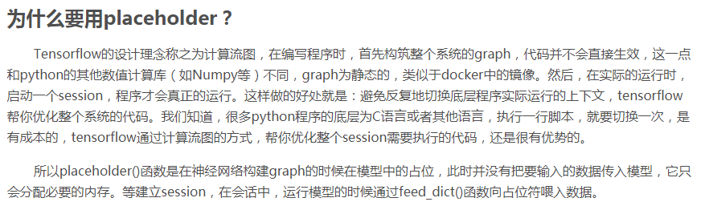
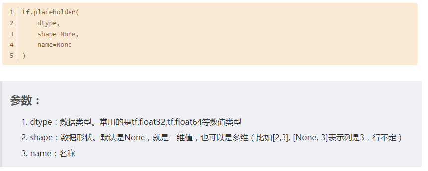
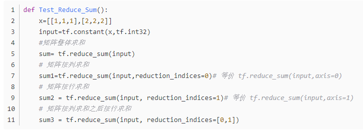
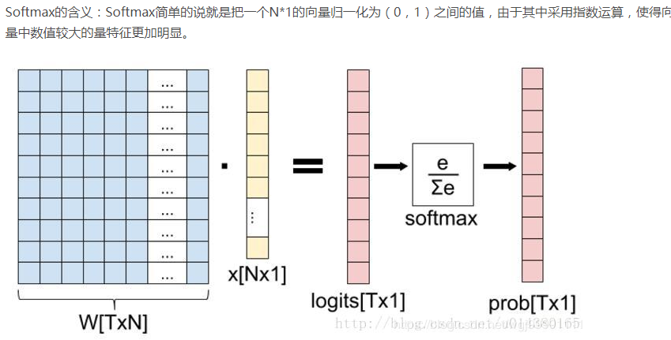
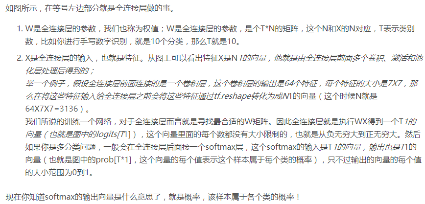
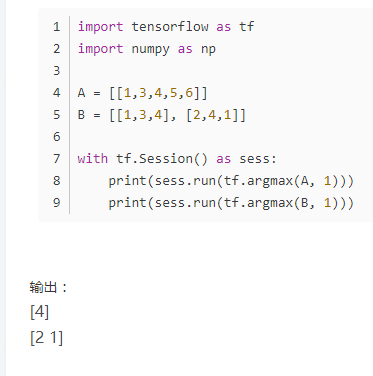

# Tensorflow笔记

## 常量创建方法

```python
a = tf.constant('hello', dtype=tf.string)
b = tf.constant(1.0, dtype=float32)
```


## 变量创建方法

```python
a = tf.Variable(2, tf.int32)
```


## 常用数据类型

| 数据类型  |      说明      |   数据类型    |    说明    |
| :-------: | :------------: | :-----------: | :--------: |
|  tf.int   |    8位整数     |   tf.string   |   字符串   |
| tf.int16  |    16位整数    |    tf.bool    |   布尔型   |
| tf.int32  |    32位整数    | tf.complex64  |  64位复数  |
| tf.int64  |    64位整数    | tf.complex128 | 128位复数  |
| tf.uint8  | 8位无符号整数  |  tf.float16   | 16位浮点数 |
| tf.uint16 | 16位无符号整数 |  tf.float32   | 32位浮点数 |


## 常用函数

|            操作             |            描述            |
| :-------------------------: | :------------------------: |
|   tf.add(x, y, name=None)   |            求和            |
|   tf.sub(x, y, name=None)   |            减法            |
|   tf.mul(x, y, name=None)   |            乘法            |
|   tf.div(x, y, name=None)   |            除法            |
|   tf.mod(x, y, name=None)   |            取模            |
|    tf.abs(x, name=None)     |           绝对值           |
|    tf.neg(x, name=None)     |            取负            |
|    tf.sign(x, name=None)    | 返回符号y = sign(x),-1,0,1 |
|    tf.inv(x, name=None)     |        取反(二进制)        |
|   tf.square(x, name=None)   |            平方            |
|    tf.sqrt(x, name=None)    |            根号            |
|    tf.exp(x, name=None)     |          e的次方           |
|    tf.log(x, name=None)     |          计算log           |
| tf.maximum(x, y, name=None) |   返回最大值(x>y ? x:y)    |
| tf.minimum(x, y, name=None) |   返回最小值(x<y ? x:y)    |


## 矩阵

### 创建矩阵

```python
tf.constant([1,2,3], shape=[2,3])
# 生成一个两行三列的矩阵，第二行的数值由输入的数值进行补全
```

### 创建随机矩阵

```python
tf.random_normal(shape, mean=0.0, stddev=1.0, dtype=tf.float32, seed=None, name=None)
# 正态分布随机数，均值为mean，标准差为stddev

tf.truncated_normal(shape, mean=0.0, stddev=1.0, dtype=tf.float32, seed=None, name=None)
# 截断正态分布随机数，均值mean，标准差stddev，范围在【mean - 2 * stddev, mean + 2 * stddev】

tf.random_uniform(shape, minval=0, maxval=None, dtype=tf.float32, seed=None, name=None)
# 均匀分布随机数，范围在【minval, maxval】
```

### 查看维数

```python
tf.shape(Tensor)
```

* 若shape=[-1]，表示将tensor展开成一个list
* 若shape=[a,b,c,…]，常规语法（abc均大于0）
* 若shape=[a,-1,c,…]，表示tf会根据tensor的原尺寸自动计算b的值

### 矩阵函数

| 操作                                                         | 描述                                                         |
| :----------------------------------------------------------- | :----------------------------------------------------------- |
| tf.diag(diagonal, name=None)                                 | 返回一个给定对角值的对角tensor<br /># ‘diagonal’ is [1, 2, 3, 4]<br />tf.diag(diagonal)==><br />[[1, 0, 0, 0]<br />[0, 2, 0, 0]<br />[0, 0, 3, 0]<br />[0, 0, 0, 4]]<br /> |
| tf.diag_part(input, name=None)                               | 功能与上面相反                                               |
| tf.trace(x, name=None)                                       | 求一个2维tensor足迹，即对角值diagonal之和                    |
| tf.transpose(a, perm=None, name=‘transpose’)                 | 调换tensor的维度顺序<br />按照列表perm的维度排列调换tensor顺序<br />如定义，则perm为(n-1…0)<br /># ‘x’ is [[1,2,3],[4,5,6]]<br />tf.transpose(x) ==> [[1 4], [2 5], [3 6]]<br />#Equivalently<br />tf.transpose(x, perm=[1,0]) ==> [[1 4], [2 5], [3 6]] |
| tf.matmul(a, b, <br />transpose_a=False, transpose_b=False, <br />a_is_sparse=False, b_is_sparse=False, name=None) | 矩阵相乘                                                     |
| tf.matrix_determinant(input, name=None)                      | 返回方阵的行列式                                             |
| tf.matrix_inverse(input, adjoint=None, name=None)            | 求方阵的逆矩阵，adjoint=True时，<br />计算输入共轭矩阵的逆矩阵 |
| tf.cholesky(input, name=None)                                | 对输入方阵cholesky分解，<br />即把一个对称正定的矩阵表示成一个下三角<br />矩阵**L**和其转置的乘积的分解A=LL^T |
| tf.matrix_solve(matrix, rhs, adjoint=None, name=None)        | 求解，matrix为方阵，shape=[M,M]<br />rhs的shape为[M, K]<br />output为[M, K] |


## tf.placeholder






## tf.reduce_sum




## 队列常用方法

| 操作                             | 描述                                                         |
| -------------------------------- | ------------------------------------------------------------ |
| class.tf.QueueBase               | 基本的队列应用类，通过多个步骤存储tensors，进行入列和出列操作 |
| tf.enqueue(vals, name=None)      | 将一个元素编入该队列中，若已满，则会堵塞                     |
| tf.enqueue_many(vals, name=None) | 将零个或者多个元素编入该队列中                               |
| tf.dequeue(name=None)            | 将元素从队列中移除                                           |
| tf.dequeue_many(n, name=None)    | 将一个或者多个元素从队列中移除                               |
| tf.size(name=None)               | 计算队列中的元素个数                                         |
| tf.close                         | 关闭该队列                                                   |
| f.dequeue_up_to(n, name=None)    | 从该队列中移除n个元素并将之连接                              |
| tf.dtypes                        | 列出组成元素的数据类型                                       |
| tf.from_list(index, queues)      | 根据queue[index]的参考队列创建一个队列                       |
| tf.name                          | 返回队列最下面元素的名称                                     |
| tf.names                         | 返回队列每一个组成部分的名称                                 |
| class.tf.PaddingFIFOQueue        | 一个FIFOQueue                                                |
| class.tf.FIFOQueue               | 出列时按照先入先出顺序                                       |
| class.tf.RandomShuffleQueue      | 出列时按照随机元素出列                                       |


## 线程协调

​		**Coordinator**和**QueueRunner**函数对线程进行控制和协调。在使用上，两个类必须同时工作，共同协作来停止会话中所有线程，并向在等待所有工作线程终止的程序报告


## 卷积函数

```python
tf.nn.conv2d(input, filter, strides, padding, use_cudnn_on_gpu=None, name=None)
```

* **input**：指需要做卷积的输入图像，要求是一个**Tensor**，具有**[batch, in_height, in_width, in_channels]**这样的shape，分别代表一个batch的图片数量，图片高、宽，图像通道数，要求类型为float32或者float64
* **filter**：相当于CNN中的卷积核，要求是一个Tensor，具有**[filter_height, filter_width, in_channels, out_channels]**这样的shape
* **strides**:卷积时在图像每一维的步长，是一个一维的向量，第一维和第四维默认为1，而第三维和第四维分别是平行和竖直滑行的步长距离
* **padding**:String类型的量，只能是**SAME**、**VALID**其中之一，这个值决定了不同的卷积方式
* **use_cudnn_on_gpu**:bool类型，是否使用cudnn加速，默认为true


## 池化运算

```python
tf.nn.max_pool(value, ksize, strides, padding, name=None)
```

* **value**：需要池化的输入，一般池化层接在卷积层后面，所以输入通常是**featuremap**，依然是**[batch, height, width, channels]**这样的shape
* **ksize**：池化窗口的大小，取一个四维向量，一般是**[1, height, width, 1]**，因为不需要在batch和channel上做池化，所以这两个维度设为1
* **strides**：与卷积类似，窗口在每一个维度上滑动的步长，一般也是**[1, stride, stride, 1]**
* **padding**：与卷积类似，可以去**VALID**或者**SAME**，返回一个Tensor


​		池化最重要的作用就是帮助输入的数据表示近似不变性，对于平移不变性指的是对输入的数据进行少量平移时，经过池化后的输出结果并不会发生改变。局部平移不变性是一个很有用的性质，尤其是当关心某个特征是否出现而不关心它出现的具体位置时。


# tf.nn.softmax






# tf.argmax

* 返回的是vector中的最大值的索引号，如果vector是一个向量，那就返回一个值，如果是一个矩阵，那就返回一个向量，这个向量的每一个维度都是相对应矩阵行的最大值元素的索引号。
* 


