[TOC]

# RabbitMQ

> 中间件是处于操作系统和应用程序之间的软件，也可以说属于操作系统中的一部分。在使用时，往往是一组中间件集成在一起，构成一个平台（包括开发平台和运行平台），但在这组中间件中必须有一个通信中间件，即 中间件=平台+通信，这个定义也限定了只有用于分布式系统中才能称为中间件，还可以把它与支撑软件和实用软件区分开来。

**为什么要用中间件**

​		具体的说，中间件屏蔽了底层操作系统的复杂性，使程序开发人员面对一个简单而统一的开发环境，减少程序设计的复杂性，将注意力集中在自己的业务上，不必再为程序在不同系统软件上的移植而重复工作，从而大大减少了技术上的负担。中间件带给应用系统的，不只是开发的简便、开发周期的缩短，也减少了系统的维护、运行和管理的工作量，还减少了计算机总体费用的投入。


**消息中间件应用场景**

1. 跨系统数据传输
2. 高并发流量削峰
3. 数据的分发和异步处理
4. 大数据分析与传递
5. 分布式事务


## 一、消息队列协议

### 1.1 网络协议的三要素

1. 语法。语法是用户数据与控制信息的结构与格式，以及数据出现的顺序
2. 语义。语义是解释控制信息每个部分的意义。它规定了需要发出何种控制信息，以及完成的动作与做出什么样的响应。
3. 时序。时序是对事件发生顺序的详细说明。

消息中间件采用的不是HTTP协议，而常见的消息中间件协议有：OpenWire、AMQP、MQTT、Kafka、OpenMessage协议

> 为什么消息中间件不直接使用HTTP协议？

1. 因为HTTP请求报文头和响应报文头是比较复杂的，包含了cookie、数据的加密解密、状态码、响应码等附加的功能，但是对于一个消息而言，我们并不需要这么复杂，也没有这个必要性，它其实就是负责数据传递、存储、分发就行，一定要追求的是高性能，所以需要尽量简洁、快速。
2. 大部分情况下HTTP都是短链接（短链接不适合存储，没有持久化功能），在实际的交互过程中，一个请求到响应很有可能会中断，中断以后就不会进行持久化，会造成请求的丢失。这样就不利于消息中间件的业务场景，因为消息中间件可能是一个长期的获取消息的过程，出现问题和故障要对数据或消息进行持久化等，目的是为了保证消息和数据的高可靠和稳健的运行。

### 1.2 AMQP协议

> AMQP（Advanced Message Queuing Protocol）是高级消息队列协议，是一个提供统一消息服务的应用层标准高级消息队列协议，是应用层协议的一个开放标准，为面向消息的中间件设计。基于此协议的客户端与消息中间件可传递消息，并不受客户端/中间件不同产品、不同的开发语言等条件的限制。Erlang中的实现有RabbitMQ等。

**特性**

1. 分布式事务支持
2. 消息的持久化支持
3. 高性能和高可能的消息处理优势。

### 1.3 MQTT协议

> MQTT（Message Queuing Telemetry Transport）消息队列是IBM开放的一个即时通讯协议，物联网系统架构中的重要组成部分。

**特点**

1. 轻量
2. 结构简单
3. 传输快，不支持事务
4. 没有持久化设计

**应用场景**

1. 适用于计算能力有限
2. 低带宽
3. 网络不稳定的场景

### 1.4 OpenMessage协议

> 由阿里、雅虎和滴滴等共同参与创建的分布式消息中间件、流处理等领域的应用开发标准

**特点**

1. 结构简单
2. 解析速度快
3. 支持事务和持久化设计

### 1.5 Kafka协议

> Kafka协议是基于TCP/IP的二进制协议，消息内部通过长度来分割，由一些基本数据类型组成

**特点**

1. 结构简单
2. 解析速度快
3. 无事务支持
4. 有持久化设计


## 二、消息队列高可用和高可靠

### 2.1 高可用机制

> 高可用：指产品在规定的条件和规定的时间内处于可执行规定功能状态的能力。
>
> 当业务量增加时，请求也过大，一台消息中间件服务器会触及硬件极限，一台消息服务器已经无法满足业务的需求，所以消息中间件必须支持集群部署，以达到高可用的目的。

**集群模式-1  Master-salve主从共享数据的部署方式**

缺点：数据只有一份


**集群模式-2 Master-salve主从同步部署方式**


缺点：复制过程会消耗性能

**集群模式-3 多主集群同步部署方式**


**集群模式-4 多主基于转发部署方式**


**集群模式-5 Master-salve与Breoker-cluster组合的方案**


**结论**

1. 消息共享
2. 消息同步
3. 元数据共享

### 2.2 高可靠机制

> 指系统可以无故障的持续运行

如何保证中间件消息的可靠性？可以从两个方面考虑

1. 消息的传输：通过协议来保证系统间数据解析的正确性
2. 消息的存储可靠：通过持久化来保证消息的可靠性


## 三、RabbitMQ安装

> RabbitMQ是一个开源的遵循AMQP协议实现的、基于Erlang语言编写，支持多种客户端。用于在分布式系统中存储消息、转发消息，具有高可用、高可扩行、易用性等特征。

### 3.1 安装

```shell
sudo apt-get install erlang-nox
```

更新源

```shell
sudo apt-get update
```

安装

```shell
sudo apt-get install rabbitmq-server
```

启动、停止、状态rabbitMq命令

```shell
systemctl start rabbitmq-server
systemctl stop rabbitmq-server
systemctl status rabbitmq-server
systemctl enable rabbitmq-server
```

### 3.2 界面

默认没有安装web的客户端插件，需要安装

```shell
rabbitmq-plugins enable rabbitmq_management
```

安装完成，重启RabbitMQ

```shell
systemctl restart rabbitmq-server
```

在浏览器访问`http://47.110.157.73:15672/`

### 3.3 新增用户

```shell
rabbitmqctl add_user komorebi 123456								# 新增
rabbitmqctl set_user_tags komorebi administrator					# 赋予权限
rabbitmqctl change_password komorebi 654321
```

**用户级别**

1. `administrator`：可以登录控制台、查看所有信息、可以对RabbitMQ进行管理
2. `monitoring`：监控者，登录控制台、查看所有信息
3. `policymaker`：策略制定者，登录控制台、指定策略
4. `management`：普通管理员，登录控制台
5. `none`：不能访问management plugin

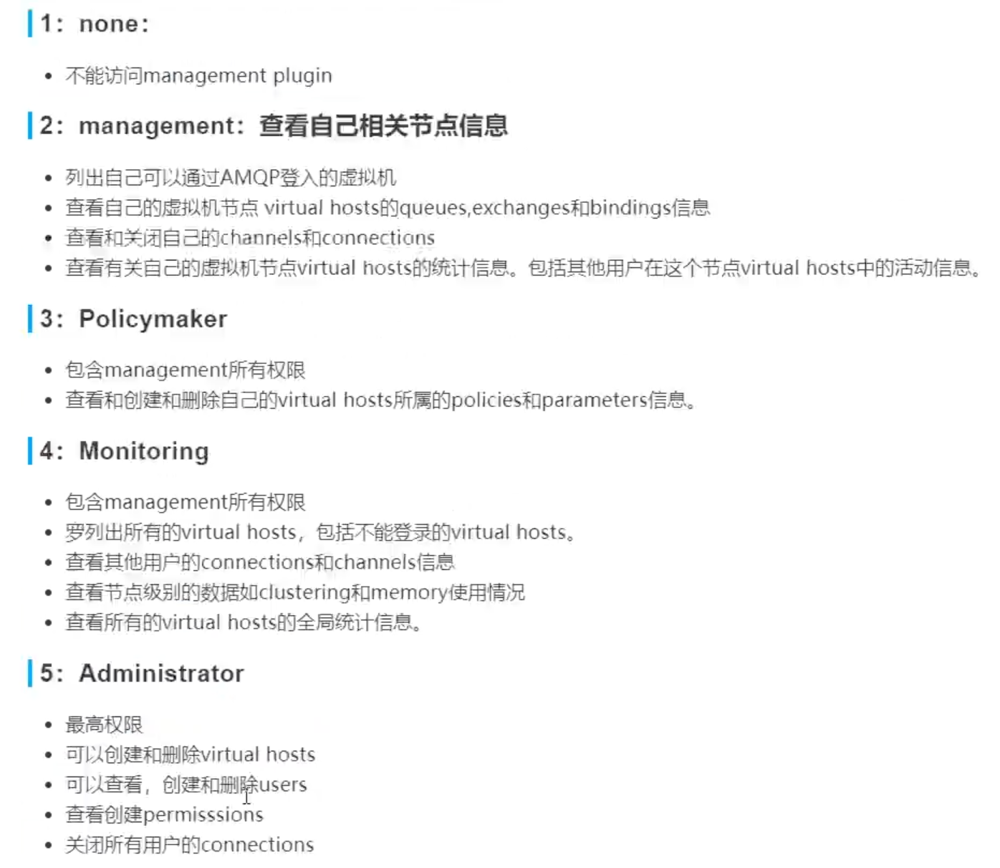

```
rabbitmqctl.bat set_permissions -p / admin ".*" ".*" ".*"
```

### 3.4 Docker安装RabbitMQ

```dockerfile
docker run -di --name myrabbit -e RABBITMQ_DEFAULT_USER=komorebi -e RABBITMQ_DEFAULT_PASS=123456 -p 15672:15672 -p 5672:5672 -p 25672:25672 -p 61613:61613 -p 1883:1883 rabbitmq:management
```

```dockerfile
docker images
docker ps -a
docker start IDXXX
```

###  3.5 运行流程

 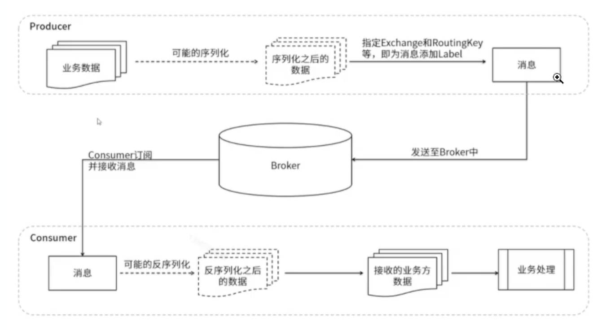


## 四、配置

### 4.1 快速开始（Simple模式）

1. 新建maven项目

2. 导入依赖

	```xml
	<dependency>
	    <groupId>com.rabbitmq</groupId>
	    <artifactId>amqp-client</artifactId>
	    <version>5.10.0</version>
	</dependency>
	```

3. 新建`Producer`

	```java
	public class Producer {
	    public static void main(String[] args) throws IOException, TimeoutException {
	        // 所有的中间件技术都是基于tcp/ip协议基础之上构建新型的协议规范，只不过rabbitmq遵循的是amqp
	
	        // 1：创建连接工程
	        ConnectionFactory connectionFactory = new ConnectionFactory();
	        connectionFactory.setHost("47.110.157.73");
	        connectionFactory.setPort(5672);
	        connectionFactory.setUsername("komorebi");
	        connectionFactory.setPassword("123456");
	        connectionFactory.setVirtualHost("/");
	
	        // 2：创建连接Connection
	        Connection connection = connectionFactory.newConnection("生产者");
	
	        // 3：通过连接获取通道Channel
	        Channel channel = connection.createChannel();
	
	        // 4：通过通道创建交换机，声明队列，绑定关系，路由Key，发送消息和接收消息
	        String queueName = "queue1";
	        /**
	         * @params1 队列的名称
	         * @params2 是否要持久化durable=false
	         * @params3 排他性，是否是独占
	         * @params4 是否自动删除，随着最后一个消费者消息完毕后是否把队列自动删除
	         * @params5 携带附属参数
	         */
	        channel.queueDeclare(queueName, false, false, false, null);
	
	        // 5：发送消息内容
	        String message = "hello rabbitmq";
	
	        // 6：发送消息给队列queue
	        /**
	         * @params1：交换机
	         * @params2：队列，路由key
	         * @params3：消息的状态控制
	         * @params4：消息主题
	         */
	        channel.basicPublish("", queueName, null, message.getBytes());
	        System.out.println("消息发送成功");
	
	        // 7：关闭连接
	        if (channel != null && channel.isOpen()) {
	            channel.close();
	        }
	
	        // 8：关闭通道
	        if (connection != null && connection.isOpen()) {
	            connection.close();
	        }
	    }
	}
	```

4. 新建`Consumer`

	```java
	public class Consumer {
	    public static void main(String[] args) throws IOException, TimeoutException {
	        // 所有的中间件技术都是基于tcp/ip协议基础之上构建新型的协议规范，只不过rabbitmq遵循的是amqp
	
	        // 1：创建连接工程
	        ConnectionFactory connectionFactory = new ConnectionFactory();
	        connectionFactory.setHost("47.110.157.73");
	        connectionFactory.setPort(5672);
	        connectionFactory.setUsername("komorebi");
	        connectionFactory.setPassword("123456");
	        connectionFactory.setVirtualHost("/");
	
	        // 2：创建连接Connection
	        Connection connection = connectionFactory.newConnection("消费者");
	
	        // 3：通过连接获取通道Channel
	        Channel channel = connection.createChannel();
	
	        // 4：通过通道创建交换机，声明队列，绑定关系，路由Key，发送消息和接收消息
	        channel.basicConsume("queue1", true, new DeliverCallback() {
	            public void handle(String s, Delivery message) throws IOException {
	                System.out.println("收到消息是" + new String(message.getBody(), "UTF-8"));
	            }
	        }, new CancelCallback() {
	            public void handle(String s) throws IOException {
	                System.out.println("接收失败了...");
	            }
	        });
	        System.out.println("开始接收消息");
	        System.in.read();
	
	        // 5：关闭连接
	        if (channel != null && channel.isOpen()) {
	            channel.close();
	        }
	
	        // 6：关闭通道
	        if (connection != null && connection.isOpen()) {
	            connection.close();
	        }
	    }
	}
	```

5. 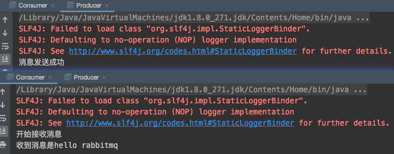


###  4.2 RabbitMQ支持消息的模式（7种）

[官方教程](https://www.rabbitmq.com/getstarted.html)


### 4.3 SpringBoot-fanout-producer

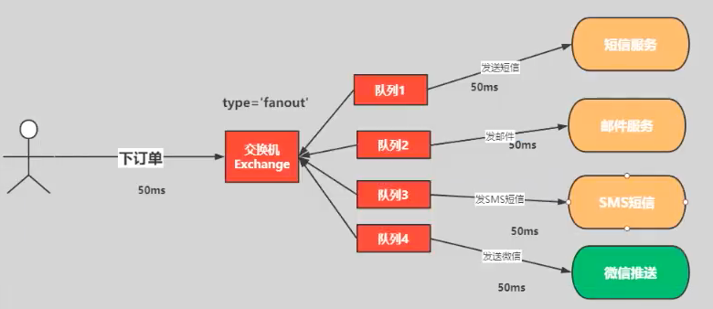

1. 新建SpringBoot工程，选择Web和RabbitMQ组件

2. 配置yml

	```yml
	# 服务端口
	server:
	  port: 8080
	# 配置RabbitMQ服务
	spring:
	  rabbitmq:
	    username: komorebi
	    password: 123456
	    virtual-host: /
	    host: 47.110.157.73
	    port: 5672
	```

3. 新建Service包下`OrderService.java`

	```java
	package com.komorebi.springbootrabbitmqorderproducer.service;
	
	import org.springframework.amqp.rabbit.core.RabbitTemplate;
	import org.springframework.beans.factory.annotation.Autowired;
	import org.springframework.stereotype.Service;
	
	import java.util.UUID;
	
	@Service
	public class OrderService {
	    @Autowired
	    private RabbitTemplate rabbitTemplate;
	
	    public void makeOrder(String userId, String productId, int num) {
	        // 1 根据商品ID查询库存
	        // 2 保存订单
	        String orderId = UUID.randomUUID().toString();
	        System.out.println("订单生成成功" + orderId);
	
	        // 3 通过MQ完成消息的分发
	        // 参数1：交换机  参数2：路由key/queue队列名称  参数3：消息内容
	        String exchangeName = "fanout_order_exchange";
	        String routingKey = "";
	        rabbitTemplate.convertAndSend(exchangeName, routingKey, orderId);
	    }
	}
	```

4. 新建config包下`RabbitMqConfiguration.java`

	```java
	package com.komorebi.springbootrabbitmqorderproducer.config;
	
	import org.springframework.amqp.core.Binding;
	import org.springframework.amqp.core.BindingBuilder;
	import org.springframework.amqp.core.FanoutExchange;
	import org.springframework.amqp.core.Queue;
	import org.springframework.context.annotation.Bean;
	import org.springframework.context.annotation.Configuration;
	
	@Configuration
	public class RabbitMqConfiguration {
	    // 1 声明注册fanout模式的交换机
	    @Bean
	    public FanoutExchange fanoutExchange() {
	        return new FanoutExchange("fanout_order_exchange", true, false);
	    }
	
	    // 2 声明队列
	    @Bean
	    public Queue smsQueue() {
	        return new Queue("sms.fanout.queue", true);
	    }
	    @Bean
	    public Queue duanxinQueue() {
	        return new Queue("duanxin.fanout.queue", true);
	    }
	    @Bean
	    public Queue emailQueue() {
	        return new Queue("email.fanout.queue", true);
	    }
	
	    // 3 完成绑定关系（队列和交换机完成绑定关系）
	    @Bean
	    public Binding smsBinding() {
	        return BindingBuilder.bind(smsQueue()).to(fanoutExchange());
	    }
	    @Bean
	    public Binding duanxinBinding() {
	        return BindingBuilder.bind(duanxinQueue()).to(fanoutExchange());
	    }
	    @Bean
	    public Binding emailBinding() {
	        return BindingBuilder.bind(emailQueue()).to(fanoutExchange());
	    }
	}
	```

5. 在Test中测试

	```java
	@SpringBootTest
	class SpringbootRabbitmqOrderProducerApplicationTests {
	    @Autowired
	    private OrderService orderService;
	
	    @Test
	    void contextLoads() {
	        orderService.makeOrder("1", "1", 12);
	    }
	}
	```

6. 访问http://47.110.157.73:15672/，**生产者的部分完成**
	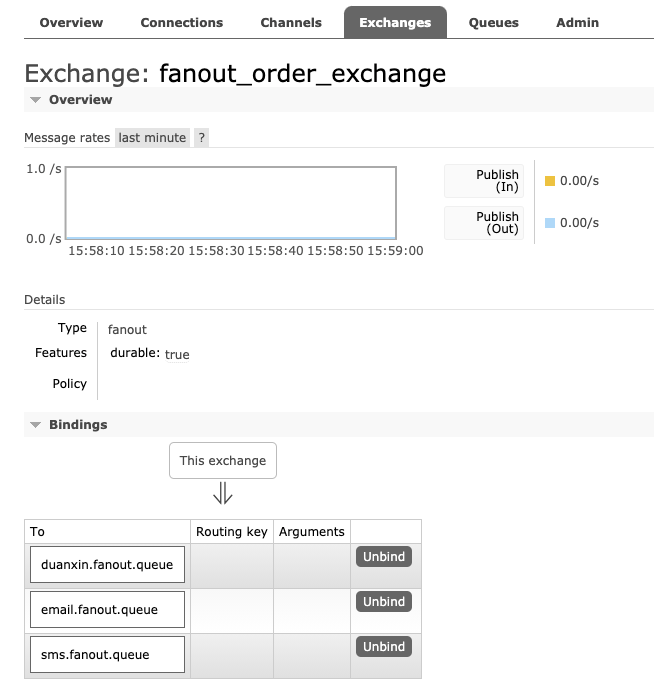

### 4.4 SpringBoot-fanout-consumer

1. 新建module，引入web和RabbitMQ

2. 配置yml，端口改为8081

3. 新建Service.fanout包下`EmailConsumer.java`

	```java
	package com.komorebi.springbootrabbitmqorderconsumer.service.fanout;
	
	import org.springframework.amqp.rabbit.annotation.RabbitHandler;
	import org.springframework.amqp.rabbit.annotation.RabbitListener;
	
	@Component
	@RabbitListener(queues = {"email.fanout.queue"})
	public class EmailConsumer {
	    @RabbitHandler
	    public void receiveMessage(String message) {
	        System.out.println("Email fanout 接收到消息：" + message);
	    }
	}
	```

4. 运行后，在Provider模块中test运行发送消息
	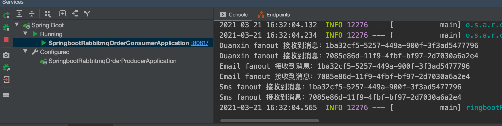


### 4.5 SpringBoot-direct

1. 方式类似于fanout，生产者新建`DirectRabbitMqConfiguration.java`。

	1. 修改所有的fanout为direct
	2. 绑定关系时用`.with`方法添加每条消息队列的路由key

	```java
	package com.komorebi.springbootrabbitmqorderproducer.config;
	
	import org.springframework.amqp.core.*;
	import org.springframework.context.annotation.Bean;
	import org.springframework.context.annotation.Configuration;
	
	/**
	 * @description:
	 * @author: Komorebi
	 * @time: 2021/3/21 15:40
	 */
	@Configuration
	public class DirectRabbitMqConfiguration {
	    // 1 声明注册direct模式的交换机
	    @Bean
	    public DirectExchange directExchange() {
	        return new DirectExchange("direct_order_exchange", true, false);
	    }
	
	    // 2 声明队列
	    @Bean
	    public Queue directSmsQueue() {
	        return new Queue("sms.direct.queue", true);
	    }
	    @Bean
	    public Queue directDuanxinQueue() {
	        return new Queue("duanxin.direct.queue", true);
	    }
	    @Bean
	    public Queue directEmailQueue() {
	        return new Queue("email.direct.queue", true);
	    }
	
	    // 3 完成绑定关系（队列和交换机完成绑定关系）
	    @Bean
	    public Binding directSmsBinding() {
	        return BindingBuilder.bind(directSmsQueue()).to(directExchange()).with("sms");
	    }
	    @Bean
	    public Binding directDuanxinBinding() {
	        return BindingBuilder.bind(directDuanxinQueue()).to(directExchange()).with("email");
	    }
	    @Bean
	    public Binding directEmailBinding() {
	        return BindingBuilder.bind(directEmailQueue()).to(directExchange()).with("duanxin");
	    }
	}
	```

2. `OrderService.java`中新建一个`makeOrderDirect`方法

	```java
	public void makeOrderDirect(String userId, String productId, int num) {
	    // 1 根据商品ID查询库存
	    // 2 保存订单
	    String orderId = UUID.randomUUID().toString();
	    System.out.println("订单生成成功" + orderId);
	
	    // 3 通过MQ完成消息的分发
	    // 参数1：交换机  参数2：路由key/queue队列名称  参数3：消息内容
	    String exchangeName = "direct_order_exchange";
	    rabbitTemplate.convertAndSend(exchangeName, "email", orderId);
	    rabbitTemplate.convertAndSend(exchangeName, "duanxin", orderId);
	}
	```

3. 客户端新建direct的包，将三个Consumer复制过去，修改对相应队列名

	```java
	@Component
	@RabbitListener(queues = {"duanxin.direct.queue"})
	public class DirectDuanxinConsumer {
	    @RabbitHandler
	    public void receiveMessage(String message) {
	        System.out.println("Duanxin direct 接收到消息：" + message);
	    }
	}
	```

4. 运行消费者(若报错没有队列，可以将config配置类先复制一份到消费者module中)

5. 生成者在test类中新建测试方法

	```java
	@Test
	void testOrderDirect() {
	    orderService.makeOrderDirect("1", "2", 3);
	}
	```

6. 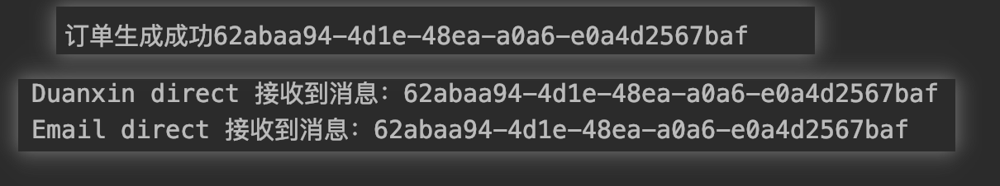


### 4.6 SpringBoot-topic

1. 生产者在orderService中新建`makeOrderTopic`方法

	```java
	public void makeOrderTopic(String userId, String productId, int num) {
	    // 1 根据商品ID查询库存
	    // 2 保存订单
	    String orderId = UUID.randomUUID().toString();
	    System.out.println("订单生成成功" + orderId);
	
	    // 3 通过MQ完成消息的分发
	    // 参数1：交换机  参数2：路由key/queue队列名称  参数3：消息内容
	    String exchangeName = "topic_order_exchange";
	    String routingKey = "";
	    rabbitTemplate.convertAndSend(exchangeName, routingKey, orderId);
	}
	```

2. 消费者新建topic包，并且复制三个Consumer
	将配置类用**注解形式**完成，修改`@RabbitListener`

	```java
	@Component
	@RabbitListener(bindings = @QueueBinding(
	        value = @Queue(value = "duanxin.topic.queue", durable = "true", autoDelete = "false"),
	        exchange = @Exchange(value = "topic_order_exchange", type = ExchangeTypes.TOPIC),
	        key = "#.duanxin.#"
	))
	public class TopicDuanxinConsumer {
	    @RabbitHandler
	    public void receiveMessage(String message) {
	        System.out.println("Duanxin topic 接收到消息：" + message);
	    }
	}
	```

3. 生产者在test类中新建测试方法进行测试

	```java
	@Test
	void testOrderTopic() {
	    orderService.makeOrderTopic("1", "2", 3);
	}
	```

4. 


## 五、高级特性

### 5.1 过期时间

> 过期时间可以表示对消息设置预期的时间，在这个时间内都可以被消费者接收获取；过了之后消息将自动删除。

* RabbitMQ可以对**消息和队列**设置TTL
	* 第一种方法：通过队列属性设置，队列中所有消息都有相同的过期时间
	* 第二种方法：对消息进行单独设置，每条消息的TTL可以不同
	* 两种都用，以少的为准

**步骤**

1. 生产者新建`TTLRabbitMqConfiguration.java`

	```java
	package com.komorebi.springbootrabbitmqorderproducer.config;
	
	import org.springframework.amqp.core.Binding;
	import org.springframework.amqp.core.BindingBuilder;
	import org.springframework.amqp.core.DirectExchange;
	import org.springframework.amqp.core.Queue;
	import org.springframework.context.annotation.Bean;
	import org.springframework.context.annotation.Configuration;
	
	import java.util.HashMap;
	import java.util.Map;
	
	/**
	 * @description:
	 * @author: Komorebi
	 * @time: 2021/3/21 15:40
	 */
	@Configuration
	public class TTLRabbitMqConfiguration {
	    // 1 声明注册direct模式的交换机
	    @Bean
	    public DirectExchange ttlDirectExchange() {
	        return new DirectExchange("ttl_direct_exchange", true, false);
	    }
	
	    // 2 声明队列
	    @Bean
	    public Queue ttlDirectQueue() {
	        // 设置过期时间
	        Map<String, Object> args = new HashMap<>();
	        args.put("x-message-ttl", 5000);
	        return new Queue("ttl.direct.queue", true, false, false, args);
	    }
	
	    // 3 完成绑定关系（队列和交换机完成绑定关系）
	    @Bean
	    public Binding ttlDirectBinding() {
	        return BindingBuilder.bind(ttlDirectQueue()).to(ttlDirectExchange()).with("ttl");
	    }
	}
	```

2. OrderService新建`makeOrderTTL`方法

	```java
	public void makeOrderTTL(String userId, String productId, int num) {
	    // 1 根据商品ID查询库存
	    // 2 保存订单
	    String orderId = UUID.randomUUID().toString();
	    System.out.println("订单生成成功" + orderId);
	
	    // 3 通过MQ完成消息的分发
	    // 参数1：交换机  参数2：路由key/queue队列名称  参数3：消息内容
	    String exchangeName = "ttl_direct_exchange";
	    String routingKey = "ttl";
	    // "#.duanxin.#"    duanxin
	    // "*.email.#"      email
	    // "com.#"          sms
	    rabbitTemplate.convertAndSend(exchangeName, routingKey, orderId);
	}
	```

3. 生产者在test类中新建测试方法进行测试

4. 刷新web端，发现过5秒后消失
	

**每条消息单独设置TTL**

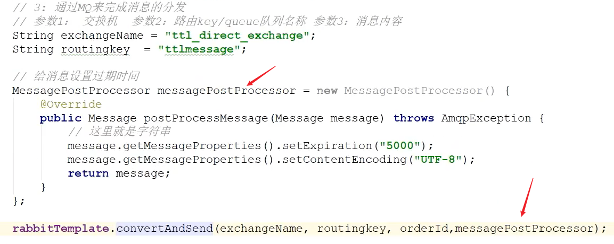

**结论**

* 一般都是给消息队列加TTL，这样可以结合后面的死信队列一起使用；给消息单独加则会导致消息直接删除


### 5.2 死信队列

> 也称为死信交换机。当消息在一个队列中变成死信邮箱。当消息在一个队列中变成死信之后，它能被重新发送到另一个交换机中，这个交换机就是DLX，绑定DLX的队列就称之为死信队列。

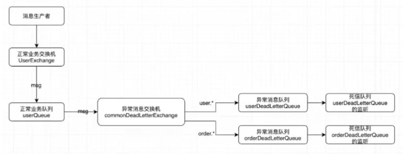

**消息变成死信的原因**

* 消息被拒绝
* 消息过期
* 队列达到最大长度

​        DLX也是一个正常的交换机，和一般的交换机没有区别，能在任何队列上指定，实际上就是设置某一个队列的属性。当这个队列中存在死信时，RabbitMQ会自动的将这个消息重新发布到设置的DLX上去，进而被路由到另一个队列，即死信队列。

​		若要使用，在定义队列的时候设置队列参数`x-dead-letter-exchange`指定交换机。

**步骤**

1. 新建`DeadRabbitMqConfiguration.java`

	```java
	package com.komorebi.springbootrabbitmqorderproducer.config;
	
	import org.springframework.amqp.core.Binding;
	import org.springframework.amqp.core.BindingBuilder;
	import org.springframework.amqp.core.DirectExchange;
	import org.springframework.amqp.core.Queue;
	import org.springframework.context.annotation.Bean;
	import org.springframework.context.annotation.Configuration;
	
	import java.util.HashMap;
	import java.util.Map;
	
	/**
	 * @description: 死信队列
	 * @author: Komorebi
	 * @time: 2021/3/21 15:40
	 */
	@Configuration
	public class DeadRabbitMqConfiguration {
	    // 1 声明注册direct模式的交换机
	    @Bean
	    public DirectExchange deadDirectExchange() {
	        return new DirectExchange("dead_direct_exchange", true, false);
	    }
	
	    // 2 声明队列
	    @Bean
	    public Queue deadDirectQueue() {
	        return new Queue("dead.direct.queue", true);
	    }
	
	    // 3 完成绑定关系（队列和交换机完成绑定关系）
	    @Bean
	    public Binding deadDirectBinding() {
	        return BindingBuilder.bind(deadDirectQueue()).to(deadDirectExchange()).with("dead");
	    }
	}
	```

2. 在`TTLRabbitMqConfiguration.java`中的配置map内添加两个键值对设置死信队列

	```java
	// 设置死信队列 
	args.put("x-dead-letter-exchange", "dead_direct_exchange");
	args.put("x-dead-letter-routing-key", "dead"); // 死信队列是direct模式，需要routing-key
	```

3. 在web界面把之前的队列删除，改完配置是需要重新创建队列和交换机的

4. 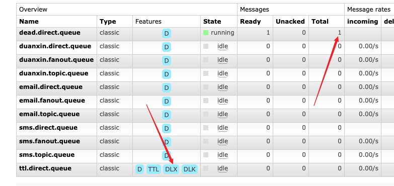


### 5.3 内存控制

1. 命令方式
	
2. 配置文件方式
	

**内存换页**

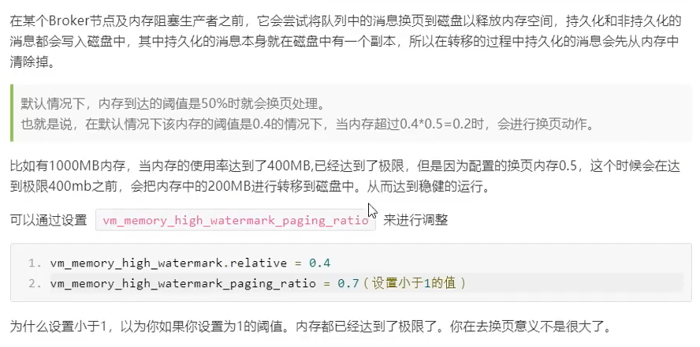

**磁盘预警**

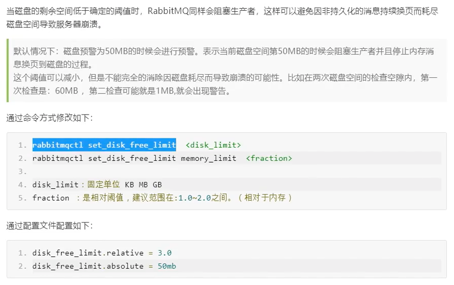****


##  六、分布式事务

> 分布式事务：事务的操作位于不同的节点上，需要保证事务的ACID特性。
>
> 例如在下单场景中，库存和订单如果不在同一个节点上，就设计分布式事务。

### 6.1 实现方式

1. **两阶段提交（2PC）**

> 两阶段提交，通过引入协调者来协调参与者的行为，并最终决定这些参与者是否要真正执行事务。
>
> 准备阶段：协调者询问参与者事务是否执行成功，参与者发回事务执行结果。
>
> 提交阶段：如果事务在每个参与者上都执行成功，事务协调者发送通知让参与者提交事务；否则，协调者发送通知让参与者回滚事务。
>
> PS：在准备阶段，参与者执行了事务，但是还未提交。只有在提交阶段受到协调者发来的通知后，才进行提交或者回滚。

* 存在的问题：
	* **同步阻塞**：所有事务参与者在等待其他参与者响应的时候都处于同步阻塞状态，无法进行其他操作
	* **单点问题：**协调者在2PC中起到非常大的作用，发生故障将会造成很大影响。特别是在阶段二发生故障，所有参与者会一直等待状态，无法完成其他操作
	* **数据不一致：**在阶段二，如果协调者只发送了部分Commit消息，此时网络发生异常，那么只有部分参与者接收到Commit消息，也就是说只有部分参与者提交了事务，使得系统数据不一致。
	* **太过保守：**任意一个节点失败会导致整个事务失败，没有完善的容错机制

2. **补偿事务（TCC）**

> 针对每个操作，都要注册一个与其对应的确认和补偿（撤销）操作。分为三个阶段：
>
> * Try阶段主要是对业务系统做检测及资源预留
> * Confirm阶段主要是对业务系统做确认提交，Try阶段执行成功并开始执行Confirm阶段时，默认Confirm阶段是不会出错的。即：只要Try成功，Confirm一定成功。
> * Cancel阶段主要是在业务执行错误，需要回滚的状态下执行的业务取消，预留资源释放。

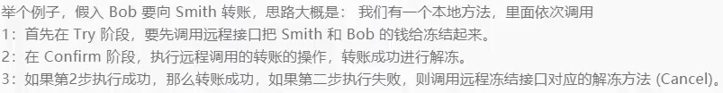

* **优点**：流程比2PC简单一些，但数据的一致性比2PC差一些
* **缺点**：在2，3步中可能失败。TTC属于应用层的一种补偿方式，所以需要程序员在实现的时候写很多补偿的代码。

3. **本地消息表（异步确认）**

> 本地消息表：本地消息表与业务数据表处于同一个数据库中，这样能利用本地事务来保证对这两个表的操作满足事务特性，并且使用了消息队列来保证最终一致性。

* 在分布式事务操作的一方完成写业务数据的操作之后向本地消息表发送一个消息，本地事务能保证这个消息一定会被写入本地消息表中。
* 之后将本地消息表中的消息转发到MQ消息队列中，如果转发成功则将消息从本地消息表中删除，否则继续重新转发。
* 在分布式事务操作的另一方从消息队列中读取一个消息，并执行消息中的操作。