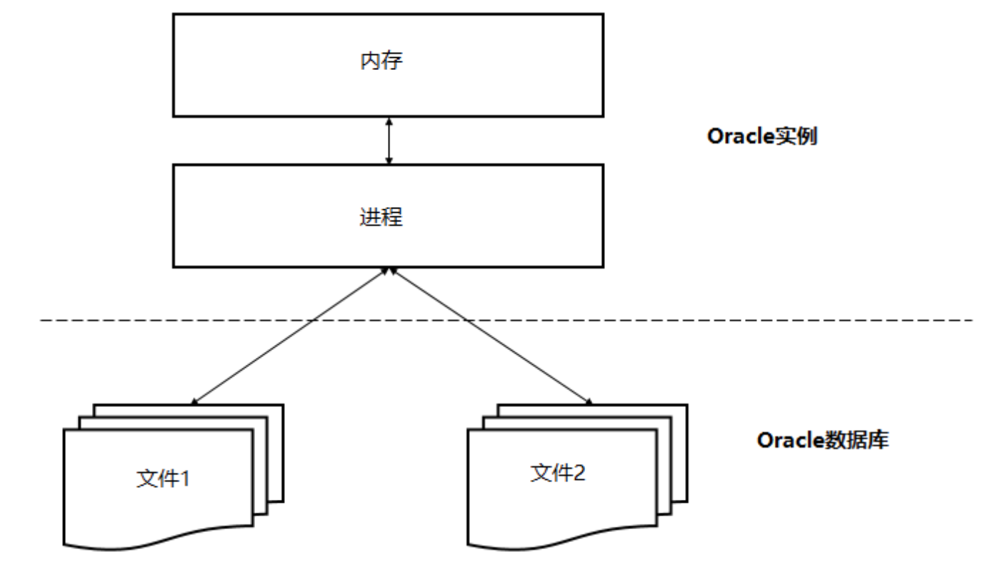

# Oracle

> ORACLE数据库系统是美国ORACLE公司（甲骨文）提供的以分布式数据库为核心的一组软件产品，是目前最流行的客户/服务器(CLIENT/SERVER)或B/S体系结构的数据库之一。

* 关系型数据库

## 一、基础

> Oracle Database，又名 Oracle RDBMS，简称 Oracle。Oracle 数据库系统是美国 Oracle 公司（甲骨文）提供的以分布式数据库为核心的一组软件产品，是目前最流行的客户/服务器（client/server）或B/S体系结构的数据库之一，比如 SilverStream 就是基于数据库的一种中间件。Oracle 数据库是目前世界上使用最为广泛的数据库管理系统，作为一个通用的数据库系统，它具有完整的数据管理功能；作为一个关系型数据库，它是一个完备关系的产品；作为分布式数据库它实现了分布式处理功能，但它的所有知识，只要在一种机型上学习了 Oracle 知识，便能在各种类型的机器上使用它。

**数据文件（dbf）**

​		数据文件是数据库的物理存储单位。数据库的数据是存储在表空间中的，真正是在某一个或者多个数据文件中，而**一个表空间可以由一个或多个数据文件组成，一个数据文件只能属于一个表空间**。一旦数据文件被加入到某个表空间后，就不能删除这个文件，如果要删除某个数据文件，只能删除其所属于的表空间才行。

**表空间**

​		表空间是 Oracle 对物理数据库上相关数据文件（ORA 或者 DBF 文件）的逻辑映射。一个数据库在逻辑上被划分成一到若干个表空间，每个表空包含了在逻辑上相关联的一组结构。每个数据库至少有一个表空间（称之为 system 表空间）。每个表空间由同一磁盘上的一个或多个文件组成，这些文件叫数据库文件（datafile）。一个数据文件只能属于一个表空间。

**用户**

​		用户是在实例下建立的。不同实例中可以建相同名字的用户。注：表的数据，是由用户放入某一个表空间的，而这个表空间会随机把这些表数据放到一个或者多个数据文件中。由于 Oracle 的数据库不是普通的概念，oracle 是由用户和表空间对数据进行管理和存放的。但是表不是由表空间去查询的，而是由用户去查的。因为不同用户可以在同一个表空间建立同一个名字的表！这里区分就是用户了！

**数据库和实例** 

* Oracle 数据库服务器由一个数据库和至少一个数据库实例组成。 数据库是一组存储数据的文件，而数据库实例则是管理数据库文件的内存结构。此外，数据库是由后台进程组成。
* 数据库和实例是紧密相连的，所以我们一般说的 Oracle 数据库，通常指的就是实例和数据库。




## 二、常用指令

### 2.1 Select

**查询单个列的数据**

```sql
SELECT
  name
FROM
  customers;
```

**查询多个列的数据**

```sql
SELECT
    customer_id,
    name,
    credit_limit
FROM
    customers;
```

### 2.2 Order by

**按列排序行**

```sql
SELECT name,address,credit_limit
FROM customers
ORDER BY name ASC;
```

**按多个列排序行示例**

```SQL
SELECT first_name, last_name
FROM contacts
ORDER BY first_name, last_name DESC;
```

**按列位置排序行示例**

```SQL
SELECT name, credit_limit,address
FROM customers
ORDER BY 2 DESC, 1;
-- 等价于
SELECT name, credit_limit,address
FROM customers
ORDER BY credit_limit DESC, name;
```

**用NULL值排序行的示例**

```SQL
SELECT country_id, city, state
FROM
    locations
ORDER BY
    state ASC NULLS LAST;
```

**按函数或表达式排序数据**

```SQL
SELECT customer_id, name
FROM customers
ORDER BY UPPER( name );
```

### 2.3 Dintinct

**常规**

```SQL
SELECT
    DISTINCT product_id,
    quantity
FROM
    ORDER_ITEMS
ORDER BY product_id;
```

**Oracle DISTINCT和NULL**

* Oracle将NULL值视为重复值。如果使用SELECT DISTINCT语句从具有多个NULL值的列中查询数据，则结果集只包含一个NULL值。

```SQL
SELECT DISTINCT state
FROM locations
ORDER BY state NULLS FIRST;
```

### 2.4 Where


### 2.5 Fetch

> FETCH 子句在 Oracle 中可以用来限制查询返回的行数

**OFFSET 子句**

OFFSET 子句指定在行限制开始之前要跳过行数。OFFSET 子句是可选的。 如果跳过它，则偏移量为 0，行限制从第一行开始计算。

偏移量必须是一个数字或一个表达式，其值为一个数字。偏移量遵守以下规则：

- 如果偏移量是负值，则将其视为 0。
- 如果偏移量为 NULL 或大于查询返回的行数，则不返回任何行。
- 如果偏移量包含一个分数，则分数部分被截断。

**FETCH 子句**

* FETCH 子句指定要返回的行数或百分比。

**WITH TIES 选项**

仅返回 FETCH NEXT (或 FIRST) 后的行数或行数的百分比。

WITH TIES 返回与最后一行相同的排序键。请注意，如果使用 WITH TIES，则必须在查询中指定一个 ORDER BY 子句。如果不这样做，查询将不会返回额外的行。

**获取前N行**

```SQL
SELECT
    product_name,
    quantity
FROM
    inventories
INNER JOIN products
        USING(product_id)
ORDER BY
    quantity DESC 
FETCH NEXT 5 ROWS ONLY;
```

**With ties**

```SQL
SELECT
    product_name,
    quantity
FROM
    inventories
INNER JOIN products
    USING(product_id)
ORDER BY
    quantity DESC 
FETCH NEXT 10 ROWS WITH TIES;
```

* 即使查询请求了 10 行数据，因为它具有 WITH TIES 选项，查询还返回了另外两行。 因为这两个附加行在 quantity 列的值与第 10 行 quantity 列的值相同。

**百分比获取**

```SQL
SELECT
    product_name,
    quantity
FROM
    inventories
INNER JOIN products
        USING(product_id)
ORDER BY
    quantity DESC 
FETCH FIRST 1 PERCENT ROWS ONLY;
```

**Offset示例**

```SQL
-- 跳过库存量最高的前 10 个产品，并返回接下来的 10 个产品
SELECT
 product_name,
 quantity
FROM
 inventories
INNER JOIN products
 USING(product_id)
ORDER BY
 quantity DESC 
OFFSET 10 ROWS 
FETCH NEXT 10 ROWS ONLY;
```

### 2.6 Like

```SQL
expresion [NOT] LIKE pattern [ ESCAPE escape_characters ]
```

- expression：该表达式是一个列名称或一个表达式，要针对该模式 (pattern) 进行测试。
- pattern：该模式是在表达式中搜索的字符串。此模式包含以下通配符：
	- ％(百分号)匹配零个或多个字符的任何字符串。
	- _(下划线)匹配任何单个字符。
- escape_character：escape_character 是出现在通配符前面的字符，用于指定通配符不应被解释为通配符而是常规字符。

escape_character (如果指定)必须是一个字符，并且没有默认值。

如果表达式匹配模式，LIKE 运算符返回 true。 否则，它返回 false。

NOT 运算符(如果指定)可以否定 LIKE 运算符的结果。

**%通配符**

```SQL
SELECT
    first_name,
    last_name,
    phone
FROM
    contacts
WHERE
    last_name LIKE 'St%'
ORDER BY
    last_name;
```

**_通配符**

```sql
SELECT
    first_name,
    last_name,
    email,
    phone
FROM
    contacts
WHERE
    first_name LIKE 'Je_i'
ORDER BY 
    first_name;
```


## 三、事务

