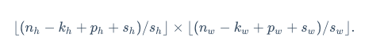
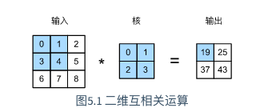
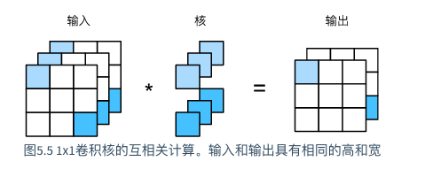
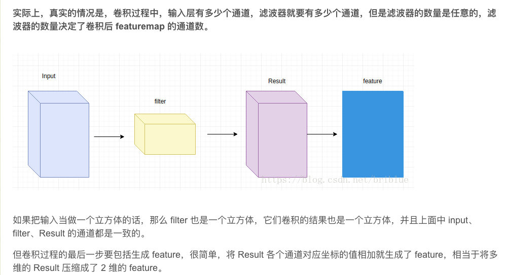

# 卷积神经网络

## 两种思维



* 对于稀疏矩阵来说，卷积网络具有**稀疏性**，即卷积核的大小远远小于输入数据矩阵的大小。
* **参数共享**指的是在特征提取过程中，一个模型在多个参数之中使用相同的参数，在传统的神经网络中，每个权重只对其连接的输入输出起作用，当其连接的输入输出元素结束后就不会再用到。参数共享指的是在卷积神经网络中，核的每一个元素都被用在输入的每一个位置上，在计算过程中只需学习一个参数集合就能把这个参数应用到所有的图片元素中
* 输入中阴影部分的四个元素是输出中阴影部分元素的感受野。我们将图5.1中形状为2×2的输出记为Y*，并考虑一个更深的卷积神经网络：将Y*与另一个形状为2×2的核数组做互相关运算，输出单个元素zz。那么，z在Y上的感受野包括Y的全部四个元素，在输入上的感受野包括其中全部9个元素。可见，我们可以通过更深的卷积神经网络使特征图中单个元素的感受野变得更加广阔，从而捕捉输入上更大尺寸的特征。



* 使用输入通道数为3、输出通道数为2的1×1卷积核的互相关计算。值得注意的是，输入和输出具有相同的高和宽。输出中的每个元素来自输入中在高和宽上相同位置的元素在**不同通道之间的按权重累加**。假设我们将通道维当作特征维，将高和宽维度上的元素当成数据样本，**那么1×1卷积层的作用与全连接层等价**。



* 


## 卷积函数

```python
tf.nn.conv2d(input, filter, strides, padding, use_cudnn_on_gpu=None, name=None)
```

- **input**：指需要做卷积的输入图像，要求是一个**Tensor**，具有**[batch, in_height, in_width, in_channels]**这样的shape，分别代表一个batch的图片数量，图片高、宽，图像通道数，要求类型为float32或者float64
- **filter**：相当于CNN中的卷积核，要求是一个Tensor，具有**[filter_height, filter_width, in_channels, out_channels]**这样的shape
- **strides**:卷积时在图像每一维的步长，是一个一维的向量，第一维和第四维默认为1，而第三维和第四维分别是平行和竖直滑行的步长距离
- **padding**:String类型的量，只能是**SAME**、**VALID**其中之一，这个值决定了不同的卷积方式
- **use_cudnn_on_gpu**:bool类型，是否使用cudnn加速，默认为true


## 池化运算

```python
tf.nn.max_pool(value, ksize, strides, padding, name=None)
```

- **value**：需要池化的输入，一般池化层接在卷积层后面，所以输入通常是**featuremap**，依然是**[batch, height, width, channels]**这样的shape
- **ksize**：池化窗口的大小，取一个四维向量，一般是**[1, height, width, 1]**，因为不需要在batch和channel上做池化，所以这两个维度设为1
- **strides**：与卷积类似，窗口在每一个维度上滑动的步长，一般也是**[1, stride, stride, 1]**
- **padding**：与卷积类似，可以去**VALID**或者**SAME**，返回一个Tensor


​		池化最重要的作用就是帮助输入的数据表示近似不变性，对于平移不变性指的是对输入的数据进行少量平移时，经过池化后的输出结果并不会发生改变。局部平移不变性是一个很有用的性质，尤其是当关心某个特征是否出现而不关心它出现的具体位置时。


## Padding（填充）

* 卷积的两个问题：
	* 图像在卷积后会变小
	* 会丢失图像边缘信息，因为边缘像素点的采用次数较少
* **Valid**卷积：不填充
* **Same**卷积：填充，使得输出的图像和输入图像的大小完全一致

```
n * n  f * f
n + 2p - f + 1 = n
p = (f - 1) / 2		                 # 填充的大小，一般为奇数
```

