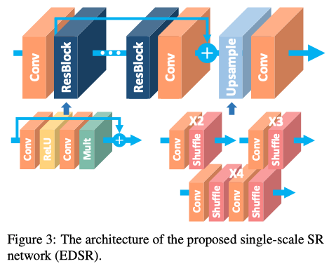
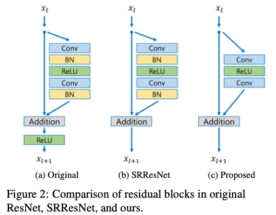
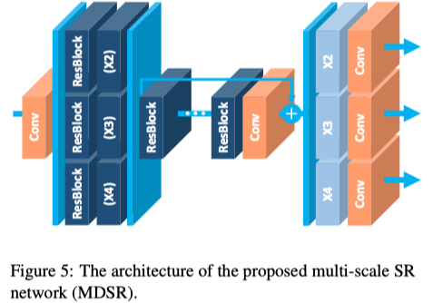

# EDSR

```tex
@inproceedings{lim2017enhanced,
  title={Enhanced deep residual networks for single image super-resolution},
  author={Lim, Bee and Son, Sanghyun and Kim, Heewon and Nah, Seungjun and Mu Lee, Kyoung},
  booktitle={Proceedings of the IEEE conference on computer vision and pattern recognition workshops},
  pages={136--144},
  year={2017}
}
```



## 1 改进残差块



* 由于BN对特征进行了归一化，因此通过对特征进行归一化会摆脱网络的**范围灵活性**，因此最好将其删除。
* 由于BN消耗的内存量与前面的卷积层相同，因此GPU的**内存使用量**也得到了充分降低。与SRResNet相比，在训练期间节省了大约40％的内存使用量。


## 2 单尺度模型

* 在我们的最终单尺度模型（EDSR）中，我们通过设置B = 32，F = 256和比例因子0.1来扩展基线模型。
* 当训练我们的模型的上采样因子×3和×4时，我们使用预训练的×2网络初始化模型参数。


## 3 多尺度模型

* 我们将基线（多尺度）模型设计为具有一个B = 16个残差块的单一主分支，以便大多数参数在不同尺度上共享，如图5所示。
* 我们用B = 80和F = 64构造最终的多尺度模型（MDSR）。



* 首先，预处理模块位于网络的开头，以减少来自不同比例输入图像的差异。
* 每个预处理模块都包含两个具有5×5内核的残差块。通过为预处理模块采用更大的内核，我们可以使规模特定的部分保持较浅，而在网络的早期阶段则覆盖了较大的接收域。
* 在多尺度模型的末尾，尺度特定的上采样模块平行放置以处理多尺度重建。


## 4 训练细节

* 为了进行训练，我们将LR图像中大小为48×48的RGB输入色块与相应的HR色块一起使用。我们使用随机水平翻转和90旋转来扩充训练数据。
* ADAM optimizer by setting β 1= 0.9, β 2= 0.999, and  = 10 −8.
* 我们将minibatch大小设置为16。学习率初始化为10 -4，每2×10 5 minibatch更新将学习速度减半。

