[TOC]


# Java基础知识点
        


**三大特性**

* **封装**把一个对象的属性私有化，同时提供一些可以被外界访问的属性的方法，如果属性不想被外界访问，我们大可不必提供方法给外界访问。但是如果一个类没有提供给外界访问的方法，那么这个类也没有什么意义了。
* **继承**是使用已存在的类的定义作为基础建立新类的技术，新类的定义可以增加新的数据或新的功能，也可以用父类的功能，但不能选择性地继承父类。通过使用继承我们能够非常方便地复用以前的代码。
	* 子类拥有父类对象所有的属性和方法（包括私有属性和私有方法），但是父类中的私有属性和方法子类是无法访问，只是拥有。

	* 子类可以拥有自己属性和方法，即子类可以对父类进行扩展。

	* 子类可以用自己的方式实现父类的方法。）。
* 所谓**多态**就是指程序中定义的引用变量所指向的具体类型和通过该引用变量发出的方法调用在编程时并不确定，而是在程序运行期间才确定，即一个引用变量到底会指向哪个类的实例对象，该引用变量发出的方法调用到底是哪个类中实现的方法，必须在由程序运行期间才能决定。
		* 在Java中有两种形式可以实现多态：**继承（多个子类对同一方法的重写）和接口（实现接口并覆盖接口中同一方法）**。


## 1 基础

### 1.1 static关键字

> 方便在没有创建对象的情况下来进行调用（方法/变量）。

* 被static关键字修饰的方法或者变量不需要依赖于对象来进行访问，只要类被加载了，就可以通过类名去进行访问。
* static可以用来修饰类的成员方法、类的成员变量，另外可以编写static代码块来优化程序性能。


### 1.2 final关键字

final 关键字主要⽤在三个地⽅：**变量、⽅法、类**。

1. 对于⼀个 final 变量，如果是基本数据类型的变量，则其数值⼀旦在初始化之后便不能更改；如果是引⽤类型的变量，则在对其初始化之后便不能再让其指向另⼀个对象。

2. 当⽤ final 修饰⼀个类时，表明这个类**不能被继承**。final 类中的所有成员⽅法都会被隐式地 指定为 final ⽅法。

3. 使⽤ final ⽅法的原因有两个。第⼀个原因是把⽅法锁定，以防任何继承类修改它的含义； 第⼆个原因是效率。在早期的 Java 实现版本中，会将 final ⽅法转为内嵌调⽤。但是如果⽅ 法过于庞⼤，可能看不到内嵌调⽤带来的任何性能提升（现在的 Java 版本已经不需要使⽤ final ⽅法进⾏这些优化了）。类中所有的 private ⽅法都隐式地指定为 final。


### 1.3 抽象类和接口

* **核心**：一个类只能继承一个抽象类，但可以实现多个接口

* 类含有抽象方法，为抽象类，用abstract修饰
	* 不能用来创建对象
	* 继承抽象类的类必须为抽象方法提供定义，否则也为抽象类
	* 可以拥有成员变量和普通成员方法，抽象方法必须为public或protected
	
* 接口是对行为的抽象，是用interface修饰
	* 可以含有变量和方法，但会被隐式指定为public static final变量和public abstract方法，且变量必须给初值
	* 接口中的方法必须为抽象方法，一般情况下不在接口中定义变量


### 1.4 重载和重写

* **重写**是子类对父类的允许访问的方法的实现过程进行重新编写, **返回值和形参都不能改变**。**即外壳不变，核心重写！**
	
	* 重写的好处在于子类可以根据需要，定义特定于自己的行为。 也就是说子类能够根据需要实现父类的方法。
	* 重写方法不能抛出新的检查异常或者比被重写方法申明更加宽泛的异常。例如： 父类的一个方法申明了一个检查异常 IOException，但是在重写这个方法的时候不能抛出 Exception 异常，因为 Exception 是 IOException 的父类，只能抛出 IOException 的子类异常。
* **重载**(overloading) 是在一个类里面，方法名字相同，而参数不同。**返回类型可以相同也可以不同。**
	
	* 每个重载的方法（或者构造函数）都必须有一个独一无二的参数类型列表。
	* 最常用的地方就是构造器的重载。
	
	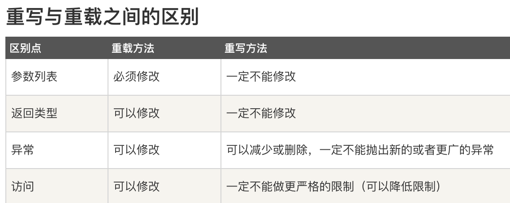


### 1.5 Java序列化

> 1、序列化：将对象写入到IO流中
> 2、反序列化：从IO流中恢复对象
> 3、意义：序列化机制允许将实现序列化的Java对象转换位字节序列，这些字节序列可以保存在磁盘上，或通过网络传输，以达到以后恢复成原来的对象。序列化机制使得对象可以脱离程序的运行而独立存在。
> 4、使用场景：所有可在网络上传输的对象都必须是可序列化的，比如RMI（remote method invoke,即远程方法调用），传入的参数或返回的对象都是可序列化的，否则会出错；所有需要保存到磁盘的java对象都必须是可序列化的。通常建议：程序创建的每个JavaBean类都实现Serializeable接口。
> 5、如果想让某个变量不被序列化，使用**transient**修饰。

**实现方式**

* 如果需要将某个对象保存到磁盘上或者通过网络传输，那么这个类应该实现**Serializable**接口或者**Externalizable**接口之一。
* **Serializable**
	* 序列化步骤一：创建一个ObjectOutputStream输出流；
	* 序列化步骤二：调用ObjectOutputStream对象的writeObject输出可序列化对象。
	* 反序列化步骤一：创建一个ObjectInputStream输入流；
	* 反序列化步骤二：调用ObjectInputStream对象的readObject()得到序列化的对象
* **Externalizable**：强制自定义序列化

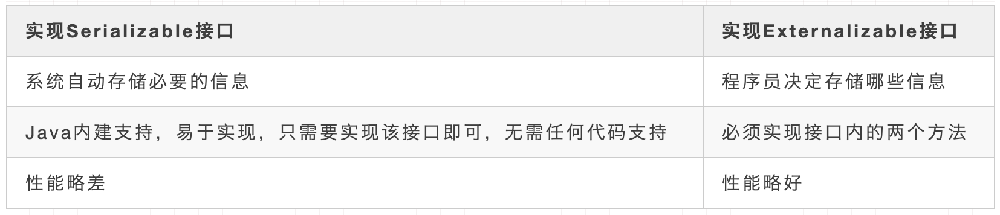

**Java序列化算法**（**Java序列化同一对象，并不会将此对象序列化多次得到多个对象。**）

- 所有保存到磁盘的对象都有一个序列化编码号
- 当程序试图序列化一个对象时，会先检查此对象是否已经序列化过，只有此对象从未（在此虚拟机）被序列化过，才会将此对象序列化为字节序列输出。
- 如果此对象已经序列化过，则直接输出编号即可。


### 1.6 双亲委派机制

**JDK主要有3个自带ClassLoader：**

- 最基础：Bootstrap ClassLoader（加载JDK的/lib目录下的类）
- 次基础：Extension ClassLoader（加载JDK的/lib/ext目录下的类）
- 普通：Application ClassLoader（程序自己classpath下的类）

​       Java虚拟机对class文件采用的时**按需加载**的方式，也就是说当需要使用这个类的时候才会将它的class文件加载到内存当中生成class对象，而且加载某个类的class文件是，Java采用的是**双亲委派机制**，即把请求交由其父类处理，他是一种任务委派机制。

 **类加载过程工作原理**

1. 如果一个类加载器收到了类加载请求，它并不会自己先去加载，而是把这个请求委托给父类加载器去执行；
2. 如果父类加载器还存在其父类加载器，则会进一步向上委托，依次递归，请求最终将到达顶层的启动类加载器。
3. 如果父类加载器可以完成类加载任务，就成功返回，倘若父类加载器无法完成加载任务，子加载器才会尝试自己去加载，这就是双亲委派模式

​       Java虚拟机对class文件采用的时**按需加载**的方式，也就是说当需要使用这个类的时候才会将它的class文件加载到内存当中生成class对象，而且加载某个类的class文件是，Java采用的是**双亲委派机制**，即把请求交由其父类处理，他是一种任务委派机制。

**new指令的流程**：

* 第一步，类加载检查，首先检查这个指令的参数是否能在常量池中定位到一个类的符号引用，并且检查这个符号引用代表的类是否已被加载、解析和初始化过。如果没有，那必须先执行相应的类加载过程
* 第二步，为新生对象分配内存。对象所需内存的大小在类加载完成后便可完全确定，为对象分配空间的任务实际上便等同于把一块确定 大小的内存块从Java堆中划分出来。（是否规整由垃圾收集器是否带有空间压缩整理的能力决定）
	* 规整：**指针碰撞**。所有被使用过的内存都被放在一 边，空闲的内存被放在另一边，中间放着一个指针作为分界点的指示器，那所分配内存就仅仅是把那 个指针向空闲空间方向挪动一段与对象大小相等的距离（Serial、ParNew）
		* 并发问题：（1）采用CAS配上失败 重试的方式保证更新操作的原子性；（2）把内存分配的动作按照线程划分在不同的空间之中进行，即每个线程在Java堆中预先分配一小块内存，称为本地线程分配缓冲（Thread Local Allocation Buffer，TLAB），哪个线程要分配内存，就在哪个线程的本地缓冲区中分配，只有本地缓冲区用完了，分配新的缓存区时才需要同步锁定。虚拟机是否使用TLAB，可以通过-XX：+/-UseTLAB参数来 设定。
	* 不规整：**空闲列表**。维护一个列表，记录上哪些内存块是可用的，在分配的时候从列表中找到一块足够大的空间划分给对象实例，并更新列表上的记录（CMS）
* 第三步，内存分配完成之后，虚拟机必须将分配到的内存空间（不包括对象头）都初始化为零值。如果 使用了TLAB的话，这一项工作也可以提前至TLAB分配时顺便进行。这步操作保证了对象的实例字段 在Java代码中可以不赋初始值就直接使用，使程序能访问到这些字段的数据类型所对应的零值。
* 第四步，虚拟机对对象进行必要的设置（对象是哪个类的实例、如何找到类的元数据信息、对象的哈希码、GC分代年龄）
* 第五步，执行构造函数，new指令之后会接着执行init方法，按照程序员的意愿对对象进行初始化，这样一个真正可用的对象才算完全被构造出来

**双亲委派机制优点**

- 避免类的重复加载

- 保护程序安全（在Java.lang下新建一个String类）

	- 假设通过网络传递一个名为 java.lang.Integer 的类，通过双亲委派机制传递到最顶层加载器，而顶层加载器(引导类加载器（BootStap ClassLoader）)在核心 API 中发现这个名字的类，发现该类已被加载，并不会重新加载这个网络传递过来的同名的 java.lang.Integer ，而直接返回已加载过的类，这样可以防止核心 API 被篡改

	-  沙箱安全机制

		自定义String类，但是在加载自定义String类的时候会率先使用引导类加载器加载，而引导类加载器在加载过程中会加载JDK自带的文件，报错信息说没有main方法，是因为加载的是rt.jar包中的String类，这样可以保证对Java核心API的源代码保护，这就是沙箱安全机制

**打破双亲委派机制方式**

* **双亲委派机制针对的是调用ClassLoader的loadClass方法，如果直接使用findClass，就发现可以绕过双亲委派机制，实现热部署类。**
* Tomcat中的`WebAppClassloader`优先加载
* SPI机制：SPI Serviceloader 通过线程上下文获取能够加载实现类的classloader，一般情况下是 application classloader，绕过了这层限制，逻辑上打破了双亲委派原则。
* OSGI


## 2 JVM

### 2.1 JVM内存结构

JVM 内存共分为**虚拟机栈，堆，方法区，程序计数器，本地方法栈**五个部分

* **堆(线程共享)**
  * <u>被所有线程**共享**的一块内存区域，在虚拟机启动的时候创建，用于**存放对象实例**</u>
  * Java堆可以处于物理上不连续的内存空间中，但在逻辑上它应该 被视为连续的，这点就像我们用磁盘空间去存储文件一样，并不要求每个文件都连续存放。但对于大 对象（典型的如数组对象），多数虚拟机实现出于实现简单、存储高效的考虑，很可能会要求连续的 内存空间。
  * Java堆既可以被实现成固定大小的，也可以是可扩展的，不过当前主流的Java虚拟机都是按照可扩展来实现的（通过参数-Xmx和-Xms设定）。当堆中没有内存可分配给实例，也无法再扩展时，则抛出`OutOfMemoryError`异常。 
* **方法区(线程共享)**：==1.8后变更为元空间==
  * <u>被所有线程共享的一块内存区域，用于存储已经被虚拟机加载的**类信息、常量、静态变量**等</u>
  * 这个区域的内存回收目标主要针对常量池的回收和堆类型的卸载，如果方法区无法满足新的内存分配需求时，将抛出` OutOfMemoryError`异常
  * 运行时常量池是方法区的一部分。Class文件中除了有类的版本、字 段、方法、接口等描述信息外，还有一项信息是常量池表，用于存放编译期生成的各种字面量与符号引用，这部分内容将在类加载后存放到方法区的运行时常量池中。
  * **被替换成元空间原因**
  	* 整个永久代有⼀个 JVM 本身设置固定⼤⼩上限，⽆法进⾏调整，⽽元空间使⽤的是**本地内存**，受本机可⽤内存的限制，虽然元空间仍旧可能溢出，但是⽐原来出现的⼏率会更⼩。
  	* 元空间⾥⾯存放的是类的元数据，这样加载多少类的元数据就不由 ⽽由系统的实际可⽤空间来控制，这样能加载的类就更多了
  	* 在 JDK8，合并 HotSpot 和 JRockit 的代码时, JRockit 从来没有⼀个叫永久代的东⻄, 合并之后就没有必要额外的设置这么⼀个永久代的地⽅了
* **虚拟机栈(线程私有)**
	* <u>每个方法在执行的时候会创建一个栈帧，存储**局部变量表、操作数、动态链接和方法返回地址**</u>
	* 每个线程启动后，虚拟机就会为其分配一块栈内存。（生命周期和线程相同）每个方法从调用到执行完毕，对应一个栈帧在虚拟机栈中的入栈和出栈
		* 每个栈由多个栈帧（Frame）组成，对应着每次方法调用时所占用的内存
		* 每个线程只能有一个活动栈帧，对应着当前正在执行的那个方法
	* 通常所说的栈，一般指虚拟机栈中的局部变量部分，局部变量所需内存在编译期间完成分配
		* 局部变量表存放了编译期可知的各种Java虚拟机基本数据类型（boolean、byte、char、short、int、 float、long、double）、对象引用（reference类型，它并不等同于对象本身，可能是一个指向对象起始 地址的引用指针，也可能是指向一个代表对象的句柄或者其他与此对象相关的位置）和returnAddress 类型（指向了一条字节码指令的地址）
		* 若线程请求的栈深度大于虚拟机所允许的深度，则`StackOverflowError`
		* 若虚拟机栈可动态扩展，扩展到无法申请足够的内存，则`OutOfMemoryError`
* **程序计数器(线程私有)**
  * 是当前线程执行字节码的行号指示器，每条线程都有一个独立的程序计数器，也称线程私有的内存。字节码解释器工作时就是通过改变这个计数器的值来选取下一条需要执行的字节码指令。
  * java虚拟机是通过线程轮流切换并分配处理器执行时间的方式来实现，在同一时刻一个处理器内核只会执行一条线程，处理器切换线程时不会记录上一个线程执行到哪个位置，所以为了线程切换后依然能恢复到原位，每条线程都需要有各自独立的线程计数器
  * JVM规范中唯一没有规定`OutOfMemoryError`情况的区域
  	* 程序计数器存储的是字节码文件的行号，而这个范围是可知晓的，在一开始分配内存时就可以分配一个绝对不会溢出的内存
  * 如果正在执行的是Native 方法，则这个计数器值为空
  	* （Native方法大多是通过C实现并未编译成需要执行的字节码指令，也就不需要去存储字节码文件的行号了）
* **本地方法栈(线程私有)**
	* 本地方法栈与虚拟机栈所发挥的作用是非常相似的，其区别只是虚拟机 栈为虚拟机执行Java方法（也就是字节码）服务，而本地方法栈则是为虚拟机使用到的本地（Native） 方法服务。
	* 和虚拟机栈类似，主要为虚拟机使用到的**Native方法**服务。也会抛出`StackOverflowError` 和`OutOfMemoryError`。


### 2.2 Java对象头

> 在HotSpot虚拟机中，对象在堆内存的存储布局划分成三个部分：对象头、实例数据和对齐填充

HotSpot虚拟机对象的对象头包括两类信息

- 第一类是用于存储**对象自身的运行时数据**，如哈希码（HashCode）、GC分代年龄、锁状态标志、线程持有的锁、偏向线程ID、偏向时间戳等，这部分数据的长度在32位和64位的虚拟机（未开启压缩指针）中分别为32个比特和64个比特，官方称它 为“Mark Word”。
	- 对象需要存储的运行时数据很多，其实已经超出了32、64位Bitmap结构所能记录的最大限度，但对象头里的信息是与对象自身定义的数据无关的额外存储成本，考虑到虚拟机的空间效 率，Mark Word被设计成一个有着动态定义的数据结构，以便在极小的空间内存储尽量多的数据，根 据对象的状态复用自己的存储空间。例如在32位的HotSpot虚拟机中，如对象未被同步锁锁定的状态 下，Mark Word的32个比特存储空间中的25个比特用于存储对象哈希码，4个比特用于存储对象分代年龄，2个比特用于存储锁标志位，1个比特固定为0。 
- 对象头的另一部分是**类型指针**，即对象指向它的类型元数据的指针，Java虚拟机通过这个指针来确定该对象是哪个类的实例。
	- 但并不是所有的虚拟机实现都必须在对象数据上保留类型指针，换句话说，查找对象的元数据信息并不一定要经过对象本身。
	- 此外，如果对象是一个Java数组，那在对象头中还必须有一块用于记录数组长度的数据，因为虚拟机可以通过普通 Java对象的元数据信息确定Java对象的大小，但是如果数组的长度是不确定的，将无法通过元数据中的 信息推断出数组的大小。

**实例数据部分**

* 实例数据部分是对象真正存储的有效信息，即我们在程序代码里面所定义的各种类型的字段内容，无论是从父类继承下来的，还是在子类中定义的字段都必须记录起来。
* 这部分的存储顺序会受到虚拟机分配策略参数（-XX：FieldsAllocationStyle参数）和字段在Java源码中定义顺序的影响。 HotSpot虚拟机默认的分配顺序为longs/doubles、ints、shorts/chars、bytes/booleans、oops（Ordinary Object Pointers，OOPs）
	* 从以上默认的分配策略中可以看到，相同宽度的字段总是被分配到一起存放，在满足这个前提条件的情况下，在父类中定义的变量会出现在子类之前。如果HotSpot虚拟机的 +XX：CompactFields参数值为true（默认就为true），那子类之中较窄的变量也允许插入父类变量的空 隙之中，以节省出一点点空间。

**对齐填充**

* 这并不是必然存在的，也没有特别的含义，它仅仅起着占位符的作用。
* 由于HotSpot虚拟机的自动内存管理系统要求对象起始地址必须是8字节的整数倍，换句话说就是 任何对象的大小都必须是8字节的整数倍。对象头部分已经被精心设计成正好是8字节的倍数（1倍或者 2倍），因此，如果对象实例数据部分没有对齐的话，就需要通过对齐填充来补全。


### 2.3 对象访问

​		Java程序会通过栈上的reference数据来操作堆上的具体对象。由于reference类型只规定了它是一个指向对象的引用，并没有定义这个引用应该通过什么方式去定位、访问到堆中对象的具体位置，所以对象访问方式也是由虚拟机实现而定的，主流的访问方式主要有使用句柄和直接指针两种：

1. 如果使用**句柄访问**的话，Java堆中将可能会划分出一块内存来作为句柄池，reference中存储的就是对象的句柄地址，而句柄中包含了对象实例数据与类型数据各自具体的地址信息。
	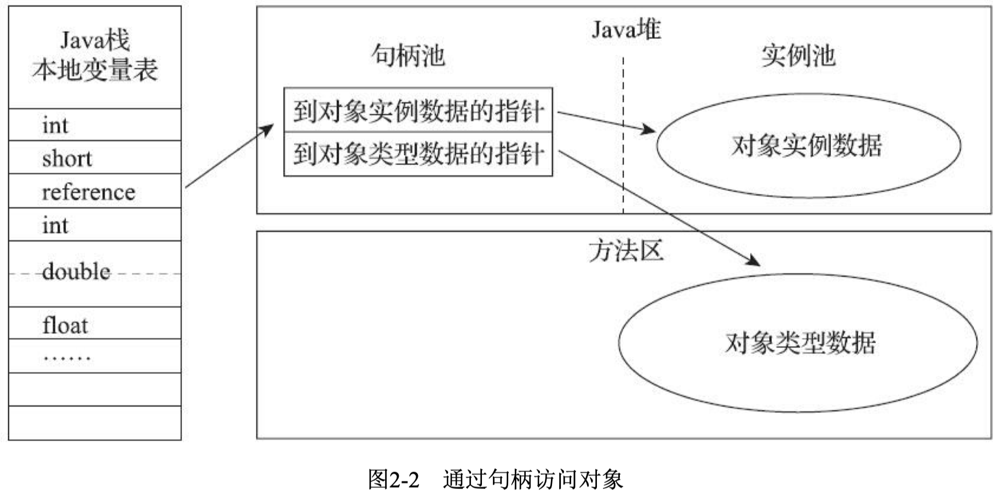
2. 如果使用**直接指针访问**的话，Java堆中对象的内存布局就必须考虑如何放置访问类型数据的相关 信息，reference中存储的直接就是对象地址，如果只是访问对象本身的话，就不需要多一次间接访问的开销。（HotSpot而言，它主要使用第二种方式进行对象访问。有例外情况，如果使用了Shenandoah收集器的 话也会有一次额外的转发）
	


### 2.4 Java内存模型

* Java 线程之间的通信由 Java 内存模型控制，JMM 决定一个线程对共享变量的写入何时对另一个线程可见。
* 从抽象的角度来看，JMM 定义了线程和主内存之间的抽象关系：线程之间的共享变量存储在主内存（main memory）中，每个线程都有一个私有的本地内存（local memory），本地内存中存储了该线程以读 / 写共享变量的副本。本地内存是 JMM 的一个抽象概念，并不真实存在。它涵盖了缓存，写缓冲区，寄存器以及其他的硬件和编译器优化。

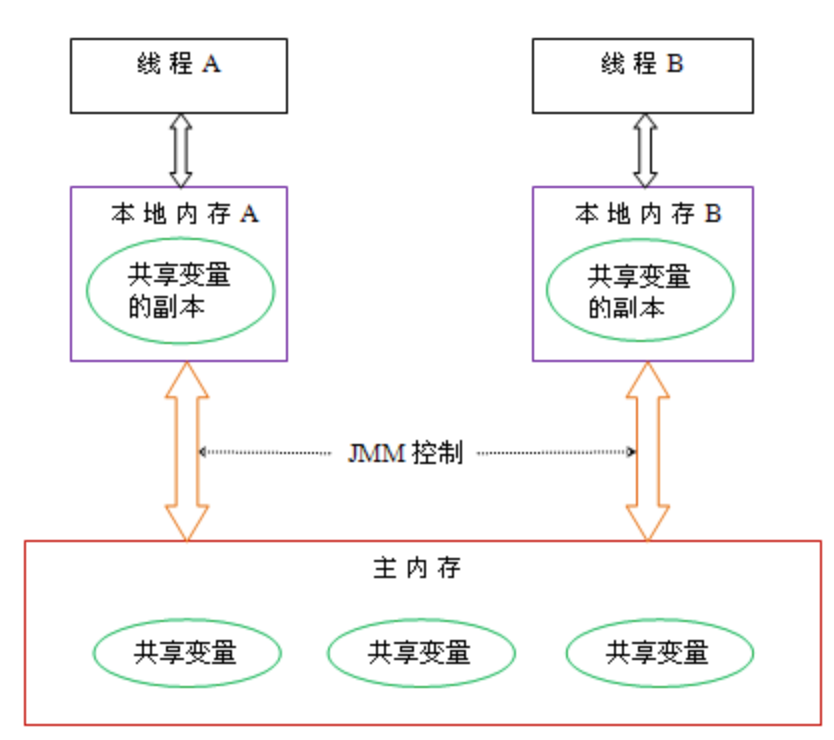

* **若A和B要进行通信，必须有两个步骤**
	* [通信方式](https://zhuanlan.zhihu.com/p/129374075)
		* volatile
		* 等待/通知机制
		* join方式
		* threadLocal
	* 首先，线程A把本地内存A中更新过的共享变量刷新到主内存中去。
	* 然后，线程B到主内存中去读取线程A之前已更新过的共享变量。
	* 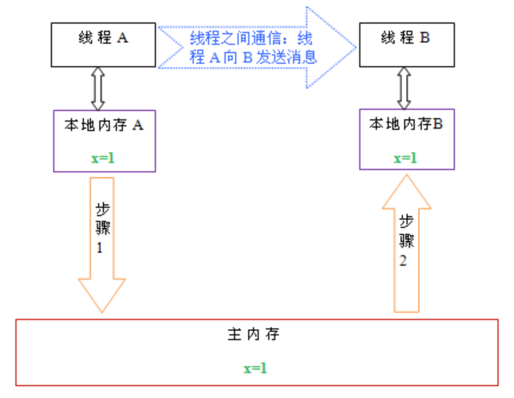

**原子性、有序性、可见性**

* 可见性：没有可见性，指的是线程1更新了主内存的值，而线程2没有立刻读取新值，而是在工作内存中保留原来的值。
* 原子性：对于一个i++的操作，只要是多个线程并发运行来执行这行代码，其实的话，他都是不保证原子性的
* 有序性：具备有序性，不会发生指令重排导致我们的代码异常；不具备有序性，可能会发生一些指令重排，导致代码可能会出现一些问题


### 2.5 内存泄漏与溢出

> **内存泄漏（memory leak）：**一个不再被程序使用的对象或变量还在内存中占有存储空间。一次内存泄漏似乎不会有大的影响，但内存泄漏堆积后的后果就是内存溢出。
> **内存溢出 out of memory** : 指程序申请内存时，没有足够的内存供申请者使用，或者说，给了你一块存储int类型数据的存储空间，但是你却存储long类型的数据，那么结果就是内存不够用，此时就会报错OOM,即所谓的内存溢出。

**二者的关系：**

1. 内存泄漏的堆积最终会导致内存溢出
2. 内存溢出就是你要的内存空间超过了系统实际分配给你的空间，此时系统相当于没法满足你的需求，就会报内存溢出的错误。
3. 内存泄漏是指你向系统申请分配内存进行使用(new)，可是使用完了以后却不归还(delete)，结果你申请到的那块内存你自己也不能再访问（也许你把它的地址给弄丢了），而系统也不能再次将它分配给需要的程序。就相当于你租了个带钥匙的柜子，你存完东西之后把柜子锁上之后，把钥匙丢了或者没有将钥匙还回去，那么结果就是这个柜子将无法供给任何人使用，也无法被垃圾回收器回收，因为找不到他的任何信息。
4. 内存溢出：一个盘子用尽各种方法只能装4个果子，你装了5个，结果掉倒地上不能吃了。这就是溢出。比方说栈，栈满时再做进栈必定产生空间溢出，叫上溢，栈空时再做退栈也产生空间溢出，称为下溢。就是分配的内存不足以放下数据项序列,称为内存溢出。说白了就是我承受不了那么多，那我就报错，


### 2.6 OOM排查

**堆溢出**

> ​		Java堆用于储存对象实例，只要不断地创建对象，并且保证GC Roots到对象之间有可达路径 来避免垃圾回收机制清除这些对象，那么随着对象数量的增加，总容量触及最大堆的容量限制后就会 产生内存溢出异常。（-XX：+HeapDumpOnOutOf-MemoryError可以让虚拟机在出现内存溢出异常的时候Dump出当前的内存堆转储快照以便进行事后分析  -Xms20m -Xmx20m）

* 首先通过内存映像分析工具对Dump出来的堆转储快照进行分析（-XX：+HeapDumpOnOutOf-MemoryError）
* 第一步首先应确认内存中导致OOM的对象是否是必要的，也就是要先分清楚到底是出现了内存泄漏（Memory Leak）还是内存溢出（Memory Overflow）
	* 如果是内存泄漏，可进一步通过工具查看泄漏对象到GC Roots的引用链，找到泄漏对象是通过怎样的引用路径、与哪些GC Roots相关联，才导致垃圾收集器无法回收它们，根据泄漏对象的类型信息 以及它到GC Roots引用链的信息，一般可以比较准确地定位到这些对象创建的位置，进而找出产生内 存泄漏的代码的具体位置。
	* 如果不是内存泄漏，换句话说就是内存中的对象确实都是必须存活的，那就应当检查Java虚拟机 的堆参数（-Xmx(最小值)与-Xms(最大值)）设置，与机器的内存对比，看看是否还有向上调整的空间。再从代码上检查 是否存在某些对象生命周期过长、持有状态时间过长、存储结构设计不合理等情况，尽量减少程序运 行期的内存消耗。

**栈溢出**

> ​		HotSpot虚拟机中并不区分虚拟机栈和本地方法栈，因此对于HotSpot来说，-Xoss参数（设置 本地方法栈大小）虽然存在，但实际上是没有任何效果的，栈容量只能由-Xss参数来设定。
>
> 1. 如果线程请求的栈深度大于虚拟机所允许的最大深度，将抛出StackOverFlowError异常（-Xss160k）
> 	1. 使用-Xss参数减少栈内存容量
> 	2. 定义大量的本地变量，增大此方法帧中本地变量表的长度
> 2. 如果虚拟机的栈内存允许动态扩展（HotSpot不允许），当栈容量无法申请到足够的内存时，将抛出OutOfMemoryError异常
> 	1. 测试时不限于单线程，通过不断建立线程的方式。**原因**：操作系统分配给每个进程的内存是有限制的，譬如32位Windows的单个进程 最大内存限制为2GB。HotSpot虚拟机提供了参数可以控制Java堆和方法区这两部分的内存的最大值，那剩余的内存即为2GB（操作系统限制）减去最大堆容量，再减去最大方法区容量，由于程序计数器 消耗内存很小，可以忽略掉，如果把直接内存和虚拟机进程本身耗费的内存也去掉的话，剩下的内存 就由虚拟机栈和本地方法栈来分配了。因此为每个线程分配到的栈内存越大，可以建立的线程数量自 然就越少，建立线程时就越容易把剩下的内存耗尽

* 第二种情况（栈）
	* 出现StackOverflowError异常时，会有明确错误堆栈可供分析，相对而言比较容易定位到问题所在。如果使用HotSpot虚拟机默认参数，栈深度在大多数情况下（因为每个方法压入栈的帧大小并不是一样的，所以只能说大多数情况下）到达1000~2000是完全没有问题，对于正常的方法调用（包括不能 做尾递归优化的递归调用），这个深度应该完全够用了。
	* 但是，如果是建立过多线程导致的内存溢出，在不能减少线程数量或者更换64位虚拟机的情况下，就只能通过减少最大堆和减少栈容量来换取 更多的线程。（-Xss2M）

**方法区和运行时常量池溢出**

> ​		方法区的主要职责是用于存放类型的相关信息，如类名、访问修饰符、常量池、字段描述、方法描述等。
>
> ​		对于这部分区域的测试，基本的思路是运行时产生大量的类去填满方法区，直到溢出为止。虽然直接使用Java SE API也可以动态产生类（如反射时的 GeneratedConstructorAccessor和动态代理等），借助了CGLib直接操作字节码运行时生成了大量的动态类。
>
> ​		方法区溢出也是一种常见的内存溢出异常，一个类如果要被垃圾收集器回收，要达成的条件是比较苛刻的。在经常运行时生成大量动态类的应用场景里，就应该特别关注这些类的回收状况。这类场景除了之前提到的程序使用了CGLib字节码增强和动态语言外，常见的还有：大量JSP或动态产生JSP 文件的应用（JSP第一次运行时需要编译为Java类）、基于OSGi的应用（即使是同一个类文件，被不同的加载器加载也会视为不同的类）等。

* -XX：MaxMetaspaceSize：设置元空间最大值，默认是-1，即不限制，或者说只受限于本地内存大小。
* -XX：MetaspaceSize：指定元空间的初始空间大小，以字节为单位，达到该值就会触发垃圾收集 进行类型卸载，同时收集器会对该值进行调整：如果释放了大量的空间，就适当降低该值；如果释放了很少的空间，那么在不超过-XX：MaxMetaspaceSize（如果设置了的话）的情况下，适当提高该值
* -XX：MinMetaspaceFreeRatio：作用是在垃圾收集之后控制最小的元空间剩余容量的百分比，可 减少因为元空间不足导致的垃圾收集的频率。类似的还有-XX：Max-MetaspaceFreeRatio，用于控制最大的元空间剩余容量的百分比。

**本机直接内存溢出**

> 直接内存（Direct Memory）的容量大小可通过-XX：MaxDirectMemorySize参数来指定，如果不 去指定，则默认与Java堆最大值（由-Xmx指定）一致

* 由直接内存导致的内存溢出，一个明显的特征是在Heap Dump文件中不会看见有什么明显的异常情况，
* 如果读者发现内存溢出之后产生的Dump文件很小，而程序中又直接或间接使用了 DirectMemory（典型的间接使用就是NIO），那就可以考虑重点检查一下直接内存方面的原因了。


### 2.7 引用

> 在JDK 1.2版之后，Java对引用的概念进行了扩充，将引用分为强引用（Strongly Re-ference）、软 引用（Soft Reference）、弱引用（Weak Reference）和虚引用（Phantom Reference）4种，这4种引用强度依次逐渐减弱。

* **强引用**是最传统的“引用”的定义，是指在程序代码之中普遍存在的引用赋值，即类似“Object obj=new Object()”这种引用关系。无论任何情况下，只要强引用关系还存在，垃圾收集器就**永远不会回收**掉被引用的对象。
* **软引用**是用来描述一些还有用，但非必须的对象。只被软引用关联着的对象，在系统将要**发生内存溢出异常前，会把这些对象列进回收范围之中进行第二次回收**，如果这次回收还没有足够的内存， 才会抛出内存溢出异常。在JDK 1.2版之后提供了SoftReference类来实现软引用。
* **弱引用**也是用来描述那些非必须对象，但是它的强度比软引用更弱一些，被弱引用关联的对象**只能生存到下一次垃圾收集发生为**止。当垃圾收集器开始工作，无论当前内存是否足够，都会回收掉只被弱引用关联的对象。在JDK 1.2版之后提供了WeakReference类来实现弱引用。
* **虚引用**也称为“幽灵引用”或者“幻影引用”，它是最弱的一种引用关系。一个对象是否有虚引用的 存在，完全不会对其生存时间构成影响，也无法通过虚引用来取得一个对象实例。为一个对象设置虚引用关联的**唯一目的只是为了能在这个对象被收集器回收时收到一个系统通知**。在JDK 1.2版之后提供 了PhantomReference类来实现虚引用。

### 2.8 故障处理

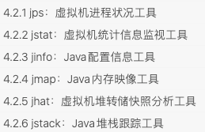

**jps：虚拟机进程状况工具**

* 功能类似ps，可以列出正在运行的虚拟机进程，并显示虚拟机执行主类名称（Main）以及这些进程的本地虚拟机唯一ID。

* 辅助其余的JDK工具，因为需要jps查询到的LVM ID来确定要监控的是哪一个虚拟机进程

* ```java
	jps [options] [hostid]
	```

	| 选项 |                         作用                         |
	| :--: | :--------------------------------------------------: |
	|  -q  |             只输出LVM ID，省略主类的名称             |
	|  -m  |    输出虚拟机进程启动时传递给主类main()函数的参数    |
	|  -l  | 输出主类的全名，如果进程执行的是jar包，则输出jar路径 |
	|  -v  |            输出虚拟机进程启动时的JVM参数             |

**jstat：虚拟机统计信息监视工具**

* 用于监视虚拟机各种运行状态信息的命令行工具。可以显示虚拟机进程中的类加载、内存、垃圾收集、即时编译等运行时数据，在服务器上是运行期定位虚拟机性能问题的常用工具。

* ```java
	jstat [option vmid [interval[s|ms][count]]];
	// 每250 毫秒查询一次进程2764垃圾收集状况，一共查询20次
	jstat -gc 2764 250 20
	```

	

**jinfo：Java配置信息工具**

* 实时查看和调整虚拟机各项参数

* ```java
	jinfo [ option ] pid
	
	// 例子
	jinfo -flag CMSInitiatingOccupancyFraction 1444 
	-XX:CMSInitiatingOccupancyFraction=85
	```

**jmap：Java内存映射工具**

* 用于生成堆转储快照（一般称为heapdump或dump文件）
* 还可以查询finalize执行队列、Java堆和方法区的 详细信息，如空间使用率、当前用的是哪种收集器等
* 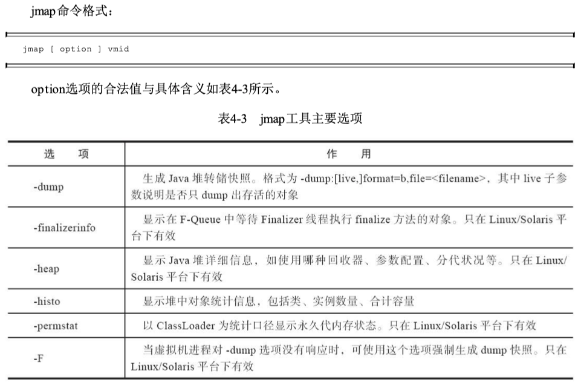

**jhat：虚拟机堆转储快照分析工具**

* 与jmap搭配使用，来分析jmap生成的堆转储快照。

* ```java
	jhat eclipse.bin
	```

**jstack：Java堆栈跟踪工具**

* 用于生成虚拟机当前时刻的线程快照（线程快照就是当前虚拟机内每一条线程正在执行的方法堆栈的集合，生成线程快照的目的通常是**定位线程出现长时间停顿的原因**，如线程间死锁、死循环、请求外部资源导致的长时间挂起等，都是导致线程长时间停顿的常见原因。线程出现停顿时通过jstack来查看各个线程的调用堆栈， 就可以获知没有响应的线程到底在后台做些什么事情，或者等待着什么资源。）
* 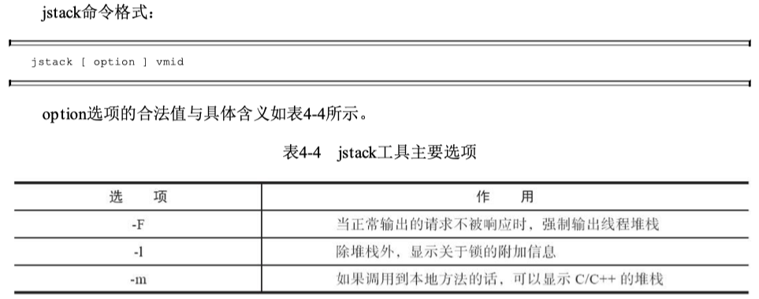


## 3 垃圾回收机制（GC）

### 3.1什么是垃圾？

* 对于java对象而言，没有被其他对象所引用，则该对象就是无用的
* **方法区垃圾收集**：废弃的常量和不再使用的类型
	* 回收废弃**常量**与回收堆中的对象很类似，没有任何字符串对象引用常量池中的常量，且虚拟机中也没有其他地方引用这个字面量。如果在这时发生内存回收，而且 垃圾收集器判断确有必要的话，这个常量就将会被系统清理出常量池。
	* 回收一个**类型**，需要满足三个条件：
		* 该类所有的实例都已经被回收，也就是Java堆中不存在该类及其任何派生子类的实例
		* 加载该类的类加载器已经被回收，这个条件除非是经过精心设计的可替换类加载器的场景，如 OSGi、JSP的重加载等，否则通常是很难达成的。
		* 该类对应的java.lang.Class对象没有在任何地方被引用，无法在任何地方通过反射访问该类的方法。
	* 在大量使用反射、动态代理、CGLib等字节码框架，动态生成JSP以及OSGi这类频繁自定义类加载 器的场景中，通常都需要Java虚拟机具备类型卸载的能力，以保证不会对方法区造成过大的内存压力。（-Xnoclassgc）

### 3.2 判定垃圾的算法**：**引用计数法**和**可达性分析算法

* 引用计数法：
	* 给对象添加一个引用计数器，每当有一个地方引用，计数器就+1，引用失效则-1
	* 任何时候计数器为0的对象就是不可能再被使用的，可以当做垃圾回收
	* 优缺点：
		* 优：执行效率高，程序执行受影响较小
		* 缺：无法检测出循环引用的情况，导致内存泄漏
	
* 可达性分析算法：
  * 通过一系列”GC Roots“的对象作为起点，从这些节点向下搜索，节点所走过的路称为引用链，若一个对象到”GC Roots“没有链相连，则此对象不可用
  * 如果对象在进行可达性分析后发现没 有与GC Roots相连接的引用链，那它将会被第一次标记，随后进行一次筛选，判定是否有必要执行finalize()方法，如果执行了有可能能连上
  * 可作为”**GC Roots**“的对象
  	* 在虚拟机栈（栈帧中的本地变量表）中引用的对象，譬如各个线程被调用的方法堆栈中使用到的 参数、局部变量、临时变量等。
  	
  	* 在方法区中类静态属性引用的对象，譬如Java类的引用类型静态变量。
  	
  	* 在方法区中常量引用的对象，譬如字符串常量池（String Table）里的引用。
  	
  	* 在本地方法栈中JNI（即通常所说的Native方法）引用的对象
  	
  	* Java虚拟机内部的引用，如基本数据类型对应的Class对象，一些常驻的异常对象（比如 NullPointExcepiton、OutOfMemoryError）等，还有系统类加载器
  	
  	* 所有被同步锁（synchronized关键字）持有的对象
  	
  	* 反映Java虚拟机内部情况的JMXBean、JVMTI中注册的回调、本地代码缓存等

### 3.3 垃圾回收器

> 衡量垃圾收集器的三项最重要的指标是：内存占用（Footprint）、吞吐量（Throughput）和延迟 （Latency）

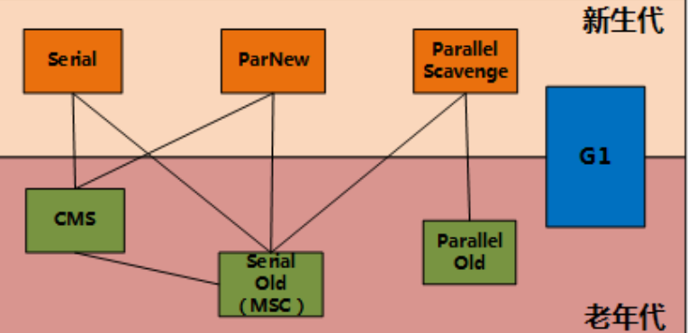

**新生代收集器**（**新⽣代采⽤复制算法暂停所有用户线程，⽼年代采⽤标记-整理算法暂停所有用户线程。**）

* **Serial 收集器**：Serial（串⾏）收集器是最基本、历史最悠久的垃圾收集器了。是⼀个**单线程**收集器了。它的 “单线程” 的意义不仅仅意味着它只会使⽤⼀条垃圾收集线程去完成垃圾收集⼯作，更重要的是它在进⾏垃圾收集⼯作的时候必须暂停其他所有的⼯作线程，直到它收集结束。（简单且高效，额外内存消耗最小，HotSpot客户端模式下的默认新生代收集器）

* **ParNew 收集器**：ParNew 收集器其实就是 Serial 收集器的多线程并行版本，默认开启的收集线程数与处理器核心数量相同，除了使⽤多线程进⾏垃圾收集外，其余⾏为（控制参数、收集算法、回收策略等等）和 Serial 收集器完全⼀样。（在服务端模式下的HotSpot虚拟机，1.7前，除了Serial收集器外，目前只有它能与CMS 收集器配合工作，1.9后G1取代CMS+ParNew）

* **Parallel Scavenge 收集器**：Parallel Scavenge 收集器关注点是吞吐量（⾼效率的利⽤ CPU，处理器用于运行用户代码的时间与处理器总消耗时间的比值），而CMS 等垃圾收集器的关注点更多的是⽤户线程的停顿时间（提⾼⽤户体验）。

**老年代收集器：**

* **Serial Old 收集器**：Serial 收集器的⽼年代版本，它同样是⼀个单线程收集器。如果在服务端模式下，它也可能有两种用途：一种是在JDK 5以及之前的版本中与Parallel Scavenge收集器搭配使用 ，另外一种就是作为CMS 收集器发生失败时的后备预案，在并发收集发生Concurrent Mode Failure时使用
* **Parallel Old 收集器**：Parallel Scavenge 收集器的⽼年代版本。使⽤多线程和“标记-整理”算法。在注重吞吐量以及 CPU 资源的场合，都可以优先考虑 Parallel Scavenge 收集器和 Parallel Old 收集器。
* **CMS 收集器**：⼀种以获取最短回收停顿时间为⽬标的收集器。它⾮常符合在注重⽤户体验的应⽤上使⽤。CMS（Concurrent Mark Sweep）收集器是 HotSpot 虚拟机第⼀款真正意义上的并发收集器，它第⼀次实现了让垃圾收集线程与⽤户线程（基本上）同时⼯作。
	* 分四步，初始和重新"stop the world"。
		* **初始标记**：记录CG root关联的对象，因此停顿时间比较短；
		* **并发标记**：GC Root Tracing，这个过程耗时较长但是不需要停顿用户线程，可以与垃圾收集线程一起并发运行；
		* **重新标记**：修正并发标记期间标记的改动（时间比初始标记稍长一点，短于并发）；
		* **并发清除**：清理删除掉标记阶段判断的已经死亡的 对象，由于不需要移动存活对象，所以这个阶段也是可以与用户线程同时并发的
	* 缺点：
		* 对处理器资源非常敏感。在并发阶段，它虽然不会导致用户线程停顿，但却会因为占用了一部分线程（或者说处理器的计 算能力）而导致应用程序变慢，降低总吞吐量。
		* 由于CMS收集器无法处理“浮动垃圾”（Floating Garbage），有可能出现“Con-current Mode Failure”失败进而导致另一次完全“Stop The World”的Full GC的产生。
		* CMS是一款基于“标记-清除”算法实现的收集器，如果 读者对前面这部分介绍还有印象的话，就可能想到这意味着收集结束时会有大量空间碎片产生

**G1收集器**

* 哪块内存中存放的垃圾数量最多，回收收益最大，这就是G1收集器的Mixed GC模式
* G1不再坚持固定大小以及固定数量的分代区域划分，而是把连续的Java堆划分为多个大小相等的独立区域（Region），每一个Region都可以根据需要，扮演新生代的Eden空间、Survivor空间，或者老年代空间。收集器能够对扮演不同角色的 Region采用不同的策略去处理，这样无论是新创建的对象还是已经存活了一段时间、熬过多次收集的旧对象都能获取很好的收集效果。
* Region中还有一类特殊的Humongous区域，专门用来存储大对象。G1认为只要大小超过了一个 Region容量一半的对象即可判定为大对象。而对于那些超过了整个Region容量的超级大对象， 将会被存放在N个连续的Humongous Region之中，G1的大多数行为都把Humongous Region作为老年代 的一部分来进行看待（每个Region的大小可以通过参数-XX：G1HeapRegionSize设 定，取值范围为1MB～32MB，且应为2的N次幂。）
* 虽然G1仍然保留新生代和老年代的概念，但新生代和老年代不再是固定的了，它们都是一系列区 域（不需要连续）的动态集合。G1收集器之所以能建立可预测的停顿时间模型，是因为它将Region作为单次回收的最小单元，即每次收集到的内存空间都是Region大小的整数倍，这样可以有计划地避免在整个Java堆中进行全区域的垃圾收集。更具体的处理思路是：
	* 让G1收集器去跟踪各个Region里面的垃圾堆积的“价值”大小，价值即回收所获得的空间大小以及回收所需时间的经验值
	* 然后在后台维护一个优先级列表，每次根据用户设定允许的收集停顿时间（使用参数-XX：MaxGCPauseMillis指定，默 认值是200毫秒），优先处理回收价值收益最大的那些Region，这也就是“Garbage First”名字的由来。 
	* 这种使用Region划分内存空间，以及具有优先级的区域回收方式，保证了G1收集器在有限的时间内获取尽可能高的收集效率。

* 分四步
	* **初始标记**：仅仅只是标记一下GC Roots能直接关联到的对象，并且修改TAMS指针的值，让下一阶段用户线程并发运行时，能正确地在可用的Region中分配新对象。这个阶段需要停顿线程，但耗时很短，而且是借用进行Minor GC的时候同步完成的，所以G1收集器在这个阶段实际并没有额外的停顿。
	* **并发标记**：从GC Root开始对堆中对象进行可达性分析，递归扫描整个堆里的对象图，找出要回收的对象，这阶段耗时较长，但可与用户程序并发执行。当对象图扫描完成以后，还要重新处理SATB记录下的在并发时有引用变动的对象。
	* **最终标记**：对用户线程做另一个短暂的暂停，用于处理并发阶段结束后仍遗留下来的最后那少量的SATB记录
	* **筛选回收**：负责更新Region的统计数据，对各个Region的回收价值和成本进行排序，根据用户所期望的停顿时间来制定回收计划，可以自由选择任意多个Region 构成回收集，然后把决定回收的那一部分Region的存活对象复制到空的Region中，再清理掉整个旧 Region的全部空间。这里的操作涉及存活对象的移动，是必须暂停用户线程，由多条收集器线程并行完成的。

**CMS和G1区别**：

* 理论角度：
	* CMS基于”标记清除“，G1基于”标记整理“（两个Region之间是标记-复制），都意味着G1运行期间不会产生内存空间碎片，GC完成之后能提供规整的可用内存。
	* 但是，在用户程序运行过程 中，G1无论是为了垃圾收集产生的内存占用（Footprint）还是程序运行时的额外执行负载 （Overload）都要比CMS要高
* 分代回收角度：
	* G1同时回收老年代和年轻代，而CMS只能回收老年代，需要配合一个年轻代收集器。
	* 另外G1的分代更多是逻辑上的概念，G1将内存分成多个等大小的region，Eden/ Survivor/Old分别是一部分region的逻辑集合，物理上内存地址并不连续。CMS在old gc的时候会回收整个Old区，对G1来说没有old gc的概念，而是区分Fullyyoung gc和Mixed gc，前者对应年轻代的垃圾回收，后者混合了年轻代和部分老年代的收集，因此每次收集肯定会回收年轻代，老年代根据内存情况可以不回收或者回收部分或者全部(这种情况应该是可能出现)。
* 跨代引用（内存占用）角度：CMS和G1都用到了卡表，但是用法不太一样。
	* CMS：JVM将内存分成一个个固定大小的card，然后有一个专门的数据结构(即这里的Card Table)维护每个Card的状态，一个字节对应一个Card。当一个Card上的对象的引用发生变化的时候，就将这个Card对应的Card Table上的状态置为dirty，young gc的时候扫描状态是dirty的Card即可。
	* G1：（**通过写屏障来维护记忆集，才能处理跨代指针**）
		* 堆中每个Region，无论扮演的是新生代还是老年代角色，都必须有一份卡表，这导致G1的记忆集（和 其他内存消耗）可能会占整个堆容量的20%乃至更多的内存空间
		* 在Card Table的基础上引入的rememberedset(下面简称RSet，记忆集)。每个region都会维护一个RSet，记录着引用到本region中的对象的其他region的Card。比如A对象在regionA，B对象在regionB，且B.f = A，则在regionA的RSet中需要记录B所在的Card的地址。这样的好处是可以对region进行单独回收，这要求RSet不只是维护老年代到年轻代的引用，也要维护这老年代到老年代的引用，对于跨代引用的每次只要扫描这个region的RSet上的Card即可。
* 并发过程对象变化：
	* CMS初始标记的时候会标记所有从root直接可达的对象，并发标记的时候再从这些对象进一步搜索其他可达对象，最终构成一个存活的对象图。并发标记过程中引用发生变化的也是通过Card Table来记录。但是young gc的时候如果一个dirty card没有包含到年轻代的引用，这个card会重新标记为clean，这有可能将并发标记过程产生的dirty card错误清除，因此CMS引入了另一个数据结构mod union table，这里一个bit对应一个Card，young gc在将Card Table设置为clean的时候会将对应的mod union table置为dirty。最终标记的时候会将Card Table或者mod union table是dirty的Card也作为root去扫描，从而解决并发标记过程产生的引用变化。CMS还需要处理并发过程从年轻代晋升到老年代的对象，处理方式是将这部分对象也作为root去扫描。
	* G1使用一个称为snapshot at the beginning(下面简称SATB)的算法，在初始标记的时候得到一个从root直接可达的snapshot，之后从这个snapshot不可达的对象都是可以回收的垃圾，并发过程产生的对象都默认是活的对象，留到下一次再处理。对于引用关系发生变化的，将这个对象对应的Card放到一个SATB队列里，在最终标记的时候进行处理(如果超过一定的阈值并发标记的时候也会处理一部分)，处理的过程就是以队列中的Card作为root进行扫描。

**Shenandoah**（使用转发指针和读屏障来实现并发整理）

* 最重要的当然是支持并发的整 理算法，G1的回收阶段是可以多线程并行的，但却不能与用户线程并发，这点作为Shenandoah最核心 的功能
* 默认不使用分代收集的，换言之，不会有 专门的新生代Region或者老年代Region的存在，没有实现分代，并不是说分代对Shenandoah没有价值， 这更多是出于性价比的权衡，基于工作量上的考虑而将其放到优先级较低的位置上
* Shenandoah摒弃了在G1中耗费大量内存和计算资源去维护的记忆集，改用名为“连接矩阵”（Connection Matrix）的全局数据结构来记录跨Region的引用关系，降低了处理跨代指针时的记忆集维护消耗，也降 低了伪共享问题的发生概率
* 九个阶段：初始标记、并发标记、最终标记、并发清理、并发回收、初始引用更新、并发引用更新、最终引用更新、并发清理

**ZGC**（染色指针和读屏障）

* 四个阶段：并发标记、并发预备重分配、并发重分配、并发重映射
* 完全没有使用记忆集，它甚至连分代都没有，连像CMS中那样只记录新生代和老年代间引用的卡表也不需要，因而完全没有用到写屏障，所以给用户线程带来的运行负担也要小得多
* 支持“NUMA-Aware”的内存分配
* 染色指针
	* 可以使得一旦某个Region的存活对象被移走之后，这个Region立即就能够被释放和重用掉，而不必等待整个堆中所有指向该Region的引用都被修正后才能清理。这点相比起Shenandoah是一个颇大的优势，使得理论上只要还有一个空闲Region，ZGC就能完成收集，而Shenandoah需要等到引用更新阶段结束以后才能释放回收集中的Region，这意味着堆中几乎所有对象都存活的极端情况，需要1：1复制对象到新Region的话，就必须要有一半的空闲Region来完成收集。至于为什么染色指针能够导致这样的结果，笔者将在后续解释其“自愈”特性的时候进行解释。
	* 可以大幅减少在垃圾收集过程中内存屏障的使用数量，设置内存屏障，尤其是写屏障的目的通常是为了记录对象引用的变动情况，如果将这些信息直接维护在指针中，显然就可以省去一些专门的记录操作。
	* 可以作为一种可扩展的存储结构用来记录更多与对象标记、重定位过程相关的数据，以便日后进一步提高性能。

**怎么选**

* 那就根据内存规模衡量一 下，对于大概4GB到6GB以下的堆内存，CMS一般能处理得比较好，而对于更大的堆内存，可重点考察一下G1。

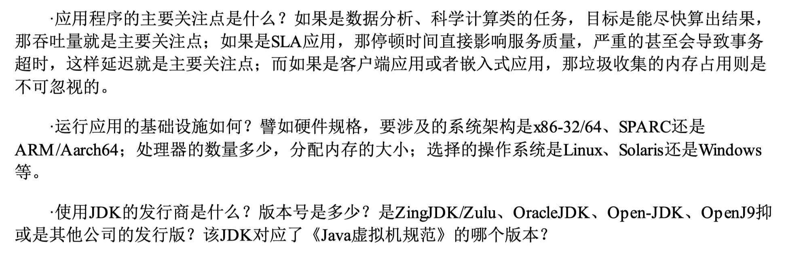

### 3.4 四种垃圾回收算法

* 标记清除算法
	* 分为两个阶段：标记--清除
	* 两个问题：效率问题（两阶段效率都很低），空间问题（标记清除后产生大量不连续的碎片）
*  复制算法（新生代算法）
	* 原理：将堆中可用的新生代内存按容量分成几块区域，每次只使用一块区域。当一块区域需要GC时，将此区域还存活的对象复制到另一块上，在把此区域一次性清理掉。
	* 新生代中98%的对象都是”朝生夕死”的，所以并不需要按照1 : 1的比例来划分内存空间，而是将内存(新生代内存)分为一块较大的Eden(伊甸园)空间和两块较小的Survivor(幸存者)空间，每次使用Eden和其中一块Survivor（两个Survivor区域一个称为From区，另一个称为To区域）。
	* 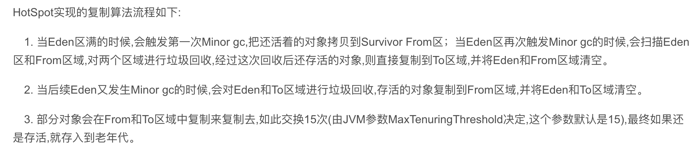
	* 优：解决碎片化问题，顺序分配内存简单高效
	* 缺：只适用于存活率低的场景，如果极端情况下如果对象全部存活，就要浪费一半的存储空间
* 标记整理算法（老年代回收算法）
	* 和标记清除算法相似，但是在标记完成之后，不是直接清理可回收对象，而是将存活对象都向一端移动，然后清理掉端边界以外的内存
	* 相比于标记清除算法，成本更高，但又解决了内存碎片的问题
* 分代回收算法
	* 根据具体的情况选择具体的垃圾回收算法。一般将 java 堆分为新生代和老年代，这样就可以根据各个年代的特点选择合适的垃圾收集算法。
	* 新生代：复制算法
	* 老年代：标记清除算法 或 标记整理算法

* 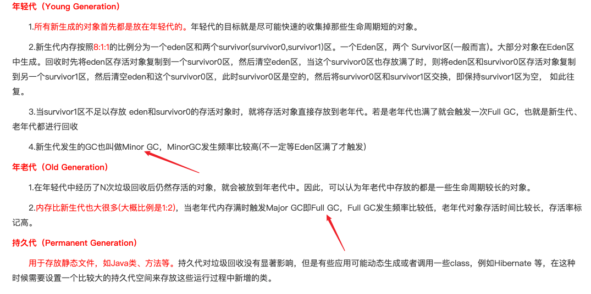

* 在发生Minor GC之前，虚拟机必须先检查老年代最大可用的连续空间是否大于新生代所有对象总空间，如果这个条件成立，那这一次Minor GC可以确保是安全的。如果不成立，则虚拟机会先查看XX：HandlePromotionFailure参数的设置值是否允许担保失败（Handle Promotion Failure）；如果允 许，那会继续检查老年代最大可用的连续空间是否大于历次晋升到老年代对象的平均大小，如果大 于，将尝试进行一次Minor GC，尽管这次Minor GC是有风险的；如果小于，或者-XX： HandlePromotionFailure设置不允许冒险，那这时就要改为进行一次Full GC。
* 触发Minor GC原因
	* new的对象过大
	* Eden区满了
* 进入老年代的原因：
	* 对象过大（XX：MaxTenuringThreshold  默认15）
	* HotSpot虚拟机并不是永远要求对象的年龄必须达到XX：MaxTenuringThreshold才能晋升老年代，如果在Survivor空间中相同年龄所有对象大小的总和大于 Survivor空间的一半，年龄大于或等于该年龄的对象就可以直接进入老年代，无须等到-XX： MaxTenuringThreshold中要求的年龄。


## 4 反射

> 在运行状态中，对于任意一个类，都能够获取这个类的所有属性和方法，对于任意一个对象，都能够调用它的任意一个方法和属性（包括私有方法和属性），这种动态获取的信息以及动态调用对象的功能叫反射机制。

**获取方式**

* 要想使用反射机制，必须要获取到该类的字节码文件对象（.class），获取方式(三种)

	```java
	// 1 通过Class类中的静态方法forName，直接获取到一个类的字节码文件对象，此时该类还是源文件阶段，并没有变为字节码文件
	Class clazz1 = Class.forName("com.komorebi.pojo.User");
	// 2 当类被加载成.class文件时，此时Person类变成了.class，在获取该字节码文件对象，也就是获取自己，该类处于字节码阶段。
	Class clazz2  = Person.class;
	// 3 通过类的实例获取该类的字节码文件对象，该类处于创建对象阶段　
	Class clazz3 = p.getClass();
	```

**获取实例对象方式**

* 得到.class之后，创建实例对象

  ```java
  // 无参
  User user = (User)clazz1.newInstance();
  // 有参
  Constructor constructor = clazz1.getConstructor(int.class, String.class);
  User user = (User)constructor.newInstance(12, "XX");
  // 获取成员变量
  Field field = clazz1.getDeclaredField("id");
  ```

**底层设计原理**

* 动态代理：一种设计模式（火车票让人代买），实际上就是通过反射来生成一个代理

  * `java.lang.reflect`包下提供了一个**Proxy**类和一个**InvocationHandler**接口，通过使用这个类和接口就可以生成动态代理对象
  * 步骤：
  	* 1 new 出代理对象，通过实现`InvacationHandler`接口，然后new出代理对象
  	* 2 通过Proxy类的静态方法`newProxyInstance`，来将代理对象假装成那个被代理的对象
  	* 3 执行

* 优缺点：

	* 优点：可以实现动态创建对象和编译
	* 缺点：对性能有影响


## 5 异常处理

> 异常是一个事件，发生在程序运行期间，干扰了正常的指令流程。Java通过Throwable类的众多子类描述各种不同的异常。因而，Java异常都是对象，是Throwable子类的实例，描述了出现在一段编码中的错误条件。

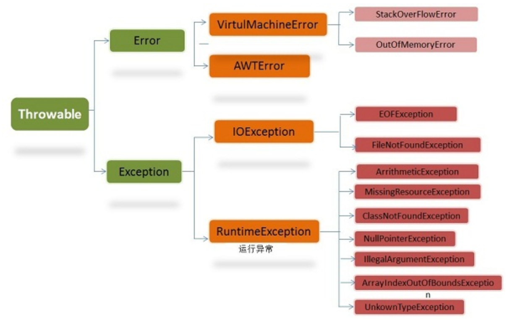

* 错误（Error）：Error类及其子类，代表了JVM本身的错误，很少出现
* 异常（Exception）：代表程序运行时发生的各种不期望发生的事件，可以被Java异常处理机制使用，是异常处理的核心

* 根据**Javac对异常的处理要求**，将异常分为两类：
	* **非检查异常**：`Error`和`RuntimeException`以及他们的子类。**编译时不会提示和发现这样的异常，不要求在程序处理。**可以用try，也可以不处理。对于这类异常，应该去修正代码（除0错误`ArithmeticException`、强转错误`ClassCastException`、数组越界`ArrayIndexOutOfBoundsException`和空指针异常`NullPointerException`）
	* **检查异常**：javac强制要求程序员为这样的异常做预备处理工作（使用`try - catch - finally`或者`throws`）。这样的异常一般是由程序的运行环境导致的，因为程序可能被运行在各种未知的环境下，而程序员无法干预用户如何使用，所以应该预先准备，如`SQLException`、`IOException`和`ClassNotFoundException`
* 异常是在执行某个函数时引发的，函数层级调用，所以会有异常追踪栈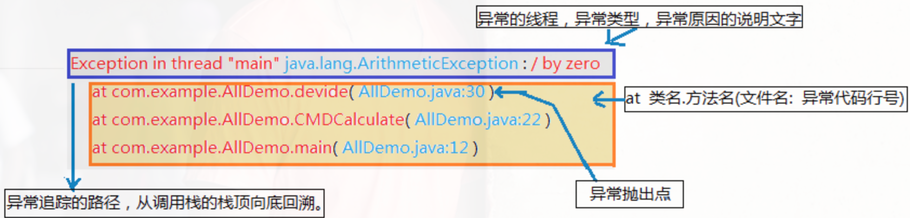
* **try - catch - finally**
	* 三者中的局部变量不能共享使用
	* 一个catch对应一个异常，第一个匹配到的会被执行，也支持父类匹配。因此，如果一个try下的多个catch有父子类型，子类放前面
	* java中，异常处理的任务就是**将执行控制流从异常发生的地方转移到能够处理这种异常的地方去**。也就是说：当一个函数的某条语句发生异常时，这条语句的后面的语句不会再执行，它失去了焦点。执行流跳转到最近的匹配的异常处理catch代码块去执行，异常被处理完后，执行流会接着在“处理了这个异常的catch代码块”后面接着执行。
* **throws**
	* throws是另一种处理异常的方式，它不同于try...catch...finally，throws仅仅是将函数中可能出现的异常向调用者声明，而自己则不具体处理。
	* 采取这种异常处理的原因可能是：方法本身不知道如何处理这样的异常，或者说让调用者处理更好，调用者需要为可能发生的异常负责。
* **自定义异常**：
	* 如果要自定义异常类，则扩展Exception类即可，因此这样的自定义异常都属于检查异常（checked exception）。如果要自定义非检查异常，则扩展自RuntimeException。
	* 自定义的异常应该总是包含如下的构造函数：
		* 一个无参构造函数
		* 一个带有String参数的构造函数，并传递给父类的构造函数。
		* 一个带有String参数和Throwable参数，并都传递给父类构造函数
		* 一个带有Throwable 参数的构造函数，并传递给父类的构造函数。


## 6 API

### 6.1 String、StringBuilder、StringBuffer区别

> 1、String 类中使⽤ final 关键字修饰字符数组来保存字符串， private final char value[] ，所以 String 对象是不可变的。
>
> 2、StringBuilder 与 StringBuffer 都继承⾃ AbstractStringBuilder 类，在 AbstractStringBuilder 中 也是使⽤字符数组保存字符串 char[]value 但是没有⽤ final 关键字修饰，所以这两种对象都是可 变的

这三个类的区别主要在两个方面：**运行速度**和**线程安全**

* 运行速度：**StringBuilder > StringBuffer > String**（String最慢是因为它是字符串常量，另外两个是变量。String创建后是不可更改的，str = str + "11"实际上是重新创建了一个新的String，旧的被GC回收了）
* 线程安全：**StringBuilder是线程不安全的，StringBuffer是线程安全的**
	* 若一个StringBuffer对象在字符串缓冲区被多个线程使用时，StringBuffer很多方法带有synchronized关键字进行同步，可以保证线程安全


### 6.2 ArrayList、LinkedList、Vector的区别

**存储结构**

* ArrayList和Vector是基于Object数组实现的，LinkedList是基于双向链表实现的
* ArrayList和Vector按照顺序将元素存储（下标0开始），删除完成后，需要使部分元素移位，默认初始容量为10

**线程安全**

* ArrayList不具有线程安全性，在单线程时，LinkedList也是线程不安全的，若在并发环境下使用，可以用Collections类中的静态方法synchronizedList()对它们进行调用
* Vector是线程安全的，其大部分方法都包含synchronized，但是效率相对较低

**扩容机制**

* ArrayList和Vector都是使用Object的数组形式存储的，若要扩容时，ArrayList扩充为原先**1.5**倍，Vector是**2**倍
* Vector可以设置扩容增量（设置capacityIncrement为一个>0的数），ArrayList不行。
* 原理：元素个数超过数组长度时，会产生一个新的数组，将原数组的数据复制过去

**CURD效率**

* ArrayList和Vector从指定的位置检索一个对象，或在集合的末尾插入、删除一个元素的时间复杂度是一样，$O(1)$
* ArrayList和Vector在其他位置增加或者删除一个元素的时间复杂度是$O(n)$
* LinkedList中，在插入、删除任何位置的元素所花费的时间都是一样的，时间复杂度都为$O(1)$
* LinkedList在检索一个元素的时间复杂度为$O(n)$


### 6.3 HashMap的底层实现

- **JDK1.7及之前：数组+链表**
- **JDK1.8：数组+链表+红黑树**

**HashMap添加元素**

当添加元素时，会通过哈希值和数组长度计算下标来定位元素应该put的位置（通常为使分布均匀，会使用取模，但实际并不是）。

​		（1）计算出index，就将元素添加进去，会产生**哈希冲突**。（计算出的索引相同，但此索引此时有值）

​		（2）此时，用第二种数据结构--**链表**，冲突的元素在该索引处以链表的形式保存。

​		（3）当链表过长时，查询效率较低，时间复杂度会到$O(n)$。此时引入第三种数据结构--**红黑树**（红黑树是一颗接近平衡的二叉树，查询时间复杂度为$O(logn)$）.==将链表转换成红⿊树前会判断，如果当前数组的⻓度⼩于 64，那么 会选择先进⾏数组扩容，⽽不是转换为红⿊树若链表不到一定长度，直接用红黑树是不行的，红黑树维护代价较高，每次插入一个数据都会打破红黑树的平衡性，需要每次都再平衡（左旋、右旋、重新着色）==

**Hash算法**

```java
static final int hash(Object key) {
    int h;
    return (key == null) ? 0 : (h = key.hashCode()) ^ (h >>> 16); // >>> 无符号右移，忽略符号位，空位都以0补齐
}

public int hashCode() {
    int h = hash;
    if (h == 0 && value.length > 0) {
        char val[] = value;

        for (int i = 0; i < value.length; i++) {
            h = 31 * h + val[i];
        }
        hash = h;
    }
    return h;
}
```

* hash的目的是为了尽量**分布均匀**。取模做位与运算的时候，实际上刚刚开始数组的长度一般比较小，只利用了低16位,高16位是用不到的。这种情况下，产生hash冲突的概率会大大增加。这样设计保证将h无符号右移16为相当于将高区16位移动到了低区的16位，再与原hashcode做**异或运算**，可以将**高低位二进制特征混合起来**。
* 推导公式：$s[0]*31 ^ {n-1} + s[1]*31^{n-2} + ... + s[n-1]$
	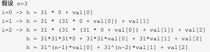
* 选31的原因
	* 选择质数作为乘子，会大大降低hash冲突的概率。质数的值越大，hash冲突率越低
	* 31参与乘法运算，可以被 JVM 优化，`31 * i = (i << 5) - i`
	* 使用 101 计算 hash code 容易导致整型溢出，导致计算精度丢失

**数组长度问题**

* HashMap中数组的初始长度为16，默认加载因子为0.75

* 若传入一个参数，则调用一个重载方法，即使用指定的初始值来创建HashMap，默认加载因子依旧是0.75

	* 在方法中进行判断，若初始容量<0，则抛出异常；若大于最大容量（1<<30），就为最大容量

	* 方法最后设置加载因子和一个`tableSizefor`方法，返回一个**大于输入参数且最近的2的整数次幂** 

	* 该算法让最高位的1后面的位全变为1。最后再让结果n+1，即得到了2的整数次幂的值了。cap-1再赋值给n的目的是让找到的目标值大于或等于原值

		```java
		/**
		* Returns a power of two size for the given target capacity.
		*/
		static final int tableSizeFor(int cap) {
		    int n = cap - 1;
		    n |= n >>> 1;
		    n |= n >>> 2;
		    n |= n >>> 4;
		    n |= n >>> 8;
		    n |= n >>> 16;
		    return (n < 0) ? 1 : (n >= MAXIMUM_CAPACITY) ? MAXIMUM_CAPACITY : n + 1;
		}
		```

* 为什么要2的整数幂？

	* put方法和hash方法

		```java
		public V put(K key, V value) {
			return putVal(hash(key), key, value, false, true);
		}
		
		static final int hash(Object key) {
		    int h;
		    return (key == null) ? 0 : (h = key.hashCode()) ^ (h >>> 16);
		}
		```

	* 上文提过，添加元素时索引下标可以取模得到，但是计算机的运行效率：加减 > 乘法 > 除法 > 取模。因为HashMap中要定位索引，并且数组一旦达到容量阈值就需要扩容，扩容就意味着要进行数组的移动，数组一旦移动，每移动一次都要重回计算索引，这个过程牵扯到大量元素的迁移，很影响效率。

	* putVal方法，它是实现具体的put操作的方法

		```java
		    /**
		     * Implements Map.put and related methods
		     *
		     * @param hash hash for key
		     * @param key the key
		     * @param value the value to put
		     * @param onlyIfAbsent if true, don't change existing value
		     * @param evict if false, the table is in creation mode.
		     * @return previous value, or null if none
		     */
			final V putVal(int hash, K key, V value, boolean onlyIfAbsent,
		                   boolean evict) {
		        Node<K,V>[] tab; Node<K,V> p; int n, i;
		        //1. 如果当前table为空，新建默认大小的table
		        if ((tab = table) == null || (n = tab.length) == 0)
		            n = (tab = resize()).length;
		        //2. 获取当前key对应的节点
		        if ((p = tab[i = (n - 1) & hash]) == null)
		            //3. 如果不存在，新建节点
		            tab[i] = newNode(hash, key, value, null);
		        else {
		            //4. 存在节点
		            Node<K,V> e; K k;
		            //5. key的hash相同，key的引用相同或者key equals，则覆盖
		            if (p.hash == hash &&
		                ((k = p.key) == key || (key != null && key.equals(k))))
		                e = p;
		            //6. 如果当前节点是一个红黑树树节点，则添加树节点
		            else if (p instanceof TreeNode)
		                e = ((TreeNode<K,V>)p).putTreeVal(this, tab, hash, key, value);
		            //7. 不是红黑树节点，也不是相同节点，则表示为链表结构
		            else {
		                for (int binCount = 0; ; ++binCount) {
		                    //8. 找到最后那个节点
		                    if ((e = p.next) == null) {
		                        p.next = newNode(hash, key, value, null);
		                        //9. 如果链表长度超过8转成红黑树
		                        if (binCount >= TREEIFY_THRESHOLD - 1) // -1 for 1st
		                            treeifyBin(tab, hash);
		                        break;
		                    }
		                    //10.如果链表中有相同的节点，则覆盖
		                    if (e.hash == hash &&
		                        ((k = e.key) == key || (key != null && key.equals(k))))
		                        break;
		                    p = e;
		                }
		            }
		            if (e != null) { // existing mapping for key
		                V oldValue = e.value;
		                //是否替换掉value值
		                if (!onlyIfAbsent || oldValue == null)
		                    e.value = value;
		                afterNodeAccess(e);
		                return oldValue;
		            }
		        }
		        //记录修改次数
		        ++modCount;
		        //是否超过容量，超过需要扩容
		        if (++size > threshold)
		            resize();
		        afterNodeInsertion(evict);
		        return null;
		    }
		```

	* 使用**与运算**`(n-1) & hash`取代**取模运算**`hash%length`，因为这两种方式记算出来的结果是一致的（n就是length），也就是`(length-1)&hash = hash%length`，例如：假设数组长度为4，哈希值为10（但是当数组的长=长度不为2的指数次幂时，两种方式计算的结果不一样，即`length-1)&hash ≠ hash&length`）

		```java
		(n-1) & hash = (4-1) & 10 = 00000011 & 00001010 = 00000010 = 2
		hash % length = 10 % 4 = 2
		```

	* **总结：首先使用位运算来加快计算的效率，而要使用位运算，就需要数组-1然后与hash值保证其在数组范围内，只有当数组长度为2的指数次幂时，其计算得出的值才能和取模算法的值相等，并且保证能取到数组的每一位，减少哈希碰撞，不浪费大量的数组资源**

**加载因子为0.75**

​		加载因子如果定的太大，比如1，这就意味着数组的每个空位都需要填满，即达到理想状态，不产生链表，但实际是不可能达到这种理想状态，如果一直等数组填满才扩容，虽然达到了最大的数组空间利用率，但会产生大量的哈希碰撞，同时产生更多的链表，显然不符合我们的需求。

​		但如果设置的过小，比如0.5，这样一来保证了数组空间很充足，减少了哈希碰撞，这种情况下查询效率很高，但消耗了大量空间。

​		因此，需要在时间和空间上做一个折中，选择最合适的负载因子以保证最优化，取到了0.75

**链表长度>8则转成红黑树**

```java
	 * Because TreeNodes are about twice the size of regular nodes, we
     * use them only when bins contain enough nodes to warrant use
     * (see TREEIFY_THRESHOLD). And when they become too small (due to
     * removal or resizing) they are converted back to plain bins.  In
     * usages with well-distributed user hashCodes, tree bins are
     * rarely used.  Ideally, under random hashCodes, the frequency of
     * nodes in bins follows a Poisson distribution
     * (http://en.wikipedia.org/wiki/Poisson_distribution) with a
     * parameter of about 0.5 on average for the default resizing
     * threshold of 0.75, although with a large variance because of
     * resizing granularity. Ignoring variance, the expected
     * occurrences of list size k are (exp(-0.5) * pow(0.5, k) /
     * factorial(k)). The first values are:
     *
     * 0:    0.60653066
     * 1:    0.30326533
     * 2:    0.07581633
     * 3:    0.01263606
     * 4:    0.00157952
     * 5:    0.00015795
     * 6:    0.00001316
     * 7:    0.00000094
     * 8:    0.00000006
     * more: less than 1 in ten million
```

​		这是一个概率论中的泊松分布，因为链表长度大于等于8时转成红黑树正是遵循泊松分布

​		意思就是HashMap节点分布遵循泊松分布，按照泊松分布的计算公式计算出了链表中元素个数和概率的对照表，可以看到**链表中元素个数为8时的概率已经非常小**。

​		**另一方面红黑树平均查找长度是log(n)，长度为8的时候，平均查找长度为3，如果继续使用链表，平均查找长度为8/2=4，这才有转换为树的必要**。链表长度如果是小于等于6，6/2=3，虽然速度也很快的，但是链表和红黑树之间的转换也很耗时。

​		当然，虽然在hashmap底层有这种红黑树的结构，但是能产生这种结构的概率也不大，所以在 JDK1.7 到 JDK1.8 这其中HashMap的性能也只提高了7%~8% 左右

* `HashSet`底层也是`HashMap`，即所有的key对应的值都是`Present`


### 6.4 ConcurrentHashMap的底层实现

在多线程环境下，使用HashMap进行put操作时会存在丢失数据的情况，因此使用`ConcurrentHashMap`代替`HashMap`

**JDK1.7版本**

* `HashTable`是一个线程安全的类，使用`synchronized`关键字锁住整张哈希表来实现线程安全，相当于所有线程进行读写的时候都去竞争同一把锁，效率很低

* `ConcurrentHashMap`可以做到读取数据不加锁，并且内部结构可以在进行写操作的时候将锁的粒度保持尽量的小，允许多个修改操作并发进行，关键在于使用了**锁分段技术**，即使用多个锁来控制对哈希表的不同部分进行修改
	
	* 使用段`Segment`来表示不同的部分，每个段就是一个小的HashTable，有各自的锁。只要多个修改操作发生在不同的段上，就可以并发进行
	* 在最理想的情况下，ConcurrentHashMap 可以**最高同时支持 Segment 数量大小的写操作**（刚好这些写操作都非常平均地分布在所有的 Segment上），所以，通过这一种结构，ConcurrentHashMap 的并发能力可以大大的提高
		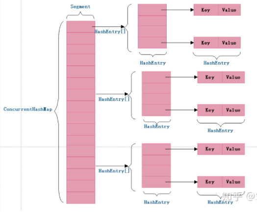
	
* **为什么使用ConcurrentHashMap**
	        在多线程环境中使用HashMap的put方法有可能导致程序死循环，因为多线程可能会导致HashMap形成环形链表，即链表的一个节点的next节点永不为null，就会产生死循环。这时，CPU的利用率接近100%，所以并发情况下不能使用HashMap。

	​        HashTable通过使用synchronized保证线程安全，但在线程竞争激烈的情况下效率低下。因为当一个线程访问HashTable的同步方法时，其他线程只能阻塞等待占用线程操作完毕。

	​        ConcurrentHashMap使用分段锁的思想，对于不同的数据段使用不同的锁，可以支持多个线程同时访问不同的数据段，这样线程之间就不存在锁竞争，从而提高了并发效率。

* **Java7与Java8中的ConcurrentHashMap：**
	在ConcurrentHashMap中主要通过**锁分段**技术实现上述目标。
	JDK1.7版本锁的粒度是基于**Segment**的，包含多个HashEntry，而JDK1.8**锁的粒度就是HashEntry**（首节点）

	​		在Java7中，ConcurrentHashMap由**Segment数组结构和HashEntry数组**组成。Segment是一种可重入锁，是一种数组和链表的结构，一个Segment中包含一个HashEntry数组，每个HashEntry又是一个链表结构。正是通过Segment分段锁，ConcurrentHashMap实现了高效率的并发。（通过 key 定位到 Segment，之后在对应的 Segment 中进行具体的 pu）

	​		在Java8中，ConcurrentHashMap去除了Segment分段锁的数据结构，主要是**基于CAS操作**保证保证数据的获取以及使用synchronized关键字对相应数据段加锁实现了主要功能，这进一步提高了并发性。同时同时为了提高哈希碰撞下的寻址性能，Java 8在链表长度超过一定阈值(8)时将链表（寻址时间复杂度为O(N)）转换为红黑树（寻址时间复杂度为O(long(N)))。
	
* **put流程**

     * put函数底层调用了putVal进行数据的插入，对于putVal函数的流程大体如下。

     　　① 判断存储的key、value是否为空，若为空，则抛出异常，否则，进入步骤②

     　　② 计算key的hash值，随后进入无限循环，该无限循环可以确保成功插入数据，若table表为空或者长度为0，则初始化table表，否则，进入步骤③

     　　③ 根据key的hash值取出table表中的结点元素，若取出的结点为空（该桶为空），则使用CAS将key、value、hash值生成的结点放入桶中。否则，进入步骤④

     　　④ 若该结点的的hash值为MOVED，则对该桶中的结点进行转移，否则，进入步骤⑤

     　　⑤ 对桶中的第一个结点（即table表中的结点）进行加锁，对该桶进行遍历，桶中的结点的hash值与key值与给定的hash值和key值相等，则根据标识选择是否进行更新操作（用给定的value值替换该结点的value值），若遍历完桶仍没有找到hash值与key值和指定的hash值与key值相等的结点，则直接新生一个结点并赋值为之前最后一个结点的下一个结点。进入步骤⑥

     　　⑥ 若binCount值达到红黑树转化的阈值，则将桶中的结构转化为红黑树存储，最后，增加binCount的值。

     * ```java
          final V putVal(K key, V value, boolean onlyIfAbsent) {
                  if (key == null || value == null) throw new NullPointerException(); // 键或值为空，抛出异常
                  // 键的hash值经过计算获得hash值
                  int hash = spread(key.hashCode());
                  int binCount = 0;
                  for (Node<K,V>[] tab = table;;) { // 无限循环
                      Node<K,V> f; int n, i, fh;
                      if (tab == null || (n = tab.length) == 0) // 表为空或者表的长度为0
                          // 初始化表
                          tab = initTable();
                      else if ((f = tabAt(tab, i = (n - 1) & hash)) == null) { // 表不为空并且表的长度大于0，并且该桶不为空
                          if (casTabAt(tab, i, null,
                                       new Node<K,V>(hash, key, value, null))) // 比较并且交换值，如tab的第i项为空则用新生成的node替换
                              break;                   // no lock when adding to empty bin
                      }
                      else if ((fh = f.hash) == MOVED) // 该结点的hash值为MOVED
                          // 进行结点的转移（在扩容的过程中）
                          tab = helpTransfer(tab, f);
                      else {
                          V oldVal = null;
                          synchronized (f) { // 加锁同步
                              if (tabAt(tab, i) == f) { // 找到table表下标为i的节点
                                  if (fh >= 0) { // 该table表中该结点的hash值大于0
                                      // binCount赋值为1
                                      binCount = 1;
                                      for (Node<K,V> e = f;; ++binCount) { // 无限循环
                                          K ek;
                                          if (e.hash == hash &&
                                              ((ek = e.key) == key ||
                                               (ek != null && key.equals(ek)))) { // 结点的hash值相等并且key也相等
                                              // 保存该结点的val值
                                              oldVal = e.val;
                                              if (!onlyIfAbsent) // 进行判断
                                                  // 将指定的value保存至结点，即进行了结点值的更新
                                                  e.val = value;
                                              break;
                                          }
                                          // 保存当前结点
                                          Node<K,V> pred = e;
                                          if ((e = e.next) == null) { // 当前结点的下一个结点为空，即为最后一个结点
                                              // 新生一个结点并且赋值给next域
                                              pred.next = new Node<K,V>(hash, key,
                                                                        value, null);
                                              // 退出循环
                                              break;
                                          }
                                      }
                                  }
                                  else if (f instanceof TreeBin) { // 结点为红黑树结点类型
                                      Node<K,V> p;
                                      // binCount赋值为2
                                      binCount = 2;
                                      if ((p = ((TreeBin<K,V>)f).putTreeVal(hash, key,
                                                                     value)) != null) { // 将hash、key、value放入红黑树
                                          // 保存结点的val
                                          oldVal = p.val;
                                          if (!onlyIfAbsent) // 判断
                                              // 赋值结点value值
                                              p.val = value;
                                      }
                                  }
                              }
                          }
                          if (binCount != 0) { // binCount不为0
                              if (binCount >= TREEIFY_THRESHOLD) // 如果binCount大于等于转化为红黑树的阈值
                                  // 进行转化
                                  treeifyBin(tab, i);
                              if (oldVal != null) // 旧值不为空
                                  // 返回旧值
                                  return oldVal;
                              break;
                          }
                      }
                  }
                  // 增加binCount的数量
                  addCount(1L, binCount);
                  return null;
              }
          ```

          

### 6.5 HashMap 和 Hashtable 的区别

1. 线程是否安全：

	HashMap 是⾮线程安全的， HashTable 是线程安全的,因为HashTable 内部的⽅法基本都经过 synchronized 修饰。（如果你要保证线程安全的话就使⽤ ConcurrentHashMap 吧！）；

2. 效率： 因为线程安全的问题， HashMap 要⽐ HashTable 效率⾼⼀点。另外， HashTable 基本被淘汰，不要在代码中使⽤它；
3. 对 Null key 和 Null value 的⽀持： HashMap 可以存储 null 的 key 和 value，但 null 作为 键只能有⼀个，null 作为值可以有多个；HashTable 不允许有 null 键和 null 值，否则会抛出 NullPointerException 。
4. 初始容量⼤⼩和每次扩充容量⼤⼩的不同 ： ① 创建时如果不指定容量初始值， Hashtable 默认的初始⼤⼩为 11，之后每次扩充，容量变为原来的 2n+1。 HashMap 默认的初始化⼤⼩为 16。之后每次扩充，容量变为原来的 2 倍。② 创建时如果给定了容量初始值，那么 Hashtable 会直接使⽤你给定的⼤⼩，⽽ HashMap 会将其扩充为 2 的幂次⽅⼤⼩ （ HashMap 中的 tableSizeFor() ⽅法保证，下⾯给出了源代码）。也就是说 HashMap 总 是使⽤ 2 的幂作为哈希表的⼤⼩,后⾯会介绍到为什么是 2 的幂次⽅。
5. 底层数据结构： JDK1.8 以后的 HashMap 在解决哈希冲突时有了较⼤的变化，当链表⻓度 ⼤于阈值（默认为 8）（==将链表转换成红⿊树前会判断，如果当前数组的⻓度⼩于 64，那么 会选择先进⾏数组扩容，⽽不是转换为红⿊树==）时，将链表转化为红⿊树，以减少搜索时 间。Hashtable 没有这样的机制。

**HashMap中的key-value可以是null，为什么HashTable和ConcurrentHashMap中的不可以是null呢？**

> 这个问题还要从HashMap和HashTable的区别来说，HashTable内的方法是同步的，而HashMap不是；

* 一般来讲，HashMap不是线程安全的，一般只用于单线程中；而HashTable则往往用于多线程中；
* 在允许key - value为null的情况下，考虑下面一个场景：
	* map.get(key) 的返回结果是null，那么是因为不存在对应的key是null呢，还是key对应的value就是null；
	* 对于单线程来讲，这个问题是可以解决的，通过map.contains(key)就可以判断，但是对于多线程来讲，要解决这个问题就很复杂了，必须由外部保证contains 与 get操作的原子性，正是出于对这个问题考虑，所以不允许value为null；（实际上HashTable中并没有提供contains方法，也是因为这个原因）

* 那么为什么key也不能是null呢？
	* 由于null不是对象，因此不能在其上调用.equals（）或.hashCode（），因此ConcurrentHashMap无法将其计算哈希值以用作键。但是HashMap对此做了特殊处理；


## 7 锁

### 7.1 关于锁了解多少，知道lock这个锁的底层原理

> [美团技术团队讲解锁的博客](https://tech.meituan.com/2018/11/15/java-lock.html)

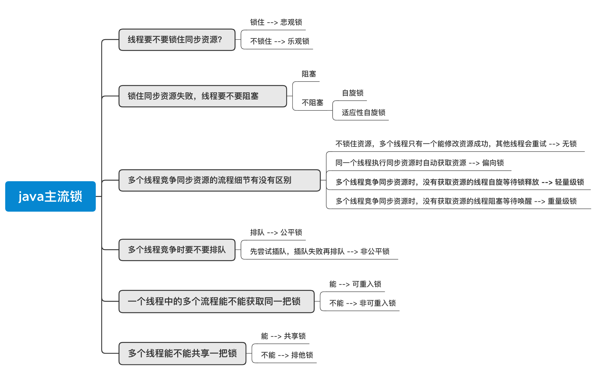

**乐观锁和悲观锁**

* 乐观锁和悲观锁并不是特指，某两种类型的锁，是人们定义出来的概念或思想，主要是指**看待并发同步的角度**
* 乐观锁：认为每次去拿数据的时候都认为别人不会修改，所以不会上锁，但是在更新的时候会判断一下在此期间别人有没有去更新这个数据，可以使用**数据版本机制**或**CAS**操作实现。适用于多读的应用类型，可以提高吞吐量，在`java.util.concurrent.atomic`包下的原子变量类就是使用了乐观锁的CAS方式实现的
	* 数据版本机制：在数据表中假设一个数据版本号或者时间戳，当数据修改时，也会随之变动。线程更新数据时，在读取数据的同时也会读取版本号，提交更新时，若读取到的version值一致才更新，否则重试更新操作
	* **CAS**：（Compare and Swap）当多个线程使用CAS同时更新一个变量时，只有其中一个线程能更新变量的值，其他线程都失败，失败的线程不会被挂起，而是被告知在竞争中失败，并可以再次尝试。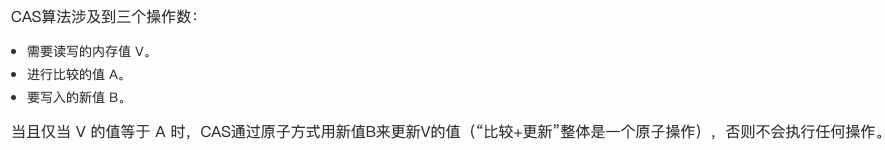
	* CAS的三大问题
		* **ABA问题**：CAS需要在操作值的时候检查内存值是否发生变化，没有发生变化才会更新内存值。但是如果内存值原来是A，后来变成了B，然后又变成了A，那么CAS进行检查时会发现值没有发生变化，但是实际上是有变化的。ABA问题的解决思路就是在变量前面添加版本号，每次变量更新的时候都把版本号加一，这样变化过程就从“A－B－A”变成了“1A－2B－3A”。
			- JDK从1.5开始提供了AtomicStampedReference类来解决ABA问题，具体操作封装在compareAndSet()中。compareAndSet()首先检查当前引用和当前标志与预期引用和预期标志是否相等，如果都相等，则以原子方式将引用值和标志的值设置为给定的更新值。
		* **循环时间长开销大**。CAS操作如果长时间不成功，会导致其一直自旋，给CPU带来非常大的开销。
		* **只能保证一个共享变量的原子操作**。对一个共享变量执行操作时，CAS能够保证原子操作，但是对多个共享变量操作时，CAS是无法保证操作的原子性的。
			- Java从1.5开始JDK提供了AtomicReference类来保证引用对象之间的原子性，可以把多个变量放在一个对象里来进行CAS操作。
* 悲观锁：总是假设最坏情况，每次去拿数据的时候都认为别人会修改，所以每次拿数据都上锁。`synchronized`关键字就是悲观锁
	* 在对任意记录进行修改前，先尝试为该记录加上排他锁（exclusive locking）。
	* 如果加锁失败，说明该记录正在被修改，那么当前查询可能要等待或者抛出异常。具体响应方式由开发者根据实际需要决定。
	* 如果成功加锁，那么就可以对记录做修改，事务完成后就会解锁了。
	* 期间如果有其他对该记录做修改或加排他锁的操作，都会等待我们解锁或直接抛出异常。
* 适用场景：
	* 悲观锁适用于写操作多的场景，乐观锁适用于读操作多的场景
	* 悲观锁在Java中的使用就是利用各种锁
	* 乐观锁在Java中的使用就是无锁编程，最常用的是CAS算法，典型例子就是原子类，通过CAS自旋实现原子操作的更新


**自旋锁和适应性自旋锁**

​		阻塞或唤醒一个Java线程需要操作系统切换CPU状态来完成，这种状态转换耗费处理器时间。如果同步代码块中的内容太简单，很可能状态转换消耗的时间比执行代码的时间还要长

​		若物理机器有多个处理器，能让两个或以上的线程同时进行，就可以让后面那个请求锁的线程不放弃CPU执行时间，看前一个是否很快释放锁。而为了让这个线程“稍等”，就让这个线程进行**自旋**。

* **自旋锁本身是有缺点的，它不能代替阻塞。**虽然避免了线程切换的开销，但前提是锁被占用的时间要短。因此，自旋等待的时间必须要有一定的限度（默认10次）
	* **自旋锁的原理也是CAS**
* JDK6中加入**适应性自旋锁**，自旋次数不再固定，而是由**前一次在同一个锁上的自旋时间**及锁拥有者的状态决定
	* 若同一个锁上，自旋等待刚刚成功获得过锁，并且持有锁的线程正在运行中，那虚拟机会认为这次自旋也有可能成功，次数变多
	* 若对于某个锁，自旋很少成功过，那以后在尝试时可能省略自旋过程，直接阻塞线程，避免浪费资源


**可重入锁和非可重入锁**

​		可重入锁又名递归锁，是指在同一个线程在外层方法获取锁的时候，再进入该线程的内层方法会自动获取锁（前提锁对象得是同一个对象或者class），不会因为之前已经获取过还没释放而阻塞。Java中ReentrantLock和synchronized都是可重入锁，可重入锁的一个优点是**可一定程度避免死锁**。

* 首先ReentrantLock和NonReentrantLock都继承父类AQS，其父类AQS中维护了一个同步状态status来计数重入次数，status初始值为0。
* 当线程尝试获取锁时，可重入锁先尝试获取并更新status值，如果status == 0表示没有其他线程在执行同步代码，则把status置为1，当前线程开始执行。如果status != 0，则判断当前线程是否是获取到这个锁的线程，如果是的话执行status+1，且当前线程可以再次获取锁。而非可重入锁是直接去获取并尝试更新当前status的值，如果status != 0的话会导致其获取锁失败，当前线程阻塞。
* 释放锁时，可重入锁同样先获取当前status的值，在当前线程是持有锁的线程的前提下。如果status-1 == 0，则表示当前线程所有重复获取锁的操作都已经执行完毕，然后该线程才会真正释放锁。而非可重入锁则是在确定当前线程是持有锁的线程之后，直接将status置为0，将锁释放。


**死锁**

​		死锁是指**两个或两个以上的进程**在执行过程中，由于竞争资源或者由于彼此通信而造成的一种阻塞的现象，若无外力作用，它们都将无法推进下去。此时称系统处于死锁状态或系统产生了死锁，这些永远在互相等待的进程称为死锁进程。

* 死锁的四个条件：
	* 互斥，共享资源 X 和 Y 只能被一个线程占用；
	* 占有且等待，线程 T1 已经取得共享资源 X，在等待共享资源 Y 的时候，不释放共享资源 X；
	* 不可抢占，其他线程不能强行抢占线程 T1 占有的资源；
	* 循环等待，线程 T1 等待线程 T2 占有的资源，线程 T2 等待线程 T1 占有的资源，就是循环等待。

* 预防死锁：这四个条件都发生时才会出现死锁，那么反过来，**也就是说只要我们破坏其中一个，就可以成功预防死锁的发生**。四个条件中我们不能破坏互斥，因为我们使用锁目的就是保证资源被互斥访问，于是我们就对其他三个条件进行破坏：
	* 占用且等待：一次性申请所有的资源，这样就不存在等待了。
	* 不可抢占：占用部分资源的线程进一步申请其他资源时，如果申请不到，可以主动释放它占有的资源。
	* 循环等待，靠按序申请资源来预防。所谓按序申请，是指资源是有线性顺序的，申请的时候可以先申请资源序号小的，再申请资源序号大的，这样线性化申请后就不存在循环了。


### 7.2 volatile关键字

> volatile是Java提供的一种轻量级的同步机制，在并发编程中，它也扮演着比较重要的角色。同synchronized相比（synchronized通常称为重量级锁），volatile更轻量级，相比使用synchronized所带来的庞大开销，倘若能恰当的合理的使用volatile

​		并发三特征**可见性、有序性、原子性**中，volatile解决了可见性和原子性。

**原子性**：原子性是指多线程一起执行时，一个线程操作开始后不会被其他线程干扰，操作不可被中断；

* synchronizd临界区执行具有原子性（加锁和释放锁的机制，ObjectMonitor）；

* 在有些罕见的条件之下，可以有限的保证原子性，他主要不是用来保证原子性的

**可见性**：一个线程修改共享变量时，其他线程能够立即知道这个修改；

* volatile：valatile变量保证变量新值立即被同步回主存，每次读取valtile变量都立即从主存刷新；

* synchronized：对变量进行解锁前，将对应变量同步回内存；会通过加入一些内存屏障，在同步代码块对变量做的写操作，都会在释放锁的时候，全部强制执行flush操作，在进入同步代码块的时候，对变量的读操作，全部会强制执行 refresh的操作。所以说，更新的数据，别的线程只要进入代码块，就一定可以读到的（加了Load屏障和Store屏障，释放锁flush 数据，加锁会 refresh数据）

* final：final字段一旦初始化完毕，并且this引用没有发生逃逸，其他线程立即看到final字段值；

**有序性**：线程内操作有序进行，线程间操作有序进行；

* volatile通过禁止重排序实现有序性；
* synchronized通过声明临界区，保证线程互斥访问，实现有序性；会通过加各种各样的内存屏障，来保证说，解决LoadLoad、storestore 等等重排刷（Acquire屏障和Release屏障，保证同步代码块内部的指令可以重排，但是同步代码块内部的指令和外面的指令是不能重排的）

**synchronized 关键字和volatile 关键字是两个互补的存在，⽽不是对⽴的存在！**

* volatile 关键字是线程同步的轻量级实现，所以 volatile 性能肯定⽐ synchronized 关键字要好。但是 volatile 关键字只能⽤于变量⽽ 块。 
* volatile 关键字能保证数据的可⻅性，但不能保证数据的原⼦性。 synchronized 关键字两 者都能保证。
* volatile 关键字主要⽤于解决变量在多个线程之间的可⻅性，⽽ synchronized 关键字解决 的是多个线程之间访问资源的同步性。


### 7.3 synchronized的实现和机制，锁升级机制

> synchronized关键字可用来给对象和方法或者代码块加锁，当它锁定一个方法或者一个代码块的时候，同一时刻最多只有一个线程执行这段代码。
>
> Synchronized进过编译，会在同步块的前后分别形成monitorenter和monitorexit这个两个字节码指令。在执行monitorenter指令时，首先要尝试获取对象锁。如果这个对象没被锁定，或者当前线程已经拥有了那个对象锁，把锁的计算器加1，相应的，在执行monitorexit指令时会将锁计算器就减1，当计算器为0时，锁就被释放了。如果获取对象锁失败，那当前线程就要阻塞，直到对象锁被另一个线程释放为止。

**synchronized有三种应用方式**：

* 作用于**实例方法**，当前实例加锁，进入同步代码前要获得当前实例的锁；

* 作用于**静态方法**，当前类加锁，进去同步代码前要获得当前类对象的锁；

* 作用于**代码块**，对括号里配置的对象加锁

**锁升级的目的**

* 锁升级是为了减低了锁带来的性能消耗。在 Java 6 之后优化 synchronized 的实现方式，使用了偏向锁升级为轻量级锁再升级到重量级锁的方式，从而减低了锁带来的性能消耗。
* 初次执行到synchronized代码块的时候，锁对象变成偏向锁。线程执行并不会主动释放锁。第二次到达代码块的时候，线程会判断之前的线程是不是自己，如果是自己的话，由于前面没有释放锁的操作，这里也就不用重新加锁，就没有加锁、解锁的开销了。
* 当第二个线程过来，两个线程产生了竞争，就会**从偏向锁升级成自旋锁**。自旋锁竞争状态中，没有获得锁的线程，就会不断自旋判断自己是否拿到了锁，没有拿到锁就会忙等。


**无锁、偏向锁、轻量级锁和重量级锁**

> 这四种指锁的状态，针对`synchronized`关键字

|  锁状态  |                        存储内容                         | 存储内容 |
| :------: | :-----------------------------------------------------: | :------: |
|   无锁   |     对象的hashCode、对象分代年龄、是否是偏向锁（0）     |    01    |
|  偏向锁  | 偏向线程ID、偏向时间戳、对象分代年龄、是否是偏向锁（1） |    01    |
| 轻量级锁 |                  指向栈中锁记录的指针                   |    00    |
| 重量级锁 |              指向互斥量（重量级锁）的指针               |    10    |

* 无锁：不锁定资源，所有线程都能访问并修改同一个资源，但同时**只有一个线程能修改成功**（CAS）
* 偏向锁：这个意思就是说，monitorenter 和monitorexit是要使用CAS操作加锁和释放锁的，开销较大，因此如果发现大概率只有一个线程会主要竞争一个锁，那么会给这个锁维护一个偏好（Bias），后面他加锁和释放锁，基于Bias来执行，不需要通过CAS，性能会提升很多。但是如果有偏好之外的线程来竞争锁，就要收回之前分配的偏好
* 轻量级锁：如果偏向锁没能成功实现，就是因为不同线程竞争锁太频繁了，此时就会尝试采用轻量级锁的方式来加锁，就是将对象头的Mark Word里有一个轻量级锁指针，尝试指向持有锁的线程，然后判断一下是不是自己加的锁。如果是自己加的锁，那就执行代码就。如果不是自己加的锁，那就是加锁失败，说明有其他人加了锁，这个时候就是升级为重量级锁。
	* 轻量级锁提升程序同步性能的依据是：对于绝大部分的锁，在整个同步周期内都是不存在竞争的（区别于偏向锁）。这是一个经验数据。如果没有竞争，轻量级锁使用CAS操作避免了使用互斥量的开销，但如果存在锁竞争，除了互斥量的开销外，还额外发生了CAS操作，因此在有竞争的情况下，轻量级锁比传统的重量级锁更慢。
* 重量级锁：升级为重量级锁是，锁标志的状态值变为“10”。重量级锁**使除了拥有锁的线程以外的线程都阻塞，防止CPU空转**。
* 偏向所锁，轻量级锁都是乐观锁，重量级锁是悲观锁。


### 7.4 Sychronized和Lock的区别

**区别**

1. `Synchronized`是内置关键字，`Lock`是个java类
2. `Synchronized`无法判断是否获取锁的状态，`Lock`可以判断是否获取到锁
3. `Synchronized`会自动释放锁（a 线程执行完同步代码会释放锁  b 线程执行过程中发生异常会释放锁），`Lock`需要在`finally`中手动释放锁（unlock方法），否则容易造成死锁
4. 用`Synchronized`关键字的两个线程，如果线程1获得锁，线程2则等待，如果线程1阻塞，则线程2则一直等待下去；`Lock`锁就不一定会等待下去，如果尝试获取不到锁，线程可以不用一直等待就结束了
5. `Synchronized`的锁可重入、不可中断、非公平；而`Lock`锁可重入、可判断、可公平（两者皆可）
6. `Synchronized`锁适合代码量少的同步问题，`Lock`锁适合代码量大的同步问题

**sychronized底层原理**

* `synchronized` 底层的原理，是跟jvm指令和monitor有关系的

* 如果用到了`synchronized` 关键字，在底层编译后的jvm指令中，会有`monitorenter`和`monitorexit `两个指令

	```java
	monitorentere
	//代码对应的指令
	monitorexit
	```

	* **monitorenter**：每个对象都有一个关联的monitor，比如一个对象实例就有一个monitor，一个类的Class对象也有一个monitor，如果要对这个对象加锁，那么必须获取这个对象关联的monitor的lock锁。（monitor里有一个计数器，从0开始获取monitor的锁，查看计数器是不是0，是0就获取锁，否则计数器+1，支持**重入加锁**的）
	* **monitorexit**：此时获取锁的线程就会对那个对象的monitor的计数器减1，如果有多次重入加锁就会对应多次减1，直到最后，计数器是0。为了保证一定可以退出不占有线程，一般是一次enter配两次exit
	* 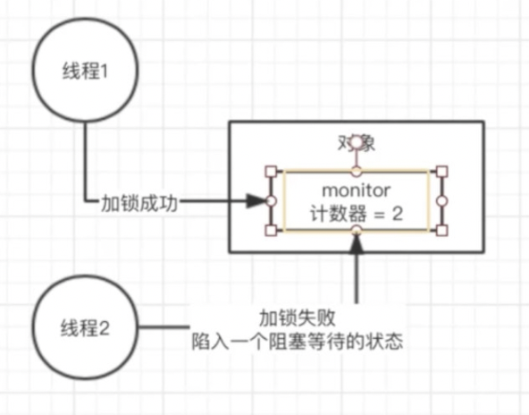

### 7.5 Synchronized与ReentrantLock区别

**功能区别**

* 这两种方式最大区别就是对于Synchronized来说，它是java语言的关键字，是原生语法(monitor对象)层面的互斥，需要jvm实现。而ReentrantLock它是JDK 1.5之后提供的API层面的互斥锁，需要lock()和unlock()方法配合try/finally语句块来完成
* 便利性：很明显Synchronized的使用比较方便简洁，并且由编译器去**自动保证**锁的加锁和释放，而ReenTrantLock需要**手动声明**来加锁和释放锁，为了避免忘记手工释放锁造成死锁，所以最好在finally中声明释放锁。

**性能区别**

* Synchronized进过编译，会在同步块的前后分别形成monitorenter和monitorexit这个两个字节码指令。在执行monitorenter指令时，首先要尝试获取对象锁。如果这个对象没被锁定，或者当前线程已经拥有了那个对象锁，把锁的计算器加1，相应的，在执行monitorexit指令时会将锁计算器就减1，当计算器为0时，锁就被释放了。如果获取对象锁失败，那当前线程就要阻塞，直到对象锁被另一个线程释放为止。
* ReenTrantLock的实现是一种自旋锁，**通过循环调用CAS操作来实现加锁**。它的**性能比较好**也是因为避免了使线程进入内核态的阻塞状态。相比Synchronized，ReentrantLock类提供了一些高级功能
	* **等待可中断**，持有锁的线程长期不释放的时候，正在等待的线程可以选择放弃等待，这相当于Synchronized来说可以避免出现死锁的情况。通过lock.lockInterruptibly()来实现这个机制。
	* **公平锁**，多个线程等待同一个锁时，必须按照申请锁的时间顺序获得锁，Synchronized锁非公平锁，ReentrantLock默认的构造函数是创建的非公平锁，可以通过参数true设为公平锁，但公平锁表现的性能不是很好。
	* **锁绑定多个条件**，一个ReentrantLock对象可以同时绑定对个对象。ReenTrantLock提供了一个Condition（条件）类，用来实现分组唤醒需要唤醒的线程们，而不是像synchronized要么随机唤醒一个线程要么唤醒全部线程。

**ReentrantLock.lock()原理**

* ReentrantLock在采用非公平锁构造时，首先检查锁状态，如果锁可用，直接通过CAS设置成持有状态，且把当前线程设置为锁的拥有者。
* 如果当前锁已经被持有，那么接下来进行可重入检查，如果可重入，需要为锁状态加上请求数。如果不属于上面两种情况，那么说明锁是被其他线程持有，当前线程应该放入等待队列。
* 在放入等待队列的过程中，首先要检查队列是否为空队列，如果为空队列，需要创建虚拟的头节点，然后把对当前线程封装的节点加入到队列尾部。由于设置尾部节点采用了CAS，为了保证尾节点能够设置成功，这里采用了无限循环的方式，直到设置成功为止。
* 在完成放入等待队列任务后，则需要维护节点的状态，以及及时清除处于Cancel状态的节点，以帮助垃圾收集器及时回收。如果当前节点之前的节点的等待状态小于1，说明当前节点之前的线程处于等待状态(挂起)，那么当前节点的线程也应处于等待状态(挂起)。挂起的工作是由LockSupport类支持的，LockSupport通过JNI调用本地操作系统来完成挂起的任务(java中除了废弃的suspend等方法，没有其他的挂起操作)。
* 在当前等待的线程，被唤起后，检查中断状态，如果处于中断状态，那么需要中断当前线程。

**ReentrantLock.unlock()原理**

* 首先尝试释放锁，如果要求释放数等于锁状态数，那么将锁状态位清0，清除锁所有者，返回true；否则返回false;
* 如果(1)返回的是true，说明锁完全释放。接下来将检查等待队列，并选择一个waitStatus处于等待状态的节点下的线程unpark(恢复)，选择的依据是从尾节点开始，选取最靠近头节点的等待节点,同时清理队列中线程被取消的节点；
* 如果(1)返回false，说明锁只是部分释放，当前线程仍旧持有该锁；


## 8 线程池

### 8.1 创建线程池、线程池的运行机制和拒绝策略

> [美团技术团队线程池讲解博客](https://tech.meituan.com/2020/04/02/java-pooling-pratice-in-meituan.html)

**创建方式**

- 通过构造⽅法实现`ThreadPoolExecutor`
- `ThreadPoolExecutor`实现的顶层接口是`Executor`，顶层接口`Executor`提供了一种思想：将任务提交和任务执行进行解耦。用户无需关注如何创建线程，如何调度线程来执行任务，用户只需提供Runnable对象，将任务的运行逻辑提交到执行器(Executor)中，由Executor框架完成线程的调配和任务的执行部分。
- `ExecutorService`接口增加了一些能力：
	- 扩充执行任务的能力，补充可以为一个或一批异步任务生成Future的方法；
	- 提供了管控线程池的方法，比如停止线程池的运行。
- `AbstractExecutorService`则是上层的抽象类，将执行任务的流程串联了起来，保证下层的实现只需关注一个执行任务的方法即可。
- 最下层的实现类ThreadPoolExecutor实现最复杂的运行部分，ThreadPoolExecutor将会一方面维护自身的生命周期，另一方面同时管理线程和任务，使两者良好的结合从而执行并行任务。
- 线程池在内部实际上构建了一个生产者消费者模型，将线程和任务两者解耦，并不直接关联，从而良好的缓冲任务，复用线程。线程池的运行主要分成两部分：任务管理、线程管理。任务管理部分充当生产者的角色，当任务提交后，线程池会判断该任务后续的流转：（1）直接申请线程执行该任务；（2）缓冲到队列中等待线程执行；（3）拒绝该任务。线程管理部分是消费者，它们被统一维护在线程池内，根据任务请求进行线程的分配，当线程执行完任务后则会继续获取新的任务去执行，最终当线程获取不到任务的时候，线程就会被回收。

**创建线程池七大参数**

- `corePoolSzie`：线程池核心线程大小（即使这些线程处于空闲，也不会被销毁）
- `maximumPoolSize`：线程池最大线程数量
- `keepAliveTime`：空闲线程存活时间
- `unit`：空间线程存活时间单位
- `workQueue`：工作队列
	- `ArrayBlockingQueue`：基于数组的有界阻塞队列，FIFO排序
	- `LinkedBlockingQuene`：基于链表的无界阻塞队列
	- `SynchronousQuene`：一个不缓存任务的阻塞队列
	- `PriorityBlockingQueue`：具有优先级的无界阻塞队列
	- 无界队列高负载解决方案：自定义一个reject策略，如果线程池无法执行更多的任务了，此时建议你可以把这个任务信息持久化写入磁盘里去，后台专门启动一个线程，后续等待你的线程池的工作负载降低了，他可以慢慢的从磁盘里读取之前持久化的任务，重新提交到线程池里去执行
- `threadFactory`：线程工厂，用来设定线程名、是否为daemon线程等
- `handler`：拒绝策略

**运行机制**


1、在创建了线程池后，等待提交过来的任务请求。

2、当调用execute()方法添加一个任务请求，线程池会做如下判断：

- 如果正在运行的线程数小于或者等于corePoolSize，那么马上会创建线程运行这个任务；
- 如果正在运行的线程数大于corePoolSize，那么会将这个任务放入阻塞队列；
- 如果这时候队列满了并且正在运行的线程数量还小于maximumPoolSize，那么还是要创建非核心线程运行这个任务；
- 如果队列满了并且线程数大于或者等于maximumPoolSize，那么会启动饱和拒绝策略来执行。

3、当一个线程完成时，它会从队列中取下一个任务来执行。

4、当一个线程无事可做，且超过一定的时间（keepAliveTime）时，线程池会判断：

​    如果当前运行的线程数大于corePoolSize，那么这个线程会停掉。

​    所以线程池的所有任务完成后，它最终会收缩到corePoolSize的大小。


**拒绝策略**

- **AbortPolicy**（默认） 直接抛出RejectedExecutionException异常阻止系统正常运行。
- **CallerRunsPolicy**   “调用者运行”一种调节机制，该策略既不会丢弃任务，也不会抛出异常，而是将某些任务回退给调用者，从而降低新任务的流量。
- **DiscardOldestPolicy**  抛弃队列中等待最久的任务，然后把当前任务加入队列中尝试再次提交当前任务。  
- **DiscardPolicy**  直接丢弃任务，不予任何处理也不抛出异常。如果允许任务丢失，这是最好的一种方案。


**核心线程是否被回收**

在`ThreadPoolExecutor`中有一个属性`allowCoreThreadTimeOut`（默认false），即核心线程创建后不会被回收，可置为true


**核心线程何时创建**

默认情况下当任务到来时才会创建核心线程，不过`ThreadPoolExecutor`中有两个方法可以提前创建核心线程，

​		一个是`preStartAllCoreThread()`它会启动所有核心线程，

​		另一个是`preStartCoreThread()`,这一个的返回值是boolean类型，

如果所有的核心线程均已被启动则会返回false，如果一个核心线程启动成功将返回true。


### 8.2 实现多线程的方式（继承Thread，实现Runnable，实现Callable）

1 **继承Thread类**

* 自定义线程类**继承Thread类**

* 重写**run()**方法

* 创建线程对象，调用**start()**方法启动线程

* ```Java
	public class testThread1 extends Thread{
	    @Override
	    public void run() {
	        System.out.println("Thread方式创建多线程");
	    }
	
	    public static void main(String[] args) {
	        testThread1 t = new testThread1();
	        t.start();
	        System.out.println("over");
	    }
	}
	```

2 **实现Runnable接口**

* 定义MyRunnable类实现**Runnable**接口

* 实现**run()**方法

* 创建线程对象，调用**start()**方法启动线程

* ```Java
	public class testThread2 implements Runnable {
	    @Override
	    public void run() {
	        System.out.println("Runnable方式创建多线程");
	    }
	
	    public static void main(String[] args) {
	        testThread2 myRunnable = new testThread2();
	        Thread t = new Thread(myRunnable);
        t.start();
	        System.out.println("over");
	    }
	}
	
	```
	
* **3 实现Callable接口**
	
	* 实现Callable接口，需要返回值类型
	
	* 重写call，需要抛出异常
	
	* 创建目标对象
	
	* 创建执行任务 ExecutorService ser = Executors.newFixedThreadPool(1);
	
	* 提交执行：Future<Boolean> result1 = ser.submit(1);
	
	* 获取结果：boolean r1 = result1.get();
	
	* 关闭服务：ser.shutdownNow();
	
	* ```java
		public class testThread3 implements Callable<String> {
		    @Override
		    public String call() throws Exception {
		        return "Callable方式创建多线程 2";
		    }
		
		    public static void main(String[] args) {
		        ExecutorService threadPool = Executors.newSingleThreadExecutor();
		        // 启动多线程
		        Future<String> future = threadPool.submit(new testThread3());
		        try {
		            System.out.println("Callable方式创建多线程");
		            System.out.println(future.get());
		        } catch (Exception e) {
		            e.printStackTrace();
		        }
		    }
		}
		```
	
		

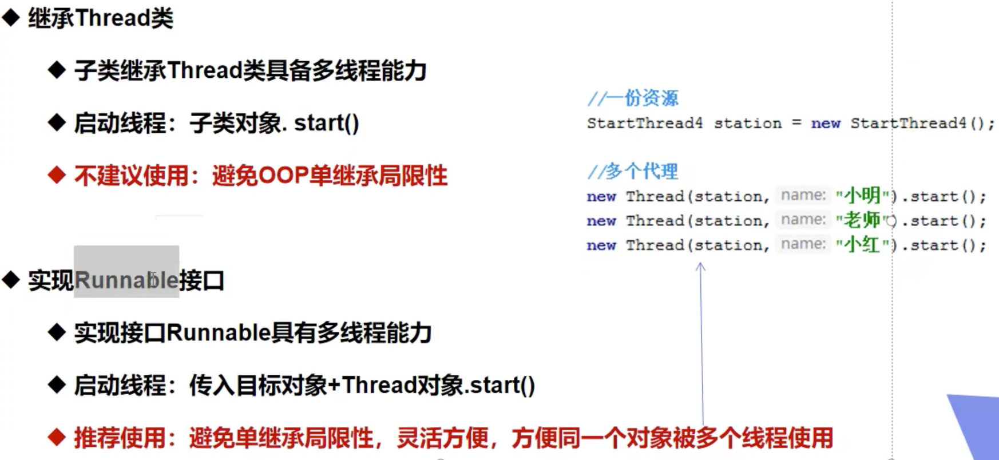

* Runnable 接⼝不会返回结果或抛出检查异常，但是 Callable 接⼝ 可以。


### 8.3 多线程的各种方法

**run() 和 start() 有什么区别？**

> start()：启动一个新线程，在新的线程运行run方法中的代码
>
> run()：新线程启动后会调用的方法

* run() 可以重复调用，而 start() 只能调用一次。
* 直接调用 run 是在主线程中执行了 run，没有启动新的线程；而使用 start 是启动新的线程，通过新的线程间接执行 run 中的代码

**sleep() 和 wait() 有什么区别？**

- 类的不同：sleep() 来自 Thread，wait() 来自 Object。
- 释放锁：sleep() 不释放锁；wait() 释放锁。
- 用法不同：wait() ⽅法被调⽤后，线程不会⾃动苏醒，需要别的线程调⽤同⼀个对象上的 者 notifyAll() ⽅法。 sleep() ⽅法执⾏完成后，线程会⾃动苏醒。或者可以使⽤ timeout) 超时后线程会⾃动苏醒。

**notify()和 notifyAll()有什么区别？**

* notifyAll()会唤醒所有的线程，notify()只会唤醒一个线程。notifyAll() 调用后，会将全部线程由等待池移到锁池，然后参与锁的竞争，竞争成功则继续执行，如果不成功则留在锁池等待锁被释放后再次参与竞争。而 notify()只会唤醒一个线程，具体唤醒哪一个线程由虚拟机控制。

**submit() 和 execute() 方法有什么区别？**

- execute()：只能执行 Runnable 类型的任务。
- submit()：可以执行 Runnable 和 Callable 类型的任务。
- Callable 类型的任务可以获取执行的返回值，而 Runnable 执行无返回值。
- execute() ⽅法⽤于提交不需要返回值的任务，所以⽆法判断任务是否被线程池执⾏成功与否；
- submit() ⽅法⽤于提交需要返回值的任务。线程池会返回⼀个Future 类型的对象，通过 这个 Future 对象可以判断任务是否执⾏成功，并且可以通过 Future 的 get() ⽅法来获取 返回值， get() ⽅法会阻塞当前线程直到任务完成，⽽使⽤ getlong timeoutTimeUnit unit ⽅法则会阻塞当前线程⼀段时间后⽴即返回，这时候有可能任务没有执⾏完。

| 方法名           | static | 功能说明                                                     | 注意                                                         |
| ---------------- | ------ | ------------------------------------------------------------ | ------------------------------------------------------------ |
| start()          |        | 启动一个新线 程，在新的线程 运行 run 方法 中的代码           | start 方法只是让线程进入就绪，里面代码不一定立刻 运行（CPU 的时间片还没分给它）。每个线程对象的 start方法只能调用一次，如果调用了多次会出现 IllegalThreadStateException |
| run()            |        | 新线程启动后会 调用的方法                                    | 如果在构造 Thread 对象时传递了 Runnable 参数，则 线程启动后会调用 Runnable 中的 run 方法，否则默 认不执行任何操作。但可以创建 Thread 的子类对象， 来覆盖默认行为 |
| join()           |        | 等待线程运行结 束                                            |                                                              |
| join(long n)     |        | 等待线程运行结 束,最多等待 n 毫秒                            |                                                              |
| getId()          |        | 获取线程长整型 的 id                                         | id 唯一                                                      |
| getName()        |        | 获取线程名                                                   |                                                              |
| setName(String)  |        | 修改线程名                                                   |                                                              |
| getPriority()    |        | 获取线程优先级                                               |                                                              |
| setPriority(int) |        | 修改线程优先级                                               | java中规定线程优先级是1~10 的整数，较大的优先级 能提高该线程被 CPU 调度的机率 |
| getState()       |        | 获取线程状态                                                 | Java 中线程状态是用 6 个 enum 表示，分别为： NEW, RUNNABLE, BLOCKED, WAITING, TIMED_WAITING, TERMINATED |
| isInterrupted()  |        | 判断是否被打断，                                             | 不会清除 打断标记                                            |
| isAlive()        |        | 线程是否存活 （还没有运行完 毕）                             |                                                              |
| interrupt()      |        | 打断线程                                                     | 如果被打断线程正在 sleep，wait，join 会导致被打断 的线程抛出 InterruptedException，并清除 打断标 记 ；如果打断的正在运行的线程，则会设置 打断标 记 ；park 的线程被打断，也会设置 打断标记 |
| interrupted()    | static | 判断当前线程是 否被打断                                      | 会清除 打断标记                                              |
| currentThread()  | static | 获取当前正在执 行的线程                                      |                                                              |
| sleep(long n)    | static | 让当前执行的线 程休眠n毫秒， 休眠时让出 cpu 的时间片给其它 线程 |                                                              |
| yield()          | static | 提示线程调度器让出当前线程对CPU的使用                        | 主要为了测试                                                 |


### 8.4 知道ThreadLocal嘛？谈谈你对它的理解？（基于jdk1.8）

**ThreadLocal是用在多线程的场景的！**

* 保存线程上下文信息，在任意需要的地方可以获取
	* 由于`ThreadLocal`的特性，同一线程在某地方进行设置，在随后的任意地方可以获取到（比如说`Spring`的事务管理：用`ThreadLocal`存储`Connection`，从而各个Dao可以获取同一`Connection`，可以进行事务回滚、提交）
* 线程安全的，避免某些情况需要考虑线程安全必须同步带来的性能损失
	* 每个线程往`ThreadLocal`中读写数据是线程隔离，互相之间不会影响的，所以`ThreadLocal`**无法解决共享对象的更新问题**
* **一个ThreadLocal只能存储一个Object对象，如果需要存储多个Object对象那么就需要多个ThreadLocal！**

**源码**

* `Thread `类中有⼀个 `threadLocals` 和 ⼀个` inheritableThreadLocals `变量，它们都是 `ThreadLocalMap` 类型的变量,我把 `ThreadLocalMap `理解为 `ThreadLocal `类实现的定制化的` HashMap `。默认情况下这两个变量都 是 null，只有当前线程调⽤` ThreadLocal `类的 `set` 或` get `⽅法时才创建它们，实际上调⽤这两 个⽅法的时候，调⽤的是 `ThreadLocalMap` 类对应的` get() `、 `set() `⽅法。
* 最终的变量是放在了当前线程的` ThreadLocalMap` 中，并不是存在 `ThreadLocal` 上， `ThreadLocal `可以理解为只是 `ThreadLocalMap` 的封装，传递了变量值。`ThrealLocal `类中可以通过` Thread.currentThread() `获取到当前线程对象后，直接通过 `getMap(Thread t)` 可以访问到该线程的 `ThreadLocalMap` 对象。`ThreadLocal `内部维护的是⼀个类似`Map ` 的 `ThreadLocalMap `对象，值为` Object `对象。
* ⽐如我们在同⼀个线程中声明了两个` ThreadLocal` 对象的话，会使⽤` Thread `内部都是使⽤仅有 那个` ThreadLocalMap` 存放数据的， `ThreadLocalMap `的 `key `就是 `ThreadLocal `对象，`value `就是 `ThreadLocal` 对象调⽤ `set `⽅法设置的值。

**内存泄漏**

​		`ThreadLocalMap` 中使⽤的` key `为 `ThreadLocal `的**弱引⽤**,⽽` value `是**强引⽤**。所以，如果 `ThreadLocal `没有被外部强引⽤的情况下，在垃圾回收的时候，`key `会被清理掉，⽽` value `不会 被清理掉。这样⼀来， `ThreadLocalMap` 中就会出现` key` 为 null 的 Entry。假如我们不做任何措 施的话，`value `永远⽆法被 GC 回收，这个时候就可能会产⽣**内存泄露**。`ThreadLocalMap` 实现 中已经考虑了这种情况，在调⽤ `set() `、` get() `、` remove() `⽅法的时候，会清理掉 key 为 null 的记录。


## 9 其他

### 9.1 成员变量和局部变量

1. 从**语法形式**上看: 成员变量是属于类的，⽽局部变量是在⽅法中定义的变量或是⽅法的参数； 成员变量可以被 public , private , static 等修饰符所修饰，⽽局部变量不能被访问控制修饰 符及 static 所修饰；但是，成员变量和局部变量都能被 final 所修饰。
2. 从变量在内存中的**存储⽅式**来看: 如果成员变量是使⽤ static 修饰的，那么这个成员变量是属 于类的，如果没有使⽤ static 修饰，这个成员变量是属于实例的。对象存于堆内存，如果局 部变量类型为基本数据类型，那么存储在栈内存，如果为引⽤数据类型，那存放的是指向堆 内存对象的引⽤或者是指向常量池中的地址。
3. 从变量在内存中的**⽣存时间**上看: 成员变量是对象的⼀部分，它随着对象的创建⽽存在，⽽局 部变量随着⽅法的调⽤⽽⾃动消失。
4. 成员变量如果没有被赋**初值**: 则会⾃动以类型的默认值⽽赋值（⼀种情况例外:被 final 修饰 的成员变量也必须显式地赋值），⽽局部变量则不会⾃动赋值。


### 9.2 ==、equals和hashCode()的区别

1. ==的作用是判断两个对象的地址是不是相等。即判断两个对象是不是同一个对象。(基本数据类型比较的是值，引用数据类型比较的是内存地址) 
2. equals() : 它的作用也是判断两个对象是否相等。但它一般有两种使用情况： 
	1. 类没有覆盖equals()方法。则通过equals()比较该类的两个对象时，等价于通过“==”比较这两个对象。 
	2. 类覆盖了equals()方法。一般，我们都覆盖equals()方法来两个对象的内容相等；若它们的内容相等，则返回true(即，认为这两个对象相等)。

**hashCode() 与equals()：**

1. 如果两个对象相等，则 hashcode ⼀定也是相同的
2. 两个对象相等,对两个 equals() ⽅法返回 true
3. 两个对象有相同的 hashcode 值，它们也不⼀定是相等的
4. 综上， equals() ⽅法被覆盖过，则 hashCode() ⽅法也必须被覆盖
5. hashCode() 的默认⾏为是对堆上的对象产⽣独特值。如果没有重写 hashCode() ，则该 class 的两个对象⽆论如何都不会相等（即使这两个对象指向相同的数据）。

**为什么重写equals还要重写hashcode？**

​		HashMap中，如果要比较key是否相等，要同时使用这两个函数！因为自定义的类的hashcode()方法继承于Object类，其hashcode码为默认的内存地址，这样即便有相同含义的两个对象，比较也是不相等的。

​		HashMap中的比较key是这样的，先求出key的hashcode(),比较其值是否相等，若相等再比较equals(),若相等则认为他们是相等的。若equals()不相等则认为他们不相等。如果只重写hashcode()不重写equals()方法，当比较equals()时只是看他们是否为同一对象（即进行内存地址的比较）,所以必定要两个方法一起重写。


### 9.3 try/catch模块

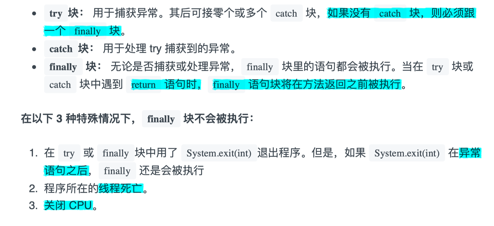


### 9.4 AQS（抽象队列同步器）

>  AQS主要利用硬件原语指令(CAS compare-and-swap)，来实现轻量级多线程同步机制，并且不会引起CPU上文切换和调度，同时提供内存可见性和原子化更新保证(线程安全的三要素：原子性、可见性、顺序性)。
>
>  AQS的本质上是一个同步器/阻塞锁的基础框架，其作用主要是提供加锁、释放锁，并在内部维护一个FIFO等待队列，用于存储由于锁竞争而阻塞的线程。
>
> AQS是一个通过内置的**FIFO**双向队列来完成线程的排队工作(内部通过结点head和tail记录队首和队尾元素，元素的结点类型为Node类型)。


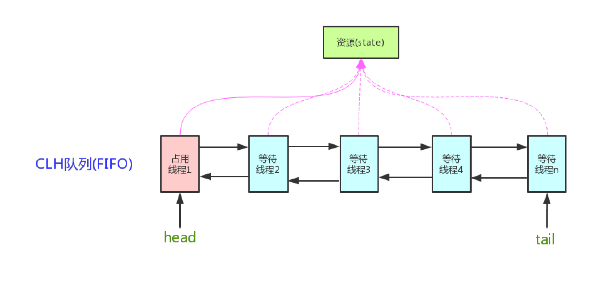

* CLH(Craig,Landin,and Hagersten)队列是⼀个虚拟的双向队列（虚拟的双向队列即不存在 队列实例，仅存在结点之间的关联关系）。AQS 是将每条请求共享资源的线程封装成⼀个 CLH 锁队列的⼀个结点（Node）来实现锁的分配。

**AQS的两种资源共享方式**

* Exclusive（独占）：只有⼀个线程能执⾏，如`ReentrantLock`：
	* 公平锁：按照线程在队列中的排队顺序，先到者先拿到锁 
	* ⾮公平锁：当线程要获取锁时，⽆视队列顺序直接去抢锁，谁抢到就是谁的
* Share（共享） 如`Semaphore/CountDownLatch`：多个线程可同时执⾏。


### 9.5 Log4j

* 在项目的classpath下或者resource下新建log4j.properties

	```properties
	#将等级为DEBUG的日志信息输出到console和file这两个目的地，console和file的定义在下面的代码
	log4j.rootLogger=DEBUG,console,file
	
	#控制台输出的相关设置
	log4j.appender.console = org.apache.log4j.ConsoleAppender
	log4j.appender.console.Target = System.out
	log4j.appender.console.Threshold=DEBUG											# 指定日志消息的输出最低层次。
	log4j.appender.console.layout = org.apache.log4j.PatternLayout
	log4j.appender.console.layout.ConversionPattern=[%]-%m%n
	
	#文件输出的相关设置
	log4j.appender.file = org.apache.log4j.RollingFileAppender
	log4j.appender.file.File=./log/komorebi.log
	log4j.appender.file.MaxFileSize=10mb
	log4j.appender.file.Threshold=DEBUG
	log4j.appender.file.layout=org.apache.log4j.PatternLayout
	log4j.appender.file.layout.ConversionPattern=[%p][%d{yy-MM-dd}][%c]%m%n
	
	#日志输出级别
	log4j.logger.org.mybatis=DEBUG
	log4j.logger.java.sql=DEBUG
	log4j.logger.java.sql.Statement=DEBUG
	log4j.logger.java.sql.ResultSet=DEBUG
	log4j.logger.java.sql.PreparedStatement=DEBUG
	```

* log4j中有三个重要组件：Logger、Appender和Layout

	* 允许存在多个Logger，名字大小写敏感，且具有继承关系。有一个称为Root，永远存在且不能通过名字检索或引用，可以通过Logger.getRootLogger()，其余Logger.getLogger
	* Appender则指明将所有的log信息存放到什么地方，支持console file gui等
	* Layout是控制Log信息的输出方式，格式化输出，有三种
		* HTMLLayout：格式化日志输出为HTML表格形式
		* SimpleLayout：打印三项内容：级别-信息
		* PatternLayout：根据指定的转换模式格式化日志输出

* 日志级别

	A：off     最高等级，用于关闭所有日志记录。
	B：fatal    指出每个严重的错误事件将会导致应用程序的退出。
	C：error   指出虽然发生错误事件，但仍然不影响系统的继续运行。
	D：warm   表明会出现潜在的错误情形。
	E：info     一般和在粗粒度级别上，强调应用程序的运行全程。
	F：debug   一般用于细粒度级别上，对调试应用程序非常有帮助。
	G：all      最低等级，用于打开所有日志记录。


### 9.6 lambda表达式

* lambda表达式实质上是一个**匿名方法**，但该方法并非独立执行，而是用于**实现由函数式接口定义的唯一抽象方法**

	* 函数式接口是仅含一个抽象方法的接口，可以指定Object定义的任何共有方法
	* 每个lambda表达式背后必定有一个函数式接口

* 使用lambda表达式时，会创建实现函数式接口的一个匿名类实例，可以将lambda表达式视为一个对象，将其作为参数传递

* 两种形式：

	* 包含单独表达式：parameters -> an expression;

		```java
		list.forEach(item -> System.out.println(item));
		```

	* 包含代码块：parameters -> {expressions};

		```java
		list.forEach(item -> {
			int numA = item.getNumA();
			int numB = item.getNumB();
			System.out.println(numsA + numB);
		});
		```


### 9.8 int和Integer的区别

1. Integer是int的包装类, int则是java的一种基本数据类型

2. Integer变量必须实例化后才能使用, 而int变量不需要

3. Integer实际是对象的引用, 当new一个Integer时, 实际上是生成一个指针指向此对象;而int则是直接存储数据值 。

4. Integer的默认值是null, int的默认值是0


### 9.9 指令重排

**指令重排以及happens-before原则**

​		java中有一个happens-before原则：

 		编译器、指令器可能对代码重排序，乱排，要守一定的规则，happens-before原则，只要符合happens-before的原则，那么就不能胡乱重排，如果不符合这些规则的话，那就可以自己排序

1、程序次序规则：一个线程内，按照代码顺序，书写在前面的操作先行发生于书写在后面的操作

2、锁定规则：一个unLock操作先行发 生于后面对同一个锁的lock操作，比如说在代码里有先对一个lock.lock（），lock.unlock（），lock.lock（）

3、volatile变量规则：对一个volatile变量的写操作先行发生于后面对这个volatile变量的读操作，volatile变量写，再是读，必须保证是先写，再读

4、传递规则：如果操作A先行发生于操作B，而操作B又先行发生于操作C，则可以得出操作A先行发生于操作C

5、线程启动规则：Thread对象的start（）方法先行发生于此线程的每个一个动作，thread.start（），thread.interrupt（），

6、线程中断规则：对线程interrupt（）方法的调用先行发生于被中断线程的代码检测到中断事件的发生

7、线程终结规则：线程中所有的操作都先行发生于线程的终止检测，我们可以通过Thread.join（）方法结束、Thread.isAlive（）的返回值手段检测到线程已经终止执行

8、对象终结规则：一个对象的初始化完成先行发生于他的finalizel（）方法的开始上面这8条原则的意思很显而易见，就是程序中的代码如果满足这个条件，就一定会按照这个规则来保证指令的顺序。

规则制定了在一些特殊情况下，不允许编译器、指令器对你写的代码进行指令重排，必须保证你的代码的有序性

