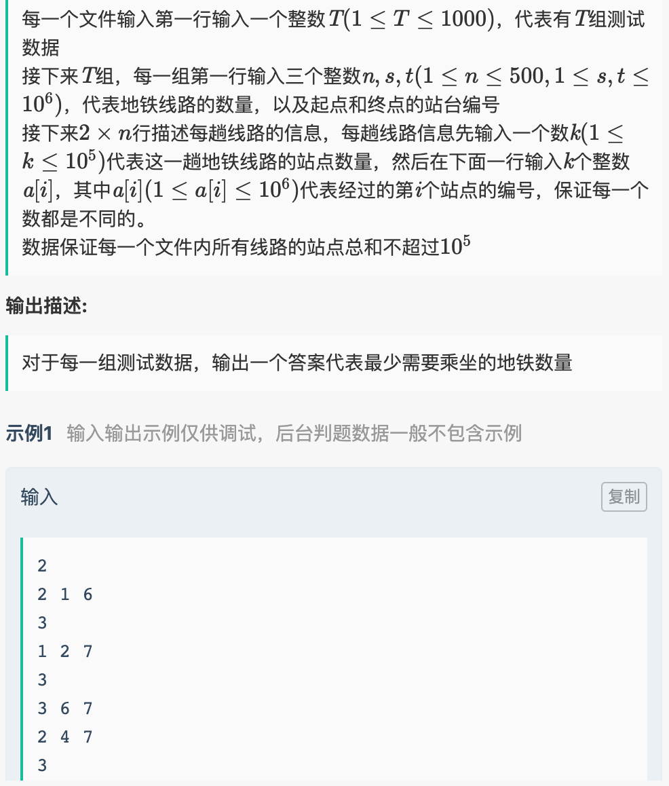

# 自我介绍

​		老师您好，我叫倪浩鹏。目前是南京邮电大学信号与信息处理专业的一名研究生。我应聘的岗位是Java研发工程师，我从三个角度谈一下自己的情况：

* 首先，在专业知识方面，我是在大学期间学习了Java语言和数据结构方面的课程，有一定的基础。另外我通过自学，目前能运用SSM、SpringBoot、SpringCloud框架进行一些java的后台开发，也对MySQL、Redis这两种数据库有一定了解。
	* 我的个人博客是我独立完成的，其中前端运用Semantic UI框架，后端运用SpringBoot开发，数据库使用MySQL。
	* 另外，我模仿过一套高并发场景下的电商秒杀系统，在实现数据库设计、密码MD5处理、JSR303参数校验等功能后，用JMeter作为压测工具，从页面优化、接口优化、安全优化三个角度提高系统的抗压能力。
* 其次，在工作经验方面，我之前在中科院自动化所实习过三个月。实习的岗位是算法工程师，其中我主要负责的项目是ECCV2020 AIM比赛中的图像补全赛道。
* 最后，在综合素质方面，我在大学期间担任过科协讲师，负责讲解一些编程语言基础，熟悉怎样与团队进行交流。

我的自我介绍完了，谢谢。


**AIM比赛**

​		我负责的是AIM比赛中的一个图像补全赛道，题目是对于存在缺陷的图像进行修复，数据集中所包含的缺陷有三种：块状丢失、斑状丢失和噪声类丢失。最主要的问题在于数据集中的部分图像太大，常规的深度学习模型因为显卡内存问题无法训练。并且，这部分如果对应的块状丢失，可能丢失的信息范围也很大，从边缘而言无法往内部学习到太多信息。

我们首先针对不同的缺陷类型：

​		对于斑状和噪声类丢失，我们是采取将图像切割，并将切割后的图像进行训练，在切割后的这部分修复完成后，拼接回原来的大小。同时，我们在另一条支线上将图像压缩成小图后，整体训练。最后将拼接后的图像经过这部分编码器，完成一个整体的色彩调整。

​		对于块状丢失，因为切割过后，可能存在一个部分是全白的，所以无法采取切割补全再拼接的方案，只能把图像进行一个压缩，分别压缩到500 200 100，在用不同的权重进行加权，合成最终的图像。


**华为**

​		任正非说：“华为公司有什么呢?连有限的资源都没有，但是我们的员工都很努力，拼命地创造资源。真正如国际歌所唱的，不要说我们一无所有，我们是明天的主人。‘从来就没有什么救世主，也不靠神仙皇帝，全靠我们自己’。

​		认为狼是企业学习的榜样，要向狼学习“狼性”，狼性永远不会过时。作为最重要的团队精神之一，华为的“狼性文化”可以用这样的几个词语来概括：学习，创新，获益，团结。用狼性文化来说，学习和创新代表敏锐的嗅觉，获益代表进攻精神，而团结就代表群体奋斗精神。


老师，我想知道，在你的部门中实习生会被培养什么技术栈？

老师，你觉得我在这场面试中有哪些需要提升的地方呢？

老师，你对于go这门语言的看法是什么？


> 给出一个字符串 s（仅含有小写英文字母和括号）。
>
> 请你按照从括号内到外的顺序，逐层反转每对匹配括号中的字符串，并返回最终的结果。
>
> 注意，您的结果中 不应 包含任何括号。

```java
class Solution {
    public String reverseParentheses(String s) {
        Stack<Character> stack = new Stack<>();
  		StringBuilder sb = new StringBuilder();
  		for (int i = 0; i < s.length(); i++) {
  	 		char tem = s.charAt(i);
   			if(tem == ')'){
    			StringBuilder temBuilder = new StringBuilder();
    			while (stack.peek() != '(') {
     				temBuilder.append(stack.pop());
    			}
    			stack.pop();
    			for (int j = 0; j < temBuilder.length() ; j++) {
     				stack.push(temBuilder.charAt(j));
    			}
   			}else {
    			stack.push(tem);
   			}
  		}
  
  		while (!stack.isEmpty()) {
   			sb.append(stack.pop());
  		}
  		return sb.reverse().toString();
    }
}
```

> 给定一个非负整数数组，你最初位于数组的第一个位置。
>
> 数组中的每个元素代表你在该位置可以跳跃的最大长度。
>
> 你的目标是使用最少的跳跃次数到达数组的最后一个位置。

```java
class Solution {
    public int jump(int[] nums) {
        int end = 0;
        int maxPosition = 0; 
        int steps = 0;
        for(int i = 0; i < nums.length - 1; i++){
            //找能跳的最远的
            maxPosition = Math.max(maxPosition, nums[i] + i); 
            if(i == end){ //遇到边界，就更新边界，并且步数加一
                end = maxPosition;
                steps++;
            }
        }
        return steps;
    }
}
```

> *你有一个 n x 3 的网格图 grid ，你需要用 红，黄，绿 三种颜色之一给每一个格子上色，且确保相邻格子颜色不同*
>
> *（也就是有相同水平边或者垂直边的格子颜色不同）。*

```java
class Solution {
    public int numOfWays(int n) {
        long dp2 = 6, dp3 = 6, mod = 1000000007;
        for(int i = 1; i < n; i++) {
            long temp2 = dp2;
            long temp3 = dp3;
            // 若当前使用 2 种颜色组成网格
            // 如果上一个网格是 2 种颜色，则当前网格有 3 种可能
            // 如果上一个网格是 3 种颜色，则当前网格有 2 种可能
            dp2 = (temp2 * 3 % mod + temp3 * 2 % mod) % mod;
            // 若当前使用 3 种颜色组成网格
            // 如果上一个网格是 2 种颜色，则当前网格有 2 种可能
            // 如果上一个网格是 3 种颜色，则当前网格有 2 种可能
            dp3 = (temp2 * 2 % mod + temp3 * 2 % mod) % mod;
        }
        return (int)((dp2 + dp3) % mod);
    }
}
```




**阿里CCO提前批一面（电话面34min，3.2）**

1. 自我介绍
2. 项目经历（侧重于消息队列，秒杀时的缓存问题，可惜这个项目还不够熟悉，好几次被问住）
3. HashMap底层
4. 线程池参数
5. 线程间通信方式
6. 聊了一些日常问题（很和蔼的小姐姐）

**阿里CCO提前批二面（电话面40min，3.4）**

1. 自我介绍
2. 面向对象三大特性（<u>实现多态的两种方式</u>）
3. 进程和线程区别
4. 线程创建方式，流程
5. 线程间通信方式
6. <u>死锁</u>
7. 乐观锁
8. 数据库索引（B+树和B树比较）
9. 平衡二叉树
10. BFS和DFS的细节
11. <u>事务的四个属性（就背出来ACID。。。）</u>
12. 项目经历（侧重于预减库存）
13. 反问（实习进度怎么查）

**阿里CCO一面（电话面31min，3.10）**

1. 自我介绍
2. 项目（秒杀超卖问题）
3. <u>秒杀的性能瓶颈在哪</u>，有什么提升手段
4. <u>常见的限流算法</u>
5. 数据库如何设计
6. <u>数据库设计的三大范式</u>
7. <u>聚集索引和非聚集索引的区别</u>
8. HashMap底层（Hash函数）
9. Redis过期策略
10. JVM内存模型
11. GC中新生代到老年代的过程
12. <u>MQ的消息模型</u>
13. <u>生产者重复投递问题怎么解决</u>
14. Spring IOC
15. Bean生命周期
16. @Autowired注解
17. SpringBoot自动装配
18. 反问


**阿里淘系一面（电话面40min，3.3）**

1. 自我介绍
2. 讲为啥从算法转开发
3. 项目经历（秒杀，简单聊聊，感觉面试官对于Spring不熟悉，就没怎么问）
4. 双亲委派机制
5. <u>==和equals的区别</u>
6. 垃圾回收机制
7. <u>线程相关的函数</u>（连函数名都没听懂，不过肯定是我不会的。。后悔，最后反问的时候应该问下的，忘了）
8. HashMap底层
9. <u>TCP和UDP区别</u>
10. <u>红黑树和二叉树比优劣势</u>
11. <u>MySQL查询的流程</u>
12. Redis持久化
13. 反问环节（面试官提醒需要加强多线程方面的知识，说这点比较致命，秒懂！）


**腾讯云一面（电话面23min，3.8）**

1. 项目经历（秒杀，问超卖问题）
2. MySQL索引（<u>B+树能到几层</u>），和B树区别
3. Redis模式（主从复制）
4. Redis持久化
5. <u>RDB最后一次持久化后的数据可能丢失，为什么</u>
6. Redis八种数据格式
7. 分布式锁，死锁的产生情况，解决方案
8. 注解和反射（反射的定义、得到方式、创建方式）
9. 垃圾回收机制
10. 三次握手，四次挥手
11. 为什么挥手比握手多一次
12. TCP和UDP是7层架构的哪一层

