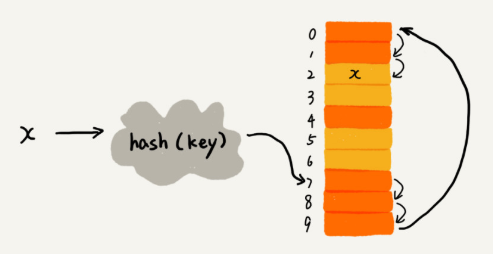
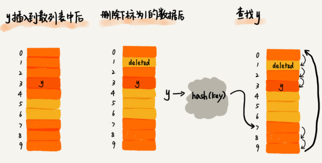
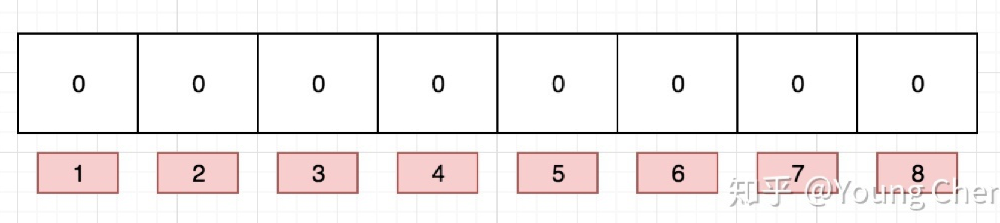
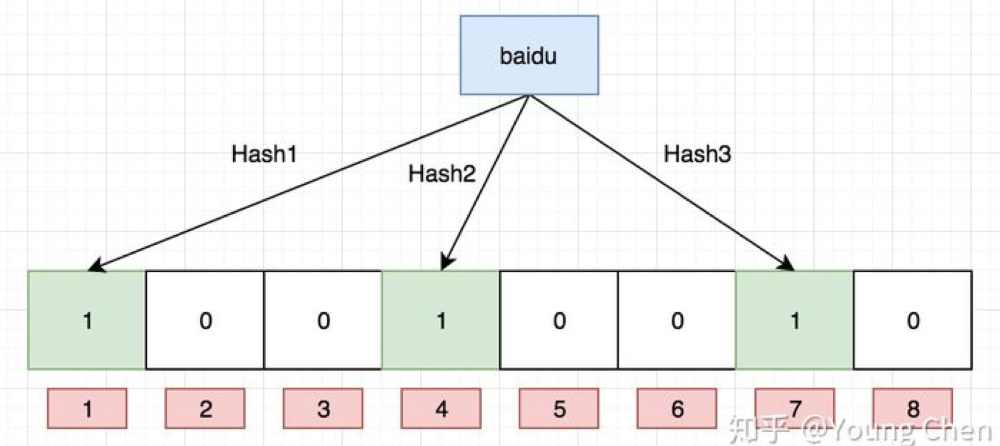
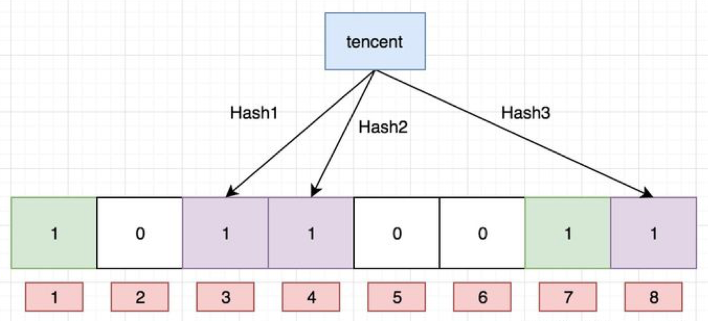

[TOC]

## 1 时间复杂度

原地：空间复杂度为$O(1)$

稳定：相等元素先后顺序不变

|    算法    | 时间复杂度 | 原地 | 稳定 |             说明              |
| :--------: | :--------: | :--: | :--: | :---------------------------: |
|    冒泡    |  $O(n^2)$  |  √   |  √   |   最好$O(n)$，最差$O(n^2)$    |
|    插入    |  $O(n^2)$  |  √   |  √   |   最好$O(n)$，最差$O(n^2)$    |
|    选择    |  $O(n^2)$  |  √   |  ×   |  最好$O(n^2)$，最差$O(n^2)$   |
|    归并    | $O(nlogn)$ |  ×   |  √   |                               |
|    快排    | $O(nlogn)$ |  √   |  ×   | 最好$O(nlogn)$，最差$O(n^2)$  |
|     桶     |   $O(n)$   |  ×   |  √   |                               |
|    计数    |   $O(n)$   |  ×   |  √   |                               |
|    基数    |   $O(n)$   |  ×   |  √   |                               |
|    跳表    | $O(logn)$  |      |      | 空间复杂度$O(n)$，插入$O(n)$  |
| 二叉查找树 | $O(nlogn)$ |      |      |                               |
|   红黑树   | $O(logn)$  |      |      | 插入、删除、查找都是$O(logn)$ |
|   堆排序   | $O(nlogn)$ |      |      |          建堆$O(n)$           |

## 2 散列冲突

解决方法：**开放寻址法**和**链表法**

**开放寻址法**

* **线性探测法**
	* **插入**数据：x经过hash函数后，被散列的位置已经有数据了，则按顺序往后一个一个找
		* 
	* **查找**数据：通过散列函数求出要查找元素对应的键值，比较数组中下标为散列值的元素和要查找的元素，若相等则最好，若不等，则按顺序往后依次查找。如果遍历到数组的**空闲位置**还没找到，就说明要查找的元素不在散列表中。
		* 
	* **删除**数据：将要删除的元素，标记为**deleted**。当线性探测查找的时候，遇到标记为deleted的空间，并不是停下来，而是继续往下探测。
		* 
* **二次探测法**：线性探测每次的步长为1，下标顺序每次加1，二测探测就是每次加上一个**平方数**
* **双重散列法**：简单说，就是用2个散列函数，若用第一个hash函数计算的存储位置已被使用，则使用第二个hash函数

## 3 红黑树与AVL树的定义，特点，以及二者区别

**平衡二叉树（AVL树）**：

* 平衡二叉树又称为AVL树，是一种特殊的二叉排序树。其左右子树都是平衡二叉树，且左右子树高度之差的绝对值不超过1。一句话表述为：以树中所有结点为根的树的左右子树高度之差的绝对值不超过1。将二叉树上结点的左子树深度减去右子树深度的值称为平衡因子BF，那么平衡二叉树上的所有结点的平衡因子只可能是-1、0和1。只要二叉树上有一个结点的平衡因子的绝对值大于1，则该二叉树就是不平衡的。

**红黑树**：

* 红黑树是一种二叉查找树，但在每个节点增加一个存储位表示节点的颜色，可以是红或黑（非红即黑）。通过对任何一条从根到叶子的路径上各个节点着色的方式的限制，红黑树确保没有一条路径会比其它路径长出两倍，因此，红黑树是一种弱平衡二叉树，相对于要求严格的AVL树来说，它的旋转次数少，**所以对于搜索，插入，删除操作较多的情况下，通常使用红黑树**。
* **性质**：
	* 每个节点非红即黑
	* 根节点是黑的
	* 每个叶节点（叶节点即树尾端NULL指针或NULL节点）都是黑的
	* 如果一个节点是红色的，则它的子节点必须是黑色的
	* 对于任意节点而言，其到叶子点树NULL指针的每条路径都包含相同数目的黑节点

**两者区别**：

* AVL 树是高度平衡的，频繁的插入和删除，会引起频繁的rebalance，导致效率下降
* 红黑树不是高度平衡的，算是一种折中，插入最多两次旋转，删除最多三次旋转

## 4 哈夫曼编码

哈夫曼编码是哈夫曼树的一种应用，广泛用于数据文件压缩。哈夫曼编码算法用字符在文件中出现的频率来建立使用0，1表示个字符的最优表示方式，其具体算法如下：

* 哈夫曼算法以自底向上的方式构造表示最优前缀码的二叉树T。
* 算法以|C|个叶结点开始，执行|C|－1次的“合并”运算后产生最终所要求的树T。
* 假设编码字符集中每一字符c的频率是f(c)。以f为键值的优先队列Q用在贪心选择时有效地确定算法当前要合并的2棵具有最小频率的树。一旦2棵具有最小频率的树合并后，产生一棵新的树，其频率为合并的2棵树的频率之和，并将新树插入优先队列Q。经过n－1次的合并后，优先队列中只剩下一棵树，即所要求的树T。

## 5 B树和B+树

**B树**：

一个m阶的B树具有如下几个**特征**：

* B树中所有结点的孩子结点最大值称为B树的阶，通常用m表示。
* 一个结点有k个孩子时，必有k-1个关键字才能将子树中所有关键字划分为k个子集。
* 根结点至少有两个子女。
* 每个中间节点都包含k-1个元素和k个孩子，其中 ceil（m/2） ≤ k ≤ m
* 所有的叶子结点都位于同一层
* 每个节点中的元素从小到大排列，节点当中k-1个元素正好是k个孩子包含的元素的值域划分

* 注意：
	* B树主要用于文件系统以及部分数据库索引，例如： MongoDB。而大部分关系数据库则使用B+树做索引，例如：mysql数据库；
	* 从查找效率考虑一般要求B树的阶数m >= 3;
	* B-树上算法的执行时间主要由读、写磁盘的次数来决定，故一次I/O操作应读写尽可能多的信息。因此B-树的结点规模一般以一个磁盘页为单位。一个结点包含的关键字及其孩子个数取决于磁盘页的大小。

**B+树**：

一个m阶的B+树具有如下几个特征：

* 有k个子树的中间节点包含有k个元素（B树中是k-1个元素），每个元素不保存数据，只用来索引，所有数据都保存在叶子节点。
* 所有的叶子结点中包含了全部元素的信息，及指向含这些元素记录的指针，且叶子结点本身依关键字的大小自小而大顺序链接。
* 所有的中间节点元素都同时存在于叶子节点，在子叶节点元素中是最大（或最小）元素。
* B+树通常有两个指针，一个指向根结点，另一个指向关键字最小的叶子结点。因些，对于B+树进行查找两种运算：一种是从最小关键字起顺序查找，另一种是从根结点开始，进行随机查找。

* **查找优势**：
	* 首先，Ｂ＋树的查找和Ｂ树一样，类似于二叉查找树。起始于根节点，自顶向下遍历树，选择其分离值在要查找值的一边的子指针。在节点内部典型的使用是二分查找来确定这个位置
	* 不同的是，Ｂ＋树中间节点没有卫星数据（索引元素所指向的数据记录），只有索引，而Ｂ树每个结点中的每个关键字都有卫星数据；这就意味着同样的大小的磁盘页可以容纳更多节点元素，在相同的数据量下，Ｂ＋树更加“矮胖”，ＩＯ操作更少
	* 在数据库的聚集索引（Clustered Index）中，叶子节点直接包含卫星数据。在非聚集索引（NonClustered Index）中，叶子节点带有指向卫星数据的指针
	* 其次，因为卫星数据的不同，导致查询过程也不同；Ｂ树的查找只需找到匹配元素即可，最好情况下查找到根节点，最坏情况下查找到叶子结点，所说性能很不稳定，而Ｂ＋树每次必须查找到叶子结点，性能稳定
	* B树的范围查找需要不断依赖中序遍历。首先二分查找到范围下限，在不断通过中序遍历，直到查找到范围的上限即可。整个过程比较耗时。而B+树的范围查找则简单了许多。首先通过二分查找，找到范围下限，然后同过叶子结点的链表顺序遍历，直至找到上限即可，整个过程简单许多，效率也比较高。

**B+树相比B树的优势总结**：

* 单一节点存储更多的元素，使得查询的IO次数更少
* 所有查询都要查找到叶子节点，查询性能稳定
* 所有叶子节点形成有序链表，便于范围查询

## 6 哈希表

**哈希表的原理**：

* 哈希表（散列表），是根据关键码值进行直接访问的数据结构。哈希表通过将关键码值映射到表中的特定位置来访问记录，以加快查找速度。映射函数被称为散列函数，存放记录的数组被称为散列表。
* 哈希表把key值通过一个固定的哈希算法转换成一个整型数字，然后将该数字对数组长度取余，结果作为数组的下标，将值存到以该数字为下标的数字空间里。
* 哈希表的优点是处理数据的复杂度平均都是O(1)，效率很高。

**哈希表的实现主要包括两个方面**：

* 构造哈希
	* 除余法：选择适当的正整数p，令h(k)=k mod p。在这里p取较大素数比较好。此法容易实现，是最常用的方法。
	* 平方散列法：把除余法的除法转换成乘法和位移操作。index=(value\*value)>>28(左移变大，右移变小)
	* 数字选择法：如果关键字的位数较多，超过长整型范围无法直接运算，可以选其中数字分布较为均匀的若干位，所组成的值直接作为关键字或者作为函数值。
	* 斐波那契散列法：
* 处理哈希冲突
	* 开放地址法：一旦发生了冲突，就去寻找下一个空的散列地址，只要散列表足够大，空的散列地址总能找到，并将记录存入。当发生冲突时，调用以下函数，寻找下一个可行的位置。fi(key) = (f(key)+di) MOD m (di=1,2,3,……,m-1)
		* 线性探查：这种方法的特点是冲突发生时，顺序查看表中下一单元，直到找出一个空单元或查遍全表。删除操作是将状态标志位置delete置为1，但是数值并没有删除。
		* 二次探查：这种方法的特点是冲突发生时，在表的左右进行跳跃式探测，比较灵活。
		* 伪随机探测：具体实现时，应建立一个伪随机数发生器，（如i=(i+p) % m），生成一个位随机序列，并给定一个随机数做起点，每次去加上这个伪随机数++就可以了。
	* 再哈希法：就是设置多个哈希函数，当发生冲突时，调用其他哈希函数。
	* 链地址法：基本思想是每个哈希表节点都有一个next指针，多个哈希表节点可以用next指针构成一个单向链表，被分配到同一个索引上的多个节点可以用这个单向 链表连接起来。
		* 每个位桶实现的时候，采用链表或者树的数据结构来去存取发生哈希冲突的输入域的关键字，也就是被哈希函数映射到同一个位桶上的关键字。
	* 建立公共溢出区：基本思想是将哈希表分为基本表和溢出表两部分，凡是和基本表发生冲突的元素，一律填入溢出表

## 7 栈

**栈溢出**

* 概念：栈溢出指的是程序向栈中某个变量中写入的字节数超过了这个变量本身所申请的字节数，因而导致栈中与其相邻的变量的值被改变。
* 原因：
	* 局部数组过大。当函数内部的数组过大时，有可能导致堆栈溢出。局部变量是存储在栈中的，因此这个很好理解。解决这类问题的办法有两个，一是增大栈空间,二是改用动态分配，使用堆（heap）而不是栈（stack）
	* 递归调用层次太多。递归函数在运行时会执行压栈操作，当压栈次数太多时，也会导致堆栈溢出
	* 指针或数组越界。这种情况最常见，例如进行字符串拷贝，或处理用户输入等等

**栈和堆的区别，以及为什么栈要快**

* 区别：
	* 堆是由低地址向高地址扩展；栈是由高地址向低地址扩展
	* 堆中的内存需要手动申请和手动释放；栈中内存是由OS自动申请和自动释放，存放着参数、局部变量等内存
	* 堆中频繁调用malloc\new和free\delete,会产生内存碎片，降低程序效率；而栈由于其先进后出的特性，不会产生内存碎片
	* 堆的分配效率较低，而栈的分配效率较高
* 栈效率高的原因：
	* 栈是操作系统提供的数据结构，计算机底层对栈提供了一系列支持：分配专门的寄存器存储栈的地址，压栈和入栈有专门的指令执行；
	* 而堆是由C/C++函数库提供的，机制复杂，需要一些列分配内存、合并内存和释放内存的算法，因此效率较低。

## 8 海量数据处理

**分而治之(Hash映射) + Hash_map统计 + 堆/快速/归并排序**

> 有一个1G大小的一个文件，里面每一行是一个词，词的大小不超过16字节，内存限制大小是 1M。返回频数最高的100个词。

1. 分而治之(hash映射)：顺序读文件中，对于每个词x，取hash(x)%5000，然后按照 该值存到5000个小文件（记为x0,x1,...x4999）中。这样每个文件大概是200k左 右。如果其中的有的文件超过了1M大小，还可以按照类似的方法继续往下分，直 到分解得到的小文件的大小都不超过1M。

2. hash_map统计：对每个小文件，采用trie树/hash_map等统计每个文件中出现的 词以及相应的频率。

3. 堆/归并排序：取出出现频率最大的100个词（可以用含100个结点的最小堆）后， 再把100个词及相应的频率存入文件，这样又得到了5000个文件。最后就是把这 5000个文件进行归并（类似于归并排序）的过程了。

> 有10个文件，每个文件1G，每个文件的每一行存放的都是用户的query，每个文件的query 都可能重复。要求你按照query的频度排序。

1. hash映射：顺序读取10个文件，按照hash(query)%10的结果将query写入到另外 10个文件（记为a0,a1,..a9）中。这样新生成的文件每个的大小大约也1G（假设 hash函数是随机的）。

2. hash_map统计：找一台内存在2G左右的机器，依次对用hash_map(query, query_count)来统计每个query出现的次数。注：hash_map(query,query_count) 是用来统计每个query的出现次数，不是存储他们的值，出现一次，则count+1。

3. 堆/快速/归并排序：利用快速/堆/归并排序按照出现次数进行排序，将排序好的 query和对应的query_cout输出到文件中，这样得到了10个排好序的文件（记 为）。最后，对这10个文件进行归并排序（内排序与外排序相结合）。根据此方 案，这里有一份实现：https://github.com/ooooola/sortquery/blob/master/que rysort.py。

> 一个文本文件，大约有一万行，每行一个词，要求统计出其中最频繁出现的前10个词，请给 出思想，给出时间复杂度分析。

如果文件比较大，无法一次性读入内存，

1. 可以采用hash取模的方法，将大文件分解为多个小文件，
2. 对于单个小文件利用hash_map统计出每个小文件中10个最常出现的词，
3. 然后再进行归并处理，找出最终的10个最常出现的词。

**Bloom filter布隆过滤器**

> 给你A,B两个文件，各存放50亿条URL，每条URL占用64字节，内存限制是4G，让你找出A,B 文件共同的URL。如果是三个乃至n个文件呢？

​		根据这个问题我们来计算下内存的占用，4G=2^32大概是40亿*8大概是340亿，n=50 亿，如果按出错率0.01算需要的大概是650亿个bit。现在可用的是340亿，相差并不 多，这样可能会使出错率上升些。另外如果这些urlip是一一对应的，就可以转换成ip， 则大大简单了。

​		同时，上题：给定a、b两个文件，各存放50亿个url，每个url各占64字节，内存限制是 4G，让你找出a、b文件共同的url？如果允许有一定的错误率，可以使用Bloom filter， 4G内存大概可以表示340亿bit。将其中一个文件中的url使用Bloom filter映射为这340 亿bit，然后挨个读取另外一个文件的url，检查是否与Bloom filter，如果是，那么该url 应该是共同的url（注意会有一定的错误率）。

**Bitmap 位图**

> 在2.5亿个整数中找出不重复的整数，注，内存不足以容纳这2.5亿个整数

​		采用2-Bitmap（每个数分配2bit，00表示不存在，01表示出现一次，10表示多次，11 无意义）进行，共需内存2^32 * 2 bit=1 GB内存，还可以接受。然后扫描这2.5亿个整 数，查看Bitmap中相对应位，如果是00变01，01变10，10保持不变。所描完事后，查 看bitmap，把对应位是01的整数输出即可。

> 给40亿个不重复的unsigned int的整数，没排过序的，然后再给一个数，如何快速判断这个 数是否在那40亿个数当中？

​		用Bitmap的方法，申请512M的内存，一个bit位代表一个unsigned int值。读入40亿个 数，设置相应的bit位，读入要查询的数，查看相应bit位是否为1，为1表示存在，为0表 示不存在。

## 9 布隆过滤器

> 本质上布隆过滤器是一种数据结构，比较巧妙的概率型数据结构（probabilistic data structure），特点是高效地插入和查询，可以用来告诉你 “某样东西一定不存在或者可能存在”。 
>
> 相比于传统的 List、Set、Map 等数据结构，它更高效、占用空间更少，但是缺点是其返回的结果 是概率性的，而不是确切的。

* 布隆过滤器是一个 bit 向量或者说 bit 数组
	

* 要映射一个值到布隆过滤器中，我们需要使用多个不同的哈希函数生成多个哈希值，并对每个 生成的哈希值指向的 bit 位置 1，例如针对值 “baidu” 和三个不同的哈希函数分别生成了哈希 值 1、4、7，则上图转变为：
	

* 现在再存一个值 “tencent”，如果哈希函数返回 3、4、8 的话
	

* 值得注意的是，4 这个 bit 位由于两个值的哈希函数都返回了这个 bit 位，因此它被覆盖了。 现在我们如果想查询 “dianping” 这个值是否存在，哈希函数返回了 1、5、8三个值，结果我 们发现 5 这个 bit 位上的值为 0，说明没有任何一个值映射到这个 bit 位上，因此我们可以很 确定地说 “dianping” 这个值不存在。而当我们需要查询 “baidu” 这个值是否存在的话，那么 哈希函数必然会返回 1、4、7，然后我们检查发现这三个 bit 位上的值均为 1，那么我们可以 说 “baidu” 存在了么？答案是不可以，只能是 “baidu” 这个值可能存在。

	