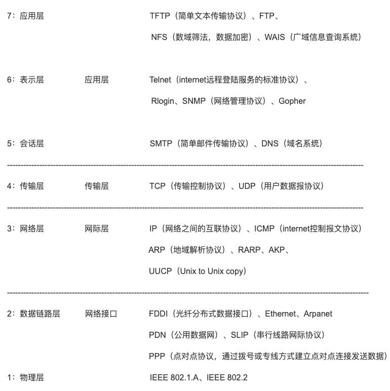
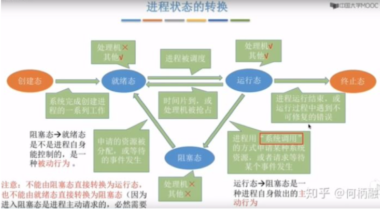
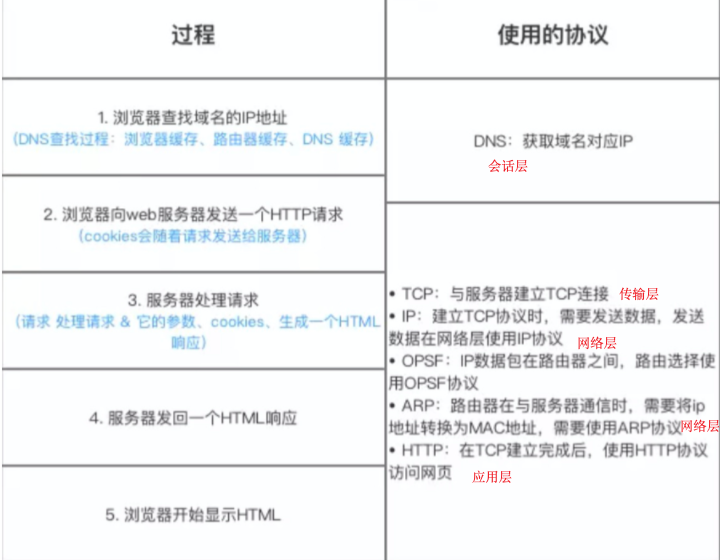
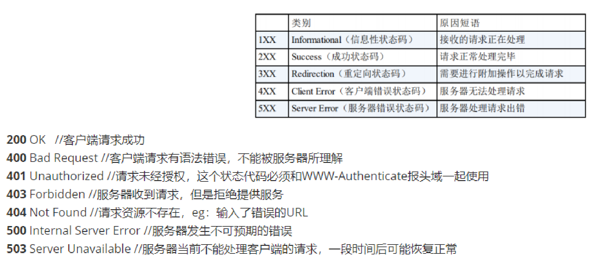

[TOC]

### 1 三次握手，四次挥手

> * 序列号seq：占4个字节，用来标记数据段的顺序，TCP把连接中发送的所有数据字节都编上一个序号，第一个字节的编号由本地随机产生；给字节编上序号后，就给每一个报文段指派一个序号；序列号seq就是这个报文段中的第一个字节的数据编号。
> * 确认号ack：占4个字节，期待收到对方下一个报文段的第一个数据字节的序号；序列号表示报文段携带数据的第一个字节的编号；而确认号指的是期望接收到下一个字节的编号；因此当前报文段最后一个字节的编号+1即为确认号。
> * 确认ACK：占1位，仅当ACK=1时，确认号字段才有效。ACK=0时，确认号无效
> * 同步SYN：连接建立时用于同步序号。当SYN=1，ACK=0时表示：这是一个连接请求报文段。若同意连接，则在响应报文段中使得SYN=1，ACK=1。因此，SYN=1表示这是一个连接请求，或连接接受报文。SYN这个标志位只有在TCP建产连接时才会被置1，握手完成后SYN标志位被置0。
> * 终止FIN：用来释放一个连接。FIN=1表示：此报文段的发送方的数据已经发送完毕，并要求释放运输连接
>
>   PS：ACK、SYN和FIN这些大写的单词表示标志位，其值要么是1，要么是0；ack、seq小写的单词表示序号。

#### 1.1 三次握手

客户端和服务端通信前要进行连接，“3次握手”的作用就是**双方都能明确自己和对方的收、发能力是正常的**。

* `第一次握手`：客户端给服务端发一个 SYN 报文，并指明客户端的初始化序列号 ISN(seq = x)。此时客户端处于 **SYN_SEND** 状态。
            此时SYN 报文：SYN=1、ACK=0
	
* `第二次握手`：服务器收到客户端的 SYN 报文之后，会以自己的 SYN 报文作为应答，并且也是指定了自己的初始化序列号 ISN(s)。同时会把客户端的 ISN + 1 作为ACK 的值，表示自己已经收到了客户端的 SYN，此时服务器处于 **SYN_RCVD** 的状态。

	​		在确认报文段中：SYN=1，ACK=1，确认号ack=x+1，初始序号seq=y。

* `第三次握手`：客户端收到 SYN 报文之后，会发送一个 ACK 报文，当然，也是一样把服务器的 ISN + 1 作为 ACK 的值，表示已经收到了服务端的 SYN 报文，此时客户端处于 **ESTABLISHED** 状态。服务器收到 ACK 报文之后，也处于 **ESTABLISHED** 状态，此时，双方已建立起了连接。
			           确认报文段：ACK=1，确认号ack=y+1，序号seq=x+1（初始为seq=x，第二个报文段所以要+1），ACK报文段可以携带数据，不携带数据则不消耗序号。

**常见问题**

1. **SYN_RCVD出现在哪，什么意思？**
			SYN_RCVD是TCP三次握手的中间状态，是服务端口（监听端口，如应用服务器的80端口）**收到SYN包并发送[SYN，ACK]包后所处的状态**。这时如果再收到ACK的包，就完成了三次握手，建立起TCP连接。
2. **当服务器上出现大量的SYN_RCVD，可能是哪些情况？**
	* 一种是对方（请求方或客户端）没有收到服务器发送的[SYN,ACK]包
				这种情况一般是由于网络结构或安全规则限制导致(SYN,ACK)包无法发送到对方，这种情况比较容易判断：只要在服务器上能够ping通互联网的任意主机，基本可以排除这种情况。
	* 另一种可能是对方收到了[SYN,ACK]包却没有ACK。这种情况还有两种可能：
		* 一种情况是对方根本就不打算ACK，一般在对方程序有意为之才会出现，如 SYN Flood类型的 DOS/DDOS 攻击；
		* 另一种可能是对方收到的[SYN,ACK]包不合法，常见的是SYN包的目的地址（服务地址）和应答[SYN,ACK]包的源地址不同。这种情况在只配置了DNAT而不进行SNAT的服务网络环境下容易出现，主要是由于inbound（SYN包）和outbound（[SYN,ACK]包）的包**穿越 了不同的网关/防火墙/负载均衡器**，从而**导致[SYN,ACK]路由到互联网的源地址（一般是防火墙的出口地址）与SYN包的目的地址（服务的虚拟IP) 不同**，这时客户机无法将SYN包和[SYN,ACK]包关联在一起，从而会认为已发出的SYN包还没有被应答，于是继续等待应答包。这样服务器端的连接一 直保持在SYN_RCVD状态（半开连接）直到超时。
3. **服务端为什么要传回SYN？**
	* 接收端传回发送端所发送的 SYN 是为了告诉发送端，我接收到的信息确实就是你所发送的信号了。
	* SYN 是 TCP/IP 建⽴连接时使⽤的握⼿信号。在客户机和服务器之间建⽴正常的 TCP ⽹络连接时，客户机⾸先发出⼀个 SYN 消息，服务器使⽤ SYN-ACK 应答表示接收到了这个消息，最后客户机再以ACK(Acknowledgement)消息响应。这样在客户机和服务器之间才能建⽴起可靠的TCP连接，数据才可以在客户机和服务器之间传递。
4. **传了SYN为什么还要传ACK？**
	       双方通信无误必须是两者互相发送信息都无误。传了SYN，证明发送方到接收方的通道没有问题，但是接收方到发送方的通道还需要 ACK 信号来进行验证。
5. **什么是SYN Flooding？如何避免？**
	* 三次握手过程中，服务器发送SYN-ACK后，在收到客户端的ACK之前的TCP连接叫做“**半连接**”。只有收到客户端的ACK后服务器才能转入ESTABLISHED。
	* SYN攻击：短时间伪造大量不存在的IP，向服务器不断发送SYN包，于是服务器不断回复SYN-ACK确认包，但是又没有响应，只能一直重发直至超时，这样的话就占掉了很多有用的SYN包，导致系统运行缓慢或者网络堵塞，系统瘫痪
	* 避免方法：SYN cookie，在收到Syn包时，不放入半连接队列里，而是根据Syn包计算出一个cookie值(hash值)。这个cookie值作为Sync+Ack包的初始序列号回给Client。避免半连接队列溢出。
6. **为什么不能用两次握手进行连接？**
    * 3次握手完成两个重要的功能，既要双方做好发送数据的准备工作(双方都知道彼此已准备好)，也要允许双方就初始序列号进行协商，这个序列号在握手过程中被发送和确认。
    * 现在把三次握手改成仅需要两次握手，死锁是可能发生的。作为例子，考虑计算机S和C之间的通信，假定C给S发送一个连接请求分组，S收到了这个分组，并发 送了确认应答分组。按照两次握手的协定，S认为连接已经成功地建立了，可以开始发送数据分组。可是，C在S的应答分组在传输中被丢失的情况下，将不知道S 是否已准备好，不知道S建立什么样的序列号，C甚至怀疑S是否收到自己的连接请求分组。在这种情况下，C认为连接还未建立成功，将忽略S发来的任何数据分 组，只等待连接确认应答分组。而S在发出的分组超时后，重复发送同样的分组。这样就形成了死锁。

#### 1.2 四次挥手

​		由于TCP连接是全双工的，因此每个方向都必须单独进行关闭。这原则是当一方完成它的数据发送任务后就能发送一个FIN来终止这个方向的连接。收到一个 FIN只意味着这一方向上没有数据流动，一个TCP连接在收到一个FIN后仍能发送数据。首先进行关闭的一方将执行主动关闭，而另一方执行被动关闭。

`第一次挥手`：

（1） 客户端进程发出连接释放报文，并且停止发送数据。释放数据报文首部，FIN=1，其序列号为seq=u（等于前面已经传送过来的数据的最后一个字节的序号加1），此时，客户端进入**FIN-WAIT-1**（终止等待1）状态。 TCP规定，FIN报文段即使不携带数据，也要消耗一个序号。

`第二次挥手`：

（2） 服务器收到连接释放报文，发出确认报文，ACK=1，ack=u+1，并且带上自己的序列号seq=v，此时，服务端就进入了**CLOSE-WAIT**（关闭等待）状态。TCP服务器通知高层的应用进程，客户端向服务器的方向就释放了，这时候处于半关闭状态，即客户端已经没有数据要发送了，但是服务器若发送数据，客户端依然要接受。这个状态还要持续一段时间，也就是整个CLOSE-WAIT状态持续的时间。

（3）客户端收到服务器的确认请求后，此时，客户端就进入**FIN-WAIT-2**（终止等待2）状态，等待服务器发送连接释放报文（在这之前还需要接受服务器发送的最后的数据）。

`第三次挥手`：

（4） 服务器将最后的数据发送完毕后，就向客户端发送连接释放报文，FIN=1，ack=u+1，由于在半关闭状态，服务器很可能又发送了一些数据，假定此时的序列号为seq=w，此时，服务器就进入了**LAST-ACK**（最后确认）状态，等待客户端的确认。

`第四次挥手`：

（5）客户端收到服务器的连接释放报文后，必须发出确认，ACK=1，ack=w+1，而自己的序列号是seq=u+1，此时，客户端就进入了**TIME-WAIT**（时间等待）状态。注意此时TCP连接还没有释放，必须经过2MSL（最长报文段寿命）的时间后，当客户端撤销相应的TCB后，才进入**CLOSED**状态。

（6）服务器只要收到了客户端发出的确认，立即进入**CLOSED**状态。同样，撤销TCB后，就结束了这次的TCP连接。可以看到，服务器结束TCP连接的时间要比客户端早一些。

**常见问题**：

1. **TIME_WAIT和CLOSE_WAIT**
	* TIME_WAIT 是主动关闭链接时形成的，等待2MSL时间。主要是防止最后一个ACK丢失。  由于TIME_WAIT 的时间会非常长，因此服务端应尽量减少主动关闭连接
	* CLOSE_WAIT是被动关闭连接是形成的。根据TCP状态机，服务器端收到客户端发送的FIN，则按照TCP实现发送ACK，因此进入CLOSE_WAIT状态。但如果服务器端不执行close()，就不能由CLOSE_WAIT迁移到LAST_ACK，则系统中会存在很多CLOSE_WAIT状态的连接。此时，可能是系统忙于处理读、写操作，而未将已收到FIN的连接，进行close。此时，recv/read已收到FIN的连接socket，会返回0。
2. **为什么 TIME_WAIT 状态需要保持 2MSL 这么长的时间？**
    * 第一，**保证客户端发送的最后一个ACK报文能够到达服务器，因为这个ACK报文可能丢失**，站在服务器的角度看来，我已经发送了FIN+ACK报文请求断开了，客户端还没有给我回应，应该是我发送的请求断开报文它没有收到，于是服务器又会重新发送一次，而客户端就能在这个2MSL时间段内收到这个重传的报文，接着给出回应报文，并且会重启2MSL计时器。
    * 第二，防止类似于“已经失效的连接请求报文段”出现在本连接中。客户端发送完最后一个确认报文后，**在这个2MSL时间中，就可以使本连接持续的时间内所产生的所有报文段都从网络中消失**。这样新的连接中不会出现旧连接的请求报文。
3. **挥手多一次的原因?**
    * 因为当Server端收到Client端的SYN连接请求报文后，可以直接发送SYN+ACK报文。其中ACK报文是用来应答的，SYN报文是用来同步的。但是关闭连接时，当Server端收到FIN报文时，很可能并不会立即关闭SOCKET，所以只能先回复一个ACK报文，告诉Client端，"你发的FIN报文我收到了"。只有等到我Server端所有的报文都发送完了，我才能发送FIN报文，因此不能一起发送。故需要四步握手。

4. **出现大量close_wait的现象？**
	* 应用程序问题：如果在应用程序中忘记了 close 相应的TCP连接，那么Y也就不会发出 FIN 包，进而导致 CLOSE_WAIT ；
	
	* 应用程序响应太慢：应用程序不能及时响应client的关闭请求也会导致CLOSE_WAIT状态的堆积。
	
	* Accept backlog太大：Accept 的 backlog太大，设想突然遭遇大访问量的话，即便响应速度不慢，也可能出现来不及消费的情况，导致多余的请求还在队列里就被对方关闭了

5. **如果已建立连接，但客户端突然故障，怎么办？**
	* TCP还设有一个保活计时器，显然，客户端如果出现故障，服务器不能一直等下去，白白浪费资源。服务器每收到一次客户端的请求后都会重新复位这个计时器，时间通常是设置为2小时，若两小时还没有收到客户端的任何数据，服务器就会发送一个探测报文段，以后每隔75秒发送一次。若一连发送10个探测报文仍然没反应，服务器就认为客户端出了故障，接着就关闭连接。

### 2 TCP和UDP

#### 2.1 对比

|          |                             TCP                              |                             UDP                              |
| :------: | :----------------------------------------------------------: | :----------------------------------------------------------: |
|   优点   | 可靠，稳定 TCP的可靠体现在TCP在传递数据之前，会有三次握手来建立连接，而且在数据传递时，有确认、窗口、重传、拥塞控制机制，在数据传完后，还会断开连接用来节约系统资源 | 快，比TCP稍安全 UDP没有TCP的握手、确认、窗口、重传、拥塞控制等机制，UDP是一个无状态的传输协议，所以它在传递数据时非常快。没有TCP的这些机制，UDP较TCP被攻击者利用的漏洞就要少一些。但UDP也是无法避免攻击的，比如：UDP Flood攻击…… |
|   缺点   | 慢，效率低，占用系统资源高，易被攻击 TCP在传递数据之前，要先建连接，这会消耗时间，而且在数据传递时，确认机制、重传机制、拥塞控制机制等都会消耗大量的时间，而且要在每台设备上维护所有的传输连接，事实上，每个连接都会占用系统的CPU、内存等硬件资源。 而且，因为TCP有确认机制、三次握手机制，这些也导致TCP容易被人利用，实现DOS、DDOS、CC等攻击。 | 不可靠，不稳定 因为UDP没有TCP那些可靠的机制，在数据传递时，如果网络质量不好，就会很容易丢包。 |
| 应用场景 | 当对网络通讯质量有要求的时候，比如：整个数据要准确无误的传递给对方，这往往用于一些要求可靠的应用，比如HTTP、HTTPS、FTP等传输文件的协议，POP、SMTP等邮件传输的协议。 在日常生活中，常见使用TCP协议的应用如下： 浏览器，用的HTTP FlashFXP，用的FTP Outlook，用的POP、SMTP Putty，用的Telnet、SSH QQ文件传输 | 当对网络通讯质量要求不高的时候，要求网络通讯速度能尽量的快，这时就可以使用UDP。 比如，日常生活中，常见使用UDP协议的应用如下： QQ语音 QQ视频 |

**小结TCP与UDP的区别：**

1. 基于连接与无连接；
2. 对系统资源的要求（TCP较多，UDP少）；
3. UDP程序结构较简单；

4. 流模式与数据报模式 ；

5. TCP保证数据正确性，UDP可能丢包，TCP保证数据顺序，UDP不保证。

#### 2.2 TCP可靠传输

1. 应⽤数据被分割成 TCP 认为最适合发送的数据块。
2. TCP 给发送的每⼀个包进⾏编号，接收⽅对数据包进⾏排序，把有序数据传送给应⽤层。
3. **校验和**： TCP 将保持它⾸部和数据的检验和。这是⼀个端到端的检验和，⽬的是检测数据在传输过程中的任何变化。如果收到段的检验和有差错，TCP 将丢弃这个报⽂段和不确认收 到此报⽂段。
4. TCP 的接收端会丢弃重复的数据。
5. **流量控制**： TCP 连接的每⼀⽅都有固定⼤⼩的缓冲空间，TCP的接收端只允许发送端发送接收端缓冲区能接纳的数据。当接收⽅来不及处理发送⽅的数据，能提示发送⽅降低发送的 速率，防⽌包丢失。TCP 使⽤的流量控制协议是可变⼤⼩的滑动窗⼝协议。 （TCP 利⽤滑 动窗⼝实现流量控制）
6. **拥塞控制**： 当⽹络拥塞时，减少数据的发送。
7. **ARQ协议**： 也是为了实现可靠传输的，它的基本原理就是每发完⼀个分组就停⽌发送，等待对⽅确认。在收到确认后再发下⼀个分组。
	1. ⾃动重传请求（Automatic Repeat-reQuest，ARQ）是OSI模型中数据链路层和传输层的错误纠正协议之⼀。它通过使⽤确认和超时这两个机制，在不可靠服务的基础上实现可靠的信息传输。 如果发送⽅在发送后⼀段时间之内没有收到确认帧，它通常会重新发送。ARQ包括停⽌等待ARQ协议和连续ARQ协议。
	1. 停止等待ARQ：每发完⼀个分组就停⽌发送，等待 对⽅确认（回复ACK）。如果过了⼀段时间（超时时间后），还是没有收到 ACK 确认，说 明没有发送成功，需要重新发送，直到收到确认后再发下⼀个分组
		2. 连续ARQ：发送⽅维持⼀个发送窗⼝，凡位于发送窗⼝内的分组可以连 续发送出去，⽽不需要等待对⽅确认。接收⽅⼀般采⽤累计确认，对按序到达的最后⼀个分组发 送确认，表明到这个分组为⽌的所有分组都已经正确收到了。
	
8. **超时重传**： 当 TCP 发出⼀个段后，它启动⼀个定时器，等待⽬的端确认收到这个报⽂段。 如果不能及时收到⼀个确认，将重发这个报⽂段。

#### 2.3 UDP可靠传输

UDP的可靠传输是在==应用层==实现的

1. 超时重传（定时器）
2. 有序接受 （添加包序号）将数据包进行编号，按照包的顺序接收并存储。
3. 应答确认 （Seq/Ack应答机制）
4. 滑动窗口流量控制等机制 （滑动窗口协议）

目前有如下的开源程序实现利用UDP实现了可靠的数据传输。分别为QUIC、RUDP、RTP、UDT

#### 2.4 TCP重传机制

​		发送端发了1,2,3,4,5一共五份数据，接收端收到了1，2，于是回ack 3，然后收到了4（注意此时3还没收到），此时的TCP会怎么办？我们要知道，因为正如前面所说的，**SeqNum和Ack是以字节数为单位，所以ack的时候，不能跳着确认，只能确认最大的连续收到的包**，不然，发送端就以为之前的都收到了。

​		超时重传的处理方式：接收端不再回ack（直到收到数据3），发送端死等ack 3，当发送端发现收不到3的ack超时后，会重传3。一旦接收端收到3后，会ack 回 4——意味着3收到了，期待下一个数据4。

​		但是，这种方式会有比较严重的问题，那就是因为要死等3，所以会导致4和5即便已经收到了，而发送端也完全不知道发生了什么事，因为没有收到Ack，所以，发送方可能会悲观地认为也丢了，所以有可能也会导致4和5的重传。

对此有两种选择：

- 一种是仅重传timeout的包。也就是第3份数据。
- 另一种是重传timeout后所有的数据，也就是第3，4，5这三份数据。

**快速重传：**不以时间驱动，而以数据驱动重传。接收端如果没有收到期望的数据，而收到后续乱序的包，也给客户端回复 ACK，只不过是重复的 ACk，回复相同的ACK三次以后触发快速重传。也就是说，如果，包没有连续到达，就ack最后那个可能被丢了的包，如果发送方连续收到3次相同的ack，就重传。

**SACK **：在快速重传的基础上，返回最近收到的报文段的序列号范围，这样客户端就知道，哪些数据包已经到达服务器了。

**Duplicate SACK **：重复 SACK，这个机制是在 SACK 的基础上，额外携带信息，告知发送方有哪些数据包自己重复接收了。DSACK 的目的是帮助发送方判断，是否发生了包失序、ACK 丢失、包重复或伪重传。让 TCP 可以更好的做网络流控。

#### 2.5 TCP拥塞控制

* **拥塞控制机制**：

	端到端拥塞控制：网络层没有为运输层拥塞控制提供显示支持

* **思想**：

	让每一个发送方根据所感应到的网络拥塞程度来限制其能向连接发送流量的数据

	* 没有拥塞时，增加发送速率
	* 感知到拥塞时，降低发送速率

* **为什么进行拥塞控制**

	如果发送端要给接收端发送数据，只有当接收端接收到数据时，才会给发送端返回应答信息。如果接收端没有发送应答信息，发送端则认为该数据已经丢失，则进行重新发送。

	产生原因：

	1. 数据包丢失
	2. 网络拥塞，数据包还没到达接收方

	我们的拥塞控制是主要针对于第二种情况的。如果网络信道中一直处于拥挤状态，那么发送端一直进行发送，就会变得更加的阻塞，而且同时白白浪费掉了网络的资源。

* **如何感知到拥塞**

	丢包事件

	* 超时
	* 收到来自接收方的3个冗余ACK

	当发生丢包事件，发送发认为出现了拥塞

* **如何进行拥塞控制**

	为了进行拥塞控制，TCP 发送方要维持⼀个 **拥塞窗口(cwnd)** 的状态变量。**拥塞控制窗口的大小取决于网络的拥塞程度，并且动态变化**。发送方让自己的发送窗口取为拥塞窗口和接收方的接受窗口中较小的⼀个。发送端中未被确认的数据量要小于拥塞窗口，因此拥塞窗口间接地限制了发送方的发送速率

* **四种拥塞控制算法**：**慢开始、拥塞避免、快重传和快速恢复算法**

	1. 慢开始：刚加入网络连接时，慢慢提速，不要一下拉满。

		即由小到大逐渐增大发送窗口，也就是由小到大逐渐增大拥塞窗口数值。

		cwnd初始值为1，每经过⼀个传播轮次，cwnd加倍。（==指数增长==）

	2. 拥塞避免：避免增长速度过快导致网络拥塞

		拥塞避免算法的思路是让拥塞窗口cwnd缓慢增大

		即每经过⼀个往返时间RTT就把发送放的cwnd加1（==常数增长==）

	3. 快重传与快速恢复算法：当出现“3个冗余ACK”时，说明网络还没那么糟，没必要像超时那样直接让cwnd=1MSS，也就是说没必要那么反应强烈。

		如果发送机接收到三个重复确认，它会假定确认件指出的数据段丢失了，并⽴即重传这些丢失的数据段。
		当有单独的数据包丢失时，快速重传和恢复能最有效地⼯作。

#### 2.6 TCP流量控制

* **为什么需要流量控制**

	双方在通信的时候，发送方的速率与接收方的速率是不一定相等，如果发送方的发送速率太快，会导致接收方处理不过来，这时候接收方只能把处理不过来的数据存在缓存区里（失序的数据包也会被存放在缓存区里）。

	如果缓存区满了发送方还在疯狂着发送数据，接收方只能把收到的数据包丢掉，大量的丢包会极大着浪费网络资源，因此，我们需要**控制发送方的发送速率**，让接收方与发送方处于一种动态平衡才好。

* **定义**：对发送方发送速率的控制，我们称之为流量控制。

* **如何控制**：**滑动窗口**

	- TCP通信双方各自都有一个**发送窗口和接收窗口**
	- 发送窗口的大小是由对方接收窗口来决定的，接收窗口用于给对方一个指示（表示自己还有多少可用的缓存空间来接收数据）

	基于滑动窗口的流量控制大致**流程**为：

	* 接收端在接收到数据之后会给发送端发送一个ACK（TCP报文），ACK的IP头部中有一个窗口大小字段（见下图的IP头部图），这个大小字段表明接收端自己可用的缓冲大小
	* 当发送端接收到接收端的ACK之后会获取IP头部中的窗口大小，从而知道接收端的数据缓冲区大小
	* 之后发送数据使就会受到这个缓冲区大小的限制

### 3 OSI七层模型

* **应用层**

	应⽤层(application-layer）的任务是通过应⽤进程间的交互来完成特定网络应用。应⽤层协议定 义的是应⽤进程（进程：主机中正在运行的程序）间的通信和交互的规则。对于不同的⽹络应⽤ 需要不同的应⽤层协议。==HTTP DNS SMTP==

* **传输层**

  运输层(transport layer)的主要任务就是负责向两台主机进程之间的通信提供通⽤的数据传输服 务。应⽤进程利⽤该服务传送应⽤层报文。“通⽤的”是指并不针对某⼀个特定的⽹络应⽤，⽽是 多种应⽤可以使⽤同⼀个运输层服务。 ==TCP UDP==

  * TCP：面向连接的，可靠的数据传输服务
  * UDP：无连接的，尽最大努力的数据传输服务（不保证可靠性）
  * socket就是在传输层里把tcp/ip协议给封装了一下

* **网络层**

  在计算机网络中进行通信的两个计算机之间可能会经过很多个数据链路，也可能还要经过很多通信子网。网络层的任务就是选择合适的网间路由和交换结点，确保数据及时传送。 在发送数据时，网络层把运输层产⽣的报文段或用户数据报封装成分组和包进行传送。==IP==

  * 一个子网内的机器之间通信，就是在数据包里写上对方的mac地址，然后交换机广播出去ok了；
  * 但是如果是跨子网的通信，就是写上对方的ip地址，然后先通过mac地址广播到路由器，让路由器再根据另外一个子网的ip地址转换为mac地址，通过另外一个子网的交换机广播过去

* **数据链路层**

	数据链路层(data link layer)通常简称为链路层。两台主机之间的数据传输，总是在⼀段⼀段的链 路上传送的，这就需要使用专门的链路层的协议。 在两个相邻节点之间传送数据时，数据链路层 将网络层交下来的 IP 数据报组装成帧，在两个相邻节点间的链路上传送帧。每⼀帧包括数据和 必要的控制信息（如同步信息，地址信息，差错控制等）。

* **物理层**

	物理层(physical layer)的作⽤是实现相邻计算机节点之间比特流的透明传送，尽可能屏蔽掉具 体传输介质和物理设备的差异。 使其上⾯的数据链路层不必考虑网络的具体传输介质是什么。“透明传送比特流”表示经实际电路传送后的比特流没有发生变化，对传送的比特流来说，这个电路好像是看不见的，负责传输0和1 的电路信号。

### 4 线程和进程

> 进程：
>
> * 程序由指令和数据组成，但这些指令要运行，数据要读写，就必须将指令加载至 CPU，数据加载至内存。在 指令运行过程中还需要用到磁盘、网络等设备。进程就是用来加载指令、管理内存、管理 IO 的 
> * 当一个程序被运行，从磁盘加载这个程序的代码至内存，这时就开启了一个进程。 
> * 进程就可以视为程序的一个实例。大部分程序可以同时运行多个实例进程（例如记事本、画图、浏览器 等），也有的程序只能启动一个实例进程（例如网易云音乐、360 安全卫士等）
>
> 线程：
>
> * 一个进程之内可以分为一到多个线程。 
> * 一个线程就是一个指令流，将指令流中的一条条指令以一定的顺序交给 CPU 执行 
> * Java 中，线程作为最小调度单位，进程作为资源分配的最小单位。 在 windows 中进程是不活动的，只是作为线程的容器
>
> 协程：
>
> * 协程是一种用户态的轻量级线程，协程的调度完全由用户控制。协程拥有自己的寄存器上下文和 栈。协程调度切换时，将寄存器上下文和栈保存到其他地方，在切回来的时候，恢复先前保存的寄 存器上下文和栈，直接操作栈则基本没有内核切换的开销，可以不加锁的访问全局变量，所以上下文的切换非常快。
> * 协程在子程序内部可中断的，然后转而执行别的子程序，在适当的时候再返回来接着执行。

#### 4.1 状态类型及切换

**进程**

- **创建状态**(new) ：进程正在被创建，尚未到就绪状态。
- **就绪状态**(ready) ：进程已处于准备运行状态，即进程获得了除了处理器之外的⼀切所需资源，⼀旦得到处理器资源(处理器分配的时间片)即可运行。 
- **运行状态**(running) ：进程正在处理器上运行(单核 CPU 下任意时刻只有⼀个进程处于运 ⾏状态)。 
- **阻塞状态**(waiting) ：又称为等待状态，进程正在等待某⼀事件而暂停运⾏如等待某资源为可用或等待 IO 操作完成。即使处理器空闲，该进程也不能运行。 
- **结束状态**(terminated) ：进程正在从系统中消失。可能是进程正常结束或其他原因中断退出运行。

**进程状态如何切换**

**线程**

1. **初始(NEW)**：新创建了一个线程对象，但还没有调用start()方法。
2. **运行(RUNNABLE)**：Java线程中将就绪（ready）和运行中（running）两种状态笼统的称为“运行”。 线程对象创建后，其他线程(比如main线程）调用了该对象的start()方法。该状态的线程位于可运行线程池中，等待被线程调度选中，获取CPU的使用权，此时处于就绪状态（ready）。就绪状态的线程在获得CPU时间片后变为运行中状态（running）。
3. **阻塞(BLOCKED)**：表示线程阻塞于锁。
4. **等待(WAITING)**：进入该状态的线程需要等待其他线程做出一些特定动作（通知或中断）。
5. **超时等待(TIMED_WAITING)**：该状态不同于WAITING，它可以在指定的时间后自行返回。
6. **终止(TERMINATED)**：表示该线程已经执行完毕。

**线程状态如何切换**

#### 4.2 僵尸进程

* 产生原因：一个进程结束了，但是他的父进程没有等待（调用wait/waitpid），就会变成一个僵尸进程
* 原理：每个Unix进程在进程表里都有一个进入点(entry)，核心进程执行该进程时使用到的一切信息都存储在进入点。
	* 当以fork()系统调用建立一个新的进程后，核心进程就会在进程表中给这个新进程分配一个进入点，然后将相关信息存储在该进入点所对应的进程表内。这些信息中有一项是其父进程的识别码。
	*  子进程的结束和父进程的运行是一个异步过程，即父进程永远无法预测子进程到底什么时候结束。 <u>那么会不会因为父进程太忙来不及 wait 子进程，或者说不知道子进程什么时候结束，而丢失子进 程结束时的状态信息呢？不会。</u>因为UNIX提供了一种机制可以保证，只要父进程想知道子进程结 束时的状态信息，就可以得到。
	* **机制**：当子进程走完了自己的生命周期后，它会执行exit()系统调用，内核释放该进程所有 的资源，包括打开的文件，占用的内存等。但是仍然为其保留一定的信息（包括进程号the process ID，退出码exit code，退出状态the terminationstatus of the process，运行时间the amount of CPU time taken by the process等），这些数据会一直保留到系统将它传递给它的父 进程为止，直到父进程通过wait/waitpid来取时才释放。
* 解决方案：
	* 父进程通过wait和waitpid等函数等待子进程结束，这会导致父进程挂起。执行wait()或 waitpid()系统调用，则子进程在终止后会立即把它在进程表中的数据返回给父进程，此时系 统会立即删除该进入点。在这种情形下就不会产生defunct进程。
	* 如果父进程很忙，那么可以用signal函数为SIGCHLD安装handler。在子进程结束后，父进程 会收到该信号，可以在handler中调用wait回收。
	* 如果父进程不关心子进程什么时候结束，那么可以用signal(SIGCLD, SIG_IGN) 或 signal（SIGCHLD, SIG_IGN）通知内核，自己对子进程的结束不感兴趣，那么子进程结束 后，内核会回收，并不再给父进程发送信号
	* fork两次，父进程fork一个子进程，然后继续工作，子进程fork一个孙进程后退出，那么孙进 程被init接管，孙进程结束后，init会回收。不过子进程的回收还要自己做。

#### 4.3 线程、进程和协程区别

**进程与线程的区别**：

- 根本区别：**进程是操作系统资源分配的基本单位，而线程是任务调度和执行的基本单位**
- 在开销方面：每个进程都有独立的代码和数据空间（程序上下文），程序之间的切换会有较大的开销；线程可以看做轻量级的进程，同一类线程共享代码和数据空间，每个线程都有自己独立的运行栈和程序计数器（PC），线程之间切换的开销小。
- 所处环境：在操作系统中能同时运行多个进程（程序）；而在同一个进程（程序）中有多个线程同时执行（通过CPU调度，在每个时间片中只有一个线程执行）
- 内存分配方面：系统在运行的时候会为每个进程分配不同的内存空间；而对线程而言，除了CPU外，系统不会为线程分配内存（线程所使用的资源来自其所属进程的资源），线程组之间只能共享资源。
- 包含关系：没有线程的进程可以看做是单线程的，如果一个进程内有多个线程，则执行过程不是一条线的，而是多条线（线程）共同完成的；线程是进程的一部分，所以线程也被称为轻权进程或者轻量级进程。

**线程和协程的区别**：

* 那和多线程比，协程**最大的优势**就是协程极高的执行效率。因为子程序切换不是线程切换，而是由程序自身控制，因此，没有线程切换的开销，和多线程比，线程数量越多，协程的性能优势就越明显。 
* 第二大优势就是**不需要多线程的锁机制**，因为只有一个线程，也不存在同时写变量冲突，在协程中 控制共享资源不加锁，只需要判断状态就好了，所以执行效率比多线程高很多。

**协程和进程/线程的对比**：

* 协程既不是进程也不是线程，协程仅仅是一个**特殊的函数**，协程它进程和进程不是一个维度的。
*  一个进程可以包含多个线程，一个线程可以包含多个协程。 
* 一个线程内的多个协程虽然可以切换，但是多个协程是串行执行的，只能在一个线程内运行，没法利用CPU多核能力。 
* 协程与进程一样，是存在上下文切换问题的。 
* 协程是完全由程序控制的，不是由操作系统内核所管理的。

**进程之间私有和共享的资源**

* 私有：地址空间、堆、全局变量、栈、寄存器
* 共享：代码段，公共数据，进程目录，进程 ID

**线程之间私有和共享的资源**

* 私有：线程栈，寄存器，程序计数器 
* 共享：堆，地址空间，全局变量，静态变量

#### 4.4 进程间通信方式

**进程间通信主要包括管道、系统IPC（包括消息队列、信号量、信号、共享内存等）、以及套接字socket**

**管道**：管道主要包括**无名管道和命名管道:**管道可用于具有亲缘关系的父子进程间的通信，有名管道除了具有管道所具有的功能外，它还允许无亲缘关系进程间的通信

- 普通管道PIPE：*一种半双工的通信方式，只能在具有亲缘关系的进程间使用（父子进程）*

	- 它是半双工的（即数据只能在一个方向上流动），具有固定的读端和写端
	- 它只能用于具有亲缘关系的进程之间的通信（也是父子进程或者兄弟进程之间）
	- 它可以看成是一种特殊的文件，对于它的读写也可以使用普通的read、write等函数。但是它不是普通的文件，并不属于其他任何文件系统，并且只存在于内存中。

	> 优点：简单方便
	>
	> 缺点：局限于单向通信；只能创建在它的进程以及其有亲缘关系的进程之间；缓冲区有限

- 命名管道FIFO：*一种半双工的通信方式，它允许无亲缘关系进程间的通信*

	- FIFO可以在无关的进程之间交换数据
	- FIFO有路径名与之相关联，它以一种特殊设备文件形式存在于文件系统中

	> 优点：可以实现任意关系的进程间的通信
	>
	> 缺点：长期存于系统中，使用不当容易出错；缓冲区有限

**系统IPC**：

- **消息队列**：消息队列，**是消息的链接表，存放在内核中。一个消息队列由一个标识符（即队列ID）来标记**。 (消息队列克服了信号传递信息少，管道只能承载无格式字节流以及缓冲区大小受限等特点)具有写权限的进程可以按照一定得规则向消息队列中添加新信息；对消息队列有读权限得进程则可以从消息队列中读取信息

	- 消息队列是面向记录的，其中的消息具有特定的格式以及特定的优先级。
	- 消息队列独立于发送与接收进程。进程终止时，消息队列及其内容并不会被删除。
	- 消息队列可以实现消息的随机查询,消息不一定要以先进先出的次序读取,也可以按消息的类型读取。

	> 优点：可以实现任意进程间的通信，并通过系统调用函数来实现消息发送和接收之间的同步，无需考虑同步问题，方便
	>
	> 缺点：信息的复制需要额外消耗 CPU 的时间，不适宜于信息量大或操作频繁的场合

- **信号量**（semaphore）：与已经介绍过的 IPC 结构不同，它**是一个计数器，可以用来控制多个进程对共享资源的访问**。信号量**用于实现进程间的互斥与同步，而不是用于存储进程间通信数据。**

	- 信号量用于进程间同步，若要在进程间传递数据需要结合共享内存。
	- 信号量基于操作系统的 PV 操作，程序对信号量的操作都是原子操作。
	- 每次对信号量的 PV 操作不仅限于对信号量值加 1 或减 1，而且可以加减任意正整数。
	- 支持信号量组。

- **信号**（signal）：信号是一种比较复杂的通信方式，**用于通知接收进程某个事件已经发生**。

- **共享内存**（Shared Memory）：它使得多个进程可以访问同一块内存空间，**不同进程可以及时看到对方进程中对共享内存中数据的更新**。这种方式需要依靠某种同步操作，如互斥锁和信号量等

	- 共享内存是最快的一种IPC，因为进程是直接对内存进行存取
	- 因为多个进程可以同时操作，所以需要进行同步
	- 信号量+共享内存通常结合在一起使用，信号量用来同步对共享内存的访问

	> 优点：无须复制，快捷，信息量大
	>
	> 缺点：
	>
	> 1. 通信是通过将共享空间缓冲区直接附加到进程的虚拟地址空间中来实现的，因此进程间的读写操作的同步问题
	> 2. 利用内存缓冲区直接交换信息，内存的实体存在于计算机中，只能同一个计算机系统中的诸多进程共享，不方便网络通信

**套接字（SOCKET）**：socket也是一种进程间通信机制，与其他通信机制不同的是，它可**用于不同主机之间的进程通信**。

> 优点：
>
> 1. 传输数据为字节级，传输数据可自定义，数据量小效率高
> 2. 传输数据时间短，性能高
> 3. 适合于客户端和服务器端之间信息实时交互
> 4. 可以加密,数据安全性强
>
> 缺点：需对传输的数据进行解析，转化成应用级的数据。

#### 4.5 线程同步方式

> 线程间的通信目的主要是用于线程同步，所以线程没有像进程通信中的用于数据交换的通信机制

1. **锁机制**：包括互斥锁/量（mutex）、读写锁（reader-writer lock）、自旋锁（spin lock）、条件变量（condition）
	1. 互斥锁/量（mutex）：提供了以排他方式防止数据结构被并发修改的方法。
	2. 读写锁（reader-writer lock）：允许多个线程同时读共享数据，而对写操作是互斥的。
	3. 自旋锁（spin lock）与互斥锁类似，都是为了保护共享资源。互斥锁是当资源被占用，申请 者进入睡眠状态；而自旋锁则循环检测保持者是否已经释放锁。
	4. 条件变量（condition）：可以以原子的方式阻塞进程，直到某个特定条件为真为止。对条件 的测试是在互斥锁的保护下进行的。条件变量始终与互斥锁一起使用。
2. 信号量机制(Semaphore) ：无名线程信号量 命名线程信号量 
3. 信号机制(Signal)：类似进程间的信号处理
4. 屏障(barrier)：屏障允许每个线程等待，直到所有的合作线程都达到某一点，然后从该点继续执行。

#### 4.6 进程调度算法

* **先到先服务(FCFS)调度算法** : 从就绪队列中选择⼀个最先进⼊该队列的进程为之分配资源， 使它⽴即执⾏并⼀直执⾏到完成或发⽣某事件⽽被阻塞放弃占⽤ CPU 时再重新调度。 
* **短作业优先(SJF)的调度算法** : 从就绪队列中选出⼀个估计运⾏时间最短的进程为之分配资 源，使它⽴即执⾏并⼀直执⾏到完成或发⽣某事件⽽被阻塞放弃占⽤ CPU 时再重新调度。 
* **时间⽚轮转调度算法** : 时间⽚轮转调度是⼀种最古⽼，最简单，最公平且使⽤最⼴的算法， ⼜称 RR(Round robin)调度。每个进程被分配⼀个时间段，称作它的时间⽚，即该进程允许 运⾏的时间。 
* **多级反馈队列调度算法** ：前⾯介绍的⼏种进程调度的算法都有⼀定的局限性。如短进程优先 的调度算法，仅照顾了短进程⽽忽略了⻓进程 。多级反馈队列调度算法既能使⾼优先级的作 业得到响应⼜能使短作业（进程）迅速完成。，因⽽它是⽬前被公认的⼀种较好的进程调度 算法，UNIX 操作系统采取的便是这种调度算法。
* **优先级调度** ： 为每个流程分配优先级，⾸先执⾏具有最⾼优先级的进程，依此类推。具有 相同优先级的进程以 FCFS ⽅式执⾏。可以根据内存要求，时间要求或任何其他资源要求来 确定优先级。

#### 4.7 多进程和多线程的选择

**1）需要频繁创建销毁的优先用线程**

这种原则最常见的应用就是Web服务器了，来一个连接建立一个线程，断了就销毁线程，要是用进程，创建和销毁的代价是很难承受的

**2）需要进行大量计算的优先使用线程**

所谓大量计算，当然就是要耗费很多CPU，切换频繁了，这种情况下线程是最合适的。这种原则最常见的是图像处理、算法处理。

**3）强相关的处理用线程，弱相关的处理用进程**

什么叫强相关、弱相关？理论上很难定义，给个简单的例子就明白了。

一般的Server需要完成如下任务：消息收发、消息处理。“消息收发”和“消息处理”就是弱相关的任务，而“消息处理”里面可能又分为“消息解码”、“业务处理”，这两个任务相对来说相关性就要强多了。因此“消息收发”和“消息处理”可以分进程设计，“消息解码”、“业务处理”可以分线程设计。

当然这种划分方式不是一成不变的，也可以根据实际情况进行调整。

**4）可能要扩展到多机分布的用进程，多核分布的用线程**

原因请看上面对比。

**5）都满足需求的情况下，用你最熟悉、最拿手的方式**

至于“数据共享、同步”、“编程、调试”、“可靠性”这几个维度的所谓的“复杂、简单”应该怎么取舍，我只能说：没有明确的选择方法。但我可以告诉你一个选择原则：如果多进程和多线程都能够满足要求，那么选择你最熟悉、最拿手的那个。 

需要提醒的是：虽然我给了这么多的选择原则，但实际应用中基本上都是“进程+线程”的结合方式，千万不要真的陷入一种非此即彼的误区。

### 5 Cookie和Session区别

1. session 在服务器端，cookie 在客户端（浏览器）
2. session 默认被存在在服务器的一个文件里（不是内存） 
3. session 的运行依赖 session id，而 session id 是存在 cookie 中的，也就是说，如果浏览器禁用了 cookie ，同时 session 也会失效（但是可以通过其它方式实现，比如在 url 中传递 session_id） 
4. session 可以放在 文件、数据库、或内存中都可以。
5. 用户验证这种场合一般会用 session 

因此，维持一个会话的核心就是客户端的唯一标识，即 session id

​		**两者最大的区别在于生存周期，一个是IE启动到IE关闭.(浏览器页面一关 ,session就消失了)，一个是预先设置的生存周期，或永久的保存于本地的文件。(cookie)**

**Cookie被禁用**：

* 利⽤ URL 重写把 Session ID 直接附加在URL路径的后⾯
* 设置一个表单隐藏字段，对用户不可见，在表单中提交过去

### 6 打开网页流程

1. 应用层：发送一个数据包给网关，走应用层的HTTP协议（请求方法 + URL地址 + HTTP版本）
2. 传输层：这个层是tcp协议，把应用层数据包给封装到tcp数据包中去，而且会加一个tcp头，这个tcp数据包是对应一个tcp头的，这个tcp头里就放了端口号信息。
3. 网络层：走ip协议，这个时候会tcp数据包，放到ip数据包里去，然后再搞一个ip头，ip头里本机和目标机器的ip地址。这里本机ip地址是192.168.31.37，目标机器是172.194.26.108
4. 数据链路层：走以太网协议，这里是把ip头和ip数据包封到以太网数据包里去，然后再加一个以太网数据包的头，头里放了本机网卡mac地址，和网关的mac地址。但是以太网数据包的限制是1500个字节，但是假设这个时候ip数据包都5000个字节了，那么需要将ip数据包切割一下。
5. **解析**：接收到4个以太网数据包以后，根据ip头的序号，把4个以太网数据包里的ip数据包给拼起来，就还原成一个完整的ip数据包了。接着就从ip数据包里面拿出来tcp数据包，再从tcp数据包里取出来http数据包，读取出来http数据包里的各种协议内容，接着就是做一些处理，然后再把响应结果封装成htp响应报文，封装在http数据包里，再一样的过程，封装tcp数据包，封装ip数据包，封装以太网数据包，接着通过网关给发回去。

### 7 HTTP和HTTPS

#### 7.1 HTTP状态码301和302区别

* 301 redirect: 301 代表永久性转移(Permanently Moved)
* 302 redirect: 302 代表暂时性转移(Temporarily Moved )

**为什么尽量要使用301跳转？**——网址劫持！

​    从网址A 做一个302 重定向到网址B 时，主机服务器的隐含意思是网址A 随时有可能改主意，重新显示本身的内容或转向其他的地方。大部分的搜索引擎在大部分情况下，当收到302 重定向时，一般只要去抓取目标网址就可以了，也就是说网址B。如果搜索引擎在遇到302 转向时，百分之百的都抓取目标网址B 的话，就不用担心网址URL 劫持了。问题就在于，有的时候搜索引擎，尤其是Google，并不能总是抓取目标网址。比如说，有的时候A 网址很短，但是它做了一个302 重定向到B 网址，而B 网址是一个很长的乱七八糟的URL 网址，甚至还有可能包含一些问号之类的参数。很自然的，A 网址更加用户友好，而B 网址既难看，又不用户友好。这时Google 很有可能会仍然显示网址A。由于搜索引擎排名算法只是程序而不是人，在遇到302 重定向的时候，并不能像人一样的去准确判定哪一个网址更适当，这就造成了网址URL 劫持的可能性。也就是说，一个不道德的人在他自己的网址A 做一个302 重定向到你的网址B，出于某种原因， Google 搜索结果所显示的仍然是网址A，但是所用的网页内容却是你的网址B 上的内容，这种情况就叫做网址URL 劫持。你辛辛苦苦所写的内容就这样被别人偷走了。302 重定向所造成的网址URL 劫持现象，已经存在一段时间了。不过到目前为止，似乎也没有什么更好的解决方法。在正在进行的谷歌大爸爸数据中心转换中，302 重定向问题也是要被解决的目标之一。从一些搜索结果来看，网址劫持现象有所改善，但是并没有完全解决。

​    我的理解是，从网站A（网站比较烂）上做了一个302跳转到网站B（搜索排名很靠前），这时候有时搜索引擎会使用网站B的内容，但却收录了网站A的地址，这样在不知不觉间，网站B在为网站A作贡献，网站A的排名就靠前了。

   301跳转对查找引擎是一种对照驯良的跳转编制，也是查找引擎能够遭遇的跳转编制，它告诉查找引擎，这个地址弃用了，永远转向一个新地址，可以转移新域名的权重。而302重定向很容易被搜索引擎误认为是利用多个域名指向同一网站，那么你的网站就会被封掉，罪名是“利用重复的内容来干扰Google搜索结果的网站排名”。

#### 7.2 HTTP和HTTPS区别

1. **端⼝** ：HTTP的URL由“http://”起始且默认使⽤端⼝80，⽽HTTPS的URL由“https://”起始且默 认使⽤端⼝443。
2. **安全性和资源消耗**： HTTP协议运⾏在TCP之上，所有传输的内容都是明⽂，客户端和服务 器端都⽆法验证对⽅的身份。HTTPS是运⾏在SSL/TLS之上的HTTP协议，SSL/TLS 运⾏在 TCP之上。所有传输的内容都经过加密，加密采⽤对称加密，但对称加密的密钥⽤服务器⽅ 的证书进⾏了⾮对称加密。所以说，HTTP 安全性没有 HTTPS⾼，但是 HTTPS ⽐HTTP耗 费更多服务器资源。
	1. 对称加密：密钥只有⼀个，加密解密为同⼀个密码，且加解密速度快，典型的对称加密 算法有DES、AES等； 
	2. ⾮对称加密：密钥成对出现（且根据公钥⽆法推知私钥，根据私钥也⽆法推知公钥）， 加密解密使⽤不同密钥（公钥加密需要私钥解密，私钥加密需要公钥解密），相对对称 加密速度较慢，典型的⾮对称加密算法有RSA、DSA等。

**Https工作原理**

（1）浏览器把自己支持的加密规则发送给网站

（2）网站从这套加密规则里选出来一套加密算法和hash算法，然后把自己的身份信息用证书的方式发回给浏览器，证书里有网站地址、加密公钥、证书颁发机构

（3）浏览器验证证书的合法性，然后浏览器地址栏上会出现一把**小锁**；浏览器接着生成一串随机数密码，然后用证书里的公钥进行加密，这块走的非对称加密；用约定好的hash算法生成握手消息的hash值，然后用密码对消息进行加密，然后把所有东西都发给网站，这块走的是对称加密

（4）网站用本地的私钥对消息解密取出来密码，然后用密码解密浏览器发来的握手消息，计算消息的hash值，并验证与浏览器发送过来的hash值是否一致，最后用密码加密一段握手消息，发给浏览器

（5）浏览器解密握手消息，然后计算消息的hash值，如果跟网站发来的hash一样，握手就结束，之后所有的数据都会由之前浏览器生成的随机密码，然后用对称加密来进行加密。

**对称加密 非对称加密**

* 常用的非对称加密是RSA算法，对称加密是AES、RC4等，hash算法就是MD5
* 非对称加密：有个人说我加密的时候是用了一个公钥去加密，然后你解密的时候是用私钥去解密；
* 对称加密：我加密的时候用的算法，跟解密的时候用的算法，是一样的，对称加密

#### 7.3 HTTP长连接、短连接

* http本身没什么所谓的长连接短连接之说，其实说白了都是http下层的tcp连接是长连接还是短连接，tcp连接保持长连接，那么多个http请求和响应都可以通过一个链接来走。其实http1.1之后，默认都是走长连接了，就是底层都是一个网页一个tcp连接，一个网页的所有图片、css、js的资源加载，都走底层一个tcp连接，来多次http请求即可。
* http1.0的时候，底层的tcp是短连接，一个网页发起的请求，每个请求都是先tcp三次握手，然后发送请求，获取响应，然后tcp 四次挥手断开连接；每个请求，都会先连接再开。短连接，建立连接之后，发送个请求，直接连接就给断开了
* http1.1，tcp长连接，tcp三次握手，建立了连接，无论有多少次请求都是走一个tcp连接的，走了n多次请求之后，然后tcp连接被释放掉了

#### 7.4  HTTP1.0和1.1区别

1. **⻓连接** : 在HTTP/1.0中，默认使⽤的是短连接，也就是说每次请求都要重新建⽴⼀次连接。 HTTP 是基于TCP/IP协议的,每⼀次建⽴或者断开连接都需要三次握⼿四次挥⼿的开销，如 果每次请求都要这样的话，开销会⽐较⼤。因此最好能维持⼀个⻓连接，可以⽤个⻓连接来 发多个请求。HTTP 1.1起，默认使⽤⻓连接 ,默认开启Connection： keep-alive。 HTTP/1.1 的持续连接有⾮流⽔线⽅式和流⽔线⽅式 。流⽔线⽅式是客户在收到HTTP的响应报⽂之前 就能接着发送新的请求报⽂。与之相对应的⾮流⽔线⽅式是客户在收到前⼀个响应后才能发 送下⼀个请求。
2. **错误状态响应码** :在HTTP1.1中新增了24个错误状态响应码，如409（Conflict）表示请求的 资源与资源的当前状态发⽣冲突；410（Gone）表示服务器上的某个资源被永久性的删除。
3. **缓存处理** :在HTTP1.0中主要使⽤header⾥的If-Modified-Since,Expires来做为缓存判断的标 准，HTTP1.1则引⼊了更多的缓存控制策略例如Entity tag，If-Unmodified-Since, If-Match, If-None-Match等更多可供选择的缓存头来控制缓存策略。
4. **带宽优化及⽹络连接的使⽤** :HTTP1.0中，存在⼀些浪费带宽的现象，例如客户端只是需要 某个对象的⼀部分，⽽服务器却将整个对象送过来了，并且不⽀持断点续传功能，HTTP1.1 则在请求头引⼊了range头域，它允许只请求资源的某个部分，即返回码是206（Partial Content），这样就⽅便了开发者⾃由的选择以便于充分利⽤带宽和连接。
5. **http2.0**：支持多路复用，基于一个tcp连接并行发送多个请求以及接收响应，解决了http1.1对同一时间同一个域名的请求有限制的问题。二进制分帧，将传输数据拆分为更小的帧，提高了性能，实现低延迟高吞吐。

### 8 IO问题

> 1、内存分为内核缓冲区和用户缓冲区
>
> 2、用户的应用程序不能直接操作内核缓冲区，需要将数据从内核缓冲区拷贝到用户缓冲区才能使用
>
> 3、IO操作、网络请求加载到内存的数据一开始是放在内核缓冲区的
>
> 4、数据的复制过程是不消耗CPU的

**BIO 同步阻塞IO（Blocking IO**）：即传统的IO模型。

> （1）用户发出请求，一直等待数据是否准备好，没有准备好就一直等待
>
> （2）数据准备好后，返回给用户（这种情况下，用户和内核空间都会阻塞）
>
> （3）用户再去发送下一个请求

1、一个人去 商店买一把菜刀，
2、他到商店问老板有没有菜刀（发起系统调用）
3、如果有（表示在内核缓冲区有需要的数据）
	  老板直接把菜刀给买家（从内核缓冲区拷贝到用户缓冲区）
	  这个过程买家一直在等待
4、如果没有，商店老板会向工厂下订单（IO操作，等待数据准备好）
      工厂把菜刀运给老板（进入到内核缓冲区）
      老板把菜刀给买家（从内核缓冲区拷贝到用户缓冲区）   
      这个过程买家一直在等待

**NIO 同步非阻塞IO（Non-blocking IO）**：默认创建的socket都是阻塞的，非阻塞IO要求socket被设置为NONBLOCK。注意这里所说的NIO并非Java的NIO（New IO）库。

> （1）用户发出请求后，一直等待返回结果，如果返回结果没有，则继续发出同样的请求，继续等待返回结果，知道数据请求成功
>
> （2）上一个请求经过多次请求，收到数据结果后，则会再发送另一个请求

1、一个人去 商店买一把菜刀，
2、他到商店问老板有没有菜刀（发起系统调用）
3、老板说没有，在向工厂进货（返回状态）
4、买家去别地方玩了会，又回来问，菜刀到了么（发起系统调用）
5、老板说还没有（返回状态）
6、买家又去玩了会（不断轮询）
7、最后一次再问，菜刀有了（数据准备好了）
8、老板把菜刀递给买家（从内核缓冲区拷贝到用户缓冲区）
**整个过程轮询+等待：轮询时没有等待，可以做其他事，从内核缓冲区拷贝到用户缓冲区需要等待**

**多路复用IO（IO Multiplexing）**：即经典的Reactor设计模式，有时也称为异步阻塞IO，Java中的Selector和Linux中的epoll都是这种模型（Redis单线程为什么速度还那么快，就是因为用了多路复用IO和缓存操作的原因）

> （1）用户在一个进程/线程中，发出一个请求后，此时用户可以发送其他多个请求，因为一时收不到响应数据，就会阻塞在那里
>
> （2）此时用户会有一个监听，监听数据
>
> （3）如果请求的数据准备好了，会通知用户，然后用户再次发送请求，来获取该数据

1、多个人去 一个商店买菜刀，
2、多个人给老板打电话，说我要买菜刀（发起系统调用）
3、老板把每个人都记录下来（放到select中）
4、老板去工厂进货（IO操作）
5、有货了，再挨个通知买到的人，来取刀（通知/返回可读条件）
6、买家来到商店等待，老板把到给买家（从内核缓冲区拷贝到用户缓冲区）

**多路复用：老板可以同时接受很多请求（select模型最大1024个，epoll模型），但是老板把到给买家这个过程，还需要等待，**

select本质也是轮询最多可以监听1024个，而epoll模型是事件驱动，好了会主动告诉你

--select：小明，你写好了么？小红你写好了么?.......
--epoll：同学写好了，举手告诉老师来检查（nginx、tornado用的是epoll）windows平台不支持epoll，用的是select

**AIO 异步IO（Asynchronous IO）**：即经典的Proactor设计模式，也称为异步非阻塞IO。

> （1）用户在一个进程/线程中，发出一个请求后，不管数据是否准备好，用户都会厚道一个返回结果（此时用户可以发送其他数据）
>
> （2）此时用户会用一个监听，监听数据
>
> （3）如果请求的数据准备好了，会通知用户，然后用户再次发送请求，来获取该数据

1、还是买菜刀
2、现在是网上下单到商店（系统调用）
3、商店确认（返回）
4、商店去进货（io操作）
5、商店收到货把货发个卖家（从内核缓冲区拷贝到用户缓冲区）
6、买家收到货（指定信号）

**阻塞判定**

- 同步I/O与异步I/O判断依据是，是否会导致用户进程阻塞
- BIO中socket直接阻塞等待（用户进程主动等待，并在拷贝时也等待）
- NIO中将数据从内核空间拷贝到用户空间时阻塞（用户进程主动询问，并在拷贝时等待）
- IO Multiplexing中select等函数为阻塞、拷贝数据时也阻塞（用户进程主动等待，并在拷贝时也等待）
- AIO中从始至终用户进程都没有阻塞（用户进程是被动的）

### 9 内存管理机制

​		简单分为连续分配管理⽅式和⾮连续分配管理⽅式这两种。连续分配管理⽅式是指为⼀个⽤户程 序分配⼀个连续的内存空间，常⻅的如 块式管理 。同样地，⾮连续分配管理⽅式允许⼀个程序 使⽤的内存分布在离散或者说不相邻的内存中，常⻅的如⻚式管理 和 段式管理。

1. **块式管理** ： 远古时代的计算机操系统的内存管理⽅式。将内存分为⼏个固定⼤⼩的块，每 个块中只包含⼀个进程。如果程序运⾏需要内存的话，操作系统就分配给它⼀块，如果程序 运⾏只需要很⼩的空间的话，分配的这块内存很⼤⼀部分⼏乎被浪费了。这些在每个块中未 被利⽤的空间，我们称之为碎⽚。
2. **⻚式管理** ：把主存分为⼤⼩相等且固定的⼀⻚⼀⻚的形式，⻚较⼩，相对相⽐于块式管理的 划分⼒度更⼤，提⾼了内存利⽤率，减少了碎⽚。⻚式管理通过⻚表对应逻辑地址和物理地 址。 
3. **段式管理** ： ⻚式管理虽然提⾼了内存利⽤率，但是⻚式管理其中的⻚实际并⽆任何实际意 义。 段式管理把主存分为⼀段段的，每⼀段的空间⼜要⽐⼀⻚的空间⼩很多 。但是，最重 要的是段是有实际意义的，每个段定义了⼀组逻辑信息，例如,有主程序段 MAIN、⼦程序段 X、数据段 D 及栈段 S 等。 段式管理通过段表对应逻辑地址和物理地址。
4. **段⻚式管理机制** ：段⻚式管理机制结合了段式管理和⻚式管理的优点。简单来说段⻚式管理机制就是把主存先分成若⼲段，每个段⼜分 成若⼲⻚，也就是说 段⻚式管理机制 中段与段之间以及段的内部的都是离散的。

### 10 快表和多级页表

**快表**

​		为了解决虚拟地址到物理地址的转换速度，操作系统在 ⻚表⽅案 基础之上引⼊了 快表 来加速虚 拟地址到物理地址的转换。我们可以把快表理解为⼀种特殊的⾼速缓冲存储器（Cache），其中 的内容是⻚表的⼀部分或者全部内容。作为⻚表的 Cache，它的作⽤与⻚表相似，但是提⾼了访 问速率。由于采⽤⻚表做地址转换，读写内存数据时 CPU 要访问两次主存。有了快表，有时只 要访问⼀次⾼速缓冲存储器，⼀次主存，这样可加速查找并提⾼指令执⾏速度。

使⽤快表之后的地址转换流程是这样的：

1. 根据虚拟地址中的⻚号查快表； 2. 如果该⻚在快表中，直接从快表中读取相应的物理地址；

3. 如果该⻚不在快表中，就访问内存中的⻚表，再从⻚表中得到物理地址，同时将⻚表中的该 映射表项添加到快表中；

4. 当快表填满后，⼜要登记新⻚时，就按照⼀定的淘汰策略淘汰掉快表中的⼀个⻚。

​       看完了之后你会发现快表和我们平时经常在我们开发的系统使⽤的**缓存（⽐如 Redis）很像**，的 确是这样的，操作系统中的很多思想、很多经典的算法，你都可以在我们⽇常开发使⽤的各种⼯ 具或者框架中找到它们的影⼦。

**多级⻚表**

​		引⼊多级⻚表的主要⽬的是为了避免把全部⻚表⼀直放在内存中占⽤过多空间，特别是那些根本 就不需要的⻚表就不需要保留在内存中。多级⻚表属于时间换空间的典型场景

### 11 分页机制和分段机制的共同点和区别

**共同点** 

​		分⻚机制和分段机制都是为了提⾼内存利⽤率，较少内存碎⽚。 ⻚和段都是离散存储的，所以两者都是离散分配内存的⽅式。但是，每个⻚和段中的内 存是连续的。 

**区别** 

​		⻚的⼤⼩是固定的，由操作系统决定；⽽段的⼤⼩不固定，取决于我们当前运⾏的程 序。 分⻚仅仅是为了满⾜操作系统内存管理的需求，⽽段是逻辑信息的单位，在程序中可以 体现为代码段，数据段，能够更好满⾜⽤户的需要。

### 12 虚拟内存

​		通过 虚拟内存 可以让程序可以拥有超过系 统物理内存⼤⼩的可⽤内存空间。另外，虚拟内存为每个进程提供了⼀个⼀致的、私有的地址空 间，它让每个进程产⽣了⼀种⾃⼰在独享主存的错觉（每个进程拥有⼀⽚连续完整的内存空 间）。这样会更加有效地管理内存并减少出错。

​		虚拟内存是计算机系统内存管理的⼀种技术，我们可以⼿动设置⾃⼰电脑的虚拟内存。不要单纯 认为虚拟内存只是“使⽤硬盘空间来扩展内存“的技术。虚拟内存的重要意义是它定义了⼀个连续 的虚拟地址空间，并且 把内存扩展到硬盘空间。

### 13 进程控制块（PCB）

> 进程控制块(PCB)是系统为了管理进程设置的一个专门的数据结构。系统用它来记录进程的外部特征，描述进程的运动变化过程。同时，系统可以利用PCB来控制和管理进程，所以说，PCB（进程控制块）是系统感知进程存在的唯一标志。

**进程控制块PCB的组织方式**

1. **线性表方式**：不论进程的状态如何，将所有的PCB连续地存放在内存的系统区。这种方式适用于系统中进程数目不多的情况。

2. **索引表方式**：该方式是线性表方式的改进，系统按照进程的状态分别建立就绪索引表、阻塞索引表等。

3. **链接表方式**：系统按照进程的状态将进程的PCB组成队列，从而形成就绪队列、阻塞队列、运行队列等。

### 14 用户态和核心态

> 用户态和内核态是操作系统的两种运行级别，两者最大的区别就是**特权级不同**。用户态拥有最低的特权级，内核态拥有较高的特权级。运行在用户态的程序不能直接访问操作系统内核数据结构和程序。内核 态和用户态之间的转换方式主要包括：系统调用，异常和中断。

（1）**当一个任务（进程）执行系统调用而陷入内核代码中执行时，称进程处于内核运行态（内核态）。**此时处理器处于特权级最高的（0级）内核代码中执行。当进程处于内核态时，执行的内核代码会使用当前进程的内核栈。每个进程都有自己的内核栈。
 （2）**当进程在执行用户自己的代码时，则称其处于用户运行态（用户态）**。此时处理器在特权级最低的（3级）用户代码中运行。当正在执行用户程序而突然被中断程序中断时，此时用户程序也可以象征性地称为处于进程的内核态。因为中断处理程序将使用当前进程的内核栈。

**用户空间与内核空间**

​		我们知道现在操作系统都是采用虚拟存储器，那么对32位操作系统而言，它的寻址空间（虚拟存储空间）为4G（2的32次方）。操心系统的核心是内核，独立于普通的应用程序，可以访问受保护的内存空间，也有访问底层硬件设备的所有权限。为了保证用户进程不能直接操作内核，保证内核的安全，操心系统将虚拟空间划分为两部分，一部分为内核空间，一部分为用户空间。

​		针对linux操作系统而言，将最高的1G字节（从虚拟地址0xC0000000到0xFFFFFFFF），供内核使用，称为内核空间，而将较低的3G字节（从虚拟地址0x00000000到0xBFFFFFFF），供各个进程使用，称为用户空间。

​		每个进程可以通过系统调用进入内核，因此，Linux内核由系统内的所有进程共享。于是，从具体进程的角度来看，每个进程可以拥有4G字节的虚拟空间。有了用户空间和内核空间，整个linux内部结构可以分为三部分，从最底层到最上层依次是：硬件-->内核空间-->用户空间。

**需要注意的细节问题：**

- 内核空间中存放的是内核代码和数据，而进程的用户空间中存放的是用户程序的代码和数据。不管是内核空间还是用户空间，它们都处于虚拟空间中。
- Linux使用两级保护机制：0级供内核使用，3级供用户程序使用。

### 15 select、poll和epoll

**select:**

1. 用户态把想监听的文件的文件描述符放入一个数组中，这个数组称为fd_set，长度为1024，元素为 long类型。linux中，fd_set占用内存与windows一样为：1024 * 4字节=1024 * 4 * 8 bit，fd_set中的第 fd个bit位0/1状态代表fd代表的文件的就绪状态，0：未就绪；1：就绪

2. **用户态将该数组fd_set拷到内核态**，内核拿到 fd_set，进程挂起

3. 内核根据fd_set中的fd对文件进行轮询。linux：如果某文件就绪，文件描述符为fd1，将fd_set的第fd1个bit位置为1

4. 轮询完一遍后，如果fds中的所有socket都没有数据，select会阻塞，直到有一个（也可以是多个） socket接收到数据，select返回，唤醒进程（将进程从所有的等待队列中移除，加入到工作队列里 面）。内核将更新的fd_set拷贝到用户态，用户根据fd_set中就绪fd进行操作

5. 继续从1开始。

缺点：（1）最大并发数限制：使用32个整数的32位，即32*32=1024来标识fd，虽然可修改，但是有以下 第二点的瓶颈； （2）效率低：每次都会线性扫描整个fd_set，集合越大速度越慢； 内核/用户空间内存拷贝问题。

**poll:**

* 同步多路IO复用 
* 调用过程和select类似 
* 时间复杂度:O(n) 
* 其和select不同的地方：采用链表的方式替换原有fd_set数据结构,而使其没有连接数的限制

**epoll:**

1. 内核中建立一个红黑树（用来储存要监听的socket），建立一个双向链表（用于存储发生了事件的 socket）

2. 用户态进程将监听的socket插入该红黑树，给内核中断处理程序注册一个回调函数，告诉内核，如 果这个句柄的中断到了（发生了事件），就把它放到准备就绪list链表里

3. 观察链表里有没有数据。有数据就返回，没有数据就sleep，等到timeout时间到后即使链表没数据 也返回。

### 16 select、poll和epoll对比

**IO 效率：**

* select 只知道有 IO 事件发生，却不知道是哪几个流，只能采取轮询所有流的方式，故其具有 O(n) 的无差别轮询复杂度，处理的流越多，无差别轮询时间就越长；
* poll 与 select 并无区别，它的时间复杂度也是 O(n)； 
* epoll 会将哪个流发生了怎样的 IO 事件通知我们（当描述符就绪时，系统注册的回调函数会被调 用，将就绪描述符放到 readyList 里面），它是事件驱动的，其时间复杂度为 O(1)

**操作方式：**

* select 和 poll 都是采取遍历的方式，而 epoll 则是采取了回调的方式

**底层实现：**

* select 的底层实现为数组，poll 的底层实现为链表，而 epoll 的底层实现为红黑树

**最大连接数：**

* select 的最大连接数为 1024 或 2048，而 poll 和 epoll 是无上限的

**对描述符的拷贝：**

* select 和 poll 每次被调用时都会把描述符集合从用户态拷贝到内核态，而 epoll 在调用 epoll_ctl 时会拷贝进内核并保存，之后每次 epoll_wait 时不会拷贝

**性能：**

* epoll 在绝大多数情况下性能远超 select 和 poll 
* 但在连接数少并且连接都十分活跃的情况下，select 和 poll 的性能可能比 epoll 好，因为 epoll 的 通知机制需要很多函数回调