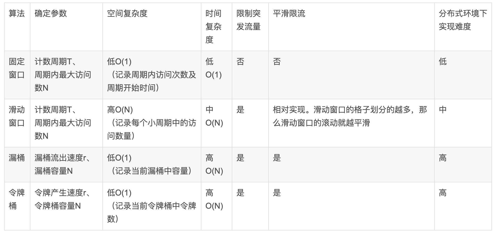

[TOC]

### 1 redis为什么这么快**（**三点）

* 纯内存操作

* 单线程操作，避免了频繁的上下文切换

* 采用了非阻塞I/O多路复用机制

	* 博主打一个比方：小曲在S城开了一家快递店，负责同城快送服务。小曲因为资金限制，雇佣了一批快递员，然后小曲发现资金不够了，只够买一辆车送快递。

	* 经营方式一
		客户每送来一份快递，小曲就让一个快递员盯着，然后快递员开车去送快递。慢慢的小曲就发现了这种经营方式存在下述问题：

		几十个快递员基本上时间都花在了抢车上了，大部分快递员都处在闲置状态，谁抢到了车，谁就能去送快递
		随着快递的增多，快递员也越来越多，小曲发现快递店里越来越挤，没办法雇佣新的快递员了
		快递员之间的协调很花时间
		综合上述缺点，小曲痛定思痛，提出了下面的经营方式

	* 经营方式二
		小曲只雇佣一个快递员。然后呢，客户送来的快递，小曲按送达地点标注好，然后依次放在一个地方。最后，那个快递员依次的去取快递，一次拿一个，然后开着车去送快递，送好了就回来拿下一个快递。

	* 对比
		上述两种经营方式对比，是不是明显觉得第二种，效率更高，更好呢。在上述比喻中:

		每个快递员------------------>每个线程
		每个快递-------------------->每个socket(I/O流)
		快递的送达地点-------------->socket的不同状态
		客户送快递请求-------------->来自客户端的请求
		小曲的经营方式-------------->服务端运行的代码
		一辆车---------------------->CPU的核数
		于是我们有如下结论
		1、经营方式一就是传统的并发模型，每个I/O流(快递)都有一个新的线程(快递员)管理。
		2、经营方式二就是I/O多路复用。只有单个线程(一个快递员)，通过跟踪每个I/O流的状态(每个快递的送达地点)，来管理多个I/O流。

**为什么要使用缓存**

​		我们在碰到需要执行耗时特别久，且结果不频繁变动的SQL，就特别适合将运行结果放入缓存。这样，后面的请求就去缓存中读取，使得请求能够迅速响应。

​		简单来说，就是。我们的redis-client在操作的时候，会产生具有不同事件类型的socket。在服务端，有一段I/0多路复用程序，将其置入队列之中。然后，文件事件分派器，依次去队列中取，转发到不同的事件处理器中。


### 2 redis的数据类型，以及每种数据类型的使用场景

(一) String
这个其实没啥好说的，最常规的set/get操作，value可以是String也可以是数字。一般做一些复杂的计数功能的缓存。

(二) hash
这里value存放的是结构化的对象，比较方便的就是操作其中的某个字段。博主在做单点登录的时候，就是用这种数据结构存储用户信息，以cookieId作为key，设置30分钟为缓存过期时间，能很好的模拟出类似session的效果。

(三) list
使用List的数据结构，可以做简单的消息队列的功能。另外还有一个就是，可以利用lrange命令，做基于redis的分页功能，性能极佳，用户体验好。

(四) set
因为set堆放的是一堆不重复值的集合。所以可以做全局去重的功能。为什么不用JVM自带的Set进行去重？因为我们的系统一般都是集群部署，使用JVM自带的Set，比较麻烦，难道为了一个做一个全局去重，再起一个公共服务，太麻烦了。
另外，就是利用交集、并集、差集等操作，可以计算共同喜好，全部的喜好，自己独有的****喜好等功能。

(五) sorted set

sorted set多了一个权重参数score,集合中的元素能够按score进行排列。可以做排行榜应用，取TOP N操作。另外，参照另一篇《分布式之延时任务方案解析》，该文指出了sorted set可以用来做延时任务。最后一个应用就是可以做范围查找。****


### 3 redis的过期策略以及内存淘汰机制

> 分析:这个问题其实相当重要，到底redis有没用到家，这个问题就可以看出来。比如你redis只能存5G数据，可是你写了10G，那会删5G的数据。怎么删的，这个问题思考过么？还有，你的数据已经设置了过期时间，但是时间到了，内存占用率还是比较高，有思考过原因么?

redis采用的是**定期删除+惰性删除策略**。

* 为什么不用定时删除策略?
	定时删除,用一个定时器来负责监视key,过期则自动删除。虽然内存及时释放，但是十分消耗CPU资源。在大并发请求下，CPU要将时间应用在处理请求，而不是删除key,因此没有采用这一策略.

* 定期删除+惰性删除是如何工作的呢?
	            定期删除，redis默认每个100ms检查，是否有过期的key,有过期key则删除。需要说明的是，redis不是每个100ms将所有的key检查一次，而是随机抽取进行检查(如果每隔100ms,全部key进行检查，redis岂不是卡死)。因此，如果只采用定期删除策略，会导致很多key到时间没有删除。
	        于是，惰性删除派上用场。也就是说在你获取某个key的时候，redis会检查一下，这个key如果设置了过期时间那么是否过期了？如果过期了此时就会删除。

* 采用定期删除+惰性删除就没其他问题了么?
	        不是的，如果定期删除没删除key。然后你也没即时去请求key，也就是说惰性删除也没生效。这样，redis的内存会越来越高。那么就应该采用内存淘汰机制。在redis.conf中有一行配置

	```conf
	maxmemory-policy volatile-lru
	```

* 该配置就是配内存淘汰策略
	1）noeviction：当内存不足以容纳新写入数据时，新写入操作会报错。应该没人用吧。
	2）allkeys-lru：当内存不足以容纳新写入数据时，在键空间中，移除最近最少使用的key。推荐使用，目前项目在用这种。
	3）allkeys-random：当内存不足以容纳新写入数据时，在键空间中，随机移除某个key。应该也没人用吧，你不删最少使用Key,去随机删。
	4）volatile-lru：当内存不足以容纳新写入数据时，在设置了过期时间的键空间中，移除最近最少使用的key。这种情况一般是把redis既当缓存，又做持久化存储的时候才用。不推荐
	5）volatile-random：当内存不足以容纳新写入数据时，在设置了过期时间的键空间中，随机移除某个key。依然不推荐
	6）volatile-ttl：当内存不足以容纳新写入数据时，在设置了过期时间的键空间中，有更早过期时间的key优先移除。不推荐
	ps：如果没有设置 expire 的key, 不满足先决条件(prerequisites); 那么 volatile-lru, volatile-random 和 volatile-ttl 策略的行为, 和 noeviction(不删除) 基本上一致。


### 4 渐进式ReHash

**原因:**
整个rehash过程并不是一步完成的，而是分多次、渐进式的完成。如果哈希表中保存着数量巨大的键值对时，若一次进行rehash，很有可能会导致服务器宕机。

**步骤**
为ht[1]分配空间，让字典同时持有ht[0]和ht[1]两个哈希表
维持索引计数器变量rehashidx，并将它的值设置为0，表示rehash开始
每次对字典执行增删改查时，将ht[0]的rehashidx索引上的所有键值对rehash到ht[1]，将rehashidx值+1。
当ht[0]的所有键值对都被rehash到ht[1]中，程序将rehashidx的值设置为-1，表示rehash操作完成
注：渐进式rehash的好处在于它采取分为而治的方式，将rehash键值对的计算均摊到每个字典增删改查操作，避免了集中式rehash的庞大计算量。


### 5 缓存穿透

概念访问一个不存在的key，缓存不起作用，请求会穿透到DB，流量大时DB会挂掉。

* 解决方案：

	* 采用布隆过滤器，使用一个足够大的bitmap，用于存储可能访问的key，不存在的key直接被过滤；

	* 访问key未在DB查询到值，也将空值写进缓存，但可以设置较短过期时间。


### 6 缓存雪崩

​		大量的key设置了相同的过期时间，导致在缓存在同一时刻全部失效，造成瞬时DB请求量大、压力骤增，引起雪崩。

* 解决方案:
	* 可以给缓存设置过期时间时加上一个随机值时间，使得每个key的过期时间分布开来，不会集中在同一时刻失效；
	* 采用限流算法，限制流量；
	* 采用分布式锁，加锁访问。


### 7 常见的限流算法



**计数器（固定窗口）算法**

* 计数器算法是使用计数器在周期内累加访问次数，当达到设定的限流值时，触发限流策略。下一个周期开始时，进行清零，重新计数。
* 此算法在单机还是分布式环境下实现都非常简单，使用redis的incr原子自增性和线程安全即可轻松实现。

**滑动窗口算法**

* 滑动窗口算法是将时间周期分为N个小周期，分别记录每个小周期内访问次数，并且根据时间滑动删除过期的小周期。

**漏桶算法**

* 漏桶算法是访问请求到达时直接放入漏桶，如当前容量已达到上限（限流值），则进行丢弃（触发限流策略）。漏桶以固定的速率进行释放访问请求（即请求通过），直到漏桶为空。

**令牌桶算法**

* 令牌桶算法是程序以r（r=时间周期/限流值）的速度向令牌桶中增加令牌，直到令牌桶满，请求到达时向令牌桶请求令牌，如获取到令牌则通过请求，否则触发限流策略


### 8 持久化对过期key的处理

**过期key对RDB没有任何影响**

- 从内存数据库持久化数据到RDB文件
	- 持久化key之前，会检查是否过期，过期的key不进入RDB文件
- 从RDB文件恢复数据到内存数据库
	- 数据载入数据库之前，会对key先进行过期检查，如果过期，不导入数据库（主库情况）

**过期key对AOF没有任何影响**

- 从内存数据库持久化数据到AOF文件：
	- 当key过期后，还没有被删除，此时进行执行持久化操作（该key是不会进入aof文件的，因为没有发生修改命令）
	- 当key过期后，在发生删除操作时，程序会向aof文件追加一条del命令（在将来的以aof文件恢复数据的时候该过期的键就会被删掉）
- AOF重写
	- 重写时，会先判断key是否过期，已过期的key不会重写到aof文件 

