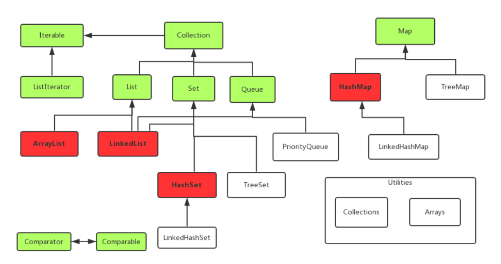
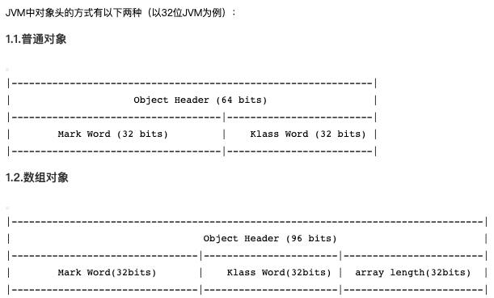
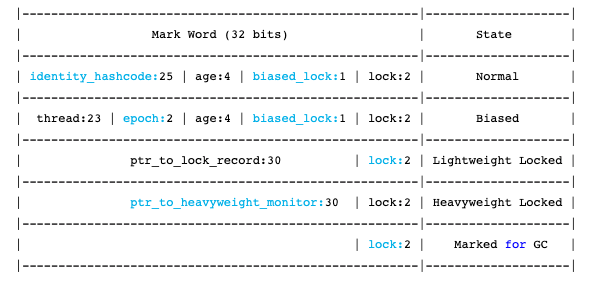

[TOC]

## Java基础知识点




ArrayList：随机访问元素快，但是在中间插入和移除比较慢

LinkedList：通过代价较低在List中间进行插入和移除，提供了优化的顺序访问，但是在随机访问方面相对较慢。但是他的特性功能要比ArrayList强大的多。支持Queue和Stack。采用链式存储。链式存储就会定一个节点Node。包括三部分前驱节点、后继节点以及data值。所以存储存储的时候他的物理地址不一定是连续的。

HashSet：查询速度比较快，但是存储的元素是随机的并没有排序

TreeSet：将元素存储红-黑树结构中，所以存储的结果是有顺序的


### 1 抽象类、接口、重载和重写

* 核心：**一个类只能继承一个抽象类，但可以实现多个接口**

* 类含有抽象方法，为抽象类，用abstract修饰
	* 不能用来创建对象
	* 继承抽象类的类必须为抽象方法提供定义，否则也为抽象类
	* 可以拥有成员变量和普通成员方法，抽象方法必须为public或protected
	
* 接口是对行为的抽象，是用interface修饰
	* 可以含有变量和方法，但会被隐式指定为public static final变量和public abstract方法，且变量必须给初值
	* 接口中的方法必须为抽象方法，一般情况下不在接口中定义变量
	
* **重载和重写**

	* 重写是子类对父类的允许访问的方法的实现过程进行重新编写, **返回值和形参都不能改变**。**即外壳不变，核心重写！**

		重写的好处在于子类可以根据需要，定义特定于自己的行为。 也就是说子类能够根据需要实现父类的方法。

		重写方法不能抛出新的检查异常或者比被重写方法申明更加宽泛的异常。例如： 父类的一个方法申明了一个检查异常 IOException，但是在重写这个方法的时候不能抛出 Exception 异常，因为 Exception 是 IOException 的父类，只能抛出 IOException 的子类异常。

	* 重载(overloading) 是在一个类里面，方法名字相同，而参数不同。**返回类型可以相同也可以不同。**

		每个重载的方法（或者构造函数）都必须有一个独一无二的参数类型列表。

		最常用的地方就是构造器的重载。

		


### 2 双亲委派机制


​       Java虚拟机对class文件采用的时**按需加载**的方式，也就是说当需要使用这个类的时候才会将它的class文件加载到内存当中生成class对象，而且加载某个类的class文件是，Java采用的是**双亲委派机制**，即把请求交由其父类处理，他是一种任务委派机制。

 **工作原理**

1. 如果一个类加载器收到了类加载请求，它并不会自己先去加载，而是把这个请求委托给父类加载器去执行；
2. 如果父类加载器还存在其父类加载器，则会进一步向上委托，依次递归，请求最终将到达顶层的启动类加载器。
3. 如果父类加载器可以完成类加载任务，就成功返回，倘若父类加载器无法完成加载任务，子加载器才会尝试自己去加载，这就是双亲委派模式

Java虚拟机对class文件采用的时**按需加载**的方式，也就是说当需要使用这个类的时候才会将它的class文件加载到内存当中生成class对象，而且加载某个类的class文件是，Java采用的是**双亲委派机制**，即把请求交由其父类处理，他是一种任务委派机制。

**优点**

- 避免类的重复加载
- 保护程序安全，防止核心API被随意篡改

- - 自定义类：Java.lang.String
	- 自定义类：Java.lang.Bwang

 **沙箱安全机制**

自定义String类，但是在加载自定义String类的时候会率先使用引导类加载器加载，而引导类加载器在加载过程中会加载JDK自带的文件，报错信息说没有main方法，是因为加载的是rt.jar包中的String类，这样可以保证对Java核心API的源代码保护，这就是沙箱安全机制


### 3 JVM内存结构

JVM 内存共分为**虚拟机栈，堆，方法区，程序计数器，本地方法栈**五个部分

* **堆(线程共享)**

	* <u>被所有线程**共享**的一块内存区域，在虚拟机启动的时候创建，用于**存放对象实例**</u>
	* 当堆中没有内存可分配给实例，也无法再扩展时，则抛出OutOfMemoryError异常。
* **方法区(线程共享)**：==1.8后变更为元空间==
  * <u>被所有线程共享的一块内存区域，用于存储已经被虚拟机加载的**类信息、常量、静态变量**等</u>
  * 这个区域的内存回收目标主要针对常量池的回收和堆类型的卸载
  * 替换原因
  	* 整个永久代有⼀个 JVM 本身设置固定⼤⼩上限，⽆法进⾏调整，⽽元空间使⽤的是直接内 存，受本机可⽤内存的限制，虽然元空间仍旧可能溢出，但是⽐原来出现的⼏率会更⼩。
  	* 元空间⾥⾯存放的是类的元数据，这样加载多少类的元数据就不由 ⽽由系统的实际可⽤空间来控制，这样能加载的类就更多了
  	* 在 JDK8，合并 HotSpot 和 JRockit 的代码时, JRockit 从来没有⼀个叫永久代的东⻄, 合并 之后就没有必要额外的设置这么⼀个永久代的地⽅了。
* **虚拟机栈(线程私有)**

	* <u>每个方法在执行的时候会创建一个栈帧，存储**局部变量、操作数、动态链接和方法返回地址**</u>
	* 每个方法从调用到执行完毕，对应一个栈帧在虚拟机栈中的入栈和出栈
	* 通常所说的栈，一般指虚拟机栈中的局部变量部分，局部变量所需内存在编译期间完成分配
		* 若线程请求的栈深度大于虚拟机所允许的深度，则StackOverflowError
		* 若虚拟机栈可动态扩展，扩展到无法申请足够的内存，则OutOfMemoryError
* **程序计数器(线程私有)**

	* 线程私有
		* <u>（java虚拟机是通过线程轮流切换并分配处理器执行时间的方式来实现，在同一时刻一个处理器内核只会执行一条线程，处理器切换线程时不会记录上一个线程执行到哪个位置，所以为了线程切换后依然能恢复到原位，每条线程都需要有各自独立的线程计数器）</u>
	* JVM规范中唯一没有规定OutOfMemoryError情况的区域
		* 程序计数器存储的是字节码文件的行号，而这个范围是可知晓的，在一开始分配内存时就可以分配一个绝对不会溢出的内存
	* 如果正在执行的是Native 方法，则这个计数器值为空
		* （Native方法大多是通过C实现并未编译成需要执行的字节码指令，也就不需要去存储字节码文件的行号了）

	* 是当前线程执行字节码的行号指示器，每条线程都有一个独立的程序计数器，也称线程私有的内存
	* 字节码解释器工作时就是通过改变这个计数器的值来选取下一条需要执行的字节码指令，分支、循环、跳转、异常处理、线程恢复等基础功能都需要依赖这个计数器来完成。
* **本地方法栈(线程私有)**

	* <u>和虚拟机栈类似，主要为虚拟机使用到的**Native方法**服务。也会抛出StackOverflowError 和OutOfMemoryError。</u>


### 4 Java内存模型

* Java 线程之间的通信由 Java 内存模型控制，JMM 决定一个线程对共享变量的写入何时对另一个线程可见。
* 从抽象的角度来看，JMM 定义了线程和主内存之间的抽象关系：线程之间的共享变量存储在主内存（main memory）中，每个线程都有一个私有的本地内存（local memory），本地内存中存储了该线程以读 / 写共享变量的副本。本地内存是 JMM 的一个抽象概念，并不真实存在。它涵盖了缓存，写缓冲区，寄存器以及其他的硬件和编译器优化。


* 若A和B要进行通信，必须有两个步骤
	* 首先，线程A把本地内存A中更新过的共享变量刷新到主内存中去。
	* 然后，线程B到主内存中去读取线程A之前已更新过的共享变量。
	* 


### 5 垃圾回收机制（GC）

* （1）什么是垃圾？
	* 对于java对象而言，没有被其他对象所引用，则该对象就是无用的
* （2）判定垃圾的算法：**引用计数法**和**可达性分析算法**
	* 引用计数法：
		* 给对象添加一个引用计数器，每当有一个地方引用，计数器就+1，引用失效则-1
		* 任何时候计数器为0的对象就是不可能再被使用的，可以当做垃圾回收
		* 优缺点：
			* 优：执行效率高，程序执行受影响较小
			* 缺：无法检测出循环引用的情况，导致内存泄漏
	* 可达性分析算法：
		* 通过一系列”GC Roots“的对象作为起点，从这些节点向下搜索，节点所走过的路称为引用链，若一个对象到”GC Roots“没有链相连，则此对象不可用
		* 可作为”GC Roots“的对象
			* 虚拟机栈中的引用对象
			* 方法区中的常量引用对象
			* 方法区中的类静态属性引用对象
			* 本地方法栈中的引用对象
			* 活跃线程中的引用对象
	* 垃圾回收器：
		* **Serial 收集器**：Serial（串⾏）收集器是最基本、历史最悠久的垃圾收集器了。⼤家看名字就知道这个收集器是 ⼀个单线程收集器了。它的 “单线程” 的意义不仅仅意味着它只会使⽤⼀条垃圾收集线程去完成 垃圾收集⼯作，更重要的是它在进⾏垃圾收集⼯作的时候必须暂停其他所有的⼯作线程（ "Stop The World" ），直到它收集结束。**新⽣代采⽤复制算法，⽼年代采⽤标记-整理算法。**
		* **ParNew 收集器**：ParNew 收集器其实就是 Serial 收集器的多线程版本，除了使⽤多线程进⾏垃圾收集外，其余⾏ 为（控制参数、收集算法、回收策略等等）和 Serial 收集器完全⼀样。**新⽣代采⽤复制算法，⽼年代采⽤标记-整理算法。**
		* **Parallel Scavenge 收集器**：Parallel Scavenge 收集器关注点是吞吐量（⾼效率的利⽤ CPU）。CMS 等垃圾收集器的关注点更多的是⽤户线程的停顿时间（提⾼⽤户体验）。**新⽣代采⽤复制算法，⽼年代采⽤标记-整理算法。**
		* **Serial Old 收集器**：Serial 收集器的⽼年代版本，它同样是⼀个单线程收集器。它主要有两⼤⽤途：⼀种⽤途是在 JDK1.5 以及以前的版本中与 Parallel Scavenge 收集器搭配使⽤，另⼀种⽤途是作为 CMS 收集 器的后备⽅案。
		* **Parallel Old 收集器**：Parallel Scavenge 收集器的⽼年代版本。使⽤多线程和“标记-整理”算法。在注重吞吐量以及 CPU 资源的场合，都可以优先考虑 Parallel Scavenge 收集器和 Parallel Old 收集器。
		* **CMS 收集器**：⼀种以获取最短回收停顿时间为⽬标的收集器。它⾮常符合在注重⽤户体验的应⽤上使⽤。CMS（Concurrent Mark Sweep）收集器是 HotSpot 虚拟机第⼀款真正意义上的并发收集器，它第⼀次实现了让垃圾收集线程与⽤户线程（基本上）同时⼯作。
* （3）四种垃圾回收算法：**标记清除算法**、**复制算法**、**标记整理算法**以及**分代回收算法**
	* 标记清除算法
		* 分为两个阶段：标记--清除
		* 两个问题：效率问题（两阶段效率都很低），空间问题（标记清除后产生大量不连续的碎片）
	*  复制算法（新生代算法）
		* 原理：将堆中可用的新生代内存按容量分成几块区域，每次只使用一块区域。当一块区域需要GC时，将此区域还存活的对象复制到另一块上，在把此区域一次性清理掉。
		* 新生代中98%的对象都是”朝生夕死”的，所以并不需要按照1 : 1的比例来划分内存空间，而是将内存(新生代内存)分为一块较大的Eden(伊甸园)空间和两块较小的Survivor(幸存者)空间，每次使用Eden和其中一块Survivor（两个Survivor区域一个称为From区，另一个称为To区域）。
		* 
		* 优：解决碎片化问题，顺序分配内存简单高效
		* 缺：只适用于存活率低的场景，如果极端情况下如果对象全部存活，就要浪费一半的存储空间
	* 标记整理算法（老年代回收算法）
		* 和标记清除算法相似，但是在标记完成之后，不是直接清理可回收对象，而是将存活对象都向一端移动，然后清理掉端边界以外的内存
		* 相比于标记清除算法，成本更高，但又解决了内存碎片的问题
	* 分代回收算法
		* 根据具体的情况选择具体的垃圾回收算法。一般将 java 堆分为新生代和老年代，这样就可以根据各个年代的特点选择合适的垃圾收集算法。
		* 新生代：复制算法
		* 老年代：标记清除算法 或 标记整理算法
* 


### 6 反射

* 定义：在运行状态中，对于任意一个类，都能够获取这个类的所有属性和方法，对于任意一个对象，都能够调用它的任意一个方法和属性（包括私有方法和属性），这种动态获取的信息以及动态调用对象的功能叫反射机制。

* 要想使用反射机制，必须要获取到该类的字节码文件对象（.class），获取方式(三种)

	```java
	// 1 通过Class类中的静态方法forName，直接获取到一个类的字节码文件对象，此时该类还是源文件阶段，并没有变为字节码文件
	Class clazz1 = Class.forName("com.komorebi.pojo.User");
	// 2 当类被加载成.class文件时，此时Person类变成了.class，在获取该字节码文件对象，也就是获取自己，该类处于字节码阶段。
	Class clazz2  = Person.class;
	// 3 通过类的实例获取该类的字节码文件对象，该类处于创建对象阶段　
	Class clazz3 = p.getClass();
	```

* 得到.class之后，创建实例对象

	```java
	// 无参
	User user = (User)clazz1.newInstance();
	// 有参
	Constructor constructor = clazz1.getConstructor(int.class, String.class);
	User user = (User)constructor.newInstance(12, "XX");
	// 获取成员变量
	Field field = clazz1.getDeclaredField("id");
	```

* 动态代理：一种设计模式（火车票让人代买），实际上就是通过反射来生成一个代理

  * `java.lang.reflect`包下提供了一个**Proxy**类和一个**InvocationHandler**接口，通过使用这个类和接口就可以生成动态代理对象
  * 步骤：
  	* 1 new 出代理对象，通过实现`InvacationHandler`接口，然后new出代理对象
  	* 2 通过Proxy类的静态方法`newProxyInstance`，来将代理对象假装成那个被代理的对象
  	* 3 执行

* 优缺点：

	* 优点：可以实现动态创建对象和编译
	* 缺点：对性能有影响


### 7 异常处理

* 定义：异常是一个事件，发生在程序运行期间，干扰了正常的指令流程。Java通过Throwable类的众多子类描述各种不同的异常。因而，Java异常都是对象，是Throwable子类的实例，描述了出现在一段编码中的错误条件。
	
	* 错误（Error）：Error类及其子类，代表了JVM本身的错误，很少出现
	* 异常（Exception）：代表程序运行时发生的各种不期望发生的事件，可以被Java异常处理机制使用，是异常处理的核心
* 根据**Javac对异常的处理要求**，将异常分为两类：
	* **非检查异常**：`Error`和`RuntimeException`以及他们的子类。**编译时不会提示和发现这样的异常，不要求在程序处理。**可以用try，也可以不处理。对于这类异常，应该去修正代码（除0错误`ArithmeticException`、强转错误`ClassCastException`、数组越界`ArrayIndexOutOfBoundsException`和空指针异常`NullPointerException`）
	* **检查异常**：javac强制要求程序员为这样的异常做预备处理工作（使用`try - catch - finally`或者`throws`）。这样的异常一般是由程序的运行环境导致的，因为程序可能被运行在各种未知的环境下，而程序员无法干预用户如何使用，所以应该预先准备，如`SQLException`、`IOException`和`ClassNotFoundException`
* 异常是在执行某个函数时引发的，函数层级调用，所以会有异常追踪栈
* **try - catch - finally**
	* 三者中的局部变量不能共享使用
	* 一个catch对应一个异常，第一个匹配到的会被执行，也支持父类匹配。因此，如果一个try下的多个catch有父子类型，子类放前面
	* java中，异常处理的任务就是**将执行控制流从异常发生的地方转移到能够处理这种异常的地方去**。也就是说：当一个函数的某条语句发生异常时，这条语句的后面的语句不会再执行，它失去了焦点。执行流跳转到最近的匹配的异常处理catch代码块去执行，异常被处理完后，执行流会接着在“处理了这个异常的catch代码块”后面接着执行。
* **throws**
	* throws是另一种处理异常的方式，它不同于try...catch...finally，throws仅仅是将函数中可能出现的异常向调用者声明，而自己则不具体处理。
	* 采取这种异常处理的原因可能是：方法本身不知道如何处理这样的异常，或者说让调用者处理更好，调用者需要为可能发生的异常负责。
* 自定义异常：
	* 如果要自定义异常类，则扩展Exception类即可，因此这样的自定义异常都属于检查异常（checked exception）。如果要自定义非检查异常，则扩展自RuntimeException。
	* 自定义的异常应该总是包含如下的构造函数：
		* 一个无参构造函数
		* 一个带有String参数的构造函数，并传递给父类的构造函数。
		* 一个带有String参数和Throwable参数，并都传递给父类构造函数
		* 一个带有Throwable 参数的构造函数，并传递给父类的构造函数。


### 8 String、StringBuilder、StringBuffer区别

> String 类中使⽤ final 关键字修饰字符数组来保存字符串， private final char value[] ，所以 String 对象是不可变的。
>
> StringBuilder 与 StringBuffer 都继承⾃ AbstractStringBuilder 类，在 AbstractStringBuilder 中 也是使⽤字符数组保存字符串 char[]value 但是没有⽤ final 关键字修饰，所以这两种对象都是可 变的

这三个类的区别主要在两个方面：**运行速度**和**线程安全**

* 运行速度：**StringBuilder > StringBuffer > String**（String最慢是因为它是字符串常量，另外两个是变量。String创建后是不可更改的，str = str + "11"实际上是重新创建了一个新的String，旧的被GC回收了）
* 线程安全：**StringBuilder是线程不安全的，StringBuffer是线程安全的**
	* 若一个StringBuffer对象在字符串缓冲区被多个线程使用时，StringBuffer很多方法带有synchronized关键字进行同步，可以保证线程安全


### 9 ArrayList、LinkedList、Vector的区别

**存储结构**

* ArrayList和Vector是基于Object数组实现的，LinkedList是基于双向链表实现的
* ArrayList和Vector按照顺序将元素存储（下标0开始），删除完成后，需要使部分元素移位，默认初始容量为10

**线程安全**

* ArrayList不具有线程安全性，在单线程时，LinkedList也是线程不安全的，若在并发环境下使用，可以用Collections类中的静态方法synchronizedList()对它们进行调用
* Vector是线程安全的，其大部分方法都包含synchronized，但是效率相对较低

**扩容机制**

* ArrayList和Vector都是使用Object的数组形式存储的，若要扩容时，ArrayList扩充为原先**1.5**倍，Vector是**2**倍
* Vector可以设置扩容增量（设置capacityIncrement为一个>0的数），ArrayList不行。
* 原理：元素个数超过数组长度时，会产生一个新的数组，将原数组的数据复制过去

**CURD效率**

* ArrayList和Vector从指定的位置检索一个对象，或在集合的末尾插入、删除一个元素的时间复杂度是一样，$O(1)$
* ArrayList和Vector在其他位置增加或者删除一个元素的时间复杂度是$O(n)$
* LinkedList中，在插入、删除任何位置的元素所花费的时间都是一样的，时间复杂度都为$O(1)$
* LinkedList在检索一个元素的时间复杂度为$O(n)$


### 10.1 HashMap的底层实现

- **JDK1.7及之前：数组+链表**
- **JDK1.8：数组+链表+红黑树**

**HashMap添加元素**

当添加元素时，会通过哈希值和数组长度计算下标来定位元素应该put的位置（通常为使分布均匀，会使用取模，但实际并不是）。

​		（1）计算出index，就将元素添加进去，会产生**哈希冲突**。（计算出的索引相同，但此索引此时有值）

​		（2）此时，用第二种数据结构--**链表**，冲突的元素在该索引处以链表的形式保存。

​		（3）当链表过长时，查询效率较低，时间复杂度会到$O(n)$。此时引入第三种数据结构--**红黑树**（红黑树是一颗接近平衡的二叉树，查询时间复杂度为$O(logn)$）.==将链表转换成红⿊树前会判断，如果当前数组的⻓度⼩于 64，那么 会选择先进⾏数组扩容，⽽不是转换为红⿊树若链表不到一定长度，直接用红黑树是不行的，红黑树维护代价较高，每次插入一个数据都会打破红黑树的平衡性，需要每次都再平衡（左旋、右旋、重新着色）==

**Hash算法**

```java
static final int hash(Object key) {
    int h;
    return (key == null) ? 0 : (h = key.hashCode()) ^ (h >>> 16); // >>> 无符号右移，忽略符号位，空位都以0补齐
}

public int hashCode() {
    int h = hash;
    if (h == 0 && value.length > 0) {
        char val[] = value;

        for (int i = 0; i < value.length; i++) {
            h = 31 * h + val[i];
        }
        hash = h;
    }
    return h;
}
```

* hash的目的是为了尽量分布均匀。取模做位与运算的时候，实际上刚刚开始数组的长度一般比较小，只利用了低16位,高16位是用不到的。这种情况下，产生hash冲突的概率会大大增加。这样设计保证将h无符号右移16为相当于将高区16位移动到了低区的16位，再与原hashcode做**异或运算**，可以将**高低位二进制特征混合起来**。
* 推导公式：$s[0]*31 ^ {n-1} + s[1]*31^{n-2} + ... + s[n-1]$
	
* 选31的原因
	* 选择质数作为乘子，会大大降低hash冲突的概率。质数的值越大，hash冲突率越低
	* 31参与乘法运算，可以被 JVM 优化，`31 * i = (i << 5) - i`
	* 使用 101 计算 hash code 容易导致整型溢出，导致计算精度丢失

**数组长度问题**

* HashMap中数组的初始长度为16，默认加载因子为0.75

* 若传入一个参数，则调用一个重载方法，即使用指定的初始值来创建HashMap，默认加载因子依旧是0.75

	* 在方法中进行判断，若初始容量<0，则抛出异常；若大于最大容量（1<<30），就为最大容量

	* 方法最后设置加载因子和一个`tableSizefor`方法，返回一个**大于输入参数且最近的2的整数次幂** 

	* 该算法让最高位的1后面的位全变为1。最后再让结果n+1，即得到了2的整数次幂的值了。cap-1再赋值给n的目的是让找到的目标值大于或等于原值

		```java
		/**
		* Returns a power of two size for the given target capacity.
		*/
		static final int tableSizeFor(int cap) {
		    int n = cap - 1;
		    n |= n >>> 1;
		    n |= n >>> 2;
		    n |= n >>> 4;
		    n |= n >>> 8;
		    n |= n >>> 16;
		    return (n < 0) ? 1 : (n >= MAXIMUM_CAPACITY) ? MAXIMUM_CAPACITY : n + 1;
		}
		```

* 为什么要2的整数幂？

	* put方法和hash方法

		```java
		public V put(K key, V value) {
			return putVal(hash(key), key, value, false, true);
		}
		
		static final int hash(Object key) {
		    int h;
		    return (key == null) ? 0 : (h = key.hashCode()) ^ (h >>> 16);
		}
		```

	* 上文提过，添加元素时索引下标可以取模得到，但是计算机的运行效率：加减 > 乘法 > 除法 > 取模。因为HashMap中要定位索引，并且数组一旦达到容量阈值就需要扩容，扩容就意味着要进行数组的移动，数组一旦移动，每移动一次都要重回计算索引，这个过程牵扯到大量元素的迁移，很影响效率。

	* putVal方法，它是实现具体的put操作的方法

		```java
		    /**
		     * Implements Map.put and related methods
		     *
		     * @param hash hash for key
		     * @param key the key
		     * @param value the value to put
		     * @param onlyIfAbsent if true, don't change existing value
		     * @param evict if false, the table is in creation mode.
		     * @return previous value, or null if none
		     */
			final V putVal(int hash, K key, V value, boolean onlyIfAbsent,
		                   boolean evict) {
		        Node<K,V>[] tab; Node<K,V> p; int n, i;
		        //1. 如果当前table为空，新建默认大小的table
		        if ((tab = table) == null || (n = tab.length) == 0)
		            n = (tab = resize()).length;
		        //2. 获取当前key对应的节点
		        if ((p = tab[i = (n - 1) & hash]) == null)
		            //3. 如果不存在，新建节点
		            tab[i] = newNode(hash, key, value, null);
		        else {
		            //4. 存在节点
		            Node<K,V> e; K k;
		            //5. key的hash相同，key的引用相同或者key equals，则覆盖
		            if (p.hash == hash &&
		                ((k = p.key) == key || (key != null && key.equals(k))))
		                e = p;
		            //6. 如果当前节点是一个红黑树树节点，则添加树节点
		            else if (p instanceof TreeNode)
		                e = ((TreeNode<K,V>)p).putTreeVal(this, tab, hash, key, value);
		            //7. 不是红黑树节点，也不是相同节点，则表示为链表结构
		            else {
		                for (int binCount = 0; ; ++binCount) {
		                    //8. 找到最后那个节点
		                    if ((e = p.next) == null) {
		                        p.next = newNode(hash, key, value, null);
		                        //9. 如果链表长度超过8转成红黑树
		                        if (binCount >= TREEIFY_THRESHOLD - 1) // -1 for 1st
		                            treeifyBin(tab, hash);
		                        break;
		                    }
		                    //10.如果链表中有相同的节点，则覆盖
		                    if (e.hash == hash &&
		                        ((k = e.key) == key || (key != null && key.equals(k))))
		                        break;
		                    p = e;
		                }
		            }
		            if (e != null) { // existing mapping for key
		                V oldValue = e.value;
		                //是否替换掉value值
		                if (!onlyIfAbsent || oldValue == null)
		                    e.value = value;
		                afterNodeAccess(e);
		                return oldValue;
		            }
		        }
		        //记录修改次数
		        ++modCount;
		        //是否超过容量，超过需要扩容
		        if (++size > threshold)
		            resize();
		        afterNodeInsertion(evict);
		        return null;
		    }
		```

	* 使用**与运算**`(n-1) & hash`取代**取模运算**`hash%length`，因为这两种方式记算出来的结果是一致的（n就是length），也就是`(length-1)&hash = hash%length`，例如：假设数组长度为4，哈希值为10（但是当数组的长=长度不为2的指数次幂时，两种方式计算的结果不一样，即`length-1)&hash ≠ hash&length`）

		```java
		(n-1) & hash = (4-1) & 10 = 00000011 & 00001010 = 00000010 = 2
		hash % length = 10 % 4 = 2
		```

	* **总结：首先使用位运算来加快计算的效率，而要使用位运算，就需要数组-1然后与hash值保证其在数组范围内，只有当数组长度为2的指数次幂时，其计算得出的值才能和取模算法的值相等，并且保证能取到数组的每一位，减少哈希碰撞，不浪费大量的数组资源**

**加载因子0.75**

​		加载因子如果定的太大，比如1，这就意味着数组的每个空位都需要填满，即达到理想状态，不产生链表，但实际是不可能达到这种理想状态，如果一直等数组填满才扩容，虽然达到了最大的数组空间利用率，但会产生大量的哈希碰撞，同时产生更多的链表，显然不符合我们的需求。

​		但如果设置的过小，比如0.5，这样一来保证了数组空间很充足，减少了哈希碰撞，这种情况下查询效率很高，但消耗了大量空间。

​		因此，需要在时间和空间上做一个折中，选择最合适的负载因子以保证最优化，取到了0.75

**链表长度>8则转成红黑树**

```java
	 * Because TreeNodes are about twice the size of regular nodes, we
     * use them only when bins contain enough nodes to warrant use
     * (see TREEIFY_THRESHOLD). And when they become too small (due to
     * removal or resizing) they are converted back to plain bins.  In
     * usages with well-distributed user hashCodes, tree bins are
     * rarely used.  Ideally, under random hashCodes, the frequency of
     * nodes in bins follows a Poisson distribution
     * (http://en.wikipedia.org/wiki/Poisson_distribution) with a
     * parameter of about 0.5 on average for the default resizing
     * threshold of 0.75, although with a large variance because of
     * resizing granularity. Ignoring variance, the expected
     * occurrences of list size k are (exp(-0.5) * pow(0.5, k) /
     * factorial(k)). The first values are:
     *
     * 0:    0.60653066
     * 1:    0.30326533
     * 2:    0.07581633
     * 3:    0.01263606
     * 4:    0.00157952
     * 5:    0.00015795
     * 6:    0.00001316
     * 7:    0.00000094
     * 8:    0.00000006
     * more: less than 1 in ten million
```

​		这是一个概率论中的泊松分布，因为链表长度大于等于8时转成红黑树正是遵循泊松分布

​		意思就是HashMap节点分布遵循泊松分布，按照泊松分布的计算公式计算出了链表中元素个数和概率的对照表，可以看到**链表中元素个数为8时的概率已经非常小**。

​		**另一方面红黑树平均查找长度是log(n)，长度为8的时候，平均查找长度为3，如果继续使用链表，平均查找长度为8/2=4，这才有转换为树的必要**。链表长度如果是小于等于6，6/2=3，虽然速度也很快的，但是链表和红黑树之间的转换也很耗时。

​		当然，虽然在hashmap底层有这种红黑树的结构，但是能产生这种结构的概率也不大，所以在 JDK1.7 到 JDK1.8 这其中HashMap的性能也只提高了7%~8% 左右

* `HashSet`底层也是`HashMap`，即所有的key对应的值都是`Present`
* hashCode() 与equals()的相关规定：

	1. 如果两个对象相等，则 hashcode ⼀定也是相同的

	2. 两个对象相等,对两个 equals() ⽅法返回 true

	3. 两个对象有相同的 hashcode 值，它们也不⼀定是相等的

	4. 综上， equals() ⽅法被覆盖过，则 hashCode() ⽅法也必须被覆盖

	5. hashCode() 的默认⾏为是对堆上的对象产⽣独特值。如果没有重写 hashCode() ，则该 class 的两个对象⽆论如何都不会相等（即使这两个对象指向相同的数据）。


### 10.2 ConcurrentHashMap的底层实现

在多线程环境下，使用HashMap进行put操作时会存在丢失数据的情况，因此使用`ConcurrentHashMap`代替`HashMap`

* `HashTable`是一个线程安全的类，使用`synchronized`关键字锁住整张哈希表来实现线程安全，相当于所有线程进行读写的时候都去竞争同一把锁，效率很低

* `ConcurrentHashMap`可以做到读取数据不加锁，并且内部结构可以在进行写操作的时候将锁的粒度保持尽量的小，允许多个修改操作并发进行，关键在于使用了**锁分段技术**，即使用多个锁来控制对哈希表的不同部分进行修改
	* 使用段`Segment`来表示不同的部分，每个段就是一个小的HashTable，有各自的锁。只要多个修改操作发生在不同的段上，就可以并发进行
	* 在最理想的情况下，ConcurrentHashMap 可以**最高同时支持 Segment 数量大小的写操作**（刚好这些写操作都非常平均地分布在所有的 Segment上），所以，通过这一种结构，ConcurrentHashMap 的并发能力可以大大的提高
		
	
* **为什么使用ConcurrentHashMap**
	        在多线程环境中使用HashMap的put方法有可能导致程序死循环，因为多线程可能会导致HashMap形成环形链表，即链表的一个节点的next节点永不为null，就会产生死循环。这时，CPU的利用率接近100%，所以并发情况下不能使用HashMap。

	​        HashTable通过使用synchronized保证线程安全，但在线程竞争激烈的情况下效率低下。因为当一个线程访问HashTable的同步方法时，其他线程只能阻塞等待占用线程操作完毕。

	​        ConcurrentHashMap使用分段锁的思想，对于不同的数据段使用不同的锁，可以支持多个线程同时访问不同的数据段，这样线程之间就不存在锁竞争，从而提高了并发效率。

* **Java7与Java8中的ConcurrentHashMap：**
	在ConcurrentHashMap中主要通过**锁分段**技术实现上述目标。
	JDK1.7版本锁的粒度是基于**Segment**的，包含多个HashEntry，而JDK1.8**锁的粒度就是HashEntry**（首节点）

	​		在Java7中，ConcurrentHashMap由Segment数组结构和HashEntry数组组成。Segment是一种可重入锁，是一种数组和链表的结构，一个Segment中包含一个HashEntry数组，每个HashEntry又是一个链表结构。正是通过Segment分段锁，ConcurrentHashMap实现了高效率的并发。（通过 key 定位到 Segment，之后在对应的 Segment 中进行具体的 pu）

	​		在Java8中，ConcurrentHashMap去除了Segment分段锁的数据结构，主要是基于CAS操作保证保证数据的获取以及使用synchronized关键字对相应数据段加锁实现了主要功能，这进一步提高了并发性。同时同时为了提高哈希碰撞下的寻址性能，Java 8在链表长度超过一定阈值(8)时将链表（寻址时间复杂度为O(N)）转换为红黑树（寻址时间复杂度为O(long(N)))。
	
* put流程

     * put函数底层调用了putVal进行数据的插入，对于putVal函数的流程大体如下。

     　　① 判断存储的key、value是否为空，若为空，则抛出异常，否则，进入步骤②

     　　② 计算key的hash值，随后进入无限循环，该无限循环可以确保成功插入数据，若table表为空或者长度为0，则初始化table表，否则，进入步骤③

     　　③ 根据key的hash值取出table表中的结点元素，若取出的结点为空（该桶为空），则使用CAS将key、value、hash值生成的结点放入桶中。否则，进入步骤④

     　　④ 若该结点的的hash值为MOVED，则对该桶中的结点进行转移，否则，进入步骤⑤

     　　⑤ 对桶中的第一个结点（即table表中的结点）进行加锁，对该桶进行遍历，桶中的结点的hash值与key值与给定的hash值和key值相等，则根据标识选择是否进行更新操作（用给定的value值替换该结点的value值），若遍历完桶仍没有找到hash值与key值和指定的hash值与key值相等的结点，则直接新生一个结点并赋值为之前最后一个结点的下一个结点。进入步骤⑥

     　　⑥ 若binCount值达到红黑树转化的阈值，则将桶中的结构转化为红黑树存储，最后，增加binCount的值。

     * ```java
          final V putVal(K key, V value, boolean onlyIfAbsent) {
                  if (key == null || value == null) throw new NullPointerException(); // 键或值为空，抛出异常
                  // 键的hash值经过计算获得hash值
                  int hash = spread(key.hashCode());
                  int binCount = 0;
                  for (Node<K,V>[] tab = table;;) { // 无限循环
                      Node<K,V> f; int n, i, fh;
                      if (tab == null || (n = tab.length) == 0) // 表为空或者表的长度为0
                          // 初始化表
                          tab = initTable();
                      else if ((f = tabAt(tab, i = (n - 1) & hash)) == null) { // 表不为空并且表的长度大于0，并且该桶不为空
                          if (casTabAt(tab, i, null,
                                       new Node<K,V>(hash, key, value, null))) // 比较并且交换值，如tab的第i项为空则用新生成的node替换
                              break;                   // no lock when adding to empty bin
                      }
                      else if ((fh = f.hash) == MOVED) // 该结点的hash值为MOVED
                          // 进行结点的转移（在扩容的过程中）
                          tab = helpTransfer(tab, f);
                      else {
                          V oldVal = null;
                          synchronized (f) { // 加锁同步
                              if (tabAt(tab, i) == f) { // 找到table表下标为i的节点
                                  if (fh >= 0) { // 该table表中该结点的hash值大于0
                                      // binCount赋值为1
                                      binCount = 1;
                                      for (Node<K,V> e = f;; ++binCount) { // 无限循环
                                          K ek;
                                          if (e.hash == hash &&
                                              ((ek = e.key) == key ||
                                               (ek != null && key.equals(ek)))) { // 结点的hash值相等并且key也相等
                                              // 保存该结点的val值
                                              oldVal = e.val;
                                              if (!onlyIfAbsent) // 进行判断
                                                  // 将指定的value保存至结点，即进行了结点值的更新
                                                  e.val = value;
                                              break;
                                          }
                                          // 保存当前结点
                                          Node<K,V> pred = e;
                                          if ((e = e.next) == null) { // 当前结点的下一个结点为空，即为最后一个结点
                                              // 新生一个结点并且赋值给next域
                                              pred.next = new Node<K,V>(hash, key,
                                                                        value, null);
                                              // 退出循环
                                              break;
                                          }
                                      }
                                  }
                                  else if (f instanceof TreeBin) { // 结点为红黑树结点类型
                                      Node<K,V> p;
                                      // binCount赋值为2
                                      binCount = 2;
                                      if ((p = ((TreeBin<K,V>)f).putTreeVal(hash, key,
                                                                     value)) != null) { // 将hash、key、value放入红黑树
                                          // 保存结点的val
                                          oldVal = p.val;
                                          if (!onlyIfAbsent) // 判断
                                              // 赋值结点value值
                                              p.val = value;
                                      }
                                  }
                              }
                          }
                          if (binCount != 0) { // binCount不为0
                              if (binCount >= TREEIFY_THRESHOLD) // 如果binCount大于等于转化为红黑树的阈值
                                  // 进行转化
                                  treeifyBin(tab, i);
                              if (oldVal != null) // 旧值不为空
                                  // 返回旧值
                                  return oldVal;
                              break;
                          }
                      }
                  }
                  // 增加binCount的数量
                  addCount(1L, binCount);
                  return null;
              }
          ```

          

### 11 HashMap 和 Hashtable 的区别

1. 线程是否安全：

	HashMap 是⾮线程安全的， HashTable 是线程安全的,因为HashTable 内部的⽅法基本都经过 synchronized 修饰。（如果你要保证线程安全的话就使⽤ ConcurrentHashMap 吧！）；

2. 效率： 因为线程安全的问题， HashMap 要⽐ HashTable 效率⾼⼀点。另外， HashTable 基本被淘汰，不要在代码中使⽤它；
3. 对 Null key 和 Null value 的⽀持： HashMap 可以存储 null 的 key 和 value，但 null 作为 键只能有⼀个，null 作为值可以有多个；HashTable 不允许有 null 键和 null 值，否则会抛出 NullPointerException 。
4. 初始容量⼤⼩和每次扩充容量⼤⼩的不同 ： ① 创建时如果不指定容量初始值， Hashtable 默认的初始⼤⼩为 11，之后每次扩充，容量变为原来的 2n+1。 HashMap 默认的初始化⼤⼩为 16。之后每次扩充，容量变为原来的 2 倍。② 创建时如果给定了容量初始值，那么 Hashtable 会直接使⽤你给定的⼤⼩，⽽ HashMap 会将其扩充为 2 的幂次⽅⼤⼩ （ HashMap 中的 tableSizeFor() ⽅法保证，下⾯给出了源代码）。也就是说 HashMap 总 是使⽤ 2 的幂作为哈希表的⼤⼩,后⾯会介绍到为什么是 2 的幂次⽅。
5. 底层数据结构： JDK1.8 以后的 HashMap 在解决哈希冲突时有了较⼤的变化，当链表⻓度 ⼤于阈值（默认为 8）（==将链表转换成红⿊树前会判断，如果当前数组的⻓度⼩于 64，那么 会选择先进⾏数组扩容，⽽不是转换为红⿊树==）时，将链表转化为红⿊树，以减少搜索时 间。Hashtable 没有这样的机制。


### 12 Lock、Sychronized和volatile的区别

1. `Synchronized`是内置关键字，`Lock`是个java类
2. `Synchronized`无法判断是否获取锁的状态，`Lock`可以判断是否获取到锁
3. `Synchronized`会自动释放锁（a 线程执行完同步代码会释放锁  b 线程执行过程中发生异常会释放锁），`Lock`需要在`finally`中手动释放锁（unlock方法），否则容易造成死锁
4. 用`Synchronized`关键字的两个线程，如果线程1获得锁，线程2则等待，如果线程1阻塞，则线程2则一直等待下去；`Lock`锁就不一定会等待下去，如果尝试获取不到锁，线程可以不用一直等待就结束了
5. `Synchronized`的锁可重入、不可中断、非公平；而`Lock`锁可重入、可判断、可公平（两者皆可）
6. `Synchronized`锁适合代码量少的同步问题，`Lock`锁适合代码量大的同步问题

**volatile关键字**

> volatile是Java提供的一种轻量级的同步机制，在并发编程中，它也扮演着比较重要的角色。同synchronized相比（synchronized通常称为重量级锁），volatile更轻量级，相比使用synchronized所带来的庞大开销，倘若能恰当的合理的使用volatile

并发三特征**可见性、有序性、原子性**中

**原子性**：原子性是指多线程一起执行时，一个线程操作开始后不会被其他线程干扰，操作不可被中断；

* synchronizd临界区执行具有原子性；

* volatile仅仅保证对单个volatile变量的操作具有原子性；

**可见性**：一个线程修改共享变量时，其他线程能够立即知道这个修改；

单线程：不存在内存可见性问题；
多线程：Java通过volatile, synchronized, final关键字实现可见性；

* volatile：valatile变量保证变量新值立即被同步回主存，每次读取valtile变量都立即从主存刷新；

* synchronized：对变量进行解锁前，将对应变量同步回内存；

* final：final字段一旦初始化完毕，并且this引用没有发生逃逸，其他线程立即看到final字段值；

**有序性**：线程内操作有序进行，线程间操作有序进行；

Java通过volatile, synchronized保证线程间操作的有序性

* volatile通过禁止重排序实现有序性；
* synchronized通过声明临界区，保证线程互斥访问，实现有序性；

**synchronized 关键字和volatile 关键字是两个互补的存在，⽽不是对⽴的存在！**

​		volatile 关键字是线程同步的轻量级实现，所以 volatile 性能肯定⽐ synchronized 关键字要好。但是 volatile 关键字只能⽤于变量⽽ 块。 

​		volatile 关键字能保证数据的可⻅性，但不能保证数据的原⼦性。 synchronized 关键字两 者都能保证。

​		 volatile 关键字主要⽤于解决变量在多个线程之间的可⻅性，⽽ synchronized 关键字解决 的是多个线程之间访问资源的同步性。


### 13 synchronized的实现和机制，锁升级机制

​		synchronized可用来给对象和方法或者代码块加锁，当它锁定一个方法或者一个代码块的时候，同一时刻最多只有一个线程执行这段代码。

synchronized有三种应用方式：

* 作用于**实例方法**，当前实例加锁，进入同步代码前要获得当前实例的锁；
* 作用于**静态方法**，当前类加锁，进去同步代码前要获得当前类对象的锁；
* 作用于**代码块**，对括号里配置的对象加锁
* **锁的升级的目的**：锁升级是为了减低了锁带来的性能消耗。在 Java 6 之后优化 synchronized 的实现方式，使用了偏向锁升级为轻量级锁再升级到重量级锁的方式，从而减低了锁带来的性能消耗。


​		初次执行到synchronized代码块的时候，锁对象变成偏向锁。线程执行并不会主动释放锁。第二次到达代码块的时候，线程会判断之前的线程是不是自己，如果是自己的话，由于前面没有释放锁的操作，这里也就不用重新加锁，就没有加锁、解锁的开销了。

​		当第二个线程过来，两个线程产生了竞争，就会**从偏向锁升级成自旋锁**。自旋锁竞争状态中，没有获得锁的线程，就会不断自旋判断自己是否拿到了锁，没有拿到锁就会忙等。


### 14 关于锁了解多少，知道lock这个锁的底层原理（乐观锁、悲观锁；sync和volatile；CAS；无锁，偏向锁，轻量锁和重量锁）

https://tech.meituan.com/2018/11/15/java-lock.html


**乐观锁和悲观锁**

* 乐观锁和悲观锁并不是特指，某两种类型的锁，是人们定义出来的概念或思想，主要是指**看待并发同步的角度**
* 乐观锁：认为每次去拿数据的时候都认为别人不会修改，所以不会上锁，但是在更新的时候会判断一下在此期间别人有没有去更新这个数据，可以使用**数据版本机制**或**CAS**操作实现。适用于多读的应用类型，可以提高吞吐量，在`java.util.concurrent.atomic`包下的原子变量类就是使用了乐观锁的CAS方式实现的
	* 数据版本机制：在数据表中假设一个数据版本号或者时间戳，当数据修改时，也会随之变动。线程更新数据时，在读取数据的同时也会读取版本号，提交更新时，若读取到的version值一致才更新，否则重试更新操作
	* CAS：（Compare and Swap）当多个线程使用CAS同时更新一个变量时，只有其中一个线程能更新变量的值，其他线程都失败，失败的线程不会被挂起，而是被告知在竞争中失败，并可以再次尝试。
* 悲观锁：总是假设最坏情况，每次去拿数据的时候都认为别人会修改，所以每次拿数据都上锁。`synchronized`关键字就是悲观锁
	* 在对任意记录进行修改前，先尝试为该记录加上排他锁（exclusive locking）。
	* 如果加锁失败，说明该记录正在被修改，那么当前查询可能要等待或者抛出异常。具体响应方式由开发者根据实际需要决定。
	* 如果成功加锁，那么就可以对记录做修改，事务完成后就会解锁了。
	* 期间如果有其他对该记录做修改或加排他锁的操作，都会等待我们解锁或直接抛出异常。
* 适用场景：
	* 悲观锁适用于写操作多的场景，乐观锁适用于读操作多的场景
	* 悲观锁在Java中的使用就是利用各种锁
	* 乐观锁在Java中的使用就是无锁编程，最常用的是CAS算法，典型例子就是原子类，通过CAS自旋实现原子操作的更新

**自旋锁和适应性自旋锁**

​		阻塞或唤醒一个Java线程需要操作系统切换CPU状态来完成，这种状态转换耗费处理器时间。如果同步代码块中的内容太简单，很可能状态转换消耗的时间比执行代码的时间还要长

​		若物理机器有多个处理器，能让两个或以上的线程同时进行，就可以让后面那个请求锁的线程不放弃CPU执行时间，看前一个是否很快释放锁。而为了让这个线程“稍等”，就让这个线程进行**自旋**。

* **自旋锁本身是有缺点的，它不能代替阻塞。**虽然避免了线程切换的开销，但前提是锁被占用的时间要短。因此，自旋等待的时间必须要有一定的限度（默认10次）
	* **自旋锁的原理也是CAS**
* JDK6中加入**适应性自旋锁**，自旋次数不再固定，而是由**前一次在同一个锁上的自旋时间**及锁拥有者的状态决定
	* 若同一个锁上，自旋等待刚刚成功获得过锁，并且持有锁的线程正在运行中，那虚拟机会认为这次自旋也有可能成功，次数变多
	* 若对于某个锁，自旋很少成功过，那以后在尝试时可能省略自旋过程，直接阻塞线程，避免浪费资源

**无锁、偏向锁、轻量级锁和重量级锁**

这四种指锁的状态，针对`synchronized`关键字

|  锁状态  |                        存储内容                         | 存储内容 |
| :------: | :-----------------------------------------------------: | :------: |
|   无锁   |     对象的hashCode、对象分代年龄、是否是偏向锁（0）     |    01    |
|  偏向锁  | 偏向线程ID、偏向时间戳、对象分代年龄、是否是偏向锁（1） |    01    |
| 轻量级锁 |                  指向栈中锁记录的指针                   |    00    |
| 重量级锁 |              指向互斥量（重量级锁）的指针               |    10    |

* 无锁：不锁定资源，所有线程都能访问并修改同一个资源，但同时**只有一个线程能修改成功**（CAS）
* 偏向锁：一段同步代码一直被一个线程所访问，那么该线程会自动获取锁，降低获取锁的代价
* 轻量级锁：当锁是偏向锁的时候，被另外的线程访问，偏向锁会升级为轻量级锁，其他线程会通过自旋的方式尝试获取锁，不会阻塞，从而提高性能
* 重量级锁：升级为重量级锁是，锁标志的状态值变为“10”

**死锁**

​		死锁是指**两个或两个以上的进程**在执行过程中，由于竞争资源或者由于彼此通信而造成的一种阻塞的现象，若无外力作用，它们都将无法推进下去。此时称系统处于死锁状态或系统产生了死锁，这些永远在互相等待的进程称为死锁进程。

死锁的四个条件：

1. 互斥，共享资源 X 和 Y 只能被一个线程占用；
2. 占有且等待，线程 T1 已经取得共享资源 X，在等待共享资源 Y 的时候，不释放共享资源 X；
3. 不可抢占，其他线程不能强行抢占线程 T1 占有的资源；
4. 循环等待，线程 T1 等待线程 T2 占有的资源，线程 T2 等待线程 T1 占有的资源，就是循环等待。

预防死锁：

​       这四个条件都发生时才会出现死锁，那么反过来，**也就是说只要我们破坏其中一个，就可以成功预防死锁的发生**。

四个条件中我们不能破坏互斥，因为我们使用锁目的就是保证资源被互斥访问，于是我们就对其他三个条件进行破坏：

- 占用且等待：一次性申请所有的资源，这样就不存在等待了。
- 不可抢占：占用部分资源的线程进一步申请其他资源时，如果申请不到，可以主动释放它占有的资源。
- 循环等待，靠按序申请资源来预防。所谓按序申请，是指资源是有线性顺序的，申请的时候可以先申请资源序号小的，再申请资源序号大的，这样线性化申请后就不存在循环了。


### 15 创建线程池、线程池的运行机制和拒绝策略

https://tech.meituan.com/2020/04/02/java-pooling-pratice-in-meituan.html

**创建方式**

- 通过构造⽅法实现`ThreadPoolExecutor`
- ThreadPoolExecutor实现的顶层接口是Executor，顶层接口Executor提供了一种思想：将任务提交和任务执行进行解耦。用户无需关注如何创建线程，如何调度线程来执行任务，用户只需提供Runnable对象，将任务的运行逻辑提交到执行器(Executor)中，由Executor框架完成线程的调配和任务的执行部分。
- ExecutorService接口增加了一些能力：
	- 扩充执行任务的能力，补充可以为一个或一批异步任务生成Future的方法；
	- 提供了管控线程池的方法，比如停止线程池的运行。
- AbstractExecutorService则是上层的抽象类，将执行任务的流程串联了起来，保证下层的实现只需关注一个执行任务的方法即可。
- 最下层的实现类ThreadPoolExecutor实现最复杂的运行部分，ThreadPoolExecutor将会一方面维护自身的生命周期，另一方面同时管理线程和任务，使两者良好的结合从而执行并行任务。
- 线程池在内部实际上构建了一个生产者消费者模型，将线程和任务两者解耦，并不直接关联，从而良好的缓冲任务，复用线程。线程池的运行主要分成两部分：任务管理、线程管理。任务管理部分充当生产者的角色，当任务提交后，线程池会判断该任务后续的流转：（1）直接申请线程执行该任务；（2）缓冲到队列中等待线程执行；（3）拒绝该任务。线程管理部分是消费者，它们被统一维护在线程池内，根据任务请求进行线程的分配，当线程执行完任务后则会继续获取新的任务去执行，最终当线程获取不到任务的时候，线程就会被回收。

**创建线程池七大参数**

- `corePoolSzie`：线程池核心线程大小（即使这些线程处于空闲，也不会被销毁）
- `maximumPoolSize`：线程池最大线程数量
- `keepAliveTime`：空闲线程存活时间
- `unit`：空间线程存活时间单位
- `workQueue`：工作队列
	- `ArrayBlockingQueue`：基于数组的有界阻塞队列，FIFO排序
	- `LinkedBlockingQuene`：基于链表的无界阻塞队列
	- `SynchronousQuene`：一个不缓存任务的阻塞队列
	- `PriorityBlockingQueue`：具有优先级的无界阻塞队列
- `threadFactory`：线程工厂，用来设定线程名、是否为daemon线程等
- `handler`：拒绝策略

**运行机制**


1、在创建了线程池后，等待提交过来的任务请求。

2、当调用execute()方法添加一个任务请求，线程池会做如下判断：

- 如果正在运行的线程数小于或者等于corePoolSize，那么马上会创建线程运行这个任务；
- 如果正在运行的线程数大于corePoolSize，那么会将这个任务放入阻塞队列；
- 如果这时候队列满了并且正在运行的线程数量还小于maximumPoolSize，那么还是要创建非核心线程运行这个任务；
- 如果队列满了并且线程数大于或者等于maximumPoolSize，那么会启动饱和拒绝策略来执行。

3、当一个线程完成时，它会从队列中取下一个任务来执行。

4、当一个线程无事可做，且超过一定的时间（keepAliveTime）时，线程池会判断：

​    如果当前运行的线程数大于corePoolSize，那么这个线程会停掉。

​    所以线程池的所有任务完成后，它最终会收缩到corePoolSize的大小。

**拒绝策略**

- **AbortPolicy**（默认） 直接抛出RejectedExecutionException异常阻止系统正常运行。
- **CallerRunsPolicy**   “调用者运行”一种调节机制，该策略既不会丢弃任务，也不会抛出异常，而是将某些任务回退给调用者，从而降低新任务的流量。
- **DiscardOldestPolicy**  抛弃队列中等待最久的任务，然后把当前任务加入队列中尝试再次提交当前任务。  
- **DiscardPolicy**  直接丢弃任务，不予任何处理也不抛出异常。如果允许任务丢失，这是最好的一种方案。

**核心线程是否被回收**

在`ThreadPoolExecutor`中有一个属性`allowCoreThreadTimeOut`（默认false），即核心线程创建后不会被回收，可置为true

**核心线程何时创建**

默认情况下当任务到来时才会创建核心线程，不过`ThreadPoolExecutor`中有两个方法可以提前创建核心线程，

​		一个是`preStartAllCoreThread()`它会启动所有核心线程，

​		另一个是`preStartCoreThread()`,这一个的返回值是boolean类型，

如果所有的核心线程均已被启动则会返回false，如果一个核心线程启动成功将返回true。


### 16 实现多线程的方式（继承Thread，实现Runnable，实现Callable）

1 **继承Thread类**

* 自定义线程类**继承Thread类**

* 重写**run()**方法

* 创建线程对象，调用**start()**方法启动线程

* ```Java
	public class StartThread1 extends Thread {
	    // 线程入口点
	    @Override
	    public void run(){
	        // 线程体
	        for (int i = 0; i < 20; i++) {
	            System.out.println("I am listening " + i);
	        }
	    }
	}
	```

2 **实现Runnable接口**

* 定义MyRunnable类实现**Runnable**接口

* 实现**run()**方法

* 创建线程对象，调用**start()**方法启动线程

* ```Java
	public class StartThread3 implements Runnable{
	    @Override
	    public void run(){
	        for (int i = 0; i < 20; i++) {
	            System.out.println("I am watching " + i);
	        }
	    }
	}
	```

* **3 实现Callable接口**
	* 实现Callable接口，需要返回值类型
	* 重写call，需要抛出异常
	* 创建目标对象
	* 创建执行任务 ExecutorService ser = Executors.newFixedThreadPool(1);
	* 提交执行：Future<Boolean> result1 = ser.submit(1);
	* 获取结果：boolean r1 = result1.get();
	* 关闭服务：ser.shutdownNow();


* Runnable 接⼝不会返回结果或抛出检查异常，但是 Callable 接⼝ 可以。


### 17 多线程的调用方法

**sleep() 和 wait() 有什么区别？**

- 类的不同：sleep() 来自 Thread，wait() 来自 Object。
- 释放锁：sleep() 不释放锁；wait() 释放锁。
- 用法不同：wait() ⽅法被调⽤后，线程不会⾃动苏醒，需要别的线程调⽤同⼀个对象上的 者 notifyAll() ⽅法。 sleep() ⽅法执⾏完成后，线程会⾃动苏醒。或者可以使⽤ timeout) 超时后线程会⾃动苏醒。

**notify()和 notifyAll()有什么区别？**

* notifyAll()会唤醒所有的线程，notify()之后唤醒一个线程。notifyAll() 调用后，会将全部线程由等待池移到锁池，然后参与锁的竞争，竞争成功则继续执行，如果不成功则留在锁池等待锁被释放后再次参与竞争。而 notify()只会唤醒一个线程，具体唤醒哪一个线程由虚拟机控制。

**run() 和 start() 有什么区别？**

* start() 方法用于启动线程，run() 方法用于执行线程的运行时代码。run() 可以重复调用，而 start() 只能调用一次。
* 调⽤ start() ⽅法⽅可启动线程并使线程进⼊就绪状态，直接执⾏ 以多线程的⽅式执⾏。

**submit() 和 execute() 方法有什么区别？**

- execute()：只能执行 Runnable 类型的任务。
- submit()：可以执行 Runnable 和 Callable 类型的任务。
- Callable 类型的任务可以获取执行的返回值，而 Runnable 执行无返回值。
- execute() ⽅法⽤于提交不需要返回值的任务，所以⽆法判断任务是否被线程池执⾏成功与否；
- submit() ⽅法⽤于提交需要返回值的任务。线程池会返回⼀个Future 类型的对象，通过 这个 Future 对象可以判断任务是否执⾏成功，并且可以通过 Future 的 get() ⽅法来获取 返回值， get() ⽅法会阻塞当前线程直到任务完成，⽽使⽤ getlong timeoutTimeUnit unit ⽅法则会阻塞当前线程⼀段时间后⽴即返回，这时候有可能任务没有执⾏完。


### 18 知道ThreadLocal嘛？谈谈你对它的理解？（基于jdk1.8）

**ThreadLocal是用在多线程的场景的！**

* 保存线程上下文信息，在任意需要的地方可以获取
	* 由于`ThreadLocal`的特性，同一线程在某地方进行设置，在随后的任意地方可以获取到（比如说`Spring`的事务管理：用`ThreadLocal`存储`Connection`，从而各个Dao可以获取同一`Connection`，可以进行事务回滚、提交）
* 线程安全的，避免某些情况需要考虑线程安全必须同步带来的性能损失
	* 每个线程往`ThreadLocal`中读写数据是线程隔离，互相之间不会影响的，所以`ThreadLocal`**无法解决共享对象的更新问题**
* **一个ThreadLocal只能存储一个Object对象，如果需要存储多个Object对象那么就需要多个ThreadLocal！**

**源码**

* `Thread `类中有⼀个 `threadLocals` 和 ⼀个` inheritableThreadLocals `变量，它们都是 `ThreadLocalMap` 类型的变量,我把 `ThreadLocalMap `理解为 `ThreadLocal `类实现的定制化的` HashMap `。默认情况下这两个变量都 是 null，只有当前线程调⽤` ThreadLocal `类的 `set` 或` get `⽅法时才创建它们，实际上调⽤这两 个⽅法的时候，调⽤的是 `ThreadLocalMap` 类对应的` get() `、 `set() `⽅法。
* 最终的变量是放在了当前线程的` ThreadLocalMap` 中，并不是存在 `ThreadLocal` 上， `ThreadLocal `可以理解为只是 `ThreadLocalMap` 的封装，传递了变量值。`ThrealLocal `类中可以通过` Thread.currentThread() `获取到当前线程对象后，直接通过 `getMap(Thread t)` 可以访问到该线程的 `ThreadLocalMap` 对象。`ThreadLocal `内部维护的是⼀个类似`Map ` 的 `ThreadLocalMap `对象，值为` Object `对象。
* ⽐如我们在同⼀个线程中声明了两个` ThreadLocal` 对象的话，会使⽤` Thread `内部都是使⽤仅有 那个` ThreadLocalMap` 存放数据的， `ThreadLocalMap `的 `key `就是 `ThreadLocal `对象，`value `就是 `ThreadLocal` 对象调⽤ `set `⽅法设置的值。

**内存泄漏**

​		`ThreadLocalMap` 中使⽤的` key `为 `ThreadLocal `的**弱引⽤**,⽽` value `是**强引⽤**。所以，如果 `ThreadLocal `没有被外部强引⽤的情况下，在垃圾回收的时候，`key `会被清理掉，⽽` value `不会 被清理掉。这样⼀来， `ThreadLocalMap` 中就会出现` key` 为 null 的 Entry。假如我们不做任何措 施的话，`value `永远⽆法被 GC 回收，这个时候就可能会产⽣**内存泄露**。`ThreadLocalMap` 实现 中已经考虑了这种情况，在调⽤ `set() `、` get() `、` remove() `⽅法的时候，会清理掉 key 为 null 的记录。


### 19 成员变量和局部变量

1. 从**语法形式**上看:成员变量是属于类的，⽽局部变量是在⽅法中定义的变量或是⽅法的参数； 成员变量可以被 public , private , static 等修饰符所修饰，⽽局部变量不能被访问控制修饰 符及 static 所修饰；但是，成员变量和局部变量都能被 final 所修饰。
2. 从变量在内存中的**存储⽅式**来看:如果成员变量是使⽤ static 修饰的，那么这个成员变量是属 于类的，如果没有使⽤ static 修饰，这个成员变量是属于实例的。对象存于堆内存，如果局 部变量类型为基本数据类型，那么存储在栈内存，如果为引⽤数据类型，那存放的是指向堆 内存对象的引⽤或者是指向常量池中的地址。
3. 从变量在内存中的**⽣存时间**上看:成员变量是对象的⼀部分，它随着对象的创建⽽存在，⽽局 部变量随着⽅法的调⽤⽽⾃动消失。
4. 成员变量如果没有被赋**初值**:则会⾃动以类型的默认值⽽赋值（⼀种情况例外:被 final 修饰 的成员变量也必须显式地赋值），⽽局部变量则不会⾃动赋值。


### 19 ==和equals的区别

1. ==的作用是判断两个对象的地址是不是相等。即判断两个对象是不是同一个对象。(基本数据类型比较的是值，引用数据类型比较的是内存地址) 
2. equals() : 它的作用也是判断两个对象是否相等。但它一般有两种使用情况： 
	1. 类没有覆盖equals()方法。则通过equals()比较该类的两个对象时，等价于通过“==”比较这两个对象。 
	2. 类覆盖了equals()方法。一般，我们都覆盖equals()方法来两个对象的内容相等；若它们的内容相等，则返回true(即，认为这两个对象相等)。

**hashCode() 与equals()：**

1. 如果两个对象相等，则 hashcode ⼀定也是相同的
2. 两个对象相等,对两个 equals() ⽅法返回 true
3. 两个对象有相同的 hashcode 值，它们也不⼀定是相等的
4. 综上， equals() ⽅法被覆盖过，则 hashCode() ⽅法也必须被覆盖
5. hashCode() 的默认⾏为是对堆上的对象产⽣独特值。如果没有重写 hashCode() ，则该 class 的两个对象⽆论如何都不会相等（即使这两个对象指向相同的数据）。

**为什么重写equals还要重写hashcode？**

​		HashMap中，如果要比较key是否相等，要同时使用这两个函数！因为自定义的类的hashcode()方法继承于Object类，其hashcode码为默认的内存地址，这样即便有相同含义的两个对象，比较也是不相等的。

​		HashMap中的比较key是这样的，先求出key的hashcode(),比较其值是否相等，若相等再比较equals(),若相等则认为他们是相等的。若equals()不相等则认为他们不相等。如果只重写hashcode()不重写equals()方法，当比较equals()时只是看他们是否为同一对象（即进行内存地址的比较）,所以必定要两个方法一起重写。


### 21 try/catch


### 22 final

final 关键字主要⽤在三个地⽅：变量、⽅法、类。

1. 对于⼀个 final 变量，如果是基本数据类型的变量，则其数值⼀旦在初始化之后便不能更 改；如果是引⽤类型的变量，则在对其初始化之后便不能再让其指向另⼀个对象。

2. 当⽤ final 修饰⼀个类时，表明这个类不能被继承。final 类中的所有成员⽅法都会被隐式地 指定为 final ⽅法。

3. 使⽤ final ⽅法的原因有两个。第⼀个原因是把⽅法锁定，以防任何继承类修改它的含义； 第⼆个原因是效率。在早期的 Java 实现版本中，会将 final ⽅法转为内嵌调⽤。但是如果⽅ 法过于庞⼤，可能看不到内嵌调⽤带来的任何性能提升（现在的 Java 版本已经不需要使⽤ final ⽅法进⾏这些优化了）。类中所有的 private ⽅法都隐式地指定为 final。


### 23 AQS(AbstractQueuedSynchronizer)

> 如果被请求的共享资源空闲，则将当前请求资源的线程设置为有效的⼯作线程，并且将共享资源设置为锁定状态。如果被请求的共享资源被占⽤，那么就需要⼀套线程阻塞等待以及被唤醒时锁分配的机制，这个机制 AQS 是⽤ CLH 队列锁实现的，即将暂时获取不到锁 的线程加⼊到队列中。


* CLH(Craig,Landin,and Hagersten)队列是⼀个虚拟的双向队列（虚拟的双向队列即不存在 队列实例，仅存在结点之间的关联关系）。AQS 是将每条请求共享资源的线程封装成⼀个 CLH 锁队列的⼀个结点（Node）来实现锁的分配。

**AQS的两种资源共享方式**

* Exclusive（独占）：只有⼀个线程能执⾏，如 锁：
	* 公平锁：按照线程在队列中的排队顺序，先到者先拿到锁 
	* ⾮公平锁：当线程要获取锁时，⽆视队列顺序直接去抢锁，谁抢到就是谁的
* Share（共享）：多个线程可同时执⾏。


### 24 Log4j

* 在项目的classpath下或者resource下新建log4j.properties

	```properties
	#将等级为DEBUG的日志信息输出到console和file这两个目的地，console和file的定义在下面的代码
	log4j.rootLogger=DEBUG,console,file
	
	#控制台输出的相关设置
	log4j.appender.console = org.apache.log4j.ConsoleAppender
	log4j.appender.console.Target = System.out
	log4j.appender.console.Threshold=DEBUG											# 指定日志消息的输出最低层次。
	log4j.appender.console.layout = org.apache.log4j.PatternLayout
	log4j.appender.console.layout.ConversionPattern=[%]-%m%n
	
	#文件输出的相关设置
	log4j.appender.file = org.apache.log4j.RollingFileAppender
	log4j.appender.file.File=./log/komorebi.log
	log4j.appender.file.MaxFileSize=10mb
	log4j.appender.file.Threshold=DEBUG
	log4j.appender.file.layout=org.apache.log4j.PatternLayout
	log4j.appender.file.layout.ConversionPattern=[%p][%d{yy-MM-dd}][%c]%m%n
	
	#日志输出级别
	log4j.logger.org.mybatis=DEBUG
	log4j.logger.java.sql=DEBUG
	log4j.logger.java.sql.Statement=DEBUG
	log4j.logger.java.sql.ResultSet=DEBUG
	log4j.logger.java.sql.PreparedStatement=DEBUG
	```

* log4j中有三个重要组件：Logger、Appender和Layout

	* 允许存在多个Logger，名字大小写敏感，且具有继承关系。有一个称为Root，永远存在且不能通过名字检索或引用，可以通过Logger.getRootLogger()，其余Logger.getLogger
	* Appender则指明将所有的log信息存放到什么地方，支持console file gui等
	* Layout是控制Log信息的输出方式，格式化输出，有三种
		* HTMLLayout：格式化日志输出为HTML表格形式
		* SimpleLayout：打印三项内容：级别-信息
		* PatternLayout：根据指定的转换模式格式化日志输出

* 日志级别

	A：off     最高等级，用于关闭所有日志记录。
	B：fatal    指出每个严重的错误事件将会导致应用程序的退出。
	C：error   指出虽然发生错误事件，但仍然不影响系统的继续运行。
	D：warm   表明会出现潜在的错误情形。
	E：info     一般和在粗粒度级别上，强调应用程序的运行全程。
	F：debug   一般用于细粒度级别上，对调试应用程序非常有帮助。
	G：all      最低等级，用于打开所有日志记录。


### 25 lambda表达式

* lambda表达式实质上是一个**匿名方法**，但该方法并非独立执行，而是用于**实现由函数式接口定义的唯一抽象方法**

	* 函数式接口是仅含一个抽象方法的接口，可以指定Object定义的任何共有方法
	* 每个lambda表达式背后必定有一个函数式接口

* 使用lambda表达式时，会创建实现函数式接口的一个匿名类实例，可以将lambda表达式视为一个对象，将其作为参数传递

* 两种形式：

	* 包含单独表达式：parameters -> an expression;

		```java
		list.forEach(item -> System.out.println(item));
		```

	* 包含代码块：parameters -> {expressions};

		```java
		list.forEach(item -> {
			int numA = item.getNumA();
			int numB = item.getNumB();
			System.out.println(numsA + numB);
		});
		```


### 26 Java对象头前32位标识的含义

由于Java面向对象的思想，在JVM中需要大量存储对象，为实现一些功能，需要在对象中添加一些标记字段用于增强对象功能



**Mark Word**：用来存储对象自身的运行时数据，类似于hashcode、gc分代年龄等



* **biased_lock**：对象是否启用偏向锁标记，只占1个二进制位。为1时表示对象启用偏向锁，为0时表示对象没有偏向锁。
* **age**：4位的Java对象年龄。在GC中，如果对象在Survivor区复制一次，年龄增加1。当对象达到设定的阈值时，将会晋升到老年代。默认情况下，并行GC的年龄阈值为15，并发GC的年龄阈值为6。由于age只有4位，所以最大值为15，这就是`-XX:MaxTenuringThreshold`选项最大值为15的原因。
* **identity_hashcode**：25位的对象标识Hash码，采用延迟加载技术。调用方法`System.identityHashCode()`计算，并会将结果写到该对象头中。当对象被锁定时，该值会移动到管程Monitor中。
* **thread**：持有偏向锁的线程ID。
* **epoch**：偏向时间戳。
* **ptr_to_lock_record**：指向栈中锁记录的指针。
* **ptr_to_heavyweight_monitor**：指向管程Monitor的指针。


### 27 int和Integer的区别

1.Integer是int的包装类,int则是java的一种基本数据类型

2.Integer变量必须实例化后才能使用,而int变量不需要

3.Integer实际是对象的引用,当new一个Integer时,实际上是生成一个指针指向此对象;而int则是直接存储数据值 。

4.Integer的默认值是null,int的默认值是0