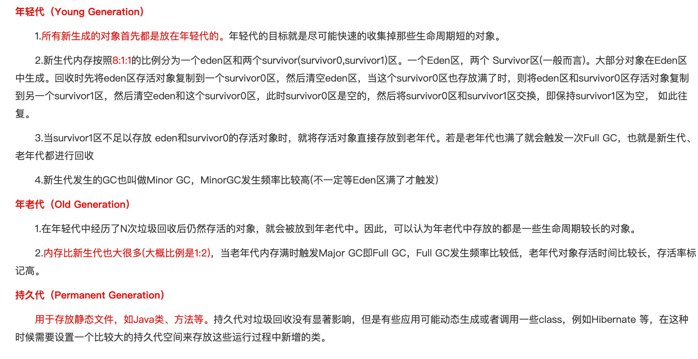

1. **抽象类和接口的区别**

	* 核心：**一个类只能继承一个抽象类，但可以实现多个接口**
	* 类含有抽象方法，为抽象类，用abstract修饰
		* 不能用来创建对象
		* 继承抽象类的类必须为抽象方法提供定义，否则也为抽象类
		* 可以拥有成员变量和普通成员方法，抽象方法必须为public或protected
	* 接口是对行为的抽象，是用interface修饰
		* 可以含有变量和方法，但会被隐式指定为public static final变量和public abstract方法，且变量必须给初值
		* 接口中的方法必须为抽象方法，一般情况下不在接口中定义变量

	

2. **JVM内存结构**

	JVM 内存共分为**虚拟机栈，堆，方法区，程序计数器，本地方法栈**五个部分

	* **虚拟机栈(线程私有)**

		* 每个方法在执行的时候会创建一个栈帧，存储**局部变量、操作数、动态链接和方法返回地址**
		* 每个方法从调用到执行完毕，对应一个栈帧在虚拟机栈中的入栈和出栈
		* 通常所说的栈，一般指虚拟机栈中的局部变量部分，局部变量所需内存在编译期间完成分配
			* 若线程请求的栈深度大于虚拟机所允许的深度，则StackOverflowError
			* 若虚拟机栈可动态扩展，扩展到无法申请足够的内存，则OutOfMemoryError

	* **堆(线程共享)**

		* 被所有线程共享的一块内存区域，在虚拟机启动的时候创建，用于**存放对象实例**
		* 当堆中没有内存可分配给实例，也无法再扩展时，则抛出OutOfMemoryError异常。

	* **方法区(线程共享)**

		* 被所有线程共享的一块内存区域，用于存储已经被虚拟机加载的**类信息、常量、静态变量**等
		* 这个区域的内存回收目标主要针对常量池的回收和堆类型的卸载

	* **程序计数器(线程私有)**

		* 线程私有
			* （java虚拟机是通过线程轮流切换并分配处理器执行时间的方式来实现，在同一时刻一个处理器内核只会执行一条线程，处理器切换线程时不会记录上一个线程执行到哪个位置，所以为了线程切换后依然能恢复到原位，每条线程都需要有各自独立的线程计数器）
		* JVM规范中唯一没有规定OutOfMemoryError情况的区域
			* （程序计数器存储的是字节码文件的行号，而这个范围是可知晓的，在一开始分配内存时就可以分配一个绝对不会溢出的内存）
		* 如果正在执行的是Native 方法，则这个计数器值为空
			* （Native方法大多是通过C实现并未编译成需要执行的字节码指令，也就不需要去存储字节码文件的行号了）

		* 是当前线程执行字节码的行号指示器，每条线程都有一个独立的程序计数器，也称线程私有的内存
		* 字节码解释器工作时就是通过改变这个计数器的值来选取下一条需要执行的字节码指令，分支、循环、跳转、异常处理、线程恢复等基础功能都需要依赖这个计数器来完成。

	* **本地方法栈(线程私有)**

		* 和虚拟机栈类似，主要为虚拟机使用到的**Native方法**服务。也会抛出StackOverflowError 和OutOfMemoryError。

	

3. **Java内存模型**

	* Java 线程之间的通信由 Java 内存模型控制，JMM 决定一个线程对共享变量的写入何时对另一个线程可见。
	* 从抽象的角度来看，JMM 定义了线程和主内存之间的抽象关系：线程之间的共享变量存储在主内存（main memory）中，每个线程都有一个私有的本地内存（local memory），本地内存中存储了该线程以读 / 写共享变量的副本。本地内存是 JMM 的一个抽象概念，并不真实存在。它涵盖了缓存，写缓冲区，寄存器以及其他的硬件和编译器优化。

	

	* 若A和B要进行通信，必须有两个步骤
		* 首先，线程A把本地内存A中更新过的共享变量刷新到主内存中去。
		* 然后，线程B到主内存中去读取线程A之前已更新过的共享变量。
		* 

	

4. **垃圾回收机制（GC）**

	* （1）什么是垃圾？
		* 对于java对象而言，没有被其他对象所引用，则该对象就是无用的
	* （2）判定垃圾的算法：**引用计数法**和**可达性分析算法**
		* 引用计数法：
			* 给对象添加一个引用计数器，每当有一个地方引用，计数器就+1，引用失效则-1
			* 任何时候计数器为0的对象就是不可能再被使用的，可以当做垃圾回收
			* 优缺点：
				* 优：执行效率高，程序执行受影响较小
				* 缺：无法检测出循环引用的情况，导致内存泄漏
		* 可达性分析算法：
			* 通过一系列”GC Roots“的对象作为起点，从这些节点向下搜索，节点所走过的路称为引用链，若一个对象到”GC Roots“没有链相连，则此对象不可用
			* 可作为”GC Roots“的对象
				* 虚拟机栈中的引用对象
				* 方法区中的常量引用对象
				* 方法区中的类静态属性引用对象
				* 本地方法栈中的引用对象
				* 活跃线程中的引用对象
	* （3）四种垃圾回收算法：**标记清除算法**、**复制算法**、**标记整理算法**以及**分代回收算法**
		* 标记清除算法
			* 分为两个阶段：标记--清除
			* 两个问题：效率问题（两阶段效率都很低），空间问题（标记清除后产生大量不连续的碎片）
		*  复制算法（新生代算法）
			* 原理：将堆中可用的新生代内存按容量分成大小相等的两块，每次只使用一块区域。当一块区域需要GC时，将此区域还存活的对象复制到另一块上，在把此区域一次性清理掉。
			* 新生代中98%的对象都是”朝生夕死”的，所以并不需要按照1 : 1的比例来划分内存空间，而是将内存(新生代内存)分为一块较大的Eden(伊甸园)空间和两块较小的Survivor(幸存者)空间，每次使用Eden和其中一块Survivor（两个Survivor区域一个称为From区，另一个称为To区域）。
			* 
			* 优：解决碎片化问题，顺序分配内存简单高效
			* 缺：只适用于存活率低的场景，如果极端情况下如果对象全部存活，就要浪费一半的存储空间
		* 标记整理算法（老年代回收算法）
			* 和标记清除算法相似，但是在标记完成之后，不是直接清理可回收对象，而是将存活对象都向一端移动，然后清理掉端边界以外的内存
			* 相比于标记清除算法，成本更高，但又解决了内存碎片的问题
		* 分代回收算法
			* 根据具体的情况选择具体的垃圾回收算法。一般将 java 堆分为新生代和老年代，这样就可以根据各个年代的特点选择合适的垃圾收集算法。
			* 新生代：复制算法
			* 老年代：标记清除算法 或 标记整理算法
	* 

	

5. **反射**

	* 定义：在运行状态中，对于任意一个类，都能够获取这个类的所有属性和方法，对于任意一个对象，都能够调用它的任意一个方法和属性（包括私有方法和属性），这种动态获取的信息以及动态调用对象的功能叫反射机制。

	* 要想使用反射机制，必须要获取到该类的字节码文件对象（.class），获取方式(三种)

		```java
		// 1 通过Class类中的静态方法forName，直接获取到一个类的字节码文件对象，此时该类还是源文件阶段，并没有变为字节码文件
		Class clazz1 = Class.forName("com.komorebi.pojo.User");
		// 2 当类被加载成.class文件时，此时Person类变成了.class，在获取该字节码文件对象，也就是获取自己，该类处于字节码阶段。
		Class clazz2  = Person.class;
		// 3 通过类的实例获取该类的字节码文件对象，该类处于创建对象阶段　
		Class clazz3 = p.getClass();
		```

	* 得到.class之后，创建实例对象

		```java
		// 无参
		User user = (User)clazz1.newInstance();
		// 有参
		Constructor constructor = clazz1.getConstructor(int.class, String.class);
		User user = (User)constructor.newInstance(12, "XX");
		// 获取成员变量
		Field field = clazz1.getDeclaredField("id");
		```

	* 动态代理：一种设计模式（火车票让人代买），实际上就是通过反射来生成一个代理

		* java.lang.reflect包下提供了一个**Proxy**类和一个**InvocationHandler**接口，通过使用这个类和接口就可以生成动态代理对象
		* 步骤：
			* 1 new 出代理对象，通过实现InvacationHandler接口，然后new出代理对象
			* 2 通过Proxy类的静态方法newProxyInstance，来将代理对象假装成那个被代理的对象
			* 3 执行

	* 优缺点：

		* 优点：可以实现动态创建对象和编译
		* 缺点：对性能有影响

	

6. **异常处理**

	* 定义：异常是一个事件，发生在程序运行期间，干扰了正常的指令流程。Java通过Throwable类的众多子类描述各种不同的异常。因而，Java异常都是对象，是Throwable子类的实例，描述了出现在一段编码中的错误条件。
		
	* 

7. **Log4j**

8. **lambda表达式**

9. **String、StringBuilder、StringBuffer区别**

10. **ArrayList、LinkedList、Vector的区别**

11. **ArrayList和Vector的扩容机制**

12. **HashMap的底层实现**

13. **ajax和form表单提交有啥不一样**

14. **创建线程池、线程池的运行机制和拒绝策略**

15. **Lock和Sychronized的区别**

16. **synchronized的实现和机制，锁升级机制**

17. **关于锁了解多少，知道lock这个锁的底层原理**（sync和volatile；CAS；无锁，偏向锁，轻量锁和重量锁）

18. **乐观锁、悲观锁**

19. **Java对象头前32位标识的含义**

20. **线程池初始化的7大参数，各个组件的作用**

21. **实现多线程同步的方式（继承Thread，实现Runnable，实现Callable）**

22. 

