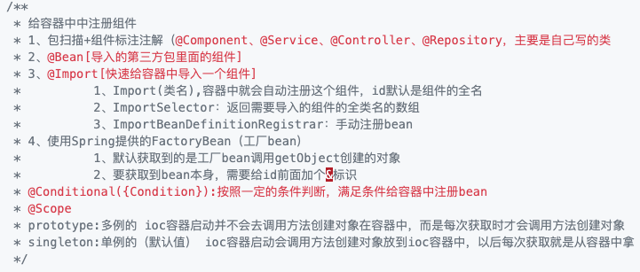
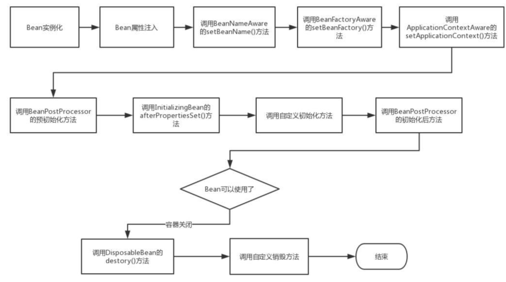
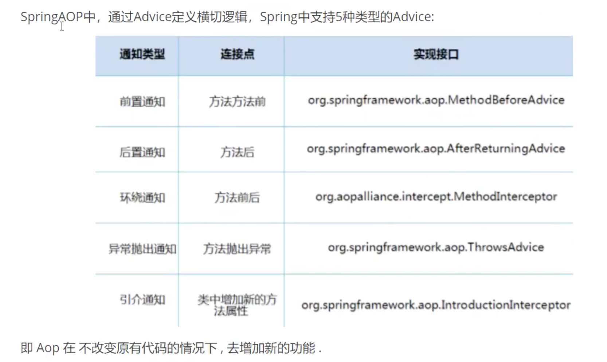
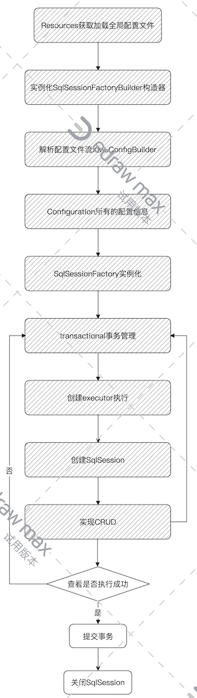
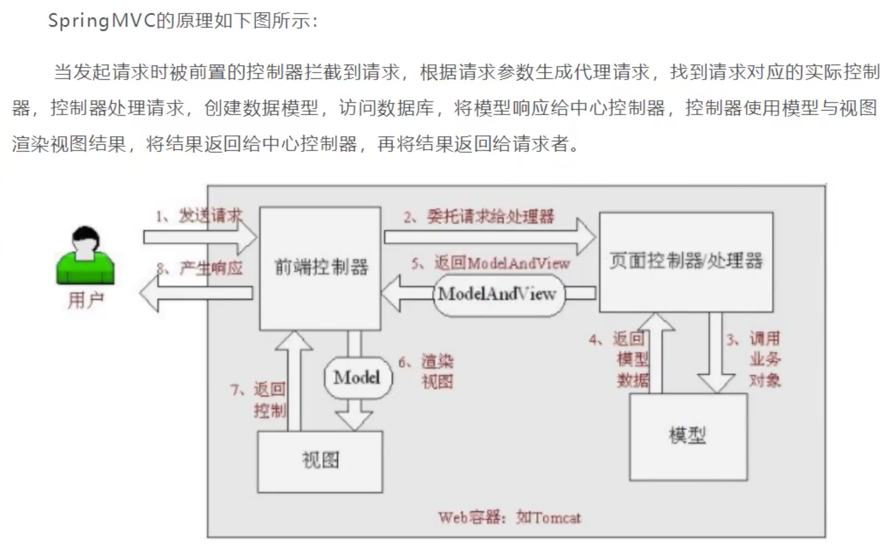
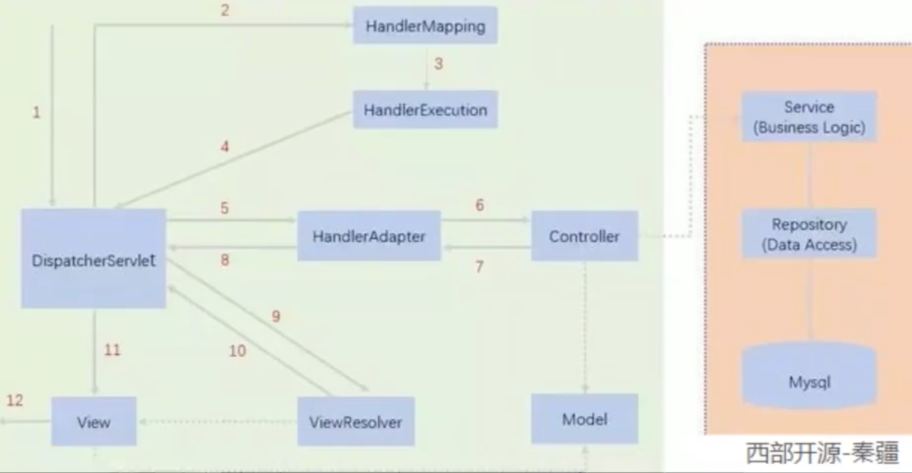
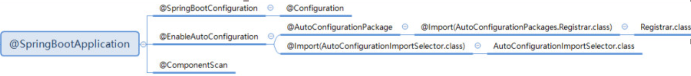

[TOC]

### 1 IOC（原理，使用）

==Spring是一个轻量级的控制反转（IOC）和面向切面编程的框架！==

​		**控制反转（IOC）是一种设计思想，DI（依赖注入）是实现IOC的一种方法**。没有IOC的程序中，我们使用面向对象编程，对象的创建与对象间的依赖关系完全硬编码在程序中，对象的创建由程序自己控制，控制反转后将对象的创建转移给第三方，认为所谓控制反转就是：**获得依赖对象的方式反转了**

* 采用XML方式配置Bean的时候，Bean的定义信息是和实现分离的，而采用注解的方式可以把两者合为一体，Bean的定义信息直接以注解的形式定义在实现类中，从而达到了零配置的目的
* **控制反转是一种通过描述（XML或注解）并通过第三方去生产或获取特定对象的方式。在Spring中实现控制反转的是IOC容器，其实现方法是依赖注入（Dependency Injection, DI）。**
* **注册组件的四种方式**
	
	* `Bean`中可以细分三种方式：构造器、set、拓展方式注入
	
	* **对象创建**
	
		1、从xml配置的Bean,@Bean注解，或者Java代码BeanDefinitionBuilder中读取Bean的定义,实例化Bean对象；
	
		2、设置Bean的属性；
	
		3、注入Aware的依赖（BeanNameAware,BeanFactoryAware,ApplicationContextAware）;
	
		4、执行通用的方法前置处理，方法： BeanPostProcessor.postProcessorBeforeInitialization()
	
		5、执行 InitalizingBean.afterPropertiesSet() 方法
	
		6、执行Bean自定义的初始化方法init,或者 @PostConstruct 标注的方法；
	
		7、执行方法BeanPostProcessor.postProcessorAfterInitialization()
	
		8、创建对象完毕；
	
		**对象销毁**
	
		9、执行 DisposableBean.destory() 方法；
	
		10、执行自定义的destory方法或者 @PreDestory 标注的方法；
	
		11、销毁对象完毕
	
	* Bean生命周期
		
	
	* `Bean`作用域（单例、原型、Request、Session）：
		
		* 单例模式（默认）：当一个bean的作用域为Singleton，那么Spring IoC容器中只会存在一个共享的bean实例，并且所有对bean的请求，只要id与该bean定义相匹配，则只会返回bean的同一实例。Singleton是单例类型，**就是在创建起容器时就同时自动创建了一个bean的对象，不管你是否使用，他都存在了，每次获取到的对象都是同一个对象**。
		* 原型模式：当一个bean的作用域为Prototype，表示一个bean定义对应多个对象实例。Prototype作用域的bean会导致在每次对该bean请求（将其注入到另一个bean中，或者以程序的方式调用容器的getBean()方法）时都会创建一个新的bean实例。**Prototype是原型类型，它在我们创建容器的时候并没有实例化，而是当我们获取bean的时候才会去创建一个对象，而且我们每次获取到的对象都不是同一个对象。**


### 2 AOP（原理，为什么提出）

1. AOP（Aspect Oriented Programming）意为：面向切面编程，通过**预编译方式**和**运行期动态代理**实现程序功能统一维护的一种技术。AOP是OOP的延续，是函数式编程的一种衍生笵型。利用AOP可以对业务逻辑的各个部分进行隔离，从而使得业务逻辑各部分之间的耦合度降低，提高程序的可重用性，同时提高了开发的效率
	**作用**：==提供声明式事务；允许用户自定义切面==

	* 横切关注点：跨越应用程序多个模块的方法或功能，即是，与业务逻辑无关的，但是需要关注的部分，就是横切关注点。如日志、安全、缓存、事务等等
	* 切面（Aspect）：横切关注点，被模块化的特殊对象。即，是一个类
	* 通知（Advice）：切面必须要完成的工作。即，类中的一个方法
	* 目标（Target）：被通知对象
	* 代理（Proxy）：想目标对象应用通知后创建的对象
	* 切入点（PointCut）：切面通知执行的“地点”的定义
	* 连接点（JointPoint）：与切入点匹配的执行点

2. 五种类型：

3. 实现AOP的三种方式

	1. **使用Spring的API接口**（接口，xml中配置）

		```xml
		<!--方式一：使用原生Spring API接口-->
		    <!--配置aop:需要导入AOP的约束-->
		    <aop:config>
		        <!--切入点-->
		        <aop:pointcut id="pointcut" expression="execution(* com.komorebi.service.UserServiceImpl.*(..))"/>
		        <!--执行环绕增强-->
		        <aop:advisor advice-ref="log" pointcut-ref="pointcut"/>
		        <aop:advisor advice-ref="afterLog" pointcut-ref="pointcut"/>
		    </aop:config>
		```

	2. **使用自定义类来实现**（切面，xml中配置）

		```xml
		<!--方式二：自定义类-->
		<bean id="diy" class="com.komorebi.diy.DiyPointCut"/>
		<aop:config>
		    <!--自定义切面，ref要引用的类-->
		    <aop:aspect ref="diy">
		        <!--切入点-->
		        <aop:pointcut id="point" expression="execution(* com.komorebi.service.UserServiceImpl.*(..))"/>
		        <!--通知-->
		        <aop:before method="before" pointcut-ref="point"/>
		        <aop:after method="after" pointcut-ref="point"/>
		    </aop:aspect>
		</aop:config>
		```

	3. **注解**

		```java
		@Aspect     // 标注一个类是切面
		@Before("execution(* com.komorebi.service.UserServiceImpl.*(..))")
		@After("execution(* com.komorebi.service.UserServiceImpl.*(..))")
		@Around("execution(* com.komorebi.service.UserServiceImpl.*(..))")  // around中的before优于Before
		```


### 3 Mybatis流程

MyBatis 是一款优秀的**持久层**框架：

* 内存：**断电即失**
* 数据库(JDBC)：io文件持久化

**Mybatis详细流程**：



### 4 SpringMVC的常用注解

* `RequestMapping`
* `GetMapping`
* `PostMapping`
* `PathVariable`


### 5 SpringMVC的工作机制




### 6 SpringMVC的底层原理



1. DispatcherServlet表示前置控制器，是整个SpringMVC的控制中心。用户发出请求，DispatcherServlet接收请求并拦截请求
2. HanderMapping为处理器映射。DispatcherServlet调用HanderMapping，HanderMapping根据请求url查找Handler
3. HandlerExecution表示具体Handler。其主要作用是根据url查找控制器，如上url被查找控制器为：hello
4. HandlerExecution将解析后的信息传递给DispatcherServlet，如解析控制器映射等
5. HandlerAdapter表示处理器适配器，其按照特定的规则去执行Handler
6. Handler让具体的Controller执行
7. Controller将具体的执行信息返回给HandlerAdapter，如ModelAndView
8. HandlerAdapter将视图逻辑名或模型传递给DispatcherServlet
9. DispatcherServlet调用视图解析器（ViewResolver）来解析HandlerAdapter传递的逻辑视图名
10. 视图解析器将解析的逻辑视图名传给DispatcherServlet
11. DispatcherServlet根据视图解析器解析出的视图结果，调用具体的视图
12. 最终视图呈现给用户


### 7 SpringBoot自动装配




https://www.cnblogs.com/lzh-boke/p/11876679.html

* `SpringBootConfiguration`:其实就是Spring中的@Configuration，用于标注配置类
* `ComponentScan:`用来将**指定包**下**需要装配的组件**注册到容器中
* `EnableAutoConfiguration`:配置自动装配
	* `AutoConfigurationPackage`:将**主配置类所在的包**作为**自动配置包**进行管理
	* `Import`:导入一个类到IOC容器

