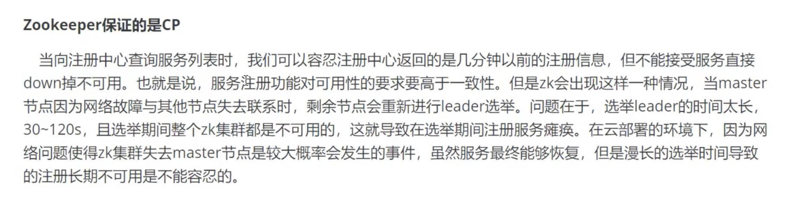
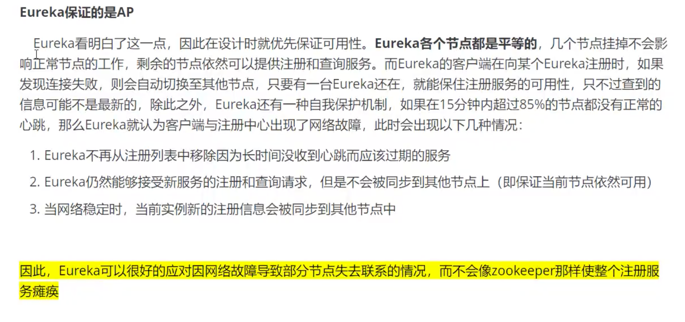
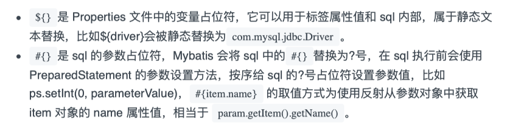

[TOC]

### 1 IOC

==Spring是一个轻量级的控制反转（IOC）和面向切面编程的框架！==

​		**控制反转（IOC）是一种设计思想，DI（依赖注入）是实现IOC的一种方法**。没有IOC的程序中，我们使用面向对象编程，对象的创建与对象间的依赖关系完全硬编码在程序中，对象的创建由程序自己控制，控制反转后将对象的创建转移给第三方，认为所谓控制反转就是：**获得依赖对象的方式反转了**。

* 采用XML方式配置Bean的时候，Bean的定义信息是和实现分离的，而采用注解的方式(`@Configuration`)可以把两者合为一体，Bean的定义信息直接以注解的形式定义在实现类中，从而达到了零配置的目的。
* **控制反转是一种通过描述（XML或注解）并通过第三方去生产或获取特定对象的方式。在Spring中实现控制反转的是IOC容器，其实现方法是依赖注入（Dependency Injection, DI）。**
* **注册组件的四种方式**
* `Bean`中可以细分三种方式：构造器、set、拓展方式注入
	* **Bean生命周期**
		
	* **`Bean`作用域（单例、原型、Request、Session）**：
		* 单例模式（默认）：当一个bean的作用域为Singleton，那么Spring IoC容器中只会存在一个共享的bean实例，并且所有对bean的请求，只要id与该bean定义相匹配，则只会返回bean的同一实例。Singleton是单例类型，**就是在创建起容器时就同时自动创建了一个bean的对象，不管你是否使用，他都存在了，每次获取到的对象都是同一个对象**。
		* 原型模式：当一个bean的作用域为Prototype，表示一个bean定义对应多个对象实例。Prototype作用域的bean会导致在每次对该bean请求（将其注入到另一个bean中，或者以程序的方式调用容器的getBean()方法）时都会创建一个新的bean实例。**Prototype是原型类型，它在我们创建容器的时候并没有实例化，而是当我们获取bean的时候才会去创建一个对象，而且我们每次获取到的对象都不是同一个对象。**
	* **BeanFactory和FactoryBean**：
		* BeanFactory：BeanFactory定义了IOC容器的最基本形式，并提供了IOC容器应遵守的的最基本的接口，也就是Spring IOC所遵守的最底层和最基本的编程规范。在Spring代码中，BeanFactory只是个接口，并不是IOC容器的具体实现，但是Spring容器给出了很多种实现，如 DefaultListableBeanFactory、XmlBeanFactory、ApplicationContext等，都是附加了某种功能的实现。
		* FactoryBean：一般情况下，Spring通过反射机制利用bean的class属性指定实现类实例化Bean，在某些情况下，实例化Bean过程比较复杂，如果按照传统的方式，则需要在bean中提供大量的配置信息。配置方式的灵活性是受限的，这时采用编码的方式可能会得到一个简单的方案。Spring为此提供了一个org.springframework.bean.factory.FactoryBean的工厂类接口，用户可以通过实现该接口定制实例化Bean的逻辑。
			


### 2 AOP

1. AOP（Aspect Oriented Programming）意为：面向切面编程，通过**预编译方式**和**运行期动态代理**实现程序功能统一维护的一种技术。AOP是OOP的延续，是函数式编程的一种衍生笵型。利用AOP可以对业务逻辑的各个部分进行隔离，从而使得业务逻辑各部分之间的耦合度降低，提高程序的可重用性，同时提高了开发的效率
	**作用**：==提供声明式事务；允许用户自定义切面==

	* 横切关注点：跨越应用程序多个模块的方法或功能，即是，与业务逻辑无关的，但是需要关注的部分，就是横切关注点。如日志、安全、缓存、事务等等
	* 切面（Aspect）：横切关注点，被模块化的特殊对象。即，是一个类
	* 通知（Advice）：切面必须要完成的工作。即，类中的一个方法
	* 目标（Target）：被通知对象
	* 代理（Proxy）：想目标对象应用通知后创建的对象
	* 切入点（PointCut）：切面通知执行的“地点”的定义
	* 连接点（JointPoint）：与切入点匹配的执行点

2. 五种类型：

3. 实现AOP的三种方式

	1. **使用Spring的API接口**（接口，xml中配置）

		```xml
		<!--方式一：使用原生Spring API接口-->
		    <!--配置aop:需要导入AOP的约束-->
		    <aop:config>
		        <!--切入点-->
		        <aop:pointcut id="pointcut" expression="execution(* com.komorebi.service.UserServiceImpl.*(..))"/>
		        <!--执行环绕增强-->
		        <aop:advisor advice-ref="log" pointcut-ref="pointcut"/>
		        <aop:advisor advice-ref="afterLog" pointcut-ref="pointcut"/>
		    </aop:config>
		```

	2. **使用自定义类来实现**（切面，xml中配置）

		```xml
		<!--方式二：自定义类-->
		<bean id="diy" class="com.komorebi.diy.DiyPointCut"/>
		<aop:config>
		    <!--自定义切面，ref要引用的类-->
		    <aop:aspect ref="diy">
		        <!--切入点-->
		        <aop:pointcut id="point" expression="execution(* com.komorebi.service.UserServiceImpl.*(..))"/>
		        <!--通知-->
		        <aop:before method="before" pointcut-ref="point"/>
		        <aop:after method="after" pointcut-ref="point"/>
		    </aop:aspect>
		</aop:config>
		```

	3. **注解**

		```java
		@Aspect     // 标注一个类是切面
		@Before("execution(* com.komorebi.service.UserServiceImpl.*(..))")
		@After("execution(* com.komorebi.service.UserServiceImpl.*(..))")
		@Around("execution(* com.komorebi.service.UserServiceImpl.*(..))")  // around中的before优于Before
		```


### 3 Mybatis流程

MyBatis 是一款优秀的**持久层**框架：

* 内存：**断电即失**
* 数据库(JDBC)：io文件持久化

**Mybatis详细流程**：


### 4 Spring中用到的设计模式

* **工厂模式**：Spring使用工厂模式通过`BeanFactory`、`ApplicationContext`创建bean对象
* **代理模式**：AOP
* **单例模式**：Bean
* **包装器模式**：项目需要多个数据库，而且不同用户每次访问中根据需要访问不同的数据库。这种模式可以让客户动态切换不同的数据源
* **观察者模式**：Spring事件驱动模型
* **适配器模式**：MVC中用适配器模式适配`Controller`


### 5 SpringMVC的工作机制


### 6 SpringMVC的底层原理


1. DispatcherServlet表示前置控制器，是整个SpringMVC的控制中心。用户发出请求，DispatcherServlet接收请求并拦截请求
2. HanderMapping为处理器映射。DispatcherServlet调用HanderMapping，HanderMapping根据请求url查找Handler
3. HandlerExecution表示具体Handler。其主要作用是根据url查找控制器，如上url被查找控制器为：hello
4. HandlerExecution将解析后的信息传递给DispatcherServlet，如解析控制器映射等
5. HandlerAdapter表示处理器适配器，其按照特定的规则去执行Handler
6. Handler让具体的Controller执行
7. Controller将具体的执行信息返回给HandlerAdapter，如ModelAndView
8. HandlerAdapter将视图逻辑名或模型传递给DispatcherServlet
9. DispatcherServlet调用视图解析器（ViewResolver）来解析HandlerAdapter传递的逻辑视图名
10. 视图解析器将解析的逻辑视图名传给DispatcherServlet
11. DispatcherServlet根据视图解析器解析出的视图结果，调用具体的视图
12. 最终视图呈现给用户


### 7 SpringBoot自动装配


https://www.cnblogs.com/lzh-boke/p/11876679.html

* `SpringBootConfiguration`:其实就是Spring中的@Configuration，用于标注配置类
* `ComponentScan:`用来将**指定包**下**需要装配的组件**注册到容器中
* `EnableAutoConfiguration`:配置自动装配
	* `AutoConfigurationPackage`:将**主配置类所在的包**作为**自动配置包**进行管理
	* `Import`:导入一个类到IOC容器

**完整过程**

1. 自动装配的时候，要先从`SpringApplication.run()`方法开始
	1. 第一个就是创建ApplicationContext容器。（在创建ApplicationContext时，会根据用户是否明确设置了`ApplicationContextClass`类型以及初始化阶段的推断结果，决定为当前SpringBoot应用创建什么类型的ApplicationContext。）
	2. 第二个是刷新ApplicationContext容器。
2. 初始化各种插件在异常失败后给出的提示
3. 执行准备刷新上下文的一些操作。其实`prepareContext()`方法也是非常关键的，它起到了一个承上启下的作用。
	1. `getAllSoures()`方法，这个方法中，获取到的一个source就是启动类DemoApplication，通过获取这个启动类就可以在后load()方法中取加载这个启动类到容器中
	2. 通过`listeners.contextLoaded(context)`将所有监听器加载到ApplicationContext容器中。
4. 通过SpringApplication的`load()`方法，去加载启动类，然后在刷新容器的时候就会去将启动类在容器中进行实例化。

**结论：SpringBoot在启动的时候会调用run()方法，run()方法会刷新容器，刷新容器的时候，会扫描classpath下面的的包中META-INF/spring.factories文件，在这个文件中记录了好多的自动配置类，在刷新容器的时候会将这些自动配置类加载到容器中，然后在根据这些配置类中的条件注解，来判断是否将这些配置类在容器中进行实例化，这些条件主要是判断项目是否有相关jar包或是否引入了相关的bean。**


### 8 CAP原则

*  RDBMS（Mysql  Oracle  sqlServer） -->  ACID
*  NoSQL （Redis  MongDB） --> CAP 
*  **ACID**：
	* A（Atomicity）：原子性
	* C（Consistency）：一致性
	* I（Isolation）：隔离性
	* D（Durability）：持久性
*  **CAP**：（三进二）
	* C（Consistency）：强一致性
	* A（Availability）：可用性
	* P（Partition tolerance）：分区容错性
	* 
	* 


### 9 @RestController 和 @Controller 的区别

**Controller返回⼀个⻚⾯**

​		单独使⽤ @Controller 不加 @ResponseBody 的话⼀般使⽤在要返回⼀个视图的情况，这种情况 属于⽐较传统的Spring MVC 的应⽤，对应于前后端不分离的情况。

**@RestController 返回JSON 或 XML 形式数据**

​		 @RestController 只返回对象，对象数据直接以 JSON 或 XML 形式写⼊ HTTP 响应 (Response)中，这种情况属于 RESTful Web服务，这也是⽬前⽇常开发所接触的最常⽤的情况 （前后端分离）

**@Controller +@ResponseBody 返回JSON 或 XML 形式数据**

​		@Controller + @ResponseBody = @RestController

**@ResponseBody**

​		@ResponseBody 注解的作⽤是将Controller 的⽅法返回的对象通过适当的转换器转换为指定的格式之后，写⼊到HTTP 响应(Response)对象的 body 中，通常⽤来返回 JSON 或者 XML 数据，返回 JSON 数据的情况⽐较多。


### 10 @Component 和 @Bean 的区别

1. **作⽤对象不同**: @Component 注解作⽤于类，⽽ @Bean 注解作⽤于⽅法。

2. @Component 通常是通过类路径扫描来⾃动侦测以及⾃动装配到Spring容器中（我们可以使 ⽤ @ComponentScan 注解定义要扫描的路径从中找出标识了需要装配的类⾃动装配到 Spring 的 bean 容器中）。 @Bean 注解通常是我们在标有该注解的⽅法中定义产⽣这个 bean, @Bean 告诉了Spring这是某个类的示例，当我需要⽤它的时候还给我。

3. @Bean 注解⽐ Component 注解的⾃定义性更强，⽽且很多地⽅我们只能通过 @Bean 注 解来注册bean。⽐如当我们引⽤第三⽅库中的类需要装配到 Spring 容器时，则只能通过 @Bean 来实现。


### 11 Mybatis 是如何进⾏分⻚的？分⻚插件的原理是什么？

​        Mybatis 使⽤ RowBounds 对象进⾏分⻚，它是针对 ResultSet 结果集执⾏的内存分⻚，⽽ ⾮物理分⻚，可以在 sql 内直接书写带有物理分⻚的参数来完成物理分⻚功能，也可以使⽤分⻚ 插件来完成物理分⻚。

​		分⻚插件的基本原理是使⽤ Mybatis 提供的插件接⼝，实现⾃定义插件，在插件的拦截⽅法内拦 截待执⾏的 sql，然后重写 sql，根据 dialect ⽅⾔，添加对应的物理分⻚语句和物理分⻚参数。


### 12 ajax和form表单提交有啥不一样

1. ajax在提交、请求、接收时，都是异步进行的，网页不需要刷新
	form提交是新建一个页面，即使是提交给自己本身的页面，也是需要刷新的
2. ajax提交时，是在后台新建一个请求
	form表单是放弃本页面，再次申请
3. ajax必须用js实现，不启动js的浏览器，无法完成
	form是浏览器的功能，无论是否开启js，都可以提交表单
4. ajax在提交、请求、接收时，整个过程都需要使用程序来对其数据进行处理
	form提交时，是根据表单结构自动完成，不需要代码干预


### 13  get、post和put区别

**PUT和POST**

> PUT和POST都有更改指定URI的语义.但PUT被定义为idempotent的方法，POST则不是.idempotent的方法:如果一个方法重复执行
>
> 多次**，产生的效果是一样的，那就是idempotent的**。也就是说：

PUT请求：如果两个请求相同，后一个请求会把第一个请求覆盖掉。**（所以PUT用来改资源）**

Post请求：后一个请求不会把第一个请求覆盖掉。**（所以Post用来增资源）**

**get和post**

1. **GET参数通过URL传递，POST放在Request body中。**
2. GET请求会被浏览器主动cache，而POST不会，除非手动设置。
3. GET请求参数会被完整保留在浏览器历史记录里，而POST中的参数不会被保留。
4. Get 请求中有非 ASCII 字符，会在请求之前进行转码，POST不用，因为POST在Request body中，通过 MIME，也就可以传输非 ASCII 字符。
5. 一般我们在浏览器输入一个网址访问网站都是GET请求
6. HTTP的底层是TCP/IP。HTTP只是个行为准则，**而TCP才是GET和POST怎么实现的基本**。GET/POST都是TCP链接。GET和POST能做的事情是一样一样的。但是请求的数据量太大对浏览器和服务器都是很大负担。所以业界有了不成文规定，（大多数）浏览器通常都会限制url长度在2K个字节，而（大多数）服务器最多处理64K大小的url。
7. **GET产生一个TCP数据包；POST产生两个TCP数据包**。对于GET方式的请求，浏览器会把http header和data一并发送出去，服务器响应200（返回数据）；而对于POST，浏览器先发送header，服务器响应100 continue，浏览器再发送data，服务器响应200 ok（返回数据）。
8. 在网络环境好的情况下，发一次包的时间和发两次包的时间差别基本可以无视。而在网络环境差的情况下，两次包的TCP在验证数据包完整性上，有非常大的优点。但并不是所有浏览器都会在POST中发送两次包，Firefox就只发送一次。


### 14 Mybatis 中$与#的区别



**#{}是将传入的值当做字符串的形式**

```sql
select id,name,age from student where id =#{id}
```

​		前端把id值1，传入到后台的时候，就相当于 

```sql
select id,name,age from student where id ='1'
```

**${}是将传入的数据直接显示生成sql语句**

```sql
select id,name,age from student where id =​${id},
```

​		当前端把id值1，传入到后台的时候，就相当于 

```sql
select id,name,age from student where id = 1
```

 3 使用#可以很大程度上防止sql注入。(语句的拼接)

 4 但是如果使用在order by 中就需要使用 $.


### 15 Spring事务

> 分为两种：
>
> ​		编程式事务，在代码中实现
>
> ​		声明式事务，在配置文件中配置（基于XML或者注解）

**隔离级别**（`TransactionDefinition`接口定义了5种）

* `Transaction.ISOLATION_DEFAULT`：使用后端数据库默认的隔离级别
* `Transaction.ISOLATION_READ_UNCOMMITTED`：读未提交
* `Transaction.ISOLATION_READ_COMMITTED`：读提交
* `Transaction.ISOLATION_REPEATABLE_READ`：可重复读
* `Transaction.ISOLATION_SERIALIZABLE`：串行化

**事务传播行为**

* 支持当前事务
	* `TransactionDefinition.PROPAGATION_REQUIRED`： 如果当前存在事务，则加⼊该事 务；如果当前没有事务，则创建⼀个新的事务。
	* `TransactionDefinition.PROPAGATION_SUPPORTS`： 如果当前存在事务，则加⼊该事 务；如果当前没有事务，则以⾮事务的⽅式继续运⾏。
	* `TransactionDefinition.PROPAGATION_MANDATORY`： 如果当前存在事务，则加⼊该事 务；如果当前没有事务，则抛出异常。（mandatory：强制性）
* 不支持当前事务
	* `TransactionDefinition.PROPAGATION_REQUIRES_NEW`： 创建⼀个新的事务，如果当 前存在事务，则把当前事务挂起。
	* `TransactionDefinition.PROPAGATION_NOT_SUPPORTED`： 以⾮事务⽅式运⾏，如果 当前存在事务，则把当前事务挂起。
	* `TransactionDefinition.PROPAGATION_NEVER`： 以⾮事务⽅式运⾏，如果当前存在事 务，则抛出异常。
* 其他
	* `TransactionDefinition.PROPAGATION_NESTED`： 如果当前存在事务，则创建⼀个事务 作为当前事务的嵌套事务来运⾏；如果当前没有事务，则该取值等价于 TransactionDefinition.PROPAGATION_REQUIRED。

**@Transactional**

@Transactional(rollbackFor = Exception.class)注解

​		我们知道：Exception分为运⾏时异常RuntimeException和⾮运⾏时异常。事务管理对于企业应 ⽤来说是⾄关重要的，即使出现异常情况，它也可以保证数据的⼀致性。

​		当 @Transactional 注解作⽤于类上时，该类的所有 public ⽅法将都具有该类型的事务属性，同 时，我们也可以在⽅法级别使⽤该标注来覆盖类级别的定义。如果类或者⽅法加了这个注解，那 么这个类⾥⾯的⽅法抛出异常，就会回滚，数据库⾥⾯的数据也会回滚。

​		在 @Transactional 注解中如果不配置 rollbackFor 属性,那么事物只会在遇到 RuntimeException 的 时候才会回滚,加上 rollbackFor=Exception.class ,可以让事物在遇到⾮运⾏时异常时也回滚。


### 16 Mybatis动态sql

​		Mybatis 动态 sql 可以让我们在 Xml 映射⽂件内，以标签的形式编写动态 sql，完成逻辑判断 和动态拼接 sql 的功能，Mybatis 提供了 9 种动态 sql 标签` trim|where|set|foreach|if|choose|when|otherwise|bind `。

其执⾏原理为，使⽤ OGNL 从 sql 参数对象中计算表达式的值，根据表达式的值动态拼接 sql， 以此来完成动态 sql 的功能。


### 17 RPC 

> ​		RPC （Remote Procedure Call）是指远程过程调用，是一种进程间通信方式，他是一种技术的思想，而不是规范。它允许程序调用另一个地址空间（通常是共享网络的另一台机器上）的过程或函数，而不用程序员显式编码这个远程调用的细节。即程序员无论是调用本地的还是远程的函数，本质上编写的调用代码基本相同。
> ​		也就是说两台服务器A，B，一个应用部署在A服务器上，想要调用B服务器上应用提供的函数/方法，由于不在一个内存空间，不能直接调用，需要通过网络来表达调用的语义和传达调用的数据。为什么要用RPC呢？就是无法在一个进程内，甚至个计算机内通过本地调用的方式完成的需求，比如不同的系统间的通讯，甚至不同的组织间的通讯，由于计算能力需要横向扩展，需要在多台机器组成的集群上部署应用。RPC就是要像调用本地的函数一样去调远程函数；


### 18 Java序列化

> 1、序列化：将对象写入到IO流中
> 2、反序列化：从IO流中恢复对象
> 3、意义：序列化机制允许将实现序列化的Java对象转换位字节序列，这些字节序列可以保存在磁盘上，或通过网络传输，以达到以后恢复成原来的对象。序列化机制使得对象可以脱离程序的运行而独立存在。
> 4、使用场景：所有可在网络上传输的对象都必须是可序列化的，比如RMI（remote method invoke,即远程方法调用），传入的参数或返回的对象都是可序列化的，否则会出错；所有需要保存到磁盘的java对象都必须是可序列化的。通常建议：程序创建的每个JavaBean类都实现Serializeable接口。
> 5、如果想让某个变量不被序列化，使用**transient**修饰。

**实现方式**

* 如果需要将某个对象保存到磁盘上或者通过网络传输，那么这个类应该实现**Serializable**接口或者**Externalizable**接口之一。
* **Serializable**
	* 序列化步骤一：创建一个ObjectOutputStream输出流；
	* 序列化步骤二：调用ObjectOutputStream对象的writeObject输出可序列化对象。
	* 反序列化步骤一：创建一个ObjectInputStream输入流；
	* 反序列化步骤二：调用ObjectInputStream对象的readObject()得到序列化的对象
* **Externalizable**：强制自定义序列化


**Java序列化算法**（**Java序列化同一对象，并不会将此对象序列化多次得到多个对象。**）

- 所有保存到磁盘的对象都有一个序列化编码号
- 当程序试图序列化一个对象时，会先检查此对象是否已经序列化过，只有此对象从未（在此虚拟机）被序列化过，才会将此对象序列化为字节序列输出。
- 如果此对象已经序列化过，则直接输出编号即可。

