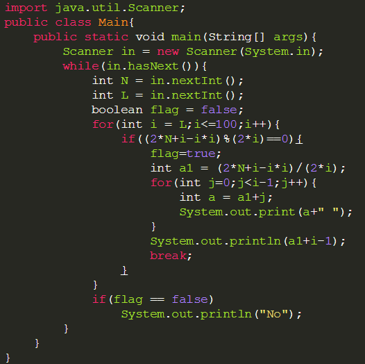

* 交互式做题模板

```java
// 交互式模板
public static void main(String[] args) {
    Scanner scanner = new Scanner(System.in);
    
    String str1 = scanner.nextLine();
    String str2 = scanner.nextLine();

    System.out.println(find(str1,str2));
}

public static int find(String str1,String str2){
    int a = 0;
    int t = 0;
    for(int i =0; i< str1.length();i++){
        if(str1.charAt(i) =='A' && str2.charAt(i)!='A'){
            a++;
        }
        if(str1.charAt(i) =='T' && str2.charAt(i)!='T'){
            t++;
        }
    }
    return Math.max(a,t);
}

public static void main(String[] args) {
    Scanner scanner = new Scanner(System.in);
    int len = Integer.parseInt(scanner.nextLine());
    int[] ans = new int[len];
    //int len = scanner.nextInt();
    for (int i = 0; i < len; i++) {
        String[] array = scanner.nextLine().split(" ");
        int n = Integer.parseInt(array[0]);
        int k = Integer.parseInt(array[1]);
        String[] nums = scanner.nextLine().split(" ");
        int[] nums2 = new int[nums.length];
        for (int j = 0; j < nums.length; j++) {
            nums2[j] = Integer.parseInt(nums[j]);
        }
        ans[i] = find(n, k, nums2);
    }

    for (int i = 0; i < len; i++) {
        System.out.println(ans[i]);
    }
}
```



