[TOC]

# 秒杀系统

> **项目描述：**
>
> * 秒杀系统以SpringBoot为核心，结合了MySQL、Redis和RabbitMQ这几个中间件，也将一些通用的返回值、Key、包括Redis的基本操作做一个封装。
> * 首先实现了登录功能，在完成数据库设计之后，将明文密码做两次MD5处理，然后实现参数校验和全局异常处理，最后用Redis实现一个分布式Session。
> * 下一步实现秒杀功能，基于MVC架构设计实现，写了几个基础的秒杀页面，并在前端页面上，用JS实现一个基本的倒计时功能。然后开始做压测，用JMeter作为压测工具，设置5000用户，每秒点5次，QPS一开始是1200。
> * 再往下就开始优化，第一个角度是页面优化，最开始是通过Redis实现页面、URL和对象的缓存，但是提升不大（1800）；再进一步做了页面的静态化处理，QPS提升到2800。
> * 继续做接口优化，减少数据库访问，主要思路就是RabbitMQ+Redis+MySQL的结合使用，QPS最终能到达3500。
> 	1. 系统初始化，把商品库存加载到Redis
> 	2. 收到请求，Redis预减库存，库存不足，直接返回，否则进入3
> 	3. 请求入队，立即返回排队中（目前不知道队中是否会失败，所以只返回排队中）
> 	4. 请求出队，生成订单，减少库存
> 	5. 客户端轮询，是否秒杀成功（4 5是并发执行的）
> * 最后做安全优化，主要就是三个角度：接口地址隐藏、验证码和接口防刷的设计。

## 一、项目框架

### 1.1 SpringBoot环境搭建

1. 新建Maven项目，添加依赖(父依赖SpringBoot，还有正常依赖web和thymeleaf)

	```xml
	<!--SpringBoot-->
	<parent>
	    <artifactId>spring-boot-starter-parent</artifactId>
	    <groupId>org.springframework.boot</groupId>
	    <version>2.4.2</version>
	</parent>
	
	<!--Web-->
	<dependency>
	    <groupId>org.springframework.boot</groupId>
	    <artifactId>spring-boot-starter-web</artifactId>
	</dependency>
	<!--thymeleaf-->
	<dependency>
	    <groupId>org.springframework.boot</groupId>
	    <artifactId>spring-boot-starter-thymeleaf</artifactId>
	</dependency>
	```

2. 构建项目结构
	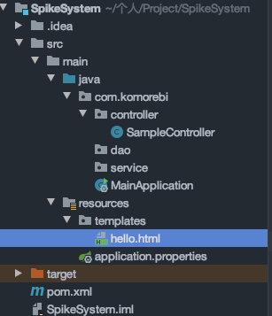

3. 集成thymeleaf

	```properties
	#thymeleaf
	spring.thymeleaf.prefix=classpath:/templates/
	spring.thymeleaf.suffix=.html
	spring.thymeleaf.cache=false
	spring.thymeleaf.content-type=text/html
	spring.thymeleaf.enabled=true
	spring.thymeleaf.encoding=UTF-8
	spring.thymeleaf.mode=HTML5
	```
	
4. 在resources目录下，新建templates文件夹，创建hello.html

  ```html
  <!DOCTYPE HTML>
  <html xmlns:th="http://www.thymeleaf.org">
  <head>
      <title>hello</title>
      <meta http-equiv="Content-Type" content="text/html; charset=UTF-8" />
  </head>
  <body>
  <p th:text="'hello:'+${name}" ></p>
  </body>
  </html>
  ```

5. 编写测试类`SampleController`

  ```java
  @Controller
  @RequestMapping("/demo")
  public class SampleController {
      @RequestMapping("/thymeleaf")
      public String thymeleaf(Model model) {
          model.addAttribute("name", "komorebi");
          return "hello";
      }
  }
  ```

6. localhost:8080/demo/thymeleaf测试


### 1.2 Json结果封装

Controller类有两种返回值：

1. json
2. 页面

* result目录下`Result.java`（成功时返回[code=0, msg="success", 数据]，失败时返回错误码和错误信息）

```java
public class Result<T> {
	private int code;
	private String msg;
	private T data;

	/**
	 * 成功时候的调用
	 * */
	public static <T> Result<T> success(T data){
		return new  Result<T>(data);
	}
	
	/**
	 * 失败时候的调用
	 * */
	public static <T> Result<T> error(CodeMsg cm){
		return new  Result<T>(cm);
	}
	
	private Result(T data) {
		this.code = 0;
		this.msg = "success";
		this.data = data;
	}
	
	private Result(CodeMsg cm) {
		if(cm == null) {
			return;
		}
		this.code = cm.getCode();
		this.msg = cm.getMsg();
	}

	public int getCode() {
		return code;
	}
	public String getMsg() {
		return msg;
	}
	public T getData() {
		return data;
	}
}
```

* result目录下新建`CodeMsg.java`

```java
package com.komorebi.result;

public class CodeMsg {
	private int code;
	private String msg;
	
	//通用异常
	public static CodeMsg SUCCESS = new CodeMsg(0, "success");
	public static CodeMsg SERVER_ERROR = new CodeMsg(500100, "服务端异常");
	public static CodeMsg BIND_ERROR = new CodeMsg(500101, "参数校验异常: %s");
	public static CodeMsg REQUEST_ILLEGAL = new CodeMsg(500102, "非法请求");
	public static CodeMsg ACCESS_LIMIT_REACHED = new CodeMsg(500103, "访问太频繁");
	//登录模块 5002XX
	public static CodeMsg SESSION_ERROR = new CodeMsg(500210, "Session不存在或已经失效");
	public static CodeMsg PASSWORD_EMPTY = new CodeMsg(500211, "密码不能为空");
	public static CodeMsg MOBILE_EMPTY = new CodeMsg(500212, "手机号不能为空");
	public static CodeMsg MOBILE_ERROR = new CodeMsg(500213, "手机号错误");
	public static CodeMsg MOBILE_NOT_EXIST = new CodeMsg(500214, "手机号不存在");
	public static CodeMsg PASSWORD_ERROR = new CodeMsg(500215, "密码错误");

	//商品模块 5003XX
	
	//订单模块 5004XX
	public static CodeMsg ORDER_NOT_EXIST = new CodeMsg(500400, "订单不存在");
	
	//秒杀模块 5005XX
	public static CodeMsg SPIKE_OVER = new CodeMsg(500500, "商品已经秒杀完毕");
	public static CodeMsg REPEAT_SPIKE = new CodeMsg(500501, "商品不能重复秒杀");
	public static CodeMsg SPIKE_FAIL = new CodeMsg(500502, "商品秒杀失败");

	private CodeMsg(int code, String msg) {
		this.code = code;
		this.msg = msg;
	}

	public CodeMsg fillArgs(Object... args) {
		int code = this.code;
		String message = String.format(this.msg, args);
		return new CodeMsg(code, message);
	}
	
	public int getCode() {
		return code;
	}
	public String getMsg() {
		return msg;
	}
}
```


### 1.3 集成Mybatis+Druid

1. 导包

	```xml
	<!--Mybatis-->
	<dependency>
	    <groupId>org.mybatis.spring.boot</groupId>
	    <artifactId>mybatis-spring-boot-starter</artifactId>
	    <version>2.1.3</version>
	</dependency>
	<!--MySQL-->
	<dependency>
	    <groupId>mysql</groupId>
	    <artifactId>mysql-connector-java</artifactId>
	    <version>5.1.49</version>
	</dependency>
	<!--Druid-->
	<dependency>
	    <groupId>com.alibaba</groupId>
	    <artifactId>druid</artifactId>
	    <version>1.2.4</version>
	</dependency>
	```

2. 配置proerties

	```properties
	# mybatis
	mybatis.type-aliases-package=com.komorebi.domain
	mybatis.configuration.map-underscore-to-camel-case=true
	mybatis.configuration.default-fetch-size=100
	mybatis.configuration.default-statement-timeout=3000
	mybatis.mapperLocations = classpath:com/komorebi/dao/*.xml
	
	# Druid
	spring.datasource.url=jdbc:mysql://127.0.0.1:3306/spike?useUnicode=true&characterEncoding=utf-8&allowMultiQueries=true&useSSL=false
	spring.datasource.username=root
	spring.datasource.password=123456
	spring.datasource.driver-class-name=com.mysql.cj.jdbc.Driver
	spring.datasource.type=com.alibaba.druid.pool.DruidDataSource 
	spring.datasource.filters=stat
	spring.datasource.maxActive=2
	spring.datasource.initialSize=1
	spring.datasource.maxWait=60000
	spring.datasource.minIdle=1
	spring.datasource.timeBetweenEvictionRunsMillis=60000
	spring.datasource.minEvictableIdleTimeMillis=300000
	spring.datasource.validationQuery=select 'x'
	spring.datasource.testWhileIdle=true
	spring.datasource.testOnBorrow=false
	spring.datasource.testOnReturn=false
	spring.datasource.poolPreparedStatements=true
	spring.datasource.maxOpenPreparedStatements=20
	```

3. 实体类User+UserDao+UserService，最后Controller

	```java
	@RequestMapping("/db/get")
	@ResponseBody
	public Result<User> dbGet() {
	    User user = userService.getById(1);
	    return Result.success(user);
	}
	```

4. 测试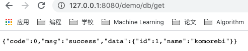


### 1.4 集成Redis

1. 导包

* 添加Jedis依赖

* 添加Fastjson依赖（序列化, Bean对象转换成字符串，为json格式）

	```xml
	<!--Jedis-->
	<dependency>
	    <groupId>redis.clients</groupId>
	    <artifactId>jedis</artifactId>
	    <version>3.2.0</version>
	</dependency>
	<!--fastjson-->
	<dependency>
	    <groupId>com.alibaba</groupId>
	    <artifactId>fastjson</artifactId>
	    <version>1.2.75</version>
	</dependency>
	```


2. 在`application.properties`中配置参数

	```properties
	#redis
	redis.host=192.168.136.136
	redis.port=6379
	redis.timeout=10
	redis.password=123456
	redis.poolMaxTotal=1000
	redis.poolMaxIdle=500
	redis.poolMaxWait=500
	```

3. 编写RedisConfig类将参数读入
	`@Component` 和`@ConfigurationProperties(prefix=“redis”)`，将前缀为redis的配置对应上RedisConfig类中属性

	```java
	package com.komorebi.redis;
	
	import org.springframework.boot.context.properties.ConfigurationProperties;
	import org.springframework.stereotype.Component;
	
	// Redis配置类，包含所有的properties里面的配置信息
	@Component
	@ConfigurationProperties(prefix="redis")
	public class RedisConfig {
	    private String host;
	    private int port;
	    private int timeout;//秒
	    private String password;
	    private int poolMaxTotal;
	    private int poolMaxIdle;
	    private int poolMaxWait;//秒
	
	    get + set ...
	}
	```

4. 编写RedisPoolFactory类，在JedisPoolFactory方法中，配置生成JedisPool，JedisPool作为Bean，自动装配到service中

	```java
	package com.komorebi.redis;
	
	import org.springframework.beans.factory.annotation.Autowired;
	import org.springframework.context.annotation.Bean;
	import org.springframework.stereotype.Service;
	import redis.clients.jedis.JedisPool;
	import redis.clients.jedis.JedisPoolConfig;
	
	// 实例化JedisPool对象
	@Service
	public class RedisPoolFactory {
	    @Autowired
	    RedisConfig redisConfig;
	
	    @Bean
	    public JedisPool JedisPoolFactory() {
	        JedisPoolConfig poolConfig = new JedisPoolConfig();
	        poolConfig.setMaxIdle(redisConfig.getPoolMaxIdle());
	        poolConfig.setMaxTotal(redisConfig.getPoolMaxTotal());
	        poolConfig.setMaxWaitMillis(redisConfig.getPoolMaxWait() * 1000);
	        JedisPool jp = new JedisPool(poolConfig, redisConfig.getHost(), redisConfig.getPort(),
	                redisConfig.getTimeout() * 1000, redisConfig.getPassword(), 0);
	        return jp;
	    }
	}
	```

5. 创建RedisService类，提供各类操作。这里使用fastjson将Bean对象转换成字符串存入Redis，取出时由字符串转换成指定类型对象

	```java
	@Service
	public class RedisService {
	
	    @Autowired
	    JedisPool jedisPool;
	
	    /**
	     * 获取单个对象
	     * @param prefix
	     * @param key
	     * @param clazz
	     * @param <T>
	     * @return
	     */
	    public <T> T get(KeyPrefix prefix, String key, Class<T> clazz) {
	        Jedis jedis = null;
	        try {
	            jedis = jedisPool.getResource();
	            //生成真正的key
	            String realKey = prefix.getPrefix() + key;
	            String str = jedis.get(realKey);
	            T t = stringToBean(str, clazz);
	            return t;
	        } finally {
	            returnToPool(jedis);
	        }
	    }
	
	    /**
	     * 设置对象
	     * @param prefix
	     * @param key
	     * @param value
	     * @param <T>
	     * @return
	     */
	    public <T> boolean set(KeyPrefix prefix, String key, T value) {
	        Jedis jedis = null;
	        try {
	            jedis = jedisPool.getResource();
	            String realKey = prefix.getPrefix() + key;
	            String str = beanToString(value);
	            if(str == null || str.length() <= 0) {
	                return false;
	            }
	            int seconds = prefix.expireSeconds();
	            if (seconds <= 0) {
	                jedis.set(realKey, str);
	            } else {
	                jedis.setex(realKey, seconds, str);
	            }
	
	            return true;
	        } finally {
	            returnToPool(jedis);
	        }
	    }
	
	    /**
	     * 判断key是否存在
	     * @param prefix
	     * @param key
	     * @param <T>
	     * @return
	     */
	    public <T> boolean exists(KeyPrefix prefix, String key) {
	        Jedis jedis = null;
	        try {
	            jedis = jedisPool.getResource();
	            String realKey = prefix.getPrefix() + key;
	
	            return jedis.exists(realKey);
	        } finally {
	            returnToPool(jedis);
	        }
	    }
	
	    public <T> boolean delete(KeyPrefix prefix, String key) {
	        Jedis jedis = null;
	        try {
	            jedis = jedisPool.getResource();
	            String realKey = prefix.getPrefix() + key;
	
	            long ret = jedis.del(realKey);
	            return ret > 0;
	        } finally {
	            returnToPool(jedis);
	        }
	    }
	
	    /**
	     * 增加value值,原子操作
	     * @param prefix
	     * @param key
	     * @param <T>
	     * @return
	     */
	    public <T> Long incr(KeyPrefix prefix, String key) {
	        Jedis jedis = null;
	        try {
	            jedis = jedisPool.getResource();
	            String realKey = prefix.getPrefix() + key;
	
	            return jedis.incr(realKey);
	        } finally {
	            returnToPool(jedis);
	        }
	    }
	
	    /**
	     * 减少value值,原子操作
	     * @param prefix
	     * @param key
	     * @param <T>
	     * @return
	     */
	    public <T> Long decr(KeyPrefix prefix, String key) {
	        Jedis jedis = null;
	        try {
	            jedis = jedisPool.getResource();
	            String realKey = prefix.getPrefix() + key;
	
	            return jedis.decr(realKey);
	        } finally {
	            returnToPool(jedis);
	        }
	    }
	
	    public static <T> String beanToString(T value) {
	        if (value == null) {
	            return null;
	        }
	        Class<?> clazz = value.getClass();
	        if (clazz == int.class || clazz == Integer.class) {
	            return ""+value;
	        } else if (clazz == String.class) {
	            return (String)value;
	        } else if (clazz == long.class || clazz == Long.class) {
	            return ""+value;
	        } else {
	            return JSON.toJSONString(value);
	        }
	    }
	
	    public static  <T> T stringToBean(String str, Class<T> clazz) {
	
	        if (str == null || str.length() <= 0 || clazz == null) {
	            return null;
	        }
	        if (clazz == int.class || clazz == Integer.class) {
	            return (T)Integer.valueOf(str);
	        } else if (clazz == String.class) {
	            return (T)str;
	        } else if (clazz == long.class || clazz == Long.class) {
	            return (T)Long.valueOf(str);
	        } else {
	            return JSON.toJavaObject(JSON.parseObject(str), clazz);
	        }
	    }
	
	    private void returnToPool(Jedis jedis) {
	        if (jedis != null) {
	            jedis.close();  //返回到连接池中
	        }
	    }
	
	    public boolean delete(KeyPrefix prefix) {
	        if(prefix == null) {
	            return false;
	        }
	        List<String> keys = scanKeys(prefix.getPrefix());
	        if(keys==null || keys.size() <= 0) {
	            return true;
	        }
	        Jedis jedis = null;
	        try {
	            jedis = jedisPool.getResource();
	            jedis.del(keys.toArray(new String[0]));
	            return true;
	        } catch (final Exception e) {
	            e.printStackTrace();
	            return false;
	        } finally {
	            if(jedis != null) {
	                jedis.close();
	            }
	        }
	    }
	
	    public List<String> scanKeys(String key) {
	        Jedis jedis = null;
	        try {
	            jedis = jedisPool.getResource();
	            List<String> keys = new ArrayList<String>();
	            String cursor = "0";
	            ScanParams sp = new ScanParams();
	            sp.match("*"+key+"*");
	            sp.count(100);
	            do{
	                ScanResult<String> ret = jedis.scan(cursor, sp);
	                List<String> result = ret.getResult();
	                if(result!=null && result.size() > 0){
	                    keys.addAll(result);
	                }
	                cursor = ret.getStringCursor();
	            }while(!cursor.equals("0"));
	            return keys;
	        } finally {
	            if (jedis != null) {
	                jedis.close();
	            }
	        }
	    }
	}
	```

### 1.5 通用缓存Key封装

> 多人开发不同模块时若不制定key命名规则，很可能出现key对应的数据被其他模块的覆盖的情况
> 这里使用给key加上前缀的方式区分不同模块，以**前缀+key**作为真正的redis里的key

使用**模板模式**

* 具体细节步骤实现定义在子类中，子类定义详细处理算法是不会改变算法整体结构
* 代码复用的基本技术，在数据库设计中尤为重要
* 存在一种反向的控制结构，通过一个父类调用其子类的操作，通过子类对父类进行扩展增加新的行为，符合“开闭原则”
* 缺点：每个不同的实现都需要定义一个子类，会导致类的个数增加，系统更加庞大

1. 接口`KeyPrefix`

	```java
	public interface KeyPrefix {
	
	    public int expireSeconds(); //有效期
	    public String getPrefix();
	}
	```

2. 抽象类`BasePrefix`，不含抽象方法，定义为抽象类，避免被实例化

	```java
	public abstract class BasePrefix implements KeyPrefix {
	
	    private int expireSeconds;
	    private String prefix;
	
	    public BasePrefix(String prefix) {
	        this(0, prefix);   //默认0代表永不过期
	    }
	
	    public BasePrefix(int expireSeconds, String prefix) {
	        this.expireSeconds = expireSeconds;
	        this.prefix = prefix;
	    }
	
	    @Override
	    public int expireSeconds() {
	        return expireSeconds;
	    }
	
	    @Override
	    public String getPrefix() {
	        String className = getClass().getSimpleName();
	        return className+":"+prefix;
	    }
	}
	```

3. 实现类`UserPrefix`

	```java
	public class UserKey extends BasePrefix{
	
		private UserKey(String prefix) {
			super(prefix);
		}
		public static UserKey getById = new UserKey("id");
		public static UserKey getByName = new UserKey("name");
	}
	```

4. 测试

	```java
	@RequestMapping("/redis/get")
	@ResponseBody
	public Result<User> redisGet() {
	    User user = redisService.get(UserKey.getById,""+1, User.class);
	    return Result.success(user);
	}
	
	@RequestMapping("/redis/set")
	@ResponseBody
	public Result<Boolean> redisSet() {
	    User user = new User();
	    user.setId(1);
	    user.setName("11111");
	
	    boolean b = redisService.set(UserKey.getById, ""+1, user); //真正的key为UserKey:id1
	    return Result.success(b);
	}
	```

	

## 二、实现登录功能

### 2.1 数据库设计


### 2.2 明文密码两次MD5处理

> HTTP使用明文传输，为了防止明文密码在网络传输，用户输入的明文密码MD5加密后再进行传输，
> 服务端接收到加密的密码后，为了防止数据库被盗后，通过彩虹表攻击查表获得密码，需要再次MD5加密，将加密结果和Salt写入数据库

两次MD5：

* 用户端：Pass = MD5（明文+固定Salt）

* 服务端：Pass = MD5（用户输入+随机Salt）

1. 工具类`MD5Util`

```java
public class MD5Util {
    public static String md5(String s) {
        return DigestUtils.md5Hex(s);
    }

    private static final String salt = "1a2b3c4d";

    public static String inputPassToFormPass(String inputPass) {
        String s = "" + salt.charAt(0) + salt.charAt(2) + inputPass + salt.charAt(5) + salt.charAt(4);
        return md5(s);
    }

    public static String formPassToDBPass(String formPass, String salt) {
        String s = "" + salt.charAt(0) + salt.charAt(2) + formPass + salt.charAt(5) + salt.charAt(4);
        return md5(s);
    }

    public static String inputPassToDBPass(String inputPass, String saltDB) {
        String formPass = inputPassToFormPass(inputPass);
        String dbPass = formPassToDBPass(formPass, saltDB);
        return dbPass;
    }

    public static void main(String[] args) {
        System.out.println(inputPassToFormPass("123456"));
        System.out.println(formPassToDBPass(inputPassToFormPass("123456"), "1a2b3c4d"));
        System.out.println(inputPassToDBPass("123456", "1a2b3c4d"));
    }
}
```

2. 在另一个js文件中保存客户端固定的salt，客户端提交输入，对明文密码做第一次MD5

3. `LoginController`

	```java
	@RequestMapping("/do_login")
	@ResponseBody
	public Result<Boolean> doLogin(HttpServletResponse response, @Valid LoginVo loginVo) {
	    log.info(loginVo.toString());
	    //登录
	    userService.login(response, loginVo);
	    return Result.success(true);
	}
	```

4. `MiaoshaUserService`中，对用户提交做第二次MD5后比对数据库

	```java
	public String login(HttpServletResponse response, LoginVo loginVo) {
	    if (loginVo == null) {
	        throw new GlobalException(CodeMsg.SERVER_ERROR);
	    }
	    String mobile = loginVo.getMobile();
	    String formPass = loginVo.getPassword();
	    //判断手机号是否存在
	    MiaoshaUser user = getById(Long.parseLong(mobile));
	    if (user == null) {
	        throw new GlobalException(CodeMsg.MOBILE_NOT_EXIST);
	    }
	    //验证密码
	    String dbPass = user.getPassword();
	    String saltDB = user.getSalt();
	    String calcPass = MD5Util.formPassToDBPass(formPass, saltDB);
	    if (!calcPass.equals(dbPass)) {
	        throw new GlobalException(CodeMsg.PASSWORD_ERROR);
	    }
	    //生成token,Cookie,将token和对应用户写入第三方缓存redis
	    String token = UUIDUtil.uuid();
	    addCookie(user, response, token);
	    return token;
	}
	
	public void addCookie(HttpServletResponse response, String token, SpikeUser user) {
	    redisService.set(SpikeUserKey.token, token, user);
	
	    Cookie cookie = new Cookie(COOKIE_NAME_TOKEN, token);
	    cookie.setMaxAge(SpikeUserKey.token.expireSeconds());
	    cookie.setPath("/");
	
	    response.addCookie(cookie);
	}
	```

	

### 2.3 JSR303参数检验

1. `Controller`中参数前加上`@Valid`注释

	```java
	@RequestMapping("/do_login")
	@ResponseBody
	public Result<Boolean> doLogin(HttpServletResponse response, @Valid LoginVo loginVo) {
	    log.info(loginVo.toString());
	    //登录
	    userService.login(response, loginVo);
	    return Result.success(true);
	}
	```

2. LoginVo对象在需要校验的参数前加上注解，这里自定义了一个IsMobile校验器

	```java
	public class LoginVo {
	
	    @NotNull
	    @IsMobile
	    private String mobile;
	    @NotNull
	    @Length(min=32) //formPass为32个字符，128字节
	    private String password;
	
	    public String getMobile() {
	        return mobile;
	    }
	
	    public void setMobile(String mobile) {
	        this.mobile = mobile;
	    }
	
	    public String getPassword() {
	        return password;
	    }
	
	    public void setPassword(String password) {
	        this.password = password;
	    }
	
	    @Override
	    public String toString() {
	        return "LoginVo{" +
	                "mobile='" + mobile + '\'' +
	                ", password='" + password + '\'' +
	                '}';
	    }
	}
	```

3. 编写`IsMobile`接口和`IsMobileValidator`实现类

	```java
	@Target({ METHOD, FIELD, ANNOTATION_TYPE, CONSTRUCTOR, PARAMETER })
	@Retention(RUNTIME)
	@Documented
	@Constraint(validatedBy = {IsMobileValidator.class })
	public @interface IsMobile {
		
		boolean required() default true;
		
		String message() default "手机号码格式错误";
	
		Class<?>[] groups() default { };
	
		Class<? extends Payload>[] payload() default { };
	}
	
	```

	```java
	public class IsMobileValidator implements ConstraintValidator<IsMobile, String> {
	
		private boolean required = false;
		
		public void initialize(IsMobile constraintAnnotation) {
			required = constraintAnnotation.required();
		}
	
		public boolean isValid(String value, ConstraintValidatorContext context) {
			if(required) {
				return ValidatorUtil.isMobile(value);
			}else {
				if(StringUtils.isEmpty(value)) {
					return true;
				}else {
					return ValidatorUtil.isMobile(value);
				}
			}
		}
	}
	```

4. `ValidatorUtil`类

	```java
	public class ValidatorUtil {
	    //正则表达式：第一位为1，后面加10位数字
	    private static final Pattern mobile_pattern = Pattern.compile("1\\d{10}");
	
	    public static boolean isMobile(String src) {
	        if (StringUtils.isEmpty(src)) {
	            return false;
	        }
	        Matcher m = mobile_pattern.matcher(src);
	        return m.matches();
	    }
	}
	```

### 2.4 全局异常处理

> 参数校验不通过会出现org.springframework.validation.BindException的异常，需要拦截这个绑定异常，输出错误信息。
>
> 这里自定义一个全局异常拦截器，使用@ControllerAdvice注解
> @ControllerAdvice可用于实现：
>
> 全局异常处理 @ExceptionHandler
> 全局数据绑定 @ModelAttribute
> 全局预处理 @ModelAttribute, @InitBinder

```java
@ControllerAdvice
@ResponseBody
public class GlobalExceptionHandler {

    @ExceptionHandler(value=Exception.class)//指明异常的处理类型
    public Result<String> exceptionHandler(HttpServletRequest request, Exception e){

        e.printStackTrace();
        if (e instanceof GlobalException) {
            GlobalException ex = (GlobalException)e;
            return Result.error(ex.getCm());
        } else if (e instanceof BindException) {  //处理BindException
            BindException ex = (BindException)e;
            List<ObjectError> errors = ex.getAllErrors();
            ObjectError error = errors.get(0);  //这里只取第一个，可以都取
            String msg = error.getDefaultMessage();
            return Result.error(CodeMsg.BIND_ERROR.fillArgs(msg));  //返回带参数的错误码
        } else {
            return Result.error(CodeMsg.SERVER_ERROR);
        }
    }
}
```

```java
package com.komorebi.exception;

import com.komorebi.result.CodeMsg;

// 全局异常
public class GlobalException extends RuntimeException {
    private static final long serialVersionUID = 1L;

    private CodeMsg cm;

    public GlobalException(CodeMsg cm) {
        super(cm.toString());
        this.cm = cm;
    }

    public CodeMsg getCm() {
        return cm;
    }
}
```


### 2.5 分布式Session

> 这里使用分布式缓存存储Session信息来实现分布式Session
>
> 1. 用户登录成功后生成token（SessionId）来标识用户，写到Cookie中传递给客户端，在随后的访问中Cookie中都包含这个token。
> 2. 服务端根据传来的token取得用户的Session信息

**步骤**

1. 使用UUID生成token
2. 将token(key)和对应用户(Session信息，value)写入第三方缓存Redis
3. 生成Cookie，将token写入Cookie
4. 将Cookie写入response

**执行**

1. ```java
  public String login(HttpServletResponse response, LoginVo loginVo) {
      if (loginVo == null) {
          throw new GlobalException(CodeMsg.SERVER_ERROR);
      }
      String mobile = loginVo.getMobile();
      String formPass = loginVo.getPassword();
      //判断手机号是否存在
      MiaoshaUser user = getById(Long.parseLong(mobile));
      if (user == null) {
          throw new GlobalException(CodeMsg.MOBILE_NOT_EXIST);
      }
      //验证密码
      String dbPass = user.getPassword();
      String saltDB = user.getSalt();
      String calcPass = MD5Util.formPassToDBPass(formPass, saltDB);
      if (!calcPass.equals(dbPass)) {
          throw new GlobalException(CodeMsg.PASSWORD_ERROR);
      }
      //生成token,Cookie,将token和对应用户写入第三方缓存redis
      String token = UUIDUtil.uuid();
      addCookie(user, response, token);
      return token;
  }
  
  private void addCookie(MiaoshaUser user, HttpServletResponse response, String token) {
      //将token和对应用户写入第三方缓存redis
      //set(prefix, key, value),这里使用prefix+key作为redis的key
      redisService.set(MiaoshaUserKey.token,token,user);
      //生成Cookie
      Cookie cookie = new Cookie(COOKIE_NAME_TOKEN, token);
      cookie.setMaxAge(MiaoshaUserKey.token.expireSeconds()); //设置有效期和session有效期一致
      //设置网站的根目录
      cookie.setPath("/");
      //写到response中
      response.addCookie(cookie);
  } 
  //从redis获得session信息
  //session有效期为最后一次访问时间加有效期时长
  public MiaoshaUser getByToken(String token, HttpServletResponse response) {
      if (StringUtils.isEmpty(token)) {
          return null;
      }
      MiaoshaUser user = redisService.get(MiaoshaUserKey.token, token, MiaoshaUser.class);
      //生成新cookie,来延长有效期
      if (user != null) {
          addCookie(user, response, token);
      }
      return user;
  }
  ```

2. 其他页面也需要获取token，为了获取SpikeUser对象，简化代码（直接将SpikeUser作为参数注入到Controller的方法中，像request, response, model一样可以直接获取，这些参数都是由ArgumentResolver往Controller框架里赋值。同样我们要对MiaoshaUser做参数解析，这样遍历方法参数时，发现有该参数，就会给它赋值。）

	1. 类`UserArgumentResolver`，实现接口HandlerMethodArgumentResolver

		```java
		@Service
		public class UserArgumentResolver implements HandlerMethodArgumentResolver {
		
		    @Autowired
		    MiaoshaUserService userService;
		
		    @Override
		    public boolean supportsParameter(MethodParameter parameter) {
		        Class<?> clazz = parameter.getParameterType();
		        return clazz == MiaoshaUser.class; //类型是MiaoshaUser才做处理
		    }
		
		    //做获取token和session信息的操作
		    @Override
		    public Object resolveArgument(MethodParameter methodParameter,
		           ModelAndViewContainer modelAndViewContainer, NativeWebRequest webRequest,
		           WebDataBinderFactory webDataBinderFactory) throws Exception {
		        HttpServletRequest request = webRequest.getNativeRequest(HttpServletRequest.class);
		        HttpServletResponse response = webRequest.getNativeResponse(HttpServletResponse.class);
		
		        String paramToken = request.getParameter(MiaoshaUserService.COOKIE_NAME_TOKEN);
		        String cookieToken = getCookieValue(request, MiaoshaUserService.COOKIE_NAME_TOKEN);
		        if (StringUtils.isEmpty(cookieToken) && StringUtils.isEmpty(paramToken)) {
		            return "login";
		        }
		        String token = StringUtils.isEmpty(paramToken)? cookieToken : paramToken;
		        return userService.getByToken(token, response);
		    }
		
		    private String getCookieValue(HttpServletRequest request, String cookieName) {
		        Cookie[] cookies = request.getCookies(); 
		        //遍历所有cookie
		        for (Cookie cookie:cookies) {
		            if (cookie.getName().equals(cookieName)) {
		                return cookie.getValue();
		            }
		        }
		        return null;
		    }
		}
		```

	2. 新建`WebConfig`继承WebMvcConfigurerAdapter，注册UserArgumentResolver

		```java
		@Configuration
		public class WebConfig extends WebMvcConfigurerAdapter{
		
		    @Autowired
		    UserArgumentResolver userArgumentResolver;
		
		    //给controller的方法赋值
		    @Override
		    public void addArgumentResolvers(List<HandlerMethodArgumentResolver> argumentResolvers) {
		        argumentResolvers.add(userArgumentResolver);
		    }
		}
		```

		


## 三、实现秒杀功能

**秒杀业务逻辑**：

1. 判断是否登录 ->没有，去登录
2. 判断是否有库存 ->没有，秒杀失败
3. 判断是否重复秒杀 -> 重复秒杀，秒杀失败
4. 秒杀商品（减库存 、下订单、 写入秒杀订单），跳转到订单详情页

**Service**：秒杀商品操作（减库存 、下订单、 写入秒杀订单）要作为一个事务执行，保证数据的一致性，这里要在详细订单表和秒杀订单表同时生成对应订单。为了确保秒杀操作中一个用户只能秒杀一件商品，我们给秒杀订单表miaosha_order表添加了（user_id，goods_id）的唯一索引，如果再次插入同一用户同一商品的订单，那么将不会被允许，事务插入失败后回滚。

### 3.1 数据库设计

* 设计四张表

```sql
DROP TABLE IF EXISTS `goods`;
CREATE TABLE `goods` (
  `id` bigint(20) NOT NULL AUTO_INCREMENT COMMENT '商品ID',
  `goods_name` varchar(16) DEFAULT NULL COMMENT '商品名称',
  `goods_title` varchar(64) DEFAULT NULL COMMENT '商品标题',
  `goods_img` varchar(64) DEFAULT NULL COMMENT '商品图片',
  `goods_detail` longtext COMMENT '商品详情',
  `goods_price` decimal(10,2) DEFAULT '0.00' COMMENT '商品单价',
  `goods_stock` int(11) DEFAULT '0' COMMENT '商品库存，-1表示没有限制',
  PRIMARY KEY (`id`)
) ENGINE=InnoDB AUTO_INCREMENT=3 DEFAULT CHARSET=utf8;

-- ----------------------------
-- Table structure for order_info
-- ----------------------------
DROP TABLE IF EXISTS `order_info`;
CREATE TABLE `order_info` (
  `id` bigint(20) NOT NULL AUTO_INCREMENT,
  `user_id` bigint(20) DEFAULT NULL COMMENT '用户ID',
  `goods_id` bigint(20) DEFAULT NULL COMMENT '商品ID',
  `delivery_addr_id` bigint(20) DEFAULT NULL COMMENT '收货地址ID ',
  `goods_name` varchar(16) DEFAULT NULL COMMENT '冗余过来的商品名称',
  `goods_count` int(11) DEFAULT '0' COMMENT '商品数量',
  `goods_price` decimal(10,2) DEFAULT '0.00' COMMENT '商品单价',
  `order_channel` tinyint(4) DEFAULT '0' COMMENT '1 PC 2 Android 3 IOS',
  `status` tinyint(4) DEFAULT '0' COMMENT '订单状态：0 新建未支付 1 已支付 2 已发货 3 已收货 4 已退款 5 已完成',
  `create_date` datetime DEFAULT NULL COMMENT '订单的创建时间',
  `pay_date` datetime DEFAULT NULL COMMENT '支付时间',
  PRIMARY KEY (`id`)
) ENGINE=InnoDB AUTO_INCREMENT=12 DEFAULT CHARSET=utf8;

-- ----------------------------
-- Table structure for spike_goods
-- ----------------------------
DROP TABLE IF EXISTS `spike_goods`;
CREATE TABLE `spike_goods` (
  `id` bigint(20) NOT NULL AUTO_INCREMENT COMMENT '秒杀的商品表',
  `goods_id` bigint(20) DEFAULT NULL COMMENT '商品ID',
  `spike_price` decimal(10,2) DEFAULT '0.00' COMMENT '秒杀价',
  `stock_count` int(11) DEFAULT NULL COMMENT '库存数量',
  `start_date` datetime DEFAULT NULL COMMENT '秒杀开始时间',
  `end_date` datetime DEFAULT NULL COMMENT '秒杀结束时间',
  PRIMARY KEY (`id`)
) ENGINE=InnoDB AUTO_INCREMENT=3 DEFAULT CHARSET=utf8;

-- ----------------------------
-- Table structure for spike_order
-- ----------------------------
DROP TABLE IF EXISTS `spike_order`;
CREATE TABLE `spike_order` (
  `id` bigint(20) NOT NULL AUTO_INCREMENT,
  `user_id` bigint(20) DEFAULT NULL COMMENT '用户ID',
  `order_id` bigint(20) DEFAULT NULL COMMENT '订单ID',
  `goods_id` bigint(20) DEFAULT NULL COMMENT '商品ID',
  PRIMARY KEY (`id`)
) ENGINE=InnoDB AUTO_INCREMENT=3 DEFAULT CHARSET=utf8;
```

* 实现基本的GoodsVo以及相应的dao-service-controller实现

	* 在联表查询时，可以将要查出来的数据封装成一个新的对象

		```java
		public class GoodsVo extends Goods {
		    private Double spikePrice;
		    private Integer stockCount;
		    private Date startDate;
		    private Date endDate;
		}
		```

	* 查询语句

		```java
		@Mapper
		public interface GoodsDao {
		    @Select("select g.*, sg.spike_price, sg.stock_count, sg.start_date, sg.end_date from spike_goods sg left join goods g on sg.goods_id = g.id")
		    public List<GoodsVo> listGoodsVo();
		}
		```

### 3.2 商品列表页

goods_list.html

```java
@RequestMapping("/to_list")
public String list(Model model, SpikeUser user) {
    model.addAttribute("user", user);

    // 查询商品列表
    List<GoodsVo> goodsList = goodsService.listGoodsVo();
    model.addAttribute("goodsList", goodsList);

    return "goods_list";
}
```

### 3.3 商品详情页

goods_detail.html

```java
@RequestMapping("/to_detail/{goodsId}")
public String detail(Model model, SpikeUser user, @PathVariable("goodsId")long goodsId) {
    model.addAttribute("user", user);

    GoodsVo goods = goodsService.getGoodsVoByGoodsId(goodsId);
    model.addAttribute("goods", goods);

    // 记录秒杀时间线的各种状态
    long startAt = goods.getStartDate().getTime();
    long endAt = goods.getEndDate().getTime();
    long now = System.currentTimeMillis();

    int spikeStatus = 0;
    int remainSeconds = 0;

    if (now < startAt) {            // 秒杀未开始
        spikeStatus = 0;
        remainSeconds = (int)(startAt - now) / 1000;
    }
    else if (now > endAt) {         // 秒杀已结束
        spikeStatus = 2;
        remainSeconds = -1;
    }
    else {                          // 秒杀进行中
        spikeStatus = 1;
        remainSeconds = 0;
    }
    model.addAttribute("spikeStatus", spikeStatus);
    model.addAttribute("remainSeconds", remainSeconds);
    return "goods_detail";
}
```

### 3.4 订单详情页

order_detail.html

### 3.5 倒计时的设计

```javascript
	function countDown(){
        var remainSeconds = $("#remainSeconds").val();
        var timeout;
        if(remainSeconds > 0){                                  //秒杀还没开始，倒计时
            $("#buyButton").attr("disabled", true);
            $("#spikeTip").html("秒杀倒计时：" + remainSeconds + "秒");
            timeout = setTimeout(function(){
                $("#countDown").text(remainSeconds - 1);
                $("#remainSeconds").val(remainSeconds - 1);
                countDown();
            },1000);
        }else if(remainSeconds == 0){                           //秒杀进行中
            $("#buyButton").attr("disabled", false);
            if(timeout){
                clearTimeout(timeout);
            }
            $("#spikeTip").html("秒杀进行中");

            $("#verifyCodeImg").attr("src", "/spike/verifyCode?goodsId="+$("#goodsId").val());
            $("#verifyCodeImg").show();
            $("#verifyCode").show();

        }else{                                                  //秒杀已经结束
            $("#buyButton").attr("disabled", true);
            $("#spikeTip").html("秒杀已经结束");
            $("#verifyCodeImg").hide();
            $("#verifyCode").hide();
        }
    }
```


## 四、JMeter压测

### 4.1 JMeter入门

* http://jmeter.apache.org/
* Apache JMeter是Apache组织开发的基于Java的压力测试工具。用于对软件做压力测试，它最初被设计用于Web应用测试，但后来扩展到其他测试领域。 它可以用于测试静态和动态资源，例如静态文件、Java 小服务程序、CGI 脚本、Java 对象、数据库、FTP 服务器， 等等。JMeter 可以用于对服务器、网络或对象模拟巨大的负载，来自不同压力类别下测试它们的强度和分析整体性能。另外，JMeter能够对应用程序做功能/回归测试，通过创建带有断言的脚本来验证你的程序返回了你期望的结果。为了最大限度的灵活性，JMeter允许使用**正则表达式**创建断言。
* 安装完成，直接sh 目录/bin/jmeter
* 步骤：
	* 1. 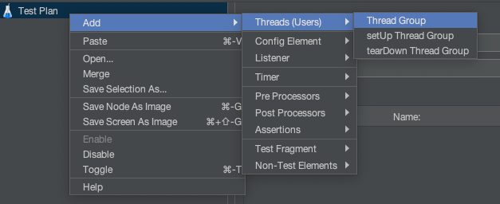
		2. 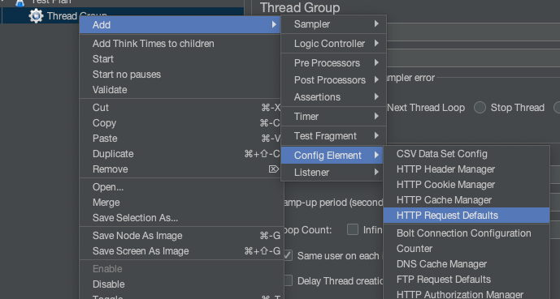
		3. 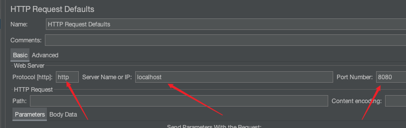
		4. 
		5. 
		6. 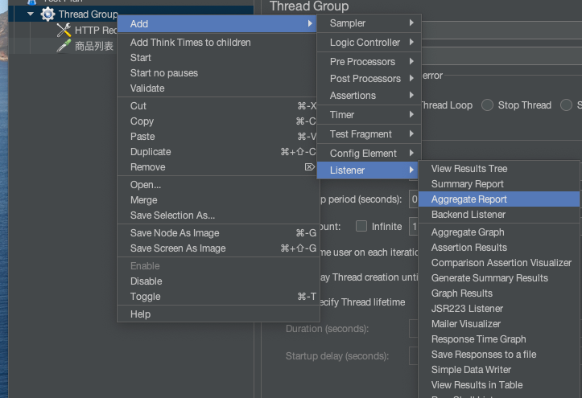
		7. 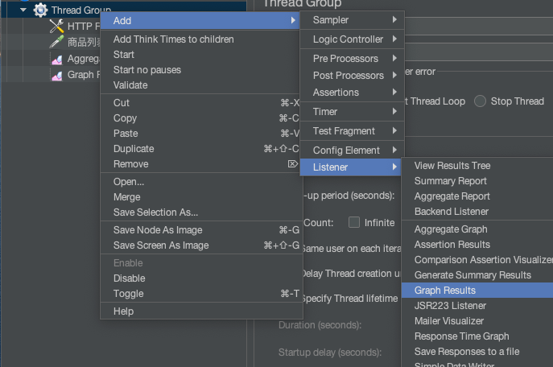

### 4.2 自定义变量模拟多用户

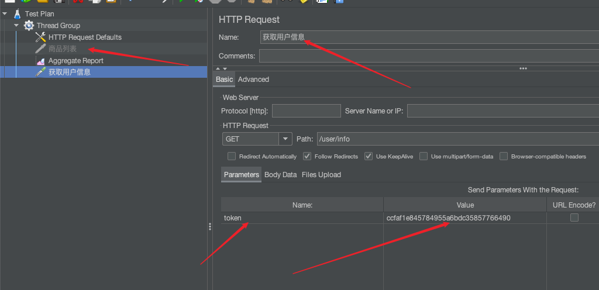

1. 测试计划 --> 添加配置元件 --> CSV Data Set Config
	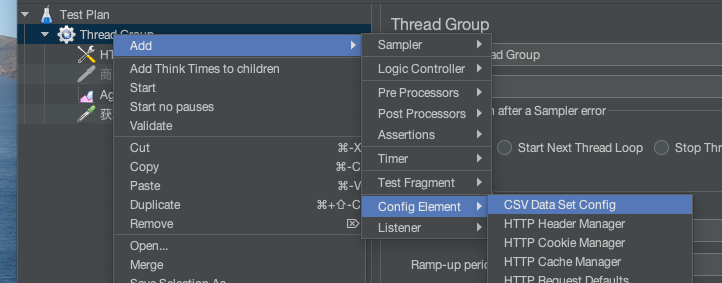
	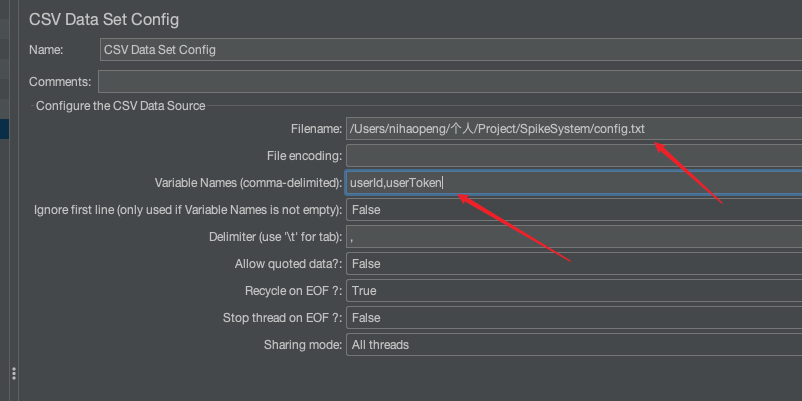
2. 引用变量${}
	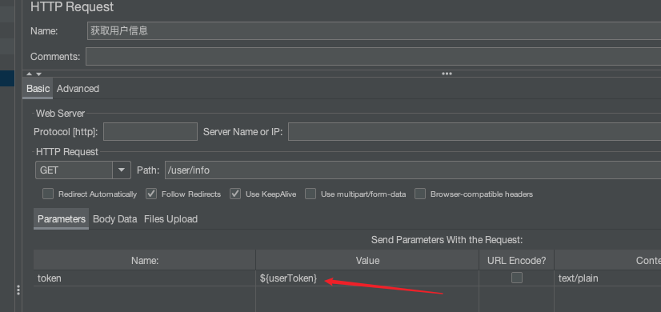

### 4.3 JMeter命令行使用

1. 写好jmx（就4.2中的配置），就保存为jmx文件

2. ```bash
	sh jmeter.sh -n -t XXX.jmx -l result.jtl
	```

3. 把result.jtl导入jmeter

### 4.4 redis-benchmark

1. 100个并发连接，100000个请求

	```bash
	redis-benchmark -h 127.0.0.1 -p 6379 -c 100 -n 100000
	```

2. 存取大小为100字节的数据包

	```bash
	redis-benchmark -h 127.0.0.1 -p 6379 -q -d 100
	```

3. 只测试某些操作的性能

	```bash
	redis-benchmark -t set,lpush -n 100000 -q
	```

4. 只测试某些数值存取的性能

	```bash
	redis-benchmark -n 100000 -q script load "redis.call('set','foo','bar')"
	```

### 4.5 SpringBoot打war包

1. 添加Spring-boot-starter-tomcat的provided依赖

	```xml
	<!--Tomcat-provided-->
	<dependency>
	    <groupId>org.springframework.boot</groupId>
	    <artifactId>spring-boot-starter-tomcat</artifactId>
	    <scope>provided</scope>
	</dependency>
	```

2. 添加maven-war-plugin插件

	```xml
	<plugin>
	    <groupId>org.apache.maven.plugins</groupId>
	    <artifactId>maven-war-plugin</artifactId>
	    <configuration>
	        <failOnMissingWebXml>false</failOnMissingWebXml>
	    </configuration>
	</plugin>
	```

3. 修改main方法

	```java
	@SpringBootApplication
	public class MainApplication extends SpringBootServletInitializer {
	//public class MainApplication {
	    public static void main(String[] args) throws Exception {
	        SpringApplication.run(MainApplication.class, args);
	    }
	
	    @Override
	    protected SpringApplicationBuilder configure(SpringApplicationBuilder builder) {
	//        return super.configure(builder);
	        return builder.sources(MainApplication.class);
	    }
	}
	```

4. 放到tomcat路径下webapps里，运行即可

5. 若要打jar包，参考https://www.cnblogs.com/liumyblog/p/12982502.html，注意**pluginManagement**会对jar包打包有影响

## 五、页面优化技术

### 5.1 页面缓存+URL缓存+对象缓存

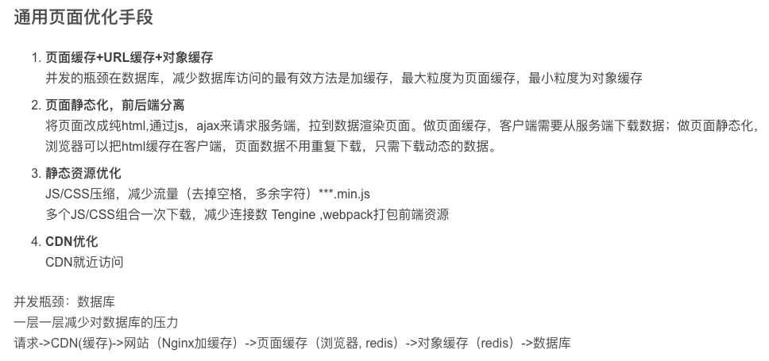


* 页面缓存：取缓存---手动渲染模板---结果输出


  * 访问一个页面时
  1. 取缓存 ->有，返回结果
  	2. 手动渲染模板
  3. 加入缓存，返回结果
  * 重写GoodsController中的list方法

  ```java
  @RequestMapping(value = "/to_list", produces = "text/html")
  @ResponseBody
  public String list(HttpServletRequest request, HttpServletResponse response, Model model, SpikeUser user) {
      model.addAttribute("user", user);
      // 页面缓存1：取缓存
      String html = redisService.get(GoodsKey.getGoodsList, "", String.class);
      if (!StringUtils.isEmpty(html)) {
          return html;
      }
  
      // 查询商品列表
      List<GoodsVo> goodsList = goodsService.listGoodsVo();
      model.addAttribute("goodsList", goodsList);
  
      //        return "goods_list";
  
      // 页面缓存2：手动渲染
      WebContext ctx = new WebContext(request, response, request.getServletContext(), request.getLocale(), model.asMap());
      html = thymeleafViewResolver.getTemplateEngine().process("goods_list", ctx);
      if (!StringUtils.isEmpty(html)) {
          redisService.set(GoodsKey.getGoodsList, "", html);
      }
      // 页面缓存3：结果输出
      return html;
  }
  ```

* URL缓存：类似页面缓存，重写detail方法

	```java
	@RequestMapping(value = "/to_detail/{goodsId}", produces = "text/html")
	@ResponseBody
	public String detail(HttpServletRequest request, HttpServletResponse response, Model model, SpikeUser user, @PathVariable("goodsId")long goodsId) {
	    model.addAttribute("user", user);
	
	    // URL缓存1：取缓存
	    String html = redisService.get(GoodsKey.getGoodsDetail, "" + goodsId, String.class);
	    if (!StringUtils.isEmpty(html)) {
	        return html;
	    }
	
	    // URL缓存2：手动渲染
	    GoodsVo goods = goodsService.getGoodsVoByGoodsId(goodsId);
	    model.addAttribute("goods", goods);
	
	    long startAt = goods.getStartDate().getTime();
	    long endAt = goods.getEndDate().getTime();
	    long now = System.currentTimeMillis();
	
	    int spikeStatus = 0;
	    int remainSeconds = 0;
	
	    if (now < startAt) {            // 秒杀未开始
	        spikeStatus = 0;
	        remainSeconds = (int)(startAt - now) / 1000;
	    }
	    else if (now > endAt) {         // 秒杀已结束
	        spikeStatus = 2;
	        remainSeconds = -1;
	    }
	    else {                          // 秒杀进行中
	        spikeStatus = 1;
	        remainSeconds = 0;
	    }
	    model.addAttribute("spikeStatus", spikeStatus);
	    model.addAttribute("remainSeconds", remainSeconds);
	    //        return "goods_detail";
	
	    WebContext ctx = new WebContext(request, response, request.getServletContext(), request.getLocale(), model.asMap());
	    html = thymeleafViewResolver.getTemplateEngine().process("goods_detail", ctx);
	    if (!StringUtils.isEmpty(html)) {
	        redisService.set(GoodsKey.getGoodsDetail, "" + goodsId, html);
	    }
	    // URL缓存3：结果输出
	    return html;
	}
	```

* 对象缓存，SpikeUserService中的getById方法(**在有数据更新的时候，必须把缓存进行处理**)

	* service只能调自己的dao，别的都调service，因为别的service中可能是有缓存处理的

	```java
	public SpikeUser getById(long id) {
	    // 对象缓存1：取缓存
	    SpikeUser user = redisService.get(SpikeUserKey.getById, "" + id, SpikeUser.class);
	    if (user != null) {
	        return user;
	    }
	    // 对象缓存2：取数据库
	    user = spikeUserDao.getById(id);
	    if (user != null) {
	        redisService.set(SpikeUserKey.getById, "" + id, user);
	    }
	    // 对象缓存3：结果输出
	    return user;
	}
	
	public boolean updatePassword(String token, long id, String formPass) {
	    // 取user
	    SpikeUser user = getById(id);
	    if (user == null) {throw new GlobalException(CodeMsg.MOBILE_NOT_EXIST);}
	    // 更新数据库
	    SpikeUser toBeUpdate = new SpikeUser();
	    toBeUpdate.setId(id);
	    toBeUpdate.setPassword(MD5Util.formPassToDBPass(formPass, user.getSalt()));
	    spikeUserDao.update(toBeUpdate);
	    // 处理缓存
	    redisService.delete(SpikeUserKey.getById, "" + id);
	    user.setPassword(toBeUpdate.getPassword());
	    redisService.set(SpikeUserKey.token, token, user);
	    return true;
	}
	```

* 最终效果：QPS可以从1250 --> 2850

### 5.2 页面静态化，前后端分离

* AngularJS、Vue.js

* 步骤

	* 1 controller

		```java
		// 页面静态化
		@RequestMapping(value = "/detail/{goodsId}")
		@ResponseBody
		public Result<GoodsDetailVo> detail(HttpServletRequest request, HttpServletResponse response, Model model, SpikeUser user, @PathVariable("goodsId")long goodsId) {
		    GoodsVo goods = goodsService.getGoodsVoByGoodsId(goodsId);
		
		    long startAt = goods.getStartDate().getTime();
		    long endAt = goods.getEndDate().getTime();
		    long now = System.currentTimeMillis();
		
		    int spikeStatus = 0;
		    int remainSeconds = 0;
		
		    if (now < startAt) {            // 秒杀未开始
		        spikeStatus = 0;
		        remainSeconds = (int)(startAt - now) / 1000;
		    }
		    else if (now > endAt) {         // 秒杀已结束
		        spikeStatus = 2;
		        remainSeconds = -1;
		    }
		    else {                          // 秒杀进行中
		        spikeStatus = 1;
		        remainSeconds = 0;
		    }
		    GoodsDetailVo vo = new GoodsDetailVo();
		    vo.setGoodsVo(goods);
		    vo.setUser(user);
		    vo.setRemainSeconds(remainSeconds);
		    vo.setSpikeStatus(spikeStatus);
		    return Result.success(vo);
		}
		```

	* 2 将html完全改成静态页面，通过ajax进行渲染

* 静态化秒杀页面

	* 1 SpikeContorller

		```java
		@RequestMapping(value = "/do_spike", method = RequestMethod.POST)
		@ResponseBody
		public Result<OrderInfo> spike(Model model, SpikeUser user, @RequestParam("goodsId")long goodsId) {
		    model.addAttribute("user", user);
		    if (user == null) {return Result.error(CodeMsg.SERVER_ERROR);}
		
		    // 判定库存
		    GoodsVo goods = goodsService.getGoodsVoByGoodsId(goodsId);
		    int stock = goods.getStockCount();
		    if (stock <= 0) { return Result.error(CodeMsg.SPIKE_OVER); }
		
		    // 判定是否已经秒杀到了
		    SpikeOrder order = orderService.getSpikeOrderByUserIdGoodsId(user.getId(), goodsId);
		    if (order != null) {return Result.error(CodeMsg.REPEAT_SPIKE);}
		
		    // 减库存，下订单，写入秒杀订单
		    OrderInfo orderInfo = spikeService.spike(user, goods);
		    return Result.success(orderInfo);
		}
		```

	* 2 html修改

### 5.3 静态资源优化

* 配置静态资源浏览器缓存

```properties
# Static
spring.web.resources.add-mappings=true
spring.web.resources.cache.period=3600
spring.web.resources.chain.cache=true
spring.web.resources.chain.enabled=true
spring.web.resources.chain.compressed=true
spring.web.resources.chain.html-application-cache=true
spring.web.resources.static-locations=classpath:/static/
```

* 常见方式：
	* 1 JS、CSS压缩，减少流量（min.js）
	* 2 多个JS和CSS组合，减少连接数
	* 3 CDN优化（就近访问）


## 六、接口优化

分库分表：mycat

**超卖问题**：

2. SQL加库存数量判断：防止库存变成负数(在每次数据库更新减一的前提是库存大于0，数据库本身会对这个线程加一个锁，不会出现两个线程同时更新的情况)
	```sql
	@Update("update spike_goods set stock_count = stock_count - 1 where goods_id = #{goodsId} and stock_count > 0")
	public int reduceStock(SpikeGoods g);
	```

2. 数据库加唯一索引：防止用户重复购买（一个用户同时发出两个请求（这个在后期验证码也可以缓解），这两个请求都会通过 **判定库存**--**判定是否已经秒杀到** 两个步骤，进入**减库存，下订单，写入秒杀订单**的步骤，添加唯一索引，在创建秒杀订单的同时发生错误，使得事务回滚）
	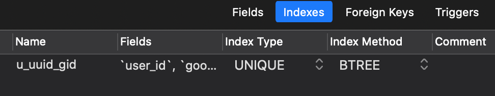

**保证缓存和数据库的一致性策略**

1. 读取：先从缓存读取，读到数据则直接返回；如果没有，就读数据库，并将数据写到缓存
2. 更新：先更新数据库，再删除缓存

**接口优化思路：减少数据库访问**

1. 系统初始化，把商品库存加载到Redis
2. 收到请求，Redis预减库存，库存不足，直接返回，否则进入3
3. 请求入队，立即返回排队中（目前不知道队中是否会失败，所以只返回排队中）
4. 请求出队，生成订单，减少库存
5. 客户端轮询，是否秒杀成功（4 5是并发执行的）

### 6.1 Redis预减库存，减少数据库访问

1. SpikeController实现InitializingBean接口

	```java
	// 1 系统初始化，把商品库存加载到Redis
	@Override
	public void afterPropertiesSet() throws Exception {
	    List<GoodsVo> goodsVoList = goodsService.listGoodsVo();
	    if (goodsVoList == null) {return;}
	    for (GoodsVo goodsVo : goodsVoList) {
	    	redisService.set(GoodsKey.getSpikeGoodsStock, "" + goodsVo.getId(), goodsVo.getStockCount());
	    }
	}
	```

2. spike函数中重写预减库存

	```java
	// 2.1 收到请求，Redis预减库存，库存不足，直接返回，否则进入3
	long stock = redisService.decr(GoodsKey.getSpikeGoodsStock, "" + goodsId);
	if (stock < 0) { return Result.error(CodeMsg.SPIKE_OVER);}
	
	// 2.2 判定是否已经秒杀到了
	SpikeOrder order = orderService.getSpikeOrderByUserIdGoodsId(user.getId(), goodsId);
	if (order != null) {return Result.error(CodeMsg.REPEAT_SPIKE);}
	```

### 6.2 内存标记localOverMap，减少Redis访问

当秒杀库存为0的时候，实际上也不需要再去访问Redis查看是否还有库存

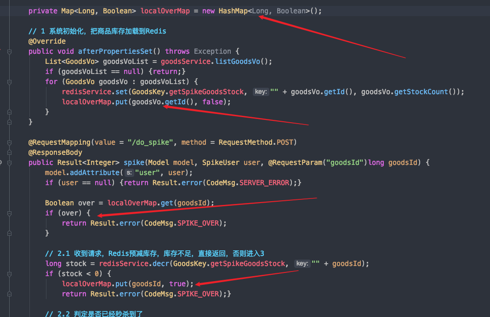

### 6.3 请求先入队缓冲，异步下单，增强用户体验

```java
// 3 入队
SpikeMessage spikeMessage = new SpikeMessage();
spikeMessage.setUser(user);
spikeMessage.setGoodsId(goodsId);
sender.sendSpikeMessage(spikeMessage);
return Result.success(0);
```

```java
// orderId：成功  -1: 秒杀失败  0：排队中
@RequestMapping(value = "/result", method = RequestMethod.GET)
@ResponseBody
public Result<Long> spikeResult(Model model, SpikeUser user, @RequestParam("goodsId")long goodsId) {
    model.addAttribute("user", user);
    if (user == null) {
        return Result.error(CodeMsg.SERVER_ERROR);
    }

    long result = spikeService.getSpikeResult(user.getId(), goodsId);
    return Result.success(result);
}
```

### 6.4 RabbitMQ安装与SpringBoot集成

rabbitmq交换器的**四种模式**：

**1.fanout**(一对多)：fanout类型的Exchange会把所有发送到该Exchange的消息路由到所有与它绑定的Queue中。 

**2.direct**：direct类型的Exchange会把消息路由到那些binding key与routing key完全匹配的Queue中。 

**3.topic**(多对一)：

​		topic类型的Exchange在匹配规则上进行了扩展，它与direct类型的Exchage相似，也是将消息路由到binding key与routing key相匹配的Queue中，但这里的匹配规则有些不同，它约定：routing key为一个句点号“. ”分隔的字符串（我们将被句点号“. ”分隔开的每一段独立的字符串称为一个单词），如“stock.usd.nyse”、 “nyse.vmw”、“quick.orange.rabbit”。

**4.header**：

​		headers类型的Exchange不依赖于routing key与binding key的匹配规则来路由消息，而是根据发送的消息内容中的headers属性进行匹配。在绑定Queue与Exchange时指定一组键值对；当消息发送到Exchange时，RabbitMQ会取到该消息的headers（也是一个键值对的形式），对比其中的键值对是否完全匹配Queue与Exchange绑定时指定的键值对；如果完全匹配则消息会路由到该Queue，否则不会路由到该Queue

1. 添加依赖spring-boot-starter-amqp

	```xml
	<!--amqp-->
	<dependency>
	    <groupId>org.springframework.boot</groupId>
	    <artifactId>spring-boot-starter-amqp</artifactId>
	</dependency>
	```

2. Application.properties

	```properties
	# RabbitMQ
	spring.rabbitmq.host=127.0.0.1
	spring.rabbitmq.port=5672
	spring.rabbitmq.username=guest
	spring.rabbitmq.password=guest
	spring.rabbitmq.virtual-host=/
	##消费者数量
	spring.rabbitmq.listener.simple.concurrency= 10
	spring.rabbitmq.listener.simple.max-concurrency= 10
	##消费者每次从队列中获取的消息数量
	spring.rabbitmq.listener.simple.prefetch= 1
	##消费者自动启动
	spring.rabbitmq.listener.simple.auto-startup=true
	##消费失败，自动重新入队
	spring.rabbitmq.listener.simple.default-requeue-rejected= true
	##启动发送重试
	spring.rabbitmq.template.retry.enabled=true
	spring.rabbitmq.template.retry.initial-interval=1000
	spring.rabbitmq.template.retry.max-attempts=3
	spring.rabbitmq.template.retry.max-interval=10000
	spring.rabbitmq.template.retry.multiplier=1.0
	```

3. MQConfig

	```java
	@Configuration
	public class MQConfig {
	
	    public static final String QUEUE = "queue";
	
	    @Bean
	    public Queue queue() {
	        return new Queue(QUEUE, true);
	    }
	}
	```

4. 创建消息接受者MQSender

	```java
	@Service
	public class MQSender {
	    @Autowired
	    AmqpTemplate amqpTemplate;
	
	    private static Logger log = LoggerFactory.getLogger(MQReveiver.class);
	
	    public void send(Object message) {
	        String msg = RedisService.beanToString(message);
	        log.info("send message" + msg);
	        amqpTemplate.convertAndSend(MQConfig.QUEUE, msg);
	    }
	}
	```

5. 创建消息发送者MQReceiver

	```java
	@Service
	public class MQReveiver {
	    private static Logger log = LoggerFactory.getLogger(MQReveiver.class);
	
	    @RabbitListener(queues = MQConfig.QUEUE)
	    public void receive(String message) {
	        log.info("receive message" + message);
	    }
	    
	    @RabbitListener(queues = MQConfig.SPIKE_QUEUE)
	    public void receiveSpikeQueue(String message) {
	        log.info("receive spike message: " + message);
	        SpikeMessage spikeMessage = RedisService.stringToBean(message, SpikeMessage.class);
	        SpikeUser spikeUser = spikeMessage.getUser();
	        long goodsId = spikeMessage.getGoodsId();
	
	        // 判定库存
	        GoodsVo goods = goodsService.getGoodsVoByGoodsId(goodsId);
	        int stock = goods.getStockCount();
	        if (stock <= 0) { return; }
	
	        // 判定是否已经秒杀到了
	        SpikeOrder order = orderService.getSpikeOrderByUserIdGoodsId(spikeUser.getId(), goodsId);
	        if (order != null) {return;}
	
	        // 减库存，下订单，写入秒杀订单
	        spikeService.spike(spikeUser, goods);
	    }
	}
	```

### 6.5 访问Nginx水平扩展

反向代理

负载均衡

### 6.6 压测

1300 --> 2100


## 七、安全优化

### 7.1 秒杀接口地址隐藏

思路：秒杀开始之前，先去请求接口获取秒杀地址

1. 接口改造，带上PathVariable参数
2. 添加生成地址的接口
3. 秒杀收到请求，先验证PathVariable

​       客户端点击秒杀时，先请求服务端获取秒杀地址path，服务端返回path，获得真正的秒杀url后，客户端再次请求，进行秒杀

（1）`MiaoshaController` 生成随机path，将path返回给客户端

```java
//隐藏秒杀接口地址
@RequestMapping(value="/path", method= RequestMethod.GET)
@ResponseBody
public Result<String> getMiaoshaPath(HttpServletRequest request, MiaoshaUser user,
                                     @RequestParam("goodsId") long goodsId,
                                     @RequestParam(value = "verifyCode") int verifyCode) {
    if (user == null) {
        return Result.error(CodeMsg.SESSION_ERROR);
    }
    //返回访问路径
    String path = miaoshaService.createMiaoshaPath(user, goodsId);
    return Result.success(path);
}
```

（2）`MiaoshaService` 生成随机数再用MD5加密来作为 该用户秒杀该商品的path，并将存入缓存，客户端获得path后会立马进行秒杀，所以path的有效期设置很短（有效期1分钟）

```java
public String createMiaoshaPath(MiaoshaUser user, long goodsId) {
    if (user == null || goodsId <= 0) {
        return null;
    }
    String str = MD5Util.md5(UUIDUtil.uuid()+"123456");
    redisService.set(MiaoshaKey.getMiaoshaPath,""+user.getId()+"_"+goodsId, str);
    return str;
}
```

（3）服务端收到秒杀请求时，根据用户id和商品id，检查对应的path是否正确后，再进行后面的秒杀逻辑。

```java
@RequestMapping(value="/{path}/do_miaosha", method= RequestMethod.POST)
@ResponseBody
public Result<Integer> miaosha(Model model, MiaoshaUser user,
                               @RequestParam("goodsId") long goodsId,
                               @PathVariable("path") String path) {
    if (user == null) {
        return Result.error(CodeMsg.SESSION_ERROR);
    }
    //验证path
    boolean check = miaoshaService.checkPath(user, goodsId, path);
    if (!check) {
        return Result.error(CodeMsg.REQUEST_ILLIEGAL);
    }
    //内存标记，减少redis访问，无库存后的请求无需访问redis
    boolean over = localOverMap.get(goodsId);
    if (over) {
        return Result.error(CodeMsg.MIAOSHA_OVER);
    }
    //收到请求，redis预减库存
    long stock = redisService.decr(GoodsKey.getMiaoshaGoodsStock, ""+goodsId);
    if (stock < 0) {
        localOverMap.put(goodsId,true);
        return Result.error(CodeMsg.MIAOSHA_OVER);
    }
    //判断是否已经秒杀到了，不能重复秒杀
    MiaoshaOrder order = orderService.getMiaoshaOrderByUserIdGoodsId(user.getId(), goodsId);
    if (order != null) {
        return Result.error(CodeMsg.REPEATE_MIAOSHA);
    }
    //入队
    MiaoshaMessage mm = new MiaoshaMessage();
    mm.setUser(user);
    mm.setGoodsId(goodsId);
    sender.sendMiaoshaMessage(mm);
    return Result.success(0); //排队中
}
```

（4）`MiaoshaService` 将收到的path参数和缓存中的比对

```java
public boolean checkPath(MiaoshaUser user, long goodsId, String path) {
    if (user == null || path == null) {
        return false;
    }
    String pathOld = redisService.get(MiaoshaKey.getMiaoshaPath,""+user.getId()+"_"+goodsId, String.class);
    return path.equals(pathOld);
}
```


### 7.2 数学公式验证码

思路：点击秒杀之前，先输入验证码，分散用户的请求

1. 添加生成验证码的接口
2. 在获取秒杀路径的时候，验证验证码
3. ScriptEngine使用

```java
// 生成图片验证码接口
@RequestMapping(value="/verifyCode", method=RequestMethod.GET)
@ResponseBody
public Result<String> getSpikeVerifyCode(HttpServletResponse response, SpikeUser user, long goodsId){
    if (user == null) {
        return Result.error(CodeMsg.SESSION_ERROR);
    }
    BufferedImage image = spikeService.createVerifyCode(user, goodsId);
    try {
        OutputStream out = response.getOutputStream();
        ImageIO.write(image, "JPEG", out);
        out.flush();
        out.close();
        return null;
    } catch (Exception e) {
        e.printStackTrace();
        return Result.error(CodeMsg.SPIKE_FAIL);
    }
}

public BufferedImage createVerifyCode(SpikeUser user, long goodsId) {
    if (user == null || goodsId <= 0) {
        return null;
    }
    int width = 80;
    int height = 32;
    //create the image
    BufferedImage image = new BufferedImage(width, height, BufferedImage.TYPE_INT_RGB);
    Graphics g = image.getGraphics();
    // set the background color
    g.setColor(new Color(0xDCDCDC));
    g.fillRect(0, 0, width, height);
    // draw the border
    g.setColor(Color.black);
    g.drawRect(0, 0, width - 1, height - 1);
    // create a random instance to generate the codes
    Random rdm = new Random();
    // make some confusion
    for (int i = 0; i < 50; i++) {
        int x = rdm.nextInt(width);
        int y = rdm.nextInt(height);
        g.drawOval(x, y, 0, 0);
    }
    // generate a random code
    String verifyCode = generateVerifyCode(rdm);
    g.setColor(new Color(0, 100, 0));
    g.setFont(new Font("Candara", Font.BOLD, 24));
    g.drawString(verifyCode, 8, 24);
    g.dispose();
    //把验证码存到redis中
    int rnd = calc(verifyCode);
    redisService.set(SpikeKey.getSpikeVerifyCode, user.getId()+","+goodsId, rnd);
    //输出图片
    return image;
}
```


### 7.3 接口防刷

**思路：对接口做限流，计时，并记录访问次数**

- 将一个用户的访问次数写到缓存里，同时给数据加有效期，次数增加直接对数据+1
- 如果在有效期内，数据超过某数值，访问返回失败
- 有效期过了，重新存入数据

* 可以用拦截器减少对业务侵入

1. 服务端生成秒杀地址前，先判断用户访问次数

  ```java
  	//隐藏秒杀接口地址
  	@RequestMapping(value="/path", method= RequestMethod.GET)
      @ResponseBody
      public Result<String> getMiaoshaPath(HttpServletRequest request, MiaoshaUser user,
                                           @RequestParam("goodsId") long goodsId,
                                           @RequestParam(value = "verifyCode") int verifyCode) {
          if (user == null) {
              return Result.error(CodeMsg.SESSION_ERROR);
          }
          //限制访问次数
          String uri = request.getRequestURI();
          String key = uri+"_"+user.getId();
          //限定5秒之内只能访问5次
          Integer count=redisService.get(AccessKey.access, key, Integer.class);
          if(count==null) {
              redisService.set(AccessKey.access, key, 1);   //缓存有效期5秒
          }else if(count<5) {
              redisService.incr(AccessKey.access, key);
          }else {//超过5次
              return Result.error(CodeMsg.ACCESS_LIMIT_REACHED);  //超过访问上限
          }
          //校验验证码
          boolean check = miaoshaService.checkVerifyCode(user, goodsId,verifyCode);
          if (!check) {
              return Result.error(CodeMsg.REQUEST_ILLIEGAL);
          }
          //返回访问路径
          String path = miaoshaService.createMiaoshaPath(user, goodsId);
          return Result.success(path);
      }
  ```

2. 通用接口限流防刷

	1. 可以使用拦截器减少对业务侵入

	2. 定义注解@AccessLimit（seconds=5, maxCount=5,needLogin=true），定义拦截器处理注解

		```java
		//隐藏秒杀接口地址
		@AccessLimit(seconds=5, maxCount=5, needLogin=true)
		@RequestMapping(value="/path", method= RequestMethod.GET)
		@ResponseBody
		public Result<String> getMiaoshaPath(HttpServletRequest request, MiaoshaUser user,
		                                     @RequestParam("goodsId") long goodsId,
		                                     @RequestParam(value = "verifyCode") int verifyCode) {
		    if (user == null) {
		        return Result.error(CodeMsg.SESSION_ERROR);
		    }
		    //限流防刷，查询访问次数，拦截器
		    //校验验证码
		    boolean check = miaoshaService.checkVerifyCode(user, goodsId,verifyCode);
		    if (!check) {
		        return Result.error(CodeMsg.REQUEST_ILLIEGAL);
		    }
		    //返回访问路径
		    String path = miaoshaService.createMiaoshaPath(user, goodsId);
		    return Result.success(path);
		}
		```

	3. 定义注解@AccessLimit

		```java
		@Retention(RetentionPolicy.RUNTIME) //注解会在class字节码文件中存在，在运行时可以通过反射获取到
		@Target(ElementType.METHOD) //定义注解的作用目标为方法
		public @interface AccessLimit {
		    int seconds(); //固定时长
		    int maxCount(); //最大访问次数
		    boolean needLogin() default true;  //是否需要登录
		}
		```

	4. 定义拦截器AccessInterceptor继承拦截器基类HandlerInterceptorAdapter

		```java
		@Service
		public class AccessInterceptor extends HandlerInterceptorAdapter{
		
		    @Autowired
		    MiaoshaUserService userService;
		    @Autowired
		    RedisService redisService;
		    
		    //在方法执行前做拦截
		    @Override
		    public boolean preHandle(HttpServletRequest request, HttpServletResponse response, Object handler) throws Exception {
		        if(handler instanceof HandlerMethod) {
		            MiaoshaUser user = getUser(request, response); //获取user
		            UserContext.setUser(user); //拦截器已获取user，将user使用ThreadLocal类保存（线程安全），便于取用
		
		            HandlerMethod hm = (HandlerMethod)handler;
		            AccessLimit accessLimit = hm.getMethodAnnotation(AccessLimit.class); //获取方法注解
		            if(accessLimit == null) { //无该注解直接返回true
		                return true;
		            }
		            int seconds = accessLimit.seconds();
		            int maxCount = accessLimit.maxCount();
		            boolean needLogin = accessLimit.needLogin();
		            String key = request.getRequestURI();
		            if(needLogin) {
		                if(user == null) {
		                    render(response, CodeMsg.SESSION_ERROR);
		                    return false;
		                }
		                key += "_" + user.getId();
		            } else {
		                //do nothing
		            }
		            AccessKey ak = AccessKey.withExpire(seconds);
		            Integer count = redisService.get(ak, key, Integer.class);
		            if (count == null) {
		                redisService.set(ak, key, 1);
		            } else if(count < maxCount){  //5秒内最多访问5次
		                redisService.incr(ak, key);
		            } else {
		                render(response, CodeMsg.ACCESS_LIMIT_REACHED); //给客户端返回错误提示
		                return false;
		            }
		        }
		        return true;
		    }
		
		    private MiaoshaUser getUser(HttpServletRequest request, HttpServletResponse response){
		        String paramToken = request.getParameter(MiaoshaUserService.COOKIE_NAME_TOKEN);
		        String cookieToken = getCookieValue(request, MiaoshaUserService.COOKIE_NAME_TOKEN);
		        if (StringUtils.isEmpty(cookieToken) && StringUtils.isEmpty(paramToken)) {
		            return null;
		        }
		        String token = StringUtils.isEmpty(paramToken)? cookieToken : paramToken;
		        return userService.getByToken(token, response);
		    }
		
		    private String getCookieValue(HttpServletRequest request, String cookieName) {
		        Cookie[] cookies = request.getCookies();
		        if (cookies == null || cookies.length <= 0) {
		            return null;
		        }
		        for (Cookie cookie:cookies) {
		            if (cookie.getName().equals(cookieName)) {
		                return cookie.getValue();
		            }
		        }
		        return null;
		    }
		    private void render(HttpServletResponse response, CodeMsg cm) throws Exception{
		    	//指定输出格式，否则会乱码
		        response.setContentType("application/json;charset=UTF-8");
		        OutputStream out = response.getOutputStream();
		        String str = JSON.toJSONString(Result.error(cm));
		        out.write(str.getBytes("UTF-8"));
		        out.flush();
		        out.close();
		    }
		}
		```

	5. UserContext 使用ThreadLocal类保存user

		```java
		public class UserContext {
		    //ThreadLocal与当前线程绑定，多线程下保证线程安全
		    private static ThreadLocal<MiaoshaUser> userHolder = new ThreadLocal<MiaoshaUser>();
		
		    public static void setUser(MiaoshaUser user) {
		        userHolder.set(user);
		    }
		    public static MiaoshaUser getUser() {
		        return userHolder.get();
		    }
		}
		```

	6. 需要使用user的时候从UserContext里取出

		```java
		@Service
		public class UserArgumentResolver implements HandlerMethodArgumentResolver {
		    @Autowired
		    MiaoshaUserService userService;
		
		    @Override
		    public boolean supportsParameter(MethodParameter parameter) {
		        Class<?> clazz = parameter.getParameterType();
		        return clazz == MiaoshaUser.class; //类型是MiaoshaUser才做处理
		    }
		    
		    public Object resolveArgument(MethodParameter methodParameter,
		           ModelAndViewContainer modelAndViewContainer, NativeWebRequest webRequest,
		           WebDataBinderFactory webDataBinderFactory) throws Exception {
		            return UserContext.getUser(); //从UserContext里取出
		    }
		}
		```

	7. 注册拦截器

		```java
		@Configuration
		public class WebConfig extends WebMvcConfigurerAdapter{
		
		    @Autowired
		    UserArgumentResolver userArgumentResolver;
		    @Autowired
		    AccessInterceptor accessInterceptor;
		
		    //给controller的方法赋值
		    @Override
		    public void addArgumentResolvers(List<HandlerMethodArgumentResolver> argumentResolvers) {
		        argumentResolvers.add(userArgumentResolver);
		    }
		
		    //注册拦截器
		    @Override
		    public void addInterceptors(InterceptorRegistry registry) {
		        registry.addInterceptor(accessInterceptor);
		    }
		}
		```

		

