[TOC]

# 红包雨

> 项目描述：
>
> 1. 以SpringBoot和SpringCloud为核心，结合MySQL、Redis、RabbitMQ等中间件，实现一个企业年会的红包雨场景，在指定时间内随机发放不同的奖品。
> 2. 第一步实现登录功能，将前台输入的账号密码做MD5处理后，发送到后台验证，验证成功先将信息脱敏，再放入Session；同时对错误次数计数，连错5次就锁定5分钟（Redis实现，锁定机制为过期时间5分钟）。
> 3. 第二步实现活动预热功能，预热逻辑：
> 	* 活动开始前一分钟扫描将要开始的活动
> 	* 将活动信息、活动策略信息加载到Redis
> 	* 按活动奖品信息，生成对应个数的时间戳做令牌，从小到大排好序，右侧入队生成令牌桶
> 	* 以令牌为Key，对应的奖品为Value，建立映射关系，为中奖后获取奖品做准备
> 4. 第三步实现抽奖功能，抽奖逻辑：
> 	* 登录判断，拦截登录失效的请求
> 	* 抽奖开始时，从令牌队列左侧获取令牌
> 	* 如果令牌小于当前时间，说明中奖，找到令牌对应的奖品，抽走
> 	* 如果令牌大于当前时间，说明未中奖，从左侧将令牌还回队列

**压测**：

* 1200->2500->3000

**LUA脚本**：

* 使用lua脚本，将抽奖的逻辑从java端移入redis服务器端，作为一个整体函数暴露给java调用，减少了java服务器与redis服务器之间的通信次数，性能会得到提升。

**抽奖策略能不能变**：

* 可以修改令牌生成部分代码。按递增，递减，正态分布等多种函数生成时间戳。

**Redis生成随机数为什么不行**：

* 为后续的优化做准备，这样时间戳的投放机制可以考虑别的

**实现活动暂停功能**：

* 要实现活动随时暂停，可以新增一个接口，该接口修改redis缓存中的活动状态。抽奖接口逻辑中增加暂停状态判断。如果是暂停，返回给前台以提示。


## 一、系统描述及要求

**并发性：**

* 抽奖系统比如涉及到访问量大的问题。系统涉及所面临的第一关。怎样设计系统以达到如此高并发情况下的及时响应是本项目的重中之重。

**库存控制：**

* 抽奖面临的必然是奖品。数量控制是必须要做到精准吻合。不允许出现设置了5个奖品，最终6人中奖这种类似的问题出现。其中的本质是奖品库存的控制。

**投放策略：**

* 在活动时间段内，管理员设置好的一堆奖品如何投放？红包何时出现？年会奖品什么时候可以被抽中？这些都涉及到投放策略。 

**边界控制：**

* 活动何时开始？何时结束？倒计时如何控制。这涉及到活动的边界。开始前要提防用户提前进入抽奖。结束后要及时反馈结果给用户，告知活动已结束。

**活动自由配置：**

* 活动的配置由后台管理员完成，可以自由配置活动的开始结束时间，主题、活动简介、有哪些奖品、不同等级的用户中奖的策略。这就要求系统必须具备足够的业务灵活度。

**中奖策略：**

* 每个用户参与抽奖后，要遵从后台管理员所设定的中奖策略，典型的场景是针对用户设置最大中奖数。一旦用户中奖后，要进入计数，达到最大中奖数后，即使活动未结束，用户继续参与，也不能再让其中奖。而是将奖品机会倾向于其他参与者。下面的章节中会为大家展示如何根据后台策略精确控制用户中奖数量。


## 二、中间件

### 2.1 zookeeper

> Zookeeper是一个分布式服务框架，是Apache Hadoop的一个子项目，主要是用来解决分布式应用中经常遇到的一些数据管理问题。如：统一命名服务、状态同步服务、集群管理、分布式应用配置项的管理等。

**节点类型**

* 临时节点：临时节点的生命周期和客户端会话绑定在一起，客户端会话失效，则这个节点就会被自动清除
* 永久节点：该数据节点被创建后，就会一直存在于zookeeper服务器上，直到有删除操作来主动删除这个节点。

**使用场景**

* 配置中心：将配置数据写到zk节点上，供各个分布式机器获取配置，同时监听自己对应的节点，实现配置信息的集中式管理和动态更新。
* 命名服务：在分布式系统中，通过使用命名服务
	* 客户端应用能够根据指定名字来获取资源或服务的地址、提供者信息。
	* 被命名的实体通常可以是集群中的机器，提供的服务地址、远程对象等，这些都可以统称为名字（Name）。
	* 通过调用zk提供的创建节点的API，能够创建一个全局唯一的path，这个path就可以称为一个名称。
* 分布式通知：zk的watcher注册与异步通知机制，能够很好的实现分布式环境下不同系统之间的通知与协调，实现对数据变更的实时处理。不同系统都对zk上同一个znode进行注册，监听znode的变化（包括znode本身内容及子节点的），其中一个系统update了znode，那么另一个系统能够收到通知，并作出相应处理。
* 选主：利用zk的一致性，能保证高并发场景下节点创建的全局唯一性。即，同时有多个客户端请求创建/currentMaster节点，最终一定只有一个客户端请求能够创建成功。利用这个特性，就能很轻松的在分布式环境中进行集群选取。
* 分布式锁：zk保证了数据的一致性，主要得益于zk的节点创建和事件监听机制。锁服务可以分为两类，一个是保持独占，另一个是控制时序。 

**高可用**

集群与选主：以5台机器启动时场景为主，过程如下：

1. 服务器1启动，此时只有它一台服务器启动了，它发出去的报没有任何响应，所以它的选举状态一直是LOOKING状态。
2. 服务器2启动，它与最开始启动的服务器1进行通信，互相交换自己的选举结果，由于两者都没有历史数据，所以id值较大的服务器2胜出，但是由于没有达到超过半数以上的服务器都同意选举它（这个例子中的半数以上是3），所以服务器1，2还是继续保持LOOKING状态。
3. 服务器3启动，根据前面的理论分析，服务器3成为服务器1，2，3中的老大，而与上面不同的是，此时有三台服务器选举了它，所以它成为了这次选举的leader。
4. 服务器4启动，根据前面的分析，理论上服务器4应该是服务器1，2，3，4中最大的，但是由于前面已经有半数以上的服务器选举了服务器3，状态是following，所以它只能接收当小弟的命了。
5. 服务器5启动，同4一样，当小弟。

 

### 2.2 nginx

> Nginx是一款轻量级的Web服务器/反向代理服务器及电子邮件(IMAP/POP3)代理服务器，在BSD-like协议下发行。特点是占用内存少，并发能力强。

**动静分离**

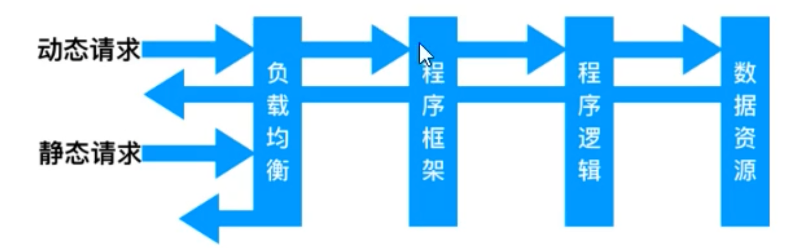

* 静态资源：由Nginx作为web服务器身份，直接返回
* 动态资源：Nginx将请求转发出去，交给后端应用服务器处理

**负载均衡**

​		当并发量较高时，需要多台服务器集群提升并行处理能力。


## 三、系统设计

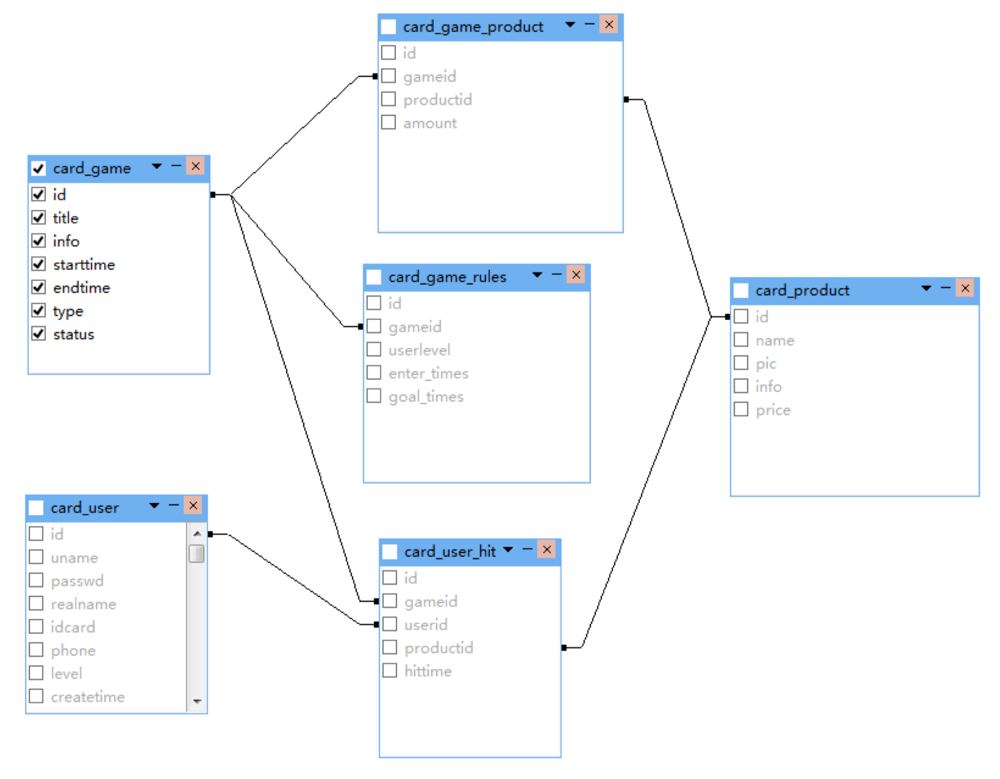

### 3.1 数据库设计

1. 会员表（card_user）
	

2. 奖品表（card_product）
	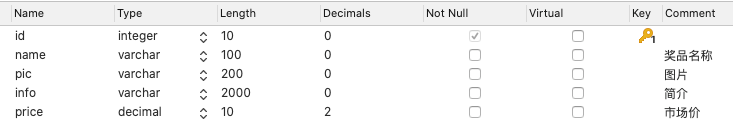

3. 活动表（card_game）
	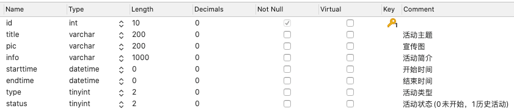

4. 活动-奖品关联表（card_game_product）
	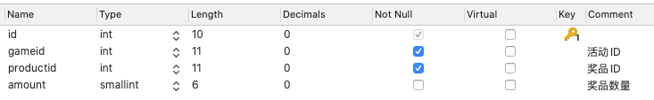

5. 规则表（card_game_rules）
	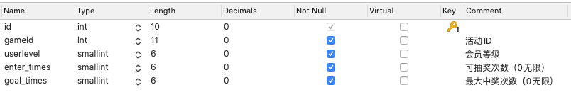

6. 用户-活动关联表（card_user_game）
	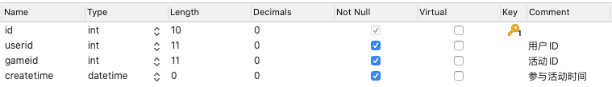

7. 用户-中奖记录表（card_user_hit）
	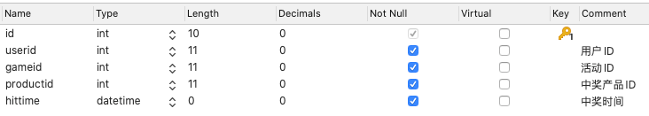

8. 新建五个视图，后续使用

  ```sql
  -- view_game_productnum
  select `c`.`gameid` AS `gameid`,sum(`c`.`amount`) AS `num` from `card_game_product` `c` group by `c`.`gameid`
  -- view_user_hitnum
  select `h`.`userid` AS `userid`,count(`h`.`id`) AS `num` from `card_user_hit` `h` group by `h`.`userid`
  -- view_game_hitnum
  select `h`.`gameid` AS `gameid`,count(`h`.`id`) AS `num` from `card_user_hit` `h` group by `h`.`gameid`
  -- view_game_curinfo
  select `g`.`id` AS `id`,`g`.`title` AS `title`,`g`.`starttime` AS `starttime`,`g`.`endtime` AS `endtime`,`sd2`.`dict_value` AS `type`,`cgp`.`num` AS `total`,`h`.`num` AS `hit` from (((`card_game` `g` left join `view_game_productnum` `cgp` on((`g`.`id` = `cgp`.`gameid`))) left join `view_game_hitnum` `h` on((`g`.`id` = `h`.`gameid`))) join `sys_dict` `sd2` on(((`g`.`type` = `sd2`.`dict_key`) and (`sd2`.`dict_type` = 'card_game_type'))))
  -- view_card_user_hit
  select `h`.`id` AS `id`,`g`.`title` AS `title`,`sd2`.`dict_value` AS `type`,`u`.`uname` AS `uname`,`u`.`realname` AS `realname`,`u`.`idcard` AS `idcard`,`u`.`phone` AS `phone`,`sd1`.`dict_value` AS `level`,`p`.`name` AS `name`,`p`.`price` AS `price`,`h`.`gameid` AS `gameid`,`h`.`userid` AS `userid`,`h`.`productid` AS `productid`,`h`.`hittime` AS `hittime` from (((((`card_game` `g` join `card_product` `p`) join `card_user` `u`) join `card_user_hit` `h`) join `sys_dict` `sd1` on(((`u`.`level` = `sd1`.`dict_key`) and (`sd1`.`dict_type` = 'card_user_level')))) join `sys_dict` `sd2` on(((`g`.`type` = `sd2`.`dict_key`) and (`sd2`.`dict_type` = 'card_game_type')))) where ((`h`.`gameid` = `g`.`id`) and (`h`.`userid` = `u`.`id`) and (`h`.`productid` = `p`.`id`))
  ```

9. 创建字典表（sys_dict）
	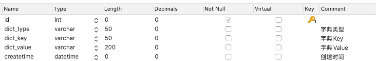

10. 录入字典表
	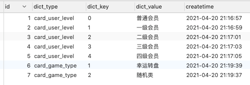

11. 日志表（sys_oplog）
	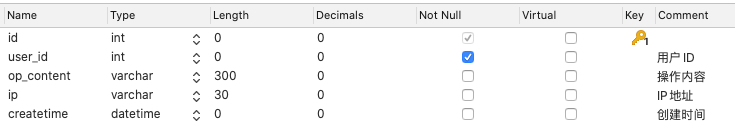


### 3.2 系统概要

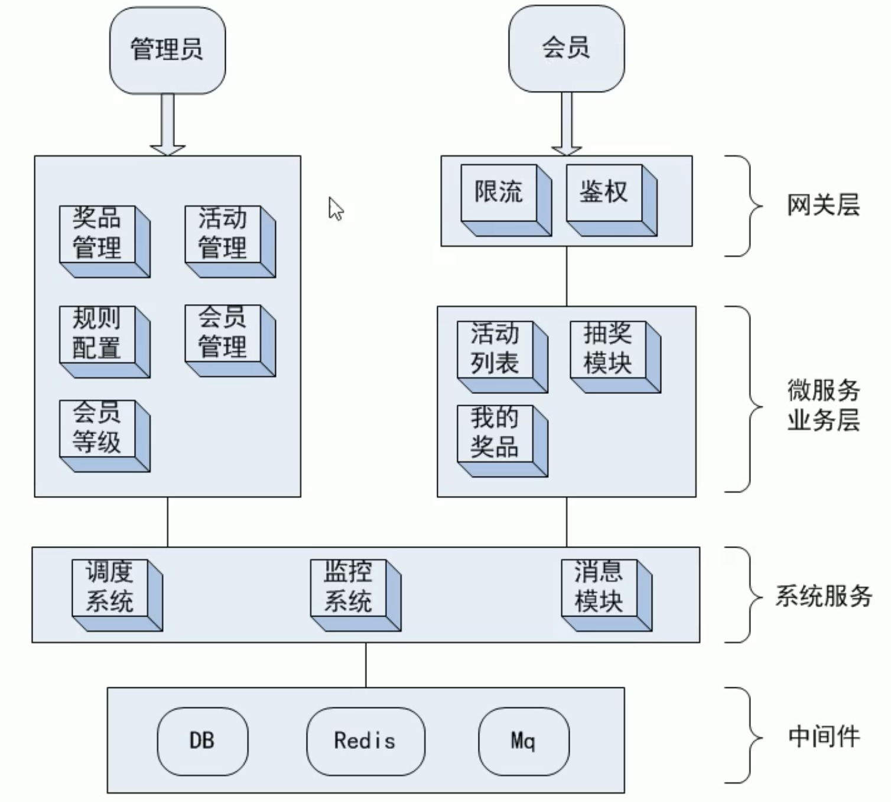


### 3.3 软件架构

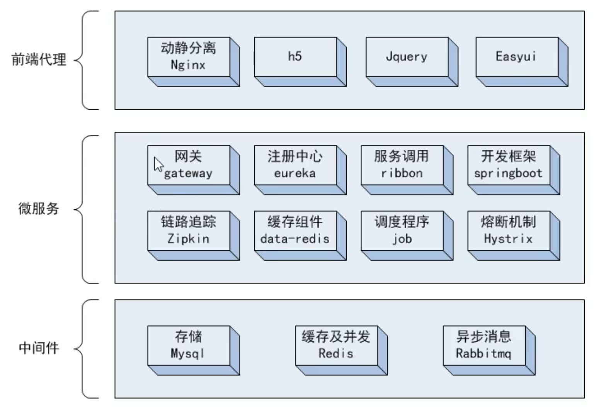

1. 动静分离
	1. 静态文件分离，Nginx直接响应，不用再绕后台应用机器
2. 微服务化
	1. 将模块细粒度拆分，微服务化
	2. 借助Docker swarm的容器管理功能，实现不同服务的副本部署，滚动更新
	3. 部署3份api，以适应前端的高并发
3. 负载均衡
	1. 多个实例之间通过Nginx做负载均衡，提升并发性能
	2. 项目展示的模块部署在一台节点，生产环境涉及多态机器，用upstream实现
4. 异步消息
	1. 中奖后，中奖人及奖品信息持久化到数据库。引入RabbitMQ，将抽奖操作与数据库操作异步隔离
	2. 中奖后，只需要将中奖信息放入RabbitMQ，并立即返回中奖信息给前端用户
	3. 后端msg模块消费RabbitMQ消息，缓慢处理
5. 缓存预热
	1. 每隔一分钟扫描一次活动表，查询未来一分钟内将要开始的活动
	2. 将扫到的活动加载进Redis，包括活动详细信息、中奖策略信息、奖品信息和抽奖令牌

### 3.4 交互序列图

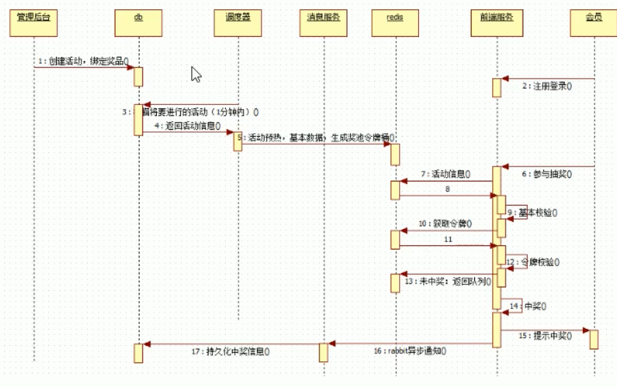

### 3.5 Redis缓存体系

缓存体系概览图

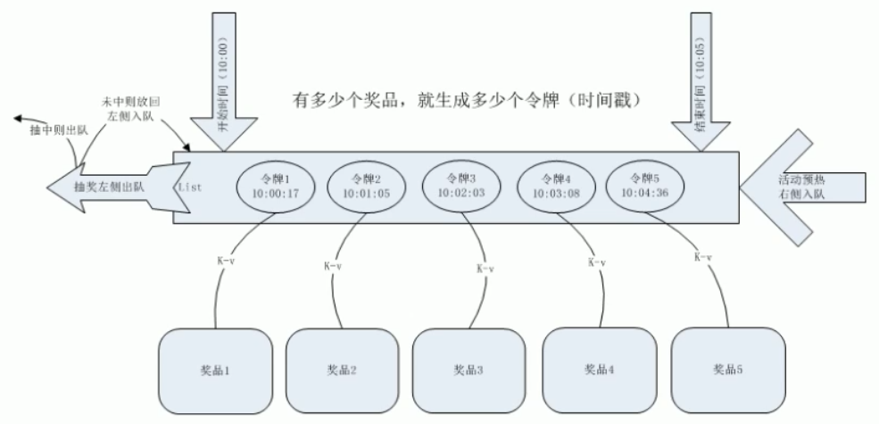

1. 活动基本信息（k-v，以活动ID为key，活动对象为value，永不超时）

	```java
	redisUtil.set(RedisKeys.INFO + game.getId(), game, -1);
	```

2. 活动策略信息（hash，以活动ID为key，用户等级为field，策略值为value）

	```java
	redisUtil.hset(RedisKeys.MAXGOAL + game.getId(), r.getUserLevel() + "", r.getGoalTimes());
	redisUtil.hset(RedisKeys.MAXEnter + game.getId(), r.getUserLevel() + "", r.getEnterTimes());
	```

3. 抽奖令牌桶（双端队列，以活动ID为key，在活动时间段内，随机生成时间戳做令牌，从小到大排序后从右侧入队）

	```java
	redisUtil.rightPushAll(RedisKeys.TOKENS + game.getId(), tokenList);
	```

4. 奖品映射信息（k-v，以活动ID_令牌为key，奖品信息为value。如果令牌有效，则用令牌token值，获取奖品详细信息）

	```java
	redisUtil.set(RedisKeys.TOKEN + game.getId() + "_" + token, productMap.get(cgp.getProductid()), expire);
	```

5. 令牌设计技巧
	若时间间隔太短，奖品数量太多，会可能产生重复时间戳
	**解决方案：额外再附加一个随机因子，将（时间戳 * 1000 + 3位随机数）作为令牌**。抽奖时再除以1000还原时间戳。

	```java
	long duration = end - start;
	long rnd = start + new Random().nextInt((int)duration);
	long token = rnd * 1000 + new Random().nextInt(999);
	```

6. 中奖计数（k-v，以活动id_用户id作为key，中奖数为value，利用redis原子性，中奖后incr增加计数）

	```java
	redisUtil.incr(RedisKeys.USERHIT + gameId + "_" + user.getId(), 1);
	```

7. 中奖逻辑判断：抽奖时，从令牌桶左侧出队和当前时间比较，如果令牌时间戳小于等于当前时间，令牌有效，表示中奖。大于当前时间，则令牌无效，将令牌还回，从左侧压入队列


## 四、框架选型

### 4.1 Docker 

docker 启动四个中间件（mysql  redis  rabbitmq  zookeeper）

```shell
# mysql，配置在本机端口+1
docker pull mysql:5.7.4
docker run --name mysql -v /Users/nihaopeng/个人/Project/PrizeRain/opt/scripts/data/mysql:/var/lib/mysql -p 3307:3306 -e MYSQL_ROOT_PASSWORD=root -d mysql:5.7.4
# redis
docker pull redis
docker run --name redis -p 6380:6379 -d redis
# rabbitmq
docker pull rabbitmq:3.6.10-management
docker run -d --hostname my-rabbit --name rabbit -p 15673:15672 -p 5673:5672 rabbitmq:3.6.10-management
# zookeeper
docker pull zookeeper:3.4.13
docker run --name zookeeper -v /Users/nihaopeng/个人/Project/PrizeRain/opt/scripts/data/zksingle:/data -p 2182:2181 -e ZOO_LOG4J_PROP="INFO,ROLLINGFILE" -d zookeeper:3.4.13
```

### 4.2 管理后台

* 开源zcurd开发平台，完成后台基本的增删改查
* 步骤
	* 1 idea打开`/Users/nihaopeng/个人/Project/PrizeRain`包，导包
	* 2 运行backend.sql
	* 3 配置maven运行， 用tomcat7:run插件运行
		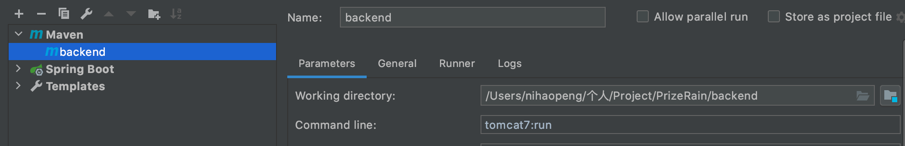
	* 4 浏览器访问localhost:8888

### 4.3 后台微服务搭建

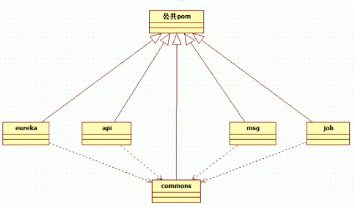

**配置zkui**

* 修改config.cfg中：`zkServer=127.0.0.1:2182`以及访问端口9091
* 打开当前目录命令行，再压缩回jar包中：`jar uvf zkui.jar config.cfg`
* 运行`java -jar zkui.jar`
* 浏览器访问：localhost:9091
* 导入`export.txt`（注意修改rabbitmq  redis  mysql的端口）

**配置Redis**

* 导包`spring-boot-starter-data-redis`

* zk导入redis.txt

	```java
	/prize/application,dev=spring.redis.database=0
	/prize/application,dev=spring.redis.host=127.0.0.1
	/prize/application,dev=spring.redis.password=
	/prize/application,dev=spring.redis.pool.max-active=3
	/prize/application,dev=spring.redis.pool.max-idle=10
	/prize/application,dev=spring.redis.pool.max-wait=1000
	/prize/application,dev=spring.redis.pool.min-idle=1
	/prize/application,dev=spring.redis.port=6380
	/prize/application,dev=spring.redis.timeout=3000
	```

**配置elastic-job**

* 导包

* zk导入job.txt

	```java
	/prize/job,dev=elaticjob.zookeeper.session-timeout-milliseconds=5000
	/prize/job,dev=server.port=8085
	/prize/job,dev=spring.datasource.druid.joblog.driver-class-name=com.mysql.jdbc.Driver
	/prize/job,dev=spring.datasource.druid.joblog.password=root
	/prize/job,dev=spring.datasource.druid.joblog.url=jdbc:mysql://127.0.0.1:3307/event_log
	/prize/job,dev=spring.datasource.druid.joblog.username=root
	/prize/job,dev=spring.jpa.database=mysql
	/prize/job,dev=spring.jpa.hibernate.ddl-auto=update
	/prize/job,dev=spring.jpa.show-sql=true
	```

**配置RabbitMQ**

* 导包，放在commons中

* zk导入rabbitmq.txt

	```java
	/prize/application,dev=spring.rabbitmq.host=127.0.0.1
	/prize/application,dev=spring.rabbitmq.password=guest
	/prize/application,dev=spring.rabbitmq.port=5673
	/prize/application,dev=spring.rabbitmq.publisher-confirms=true
	/prize/application,dev=spring.rabbitmq.username=guest
	/prize/application,dev=spring.rabbitmq.virtual-host=/
	```

**配置数据源mysql mybatis session**

```txt
/prize/application,dev=spring.datasource.connectionProperties=druid.stat.mergeSql=true;druid.stat.slowSqlMillis=5000
/prize/application,dev=spring.datasource.driver-class-name=com.mysql.jdbc.Driver
/prize/application,dev=spring.datasource.filters=stat,wall,log4j
/prize/application,dev=spring.datasource.initialSize=5
/prize/application,dev=spring.datasource.maxActive=20
/prize/application,dev=spring.datasource.maxPoolPreparedStatementPerConnectionSize=20
/prize/application,dev=spring.datasource.maxWait=60000
/prize/application,dev=spring.datasource.minEvictableIdleTimeMillis=300000
/prize/application,dev=spring.datasource.minIdle=5
/prize/application,dev=spring.datasource.password=root
/prize/application,dev=spring.datasource.poolPreparedStatements=true
/prize/application,dev=spring.datasource.testOnBorrow=false
/prize/application,dev=spring.datasource.testOnReturn=false
/prize/application,dev=spring.datasource.testWhileIdle=true
/prize/application,dev=spring.datasource.timeBetweenEvictionRunsMillis=60000
/prize/application,dev=spring.datasource.type=com.alibaba.druid.pool.DruidDataSource
/prize/application,dev=spring.datasource.url=jdbc:mysql://127.0.0.1:3307/prize?useUnicode=true&characterEncoding=utf-8
/prize/application,dev=spring.datasource.useGlobalDataSourceStat=true
/prize/application,dev=spring.datasource.username=root
/prize/application,dev=spring.datasource.validationQuery=SELECT 'x'
    
/prize/application,dev=mybatis.mapper-locations=classpath:mapper/*.xml

/prize/application,dev=spring.session.store-type=redis
```

### 4.4 工具

**zkui**

* 访问`127.0.0.1:9091`，账号密码都为admin

**mybatis-generator**

* maven导入pom.xml，点击generate

**分页PageHelper**

* 在查询之前，调用startPage，设置页码及条数

* `PageBean.java`

	```java 
	package com.itheima.prize.commons.utils;
	
	/**
	 * 分页bean
	 */
	
	import io.swagger.annotations.ApiModel;
	import io.swagger.annotations.ApiModelProperty;
	
	import java.util.List;
	@ApiModel("分页信息")
	public class PageBean<T> {
	    @ApiModelProperty(value = "当前页，1开始")
	    private Integer currentPage = 1;
	    @ApiModelProperty(value = "每页条数，默认10")
	    private Integer pageSize = 10;
	    @ApiModelProperty(value = "总条数")
	    private Long totalNum;
	    @ApiModelProperty(value = "是否有下一页")
	    private Integer isMore;
	    @ApiModelProperty(value = "总页数")
	    private Integer totalPage;
	    @ApiModelProperty(value = "开始索引")
	    private Integer startIndex;
	    @ApiModelProperty(value = "本页数据")
	    private List<T> items;
	
	    public PageBean() {
	        super();
	    }
	
	    public PageBean(Integer currentPage, Integer pageSize, Long totalNum, List<T> data) {
	        super();
	        this.currentPage = currentPage;
	        this.pageSize = pageSize;
	        this.totalNum = totalNum;
	        this.totalPage = Math.toIntExact((this.totalNum + this.pageSize - 1) / this.pageSize);
	        this.startIndex = (this.currentPage-1)*this.pageSize;
	        this.isMore = this.currentPage >= this.totalPage?0:1;
	        this.items=data;
	    }
	
	    // get + set
	```

**swagger2**

```java 
package com.itheima.prize.api.config;

import org.springframework.beans.factory.annotation.Value;
import org.springframework.context.annotation.Bean;
import org.springframework.context.annotation.Configuration;
import springfox.documentation.builders.ApiInfoBuilder;
import springfox.documentation.builders.PathSelectors;
import springfox.documentation.builders.RequestHandlerSelectors;
import springfox.documentation.service.ApiInfo;
import springfox.documentation.service.Contact;
import springfox.documentation.spi.DocumentationType;
import springfox.documentation.spring.web.plugins.Docket;
import springfox.documentation.swagger2.annotations.EnableSwagger2;

@Configuration
@EnableSwagger2
public class SwaggerConfig {

    @Value("${spring.application.name}")
    private String appName;

    @Bean
    public Docket docket() {
        return new Docket(DocumentationType.SWAGGER_2).apiInfo(apiInfo()).select()
//                   当前包路径
                .apis(RequestHandlerSelectors.basePackage("com.itheima.prize.api.action"))
                .paths(PathSelectors.any()).build();

    }

    //构建api文档的详细信息函数
    private ApiInfo apiInfo() {
        return new ApiInfoBuilder()
                //页面标题
                .title("抽奖系统前端"+appName)
                //创建人
                .contact(new Contact("Shawn", null, "wangshouwen@itcast.cn"))
                //版本号
                .version("1.0")
                //描述
                .description("提供给前端页面调用的相关接口")
                .build();
    }
}
```


## 五、代码实现

### 5.1 活动预热

> 预热逻辑：
>
> * 活动开始前一分钟扫描将要开始的活动
> * 将活动信息、活动策略信息加载到Redis
> * 按活动奖品信息，生成对应个数的时间戳做令牌，从小到大排好序，右侧入队
> * 以令牌为Key，对应的奖品为Value，建立映射关系，为中奖后获取奖品做准备
> * 抽奖开始时，从令牌队列左侧获取令牌
> * 如果令牌小于当前时间，说明中奖，找到令牌对应的奖品，抽走
> * 如果令牌大于当前时间，说明未中奖，从左侧将令牌还回队列


job模块中的`GameTask.java`

* tokenList两点：（1）大小和奖品数量相等（2）生成的token不等
* 排序后放入Redis

```java
package com.itheima.prize.job.task;

import ...

/**
 * 活动信息预热，每隔1分钟执行一次
 * 查找未来1分钟内（含），要开始的活动
 */
@Component
@ElasticSimpleJob(cron = "0 * * * * ?")
public class GameTask implements SimpleJob {
    private final static Logger log = LoggerFactory.getLogger(GameTask.class);
    @Autowired
    private CardGameMapper gameMapper;
    @Autowired
    private CardGameProductMapper gameProductMapper;
    @Autowired
    private CardGameRulesMapper gameRulesMapper;
    @Autowired
    private GameLoadMapper gameLoadMapper;
    @Autowired
    private RedisUtil redisUtil;

    @Override
    public void execute(ShardingContext shardingContext) {
        //当前时间
        Date now = new Date();
        //查询将来1分钟内要开始的活动
        CardGameExample example = new CardGameExample();
        CardGameExample.Criteria criteria = example.createCriteria();
        //开始时间大于当前时间
        criteria.andStarttimeGreaterThan(now);
        //小于等于（当前时间+1分钟）
        criteria.andStarttimeLessThanOrEqualTo(DateUtils.addMinutes(now,1));
        List<CardGame> list = gameMapper.selectByExample(example);
        if(list.size() == 0){
            //没有查到要开始的活动
            log.info("game list scan : size = 0");
            return;
        }
        log.info("game list scan : size = {}",list.size());
        //有相关活动数据，则将活动数据预热，进redis
        list.forEach(game ->{
            //活动开始时间
            long start = game.getStarttime().getTime();
            //活动结束时间
            long end = game.getEndtime().getTime();
            //计算活动结束时间到现在还有多少秒，作为redis key过期时间
            long expire = (end - now.getTime())/1000;
//            long expire = -1; //永不过期
            //活动持续时间（ms）
            long duration = end - start;

            //活动基本信息
            game.setStatus(1);
            redisUtil.set(RedisKeys.INFO+game.getId(),game,-1);
            log.info("load game info:{},{},{},{}", game.getId(),game.getTitle(),game.getStarttime(),game.getEndtime());

            //活动奖品信息
            List<CardProductDto> products = gameLoadMapper.getByGameId(game.getId());
            Map<Integer,CardProduct> productMap = new HashMap<>(products.size());
            products.forEach(p -> productMap.put(p.getId(),p));
            log.info("load product type:{}",productMap.size());

            //奖品数量等配置信息
            CardGameProductExample productExample = new CardGameProductExample();
            productExample.createCriteria().andGameidEqualTo(game.getId());
            List<CardGameProduct> gameProducts = gameProductMapper.selectByExample(productExample);
            log.info("load bind product:{}",gameProducts.size());

            //令牌桶
            List<Long> tokenList = new ArrayList();
            gameProducts.forEach(cgp ->{
                //生成amount个start到end之间的随机时间戳做令牌
                for (int i = 0; i < cgp.getAmount(); i++) {
                    long rnd = start + new Random().nextInt((int)duration);
                    //为什么乘1000，再额外加一个随机数呢？ - 防止时间段奖品多时重复
                    //记得取令牌判断时间时，除以1000，还原真正的时间戳
                    long token = rnd * 1000 + new Random().nextInt(999);
                    //将令牌放入令牌桶
                    tokenList.add(token);
                    //以令牌做key，对应的商品为value，创建redis缓存
                    log.info("token -> game : {} -> {}",token/1000 ,productMap.get(cgp.getProductid()).getName());
                    //token到实际奖品之间建立映射关系
                    redisUtil.set(RedisKeys.TOKEN + game.getId() +"_"+token,productMap.get(cgp.getProductid()),expire);
                }
            });
            
            //排序后放入redis队列，必须从小到大排好序
            Collections.sort(tokenList);
            log.info("load tokens:{}",tokenList);

            //从右侧压入队列，从左到右，时间戳逐个增大
            redisUtil.rightPushAll(RedisKeys.TOKENS + game.getId(),tokenList);
            redisUtil.expire(RedisKeys.TOKENS + game.getId(),expire);

            //奖品策略配置信息
            CardGameRulesExample rulesExample = new CardGameRulesExample();
            rulesExample.createCriteria().andGameidEqualTo(game.getId());
            List<CardGameRules> rules = gameRulesMapper.selectByExample(rulesExample);
            //遍历策略，存入redis hset
            rules.forEach(r -> {
                redisUtil.hset(RedisKeys.MAXGOAL +game.getId(),r.getUserlevel()+"",r.getGoalTimes());
                redisUtil.hset(RedisKeys.MAXENTER +game.getId(),r.getUserlevel()+"",r.getEnterTimes());
                log.info("load rules:level={},enter={},goal={}",r.getUserlevel(),r.getEnterTimes(),r.getGoalTimes());
            });
            redisUtil.expire(RedisKeys.MAXGOAL +game.getId(),expire);
            redisUtil.expire(RedisKeys.MAXENTER +game.getId(),expire);

            //活动状态变更为已预热，禁止管理后台再随便变动
            game.setStatus(1);
            gameMapper.updateByPrimaryKey(game);
        });
    }
}
```

### 5.2 抽奖模块

api模块中的`ActController.java`

**校验过程**

```java
		Date now = new Date();
        //获取活动基本信息
        CardGame game = (CardGame) redisUtil.get(RedisKeys.INFO+gameid);
        //判断活动是否开始
        //如果活动信息还没加载进redis，无效
        //如果活动已经加载，预热完成，但是开始时间 > 当前时间，也无效
        if (game == null || game.getStarttime().after(now)){
            return new ApiResult(-1,"活动未开始",null);
        }
        //判断活动是否已结束
        if (now.after(game.getEndtime())){
            return new ApiResult(-1,"活动已结束",null);
        }
        //获取当前用户
        HttpSession session = request.getSession();
        CardUser user = (CardUser) redisUtil.get(RedisKeys.SESSIONID+session.getId());
        if (user == null){
            return new ApiResult(-1,"未登陆",null);
        }else{
            if (!redisUtil.hasKey(RedisKeys.USERGAME+user.getId()+"_"+gameid)){
                redisUtil.set(RedisKeys.USERGAME+user.getId()+"_"+gameid,1,(game.getEndtime().getTime() - now.getTime())/1000);
                //持久化抽奖记录，扔给消息队列处理
                CardUserGame userGame = new CardUserGame();
                userGame.setUserid(user.getId());
                userGame.setGameid(gameid);
                userGame.setCreatetime(new Date());
                rabbitTemplate.convertAndSend(RabbitKeys.QUEUE_PLAY,userGame);
            }
        }
        //用户已中奖次数
        Integer count = (Integer) redisUtil.get(RedisKeys.USERHIT+gameid+"_"+user.getId());
        if (count == null){
            count = 0;
            redisUtil.set(RedisKeys.USERHIT+gameid+"_"+user.getId(),count,(game.getEndtime().getTime() - now.getTime())/1000);
        }
        //根据会员等级，获取本活动允许的最大中奖数
        Integer maxcount = (Integer) redisUtil.hget(RedisKeys.MAXGOAL+gameid,user.getLevel()+"");
        //如果没设置，默认为0，即：不限制次数
        maxcount = maxcount==null ? 0 : maxcount;
        //次数对比
        if (maxcount > 0 && count >= maxcount){
            //如果达到最大次数，不允许抽奖
            return new ApiResult(-1,"您已达到最大中奖数",null);
        }
```

**抽奖过程**

* 抽奖原子性问题：lua脚本，将下面的操作变成一个原子性的操作

```java
		//以上校验全部通过，准许进入抽奖逻辑
        Long token = (Long) redisUtil.leftPop(RedisKeys.TOKENS+gameid);
        if (token == null){
            //令牌已用光，说明奖品抽光了
            return new ApiResult(-1,"奖品已抽光",null);
        }
        //判断令牌时间戳大小，即是否中奖
        //这里记住，取出的令牌要除以1000，参考job项目，令牌生成部分
        if (now.getTime() < token/1000){
            //当前时间小于令牌时间戳，说明奖品未到发放时间点，放回令牌，返回未中奖
            redisUtil.leftPush(RedisKeys.TOKENS+gameid,token);
            return new ApiResult(0,"未中奖",null);
        }
// -----------------------------------------改成下面这样------------------------------------------------------
		Long token = luaScript.tokenCheck(RedisKeys.TOKENS + gameid, String.valueOf(now.getTime()));
        if (token == 0) {
            return new ApiResult(-1,"奖品已抽光",null);
        }
        else if (token == 1) {
            return new ApiResult(0,"未中奖",null);
        }
```

**中奖过程**

```java
        //以上逻辑走完，说明很幸运，中奖了！
        //抽中的奖品：
        CardProduct product = (CardProduct) redisUtil.get(RedisKeys.TOKEN + gameid +"_"+token);
        //中奖次数加1
        redisUtil.incr(RedisKeys.USERHIT+gameid+"_"+user.getId(),1);
        //投放消息给队列，中奖后的耗时业务，交给消息模块处理
        CardUserHit hit = new CardUserHit();
        hit.setGameid(gameid);
        hit.setHittime(now);
        hit.setProductid(product.getId());
        hit.setUserid(user.getId());
        rabbitTemplate.convertAndSend(RabbitKeys.EXCHANGE_DIRECT,RabbitKeys.QUEUE_HIT, hit);

        //返回给前台中奖信息
        return new ApiResult(1,"恭喜中奖",product);
    }

    @GetMapping("/info/{gameid}")
    @ApiOperation(value = "缓存信息")
    @ApiImplicitParams({
            @ApiImplicitParam(name="gameid",value = "活动id",example = "1",required = true)
    })
    public ApiResult info(@PathVariable int gameid){
        Map map = new LinkedHashMap<>();
        map.put(RedisKeys.INFO+gameid,redisUtil.get(RedisKeys.INFO+gameid));
        List<Object> tokens = redisUtil.lrange(RedisKeys.TOKENS+gameid,0,-1);
        Map tokenMap =new LinkedHashMap();
        tokens.forEach(o -> tokenMap.put(
                new SimpleDateFormat("yyyy-MM-dd HH:mm:ss.SSS").format(new Date(Long.valueOf(o.toString())/1000)),
                redisUtil.get(RedisKeys.TOKEN + gameid +"_"+o))
        );
        map.put(RedisKeys.TOKENS+gameid,tokenMap);
        map.put(RedisKeys.MAXGOAL+gameid,redisUtil.hmget(RedisKeys.MAXGOAL+gameid));
        map.put(RedisKeys.MAXENTER+gameid,redisUtil.hmget(RedisKeys.MAXENTER+gameid));
        return new ApiResult(200,"缓存信息",map);
    }
}
```

### 5.3 Lua脚本实现取令牌的原子性

`LuaScript.java`

```java
@Service
public class LuaScript{
    @Autowired
    private RedisTemplate redisTemplate;
 
    private DefaultRedisScript<Long> script;
 
    @PostConstruct
    public void init(){
        script = new DefaultRedisScript<Long>();
        script.setResultType(Long.class);
        script.setScriptSource(new ResourceScriptSource(new ClassPathResource("lua/tokenCheck.lua")));
    }
 
    public Long tokenCheck(String gamekey,String curtime){

        List<String> keys = new ArrayList();
        keys.add(gamekey);
        keys.add(curtime);

        Long result = (Long) redisTemplate.execute(script,keys,0,0);

        return result;
    }
}
```

`tokenCheck.lua`

```lua
local token = redis.call('lpop',KEYS[1])
local curtime = tonumber(KEYS[2])

if token ~= false then
    if ( tonumber(token)/1000 > tonumber(KEYS[2]) ) then
       redis.call('lpush',KEYS[1],token)
       return 1
    else
       return tonumber(token)
    end
else
    return 0
end
```

### 5.4 登录登出

api中的`LoginController.java`

**登录验证**

```java
@PostMapping("/login")
@ApiOperation(value = "登录")
@ApiImplicitParams({
    @ApiImplicitParam(name="account",value = "用户名",required = true),
    @ApiImplicitParam(name="password",value = "密码",required = true)
})
public ApiResult login(HttpServletRequest request, @RequestParam String account,@RequestParam String password) {
    Integer errortimes = (Integer) redisUtil.get(RedisKeys.USERLOGINTIMES+account);
    if (errortimes != null && errortimes >= 5){
        return new ApiResult(0, "密码错误5次，请5分钟后再登录",null);
    }
    CardUserExample userExample = new CardUserExample();
	userExample.createCriteria().andUnameEqualTo(account).andPasswdEqualTo(PasswordUtil.encodePassword(password));
    List<CardUser> users = userMapper.selectByExample(userExample);
    if (users != null && users.size() > 0) {
        CardUser user = users.get(0);
        //信息脱敏，不要将敏感信息带入session以免其他接口不小心泄露到前台
        user.setPasswd(null);
        user.setIdcard(null);
        HttpSession session = request.getSession();
        session.setAttribute("loginUserId", user.getId());
        redisUtil.set("loginUser:" + user.getId(), session.getId());
        redisUtil.set(RedisKeys.SESSIONID+session.getId(),user);
        return new ApiResult(1, "登录成功",user);
    } else {
        //错误计数，5次锁定5分钟
        redisUtil.incr(RedisKeys.USERLOGINTIMES+account,1);
        redisUtil.expire(RedisKeys.USERLOGINTIMES+account,60 * 5);
        return new ApiResult(0, "账户名或密码错误",null);
    }
}
```

**登出验证**

```java
@GetMapping("/logout")
@ApiOperation(value = "退出")
public ApiResult logout(HttpServletRequest request){
    HttpSession session = request.getSession();
    if (session != null){
        redisUtil.del("loginUser:" +  session.getAttribute("loginUserId"));
        session.invalidate();
    }
    return new ApiResult(1, "退出成功",null);
}
```

### 5.5 登录判断

**拦截器实现**

```java
package com.itheima.prize.api.config;

import ...
//拦截登录失效的请求
public class RedisSessionInterceptor implements HandlerInterceptor {
    @Autowired
    private RedisUtil redisUtil;

    @Override
    public boolean preHandle(HttpServletRequest request, HttpServletResponse response, Object handler) throws Exception {
        //无论访问的地址是不是正确的，都进行登录验证，登录成功后的访问再进行分发，404的访问自然会进入到错误控制器中
        HttpSession session = request.getSession();
        if (session.getAttribute("loginUserId") != null) {
            try {
                //验证当前请求的session是否是已登录的session
                String loginSessionId = (String) redisUtil.get("loginUser:" +  session.getAttribute("loginUserId"));
                if (loginSessionId != null && loginSessionId.equals(session.getId())) {
                    return true;
                }
            } catch (Exception e) {
                e.printStackTrace();
            }
        }

        response401(response);
        return false;
    }

    private void response401(HttpServletResponse response) {
        response.setCharacterEncoding("UTF-8");
        response.setContentType("application/json; charset=utf-8");

        try {
            response.getWriter().print(JSON.toJSONString(new ApiResult(-1, "用户未登录！", null)));
        } catch (IOException e) {
            e.printStackTrace();
        }
    }

    @Override
    public void postHandle(HttpServletRequest request, HttpServletResponse response, Object handler, ModelAndView modelAndView) throws Exception {

    }

    @Override
    public void afterCompletion(HttpServletRequest request, HttpServletResponse response, Object handler, Exception ex) throws Exception {

    }
}
```

**拦截器的注册**

```java
package com.itheima.prize.api.config;

import ...
@Configuration
public class WebSecurityConfig extends WebMvcConfigurerAdapter {
    @Bean
    public RedisSessionInterceptor getSessionInterceptor() {
        return new RedisSessionInterceptor();
    }

    @Override
    public void addInterceptors(InterceptorRegistry registry) {
        //所有已api开头的访问都要进入RedisSessionInterceptor拦截器进行登录验证，并排除login接口(全路径)。必须写成链式，分别设置的话会创建多个拦截器。
        //必须写成getSessionInterceptor()，否则SessionInterceptor中的@Autowired会无效
        registry.addInterceptor(getSessionInterceptor()).addPathPatterns("/api/act/**").addPathPatterns("/api/user/**");
        super.addInterceptors(registry);
    }
}
```

### 5.6 PageHelper

> 查询活动列表时，用PageHelper作为分页工具

`GameController.java`

**活动列表**

```java
@GetMapping("/list/{status}/{curpage}/{limit}")
@ApiOperation(value = "活动列表")
@ApiImplicitParams({
    @ApiImplicitParam(name="status",value = "活动状态（-1=全部，0=未开始，1=进行中，2=已结束）",example = "-1",required = true),
    @ApiImplicitParam(name = "curpage",value = "第几页",defaultValue = "1",dataType = "int", example = "1",required = true),
    @ApiImplicitParam(name = "limit",value = "每页条数",defaultValue = "10",dataType = "int",example = "3",required = true)
})
public ApiResult list(@PathVariable int status,@PathVariable int curpage,@PathVariable int limit) {
    Date now = new Date();
    CardGameExample example = new CardGameExample();
    CardGameExample.Criteria c = example.createCriteria();
    switch (status) {
        case -1:
            //查全部
            break;
        case 0:
            //未开始
            c.andStarttimeGreaterThan(now);break;
        case 1:
            //进行中
            c.andStarttimeLessThanOrEqualTo(now).andEndtimeGreaterThan(now);break;
        case 2:
            //已结束
            c.andEndtimeLessThanOrEqualTo(now);break;
    }
    long total = gameMapper.countByExample(example);
    example.setOrderByClause("starttime desc");
    PageHelper.startPage(curpage, limit);
    return new ApiResult(1,"成功",new PageBean<CardGame>(curpage,limit,total,gameMapper.selectByExample(example)));
}
```

**活动信息**

```java
@GetMapping("/info/{gameid}")
@ApiOperation(value = "活动信息")
@ApiImplicitParams({
    @ApiImplicitParam(name="gameid",value = "活动id",example = "1",required = true)
})
public ApiResult<CardGame> info(@PathVariable int gameid) {
    return new ApiResult(1,"成功",gameMapper.selectByPrimaryKey(gameid));
}
```

**奖品信息**

```java
@GetMapping("/products/{gameid}")
@ApiOperation(value = "奖品信息")
@ApiImplicitParams({
    @ApiImplicitParam(name="gameid",value = "活动id",example = "1",required = true)
})
public ApiResult<List<CardProductDto>> products(@PathVariable int gameid) {
    return new ApiResult(1,"成功",loadMapper.getByGameId(gameid));
}
```

**中奖列表**

```java
@GetMapping("/hit/{gameid}/{curpage}/{limit}")
@ApiOperation(value = "中奖列表")
@ApiImplicitParams({
    @ApiImplicitParam(name="gameid",value = "活动id",dataType = "int",example = "1",required = true),
    @ApiImplicitParam(name = "curpage",value = "第几页",defaultValue = "1",dataType = "int", example = "1",required = true),
    @ApiImplicitParam(name = "limit",value = "每页条数",defaultValue = "10",dataType = "int",example = "3",required = true)
})
public ApiResult<PageBean<ViewCardUserHit>> hit(@PathVariable int gameid,@PathVariable int curpage,@PathVariable int limit) {
    ViewCardUserHitExample example = new ViewCardUserHitExample();
    example.createCriteria().andGameidEqualTo(gameid);
    long total = hitMapper.countByExample(example);
    PageHelper.startPage(curpage, limit);
    List<ViewCardUserHit> all = hitMapper.selectByExample(example);
    return new ApiResult(1, "成功",new PageBean<ViewCardUserHit>(curpage,limit,total,all));
}
```

### 5.7 用户模块

**用户信息**

```java
@GetMapping("/info")
@ApiOperation(value = "用户信息")
public ApiResult info(HttpServletRequest request) {
    HttpSession session = request.getSession();
    CardUser user = (CardUser) redisUtil.get(RedisKeys.SESSIONID+session.getId());
    if (user == null){
        return new ApiResult(0, "登录超时",null);
    }else {
        CardUserDto dto = new CardUserDto(user);
        dto.setGames(cardUserGamesMapper.getGamesNumByUserId(user.getId()));
        dto.setProducts(cardUserGamesMapper.getPrizesNumByUserId(user.getId()));
        return new ApiResult(1, "成功",dto);
    }
}
```

**中奖信息**

```java
@GetMapping("/hit/{gameid}/{curpage}/{limit}")
@ApiOperation(value = "我的奖品")
@ApiImplicitParams({
    @ApiImplicitParam(name="gameid",value = "活动id（-1=全部）",dataType = "int",example = "1",required = true),
    @ApiImplicitParam(name = "curpage",value = "第几页",defaultValue = "1",dataType = "int", example = "1"),
    @ApiImplicitParam(name = "limit",value = "每页条数",defaultValue = "10",dataType = "int",example = "3")
})
public ApiResult hit(@PathVariable int gameid,@PathVariable int curpage,@PathVariable int limit,HttpServletRequest request) {
    HttpSession session = request.getSession();
    Integer userid = (Integer) session.getAttribute("loginUserId");
    if (userid == null){
        return new ApiResult(0, "登录超时",null);
    }
    ViewCardUserHitExample example = new ViewCardUserHitExample();
    ViewCardUserHitExample.Criteria criteria = example.createCriteria().andUseridEqualTo(userid);
    if (gameid != -1){
        criteria.andGameidEqualTo(gameid);
    }
    long total = hitMapper.countByExample(example);
    PageHelper.startPage(curpage, limit);
    List<ViewCardUserHit> all = hitMapper.selectByExample(example);
    return new ApiResult(1, "成功",new PageBean<ViewCardUserHit>(curpage,limit,total,all));

}
```


## 六、代码部署

> 1. 启动中间件：MySQL、Redis、RabbitMQ和Zookeeper
> 2. 启动Eureka
> 3. 启动job
> 4. 启动msg
> 5. 启动api
> 6. 启动管理后台，创建活动
> 7. 查看job日志，是否在开始前的一分钟，将活动整体预热成功
> 8. 请求抽奖接口，查看是否提示活动未开始
> 9. 开始后，请求抽奖接口，调试api，看是否可以正常抽奖
> 10. 中奖后，看msg日志，是否有中奖信息发送到消息模块
> 11. 查看数据库，确认中奖信息是否正常写入DB 

### 6.1 优化

1. lua脚本的运用
	使用lua脚本，将抽奖的逻辑从java端移入redis服务器端，作为一个整体函数暴露给java调用，减少了java服务器与redis服务器之间的通信次数，性能会得到提升。
2. 怎么实现活动暂停功能？
	要实现活动随时暂停，可以新增一个接口，该接口修改redis缓存中的活动状态。抽奖接口逻辑中增加暂停状态判断。如果是暂停，返回给前台以提示。
3. 怎么实现多种投放策略？
	投放策略即令牌的生成策略不同。可以修改令牌生成部分代码。按递增，递减，正态分布等多种函数生成时间戳。

